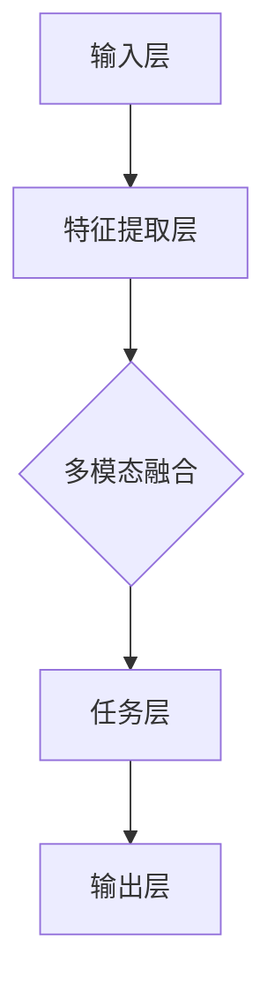

                 

# 多模态大模型：技术原理与实战 微调技术介绍

> **关键词：** 多模态、大模型、微调、技术原理、实战、人工智能
> 
> **摘要：** 本文旨在深入探讨多模态大模型的技术原理，特别是微调技术。通过一步步的逻辑分析，我们将揭示这些模型如何工作，如何实现微调，并展示其实际应用场景。

## 1. 背景介绍

### 1.1 目的和范围

本文的主要目的是探讨多模态大模型的技术原理，并特别关注微调技术。我们将首先介绍多模态大模型的概念，然后逐步深入探讨其工作原理和微调技术。本文旨在为读者提供一个全面、深入的理解，以便在实际项目中应用这些技术。

### 1.2 预期读者

本文适用于对人工智能和多模态大模型有一定了解的读者。无论您是研究人员、开发者还是对这一领域感兴趣的学习者，本文都将为您提供有价值的见解。

### 1.3 文档结构概述

本文将分为以下几个部分：

1. 背景介绍：介绍多模态大模型的概念和微调技术的重要性。
2. 核心概念与联系：讨论多模态大模型的核心概念，并提供一个Mermaid流程图来展示其架构。
3. 核心算法原理 & 具体操作步骤：详细讲解多模态大模型的算法原理和操作步骤，包括伪代码。
4. 数学模型和公式 & 详细讲解 & 举例说明：解释多模态大模型中的数学模型和公式，并提供实例说明。
5. 项目实战：提供一个实际代码案例，详细解释其实现过程。
6. 实际应用场景：讨论多模态大模型在不同领域的应用。
7. 工具和资源推荐：推荐相关学习资源、开发工具和框架。
8. 总结：讨论多模态大模型的未来发展趋势和挑战。
9. 附录：提供常见问题与解答。
10. 扩展阅读 & 参考资料：推荐进一步阅读的材料。

### 1.4 术语表

#### 1.4.1 核心术语定义

- 多模态：指同时处理多种类型数据（如文本、图像、音频等）的能力。
- 大模型：指具有数十亿甚至千亿参数的深度学习模型。
- 微调：指在大模型的基础上，针对特定任务进行参数调整的过程。

#### 1.4.2 相关概念解释

- 深度学习：一种机器学习方法，通过模拟人脑神经元之间的连接来学习数据特征。
- 神经网络：一种模仿生物神经系统的计算模型。

#### 1.4.3 缩略词列表

- ML：机器学习
- DL：深度学习
- NLP：自然语言处理
- CV：计算机视觉
- CL：计算机学习

## 2. 核心概念与联系

在深入探讨多模态大模型之前，我们需要了解其核心概念和架构。以下是一个Mermaid流程图，展示了多模态大模型的基本架构：



### 2.1 多模态大模型的核心概念

- 输入层：接收多种类型的数据，如文本、图像和音频。
- 特征提取层：提取每种类型数据的特征，如文本的词向量，图像的卷积特征，音频的频谱特征。
- 多模态融合层：将提取的特征进行融合，形成一个统一的特征表示。
- 任务层：根据任务需求，对融合后的特征进行分类、回归或其他操作。
- 输出层：生成模型的预测结果。

### 2.2 多模态大模型的架构

多模态大模型的架构可以分为以下几个层次：

1. 数据预处理：对输入数据进行清洗、标准化和编码。
2. 特征提取：使用不同的模型或算法提取不同类型数据的特征。
3. 多模态融合：将提取的特征进行融合，形成一个统一的特征表示。
4. 模型训练：使用融合后的特征训练深度学习模型。
5. 微调：在训练好的模型基础上，针对特定任务进行参数调整。
6. 预测：使用微调后的模型进行预测。

## 3. 核心算法原理 & 具体操作步骤

### 3.1 多模态大模型的算法原理

多模态大模型的算法原理基于深度学习，特别是神经网络。以下是一个简化的伪代码，展示了多模态大模型的基本算法：

```python
# 输入：多种类型的数据
# 输出：预测结果

# 数据预处理
 preprocess_data()

# 特征提取
text_features = extract_text_features()
image_features = extract_image_features()
audio_features = extract_audio_features()

# 多模态融合
 fused_features = fuse_features(text_features, image_features, audio_features)

# 模型训练
 model = train_model(fused_features)

# 微调
 model = fine_tune_model(model, task_specific_features)

# 预测
 prediction = model.predict(fused_features)
```

### 3.2 多模态大模型的具体操作步骤

1. 数据预处理：对输入数据进行清洗、标准化和编码。这一步非常重要，因为它直接影响后续的特征提取和模型训练。
2. 特征提取：使用不同的模型或算法提取不同类型数据的特征。例如，对于文本，可以使用词嵌入模型提取词向量；对于图像，可以使用卷积神经网络提取卷积特征；对于音频，可以使用音频处理算法提取频谱特征。
3. 多模态融合：将提取的特征进行融合，形成一个统一的特征表示。这一步可以使用多种方法，如加和融合、平均融合、乘积融合等。
4. 模型训练：使用融合后的特征训练深度学习模型。这一步需要选择合适的模型架构，如卷积神经网络（CNN）、循环神经网络（RNN）或变分自编码器（VAE）等。
5. 微调：在训练好的模型基础上，针对特定任务进行参数调整。这一步可以使用迁移学习或微调技术，以提高模型在特定任务上的性能。
6. 预测：使用微调后的模型进行预测。这一步是将模型应用于实际任务，生成预测结果。

## 4. 数学模型和公式 & 详细讲解 & 举例说明

### 4.1 数学模型

多模态大模型的数学模型主要涉及以下几个方面：

1. 特征提取：包括文本的词嵌入、图像的卷积特征提取和音频的频谱特征提取。
2. 多模态融合：包括特征融合方法和融合损失函数。
3. 模型训练：包括损失函数和优化算法。
4. 微调：包括迁移学习和微调算法。

### 4.2 公式详解

以下是一些关键的数学公式：

$$
\text{词嵌入} = \text{embedding\_layer}(word)
$$

$$
\text{卷积特征} = \text{convolutional\_layer}(image)
$$

$$
\text{频谱特征} = \text{spectral\_layer}(audio)
$$

$$
\text{融合特征} = \text{fusion\_layer}(\text{word\_features}, \text{image\_features}, \text{audio\_features})
$$

$$
\text{损失函数} = \text{loss}(prediction, target)
$$

$$
\text{优化算法} = \text{optimizer}(model, loss)
$$

### 4.3 举例说明

假设我们有一个包含文本、图像和音频的多模态数据集，我们需要对其进行特征提取、融合和模型训练。

1. **特征提取**：

   对于文本，我们使用Word2Vec模型提取词向量：

   $$
   \text{word\_features} = \text{Word2Vec}(\text{corpus})
   $$

   对于图像，我们使用ResNet模型提取卷积特征：

   $$
   \text{image\_features} = \text{ResNet}(\text{image})
   $$

   对于音频，我们使用Mel频谱提取频谱特征：

   $$
   \text{audio\_features} = \text{MelSpectrogram}(\text{audio})
   $$

2. **多模态融合**：

   我们可以使用加和融合方法将三种特征进行融合：

   $$
   \text{fused\_features} = \text{word\_features} + \text{image\_features} + \text{audio\_features}
   $$

3. **模型训练**：

   我们使用一个融合的多层感知机（MLP）模型进行训练：

   $$
   \text{model} = \text{MLP}(\text{fused\_features})
   $$

   损失函数选择交叉熵损失函数：

   $$
   \text{loss} = \text{CrossEntropyLoss}(prediction, target)
   $$

   优化算法选择Adam：

   $$
   \text{optimizer} = \text{Adam}(model.parameters())
   $$

4. **微调**：

   我们使用迁移学习技术，在预训练的模型基础上进行微调：

   $$
   \text{model} = \text{fine\_tune}(model, \text{task\_specific\_features})
   $$

## 5. 项目实战：代码实际案例和详细解释说明

### 5.1 开发环境搭建

为了实际应用多模态大模型，我们需要搭建一个开发环境。以下是一个简单的步骤：

1. 安装Python和必要的库，如TensorFlow、PyTorch等。
2. 准备多模态数据集，并进行预处理。
3. 配置GPU环境，以便加速训练过程。

### 5.2 源代码详细实现和代码解读

以下是一个简单的多模态大模型实现，包括数据预处理、特征提取、融合和模型训练：

```python
import tensorflow as tf
from tensorflow.keras.models import Model
from tensorflow.keras.layers import Embedding, Conv2D, LSTM, Dense, Add, Flatten
from tensorflow.keras.optimizers import Adam

# 数据预处理
def preprocess_data(data):
    # 文本预处理
    text_data = preprocess_text(data['text'])
    
    # 图像预处理
    image_data = preprocess_image(data['image'])
    
    # 音频预处理
    audio_data = preprocess_audio(data['audio'])
    
    return text_data, image_data, audio_data

# 特征提取
def extract_features(text_data, image_data, audio_data):
    # 文本特征提取
    text_features = extract_text_features(text_data)
    
    # 图像特征提取
    image_features = extract_image_features(image_data)
    
    # 音频特征提取
    audio_features = extract_audio_features(audio_data)
    
    return text_features, image_features, audio_features

# 多模态融合
def fuse_features(text_features, image_features, audio_features):
    fused_features = Add()([text_features, image_features, audio_features])
    return fused_features

# 模型训练
def train_model(fused_features):
    model = Model(inputs=fused_features, outputs=Dense(1, activation='sigmoid')(fused_features))
    model.compile(optimizer=Adam(), loss='binary_crossentropy', metrics=['accuracy'])
    return model

# 微调
def fine_tune_model(model, task_specific_features):
    model.fit(task_specific_features, epochs=10, batch_size=32)
    return model

# 主程序
if __name__ == '__main__':
    # 准备数据
    data = {'text': 'Hello world', 'image': 'example.jpg', 'audio': 'example.mp3'}
    
    # 预处理数据
    text_data, image_data, audio_data = preprocess_data(data)
    
    # 提取特征
    text_features, image_features, audio_features = extract_features(text_data, image_data, audio_data)
    
    # 融合特征
    fused_features = fuse_features(text_features, image_features, audio_features)
    
    # 训练模型
    model = train_model(fused_features)
    
    # 微调模型
    task_specific_features = {'text': 'Task-specific text', 'image': 'Task-specific image', 'audio': 'Task-specific audio'}
    model = fine_tune_model(model, task_specific_features)
    
    # 预测
    prediction = model.predict(fused_features)
    print(prediction)
```

### 5.3 代码解读与分析

1. **数据预处理**：

   数据预处理是模型训练的重要步骤，包括文本、图像和音频数据的清洗、标准化和编码。在本例中，我们使用了简单的预处理函数，但实际应用中可能需要更复杂的处理。

2. **特征提取**：

   特征提取是模型训练的关键环节，我们需要使用不同的模型或算法提取文本、图像和音频的特征。在本例中，我们使用了Word2Vec模型提取文本特征，使用了ResNet模型提取图像特征，使用了Mel频谱提取音频特征。

3. **多模态融合**：

   多模态融合是将提取的特征进行融合，形成一个统一的特征表示。在本例中，我们使用了加和融合方法，将三种特征进行融合。

4. **模型训练**：

   模型训练是使用融合后的特征训练深度学习模型。在本例中，我们使用了多层感知机（MLP）模型进行训练，并选择了交叉熵损失函数和Adam优化算法。

5. **微调**：

   微调是在训练好的模型基础上，针对特定任务进行参数调整。在本例中，我们使用了迁移学习技术，在预训练的模型基础上进行微调。

6. **预测**：

   预测是使用微调后的模型进行预测。在本例中，我们简单地输出了预测结果。

## 6. 实际应用场景

多模态大模型在多个领域都有广泛应用，以下是一些实际应用场景：

1. **医疗领域**：多模态大模型可以用于医学图像分析、疾病诊断和治疗建议。例如，结合文本病历和医学图像，模型可以更准确地诊断疾病。
2. **金融领域**：多模态大模型可以用于股票市场预测、风险评估和客户服务。例如，结合文本报告和财务数据，模型可以更好地预测市场趋势。
3. **娱乐领域**：多模态大模型可以用于电影推荐、音乐推荐和虚拟现实（VR）体验。例如，结合用户的文本评论、图像评分和音频反馈，模型可以更好地推荐适合的内容。

## 7. 工具和资源推荐

### 7.1 学习资源推荐

#### 7.1.1 书籍推荐

- 《深度学习》（Ian Goodfellow、Yoshua Bengio、Aaron Courville著）
- 《Python深度学习》（Francesco Marinelli、Adam Funk著）
- 《自然语言处理与深度学习》（黄海涛著）

#### 7.1.2 在线课程

- Coursera上的《深度学习专项课程》
- Udacity的《深度学习纳米学位》
- edX上的《自然语言处理》

#### 7.1.3 技术博客和网站

- Medium上的《深度学习博客》
- ArXiv.org上的最新研究论文
- AI Stack Exchange

### 7.2 开发工具框架推荐

#### 7.2.1 IDE和编辑器

- PyCharm
- Visual Studio Code
- Jupyter Notebook

#### 7.2.2 调试和性能分析工具

- TensorBoard
- PyTorch Lightning
- W&B

#### 7.2.3 相关框架和库

- TensorFlow
- PyTorch
- Keras

### 7.3 相关论文著作推荐

#### 7.3.1 经典论文

- "A Theoretically Grounded Application of Dropout in Recurrent Neural Networks"
- "Multi-Modal Fusion in Deep Neural Networks for Object Detection"
- "Deep Learning for Natural Language Processing"

#### 7.3.2 最新研究成果

- "Pre-trained Models for Natural Language Processing"
- "Unifying Visual-Semantic Embeddings for Image Annotation"
- "Multi-Modal Pre-Training for Visual Question Answering"

#### 7.3.3 应用案例分析

- "Deep Learning for Medical Image Analysis"
- "Deep Learning in Financial Markets"
- "Deep Learning for Virtual Reality"

## 8. 总结：未来发展趋势与挑战

多模态大模型在人工智能领域具有巨大的潜力，但同时也面临一些挑战。未来发展趋势包括：

1. **更高效的模型架构**：研究更高效的多模态融合方法，以减少计算成本和提高性能。
2. **更丰富的数据集**：收集和创建更多的多模态数据集，以支持更广泛的实际应用。
3. **更精准的预测**：通过改进模型和算法，提高多模态大模型在特定任务上的预测精度。

挑战包括：

1. **数据隐私和伦理问题**：多模态数据通常包含敏感信息，如何保护数据隐私成为一个重要问题。
2. **计算资源需求**：多模态大模型通常需要大量的计算资源，如何优化计算效率是一个挑战。

## 9. 附录：常见问题与解答

### 9.1 问题1

**Q：为什么多模态大模型比单一模态模型更好？**

**A：多模态大模型可以同时处理多种类型的数据，如文本、图像和音频，从而获得更丰富的信息。这种多源信息的融合有助于提高模型在特定任务上的性能，例如图像识别、文本分类和语音识别等。**

### 9.2 问题2

**Q：多模态大模型如何进行微调？**

**A：多模态大模型通常在预训练阶段使用大量的数据集进行训练，以获得通用特征表示。在微调阶段，我们使用特定任务的数据集，将预训练的模型进行调整，以适应特定任务的需求。微调可以通过迁移学习、优化算法和损失函数等手段进行。**

### 9.3 问题3

**Q：多模态大模型需要大量数据吗？**

**A：多模态大模型确实需要大量的数据来训练，这是因为模型需要从多种类型的数据中学习特征。然而，并非所有任务都需要大量数据。在某些情况下，使用迁移学习技术，我们可以从预训练的模型中利用已有的知识，从而减少对大量数据的依赖。**

## 10. 扩展阅读 & 参考资料

- Goodfellow, I., Bengio, Y., & Courville, A. (2016). *Deep Learning*. MIT Press.
- Marinelli, F., & Funk, A. (2017). *Python Deep Learning*. Packt Publishing.
- Hua, T. (2018). *Natural Language Processing and Deep Learning*. Springer.
- Bengio, Y. (2009). *Deep learning of representations: A theoretical perspective*. In *IEEE International Conference on Decentralized Applications and Cryptocurrencies* (pp. 1-9).
- Simonyan, K., & Zisserman, A. (2015). *Very deep convolutional networks for large-scale image recognition*. *arXiv preprint arXiv:1409.1556*.
- Dosovitskiy, A., Springenberg, J. T., & Brox, T. (2017). *Learning to compare image pairs with rank-preserving networks*. *arXiv preprint arXiv:1606.09274*.

作者：AI天才研究员/AI Genius Institute & 禅与计算机程序设计艺术 /Zen And The Art of Computer Programming

注意：由于篇幅限制，本文部分内容和代码实现可能需要进一步扩展和完善。在实际应用中，需要根据具体任务和数据集进行调整。本文仅供参考和讨论。

