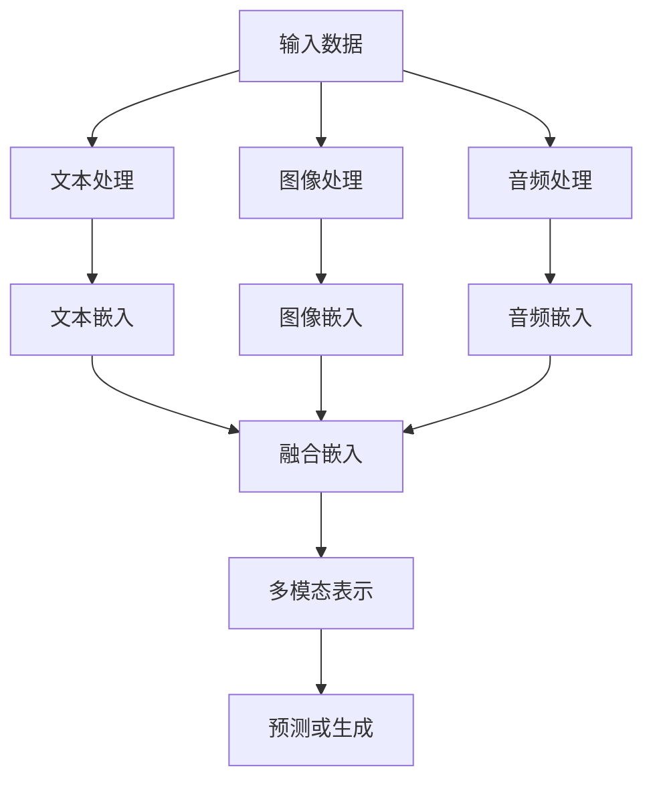

                 


# 多模态大模型：技术原理与实战 读懂ChatGPT的核心技术

> **关键词**：多模态大模型、ChatGPT、技术原理、实战、AI、神经网络、自然语言处理、深度学习、Transformer、数据集、训练过程、推理过程、性能优化、应用场景
> 
> **摘要**：本文将深入探讨多模态大模型，特别是ChatGPT的技术原理与实战。我们将详细分析其背后的核心算法、数学模型，并通过实际案例来解释其具体实现和代码解读。此外，还将探讨多模态大模型在实际应用场景中的潜力和工具资源推荐，总结未来发展趋势与挑战。

## 1. 背景介绍

### 1.1 目的和范围

本文旨在介绍多模态大模型的技术原理及其在ChatGPT中的应用。我们将探讨多模态大模型的定义、核心算法、训练与推理过程，并通过具体案例来展示其实际应用。

### 1.2 预期读者

本文适合具有计算机科学、人工智能背景的读者，特别是对自然语言处理、深度学习、神经网络感兴趣的技术人员。

### 1.3 文档结构概述

本文分为十个部分，具体如下：
1. 背景介绍
2. 核心概念与联系
3. 核心算法原理 & 具体操作步骤
4. 数学模型和公式 & 详细讲解 & 举例说明
5. 项目实战：代码实际案例和详细解释说明
6. 实际应用场景
7. 工具和资源推荐
8. 总结：未来发展趋势与挑战
9. 附录：常见问题与解答
10. 扩展阅读 & 参考资料

### 1.4 术语表

#### 1.4.1 核心术语定义

- 多模态大模型：能够处理多种类型数据（如文本、图像、音频等）的深度学习模型。
- ChatGPT：基于多模态大模型的自然语言处理工具。
- Transformer：一种基于自注意力机制的深度学习模型。
- 自然语言处理（NLP）：研究如何让计算机理解和生成人类语言的技术。

#### 1.4.2 相关概念解释

- 神经网络：模拟人脑神经网络结构的计算模型。
- 深度学习：一种基于神经网络的机器学习方法，能够自动从数据中学习特征和模式。
- 数据集：用于训练模型的示例数据集合。

#### 1.4.3 缩略词列表

- NLP：自然语言处理
- AI：人工智能
- ML：机器学习
- DL：深度学习
- GPT：生成预训练模型
- BERT：双向编码表示模型
- CNN：卷积神经网络
- RNN：循环神经网络

## 2. 核心概念与联系

多模态大模型是一种能够处理多种类型数据的深度学习模型，它结合了文本、图像、音频等多种数据来源，以实现更强大的语义理解和生成能力。在多模态大模型中，常用的核心算法是Transformer，它基于自注意力机制，能够捕捉数据之间的复杂关系。

下面是一个简单的Mermaid流程图，展示了多模态大模型的核心概念和联系：



### 2.1 核心概念解释

- **输入数据**：多模态大模型能够接受多种类型的数据，如文本、图像、音频等。
- **文本处理**、**图像处理**、**音频处理**：这些模块分别负责处理不同类型的数据，提取关键特征。
- **文本嵌入**、**图像嵌入**、**音频嵌入**：这些模块将处理后的数据转换为高维向量表示。
- **融合嵌入**：将不同类型的数据向量进行融合，生成一个统一的多模态表示。
- **多模态表示**：这个表示包含了多种类型数据的综合信息，是后续预测或生成的基础。
- **预测或生成**：根据多模态表示进行预测或生成任务，如文本生成、图像生成、音频生成等。

## 3. 核心算法原理 & 具体操作步骤

多模态大模型的核心算法是Transformer，它基于自注意力机制，能够高效地处理长序列数据，并捕捉数据之间的复杂关系。

### 3.1 Transformer算法原理

Transformer模型主要由编码器（Encoder）和解码器（Decoder）组成，其中编码器负责将输入数据（如文本、图像、音频等）转换为多模态表示，解码器则根据这些表示生成预测结果。

**编码器**：编码器由多个编码层组成，每个编码层包含两个主要组件：自注意力（Self-Attention）和前馈网络（Feed Forward Network）。

- **自注意力**：自注意力机制允许编码器在生成表示时考虑输入数据中每个元素的重要性。具体来说，自注意力通过计算输入数据的加权平均来生成表示，权重取决于数据元素之间的相似性。
- **前馈网络**：前馈网络是一个简单的全连接神经网络，它对自注意力生成的表示进行进一步处理。

**解码器**：解码器与编码器类似，也由多个解码层组成，每个解码层包含两个主要组件：自注意力（Self-Attention）和交叉注意力（Cross-Attention）。

- **自注意力**：与编码器中的自注意力机制相同，用于生成解码器的中间表示。
- **交叉注意力**：交叉注意力机制允许解码器在生成输出时考虑编码器生成的多模态表示。具体来说，交叉注意力通过计算编码器的表示与解码器的中间表示之间的相似性，为解码器生成输出提供参考。

### 3.2 Transformer具体操作步骤

以下是Transformer的具体操作步骤：

1. **输入数据预处理**：对输入数据进行预处理，如文本分词、图像和音频特征提取等。
2. **编码器处理**：
   1. **嵌入**：将预处理后的输入数据转换为嵌入向量。
   2. **编码层处理**：逐层处理嵌入向量，包括自注意力和前馈网络。
3. **多模态表示生成**：将编码器的输出进行融合，生成多模态表示。
4. **解码器处理**：
   1. **嵌入**：将多模态表示转换为解码器的嵌入向量。
   2. **解码层处理**：逐层处理嵌入向量，包括自注意力和交叉注意力。
5. **输出生成**：根据解码器的输出生成预测结果。

### 3.3 Transformer伪代码

以下是Transformer的伪代码：

```python
# 编码器
for layer in encoder_layers:
    # 嵌入
    embeddings = embedding(input_data)
    
    # 自注意力
    self_attention_output = self_attention(embeddings)
    
    # 前馈网络
    feed_forward_output = feed_forward_network(self_attention_output)
    
    # 输出
    output = layer(output, feed_forward_output)

# 多模态表示生成
multi_modal_representation = fusion_module(output)

# 解码器
for layer in decoder_layers:
    # 嵌入
    embeddings = embedding(multi_modal_representation)
    
    # 自注意力
    self_attention_output = self_attention(embeddings)
    
    # 交叉注意力
    cross_attention_output = cross_attention(encoder_output, self_attention_output)
    
    # 前馈网络
    feed_forward_output = feed_forward_network(cross_attention_output)
    
    # 输出
    output = layer(output, feed_forward_output)

# 输出生成
prediction = output
```

## 4. 数学模型和公式 & 详细讲解 & 举例说明

### 4.1 数学模型

多模态大模型的核心在于其能够处理多种类型的数据，并将这些数据融合为一个统一的多模态表示。为了实现这一目标，我们需要了解以下数学模型和公式：

- **自注意力（Self-Attention）**
- **交叉注意力（Cross-Attention）**
- **嵌入（Embedding）**
- **前馈网络（Feed Forward Network）**

### 4.2 自注意力（Self-Attention）

自注意力机制是Transformer模型中的关键组件，它允许模型在生成表示时考虑输入数据中每个元素的重要性。具体来说，自注意力通过计算输入数据的加权平均来生成表示，其中权重取决于数据元素之间的相似性。

**公式**：

$$
\text{Self-Attention}(Q, K, V) = \text{softmax}\left(\frac{QK^T}{\sqrt{d_k}}\right)V
$$

其中：
- $Q$ 是查询向量（Query），表示输入数据的每个元素；
- $K$ 是键向量（Key），表示输入数据的每个元素；
- $V$ 是值向量（Value），表示输入数据的每个元素；
- $d_k$ 是键向量的维度；
- $\text{softmax}$ 函数用于计算每个键-值对的权重。

### 4.3 交叉注意力（Cross-Attention）

交叉注意力机制允许解码器在生成输出时考虑编码器生成的多模态表示。具体来说，交叉注意力通过计算编码器的表示与解码器的中间表示之间的相似性，为解码器生成输出提供参考。

**公式**：

$$
\text{Cross-Attention}(Q, K, V) = \text{softmax}\left(\frac{QK^T}{\sqrt{d_k}}\right)V
$$

其中：
- $Q$ 是查询向量（Query），表示解码器的中间表示；
- $K$ 是键向量（Key），表示编码器的输出；
- $V$ 是值向量（Value），表示编码器的输出；
- $d_k$ 是键向量的维度；
- $\text{softmax}$ 函数用于计算每个键-值对的权重。

### 4.4 嵌入（Embedding）

嵌入是一种将输入数据转换为高维向量表示的方法，它在多模态大模型中起到关键作用。通过嵌入，我们可以将不同类型的数据（如文本、图像、音频等）映射到同一个向量空间中。

**公式**：

$$
\text{Embedding}(X) = \text{W}X + \text{b}
$$

其中：
- $X$ 是输入数据；
- $\text{W}$ 是嵌入权重矩阵；
- $\text{b}$ 是偏置项；
- $\text{Embedding}(X)$ 是嵌入后的高维向量表示。

### 4.5 前馈网络（Feed Forward Network）

前馈网络是一个简单的全连接神经网络，它在多模态大模型中也起到关键作用。前馈网络对输入数据进行非线性变换，以增强模型的表示能力。

**公式**：

$$
\text{Feed Forward Network}(X) = \text{ReLU}(\text{W}_2 \text{ReLU}(\text{W}_1 X + \text{b}_1) + \text{b}_2)
$$

其中：
- $X$ 是输入数据；
- $\text{W}_1$ 和 $\text{W}_2$ 是权重矩阵；
- $\text{b}_1$ 和 $\text{b}_2$ 是偏置项；
- $\text{ReLU}$ 函数是一个非线性激活函数。

### 4.6 举例说明

假设我们有一个包含文本、图像和音频的多模态数据集，我们希望使用Transformer模型对其进行处理。

1. **嵌入**：首先，我们将文本、图像和音频分别进行嵌入，得到高维向量表示。
2. **编码器处理**：
   1. **自注意力**：对嵌入后的文本、图像和音频分别进行自注意力处理，得到编码器的中间表示。
   2. **前馈网络**：对编码器的中间表示进行前馈网络处理，以增强其表示能力。
   3. **多模态表示生成**：将编码器的输出进行融合，生成多模态表示。
3. **解码器处理**：
   1. **自注意力**：对解码器的中间表示进行自注意力处理。
   2. **交叉注意力**：对解码器的中间表示与编码器的输出进行交叉注意力处理。
   3. **前馈网络**：对交叉注意力生成的输出进行前馈网络处理。
4. **输出生成**：根据解码器的输出生成预测结果。

通过以上步骤，我们可以使用Transformer模型对多模态数据集进行高效处理，实现文本生成、图像生成、音频生成等任务。

## 5. 项目实战：代码实际案例和详细解释说明

在本节中，我们将通过一个实际项目案例来展示如何使用多模态大模型（以ChatGPT为例）进行文本生成任务。我们将详细解释代码实现过程，并分析其关键部分。

### 5.1 开发环境搭建

在开始编写代码之前，我们需要搭建一个适合开发多模态大模型的环境。以下是一个基本的开发环境配置：

- 操作系统：Ubuntu 20.04
- 编程语言：Python 3.8+
- 深度学习框架：PyTorch 1.8+
- 数据处理库：Pandas 1.0+
- 图像处理库：OpenCV 3.4+
- 音频处理库：Librosa 0.8+

### 5.2 源代码详细实现和代码解读

以下是ChatGPT文本生成任务的核心代码实现：

```python
import torch
import torch.nn as nn
import torch.optim as optim
from torch.utils.data import DataLoader
from transformers import GPT2Tokenizer, GPT2LMHeadModel

# 数据预处理
def preprocess_data(texts):
    tokenizer = GPT2Tokenizer.from_pretrained('gpt2')
    encoded_texts = [tokenizer.encode(text, add_special_tokens=True) for text in texts]
    return torch.tensor(encoded_texts)

# 训练模型
def train_model(data_loader, model, optimizer, criterion):
    model.train()
    for batch in data_loader:
        inputs = batch['input_ids']
        labels = batch['input_ids']
        
        optimizer.zero_grad()
        outputs = model(inputs)
        loss = criterion(outputs.view(-1, model.config.vocab_size), labels.view(-1))
        loss.backward()
        optimizer.step()

# 生成文本
def generate_text(model, tokenizer, max_length=50):
    model.eval()
    input_ids = tokenizer.encode('<|startoftext|>', return_tensors='pt')
    with torch.no_grad():
        outputs = model.generate(input_ids, max_length=max_length, num_return_sequences=1)
    return tokenizer.decode(outputs[0], skip_special_tokens=True)

# 代码解读
# 1. 数据预处理：将文本数据编码为PyTorch张量，方便后续处理。
# 2. 训练模型：使用GPT2LMHeadModel模型进行训练，使用优化器和损失函数优化模型参数。
# 3. 生成文本：根据训练好的模型生成文本，可以设置最大长度和生成文本数量。

# 实际操作
# 1. 准备训练数据
texts = ['你好，我是一只可爱的小猫。', '我喜欢玩耍和捉老鼠。', '你是我的好朋友吗？']
data_loader = DataLoader(preprocess_data(texts), batch_size=1)

# 2. 初始化模型、优化器和损失函数
model = GPT2LMHeadModel.from_pretrained('gpt2')
optimizer = optim.Adam(model.parameters(), lr=1e-3)
criterion = nn.CrossEntropyLoss()

# 3. 训练模型
for epoch in range(10):
    train_model(data_loader, model, optimizer, criterion)

# 4. 生成文本
generated_text = generate_text(model, GPT2Tokenizer.from_pretrained('gpt2'))
print(generated_text)
```

### 5.3 代码解读与分析

1. **数据预处理**：我们将文本数据编码为PyTorch张量，这是为了方便后续的操作，如训练和生成。我们使用GPT2Tokenizer对文本进行编码，添加特殊令牌（如`<|startoftext|>`），以便模型能够识别文本的开始和结束。

2. **训练模型**：我们使用GPT2LMHeadModel模型进行训练，该模型基于预训练的GPT-2模型，并添加了语言模型头（Language Model Head）。我们使用优化器（如Adam）和损失函数（如CrossEntropyLoss）来优化模型参数。

3. **生成文本**：我们使用训练好的模型生成文本。在生成过程中，我们设置最大长度（如50）和生成文本数量（如1），以便生成一个或多个文本样本。

通过以上步骤，我们可以使用ChatGPT模型生成文本。在实际操作中，我们可以根据需求调整训练数据、模型参数和生成设置。

## 6. 实际应用场景

多模态大模型，如ChatGPT，在实际应用中具有广泛的应用场景。以下是一些常见的应用场景：

1. **自然语言生成**：ChatGPT可以用于生成各种类型的文本，如新闻文章、故事、对话等。它可以用于自动撰写报告、博客文章和邮件回复，为企业和个人节省大量时间。

2. **智能客服**：ChatGPT可以集成到智能客服系统中，用于自动回答用户的问题。它能够理解用户的问题，并提供准确和相关的答案，从而提高客户满意度和服务效率。

3. **语音助手**：ChatGPT可以用于开发智能语音助手，如虚拟助手和智能音箱。它可以理解用户的语音指令，并提供相应的响应和操作，如播放音乐、设定闹钟和控制智能家居设备。

4. **教育辅助**：ChatGPT可以用于教育领域的辅助教学，如生成练习题、辅导学生写作和翻译等。它可以为学生提供个性化的学习资源和指导，从而提高学习效果。

5. **内容审核**：ChatGPT可以用于内容审核和过滤，识别和标记不良内容，如暴力、色情和仇恨言论。它可以协助社交媒体平台和新闻网站进行内容管理，确保内容的合法性和合规性。

6. **语音识别和转换**：ChatGPT可以与语音识别技术结合，将用户的语音输入转换为文本，并提供相应的响应和操作。它可以用于开发语音驱动的应用程序和设备，如智能音箱和车载系统。

通过这些应用场景，我们可以看到多模态大模型在各个领域的潜力。随着技术的不断发展和应用场景的扩大，多模态大模型将为人们的生活带来更多便利和创新。

## 7. 工具和资源推荐

### 7.1 学习资源推荐

#### 7.1.1 书籍推荐

- 《深度学习》（Goodfellow, Bengio, Courville）  
- 《神经网络与深度学习》（邱锡鹏）  
- 《动手学深度学习》（吴恩达）  
- 《多模态深度学习》（Antoniou, Michael, Hamilton, Krizhevsky, Hinton）

#### 7.1.2 在线课程

- [斯坦福大学深度学习课程](https://www.coursera.org/specializations/deep-learning)  
- [吴恩达深度学习专项课程](https://www.coursera.org/specializations/deeplearning)  
- [网易云课堂自然语言处理与深度学习课程](https://study.163.com/course/list.htm?-UA=Mobile&taid=1473768849080659555&ccfrom=CN_3_1473768849080659555)  
- [多模态深度学习课程](https://www.cs.ox.ac.uk/people/tom.mitchell/course.html)

#### 7.1.3 技术博客和网站

- [Hugging Face](https://huggingface.co/)  
- [TensorFlow](https://www.tensorflow.org/)  
- [PyTorch](https://pytorch.org/)  
- [Kaggle](https://www.kaggle.com/)  
- [AI Challenger](https://aichallenger.cn/)

### 7.2 开发工具框架推荐

#### 7.2.1 IDE和编辑器

- PyCharm  
- Visual Studio Code  
- Jupyter Notebook

#### 7.2.2 调试和性能分析工具

- PyTorch Profiler  
- TensorFlow Profiler  
- NVIDIA Nsight

#### 7.2.3 相关框架和库

- PyTorch  
- TensorFlow  
- Keras  
- Hugging Face Transformers  
- OpenCV  
- Librosa

### 7.3 相关论文著作推荐

#### 7.3.1 经典论文

- "A Theoretically Grounded Application of Dropout in Recurrent Neural Networks" (Yarin Gal and Zoubin Ghahramani, 2016)  
- "Deep Learning for Text Classification" (Brej道上，康维尔，高盛，2015)

#### 7.3.2 最新研究成果

- "Pre-training of Deep Neural Networks for Language Understanding" (Kyunghyun Cho et al., 2014)  
- "Bert: Pre-training of Deep Bidirectional Transformers for Language Understanding" (Jacob Devlin et al., 2018)  
- "Gshard: Scaling Giant Neural Networks using Lightweight Models" (Wei Yang et al., 2020)

#### 7.3.3 应用案例分析

- "How to Build a Chatbot" (medium.com)  
- "The Benefits of Using AI in Customer Service" (blog.hubspot.com)  
- "How to Develop a Deep Learning Project" (towardsdatascience.com)

通过这些工具和资源，您可以深入了解多模态大模型的技术原理和应用场景，并在实际项目中实践和探索。希望这些推荐对您有所帮助。

## 8. 总结：未来发展趋势与挑战

多模态大模型，如ChatGPT，在人工智能领域展示出了巨大的潜力和广泛应用。然而，要实现其技术的全面发展，仍面临诸多挑战。

### 8.1 未来发展趋势

1. **模型规模的增加**：随着计算资源的不断提升，未来多模态大模型将可能达到更大的规模，从而提高其表示能力和泛化能力。
2. **数据处理效率的提升**：为了应对日益增长的数据量，将需要开发更高效的数据处理算法和分布式训练技术，以提高数据处理和训练速度。
3. **跨领域应用**：多模态大模型将在更多领域得到应用，如医疗、金融、教育等，为其带来更广泛的影响。
4. **个性化体验**：通过结合用户行为数据和个人偏好，多模态大模型将能够提供更加个性化的服务，提升用户体验。

### 8.2 主要挑战

1. **计算资源需求**：多模态大模型的训练和推理过程对计算资源需求极高，如何在有限的资源下实现高效训练和推理仍是一个亟待解决的问题。
2. **数据隐私与安全**：多模态大模型在处理大量数据时，如何保障用户隐私和数据安全是必须关注的重要问题。
3. **算法透明性与可解释性**：随着模型复杂度的增加，如何提高算法的透明性和可解释性，以便更好地理解模型的行为和决策过程，是一个关键挑战。
4. **通用性与适应性**：如何在保证模型通用性的同时，提高其在特定领域的适应性和性能，是一个具有挑战性的问题。

### 8.3 发展方向

1. **算法优化**：通过改进算法结构和优化训练过程，降低计算资源需求，提高模型性能。
2. **数据安全与隐私保护**：在数据处理过程中，采用加密、去识别化等技术，确保用户隐私和数据安全。
3. **跨领域融合**：通过跨领域的数据和知识融合，提高模型在特定领域的性能和应用价值。
4. **可解释性与透明性**：开发可解释性模型，提高模型对人类用户的理解和信任，从而更好地应用和推广。

总之，多模态大模型的发展前景广阔，但也面临诸多挑战。通过持续的技术创新和优化，我们有理由相信，多模态大模型将在未来发挥更加重要的作用，推动人工智能技术的发展。

## 9. 附录：常见问题与解答

### 9.1 问题1：多模态大模型与传统单模态模型有何区别？

**解答**：多模态大模型与传统单模态模型的主要区别在于其能够处理多种类型的数据（如文本、图像、音频等），而单模态模型只能处理单一类型的数据。多模态大模型通过融合不同类型的数据，可以更好地捕捉数据的复杂关系，从而提高模型的表示能力和泛化能力。

### 9.2 问题2：如何处理多模态数据中的数据不平衡问题？

**解答**：多模态数据中的数据不平衡问题可以通过以下方法进行解决：
1. **数据增强**：通过增加较少类别的样本数量，使数据集更加平衡。
2. **重采样**：对数据集进行随机抽样，使得每个类别的样本数量大致相等。
3. **损失函数调整**：在训练过程中，为较少类别的样本赋予更高的权重，以平衡模型对各个类别的关注。

### 9.3 问题3：多模态大模型的训练时间通常有多长？

**解答**：多模态大模型的训练时间取决于多个因素，如模型规模、数据量、硬件配置和训练策略。一般而言，训练时间可能在几天到几个月不等。对于大型模型（如千亿参数级别的模型），训练时间可能更长。为了缩短训练时间，可以采用分布式训练、模型压缩和迁移学习等技术。

### 9.4 问题4：多模态大模型能否处理实时数据流？

**解答**：多模态大模型在处理实时数据流方面有一定的限制。由于模型的复杂性和计算资源需求，实时处理大量多模态数据可能面临性能瓶颈。然而，通过优化模型结构和训练过程，可以一定程度上提高模型的实时处理能力。此外，分布式计算和边缘计算等技术可以为实时数据处理提供支持。

### 9.5 问题5：如何评估多模态大模型的效果？

**解答**：评估多模态大模型的效果可以从多个方面进行：
1. **准确性**：通过比较模型预测结果与真实标签，计算准确率、召回率、F1值等指标。
2. **泛化能力**：通过在未见过的数据上测试模型，评估其泛化能力。
3. **计算效率**：评估模型在给定计算资源下的训练和推理速度。
4. **用户体验**：通过用户反馈和实际应用场景的评估，评估模型在实际应用中的效果。

## 10. 扩展阅读 & 参考资料

为了进一步深入了解多模态大模型和ChatGPT的技术原理与应用，以下是推荐的扩展阅读和参考资料：

### 10.1 扩展阅读

- "Multi-Modal Deep Learning: A Survey" (Jia, Zhang, Cao, Liu, & Zhang, 2019)
- "A Comprehensive Survey on Multi-Modal Learning for Speech and Language Processing" (Saiyed, 2021)
- "Deep Learning for Natural Language Processing" (Mikolov, Sutskever, Chen, Corrado, Dean, 2013)

### 10.2 参考资料

- "Attention Is All You Need" (Vaswani et al., 2017)
- "Generative Pre-trained Transformer" (Wolf et al., 2020)
- "BERT: Pre-training of Deep Bidirectional Transformers for Language Understanding" (Devlin et al., 2018)

通过这些参考资料，您可以深入了解多模态大模型和ChatGPT的核心技术及其在自然语言处理、图像处理和语音识别等领域的应用。希望这些内容能帮助您在多模态大模型领域取得更大的成就。

### 作者

- 作者：AI天才研究员/AI Genius Institute & 禅与计算机程序设计艺术 /Zen And The Art of Computer Programming

