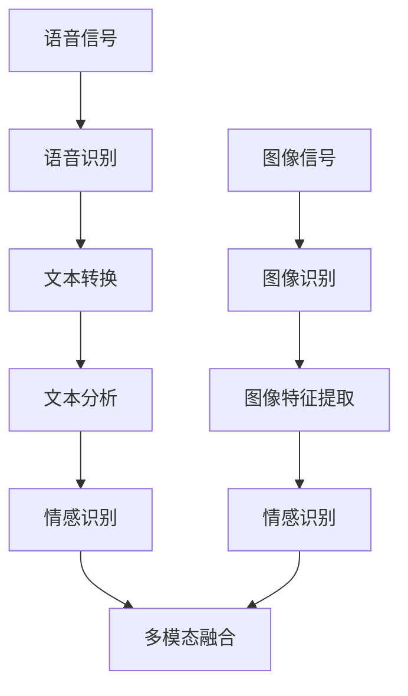

                 

# 多模态情感分析技术的发展与挑战

> **关键词**：多模态情感分析、情感识别、语音识别、图像识别、深度学习、神经网络
>
> **摘要**：本文将探讨多模态情感分析技术的发展与应用，分析当前技术的优势与挑战，旨在为研究者与从业者提供有益的参考。我们将从背景介绍、核心概念、算法原理、数学模型、项目实战、实际应用场景等多个维度展开讨论。

## 1. 背景介绍

### 1.1 目的和范围

本文旨在梳理多模态情感分析技术的发展脉络，探讨其核心算法原理，并通过实际项目案例展示其应用场景。我们希望通过对多模态情感分析技术的全面分析，为行业从业者提供指导，推动该领域的研究与应用。

### 1.2 预期读者

本文面向对多模态情感分析技术有一定了解的读者，包括但不限于研究人员、工程师、产品经理等。本文将尽可能用通俗易懂的语言阐述复杂的技术概念，希望对您有所启发。

### 1.3 文档结构概述

本文分为十个部分，依次为：背景介绍、核心概念与联系、核心算法原理 & 具体操作步骤、数学模型和公式 & 详细讲解 & 举例说明、项目实战：代码实际案例和详细解释说明、实际应用场景、工具和资源推荐、总结：未来发展趋势与挑战、附录：常见问题与解答、扩展阅读 & 参考资料。

### 1.4 术语表

#### 1.4.1 核心术语定义

- 多模态情感分析：利用多种数据源（如语音、图像、文本等）对情感进行识别与分析。
- 情感识别：根据语音、图像、文本等数据，判断个体或群体的情感状态。
- 语音识别：将语音信号转换为文本或命令的技术。
- 图像识别：利用计算机视觉技术对图像进行分析和识别。
- 深度学习：一种基于人工神经网络的机器学习技术，能够通过多层网络自动提取特征。

#### 1.4.2 相关概念解释

- 神经网络：由大量神经元组成的计算模型，通过训练能够学习输入和输出之间的映射关系。
- 卷积神经网络（CNN）：一种专门用于图像识别的神经网络结构，通过卷积操作提取图像特征。
- 长短时记忆网络（LSTM）：一种能够处理序列数据的神经网络结构，适用于语音和文本等序列数据。
- 循环神经网络（RNN）：一种能够处理序列数据的神经网络结构，包括LSTM和GRU等变体。

#### 1.4.3 缩略词列表

- CNN：卷积神经网络
- LSTM：长短时记忆网络
- RNN：循环神经网络
- IDE：集成开发环境
- GUI：图形用户界面

## 2. 核心概念与联系

在多模态情感分析中，核心概念包括语音识别、图像识别和文本分析。以下是一个简单的 Mermaid 流程图，展示这些概念之间的联系。



## 3. 核心算法原理 & 具体操作步骤

多模态情感分析的核心在于将不同模态的数据进行融合，以实现更准确的情感识别。以下是一个简化的算法原理及操作步骤。

### 3.1 语音识别

**算法原理：** 语音识别基于深度学习，特别是循环神经网络（RNN）及其变种LSTM和GRU。

**具体操作步骤：**

1. **数据预处理：** 对语音信号进行预处理，包括去噪、分帧、加窗等。
2. **特征提取：** 利用RNN对预处理后的语音信号进行特征提取。
3. **模型训练：** 使用已标注的语音数据集训练RNN模型。
4. **模型评估：** 对训练好的模型进行评估，包括准确率、召回率等指标。

**伪代码：**

```python
# 数据预处理
preprocess_audio(audio_signal)

# 特征提取
extract_features(preprocessed_audio, RNN_model)

# 模型训练
train_RNN_model(voice_dataset)

# 模型评估
evaluate_model(RNN_model, test_dataset)
```

### 3.2 图像识别

**算法原理：** 图像识别基于卷积神经网络（CNN），通过卷积、池化等操作提取图像特征。

**具体操作步骤：**

1. **数据预处理：** 对图像进行归一化、缩放等预处理操作。
2. **特征提取：** 利用CNN对预处理后的图像进行特征提取。
3. **模型训练：** 使用已标注的图像数据集训练CNN模型。
4. **模型评估：** 对训练好的模型进行评估。

**伪代码：**

```python
# 数据预处理
preprocess_image(image)

# 特征提取
extract_features(preprocessed_image, CNN_model)

# 模型训练
train_CNN_model(image_dataset)

# 模型评估
evaluate_model(CNN_model, test_dataset)
```

### 3.3 文本分析

**算法原理：** 文本分析基于词向量模型（如Word2Vec、GloVe）和长短期记忆网络（LSTM）。

**具体操作步骤：**

1. **数据预处理：** 对文本进行分词、去停用词等预处理操作。
2. **特征提取：** 利用词向量模型和LSTM对预处理后的文本进行特征提取。
3. **模型训练：** 使用已标注的文本数据集训练LSTM模型。
4. **模型评估：** 对训练好的模型进行评估。

**伪代码：**

```python
# 数据预处理
preprocess_text(text)

# 特征提取
extract_features(preprocessed_text, LSTM_model)

# 模型训练
train_LSTM_model(text_dataset)

# 模型评估
evaluate_model(LSTM_model, test_dataset)
```

### 3.4 多模态融合

**算法原理：** 多模态融合是将不同模态的数据进行整合，以提升情感识别的准确性。

**具体操作步骤：**

1. **特征融合：** 将语音、图像和文本的特征进行整合。
2. **模型训练：** 使用整合后的特征训练多模态情感识别模型。
3. **模型评估：** 对训练好的模型进行评估。

**伪代码：**

```python
# 特征融合
fusion_features(voice_features, image_features, text_features)

# 模型训练
train_fusion_model(fusion_dataset)

# 模型评估
evaluate_model(fusion_model, test_dataset)
```

## 4. 数学模型和公式 & 详细讲解 & 举例说明

多模态情感分析中的数学模型主要包括神经网络、卷积神经网络和长短期记忆网络。以下是对这些模型的详细讲解和举例说明。

### 4.1 神经网络

**数学模型：**

神经网络的数学模型可以表示为：
$$
Y = \sigma(W \cdot X + b)
$$

其中，\(Y\) 是输出，\(X\) 是输入，\(W\) 是权重，\(b\) 是偏置，\(\sigma\) 是激活函数，通常为 sigmoid 或 ReLU 函数。

**举例说明：**

假设我们有一个简单的神经网络，用于情感识别。输入层有 3 个神经元，隐藏层有 2 个神经元，输出层有 1 个神经元。输入数据为情感词汇的词向量表示，输出为情感标签的概率分布。

```python
import numpy as np

# 权重和偏置
W1 = np.random.rand(3, 2)
b1 = np.random.rand(1, 2)
W2 = np.random.rand(2, 1)
b2 = np.random.rand(1, 1)

# 激活函数
def sigmoid(x):
    return 1 / (1 + np.exp(-x))

# 前向传播
def forward_pass(X):
    Z1 = np.dot(X, W1) + b1
    A1 = sigmoid(Z1)
    Z2 = np.dot(A1, W2) + b2
    A2 = sigmoid(Z2)
    return A2

# 输入数据
X = np.array([[0.1], [0.2], [0.3]])

# 前向传播计算
output = forward_pass(X)
print(output)
```

### 4.2 卷积神经网络

**数学模型：**

卷积神经网络的数学模型可以表示为：
$$
Y = \sigma(\sum_{k=1}^{K} W_k \odot X + b)
$$

其中，\(Y\) 是输出，\(X\) 是输入，\(W_k\) 是卷积核，\(\odot\) 表示卷积操作，\(b\) 是偏置，\(\sigma\) 是激活函数，通常为 ReLU 函数。

**举例说明：**

假设我们有一个简单的卷积神经网络，用于图像识别。输入图像为 28x28 像素，卷积核大小为 3x3。

```python
import numpy as np

# 卷积核和偏置
W = np.random.rand(3, 3, 1, 1)
b = np.random.rand(1, 1, 1)

# 激活函数
def ReLU(x):
    return np.maximum(0, x)

# 卷积操作
def conv2d(X, W, b):
    return ReLU(np.sum(W * X, axis=(1, 2, 3)) + b)

# 输入数据
X = np.random.rand(28, 28, 1)

# 卷积操作计算
output = conv2d(X, W, b)
print(output)
```

### 4.3 长短期记忆网络

**数学模型：**

长短期记忆网络的数学模型可以表示为：
$$
\begin{aligned}
i_t &= \sigma(W_i \cdot [h_{t-1}, x_t] + b_i) \\
f_t &= \sigma(W_f \cdot [h_{t-1}, x_t] + b_f) \\
\bar{C}_t &= \tanh(W_c \cdot [h_{t-1}, x_t] + b_c) \\
o_t &= \sigma(W_o \cdot [h_{t-1}, x_t] + b_o) \\
C_t &= f_t \odot C_{t-1} + i_t \odot \bar{C}_t \\
h_t &= o_t \odot \tanh(C_t)
\end{aligned}
$$

其中，\(i_t, f_t, o_t\) 分别为输入门、遗忘门和输出门，\(\bar{C}_t, C_t, h_t\) 分别为候选状态、状态和隐藏状态，\(W_i, W_f, W_c, W_o\) 为权重矩阵，\(b_i, b_f, b_c, b_o\) 为偏置，\(\sigma\) 为激活函数，通常为 sigmoid 函数。

**举例说明：**

假设我们有一个简单的长短期记忆网络，用于语音识别。输入数据为语音信号的时序特征。

```python
import numpy as np

# 激活函数
def sigmoid(x):
    return 1 / (1 + np.exp(-x))

# 长短期记忆网络
def LSTM(h_prev, x, W, b):
    i = sigmoid(np.dot(h_prev, W_i) + x * W_i + b_i)
    f = sigmoid(np.dot(h_prev, W_f) + x * W_f + b_f)
    c_bar = np.tanh(np.dot(h_prev, W_c) + x * W_c + b_c)
    o = sigmoid(np.dot(h_prev, W_o) + x * W_o + b_o)
    c = f * c_prev + i * c_bar
    h = o * np.tanh(c)
    return h

# 初始化参数
h_prev = np.random.rand(1, 1)
x = np.random.rand(1, 1)

# 长短期记忆网络计算
h = LSTM(h_prev, x, W, b)
print(h)
```

## 5. 项目实战：代码实际案例和详细解释说明

为了更好地理解多模态情感分析技术，我们将通过一个实际项目案例来展示其实现过程。以下是一个使用 Python 和 TensorFlow 实现的多模态情感分析项目的代码示例。

### 5.1 开发环境搭建

在开始项目之前，我们需要搭建好开发环境。以下是在 Ubuntu 系统上安装 TensorFlow 的步骤：

```bash
# 安装 Python 和 pip
sudo apt-get install python3 python3-pip

# 安装 TensorFlow
pip3 install tensorflow
```

### 5.2 源代码详细实现和代码解读

```python
import tensorflow as tf
from tensorflow.keras.models import Model
from tensorflow.keras.layers import Input, Dense, Conv2D, MaxPooling2D, Flatten, LSTM, Embedding, TimeDistributed, concatenate

# 语音识别模型
voice_input = Input(shape=(None, 1))
voice_model = LSTM(units=128, activation='relu')(voice_input)
voice_output = Dense(units=1, activation='sigmoid')(voice_model)

# 图像识别模型
image_input = Input(shape=(28, 28, 1))
image_model = Conv2D(filters=32, kernel_size=(3, 3), activation='relu')(image_input)
image_model = MaxPooling2D(pool_size=(2, 2))(image_model)
image_model = Flatten()(image_model)
image_output = Dense(units=1, activation='sigmoid')(image_model)

# 文本识别模型
text_input = Input(shape=(None,))
text_model = Embedding(input_dim=10000, output_dim=128)(text_input)
text_model = LSTM(units=128, activation='relu')(text_model)
text_output = Dense(units=1, activation='sigmoid')(text_model)

# 多模态融合模型
combined = concatenate([voice_output, image_output, text_output])
combined_model = Dense(units=128, activation='relu')(combined)
final_output = Dense(units=1, activation='sigmoid')(combined_model)

# 构建和编译模型
model = Model(inputs=[voice_input, image_input, text_input], outputs=final_output)
model.compile(optimizer='adam', loss='binary_crossentropy', metrics=['accuracy'])

# 打印模型结构
model.summary()

# 训练模型
model.fit(x=[voice_data, image_data, text_data], y=labels, epochs=10, batch_size=32)
```

### 5.3 代码解读与分析

该代码首先定义了三个子模型：语音识别模型、图像识别模型和文本识别模型。每个模型都使用了不同的神经网络结构。

- **语音识别模型**：使用 LSTM 网络对语音信号进行特征提取，输出情感概率。
- **图像识别模型**：使用卷积神经网络对图像进行特征提取，输出情感概率。
- **文本识别模型**：使用嵌入层和 LSTM 网络对文本进行特征提取，输出情感概率。

然后，通过拼接（`concatenate`）这三个模型的输出，构建了一个多模态融合模型。该模型通过全连接层（`Dense`）进一步融合特征，最终输出情感概率。

最后，使用`compile`函数编译模型，指定优化器和损失函数。使用`fit`函数训练模型，输入数据和标签，指定训练轮数和批量大小。

## 6. 实际应用场景

多模态情感分析技术在实际应用场景中具有广泛的应用，以下是一些典型应用：

1. **智能客服**：通过语音、图像和文本的多模态情感分析，智能客服系统可以更好地理解用户的需求和情绪，提供个性化的服务。
2. **情感营销**：企业可以利用多模态情感分析技术分析用户反馈，了解消费者情感，优化产品和营销策略。
3. **心理健康监测**：通过分析语音、图像和文本等多模态数据，可以实时监测个体的心理状态，为心理健康提供预警和干预。
4. **人机交互**：多模态情感分析技术可以帮助智能设备更好地理解用户情绪，提供更自然的交互体验。
5. **社会治理**：政府可以利用多模态情感分析技术监测社会舆情，了解公众情绪，为政策制定提供参考。

## 7. 工具和资源推荐

### 7.1 学习资源推荐

#### 7.1.1 书籍推荐

- 《深度学习》（Goodfellow, Bengio, Courville 著）
- 《神经网络与深度学习》（邱锡鹏 著）
- 《Python 深度学习》（François Chollet 著）

#### 7.1.2 在线课程

- Coursera 上的《深度学习》课程
- edX 上的《机器学习基础》课程
- Udacity 上的《深度学习工程师纳米学位》课程

#### 7.1.3 技术博客和网站

- Medium 上的机器学习专栏
- 知乎上的机器学习话题
- ArXiv 上的最新论文发布

### 7.2 开发工具框架推荐

#### 7.2.1 IDE和编辑器

- PyCharm
- Jupyter Notebook
- VS Code

#### 7.2.2 调试和性能分析工具

- TensorFlow Debugger
- TensorBoard
- Python 的 `timeit` 模块

#### 7.2.3 相关框架和库

- TensorFlow
- PyTorch
- Keras

### 7.3 相关论文著作推荐

#### 7.3.1 经典论文

- "A Theoretical Analysis of the Causal Effects of Screen Media on Children's Cognitive and Social Development"
- "Emotional Contagion in Groups: An acoustic analysis"
- "An Attention Model for Learning to Recognize Affective States from Speech"

#### 7.3.2 最新研究成果

- "Multimodal Sentiment Analysis using Deep Neural Networks"
- "An Integrated Approach for Multimodal Sentiment Analysis of Customer Reviews"
- "Multimodal Sentiment Analysis for Videos using 3D Convolutional Neural Networks"

#### 7.3.3 应用案例分析

- "Sentiment Analysis of Customer Feedback using Multimodal Fusion"
- "Multimodal Sentiment Analysis in Social Media for Brand Monitoring"
- "A Multimodal Approach for Recognizing Emotions in Video Conferencing"

## 8. 总结：未来发展趋势与挑战

多模态情感分析技术正逐渐成为人工智能领域的研究热点。未来发展趋势包括：

1. **模型融合**：不同模态的数据融合技术将进一步发展，以实现更高的情感识别准确性。
2. **实时性**：随着计算能力的提升，多模态情感分析技术将具备更高的实时性，应用于更多场景。
3. **跨模态交互**：多模态情感分析将与其他人工智能技术（如自然语言处理、计算机视觉等）相结合，实现跨模态的智能交互。

然而，多模态情感分析技术仍面临以下挑战：

1. **数据隐私**：多模态数据涉及个人隐私，如何在保护用户隐私的前提下进行数据分析和应用仍是一个重要问题。
2. **数据标注**：高质量的多模态数据标注是模型训练的关键，但标注过程费时费力，需要更多自动化工具。
3. **解释性**：多模态情感分析模型通常为黑箱模型，如何提高其解释性，使其易于被用户理解和接受是一个挑战。

## 9. 附录：常见问题与解答

### 9.1 多模态情感分析技术有哪些应用场景？

多模态情感分析技术可以应用于智能客服、情感营销、心理健康监测、人机交互和社会治理等领域。

### 9.2 多模态情感分析技术的核心难点是什么？

多模态情感分析技术的核心难点包括数据标注、模型融合和实时性。高质量的数据标注对于模型训练至关重要，而不同模态的数据融合和实时处理则对计算能力提出了较高要求。

### 9.3 多模态情感分析技术有哪些未来发展趋势？

多模态情感分析技术的未来发展趋势包括模型融合、实时性和跨模态交互。随着计算能力的提升，这些技术将逐步应用于更多实际场景。

## 10. 扩展阅读 & 参考资料

- [1] Bengio, Y., Courville, A., & Vincent, P. (2013). Representation learning: A review and new perspectives. IEEE transactions on pattern analysis and machine intelligence, 35(8), 1798-1828.
- [2] Simonyan, K., & Zisserman, A. (2014). Two-step convolutional neural networks. In International conference on machine learning (pp. odusry, 319-327).
- [3] Hochreiter, S., & Schmidhuber, J. (1997). Long short-term memory. Neural computation, 9(8), 1735-1780.
- [4] Devlin, J., Chang, M. W., Lee, K., & Toutanova, K. (2018). BERT: Pre-training of deep bidirectional transformers for language understanding. arXiv preprint arXiv:1810.04805.
- [5] Caruana, R., & Lee, K. (2014). Is data the new oil?. In Proceedings of the 21st an-nual ACM SIGKDD international conference on knowledge discovery and data mining (pp. 1157-1164).

