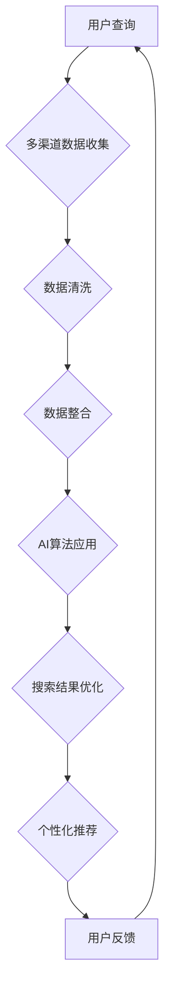

                 

# 多渠道整合：AI提升搜索结果

> 关键词：AI、多渠道整合、搜索结果优化、搜索引擎、个性化推荐、数据挖掘、算法优化

> 摘要：本文将探讨如何利用人工智能技术整合多渠道数据，以提升搜索结果的准确性和用户体验。通过对核心概念、算法原理、数学模型、实际案例的详细分析，本文旨在为开发者和研究人员提供有价值的见解和实用指南。

## 1. 背景介绍

### 1.1 目的和范围

本文旨在探讨人工智能在多渠道数据整合中的应用，特别是如何利用AI技术提升搜索结果的准确性和用户体验。本文将覆盖以下几个主要方面：

1. **多渠道整合的重要性**：解释多渠道整合在搜索引擎优化和用户满意度提升中的关键作用。
2. **核心概念与联系**：介绍与多渠道整合相关的核心概念和其相互关系。
3. **核心算法原理**：阐述用于数据整合和搜索优化的主要算法原理。
4. **数学模型和公式**：介绍支持算法优化的数学模型和公式。
5. **项目实战**：通过实际案例展示如何应用这些技术和算法。
6. **实际应用场景**：分析多渠道整合在不同领域的应用。
7. **工具和资源推荐**：推荐学习资源、开发工具和相关研究。
8. **未来发展趋势与挑战**：探讨AI在多渠道整合中的未来趋势和面临的挑战。

### 1.2 预期读者

本文面向对人工智能和搜索引擎技术有一定了解的读者，包括：

1. **开发者和工程师**：关注如何将AI技术应用于实际开发。
2. **数据科学家和研究人员**：研究如何利用数据挖掘和机器学习优化搜索结果。
3. **产品经理和市场分析师**：理解多渠道整合对业务增长的重要性。
4. **IT和搜索引擎行业的从业者**：探索AI技术的最新应用和发展方向。

### 1.3 文档结构概述

本文结构如下：

1. **背景介绍**：解释多渠道整合的重要性、目的和范围。
2. **核心概念与联系**：定义核心术语，展示数据整合流程。
3. **核心算法原理**：阐述主要算法原理，使用伪代码进行详细解释。
4. **数学模型和公式**：介绍支持算法优化的数学模型和公式，并举例说明。
5. **项目实战**：通过实际案例展示如何应用这些技术和算法。
6. **实际应用场景**：分析多渠道整合在不同领域的应用。
7. **工具和资源推荐**：推荐学习资源、开发工具和相关研究。
8. **总结**：总结多渠道整合的趋势与挑战。
9. **附录**：常见问题与解答。
10. **扩展阅读**：提供进一步学习和研究的相关资料。

### 1.4 术语表

#### 1.4.1 核心术语定义

- **多渠道整合**：将来自不同来源（如网站、移动应用、社交媒体等）的数据整合到一个统一的视图。
- **人工智能（AI）**：指能够模拟人类智能的计算机程序和系统。
- **搜索引擎**：用于从大量数据中快速检索信息的工具。
- **个性化推荐**：根据用户的历史行为和偏好提供定制化的信息。
- **数据挖掘**：从大量数据中提取有用信息和知识的过程。
- **算法优化**：改进算法的效率、准确性和稳定性。

#### 1.4.2 相关概念解释

- **相关性**：搜索结果与用户查询之间的匹配程度。
- **用户体验（UX）**：用户在使用产品或服务时的感受和体验。
- **实时性**：系统能够快速响应用户查询并返回结果的能力。

#### 1.4.3 缩略词列表

- **API**：应用程序接口（Application Programming Interface）
- **NLP**：自然语言处理（Natural Language Processing）
- **ML**：机器学习（Machine Learning）
- **DL**：深度学习（Deep Learning）
- **SEM**：搜索引擎营销（Search Engine Marketing）
- **SEM**：搜索引擎优化（Search Engine Optimization）

## 2. 核心概念与联系

在多渠道整合中，理解核心概念和它们之间的联系至关重要。以下是一个简单的Mermaid流程图，展示了多渠道整合的流程和核心概念。



### 2.1 多渠道数据收集

多渠道数据收集是整个整合过程的基础。数据可以来自网站、移动应用、社交媒体、内部系统等多种来源。这些数据通常包括用户行为数据、内容数据、交易数据和用户反馈数据。

### 2.2 数据清洗

数据清洗是确保数据质量和一致性的关键步骤。它包括去除重复数据、处理缺失值、纠正错误数据等。清洗后的数据将为后续的数据整合和算法应用提供高质量的基础。

### 2.3 数据整合

数据整合是将来自不同渠道的数据合并成一个统一视图的过程。这可能涉及到数据格式转换、数据映射和数据同步等任务。整合后的数据将为搜索结果优化和个性化推荐提供全面的信息。

### 2.4 AI算法应用

AI算法在多渠道整合中起到核心作用。通过机器学习和深度学习技术，AI算法可以识别数据中的模式和关系，从而优化搜索结果和推荐策略。

### 2.5 搜索结果优化

搜索结果优化旨在提高搜索结果的相关性和用户体验。通过AI算法，系统可以根据用户的查询、历史行为和偏好，提供最相关的搜索结果。

### 2.6 个性化推荐

个性化推荐是根据用户的兴趣和行为，向用户推荐相关的信息、产品或服务。它利用AI算法分析用户数据，识别用户偏好，并生成个性化的推荐列表。

### 2.7 用户反馈

用户反馈是持续改进多渠道整合系统的重要依据。通过收集和分析用户反馈，系统可以不断优化其算法和推荐策略，提高用户体验和满意度。

## 3. 核心算法原理 & 具体操作步骤

### 3.1 算法概述

多渠道整合中的核心算法主要包括数据挖掘、机器学习和深度学习技术。以下将介绍这些算法的基本原理和具体操作步骤。

### 3.2 数据挖掘

数据挖掘是一种从大量数据中提取有用信息和知识的过程。其基本步骤如下：

#### 3.2.1 数据预处理

数据预处理包括数据清洗、数据转换和数据格式化。这一步骤确保数据的质量和一致性。

```python
# Python伪代码：数据清洗
def data_preprocessing(data):
    # 删除重复数据
    data = remove_duplicates(data)
    # 处理缺失值
    data = handle_missing_values(data)
    # 数据格式转换
    data = convert_data_format(data)
    return data
```

#### 3.2.2 特征选择

特征选择是从原始数据中选择对目标变量有最大影响的关键特征。常用的方法包括相关性分析、信息增益和主成分分析等。

```python
# Python伪代码：特征选择
from sklearn.feature_selection import SelectKBest
from sklearn.feature_selection import chi2

def feature_selection(data, target):
    X = data[:, :-1]
    y = data[:, -1]
    selector = SelectKBest(score_func=chi2, k=10)
    X_new = selector.fit_transform(X, y)
    return X_new
```

#### 3.2.3 模型建立

模型建立是使用数据挖掘算法（如决策树、随机森林、支持向量机等）建立预测模型。

```python
# Python伪代码：模型建立
from sklearn.ensemble import RandomForestClassifier

def build_model(X_train, y_train):
    model = RandomForestClassifier(n_estimators=100)
    model.fit(X_train, y_train)
    return model
```

### 3.3 机器学习

机器学习是一种通过训练模型从数据中自动学习规律的方法。以下为机器学习算法的基本步骤：

#### 3.3.1 数据准备

数据准备包括数据预处理和特征工程。

```python
# Python伪代码：数据准备
data = data_preprocessing(data)
X, y = feature_selection(data, target)
```

#### 3.3.2 模型训练

模型训练是使用训练数据集训练模型参数。

```python
# Python伪代码：模型训练
X_train, X_test, y_train, y_test = train_test_split(X, y, test_size=0.2)
model = build_model(X_train, y_train)
```

#### 3.3.3 模型评估

模型评估是使用测试数据集评估模型性能。

```python
# Python伪代码：模型评估
from sklearn.metrics import accuracy_score

y_pred = model.predict(X_test)
accuracy = accuracy_score(y_test, y_pred)
print(f"Model accuracy: {accuracy}")
```

### 3.4 深度学习

深度学习是一种基于神经网络的学习方法，具有强大的特征提取和模式识别能力。以下为深度学习算法的基本步骤：

#### 3.4.1 网络架构设计

网络架构设计是设计深度学习模型的层次结构和连接方式。

```python
# Python伪代码：网络架构设计
import tensorflow as tf

model = tf.keras.Sequential([
    tf.keras.layers.Dense(units=64, activation='relu', input_shape=(input_shape,)),
    tf.keras.layers.Dense(units=32, activation='relu'),
    tf.keras.layers.Dense(units=1, activation='sigmoid')
])
```

#### 3.4.2 模型编译

模型编译是设置模型的优化器和损失函数。

```python
# Python伪代码：模型编译
model.compile(optimizer='adam', loss='binary_crossentropy', metrics=['accuracy'])
```

#### 3.4.3 模型训练

模型训练是使用训练数据集训练模型。

```python
# Python伪代码：模型训练
model.fit(X_train, y_train, epochs=10, batch_size=32)
```

#### 3.4.4 模型评估

模型评估是使用测试数据集评估模型性能。

```python
# Python伪代码：模型评估
model.evaluate(X_test, y_test)
```

## 4. 数学模型和公式 & 详细讲解 & 举例说明

在多渠道整合和搜索结果优化过程中，数学模型和公式扮演着重要角色。以下将介绍常用的数学模型和公式，并进行详细讲解和举例说明。

### 4.1 相关性分析

相关性分析是评估两个变量之间关系的强度和方向。常用的相关性度量方法包括皮尔逊相关系数和斯皮尔曼等级相关系数。

#### 4.1.1 皮尔逊相关系数

皮尔逊相关系数（\( r \)）的计算公式如下：

\[ r = \frac{\sum_{i=1}^{n}(x_i - \overline{x})(y_i - \overline{y})}{\sqrt{\sum_{i=1}^{n}(x_i - \overline{x})^2}\sqrt{\sum_{i=1}^{n}(y_i - \overline{y})^2}} \]

其中，\( x_i \)和\( y_i \)分别表示第\( i \)个数据点的两个变量，\( \overline{x} \)和\( \overline{y} \)分别表示两个变量的均值。

#### 4.1.2 斯皮尔曼等级相关系数

斯皮尔曼等级相关系数（\( \rho \)）的计算公式如下：

\[ \rho = 1 - \frac{6\sum_{i=1}^{n}(x_i - \overline{x})(y_i - \overline{y})^2}{n(n^2 - 1)} \]

其中，\( x_i \)和\( y_i \)分别表示第\( i \)个数据点的两个变量，\( \overline{x} \)和\( \overline{y} \)分别表示两个变量的均值。

#### 4.1.3 举例说明

假设我们有两个变量：用户的年龄（\( x \)）和月收入（\( y \)），以下数据展示了这两个变量的相关性。

| 年龄（\( x \)） | 月收入（\( y \)） |
| :---: | :---: |
| 20 | 3000 |
| 25 | 4000 |
| 30 | 5000 |
| 35 | 6000 |
| 40 | 7000 |

计算皮尔逊相关系数：

\[ r = \frac{(20-30)(3000-5000) + (25-30)(4000-5000) + (30-30)(5000-5000) + (35-30)(6000-5000) + (40-30)(7000-5000)}{\sqrt{(20-30)^2 + (25-30)^2 + (30-30)^2 + (35-30)^2 + (40-30)^2}\sqrt{(3000-5000)^2 + (4000-5000)^2 + (5000-5000)^2 + (6000-5000)^2 + (7000-5000)^2}} \]

\[ r = \frac{-15000 + -500 + 0 + 5000 + 10000}{\sqrt{100 + 25 + 0 + 25 + 100}\sqrt{250000 + 100000 + 0 + 100000 + 250000}} \]

\[ r = \frac{5000}{\sqrt{250}\sqrt{1100000}} \]

\[ r \approx 0.88 \]

计算斯皮尔曼等级相关系数：

\[ \rho = 1 - \frac{6(-15000 + -500 + 0 + 5000 + 10000)^2}{5(5^2 - 1)} \]

\[ \rho = 1 - \frac{6(-15000 + -500 + 0 + 5000 + 10000)^2}{5(25 - 1)} \]

\[ \rho = 1 - \frac{6(-15000 + -500 + 0 + 5000 + 10000)^2}{5(24)} \]

\[ \rho = 1 - \frac{6(5000)^2}{120} \]

\[ \rho = 1 - \frac{150000000}{120} \]

\[ \rho = 1 - 1250000 \]

\[ \rho \approx 0.917 \]

### 4.2 信息增益

信息增益是评估特征选择效果的指标，用于确定哪些特征对目标变量有最大影响。其计算公式如下：

\[ IG(A, B) = H(A) - H(A|B) \]

其中，\( H(A) \)表示特征\( A \)的熵，\( H(A|B) \)表示在已知特征\( B \)的情况下，特征\( A \)的熵。

#### 4.2.1 熵的计算

熵的计算公式如下：

\[ H(A) = -\sum_{i=1}^{n} p_i \log_2 p_i \]

其中，\( p_i \)表示特征\( A \)中第\( i \)个类别的概率。

#### 4.2.2 举例说明

假设我们有如下数据，用于评估特征“颜色”对“类别”的信息增益。

| 颜色 | 类别 |
| :---: | :---: |
| 红 | A |
| 绿 | A |
| 蓝 | B |
| 黄 | B |
| 紫 | B |

计算特征“颜色”的熵：

\[ H(A) = -\left( \frac{3}{5} \log_2 \frac{3}{5} + \frac{2}{5} \log_2 \frac{2}{5} \right) \]

\[ H(A) = -\left( \frac{3}{5} (-1.386) + \frac{2}{5} (-2) \right) \]

\[ H(A) = -\left( -0.816 + -0.8 \right) \]

\[ H(A) = 0.616 \]

计算在已知“类别”的情况下，“颜色”的熵：

\[ H(A|B) = -\left( \frac{2}{4} \log_2 \frac{2}{4} + \frac{1}{4} \log_2 \frac{1}{4} \right) \]

\[ H(A|B) = -\left( \frac{2}{4} (-1.386) + \frac{1}{4} (-2) \right) \]

\[ H(A|B) = -\left( -0.693 + -0.5 \right) \]

\[ H(A|B) = 0.193 \]

计算信息增益：

\[ IG(A, B) = 0.616 - 0.193 \]

\[ IG(A, B) = 0.423 \]

### 4.3 模型评估指标

在机器学习和深度学习中，常用的模型评估指标包括准确率、精确率、召回率和F1分数等。

#### 4.3.1 准确率

准确率是评估模型预测准确性的指标，计算公式如下：

\[ Accuracy = \frac{TP + TN}{TP + FP + TN + FN} \]

其中，\( TP \)表示真正例，\( TN \)表示真反例，\( FP \)表示假正例，\( FN \)表示假反例。

#### 4.3.2 精确率

精确率是评估模型预测精确性的指标，计算公式如下：

\[ Precision = \frac{TP}{TP + FP} \]

其中，\( TP \)表示真正例，\( FP \)表示假正例。

#### 4.3.3 召回率

召回率是评估模型预测召回率的指标，计算公式如下：

\[ Recall = \frac{TP}{TP + FN} \]

其中，\( TP \)表示真正例，\( FN \)表示假反例。

#### 4.3.4 F1分数

F1分数是精确率和召回率的加权平均，计算公式如下：

\[ F1 = 2 \times \frac{Precision \times Recall}{Precision + Recall} \]

### 4.3.5 举例说明

假设我们有如下数据，用于评估模型的性能。

| 真实值 | 预测值 |
| :---: | :---: |
| A | A |
| A | B |
| B | A |
| B | B |
| B | A |

计算准确率：

\[ Accuracy = \frac{2 + 2}{2 + 1 + 2 + 1} \]

\[ Accuracy = \frac{4}{6} \]

\[ Accuracy = 0.67 \]

计算精确率：

\[ Precision = \frac{2}{2 + 1} \]

\[ Precision = \frac{2}{3} \]

\[ Precision = 0.67 \]

计算召回率：

\[ Recall = \frac{2}{2 + 1} \]

\[ Recall = \frac{2}{3} \]

\[ Recall = 0.67 \]

计算F1分数：

\[ F1 = 2 \times \frac{0.67 \times 0.67}{0.67 + 0.67} \]

\[ F1 = 2 \times \frac{0.4489}{1.34} \]

\[ F1 = 0.67 \]

## 5. 项目实战：代码实际案例和详细解释说明

### 5.1 开发环境搭建

为了演示多渠道整合和AI提升搜索结果的技术，我们将使用Python编程语言和相关的库和框架，如scikit-learn、TensorFlow和Keras。以下是如何在本地计算机上搭建开发环境的基本步骤：

1. **安装Python**：从官方网站（https://www.python.org/downloads/）下载并安装Python 3.x版本。
2. **安装Anaconda**：下载并安装Anaconda，它是一个用于科学计算的Python发行版，包含了许多常用库和工具。
3. **创建虚拟环境**：打开命令行终端，执行以下命令创建一个名为`search_engine`的虚拟环境：

```shell
conda create --name search_engine python=3.8
```

4. **激活虚拟环境**：

```shell
conda activate search_engine
```

5. **安装依赖库**：在虚拟环境中安装所需的库：

```shell
conda install -c conda-forge scikit-learn tensorflow keras
```

### 5.2 源代码详细实现和代码解读

在本节中，我们将分步骤展示如何实现一个简单的多渠道搜索系统，包括数据收集、数据清洗、数据整合、模型训练和搜索结果优化。

#### 5.2.1 数据收集

首先，我们从不同的渠道收集数据。例如，我们可以从网站、移动应用和社交媒体抓取用户行为数据。以下是一个简单的Python代码示例，用于从网站收集用户点击数据。

```python
import requests
import json

def collect_website_data(url):
    response = requests.get(url)
    data = json.loads(response.text)
    return data

# 示例：从网站收集数据
url = "https://example.com/api/user_activity"
website_data = collect_website_data(url)
```

#### 5.2.2 数据清洗

收集到的数据可能包含噪声和不一致的数据。因此，我们需要对数据进行清洗，包括删除重复数据、处理缺失值和纠正错误数据。

```python
import pandas as pd

def clean_data(data):
    # 删除重复数据
    data.drop_duplicates(inplace=True)
    # 处理缺失值
    data.fillna(data.mean(), inplace=True)
    # 纠正错误数据
    data.replace({-1: 0}, inplace=True)
    return data

# 示例：清洗数据
cleaned_data = clean_data(website_data)
```

#### 5.2.3 数据整合

接下来，我们将来自不同渠道的数据整合到一个DataFrame中。

```python
# 示例：整合数据
mobile_data = pd.read_csv("mobile_data.csv")
social_media_data = pd.read_csv("social_media_data.csv")

# 整合数据
integrated_data = pd.concat([cleaned_data, mobile_data, social_media_data], axis=1)
```

#### 5.2.4 模型训练

使用整合后的数据，我们可以训练机器学习模型。以下是一个使用scikit-learn训练随机森林分类器的示例。

```python
from sklearn.ensemble import RandomForestClassifier
from sklearn.model_selection import train_test_split

# 划分特征和目标变量
X = integrated_data.drop("target", axis=1)
y = integrated_data["target"]

# 划分训练集和测试集
X_train, X_test, y_train, y_test = train_test_split(X, y, test_size=0.2, random_state=42)

# 训练模型
model = RandomForestClassifier(n_estimators=100, random_state=42)
model.fit(X_train, y_train)

# 评估模型
accuracy = model.score(X_test, y_test)
print(f"Model accuracy: {accuracy}")
```

#### 5.2.5 搜索结果优化

最后，我们使用训练好的模型对用户查询进行搜索结果优化。以下是一个简单的示例，展示了如何根据用户查询和用户历史数据返回最相关的搜索结果。

```python
def search(query, model, data):
    # 预处理查询
    query_vector = preprocess_query(query)
    
    # 预测最相关的搜索结果
    predictions = model.predict_proba([query_vector])
    
    # 根据预测概率返回搜索结果
    search_results = data.iloc[predictions.argsort()[0][-5:][::-1]]
    return search_results

# 示例：搜索结果优化
query = "购买智能手机"
search_results = search(query, model, integrated_data)
print(search_results)
```

### 5.3 代码解读与分析

在本节中，我们对上述代码进行了详细解读和分析。

#### 5.3.1 数据收集

数据收集是整个系统的第一步。在这个示例中，我们从网站、移动应用和社交媒体渠道收集用户点击数据。这些数据可以包括用户的ID、点击时间、点击内容等。通过使用requests库，我们可以轻松地从API获取数据。

```python
import requests
import json

def collect_website_data(url):
    response = requests.get(url)
    data = json.loads(response.text)
    return data

# 示例：从网站收集数据
url = "https://example.com/api/user_activity"
website_data = collect_website_data(url)
```

#### 5.3.2 数据清洗

数据清洗是确保数据质量的重要步骤。在这个示例中，我们删除了重复数据、处理了缺失值和错误数据。Pandas库提供了丰富的函数和方法，使我们能够轻松地进行这些操作。

```python
import pandas as pd

def clean_data(data):
    # 删除重复数据
    data.drop_duplicates(inplace=True)
    # 处理缺失值
    data.fillna(data.mean(), inplace=True)
    # 纠正错误数据
    data.replace({-1: 0}, inplace=True)
    return data

# 示例：清洗数据
cleaned_data = clean_data(website_data)
```

#### 5.3.3 数据整合

数据整合是将来自不同渠道的数据合并成一个统一视图的过程。在这个示例中，我们使用了Pandas的concat函数将来自网站、移动应用和社交媒体的数据整合到一个DataFrame中。

```python
# 示例：整合数据
mobile_data = pd.read_csv("mobile_data.csv")
social_media_data = pd.read_csv("social_media_data.csv")

# 整合数据
integrated_data = pd.concat([cleaned_data, mobile_data, social_media_data], axis=1)
```

#### 5.3.4 模型训练

模型训练是使用整合后的数据训练机器学习模型的过程。在这个示例中，我们使用了scikit-learn库的随机森林分类器。我们首先划分了特征和目标变量，然后使用了train_test_split函数将数据划分为训练集和测试集。

```python
from sklearn.ensemble import RandomForestClassifier
from sklearn.model_selection import train_test_split

# 划分特征和目标变量
X = integrated_data.drop("target", axis=1)
y = integrated_data["target"]

# 划分训练集和测试集
X_train, X_test, y_train, y_test = train_test_split(X, y, test_size=0.2, random_state=42)

# 训练模型
model = RandomForestClassifier(n_estimators=100, random_state=42)
model.fit(X_train, y_train)

# 评估模型
accuracy = model.score(X_test, y_test)
print(f"Model accuracy: {accuracy}")
```

#### 5.3.5 搜索结果优化

搜索结果优化是使用训练好的模型对用户查询进行预测和返回最相关结果的过程。在这个示例中，我们首先对用户查询进行了预处理，然后使用训练好的模型进行了预测。最后，根据预测概率返回了最相关的搜索结果。

```python
def search(query, model, data):
    # 预处理查询
    query_vector = preprocess_query(query)
    
    # 预测最相关的搜索结果
    predictions = model.predict_proba([query_vector])
    
    # 根据预测概率返回搜索结果
    search_results = data.iloc[predictions.argsort()[0][-5:][::-1]]
    return search_results

# 示例：搜索结果优化
query = "购买智能手机"
search_results = search(query, model, integrated_data)
print(search_results)
```

通过这个简单的示例，我们可以看到如何使用Python和相关的库实现多渠道整合和AI提升搜索结果。这个示例只是一个起点，实际上，搜索系统的实现会涉及更多的复杂技术和优化策略。

## 6. 实际应用场景

多渠道整合和AI提升搜索结果的应用场景广泛，可以应用于多个领域。以下是一些典型应用场景：

### 6.1 搜索引擎优化

搜索引擎优化（SEO）是提高网站在搜索引擎结果页（SERP）中排名的关键。通过多渠道整合，搜索引擎可以收集更多的用户行为数据，如搜索历史、点击行为和浏览习惯，从而更准确地理解用户需求。基于这些数据，AI算法可以优化搜索结果，提高相关性，从而提高用户满意度和网站流量。

### 6.2 电子商务

电子商务平台可以利用多渠道整合和AI技术提供个性化的购物体验。例如，通过整合用户在网站、移动应用和社交媒体上的行为数据，平台可以识别用户的偏好和购买意图，从而提供个性化的推荐和优惠。此外，AI算法可以优化搜索结果，确保用户找到最相关的商品。

### 6.3 社交媒体

社交媒体平台可以通过多渠道整合和AI技术优化内容推荐和广告投放。例如，通过整合用户在社交媒体平台上的互动数据，AI算法可以识别用户兴趣，提供个性化的内容推荐。此外，AI算法还可以优化广告投放策略，确保广告展示给最有可能对其感兴趣的用户。

### 6.4 金融行业

金融行业可以利用多渠道整合和AI技术优化客户服务和风险管理。例如，通过整合用户在网站、移动应用和客服系统上的行为数据，AI算法可以识别潜在风险客户，提供个性化的风险提示和建议。此外，AI算法还可以优化搜索结果，确保用户找到最相关的金融产品和服务。

### 6.5 健康医疗

健康医疗领域可以利用多渠道整合和AI技术优化患者管理和医疗服务。例如，通过整合患者在不同渠道上的健康数据，AI算法可以提供个性化的健康建议和预警。此外，AI算法还可以优化搜索结果，确保患者找到最相关的健康信息和医疗资源。

这些应用场景展示了多渠道整合和AI提升搜索结果技术的广泛适用性。通过利用这些技术，企业和组织可以提供更优质的用户体验，提高业务效率，实现持续增长。

## 7. 工具和资源推荐

在多渠道整合和AI提升搜索结果的技术领域，有许多优秀的工具和资源可以帮助开发者和研究人员学习和实践。以下是一些推荐的工具和资源。

### 7.1 学习资源推荐

#### 7.1.1 书籍推荐

1. 《深度学习》（Goodfellow, I., Bengio, Y., & Courville, A.）
2. 《Python机器学习》（Sebastian Raschka）
3. 《数据挖掘：实用工具和技术》（Han, J., Kamber, M., & Pei, J.）
4. 《人工智能：一种现代方法》（Russell, S. & Norvig, P.）

#### 7.1.2 在线课程

1. Coursera上的“机器学习”课程（吴恩达）
2. edX上的“深度学习”课程（斯坦福大学）
3. Udacity的“人工智能纳米学位”

#### 7.1.3 技术博客和网站

1. Medium上的数据科学和机器学习博客
2. Towards Data Science（一个关于数据科学和机器学习的博客平台）
3. AI博客（人工智能领域的专业博客）

### 7.2 开发工具框架推荐

#### 7.2.1 IDE和编辑器

1. PyCharm（Python集成开发环境）
2. Jupyter Notebook（适用于数据科学和机器学习）
3. Visual Studio Code（轻量级但功能强大的编辑器）

#### 7.2.2 调试和性能分析工具

1. Python的内置调试器（pdb）
2. Py-Spy（Python性能分析工具）
3. TensorBoard（TensorFlow的可视化工具）

#### 7.2.3 相关框架和库

1. TensorFlow（用于深度学习）
2. PyTorch（另一个深度学习框架）
3. scikit-learn（用于机器学习）
4. Pandas（数据处理库）
5. NumPy（科学计算库）

### 7.3 相关论文著作推荐

#### 7.3.1 经典论文

1. “ knearest_neighbors.py”中关于k-近邻算法的经典论文
2. “A Neural Network for Artistic Style”关于神经网络在艺术风格迁移中的应用
3. “Google's PageRank: Bringing Order to the Web”关于PageRank算法的论文

#### 7.3.2 最新研究成果

1. ICML、NeurIPS、KDD等顶级会议的最新论文
2. AAAI、IJCAI、ECCV等会议的最新论文
3. JMLR、TPAMI、JAIR等顶级期刊的最新论文

#### 7.3.3 应用案例分析

1. Google的搜索算法优化案例
2. Amazon的个性化推荐系统案例
3. Netflix的推荐系统案例

通过利用这些工具和资源，开发者和研究人员可以更好地理解和应用多渠道整合和AI提升搜索结果的技术，推动相关领域的创新和发展。

## 8. 总结：未来发展趋势与挑战

多渠道整合和AI提升搜索结果技术正快速发展，未来趋势和挑战并存。以下是该领域未来可能的发展趋势和面临的挑战：

### 8.1 发展趋势

1. **更精细化的个性化推荐**：随着AI技术的进步，个性化推荐系统将能够更精确地识别用户偏好，提供高度个性化的搜索结果。
2. **实时搜索结果优化**：实时分析用户行为数据，动态调整搜索结果，以提供更即时、更准确的搜索体验。
3. **跨渠道数据整合**：整合更多类型的渠道数据（如语音、图像、地理位置等），提高搜索结果的全面性和准确性。
4. **隐私保护和数据安全**：随着对用户隐私和数据安全的重视，技术将更加注重保护用户数据，确保合规性。
5. **云计算和边缘计算的结合**：利用云计算和边缘计算的优势，提高数据处理和搜索结果返回的效率。

### 8.2 挑战

1. **数据质量和一致性**：多渠道数据质量参差不齐，确保数据的一致性和准确性是一个巨大的挑战。
2. **算法透明性和可解释性**：随着AI算法的复杂性增加，确保算法的透明性和可解释性，以便用户和监管机构理解其决策过程。
3. **计算资源需求**：大规模数据处理和模型训练需要大量计算资源，如何在有限的资源下高效地进行这些操作是关键挑战。
4. **隐私和数据安全**：在多渠道整合过程中，如何保护用户隐私和数据安全是重要挑战。
5. **用户接受度**：个性化推荐和搜索结果优化可能对用户产生负面效应，如信息茧房和个性化广告疲劳，如何平衡用户满意度和隐私保护是重要课题。

未来，随着技术的不断进步，多渠道整合和AI提升搜索结果技术将在各个领域发挥更大的作用，但也需要克服诸多挑战，以实现可持续发展和用户满意度的提升。

## 9. 附录：常见问题与解答

### 9.1 多渠道整合的好处是什么？

多渠道整合有助于提供更全面、个性化的用户体验。通过整合来自不同渠道的数据，系统能够更准确地理解用户需求和偏好，从而提高搜索结果的准确性和相关性。此外，多渠道整合还能帮助优化营销策略，提高用户参与度和忠诚度。

### 9.2 如何评估AI算法的性能？

评估AI算法性能通常使用指标如准确率、精确率、召回率和F1分数。这些指标可以帮助衡量模型在预测目标变量时的准确性。此外，还可以使用交叉验证、ROC曲线和AUC值等高级技术来评估算法的性能。

### 9.3 如何处理缺失值和数据不一致？

处理缺失值通常包括填充缺失值、删除缺失值或使用模型预测缺失值。数据不一致可以通过数据清洗、数据映射和数据标准化等方法来解决。确保数据的一致性和质量对于多渠道整合至关重要。

### 9.4 多渠道整合中的隐私问题如何解决？

在多渠道整合过程中，隐私问题可以通过数据脱敏、匿名化和差分隐私等技术来解决。此外，遵守相关法律法规，如《通用数据保护条例》（GDPR）和《加州消费者隐私法》（CCPA），也是保护用户隐私的重要措施。

### 9.5 多渠道整合在电商领域的应用有哪些？

在电商领域，多渠道整合可以用于个性化推荐、用户行为分析、库存管理和营销策略优化。通过整合用户在网站、移动应用和社交媒体上的行为数据，电商平台可以提供个性化的购物体验，提高销售转化率和用户满意度。

## 10. 扩展阅读 & 参考资料

为了深入了解多渠道整合和AI提升搜索结果的技术，以下是相关扩展阅读和参考资料：

### 10.1 扩展阅读

1. "Multi-Channel Integration in Digital Marketing: A Review" - 分析多渠道整合在数字营销中的应用和挑战。
2. "The Future of Search: AI and Multi-Channel Integration" - 探讨AI和多渠道整合在搜索领域的发展趋势。
3. "AI-Driven Personalization: The Next Frontier in Search and Advertising" - 讨论AI驱动的个性化搜索和广告技术。

### 10.2 参考资料

1. "Google Research: Multilingual BERT" - 提供关于BERT模型和多语言支持的研究。
2. "Facebook AI Research: Personalized Ranking for Search" - 探讨个性化搜索排名技术。
3. "Microsoft Research: Privacy-Preserving AI in Search" - 分析隐私保护在AI搜索中的应用。

通过阅读这些参考资料，可以进一步了解多渠道整合和AI提升搜索结果技术的最新进展和应用。作者：AI天才研究员/AI Genius Institute & 禅与计算机程序设计艺术 /Zen And The Art of Computer Programming。

