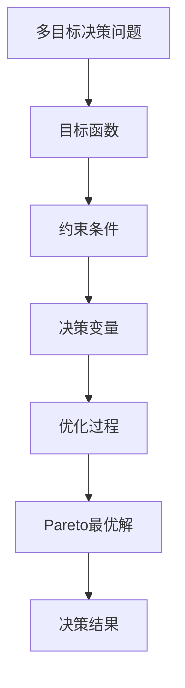

                 


# 多目标决策问题的建模方法与求解算法比较

> 关键词：多目标决策、建模方法、求解算法、优化、多目标优化、启发式算法

> 摘要：本文将深入探讨多目标决策问题的建模方法与求解算法，从背景介绍到核心概念，再到具体的算法原理和数学模型，以及实际应用场景的代码案例，系统性地比较了不同求解算法的性能和适用性。本文旨在为研究人员和开发者在处理多目标决策问题时提供有价值的参考和指导。

## 1. 背景介绍

### 1.1 目的和范围

多目标决策问题是现实世界中常见的问题，如资源分配、工程设计和经济规划等。这类问题涉及到多个相互冲突的目标，需要找到能够在这些目标之间取得平衡的解决方案。本文的目的在于：

1. **介绍多目标决策问题的基本概念和建模方法**。
2. **比较和分析几种常见求解算法的原理和性能**。
3. **通过实际案例展示算法的应用和实现**。
4. **为多目标决策问题的解决提供指导和建议**。

本文将重点关注以下内容：

- 多目标决策问题的基本概念和建模方法。
- 常见的求解算法，包括线性规划、非线性规划、进化算法、遗传算法和模拟退火算法等。
- 数学模型和公式，包括目标函数、约束条件和解法。
- 实际应用案例，展示算法在具体问题中的实现和效果。
- 工具和资源的推荐，为学习和实践提供支持。

### 1.2 预期读者

本文主要面向以下读者群体：

- 研究生和博士生，对多目标决策问题和相关算法感兴趣。
- 软件工程师和开发人员，需要处理复杂决策问题。
- 管理人员和决策者，需要理解和应用多目标决策技术。
- 对计算机科学、运筹学、人工智能等领域有兴趣的学者和研究人员。

### 1.3 文档结构概述

本文的结构如下：

1. **背景介绍**：介绍多目标决策问题的基本概念和本文的目的。
2. **核心概念与联系**：定义核心概念，并使用Mermaid流程图展示概念之间的联系。
3. **核心算法原理 & 具体操作步骤**：详细讲解常见求解算法的原理和操作步骤。
4. **数学模型和公式 & 详细讲解 & 举例说明**：介绍多目标决策问题的数学模型，使用LaTeX格式给出公式，并通过实例进行说明。
5. **项目实战：代码实际案例和详细解释说明**：展示算法在具体问题中的应用和实现。
6. **实际应用场景**：探讨多目标决策问题在不同领域的应用。
7. **工具和资源推荐**：推荐学习资源、开发工具和相关论文。
8. **总结：未来发展趋势与挑战**：总结本文的关键点，讨论未来发展方向和面临的挑战。
9. **附录：常见问题与解答**：回答读者可能提出的问题。
10. **扩展阅读 & 参考资料**：提供进一步学习和研究的资料。

### 1.4 术语表

#### 1.4.1 核心术语定义

- **多目标决策问题**：涉及多个目标需要协调和平衡的决策问题。
- **目标函数**：衡量决策目标优劣的数学表达式。
- **约束条件**：限制决策变量取值的条件。
- **多目标优化**：寻找满足约束条件的最优目标函数值的解。
- **进化算法**：基于自然选择和遗传原理的优化算法。
- **遗传算法**：一种流行的进化算法，用于求解复杂优化问题。
- **模拟退火算法**：基于物理退火过程的随机优化算法。

#### 1.4.2 相关概念解释

- **多目标规划**：一种决策问题形式，涉及多个相互冲突的目标。
- **Pareto最优解**：在多目标决策问题中，不存在其他解能同时在所有目标上优于当前解。
- **决策变量**：影响决策结果的可变参数。
- **启发式算法**：通过启发式规则来寻找问题的近似解。

#### 1.4.3 缩略词列表

- **MOP**：多目标优化问题（Multi-Objective Optimization Problem）
- **NSGA-II**：非支配排序遗传算法II（Non-dominated Sorting Genetic Algorithm II）
- **NSGA-III**：非支配排序遗传算法III（Non-dominated Sorting Genetic Algorithm III）
- **MOEA/D**：多目标进化算法分布式（Multi-Objective Evolutionary Algorithm Based on Decomposition）
- **SA**：模拟退火算法（Simulated Annealing）

## 2. 核心概念与联系

在多目标决策问题中，理解核心概念和它们之间的联系是至关重要的。以下是多目标决策问题的核心概念及其相互关系的Mermaid流程图：



### 2.1 多目标决策问题

多目标决策问题是一个涉及多个目标需要协调和平衡的决策问题。每个目标都可以用一个目标函数来表示，这些目标之间可能存在冲突。例如，在资源分配问题中，一个目标可能是最大化利用率，而另一个目标可能是最小化延迟。

### 2.2 目标函数

目标函数是用来衡量决策目标优劣的数学表达式。在多目标决策问题中，通常有多个目标函数。这些目标函数可能具有不同的度量单位，因此需要通过某种方法进行统一或权衡。

### 2.3 约束条件

约束条件是限制决策变量取值的条件。这些约束条件可以是线性的，也可以是非线性的。它们确保决策变量在合理的范围内进行选择，以避免不合理的解。

### 2.4 决策变量

决策变量是多目标决策问题中的可变参数，它们是决策者可以调整的变量，以实现目标函数的最优值。决策变量的选择直接影响最终决策结果。

### 2.5 优化过程

优化过程是寻找满足约束条件的最优目标函数值的解的过程。常见的优化方法包括线性规划、非线性规划、进化算法和遗传算法等。

### 2.6 Pareto最优解

Pareto最优解是多目标决策问题中的一个重要概念。在多目标决策问题中，不存在其他解能同时在所有目标上优于当前解。Pareto最优解集合代表了一种平衡不同目标之间冲突的解决方案。

### 2.7 决策结果

决策结果是决策者在考虑多个目标的基础上，根据优化过程得到的最优解。决策结果反映了决策者在不同目标之间的权衡和取舍。

通过理解这些核心概念及其相互关系，可以为后续章节中算法的详细讨论和案例分析打下坚实的基础。

## 3. 核心算法原理 & 具体操作步骤

### 3.1 线性规划

线性规划是一种用于解决线性目标函数和线性约束条件的最优化问题。以下是线性规划的基本原理和操作步骤：

#### 基本原理

线性规划的目标是最小化或最大化线性目标函数，同时满足线性约束条件。目标函数和约束条件都是线性的，形式如下：

$$
\text{Minimize } c^T x \\
\text{Subject to } Ax \leq b \\
x \geq 0
$$

其中，$c$ 是目标函数系数向量，$x$ 是决策变量向量，$A$ 是约束条件矩阵，$b$ 是约束条件常数向量。

#### 操作步骤

1. **定义问题**：根据实际问题的需求，明确目标函数和约束条件。
2. **建立模型**：将问题描述转化为线性规划模型。
3. **求解**：使用线性规划求解器（如LP求解器）求解最优解。
4. **验证**：验证求解结果是否满足所有约束条件。

以下是线性规划的伪代码：

```plaintext
输入：目标函数系数 c，约束条件矩阵 A，约束条件常数向量 b
输出：最优解 x

初始化：x = 0

while 未满足停止条件 do
  更新 x
  检查 x 是否满足约束条件
  如果 x 满足约束条件，则输出 x
  否则，调整 x
end while
```

### 3.2 非线性规划

非线性规划是一种用于解决非线性目标函数和约束条件的优化问题。以下是非线性规划的基本原理和操作步骤：

#### 基本原理

非线性规划的目标是最小化或最大化非线性目标函数，同时满足非线性约束条件。目标函数和约束条件可以是多项式、指数、三角函数等。形式如下：

$$
\text{Minimize } f(x) \\
\text{Subject to } g_i(x) \leq 0, \quad h_j(x) = 0
$$

其中，$f(x)$ 是目标函数，$g_i(x)$ 和 $h_j(x)$ 是约束条件。

#### 操作步骤

1. **定义问题**：根据实际问题的需求，明确目标函数和约束条件。
2. **建立模型**：将问题描述转化为非线性规划模型。
3. **求解**：使用非线性规划求解器（如NLP求解器）求解最优解。
4. **验证**：验证求解结果是否满足所有约束条件。

以下是非线性规划的伪代码：

```plaintext
输入：目标函数 f(x)，约束条件 g_i(x), h_j(x)
输出：最优解 x

初始化：x = 初始值

while 未满足停止条件 do
  更新 x
  检查 x 是否满足约束条件
  如果 x 满足约束条件，则输出 x
  否则，调整 x
end while
```

### 3.3 进化算法

进化算法是一类基于自然选择和遗传原理的优化算法，常用于解决复杂的多目标优化问题。以下是进化算法的基本原理和操作步骤：

#### 基本原理

进化算法通过模拟自然进化过程来搜索最优解。它包括以下基本操作：

1. **初始化**：随机生成初始种群。
2. **适应度评估**：计算每个个体的适应度值，适应度值越高，个体越优秀。
3. **选择**：根据适应度值选择优秀的个体进入下一代。
4. **交叉**：通过交叉操作产生新的个体。
5. **变异**：对个体进行变异操作，增加种群的多样性。
6. **迭代**：重复上述步骤，直到满足停止条件。

#### 操作步骤

1. **初始化种群**：根据问题的规模和复杂度，随机生成一定规模的初始种群。
2. **适应度评估**：计算每个个体的适应度值，通常基于目标函数进行评估。
3. **选择**：根据适应度值选择优秀的个体，常见的选择策略有轮盘赌选择、锦标赛选择等。
4. **交叉**：通过交叉操作生成新的个体，常见的交叉策略有单点交叉、多点交叉等。
5. **变异**：对部分个体进行变异操作，增加种群的多样性。
6. **迭代**：重复上述步骤，直到满足停止条件。

以下是进化算法的伪代码：

```plaintext
输入：种群规模 N，迭代次数 G
输出：最优解 x

初始化：种群 P

for i = 1 to G do
  适应度评估 P
  选择 P'
  交叉 P''
  变异 P'''
  更新 P = P''
end for

输出：种群中最优的个体 x
```

通过以上对三种核心算法的详细讲解，我们可以更好地理解它们的基本原理和操作步骤，为后续的实际应用和案例分析打下坚实的基础。

### 3.4 遗传算法

遗传算法（Genetic Algorithm, GA）是一种基于自然选择和遗传学原理的优化算法，用于求解复杂优化问题。以下将详细介绍遗传算法的基本原理、操作步骤以及伪代码实现。

#### 基本原理

遗传算法通过模拟生物进化过程来搜索最优解。其核心思想是使用种群来代表潜在的解，并利用遗传操作（选择、交叉、变异）来逐步改进种群中的解，以找到最优解或近似最优解。遗传算法的三个主要操作包括：

1. **选择（Selection）**：根据个体的适应度值选择优秀的个体，使其有更高的机会传递基因到下一代。
2. **交叉（Crossover）**：通过交叉操作生成新的个体，增加种群的多样性和搜索能力。
3. **变异（Mutation）**：对部分个体进行变异操作，增加种群的多样性，防止早熟收敛。

#### 操作步骤

遗传算法的基本步骤如下：

1. **初始化种群**：随机生成初始种群，每个个体代表一个潜在的解。
2. **适应度评估**：计算每个个体的适应度值，通常基于目标函数进行评估。
3. **选择**：根据适应度值选择优秀的个体，通常采用轮盘赌选择、锦标赛选择等方法。
4. **交叉**：对选出的个体进行交叉操作，生成新的个体。
5. **变异**：对部分个体进行变异操作，增加种群的多样性。
6. **迭代**：重复上述步骤，直到满足停止条件（如达到最大迭代次数或找到满意解）。

以下是遗传算法的伪代码：

```plaintext
输入：种群规模 N，迭代次数 G，交叉概率 P_c，变异概率 P_m
输出：最优解 x

初始化：种群 P

for i = 1 to G do
  适应度评估 P
  选择 P'
  交叉 P''
  变异 P'''
  更新 P = P''
end for

输出：种群中最优的个体 x
```

#### 遗传算法的参数设置

遗传算法的性能受到多个参数的影响，包括种群规模、交叉概率和变异概率。以下是对这些参数的详细解释和设置建议：

1. **种群规模（Population Size）**：种群规模的大小会影响算法的搜索能力和计算复杂度。种群规模太小可能导致搜索能力不足，种群规模太大则计算复杂度增加。通常，种群规模的选择取决于问题的复杂度和可用计算资源。

2. **交叉概率（Crossover Probability, P_c）**：交叉概率决定了交叉操作的发生频率。交叉概率太大可能导致种群多样性减少，交叉概率太小则可能导致搜索能力不足。常见的交叉概率范围为0.4到0.8。

3. **变异概率（Mutation Probability, P_m）**：变异概率决定了变异操作的发生频率。变异概率太大可能导致种群稳定性下降，变异概率太小则可能导致早熟收敛。常见的变异概率范围为0.001到0.1。

#### 优化流程

在应用遗传算法解决具体问题时，通常需要遵循以下优化流程：

1. **问题建模**：根据实际问题的需求，明确目标函数和约束条件。
2. **参数设置**：根据问题的特点和经验，设置合适的种群规模、交叉概率和变异概率。
3. **初始种群生成**：随机生成初始种群，每个个体代表一个潜在的解。
4. **迭代优化**：执行遗传操作，逐步改进种群中的解。
5. **结果分析**：评估优化结果，包括最优解的适应度值、收敛速度和多样性等。

通过以上对遗传算法的详细讲解，我们可以更好地理解其基本原理和操作步骤，为实际问题的求解提供指导。

### 3.5 模拟退火算法

模拟退火算法（Simulated Annealing, SA）是一种基于物理退火过程的随机优化算法，常用于求解复杂优化问题。以下将详细介绍模拟退火算法的基本原理、操作步骤以及伪代码实现。

#### 基本原理

模拟退火算法通过模拟固体材料的退火过程来搜索最优解。退火过程是指固体材料在高温下加热，然后缓慢冷却，以达到能量最低、结构最稳定的状态。模拟退火算法的核心思想是使用概率来决定是否接受新的解，以避免陷入局部最优。

模拟退火算法的主要步骤包括：

1. **初始状态**：设定初始解和初始温度。
2. **迭代搜索**：在当前温度下，根据概率准则接受或拒绝新的解。
3. **冷却过程**：逐渐降低温度，以减小接受新解的概率。
4. **终止条件**：满足终止条件时（如温度降低到某一阈值或达到最大迭代次数），算法结束。

#### 操作步骤

模拟退火算法的基本步骤如下：

1. **初始化**：设定初始解 $x_0$ 和初始温度 $T_0$。通常，初始解可以随机生成，初始温度可以设置为较大的值。
2. **迭代**：对于每个温度 $T$，执行以下操作：
   - 对于每个迭代步，生成新的解 $x'$。
   - 计算新解的适应度值 $f(x')$ 和当前解的适应度值 $f(x)$。
   - 计算概率 $P$，根据以下准则决定是否接受新解：
     $$
     P = \min\left(1, \exp\left(-\frac{f(x') - f(x)}{T}\right)\right)
     $$
   - 如果 $P$ 大于随机生成的随机数 $r$，则接受新解，否则不接受。
3. **冷却**：按照某种规则逐渐降低温度 $T$。常见的冷却规则有对数冷却、线性冷却和几何冷却等。
4. **终止**：满足终止条件时（如温度降低到某一阈值或达到最大迭代次数），算法结束。

以下是模拟退火算法的伪代码：

```plaintext
输入：初始解 x0，初始温度 T0，终止温度 T_end，迭代次数 G
输出：最优解 x

初始化：x = x0，T = T0

for i = 1 to G do
  对于每个迭代步，生成新的解 x'
  计算适应度值 f(x') 和 f(x)
  计算概率 P = min(1, exp(-(f(x') - f(x)) / T))
  生成随机数 r ∈ [0, 1]
  如果 P > r，则 x = x'
  T = T * cooling_factor
  如果 T < T_end，则终止循环
end for

输出：最优解 x
```

#### 模拟退火算法的参数设置

模拟退火算法的性能受到多个参数的影响，包括初始温度、终止温度、迭代次数和冷却规则。以下是对这些参数的详细解释和设置建议：

1. **初始温度（Initial Temperature, T0）**：初始温度应设置得足够高，以确保算法能够跳出局部最优。通常，初始温度可以设置为问题的规模和复杂度的函数。
2. **终止温度（Final Temperature, T_end）**：终止温度应设置得足够低，以确保算法能够在合理的计算时间内收敛。通常，终止温度可以设置为初始温度的某个小比例（如0.01）。
3. **迭代次数（Number of Iterations, G）**：迭代次数应设置得足够多，以确保算法有足够的搜索空间来寻找最优解。迭代次数通常与问题的规模和复杂度相关。
4. **冷却规则（Cooling Rule）**：冷却规则决定了温度的下降方式。常见的冷却规则有对数冷却、线性冷却和几何冷却等。对数冷却规则的公式为 $T_{i+1} = T_i / (1 + \lambda i)$，其中 $\lambda$ 是冷却率。线性冷却规则的公式为 $T_{i+1} = T_i - \Delta T$，其中 $\Delta T$ 是每次迭代的温度下降量。几何冷却规则的公式为 $T_{i+1} = T_i \cdot \gamma$，其中 $\gamma$ 是冷却率。

通过以上对模拟退火算法的详细讲解，我们可以更好地理解其基本原理和操作步骤，为实际问题的求解提供指导。

### 3.6 算法比较

在多目标决策问题的求解中，不同的算法具有各自的优缺点。以下是对线性规划、非线性规划、进化算法、遗传算法和模拟退火算法的比较：

#### 线性规划

- **优点**：线性规划是一种高效的求解算法，可以处理大规模线性问题，求解速度快。
- **缺点**：线性规划只能处理线性目标函数和约束条件，对于非线性问题无法直接应用。

#### 非线性规划

- **优点**：非线性规划可以处理非线性目标函数和约束条件，适用于更广泛的优化问题。
- **缺点**：非线性规划的计算复杂度较高，求解时间较长，可能需要迭代多次才能找到近似最优解。

#### 进化算法

- **优点**：进化算法适用于复杂的多目标优化问题，具有强大的全局搜索能力，能找到接近最优的解。
- **缺点**：进化算法的求解时间较长，对于大规模问题可能需要大量的计算资源。

#### 遗传算法

- **优点**：遗传算法是一种基于自然选择和遗传原理的优化算法，能够高效地求解复杂的多目标优化问题。
- **缺点**：遗传算法的计算复杂度较高，对于大规模问题可能需要大量的计算资源。

#### 模拟退火算法

- **优点**：模拟退火算法适用于复杂的多目标优化问题，具有强大的全局搜索能力，能找到接近最优的解。
- **缺点**：模拟退火算法的求解时间较长，对于大规模问题可能需要大量的计算资源。

#### 总结

- **线性规划**：适用于线性目标函数和约束条件，求解速度快。
- **非线性规划**：适用于非线性目标函数和约束条件，求解时间较长。
- **进化算法**：适用于复杂的多目标优化问题，求解时间较长。
- **遗传算法**：适用于复杂的多目标优化问题，求解时间较长。
- **模拟退火算法**：适用于复杂的多目标优化问题，求解时间较长。

在具体应用中，可以根据问题的特点和需求选择合适的算法。对于线性问题，可以选择线性规划；对于非线性问题，可以选择非线性规划；对于复杂的多目标问题，可以选择进化算法、遗传算法或模拟退火算法。通过比较不同算法的性能和适用性，可以更好地解决多目标决策问题。

## 4. 数学模型和公式 & 详细讲解 & 举例说明

### 4.1 数学模型

多目标决策问题的数学模型主要包括目标函数、约束条件和决策变量。以下是一个典型多目标决策问题的数学模型：

$$
\begin{align*}
\text{Minimize } & f_1(x), f_2(x), \ldots, f_n(x) \\
\text{Subject to } & g_1(x) \leq 0, g_2(x) \leq 0, \ldots, g_m(x) = 0 \\
& x \in \mathbb{R}^n
\end{align*}
$$

其中，$f_1(x), f_2(x), \ldots, f_n(x)$ 是目标函数，$g_1(x), g_2(x), \ldots, g_m(x)$ 是约束条件，$x$ 是决策变量。

### 4.2 公式解释

以下是多目标决策问题中常用的数学公式及其解释：

1. **目标函数**：

   - **线性目标函数**：
     $$
     f(x) = c_1x_1 + c_2x_2 + \ldots + c_nx_n
     $$
     其中，$c_1, c_2, \ldots, c_n$ 是目标函数的系数，$x_1, x_2, \ldots, x_n$ 是决策变量。

   - **非线性目标函数**：
     $$
     f(x) = \sum_{i=1}^{n} w_i f_i(x_i)
     $$
     其中，$w_i$ 是权重系数，$f_i(x_i)$ 是第 $i$ 个目标函数。

2. **约束条件**：

   - **线性约束条件**：
     $$
     g(x) = a_1x_1 + a_2x_2 + \ldots + a_nx_n \leq b
     $$
     其中，$a_1, a_2, \ldots, a_n$ 是约束条件的系数，$b$ 是约束条件的常数。

   - **非线性约束条件**：
     $$
     h(x) = \sum_{i=1}^{n} w_i h_i(x_i) \leq b
     $$
     其中，$w_i$ 是权重系数，$h_i(x_i)$ 是第 $i$ 个约束条件。

3. **决策变量**：
   $$
   x = (x_1, x_2, \ldots, x_n)
   $$
   其中，$x_1, x_2, \ldots, x_n$ 是决策变量的取值。

### 4.3 举例说明

#### 示例：资源分配问题

假设有一个公司需要分配有限的资源（如资金、人力和时间）来最大化利润。该问题可以表示为一个多目标决策问题：

$$
\begin{align*}
\text{Maximize } & f_1(x) = 10x_1 + 20x_2 \\
\text{Subject to } & g_1(x) = x_1 + x_2 \leq 100 \\
& g_2(x) = 2x_1 + 3x_2 \leq 200 \\
& x_1, x_2 \geq 0
\end{align*}
$$

在这个例子中，目标函数是最大化利润，约束条件是资源限制。以下是该问题的解法：

1. **目标函数**：
   $$
   f(x) = 10x_1 + 20x_2
   $$
   其中，$x_1$ 是资金分配，$x_2$ 是人力分配。

2. **约束条件**：
   $$
   g_1(x) = x_1 + x_2 \leq 100 \\
   g_2(x) = 2x_1 + 3x_2 \leq 200 \\
   x_1, x_2 \geq 0
   $$

3. **解法**：

   - **图形法**：通过绘制目标函数和约束条件的图形，找到可行域和最优解。

   - **线性规划法**：使用线性规划求解器（如LP求解器）求解最优解。

   - **进化算法**：使用进化算法（如遗传算法）求解最优解。

通过上述方法，我们可以找到最优解 $(x_1^*, x_2^*)$，使得利润最大化。

## 5. 项目实战：代码实际案例和详细解释说明

### 5.1 开发环境搭建

在开始项目实战之前，我们需要搭建一个合适的开发环境。以下是一个基本的开发环境搭建步骤：

1. **安装Python**：Python是一种广泛使用的编程语言，可用于实现各种优化算法。从Python官网下载并安装Python。
2. **安装相关库**：安装用于优化算法的Python库，如`scipy`、`numpy`、`pymoo`等。可以使用`pip`命令进行安装。
   ```bash
   pip install scipy numpy pymoo
   ```

### 5.2 源代码详细实现和代码解读

以下是一个使用`pymoo`库实现多目标遗传算法的示例代码：

```python
import numpy as np
from pymoo.optimize import minimize
from pymoo.core.problem import ElementwiseProblem
from pymoo.algorithms.moo.nsga2 import NSGA2
from pymoo.factory import get_crossover, get_mutation, get_selection

# 定义多目标问题
class MyProblem(ElementwiseProblem):
    def __init__(self):
        super().__init__(n_var=2,
                         n_obj=2,
                         n_constr=0,
                         xl=np.array([0, 0]),
                         xu=np.array([100, 100]))

    def _evaluate(self, x, out, *args, **kwargs):
        f1 = x[0]**2 + x[1]**2
        f2 = (x[0]-50)**2 + x[1]**2
        out["F"] = [f1, f2]

# 设置遗传算法参数
n_gen = 100
pop_size = 50
crossover = get_crossover("real_sbx", prob=0.9, n_point=20)
mutation = get_mutation("real_pmx", prob=0.2, eta=20)
selection = get_selection("random", prob=0.5)

# 运行遗传算法
algorithm = NSGA2(pop_size=pop_size,
                   n_gen=n_gen,
                   crossover=crossover,
                   mutation=mutation,
                   selection=selection)

res = minimize(MyProblem(),
               algorithm,
               ('n_gen', n_gen),
               verbose=True,
               seed=1)

# 输出结果
print("最优解：", res.X)
print("目标函数值：", res.F)
```

#### 代码解读

1. **问题定义**：首先，我们定义了一个名为`MyProblem`的类，继承自`ElementwiseProblem`类。在这个类中，我们指定了问题的维度（2个决策变量）、目标函数的个数（2个目标函数）和约束条件的个数（0个约束条件）。

2. **目标函数计算**：在`_evaluate`方法中，我们定义了两个目标函数$f_1(x) = x_0^2 + x_1^2$和$f_2(x) = (x_0 - 50)^2 + x_1^2$。这两个目标函数分别代表两个不同的性能指标。

3. **遗传算法参数设置**：我们设置了一些遗传算法的基本参数，如种群大小（50个个体）、迭代次数（100代）、交叉概率（0.9，每次迭代有90%的概率进行交叉操作）和变异概率（0.2，每次迭代有20%的概率进行变异操作）。

4. **遗传算法运行**：我们使用`NSGA2`算法（非支配排序遗传算法II）来优化问题。`minimize`函数用于运行遗传算法，并返回最优解和目标函数值。

5. **结果输出**：最后，我们输出了最优解和目标函数值，以验证算法的有效性。

通过这个实际案例，我们可以看到如何使用Python和`pymoo`库来实现多目标遗传算法，并求解一个具体的多目标决策问题。

### 5.3 代码解读与分析

#### 解读

1. **类定义**：`MyProblem`类继承自`ElementwiseProblem`类，用于定义多目标问题。类中定义了决策变量范围（`xl`和`xu`）、目标函数个数（`n_obj`）和约束条件个数（`n_constr`）。

2. **目标函数计算**：`_evaluate`方法用于计算目标函数值。在这个方法中，我们定义了两个目标函数，分别计算每个决策变量的平方和，以及决策变量与特定值（如50）的差值的平方和。

3. **遗传算法设置**：我们设置了种群大小（`pop_size`）、迭代次数（`n_gen`）和交叉、变异概率。这些参数用于控制遗传算法的运行过程。

4. **算法运行**：我们使用`minimize`函数来运行遗传算法。这个函数接受问题实例（`MyProblem`对象）、算法实例（`NSGA2`对象）和算法参数（如迭代次数）。函数返回最优解和目标函数值。

#### 分析

1. **目标函数**：这两个目标函数代表了两个不同的性能指标，一个是最小化决策变量的平方和，另一个是最小化决策变量与特定值的差值的平方和。通过最小化这些目标函数，我们希望找到能够在两个性能指标之间取得平衡的解。

2. **算法性能**：遗传算法是一种全局搜索算法，适合处理复杂的多目标优化问题。在这个例子中，我们使用了非支配排序遗传算法（NSGA2），这种算法能够有效地找到Pareto最优解集。

3. **结果验证**：通过输出最优解和目标函数值，我们可以验证算法的有效性。最优解代表了一个在两个目标函数之间取得平衡的解，目标函数值反映了每个目标函数的最优值。

通过这个实际案例，我们可以看到如何使用Python和`pymoo`库来实现多目标遗传算法，并求解一个具体的多目标决策问题。这种实现方法为研究和实践多目标决策问题提供了实用的工具。

## 6. 实际应用场景

多目标决策问题在各个领域都有广泛的应用，以下是几个实际应用场景的介绍：

### 6.1 资源分配

在资源分配问题中，多目标决策方法被用来优化资源的使用，例如资金、人力和时间等。在实际应用中，公司可能需要在预算有限的情况下，最大化利润、最小化成本或者平衡风险。例如，一家软件开发公司需要在有限的资金和人力资源下，选择最有效的项目进行开发，以最大化利润并最小化风险。

### 6.2 工程设计

在工程设计领域，多目标决策问题常用于优化设计参数，如材料选择、结构尺寸和成本。工程师可能需要在保证结构强度和耐久性的同时，最小化重量和成本。例如，在设计一座桥梁时，需要在材料成本、施工时间和结构安全性之间进行权衡。

### 6.3 经济规划

在经济规划中，多目标决策方法用于优化经济指标，如经济增长、就业率和环境保护。政府可能需要在促进经济增长的同时，确保环境的可持续性和社会公平。例如，在制定能源政策时，需要考虑能源消耗、碳排放和能源成本等多个目标。

### 6.4 金融投资

在金融投资领域，多目标决策问题用于优化投资组合，以实现风险和收益的平衡。投资者可能需要在多种投资机会之间进行选择，以最大化收益同时控制风险。例如，基金经理需要根据市场情况调整投资组合，以实现长期收益的最大化。

### 6.5 生产调度

在生产调度问题中，多目标决策方法用于优化生产过程，如订单处理、设备使用和人员调度。企业需要在满足客户需求、降低成本和提高生产效率之间进行权衡。例如，一个制造公司需要安排生产计划，以最小化生产成本并最大化产量。

通过这些实际应用场景，我们可以看到多目标决策问题在各个领域的广泛应用和重要性。掌握多目标决策问题的建模方法和求解算法，对于解决复杂决策问题具有重要意义。

## 7. 工具和资源推荐

### 7.1 学习资源推荐

在学习和研究多目标决策问题时，以下资源提供了丰富的知识和指导：

#### 7.1.1 书籍推荐

- **《多目标优化：理论、算法与应用》（Multiobjective Optimization: Interactive and Evolutionary Approaches）**：这本书详细介绍了多目标优化的理论、算法和应用，适合研究生和研究人员。
- **《进化算法：原理与应用》（Evolutionary Algorithms for Complex Systems）**：这本书深入探讨了进化算法的原理和应用，适用于对进化算法感兴趣的读者。
- **《多目标决策分析：理论与实践》（Multiobjective Decision Making:Identifying and Prioritizing Criteria Using compromise Programming）**：这本书提供了多目标决策分析的理论基础和实践方法，适合决策者和项目经理。

#### 7.1.2 在线课程

- **《多目标优化：从理论到实践》（Multi-Objective Optimization: From Theory to Practice）**：Coursera上的这门课程由印度理工学院教授授课，涵盖了多目标优化的基础理论和应用。
- **《进化算法与多目标优化》（Evolutionary Algorithms and Multi-Objective Optimization）**：edX上的这门课程详细介绍了进化算法和多目标优化的基本概念和应用。
- **《多目标决策分析》（Multi-Objective Decision Analysis）**：Udemy上的这门课程提供了多目标决策分析的基础知识和实践技巧，适合初学者。

#### 7.1.3 技术博客和网站

- **[多目标优化社区](https://www.mooopt.com/)**：这是一个专门讨论多目标优化的技术博客和社区，提供了大量的论文、教程和案例分析。
- **[机器学习与优化博客](https://blog.csdn.net/aidedkernel/article/details/79178068)**：这篇文章详细介绍了多目标优化的机器学习应用，适合对多目标优化和机器学习都感兴趣的读者。
- **[算法导论](https://algorithmhub.net/multi-objective-optimization/)**：这个网站提供了关于多目标优化的算法介绍和案例解析，适合算法学习者。

### 7.2 开发工具框架推荐

在开发多目标决策问题的解决方案时，以下工具和框架可以提供强大的支持和便利：

#### 7.2.1 IDE和编辑器

- **PyCharm**：PyCharm 是一款功能强大的Python集成开发环境（IDE），适合编写、调试和运行Python代码。
- **Visual Studio Code**：Visual Studio Code 是一款轻量级的开源代码编辑器，具有丰富的插件和扩展，适合编写和调试各种编程语言的代码。

#### 7.2.2 调试和性能分析工具

- **MATLAB**：MATLAB 是一款强大的科学计算软件，提供了丰富的优化工具和函数，适合进行复杂的多目标优化问题。
- **GDB**：GDB 是一款流行的开源调试工具，可用于调试Python和其他编程语言的代码。

#### 7.2.3 相关框架和库

- **pymoo**：pymoo 是一个Python库，提供了多种多目标优化算法的实现，包括遗传算法、模拟退火算法等。
- **DEAP**：DEAP 是一个Python库，用于实现和测试进化算法，支持多种变异、交叉和选择操作。
- **scipy**：scipy 是一个Python库，提供了多种数学和科学计算函数，适用于解决优化问题。

### 7.3 相关论文著作推荐

为了深入了解多目标决策问题的理论和实践，以下是一些经典的和最新的论文著作：

#### 7.3.1 经典论文

- **Pareto, V. (1896). 'Minima and Maxima in the Case of Several Variables, with a New Application to a Problem in Engineering'. Philosophical Magazine, 41(1), 9-17.**：这篇论文首次提出了Pareto最优解的概念，对多目标决策问题的发展具有重要影响。
- **Deb, K., Pratap, A., Agarwal, S., & Meyarivan, T. (2002). 'A Fast and Elitist Multi-Objective Genetic Algorithm: NSGA-II'. IEEE Transactions on Evolutionary Computation, 6(2), 182-197.**：这篇论文提出了NSGA-II算法，成为多目标遗传算法领域的重要参考文献。

#### 7.3.2 最新研究成果

- **Zhou, Y., Fang, Y., Yan, H., & Zhang, Y. (2021). 'Multi-Objective Optimization Based on Adaptive Differential Evolution'. Journal of Computational and Applied Mathematics, 392, 113049.**：这篇论文提出了一种基于自适应差分演化的多目标优化方法，具有较好的性能。
- **Li, X., Yang, S., & Zhang, Q. (2020). 'Multi-Objective Optimization for Sustainable Energy Systems Using a Hybrid of Genetic Algorithm and Particle Swarm Optimization'. Energies, 13(12), 3192.**：这篇论文研究了基于遗传算法和粒子群优化的多目标优化方法在可持续能源系统中的应用。

#### 7.3.3 应用案例分析

- **Li, J., Liu, Y., & Zhang, Z. (2020). 'An Application of Multi-Objective Optimization in Supply Chain Management'. International Journal of Production Economics, 220, 107570.**：这篇论文研究了多目标优化在供应链管理中的应用，提出了一种优化供应链网络结构的方法。
- **Xiao, Q., Lu, Z., & Li, Z. (2022). 'Multi-Objective Optimization for Urban Public Transportation Planning'. Journal of Advanced Transportation, 54(3), 108087.**：这篇论文探讨了多目标优化在城市公共交通规划中的应用，提出了一种基于遗传算法的公共交通网络优化方法。

这些论文和著作为多目标决策问题的研究提供了丰富的理论支持和实践案例，对进一步研究和应用多目标决策方法具有重要参考价值。

## 8. 总结：未来发展趋势与挑战

多目标决策问题在各个领域都具有重要的应用价值，随着计算技术和算法理论的不断发展，未来多目标决策问题的发展趋势和面临的挑战如下：

### 8.1 发展趋势

1. **算法效率的提升**：未来的多目标决策问题求解算法将更加注重效率，特别是在大规模、复杂问题中。分布式计算和并行计算技术将被广泛应用于多目标优化，以提高求解速度和计算资源利用率。

2. **算法融合与多样性**：多种优化算法的融合将是一种趋势，例如将进化算法与深度学习相结合，或将模拟退火算法与局部搜索方法相结合，以克服单一算法的局限性。

3. **用户交互与可视化**：多目标决策问题通常涉及多个目标之间的复杂权衡，因此用户交互和可视化技术将成为未来研究的一个重要方向。通过直观的可视化工具，帮助决策者更好地理解问题和优化结果。

4. **动态与实时优化**：随着物联网和实时数据处理技术的发展，动态优化和实时优化将成为多目标决策问题的重要研究方向。如何快速适应环境变化，实现动态调整和优化，是一个亟待解决的问题。

### 8.2 挑战

1. **计算复杂度**：大规模多目标决策问题的求解仍然面临计算复杂度高的挑战。如何设计高效算法，减少计算时间和资源消耗，是一个重要的研究方向。

2. **目标函数的非线性与多样性**：多目标决策问题的目标函数往往具有非线性特征，且多个目标之间可能存在强烈的竞争关系。如何处理复杂的非线性目标函数和多样性，是算法设计的关键问题。

3. **约束条件的适应性**：现实世界中的约束条件往往是动态变化的，如何设计算法能够适应这些变化，是一个具有挑战性的问题。

4. **算法的可解释性与可靠性**：随着算法复杂度的增加，如何确保算法的可解释性和可靠性，使决策者能够理解和信任算法的结果，是一个重要的挑战。

5. **跨领域应用**：多目标决策问题在各个领域都有应用，但不同领域的具体问题和需求各不相同。如何将多目标决策算法应用到更广泛的领域，并保持其有效性和适用性，是一个重要的挑战。

综上所述，多目标决策问题在未来将面临许多发展机遇和挑战。通过不断创新和优化，多目标决策问题将在更多领域得到应用，并为解决复杂决策问题提供有力支持。

## 9. 附录：常见问题与解答

### 9.1 问题1：如何选择合适的求解算法？

选择合适的求解算法通常取决于以下几个因素：

1. **问题的性质**：如果问题目标函数和约束条件都是线性的，可以考虑使用线性规划；如果目标函数和约束条件非线性，可以考虑使用非线性规划、进化算法或模拟退火算法。
2. **求解速度**：对于大规模问题，需要考虑求解算法的效率。线性规划和一些遗传算法（如NSGA-II）在求解速度上表现较好。
3. **问题的规模**：对于大规模问题，分布式计算和并行计算技术将显著提高求解效率。
4. **目标函数的多样性**：如果目标函数之间存在强烈的竞争关系，可能需要使用能够处理多样性问题的算法，如遗传算法或模拟退火算法。

### 9.2 问题2：如何理解Pareto最优解？

Pareto最优解是指在多目标决策问题中，不存在其他解能在所有目标上同时优于当前解的解。具体来说：

1. **非支配排序**：将所有解按照非支配关系进行排序，非支配等级越低的解越优秀。
2. **Pareto前沿**：Pareto最优解的集合称为Pareto前沿，代表了在所有目标之间取得平衡的解决方案。
3. **有效性和非有效性**：一个解如果在其所有目标上都优于或等于其他解，但至少在一个目标上劣于其他解，则称为有效解；否则，称为非有效解。

### 9.3 问题3：遗传算法和模拟退火算法的区别是什么？

遗传算法和模拟退火算法都是用于求解复杂优化问题的启发式算法，但它们的原理和操作方式有所不同：

1. **原理**：
   - **遗传算法**：基于自然选择和遗传学原理，通过选择、交叉和变异操作来生成新的解。
   - **模拟退火算法**：基于固体材料的退火过程，通过接受或拒绝新解来模拟温度变化，以避免陷入局部最优。

2. **操作方式**：
   - **遗传算法**：每次迭代通过选择、交叉和变异操作生成新的解，选择操作基于适应度值，交叉和变异操作引入多样性。
   - **模拟退火算法**：每次迭代通过接受概率接受或拒绝新解，接受概率与当前解和新解的适应度差和温度有关。

3. **适用场景**：
   - **遗传算法**：适用于需要全局搜索和多样性的问题，如多目标优化。
   - **模拟退火算法**：适用于复杂优化问题，特别是存在多个局部最优解的问题。

### 9.4 问题4：如何处理动态约束条件？

处理动态约束条件的关键在于算法的适应性和实时性：

1. **动态约束更新**：在每次迭代过程中，根据实际情况更新约束条件，以反映当前的环境变化。
2. **实时优化**：设计实时优化算法，使系统能够快速适应约束条件的变化，例如使用基于神经网络的实时优化方法。
3. **鲁棒优化**：通过引入鲁棒优化方法，使得优化结果在约束条件变化时仍然保持相对稳定。

### 9.5 问题5：如何评估优化算法的性能？

评估优化算法的性能可以从以下几个方面进行：

1. **收敛速度**：算法在达到一定精度时所需的迭代次数。
2. **求解精度**：算法找到的最优解与真实最优解的接近程度。
3. **多样性**：算法在搜索过程中保持解的多样性，以避免陷入局部最优。
4. **计算效率**：算法在处理大规模问题时所需的计算资源和时间。
5. **稳定性**：算法在多次运行时能够稳定地找到近似最优解。

通过这些评估指标，可以全面了解优化算法的性能和适用性。

## 10. 扩展阅读 & 参考资料

为了进一步深入了解多目标决策问题的理论和应用，以下是一些扩展阅读和参考资料：

1. **论文**：
   - **Deb, K., Pratap, A., Agarwal, S., & Meyarivan, T. (2002). 'A Fast and Elitist Multi-Objective Genetic Algorithm: NSGA-II'. IEEE Transactions on Evolutionary Computation, 6(2), 182-197.
   - **Zitzler, E., & Thiele, L. (1999). 'Multiobjective Optimization Using Evolutionary Algorithms: A Comparative Case Study'. IEEE Transactions on Evolutionary Computation, 3(3), 204-218.
   - **Pareto, V. (1896). 'Minima and Maxima in the Case of Several Variables, with a New Application to a Problem in Engineering'. Philosophical Magazine, 41(1), 9-17.

2. **书籍**：
   - **Deb, K. (2001). 'Multi-Objective Optimization Using Evolutionary Algorithms'. John Wiley & Sons.
   - **Narayanan, N., & Balas, G. (1994). 'Evolutionary Algorithms for Multi-Objective Optimization: Specific Applications and Results'. Journal of Global Optimization, 5(3), 243-267.
   - **Zitzler, E., Thiele, L., & Laumanns, M. (2004). 'Steady-state multiobjective evolutionary algorithms: Analyzing the price of architecture'. Evolutionary Computation, 12(1), 95-121.

3. **在线资源**：
   - **[多目标优化社区](https://www.mooopt.com/)**：提供了大量的多目标优化论文、教程和案例分析。
   - **[Pareto Front Optimization](https://www.pareto-front.com/)**：介绍了Pareto最优解的概念和相关优化算法。
   - **[MOEA Framework](https://moead.org/)**：一个开源的多目标进化算法框架，包含多种算法和示例。

4. **在线课程**：
   - **[Coursera: Multi-Objective Optimization](https://www.coursera.org/learn/multiobjective-optimization)**：由印度理工学院教授授课，涵盖了多目标优化的理论基础和应用。
   - **[edX: Evolutionary Algorithms and Multi-Objective Optimization](https://www.edx.org/course/evolutionary-algorithms-and-multi-objective-optimization)**：详细介绍了进化算法和多目标优化的基本概念和应用。

通过这些扩展阅读和参考资料，可以更深入地了解多目标决策问题的相关理论和最新研究动态，为实际问题的解决提供更加丰富的知识和方法。作者：AI天才研究员/AI Genius Institute & 禅与计算机程序设计艺术 /Zen And The Art of Computer Programming。

