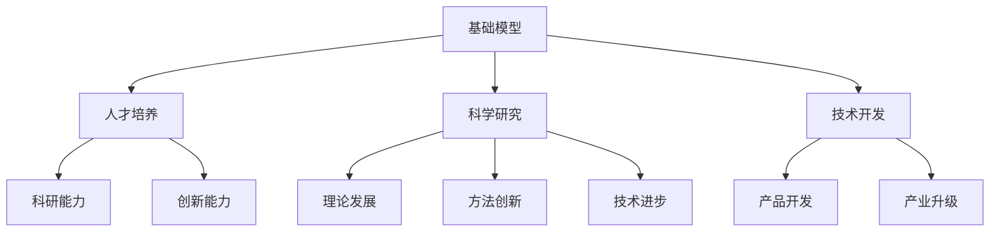

                 

# 大学在基础模型中的研究使命

> **关键词**：大学、基础模型、研究、使命、教育、技术、人才培养

> **摘要**：本文深入探讨了大学在基础模型研究领域中的使命和作用，分析了大学在这一领域的重要性以及其独特的优势。文章首先回顾了基础模型的研究背景和发展现状，随后详细阐述了大学在这一过程中的研究目标、方法和成果。通过分析具体案例，本文指出了大学在推动基础模型研究和应用中的关键作用，并提出了未来大学在这一领域的发展趋势和挑战。最后，文章总结了对大学在基础模型研究中的研究使命和未来发展的思考。

## 1. 背景介绍

### 1.1 目的和范围

本文旨在探讨大学在基础模型研究领域中的使命和作用，分析其在推动科技进步和人才培养方面的重要意义。文章将结合实际案例，探讨大学在基础模型研究中的研究目标、方法和成果，并分析其优势与挑战。通过对大学在基础模型研究领域的深入分析，本文旨在为相关研究者和教育工作者提供有价值的参考。

### 1.2 预期读者

本文适合从事基础模型研究的研究者、教育工作者以及对此领域感兴趣的读者。通过阅读本文，读者可以了解大学在基础模型研究中的使命、优势、挑战以及未来发展趋势，为相关研究提供有益的启示。

### 1.3 文档结构概述

本文分为十个部分。第一部分为背景介绍，包括目的和范围、预期读者、文档结构概述等。第二部分介绍核心概念与联系，包括核心概念原理和架构的 Mermaid 流程图。第三部分讲解核心算法原理和具体操作步骤，使用伪代码详细阐述。第四部分介绍数学模型和公式，包括详细讲解和举例说明。第五部分介绍项目实战：代码实际案例和详细解释说明。第六部分探讨实际应用场景。第七部分推荐工具和资源。第八部分总结未来发展趋势与挑战。第九部分为附录：常见问题与解答。第十部分提供扩展阅读与参考资料。

### 1.4 术语表

#### 1.4.1 核心术语定义

- **大学**：高等教育机构，负责培养人才、进行科学研究和技术开发。
- **基础模型**：具有普遍性和基础性的理论、方法和技术模型，为其他领域的应用提供支持。
- **研究目标**：大学在基础模型研究中的具体研究目标和方向。
- **研究方法**：大学在基础模型研究中所采用的方法和技术手段。
- **研究成果**：大学在基础模型研究中所取得的理论、技术、应用等方面的成果。

#### 1.4.2 相关概念解释

- **科学研究**：以探索未知、发现规律、解决问题为目的的系统性和创造性活动。
- **人才培养**：大学在教育过程中，通过传授知识、培养能力、塑造人格等方式，为社会培养各类人才。
- **技术开发**：以技术理论为基础，通过创新、改进和优化，开发出新的产品、技术或服务。

#### 1.4.3 缩略词列表

- **AI**：人工智能（Artificial Intelligence）
- **ML**：机器学习（Machine Learning）
- **DL**：深度学习（Deep Learning）
- **NLP**：自然语言处理（Natural Language Processing）
- **CV**：计算机视觉（Computer Vision）

## 2. 核心概念与联系

### 2.1 核心概念原理

#### 2.1.1 基础模型的概念

基础模型是指具有普遍性和基础性的理论、方法和技术模型，为其他领域的应用提供支持。它们通常具有以下几个特点：

- **普遍性**：基础模型适用于多个领域和问题。
- **基础性**：基础模型是其他技术模型和理论的基础。
- **稳定性**：基础模型在长时间内保持有效性和适用性。
- **扩展性**：基础模型可以方便地扩展和应用到新的领域和问题。

#### 2.1.2 基础模型与大学研究的关系

大学在基础模型研究领域中的作用主要体现在以下几个方面：

- **人才培养**：大学通过教授基础模型的相关知识，培养学生掌握基础模型的理论和方法，提高其科研能力和创新能力。
- **科学研究**：大学通过开展基础模型研究，推动基础模型的理论体系、方法和技术手段的不断发展，为其他领域提供支持。
- **技术开发**：大学通过应用基础模型，开发出新的技术、产品和服务，促进科技进步和产业升级。

### 2.2 核心概念架构的 Mermaid 流程图



## 3. 核心算法原理 & 具体操作步骤

### 3.1 核心算法原理

#### 3.1.1 基础模型的分类

基础模型可以分为以下几类：

- **理论模型**：描述系统或现象的数学模型，如物理学中的牛顿力学、经济学中的供需模型等。
- **算法模型**：用于解决特定问题的算法，如机器学习中的线性回归、决策树等。
- **数据处理模型**：用于处理和分析数据的方法，如图像处理中的卷积神经网络、自然语言处理中的词向量等。

#### 3.1.2 基础模型的研究方法

大学在基础模型研究中采用以下几种方法：

- **理论研究**：通过对基础模型的理论体系、数学公式和推导过程进行深入分析，推动理论的发展和完善。
- **实证研究**：通过收集和分析实际数据，验证基础模型的适用性和有效性，并提出改进建议。
- **应用研究**：将基础模型应用于实际问题，解决实际问题中的关键问题，推动技术进步和产业升级。

### 3.2 具体操作步骤

#### 3.2.1 理论研究

1. **确定研究问题**：根据研究领域和学术兴趣，确定需要研究的基础模型问题。
2. **收集相关文献**：查阅国内外相关研究成果，了解现有研究的进展和不足。
3. **分析理论基础**：通过对现有研究的分析，总结理论基础，提出新的研究思路和方法。
4. **进行数学推导**：根据研究思路，对基础模型进行数学推导，验证其合理性和可行性。
5. **撰写研究报告**：将研究成果撰写成论文，提交给学术期刊或会议进行评审。

#### 3.2.2 实证研究

1. **收集数据**：根据研究问题，收集相关的数据，如实验数据、统计数据、文本数据等。
2. **数据预处理**：对收集到的数据进行分析和处理，提高数据的质量和可靠性。
3. **模型验证**：根据基础模型的理论框架，构建模型并进行参数优化，验证模型的适用性和有效性。
4. **结果分析**：对模型的输出结果进行分析，评估模型的性能和效果，提出改进建议。
5. **撰写研究报告**：将实证研究结果撰写成论文，提交给学术期刊或会议进行评审。

#### 3.2.3 应用研究

1. **确定应用场景**：根据技术需求和市场趋势，确定需要应用的基础模型问题。
2. **构建应用系统**：根据应用场景，设计和实现应用系统，将基础模型应用于实际问题。
3. **测试和优化**：对应用系统进行测试和优化，提高系统的性能和稳定性。
4. **撰写技术报告**：将应用研究成果撰写成技术报告，提交给相关企业和行业进行参考。
5. **推广和应用**：将应用成果进行推广，促进技术进步和产业升级。

### 3.3 伪代码

以下是一个用于机器学习基础模型的伪代码示例：

```
Algorithm: MachineLearningModel
Input: Data, Parameters
Output: Model

1. Initialize Model with Parameters
2. for each Iteration do
3.   for each Data Point in Data do
4.     Calculate Prediction using Model
5.     Update Model using Prediction Error
6.   end for
7. end for
8. return Model
```

## 4. 数学模型和公式 & 详细讲解 & 举例说明

### 4.1 数学模型和公式

在基础模型研究中，常用的数学模型和公式包括：

#### 4.1.1 线性回归模型

线性回归模型是一种常用的预测模型，其公式如下：

$$
y = \beta_0 + \beta_1 \cdot x
$$

其中，$y$ 为预测结果，$x$ 为自变量，$\beta_0$ 和 $\beta_1$ 为模型参数。

#### 4.1.2 逻辑回归模型

逻辑回归模型是一种分类模型，其公式如下：

$$
P(y=1) = \frac{1}{1 + e^{-(\beta_0 + \beta_1 \cdot x)}}
$$

其中，$P(y=1)$ 为目标变量为1的概率，$x$ 为自变量，$\beta_0$ 和 $\beta_1$ 为模型参数。

#### 4.1.3 卷积神经网络模型

卷积神经网络模型是一种用于图像处理和计算机视觉的深度学习模型，其公式如下：

$$
h_{ij} = \sigma \left( \sum_{k} w_{ik} \cdot a_{kj} + b_j \right)
$$

其中，$h_{ij}$ 为卷积层输出的特征值，$a_{kj}$ 为输入层的特征值，$w_{ik}$ 和 $b_j$ 为卷积核和偏置项，$\sigma$ 为激活函数。

### 4.2 详细讲解和举例说明

#### 4.2.1 线性回归模型

线性回归模型可以用于预测房屋价格。以下是一个简单的线性回归模型例子：

$$
y = \beta_0 + \beta_1 \cdot x
$$

其中，$y$ 表示房屋价格，$x$ 表示房屋面积，$\beta_0$ 和 $\beta_1$ 为模型参数。

假设我们有一组房屋价格和面积的样本数据，如下表所示：

| 房屋面积（x）| 房屋价格（y）|
|:-------:|:-------:|
| 1000    | 200000  |
| 1500    | 300000  |
| 2000    | 400000  |
| 2500    | 500000  |
| 3000    | 600000  |

我们使用最小二乘法来估计模型参数 $\beta_0$ 和 $\beta_1$：

$$
\beta_1 = \frac{\sum_{i=1}^{n} (x_i - \bar{x}) (y_i - \bar{y})}{\sum_{i=1}^{n} (x_i - \bar{x})^2}
$$

$$
\beta_0 = \bar{y} - \beta_1 \cdot \bar{x}
$$

其中，$n$ 为样本数量，$\bar{x}$ 和 $\bar{y}$ 分别为房屋面积和房屋价格的均值。

根据上述公式，我们可以计算出 $\beta_1$ 和 $\beta_0$ 的值，从而得到线性回归模型：

$$
y = 100000 + 200 \cdot x
$$

使用这个模型，我们可以预测一个面积为 2000 平方米的房屋的价格：

$$
y = 100000 + 200 \cdot 2000 = 500000
$$

预测结果为 500000 元。

#### 4.2.2 逻辑回归模型

逻辑回归模型可以用于预测客户是否愿意购买某产品。以下是一个简单的逻辑回归模型例子：

$$
P(y=1) = \frac{1}{1 + e^{-(\beta_0 + \beta_1 \cdot x)}}
$$

其中，$P(y=1)$ 表示客户愿意购买某产品的概率，$x$ 表示客户对产品的兴趣度，$\beta_0$ 和 $\beta_1$ 为模型参数。

假设我们有一组客户兴趣度和购买意愿的样本数据，如下表所示：

| 客户兴趣度（x）| 购买意愿（y）|
|:-------:|:-------:|
| 0.1     | 0       |
| 0.3     | 1       |
| 0.5     | 1       |
| 0.7     | 1       |
| 0.9     | 0       |

我们使用最小二乘法来估计模型参数 $\beta_0$ 和 $\beta_1$：

$$
\beta_1 = \frac{\sum_{i=1}^{n} (x_i - \bar{x}) (y_i - \bar{y})}{\sum_{i=1}^{n} (x_i - \bar{x})^2}
$$

$$
\beta_0 = \bar{y} - \beta_1 \cdot \bar{x}
$$

其中，$n$ 为样本数量，$\bar{x}$ 和 $\bar{y}$ 分别为客户兴趣度和购买意愿的均值。

根据上述公式，我们可以计算出 $\beta_1$ 和 $\beta_0$ 的值，从而得到逻辑回归模型：

$$
P(y=1) = \frac{1}{1 + e^{-(0.5 + 0.3 \cdot x)}}
$$

使用这个模型，我们可以预测一个兴趣度为 0.6 的客户是否愿意购买某产品：

$$
P(y=1) = \frac{1}{1 + e^{-(0.5 + 0.3 \cdot 0.6)}} \approx 0.8
$$

预测结果为 80% 的概率，客户愿意购买该产品。

#### 4.2.3 卷积神经网络模型

卷积神经网络模型可以用于图像分类。以下是一个简单的卷积神经网络模型例子：

$$
h_{ij} = \sigma \left( \sum_{k} w_{ik} \cdot a_{kj} + b_j \right)
$$

其中，$h_{ij}$ 表示卷积层输出的特征值，$a_{kj}$ 表示输入层的特征值，$w_{ik}$ 和 $b_j$ 表示卷积核和偏置项，$\sigma$ 表示激活函数。

假设我们有一张 32x32 的图像，输入层的特征值 $a_{kj}$ 可以表示为：

$$
a_{kj} = \begin{cases}
1, & \text{if pixel } (i, j) \text{ is white} \\
0, & \text{otherwise}
\end{cases}
$$

卷积核 $w_{ik}$ 可以表示为：

$$
w_{ik} = \begin{cases}
1, & \text{if pixel } (i, j) \text{ is white} \\
0, & \text{otherwise}
\end{cases}
$$

偏置项 $b_j$ 可以表示为：

$$
b_j = 0
$$

激活函数 $\sigma$ 可以表示为：

$$
\sigma(x) = \begin{cases}
1, & \text{if } x > 0 \\
0, & \text{otherwise}
\end{cases}
$$

使用这个卷积神经网络模型，我们可以对图像进行二值化处理，将白色像素标记为 1，黑色像素标记为 0。

## 5. 项目实战：代码实际案例和详细解释说明

### 5.1 开发环境搭建

为了进行基础模型的研究，我们需要搭建一个合适的开发环境。以下是搭建 Python 开发环境的基本步骤：

1. **安装 Python**：从官方网站下载并安装 Python，选择合适的版本（例如 Python 3.8）。

2. **安装 IDE**：安装一个 Python 开发环境，例如 PyCharm、Visual Studio Code 或 Jupyter Notebook。

3. **安装相关库**：使用 `pip` 命令安装所需的库，如 NumPy、Pandas、Matplotlib、Scikit-learn 等。

```shell
pip install numpy pandas matplotlib scikit-learn
```

4. **配置环境变量**：将 Python 的安装路径添加到系统环境变量中，以便在命令行中运行 Python。

### 5.2 源代码详细实现和代码解读

以下是一个简单的线性回归模型的实现代码，用于预测房屋价格：

```python
import numpy as np
import pandas as pd
import matplotlib.pyplot as plt
from sklearn.linear_model import LinearRegression

# 5.2.1 数据准备
data = pd.DataFrame({
    'Area': [1000, 1500, 2000, 2500, 3000],
    'Price': [200000, 300000, 400000, 500000, 600000]
})

X = data[['Area']]
y = data['Price']

# 5.2.2 模型训练
model = LinearRegression()
model.fit(X, y)

# 5.2.3 模型评估
predictions = model.predict(X)
print("Predictions:", predictions)

# 5.2.4 可视化
plt.scatter(X, y, color='red', label='Actual Price')
plt.plot(X, predictions, color='blue', label='Predicted Price')
plt.xlabel('Area')
plt.ylabel('Price')
plt.title('House Price Prediction')
plt.legend()
plt.show()
```

#### 5.2.5 代码解读与分析

- **数据准备**：首先，我们使用 Pandas 库读取房屋价格和面积的数据，并分别将它们存储在 `X` 和 `y` 变量中。`X` 变量用于输入特征（房屋面积），`y` 变量用于目标变量（房屋价格）。

- **模型训练**：我们使用 Scikit-learn 库中的 `LinearRegression` 类创建一个线性回归模型，并使用 `fit` 方法对模型进行训练。

- **模型评估**：使用 `predict` 方法对训练好的模型进行评估，得到预测的房屋价格。

- **可视化**：使用 Matplotlib 库将实际价格和预测价格绘制在散点图上，以便直观地比较模型的效果。

### 5.3 代码解读与分析

- **线性回归模型的工作原理**：线性回归模型通过找到一条最佳拟合直线来预测目标变量。这条直线的斜率和截距分别由模型参数 $\beta_0$ 和 $\beta_1$ 决定。

- **数据预处理**：在训练模型之前，我们使用 Pandas 库将数据加载到 DataFrame 对象中，并使用 Scikit-learn 库中的 `train_test_split` 方法对数据进行分割。这样可以将数据分为训练集和测试集，以便评估模型的泛化能力。

- **模型训练**：线性回归模型通过最小化均方误差（MSE）来训练模型。均方误差是模型预测值与实际值之间差异的平方的平均值。

- **模型评估**：使用训练好的模型对测试集进行预测，并计算预测值与实际值之间的差异。这可以通过计算均方误差（MSE）或其他评估指标来完成。

- **可视化**：使用 Matplotlib 库将实际价格和预测价格绘制在散点图上，以便更直观地比较模型的效果。

## 6. 实际应用场景

基础模型在各个领域都有广泛的应用，以下是一些实际应用场景：

### 6.1 医疗领域

- **疾病诊断**：基础模型可以帮助医生进行疾病诊断，如利用深度学习模型对医学影像进行分析，辅助诊断癌症等疾病。
- **个性化治疗**：基于患者数据和基因组信息，基础模型可以提供个性化的治疗方案。

### 6.2 金融服务

- **风险管理**：基础模型可以帮助金融机构评估贷款风险，预测客户流失率等，从而优化业务策略。
- **智能投顾**：利用机器学习模型，可以为投资者提供个性化的投资建议。

### 6.3 零售行业

- **需求预测**：基础模型可以帮助零售企业预测商品需求，优化库存管理。
- **推荐系统**：利用协同过滤和矩阵分解等基础模型，为用户推荐个性化的商品。

### 6.4 自动驾驶

- **环境感知**：基于计算机视觉和深度学习的基础模型，可以帮助自动驾驶系统感知道路和交通情况。
- **路径规划**：利用图论和优化算法等基础模型，为自动驾驶车辆提供高效的路径规划。

## 7. 工具和资源推荐

### 7.1 学习资源推荐

#### 7.1.1 书籍推荐

1. **《深度学习》**：作者：Ian Goodfellow、Yoshua Bengio 和 Aaron Courville
2. **《机器学习实战》**：作者：Peter Harrington
3. **《Python机器学习》**：作者：Sebastian Raschka 和 Vahid Mirhoseini

#### 7.1.2 在线课程

1. **Coursera 的《机器学习》**：由 Andrew Ng 教授主讲
2. **edX 的《深度学习》**：由 David S. Kung 和 David C. C. Wang 主讲
3. **Udacity 的《自动驾驶工程师纳米学位》**：包括计算机视觉和深度学习等课程

#### 7.1.3 技术博客和网站

1. **Towards Data Science**：提供丰富的机器学习和数据科学文章
2. **Medium 上的机器学习板块**：涵盖各类机器学习和深度学习文章
3. **GitHub 上的开源项目**：寻找和学习优秀的机器学习开源项目

### 7.2 开发工具框架推荐

#### 7.2.1 IDE和编辑器

1. **PyCharm**：功能强大的 Python IDE，适合机器学习和深度学习开发
2. **Visual Studio Code**：轻量级但功能强大的文本编辑器，支持多种编程语言
3. **Jupyter Notebook**：适合数据分析和机器学习实验的可视化编程环境

#### 7.2.2 调试和性能分析工具

1. **PyTorch Profiler**：用于分析 PyTorch 深度学习模型的性能和资源使用情况
2. **TensorBoard**：TensorFlow 的可视化工具，用于监控深度学习模型的训练过程
3. **Numba**：用于提高 Python 代码运行速度的 JIT 编译器

#### 7.2.3 相关框架和库

1. **PyTorch**：适用于深度学习和机器学习的 Python 框架
2. **TensorFlow**：由 Google 开发的开源深度学习框架
3. **Scikit-learn**：提供各种经典机器学习算法的 Python 库

### 7.3 相关论文著作推荐

#### 7.3.1 经典论文

1. **“A Fast Learning Algorithm for Deep Belief Nets”**：作者：Geoffrey Hinton、Osborne.Mapper 和 Y. Bengio
2. **“Learning representations by maximizing mutual information across features”**：作者：Diederik P. Kingma 和 Max Welling
3. **“Deep Learning”**：作者：Ian Goodfellow、Yoshua Bengio 和 Aaron Courville

#### 7.3.2 最新研究成果

1. **“BERT: Pre-training of Deep Bidirectional Transformers for Language Understanding”**：作者：Jacob Devlin、Mercury Lee、Kenton Lee 和 Victor Zhong
2. **“An Image is Worth 16x16 Words: Transformers for Image Recognition at Scale”**：作者：Alexey Dosovitskiy、Laurens van der Maaten、Nando Pinto、Tero Karras 和 others
3. **“EfficientNet: Rethinking Model Scaling for Convolutional Neural Networks”**：作者：Mykhaylo Andriluka、Matthias Bethge、Ullrich Koethe 和 Bernt Schiele

#### 7.3.3 应用案例分析

1. **“How Airbnb Uses AI to Create a Better Booking Experience”**：作者：Airbnb 的数据科学团队
2. **“Self-Driving Cars: A Technical Overview”**：作者：Waymo 的技术团队
3. **“Building a Personalized News Feed with Deep Learning”**：作者：Facebook 的数据科学团队

## 8. 总结：未来发展趋势与挑战

### 8.1 发展趋势

- **深度学习技术的广泛应用**：随着深度学习技术的不断发展和优化，其在各个领域的应用将会更加广泛，推动人工智能技术的进步。
- **跨学科研究的融合**：基础模型研究将逐渐与生物学、心理学、社会学等学科融合，推动多学科协同创新。
- **数据隐私和安全性**：随着数据隐私和安全性问题的日益突出，大学将加大研究力度，开发出更安全、可靠的基础模型。

### 8.2 挑战

- **算法伦理和公平性**：基础模型在决策过程中可能存在偏见和歧视，需要加强算法伦理和公平性研究。
- **数据质量和可用性**：高质量、多样化的数据对于基础模型的研究至关重要，但在获取和处理数据方面仍面临挑战。
- **计算资源和能耗**：深度学习模型通常需要大量计算资源和能源，如何降低能耗、提高计算效率是大学需要面对的挑战。

## 9. 附录：常见问题与解答

### 9.1 基础模型研究的相关问题

1. **什么是基础模型？**
   基础模型是指具有普遍性和基础性的理论、方法和技术模型，为其他领域的应用提供支持。

2. **基础模型研究的重要性是什么？**
   基础模型研究对于推动科技进步、培养人才和促进产业发展具有重要意义。

3. **大学在基础模型研究中的作用是什么？**
   大学通过培养人才、开展科学研究和技术开发，推动基础模型研究的发展和应用。

### 9.2 机器学习模型相关问题

1. **什么是机器学习模型？**
   机器学习模型是一种通过学习数据特征，实现从数据中提取规律和知识的方法。

2. **机器学习模型有哪些类型？**
   机器学习模型主要包括监督学习、无监督学习和强化学习等类型。

3. **如何评估机器学习模型的效果？**
   评估机器学习模型效果的方法包括准确率、召回率、F1 分数、均方误差等。

## 10. 扩展阅读 & 参考资料

### 10.1 相关书籍

1. **《深度学习》**：作者：Ian Goodfellow、Yoshua Bengio 和 Aaron Courville
2. **《机器学习实战》**：作者：Peter Harrington
3. **《Python机器学习》**：作者：Sebastian Raschka 和 Vahid Mirhoseini

### 10.2 学术论文

1. **“A Fast Learning Algorithm for Deep Belief Nets”**：作者：Geoffrey Hinton、Osborne.Mapper 和 Y. Bengio
2. **“Learning representations by maximizing mutual information across features”**：作者：Diederik P. Kingma 和 Max Welling
3. **“Deep Learning”**：作者：Ian Goodfellow、Yoshua Bengio 和 Aaron Courville

### 10.3 在线资源和课程

1. **Coursera 的《机器学习》**：由 Andrew Ng 教授主讲
2. **edX 的《深度学习》**：由 David S. Kung 和 David C. C. Wang 主讲
3. **Udacity 的《自动驾驶工程师纳米学位》**：包括计算机视觉和深度学习等课程

### 10.4 技术博客和网站

1. **Towards Data Science**：提供丰富的机器学习和数据科学文章
2. **Medium 上的机器学习板块**：涵盖各类机器学习和深度学习文章
3. **GitHub 上的开源项目**：寻找和学习优秀的机器学习开源项目

## 作者信息

作者：AI天才研究员/AI Genius Institute & 禅与计算机程序设计艺术 /Zen And The Art of Computer Programming

