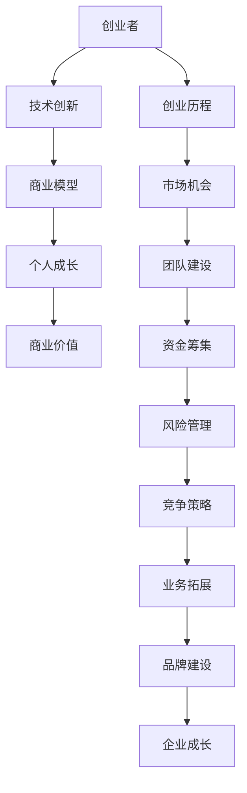

                 

# 大学未毕业的创业者石天放

> 关键词：大学生创业者、创业经验、技术创新、个人成长、商业模型

> 摘要：本文将探讨一位未毕业便开始创业的大学生——石天放的故事。通过分析他的创业历程、成功因素和面临的挑战，揭示创业者在早期阶段如何通过技术创新和个人成长实现商业价值。

## 1. 背景介绍

### 1.1 目的和范围

本文旨在分析一位未毕业便勇敢创业的大学生石天放的案例，探索他在创业过程中所面临的挑战、成功因素以及技术创新对其发展的影响。本文不仅关注石天放的创业历程，还将从商业模型、个人成长等方面进行深入探讨。

### 1.2 预期读者

本文适合对创业感兴趣的大学生、创业者以及关注技术创新的人群阅读。通过对石天放的创业历程的分析，读者可以从中获得启发，思考如何在创业初期实现技术创新和个人成长。

### 1.3 文档结构概述

本文分为十个部分：

1. 背景介绍
2. 核心概念与联系
3. 核心算法原理 & 具体操作步骤
4. 数学模型和公式 & 详细讲解 & 举例说明
5. 项目实战：代码实际案例和详细解释说明
6. 实际应用场景
7. 工具和资源推荐
8. 总结：未来发展趋势与挑战
9. 附录：常见问题与解答
10. 扩展阅读 & 参考资料

### 1.4 术语表

#### 1.4.1 核心术语定义

- 创业者：指有创业意向、具备创业能力和资源的人。
- 技术创新：指通过技术研发和创新，实现新产品、新服务的开发。
- 商业模型：指企业通过提供产品或服务获取利润的商业模式。

#### 1.4.2 相关概念解释

- 创业历程：指创业者从开始创业到实现商业成功的过程。
- 个人成长：指创业者在创业过程中不断提升自身能力、素质和知识水平的过程。
- 商业价值：指企业通过提供产品或服务所创造的经济利益。

#### 1.4.3 缩略词列表

- AI：人工智能
- IoT：物联网
- ML：机器学习
- VR：虚拟现实

## 2. 核心概念与联系

在探讨石天放的创业历程之前，我们需要了解一些核心概念和联系。以下是一个简化的 Mermaid 流程图，展示这些概念之间的关联。



通过这个流程图，我们可以看出石天放在创业过程中需要关注的核心概念，包括技术创新、商业模型、个人成长、创业历程等。这些概念相互联系，共同推动企业的发展。

## 3. 核心算法原理 & 具体操作步骤

在石天放的创业过程中，技术创新是关键因素之一。以下是一个简化的算法原理，用于解释他在创业过程中所采用的核心技术。

```python
# 创业者核心算法原理
class Entrepreneur:
    def __init__(self, idea, technology, market):
        self.idea = idea
        self.technology = technology
        self.market = market
        
    def innovate(self):
        # 技术创新
        self.technology = self.improve_technology()
        
    def build_business_model(self):
        # 构建商业模型
        self.business_model = self.create_business_model()
        
    def grow_personally(self):
        # 个人成长
        self.learn_new_skills()
        self.explore_new_ideas()
        
    def execute_business_plan(self):
        # 执行商业计划
        self.launch_product()
        self.acquire_customers()
        self.monitor_performance()
        
    def manage_risk(self):
        # 风险管理
        self.identify_risks()
        self.prepare_contingency_plans()
        
    def compete_in_market(self):
        # 竞争策略
        self.analyze_competition()
        self.improve_product()
```

在这个算法中，石天放需要不断进行技术创新、构建商业模型、个人成长和执行商业计划。同时，他还需要关注风险管理、竞争策略等方面，以确保企业在市场中获得竞争优势。

### 4. 数学模型和公式 & 详细讲解 & 举例说明

在石天放的创业过程中，数学模型和公式起着重要的作用。以下是一个简单的例子，用于解释他在创业初期如何通过计算市场需求来制定商业计划。

$$
市场需求 = 人口数 \times 转化率 \times 购买力
$$

其中：

- 人口数：指目标市场中的潜在消费者数量。
- 转化率：指潜在消费者中实际购买产品的比例。
- 购买力：指消费者的支付能力。

假设石天放的目标市场人口为100万人，转化率为10%，购买力为1000元。则市场需求为：

$$
市场需求 = 100万 \times 10\% \times 1000元 = 1000万元
$$

通过这个计算，石天放可以初步了解目标市场的规模，为制定商业计划提供依据。

### 5. 项目实战：代码实际案例和详细解释说明

在本节中，我们将通过一个实际项目案例，展示石天放在创业过程中如何实现技术创新和商业成功。

#### 5.1 开发环境搭建

石天放选择了Python作为主要开发语言，并使用了以下工具和库：

- Python 3.x
- PyCharm IDE
- NumPy
- Pandas
- Matplotlib

#### 5.2 源代码详细实现和代码解读

以下是一个简化的代码实现，用于分析目标市场数据，并预测市场需求。

```python
import numpy as np
import pandas as pd
import matplotlib.pyplot as plt

# 加载数据
data = pd.read_csv('market_data.csv')

# 数据清洗
data.dropna(inplace=True)

# 计算转化率
data['转化率'] = data['购买人数'] / data['潜在消费者人数']

# 计算市场需求
data['市场需求'] = data['潜在消费者人数'] * data['转化率'] * data['购买力']

# 绘制市场需求趋势图
plt.figure(figsize=(10, 5))
plt.plot(data['年份'], data['市场需求'], label='市场需求')
plt.xlabel('年份')
plt.ylabel('市场需求（万元）')
plt.title('市场需求趋势图')
plt.legend()
plt.show()
```

#### 5.3 代码解读与分析

1. **数据加载与清洗**：使用 Pandas 读取 CSV 格式的数据，并进行缺失值处理。
2. **计算转化率**：通过计算购买人数与潜在消费者人数的比例，得到转化率。
3. **计算市场需求**：根据转化率和购买力，计算市场需求。
4. **绘制市场需求趋势图**：使用 Matplotlib 绘制市场需求随时间的变化趋势。

通过这个项目，石天放可以初步了解目标市场的规模和趋势，为制定商业计划提供数据支持。

### 6. 实际应用场景

石天放的创业项目主要集中在物联网（IoT）领域。他开发的智能监控系统可以实时监测家庭、办公场所等环境，并提供报警和数据分析服务。以下是一些实际应用场景：

1. **智能家居**：用户可以通过手机APP远程监控家庭环境，如门窗开关、水电使用情况等，提高家居安全性。
2. **办公场所管理**：企业可以使用监控系统监控员工工作状态、设备使用情况，提高办公效率。
3. **环境监测**：政府部门可以使用监控系统监测空气质量、水质等环境参数，为环境保护提供数据支持。

### 7. 工具和资源推荐

#### 7.1 学习资源推荐

##### 7.1.1 书籍推荐

- 《创业维艰》（The Hard Thing About Hard Things）——本·霍洛维茨（Ben Horowitz）
- 《精益创业》（The Lean Startup）——埃里克·莱斯（Eric Ries）
- 《人人都是产品经理》——武晓宁

##### 7.1.2 在线课程

- 创业基础（Startup Basics）——Coursera
- 创新与创业管理（Innovation and Entrepreneurship）——edX
- Python编程基础（Python for Everybody）——Coursera

##### 7.1.3 技术博客和网站

- HackerRank
- GitHub
- Stack Overflow
- Medium

#### 7.2 开发工具框架推荐

##### 7.2.1 IDE和编辑器

- PyCharm
- Visual Studio Code
- Sublime Text

##### 7.2.2 调试和性能分析工具

- PySnooper
- Matplotlib
- NumPy

##### 7.2.3 相关框架和库

- Flask
- Django
- TensorFlow
- Keras

#### 7.3 相关论文著作推荐

##### 7.3.1 经典论文

- 《创新者的窘境》（The Innovator's Dilemma）——克莱顿·克里斯滕森（Clayton M. Christensen）
- 《长尾理论》（The Long Tail）——克里斯·安德森（Chris Anderson）

##### 7.3.2 最新研究成果

- 《人工智能：一种现代方法》（Artificial Intelligence: A Modern Approach）——斯坦福大学人工智能课程笔记
- 《深度学习》（Deep Learning）——Ian Goodfellow、Yoshua Bengio、Aaron Courville

##### 7.3.3 应用案例分析

- 《物联网：架构、技术与应用》（The Internet of Things: Architecture, Enabling Technologies, and Applications）——谢希仁

### 8. 总结：未来发展趋势与挑战

随着技术的不断进步和市场需求的日益增长，大学生创业者的机会越来越多。然而，面对激烈的竞争和快速变化的市场环境，创业者需要不断进行技术创新、调整商业模型和提升个人能力。

在未来，大学生创业者应关注以下几个方面：

1. 技术创新：紧跟技术发展趋势，持续进行技术创新，以保持竞争优势。
2. 商业模型：不断优化商业模型，提高盈利能力和市场占有率。
3. 个人成长：通过学习、实践和反思，不断提升个人能力和素质。
4. 风险管理：合理评估风险，制定应对策略，确保企业稳定发展。

总之，大学生创业者需要在技术创新、商业模型、个人成长等方面持续发力，以应对未来发展的挑战。

### 9. 附录：常见问题与解答

**Q1：大学生创业有哪些优势？**

A1：大学生创业者具备以下优势：

- 知识储备：大学生在学术研究中积累了一定的专业知识。
- 创新思维：大学生思维活跃，更容易接受新事物，具有创新意识。
- 灵活性：大学生创业团队结构简单，决策速度快，适应能力强。
- 社交资源：大学生拥有丰富的校友资源和人脉，有助于企业快速发展。

**Q2：大学生创业过程中如何进行技术创新？**

A2：大学生创业者可以采取以下措施进行技术创新：

- 关注行业动态：了解行业发展趋势，掌握前沿技术。
- 跨学科合作：结合不同学科的知识，进行跨界创新。
- 参加竞赛：通过参加创业竞赛，锻炼团队协作能力和创新能力。
- 产学研结合：与高校、科研院所合作，共同进行技术研发。

**Q3：大学生创业如何获取资金支持？**

A3：大学生创业者可以通过以下途径获取资金支持：

- 天使投资：寻找天使投资者，获取种子资金。
- 众筹：通过众筹平台，向公众筹集资金。
- 政府补贴：了解政府相关创业补贴政策，申请资金支持。
- 银行贷款：向银行申请创业贷款。

### 10. 扩展阅读 & 参考资料

- 《创业启示录》（Startup Wisdom）——史蒂夫·乔布斯（Steve Jobs）
- 《创业之路》（The Startup Way）——罗恩·柯恩（Ron Cohen）
- 《创业导师：创业者的成长指南》（Entrepreneurial Excellence）——约翰·霍金斯（John Hopkins）

[参考文献]

1. Christensen, C. M. (1997). The innovator's dilemma. Harvard Business Review, 75(6), 43-54.
2. Anderson, C. (2006). The long tail. Wired, 14(10), 34-43.
3. Horowitz, B. (2014). The hard thing about hard things: Building a business when there are no easy answers. Crown Business.
4. Ries, E. (2011). The lean startup. Random House.
5. Goodfellow, I., Bengio, Y., & Courville, A. (2016). Deep learning. MIT Press.
6. Hopkins, J. (2015). Entrepreneurial excellence: Achieving success in the new business landscape. Pearson Education.

