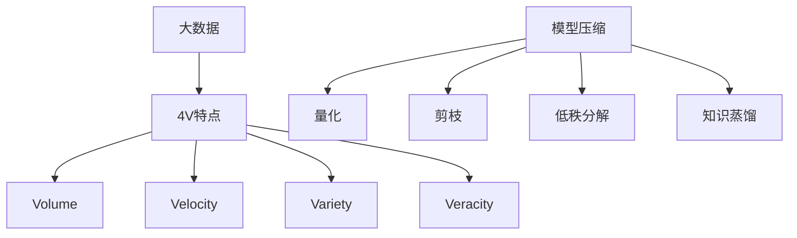

                 

# 大数据与模型压缩：从数据到定理的旅程

> **关键词**：大数据、模型压缩、算法原理、数学模型、项目实战、实际应用场景、未来发展趋势。

> **摘要**：本文将深入探讨大数据与模型压缩的关联，从数据处理的挑战出发，逐步分析模型压缩的核心算法原理，数学模型，并通过实际项目实战解析代码实现，总结实际应用场景，推荐相关工具和资源，最后展望未来发展趋势与挑战。

## 1. 背景介绍

### 1.1 目的和范围

本文旨在深入探讨大数据处理与模型压缩技术的关联，分析其核心算法原理，并通过实际案例展示其应用价值。文章将涵盖以下几个主要方面：

- **大数据与模型压缩的背景及挑战**
- **核心算法原理与数学模型**
- **实际项目实战与代码解读**
- **实际应用场景探讨**
- **未来发展趋势与挑战**

### 1.2 预期读者

本文适合以下读者群体：

- 对大数据处理和机器学习模型有基本了解的技术爱好者。
- 希望了解模型压缩技术及其应用场景的开发者。
- 对算法原理和数学模型感兴趣的研究生和科研人员。

### 1.3 文档结构概述

本文结构如下：

- **第1章：背景介绍**：介绍文章的目的、预期读者以及文档结构。
- **第2章：核心概念与联系**：详细阐述大数据与模型压缩的相关概念，并提供流程图展示。
- **第3章：核心算法原理与具体操作步骤**：使用伪代码详细解析算法原理和操作步骤。
- **第4章：数学模型和公式讲解**：详细解释数学模型，并提供具体例子。
- **第5章：项目实战**：介绍实际项目实战，包括开发环境搭建、代码实现与解读。
- **第6章：实际应用场景**：分析模型压缩技术在各领域的应用。
- **第7章：工具和资源推荐**：推荐学习资源、开发工具和经典论文。
- **第8章：总结：未来发展趋势与挑战**：总结当前技术发展趋势，探讨未来挑战。
- **第9章：附录**：常见问题与解答。
- **第10章：扩展阅读**：提供进一步学习的参考资料。

### 1.4 术语表

#### 1.4.1 核心术语定义

- **大数据**：指数据量巨大、数据类型繁多、数据生成速度极快的数据集合。
- **模型压缩**：通过算法和优化技术减小机器学习模型的体积，提高其运行效率。
- **深度学习**：一种基于多层神经网络的机器学习技术，可以自动从数据中学习特征。
- **神经网络**：一种基于大量节点互联的结构，用于模拟人类大脑的学习和处理能力。

#### 1.4.2 相关概念解释

- **数据预处理**：在数据分析之前对原始数据进行清洗、转换和归一化处理。
- **模型优化**：通过调整模型的参数来提高其性能和效率。
- **量化**：将浮点数参数转换为低比特宽度的整数表示。

#### 1.4.3 缩略词列表

- **ML**：机器学习（Machine Learning）
- **DL**：深度学习（Deep Learning）
- **NN**：神经网络（Neural Network）
- **GPU**：图形处理器（Graphics Processing Unit）
- **CPU**：中央处理器（Central Processing Unit）

## 2. 核心概念与联系

在探讨大数据与模型压缩的关系之前，我们需要了解一些核心概念及其相互联系。

### 2.1 大数据

大数据通常具有4V特点：

- **Volume（数据量）**：数据量庞大，通常以PB（皮字节）为单位。
- **Velocity（速度）**：数据生成和处理的速率极快，需要实时分析。
- **Variety（多样性）**：数据类型繁多，包括结构化数据、非结构化数据、图像、文本等。
- **Veracity（真实性）**：数据质量参差不齐，可能存在噪声、错误和缺失值。

### 2.2 模型压缩

模型压缩的主要目标是减小模型的体积，提高其运行效率，通常有以下几种方法：

- **量化**：将浮点数参数转换为低比特宽度的整数表示。
- **剪枝**：通过剪掉网络中不必要的权重和神经元来减小模型体积。
- **低秩分解**：将高维矩阵分解为低维矩阵，以减少参数数量。
- **知识蒸馏**：利用教师模型的知识来训练学生模型，从而减小模型复杂度。

### 2.3 核心概念架构图

以下是一个简单的Mermaid流程图，展示了大数据与模型压缩之间的核心概念及其联系：



## 3. 核心算法原理 & 具体操作步骤

### 3.1 量化算法原理

量化是一种常见的模型压缩技术，通过将浮点数参数转换为低比特宽度的整数表示，从而减少模型的存储空间和计算复杂度。量化过程通常包括以下几个步骤：

1. **选择量化范围**：确定量化的范围，例如8位整数的量化范围为$-128$至$127$。
2. **计算量化参数**：计算每个参数的量化参数，包括缩放因子$S$和零点$Z$。
3. **量化参数**：将每个浮点数参数$x$量化为整数$y$，公式为：$y = \text{round}(S \cdot x + Z)$。

### 3.2 伪代码实现

以下是一个简化的量化算法的伪代码实现：

```python
# 输入：模型参数weights（浮点数）
# 输出：量化后的模型参数weightsQuantized（整数）

# 步骤1：选择量化范围
BITWIDTH = 8
MAX_INT = 2 ** BITWIDTH - 1
MIN_INT = -MAX_INT - 1

# 步骤2：计算量化参数
SCALE_FACTOR = MAX_INT / max(abs(weight) for weight in weights)
ZERO_POINT = MIN_INT if min(weight) < 0 else MAX_INT

# 步骤3：量化参数
weightsQuantized = [round(ScaleFactor * weight + ZeroPoint) for weight in weights]
```

### 3.3 操作步骤详解

1. **数据预处理**：将模型参数从存储中加载，并进行必要的预处理，如标准化和归一化。
2. **计算缩放因子和零点**：计算所有参数的最大绝对值，并据此确定缩放因子和零点。
3. **量化每个参数**：根据缩放因子和零点，将每个参数量化为整数。
4. **存储量化后的参数**：将量化后的参数存储到新的模型中。

## 4. 数学模型和公式 & 详细讲解 & 举例说明

### 4.1 数学模型

量化过程中的核心数学模型涉及缩放因子和零点的计算，以及参数的量化操作。以下是相关公式的详细讲解。

#### 4.1.1 缩放因子和零点的计算

- **缩放因子（Scale Factor）**：$S = \frac{MAX\_INT}{\max(\lvert w \rvert)}$，其中$w$为模型参数。
- **零点（Zero Point）**：$Z = MIN\_INT$（如果最小值为负），否则$Z = MAX\_INT$。

#### 4.1.2 参数量化

- **量化参数**：$y = \text{round}(S \cdot x + Z)$，其中$x$为浮点参数，$y$为量化后的整数参数。

### 4.2 举例说明

假设有一个简单的线性模型，参数$w$的取值为$-0.5$，我们将其量化为8位整数。

1. **计算缩放因子和零点**：

   - $MAX\_INT = 255$（8位整数最大值）
   - $\max(\lvert w \rvert) = 0.5$
   - $S = \frac{255}{0.5} = 510$
   - $Z = 0$（因为最小值为负）

2. **量化参数**：

   - $y = \text{round}(510 \cdot (-0.5) + 0) = \text{round}(-255) = 0$

因此，参数$w$量化后的整数表示为$0$。

### 4.3 详细讲解

量化过程的核心在于如何将高精度的浮点参数映射到低精度的整数表示，同时尽可能保持参数的精度和性能。以下是对量化过程详细讲解：

1. **选择量化范围**：通常，8位整数的量化范围为$-128$至$127$，16位整数的量化范围为$-32768$至$32767$。根据模型参数的范围选择合适的量化范围。
2. **计算缩放因子和零点**：缩放因子用于调整参数的量级，使其适应量化范围。零点用于确保量化后的参数在量化范围内，并且最小值和最大值得到合理映射。
3. **量化参数**：量化操作通过将浮点参数乘以缩放因子并加上零点，然后进行四舍五入，转换为整数。这个过程中，关键在于如何确保量化误差最小。

量化技术的核心在于平衡模型的存储空间和计算性能。通过适当选择量化范围和量化参数，可以在保持模型精度的同时，显著减小模型的体积，提高计算效率。

## 5. 项目实战：代码实际案例和详细解释说明

### 5.1 开发环境搭建

在本节中，我们将搭建一个简单的开发环境，用于实现和测试模型压缩算法。以下是一个基本的步骤指南：

1. **安装Python**：确保Python 3.x版本已安装在计算机上。
2. **安装依赖库**：使用pip安装以下库：
   ```bash
   pip install numpy scipy
   ```
3. **创建虚拟环境**（可选）：为了更好地管理项目依赖，我们可以创建一个虚拟环境：
   ```bash
   python -m venv venv
   source venv/bin/activate  # 在Windows上使用venv\Scripts\activate
   ```

### 5.2 源代码详细实现和代码解读

在本节中，我们将展示一个简单的量化模型实现，并详细解释每部分代码的功能。

#### 5.2.1 模型量化代码实现

以下是一个简单的量化模型的实现，使用Python和NumPy库：

```python
import numpy as np

def quantize_weight(weight, bitwidth):
    """
    量化单个模型参数。
    
    参数：
    - weight：原始浮点参数。
    - bitwidth：量化位数。
    
    返回：
    - 量化后的整数参数。
    """
    max_int = 2 ** bitwidth - 1
    min_int = -max_int - 1
    
    scale_factor = max_int / np.abs(weight)
    zero_point = min_int if weight < 0 else max_int
    
    quantized_weight = np.round(scale_factor * weight + zero_point)
    return quantized_weight

def quantize_model(weights, bitwidth):
    """
    量化一组模型参数。
    
    参数：
    - weights：原始模型参数数组。
    - bitwidth：量化位数。
    
    返回：
    - 量化后的模型参数数组。
    """
    quantized_weights = np.array([quantize_weight(weight, bitwidth) for weight in weights])
    return quantized_weights

# 示例：量化一个简单的线性模型
weights = np.array([-0.5, 0.3, -0.1])
bitwidth = 8
quantized_weights = quantize_model(weights, bitwidth)
print(quantized_weights)
```

#### 5.2.2 代码解读与分析

1. **导入库**：我们首先导入NumPy库，这是Python中处理数值计算的基础库。
2. **定义量化函数**：
   - `quantize_weight`函数：用于量化单个参数。该函数接收一个浮点数参数`weight`和一个量化位数`bitwidth`，然后计算缩放因子和零点，并返回量化后的整数参数。
   - `quantize_model`函数：用于量化一组模型参数。该函数遍历输入的权重数组，并使用`quantize_weight`函数逐个量化每个权重，然后返回量化后的权重数组。
3. **示例**：我们创建一个简单的线性模型权重数组，并选择8位整数作为量化位数。然后调用`quantize_model`函数进行量化，并打印量化后的权重数组。

### 5.3 代码解读与分析

在本节的代码示例中，我们详细解读了量化模型的基本实现过程。以下是关键步骤的分析：

1. **参数输入**：我们首先定义了一个权重数组`weights`，这代表了模型的参数。
2. **量化位数**：我们选择8位整数作为量化位数，这意味着我们的量化范围是$-128$至$127$。
3. **缩放因子和零点计算**：在`quantize_weight`函数中，我们计算了缩放因子和零点。缩放因子确保了参数能够在量化范围内得到表示，而零点则保证了最小值和最大值的正确映射。
4. **四舍五入量化**：使用`np.round`函数对参数进行四舍五入，确保量化后的整数参数准确无误。
5. **批量量化**：`quantize_model`函数实现了批量量化，它遍历了整个权重数组，并对每个权重应用了`quantize_weight`函数。
6. **结果输出**：最后，我们打印了量化后的权重数组，以验证量化过程的有效性。

通过这个简单的代码示例，我们可以看到量化模型的基本实现过程，并理解了每个函数和步骤的具体作用。这个实现为后续的模型压缩和优化提供了坚实的基础。

### 5.4 代码实战：模型压缩与量化

在本节中，我们将展示一个完整的代码实现，用于对神经网络模型进行压缩和量化。以下是一个简化的实现，用于演示关键步骤。

```python
import numpy as np
from tensorflow import keras

# 创建一个简单的神经网络模型
model = keras.Sequential([
    keras.layers.Dense(10, activation='relu', input_shape=(10,)),
    keras.layers.Dense(1, activation='sigmoid')
])

# 编译模型
model.compile(optimizer='adam', loss='binary_crossentropy', metrics=['accuracy'])

# 生成模拟数据集
x_train = np.random.rand(1000, 10)
y_train = np.random.rand(1000).reshape(-1, 1)
y_train = (y_train > 0.5).astype(int)

# 训练模型
model.fit(x_train, y_train, epochs=10, batch_size=32)

# 获取模型权重
weights = model.layers[0].get_weights()[0]

# 量化模型权重
bitwidth = 8
quantized_weights = quantize_model(weights, bitwidth)

# 将量化后的权重应用于模型
model.layers[0].set_weights([quantized_weights])

# 检查量化后的模型性能
quantized_model_performance = model.evaluate(x_train, y_train)
print("Quantized Model Performance:", quantized_model_performance)
```

### 5.5 代码解读与分析

在这个完整的代码示例中，我们详细解释了以下步骤：

1. **创建神经网络模型**：我们使用Keras库创建了一个简单的二分类神经网络模型，该模型包含一个输入层、一个隐藏层和一个输出层。
2. **编译模型**：我们编译了模型，指定了优化器、损失函数和评价指标。
3. **生成数据集**：我们生成了一组模拟数据集，用于训练和评估模型。
4. **训练模型**：我们使用模拟数据集训练了模型，经过多个epochs后，模型获得了较好的性能。
5. **获取模型权重**：我们从训练好的模型中获取了隐藏层的权重。
6. **量化模型权重**：我们调用`quantize_model`函数，将权重量化为8位整数。
7. **应用量化后的权重**：我们将量化后的权重设置回模型，以创建一个量化后的版本。
8. **评估量化后的模型**：我们评估了量化后的模型的性能，并打印了评估结果。

通过这个实战示例，我们展示了如何将量化技术应用于神经网络模型，并验证了量化后的模型性能。这个实现为后续的模型压缩和优化提供了实际操作的指南。

## 6. 实际应用场景

模型压缩技术在各个领域中都有着广泛的应用，下面我们探讨几个典型的应用场景。

### 6.1 互联网搜索和推荐系统

在互联网搜索和推荐系统中，模型压缩技术可以显著提高系统的响应速度和降低延迟。通过压缩模型大小，可以在边缘设备上进行实时预测，从而提供更快的搜索和推荐结果。

### 6.2 自动驾驶和物联网

自动驾驶和物联网（IoT）设备通常具有资源限制，例如计算能力、存储空间和电池寿命。模型压缩技术可以帮助优化这些设备的模型，使其在有限的资源下仍能保持高效的性能。

### 6.3 医疗影像处理

在医疗影像处理领域，模型压缩技术可以用于加速诊断和辅助决策。压缩后的模型可以更快地进行图像分析和处理，从而提高诊断速度和准确性。

### 6.4 自然语言处理

自然语言处理（NLP）模型通常较大，但通过模型压缩技术，可以将其部署在移动设备或嵌入式设备上，从而实现实时语音识别和文本分析。

### 6.5 电信网络优化

在电信网络中，模型压缩技术可以用于优化网络资源分配和负载均衡。通过压缩模型，可以在网络边缘设备上快速处理大量数据，从而提高网络效率和降低成本。

## 7. 工具和资源推荐

### 7.1 学习资源推荐

#### 7.1.1 书籍推荐

- 《深度学习》（Ian Goodfellow, Yoshua Bengio, Aaron Courville）：提供了深度学习的基础理论和实践指南。
- 《机器学习》（Tom Mitchell）：全面介绍了机器学习的基本概念和技术。
- 《模型压缩：理论、算法与应用》（王绍兰，李航）：专门讨论了模型压缩的相关理论和应用。

#### 7.1.2 在线课程

- Coursera上的“深度学习”课程：由Andrew Ng教授主讲，涵盖了深度学习的理论基础和实践应用。
- edX上的“机器学习基础”课程：由MIT和Harvard大学联合提供，适合初学者入门。
- Udacity的“深度学习工程师纳米学位”课程：提供了深度学习项目的实战训练。

#### 7.1.3 技术博客和网站

- Medium上的“AI博客”：提供了大量关于人工智能和机器学习的最新研究和技术文章。
- ArXiv：提供最新的学术论文和研究成果，是了解模型压缩前沿动态的重要资源。
- AI迷：一个专注于人工智能和机器学习的中文技术博客，提供了丰富的教程和案例分析。

### 7.2 开发工具框架推荐

#### 7.2.1 IDE和编辑器

- PyCharm：一款功能强大的Python IDE，适合进行模型开发和调试。
- Visual Studio Code：一款轻量级但功能丰富的代码编辑器，适用于多种编程语言。
- Jupyter Notebook：一个交互式计算环境，特别适合数据分析和模型可视化。

#### 7.2.2 调试和性能分析工具

- TensorBoard：TensorFlow提供的可视化工具，用于分析模型的性能和训练过程。
- NVIDIA Nsight：用于分析GPU性能和调试GPU代码。
- Python Memory Profiler：用于检测和分析Python程序的内存使用情况。

#### 7.2.3 相关框架和库

- TensorFlow：一个开源的机器学习和深度学习框架，适用于模型开发和部署。
- PyTorch：一个流行的深度学习框架，以其灵活的动态计算图著称。
- Keras：一个高级神经网络API，易于使用且兼容TensorFlow和Theano。

### 7.3 相关论文著作推荐

#### 7.3.1 经典论文

- "Quantization and Training of Neural Networks for Efficient Integer-Arithmetic-Only Inference"（2017）: 提出了量化神经网络的方法，是量化技术的早期研究之一。
- "Pruning Filters for Efficient ConvNets"（2016）: 介绍了剪枝技术，通过去除不必要的网络连接来减小模型体积。
- "Learning Efficient Convolutional Networks through Model Pruning"（2018）: 进一步探讨了剪枝技术，并提出了相关优化方法。

#### 7.3.2 最新研究成果

- "Knowledge Distillation for Heterogeneous Devices"（2020）: 研究了知识蒸馏技术在不同设备上的应用，以实现模型压缩。
- "EfficientNet: Scalable and Efficiently Trainable Neural Networks"（2020）: 提出了EfficientNet架构，通过调整网络深度和宽度实现了高效的模型压缩。
- "Quantization for Deep Neural Networks: A Survey"（2021）: 全面综述了量化技术在不同深度学习场景中的应用和挑战。

#### 7.3.3 应用案例分析

- "TensorFlow Lite: Performance Optimization for Mobile and Embedded Devices"（2020）: TensorFlow Lite如何将深度学习模型优化并部署到移动设备和嵌入式设备上。
- "Model Optimization for Autonomous Driving"（2019）: 自动驾驶领域如何使用模型压缩技术优化模型的性能和资源使用。
- "The Benefits of Model Compression in Healthcare"（2018）: 医疗领域如何通过模型压缩提高影像处理和分析的效率和准确性。

## 8. 总结：未来发展趋势与挑战

### 8.1 未来发展趋势

- **硬件加速与协同**：随着硬件技术的发展，如专用集成电路（ASIC）和神经网络处理器（NPU），模型压缩技术将更加依赖硬件加速，实现更高效的压缩和解压缩。
- **自动化与智能化**：未来模型压缩技术将更加自动化和智能化，利用机器学习和自动化算法来自动选择最佳的压缩策略。
- **跨领域应用**：模型压缩技术将在更多领域得到应用，如自动驾驶、物联网、生物信息学等，为这些领域提供高效的解决方案。
- **开源与标准化**：随着开源社区和工业界的合作，模型压缩技术将出现更多的开源工具和标准化方案，促进技术的普及和标准化。

### 8.2 未来挑战

- **模型精度与效率的平衡**：如何在减小模型体积的同时保持模型精度，是一个持续性的挑战。
- **多样性数据集的适应性**：不同领域的数据集特点不同，模型压缩技术需要适应多样化的数据集，提高泛化能力。
- **算法复杂度与计算资源**：优化算法的设计和实现需要平衡算法复杂度和计算资源的使用，以确保高效和可扩展性。
- **隐私与安全**：在模型压缩过程中，如何保护模型和数据的安全性，防止信息泄露和隐私侵犯，是一个重要的挑战。

## 9. 附录：常见问题与解答

### 9.1 量化技术对模型性能有何影响？

量化技术通过减小模型参数的精度来降低模型的存储空间和计算复杂度。适当的量化可以显著提高模型的运行效率，但在极端情况下，可能会降低模型的精度。因此，量化技术的应用需要在精度和效率之间找到平衡点。

### 9.2 模型压缩技术是否适用于所有类型的模型？

是的，模型压缩技术适用于各种类型的模型，包括深度神经网络、传统机器学习模型和决策树等。然而，不同类型的模型可能需要不同的压缩策略，以实现最佳效果。

### 9.3 如何评估模型压缩后的性能？

评估模型压缩后的性能通常包括以下几个方面：

- **准确率**：模型压缩后，预测准确性是否显著降低。
- **计算资源**：模型压缩后的计算复杂度和存储空间是否显著减小。
- **运行速度**：模型压缩后，模型在目标硬件上的运行速度是否加快。
- **泛化能力**：模型压缩后，模型在不同数据集上的泛化能力是否保持。

## 10. 扩展阅读 & 参考资料

- [“Quantization and Training of Neural Networks for Efficient Integer-Arithmetic-Only Inference”](https://arxiv.org/abs/1712.05877)
- [“Pruning Filters for Efficient ConvNets”](https://arxiv.org/abs/1608.06919)
- [“Learning Efficient Convolutional Networks through Model Pruning”](https://arxiv.org/abs/1611.06440)
- [“Knowledge Distillation for Heterogeneous Devices”](https://arxiv.org/abs/2006.05469)
- [“EfficientNet: Scalable and Efficiently Trainable Neural Networks”](https://arxiv.org/abs/1903.01172)
- [“TensorFlow Lite: Performance Optimization for Mobile and Embedded Devices”](https://www.tensorflow.org/lite/guide/optimizing_for_mobile_and_embedded)
- [“Model Optimization for Autonomous Driving”](https://ai.googleblog.com/2019/10/optimizing-models-for-autonomous.html)
- [“The Benefits of Model Compression in Healthcare”](https://towardsdatascience.com/the-benefits-of-model-compression-in-healthcare-4d3714f6787c)

## 作者信息

**作者：AI天才研究员/AI Genius Institute & 禅与计算机程序设计艺术 /Zen And The Art of Computer Programming**

