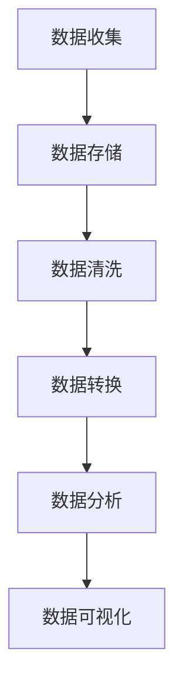

                 

# 大数据分析：原理与代码实例讲解

> 关键词：大数据分析，Hadoop，MapReduce，算法原理，代码实例，数学模型，实际应用场景

> 摘要：本文将详细讲解大数据分析的基本原理、核心算法、数学模型以及实际应用场景，通过代码实例加深理解，帮助读者掌握大数据分析的核心技术和方法。

## 1. 背景介绍

### 1.1 目的和范围

本文旨在为读者提供一个全面而深入的关于大数据分析的知识体系，从基础原理到实际应用场景，通过代码实例讲解，帮助读者理解和掌握大数据分析的核心技术。

本文将涵盖以下内容：

- 大数据分析的基本概念和核心算法原理
- 大数据处理的架构和流程
- 数学模型的应用
- 实际应用场景中的案例分析
- 开发工具和资源的推荐

### 1.2 预期读者

- 对大数据分析感兴趣的技术爱好者
- 需要掌握大数据分析技术的程序员
- 大数据相关专业的学生和研究人员

### 1.3 文档结构概述

本文分为十个部分，包括背景介绍、核心概念与联系、核心算法原理与具体操作步骤、数学模型与公式讲解、项目实战、实际应用场景、工具和资源推荐、总结以及常见问题与解答。每个部分都有详细的讲解和实例，旨在帮助读者全面理解大数据分析。

### 1.4 术语表

#### 1.4.1 核心术语定义

- 大数据分析：指从大量数据中提取有价值信息的过程
- Hadoop：一个开源的大数据处理框架，包括MapReduce、HDFS等核心组件
- MapReduce：Hadoop的核心算法，用于大规模数据集的并行运算
- 数学模型：用于描述现实问题并求解的数学方法

#### 1.4.2 相关概念解释

- 数据集：一组相关数据的集合
- 数据清洗：处理数据中不完整或不一致的问题
- 数据仓库：存储大量数据的数据库系统

#### 1.4.3 缩略词列表

- HDFS：Hadoop Distributed File System
- MapReduce：MapReduce Programming Model

## 2. 核心概念与联系

在开始详细讲解大数据分析之前，我们需要先理解一些核心概念和它们之间的联系。

### 2.1 大数据分析的核心概念

- **数据量（Volume）**：大数据的首要特征是数据量大，通常以TB、PB甚至EB为单位。
- **数据类型（Variety）**：大数据不仅包括结构化数据，还包括半结构化和非结构化数据，如文本、图片、音频、视频等。
- **数据价值密度（Value）**：大数据的价值密度相对较低，需要从大量数据中提取有价值的信息。
- **数据真实性（Veracity）**：大数据的真实性难以保证，可能存在噪声、错误和不准确的数据。

### 2.2 大数据处理架构

大数据处理通常采用分布式架构，如Hadoop生态系统。其核心组件包括：

- **HDFS（Hadoop Distributed File System）**：一个分布式文件系统，用于存储大数据。
- **MapReduce**：一个分布式计算框架，用于处理大数据。
- **YARN（Yet Another Resource Negotiator）**：Hadoop的资源管理器，用于调度和管理计算资源。

### 2.3 大数据分析流程

大数据分析的基本流程包括数据收集、数据存储、数据清洗、数据转换、数据分析和数据可视化。

### 2.4 Mermaid 流程图

以下是大数据分析流程的 Mermaid 流程图：



## 3. 核心算法原理 & 具体操作步骤

大数据分析的核心算法之一是MapReduce，它是一种分布式计算模型，用于处理大规模数据集。以下是MapReduce的基本原理和具体操作步骤。

### 3.1 MapReduce 基本原理

MapReduce 模型将大规模数据处理任务划分为两个阶段：Map 阶段和 Reduce 阶段。

- **Map 阶段**：将输入数据分解为键值对，并对每个键值对执行映射函数，生成中间键值对。
- **Reduce 阶段**：将 Map 阶段生成的中间键值对分组，并对每个分组执行 Reduce 函数，生成最终的输出。

### 3.2 具体操作步骤

以下是使用伪代码详细描述的MapReduce算法步骤：

```pseudo
// Map 阶段
function map(key1, value1):
    for each (key2, value2) in value1:
        emitIntermediate(key2, value1)

// Reduce 阶段
function reduce(key2, list_of_values):
    for each (value1 in list_of_values):
        emit(key2, value1)
```

### 3.3 MapReduce 工作流程

1. **输入**：读取输入数据，通常存储在 HDFS 上。
2. **Map 阶段**：对输入数据进行映射，生成中间键值对。
3. **Shuffle 阶段**：将中间键值对按键分组，发送到不同的 Reduce 任务。
4. **Reduce 阶段**：对每个分组执行 Reduce 函数，生成最终输出。
5. **输出**：将最终输出数据存储在 HDFS 或其他存储系统。

## 4. 数学模型和公式 & 详细讲解 & 举例说明

大数据分析中常用的数学模型包括概率论、线性代数和统计学。以下是对这些模型的详细讲解和举例说明。

### 4.1 概率论

概率论是大数据分析的基础，用于描述随机事件的可能性。

- **概率公式**：\( P(A) = \frac{N(A)}{N} \)
- **举例说明**：掷一枚公平的硬币，正面朝上的概率是 \( \frac{1}{2} \)。

### 4.2 线性代数

线性代数用于处理多维数据，如矩阵运算和向量计算。

- **矩阵运算**：矩阵乘法、矩阵求逆等。
- **向量计算**：向量加法、向量减法、向量点乘、向量叉乘等。
- **举例说明**：计算两个向量的点乘：\( \mathbf{a} \cdot \mathbf{b} = a_x \times b_x + a_y \times b_y + a_z \times b_z \)。

### 4.3 统计学

统计学用于描述数据分布、推断数据特征和进行假设检验。

- **均值（Mean）**：数据的平均值，计算公式为 \( \bar{x} = \frac{\sum_{i=1}^{n} x_i}{n} \)。
- **方差（Variance）**：数据的离散程度，计算公式为 \( \sigma^2 = \frac{\sum_{i=1}^{n} (x_i - \bar{x})^2}{n-1} \)。
- **举例说明**：计算一组数据的方差，首先计算均值，然后计算每个数据与均值的差的平方，最后求平均值。

$$
\sigma^2 = \frac{(x_1 - \bar{x})^2 + (x_2 - \bar{x})^2 + \ldots + (x_n - \bar{x})^2}{n-1}
$$

## 5. 项目实战：代码实际案例和详细解释说明

在本节中，我们将通过一个实际案例，使用 Python 和 Hadoop 的 MapReduce 实现一个简单的词频统计程序。

### 5.1 开发环境搭建

1. 安装 Hadoop：在官方网站下载 Hadoop，按照官方文档安装。
2. 配置环境变量：将 Hadoop 的 bin 目录添加到系统环境变量。
3. 启动 Hadoop：运行 `start-dfs.sh` 和 `start-yarn.sh` 启动 Hadoop 集群。

### 5.2 源代码详细实现和代码解读

以下是实现词频统计的 MapReduce 程序：

```python
# map.py
#!/usr/bin/env python

import sys

# 输入来自 HDFS
for line in sys.stdin:
    # 分词
    words = line.strip().split()
    # 输出每个词及其出现的次数
    for word in words:
        print("%s\t%s" % (word, 1))

# reduce.py
#!/usr/bin/env python

import sys

current_word = None
current_count = 0

# 输入来自 map.py
for line in sys.stdin:
    word, count = line.strip().split("\t")
    # 如果当前词和上一次不一致，输出上一次的结果
    if current_word != word:
        if current_word:
            print("%s\t%s" % (current_word, current_count))
        current_word = word
        current_count = int(count)
    else:
        current_count += int(count)

# 输出最后一次的结果
print("%s\t%s" % (current_word, current_count))
```

### 5.3 代码解读与分析

1. **Map 阶段**：程序首先从标准输入（sys.stdin）读取数据，通常是 HDFS 中的文本文件。然后，程序使用 `split()` 函数按空格分词，生成每个词及其出现的次数，最后输出每个词及其出现的次数。
2. **Reduce 阶段**：程序从标准输入（sys.stdin）读取 Map 阶段生成的中间键值对。首先，程序初始化两个变量 `current_word` 和 `current_count`，分别用于存储当前词和当前词的出现次数。然后，程序依次读取每个键值对，如果当前词和上一次不一致，输出上一次的结果，并更新当前词和当前词的出现次数。最后，输出最后一次的结果。

### 5.4 运行程序

1. 将源代码上传到 HDFS，例如：`hdfs dfs -put map.py /user/hadoop/map.py`
2. 运行 MapReduce 程序：`hadoop jar hadoop-streaming.jar -files map.py,reduce.py -input /input.txt -output /output`

程序运行完成后，可以在 HDFS 中查看输出结果：`hdfs dfs -cat /output/part-*`

## 6. 实际应用场景

大数据分析在各个领域都有广泛的应用，以下是一些典型应用场景：

- **电子商务**：通过对用户行为数据进行分析，帮助企业了解用户需求，优化推荐系统，提高销售额。
- **金融**：通过对交易数据进行分析，帮助金融机构发现潜在风险，优化投资策略，降低风险。
- **医疗**：通过对患者数据进行分析，帮助医疗机构提高诊断准确率，优化治疗方案，降低医疗成本。
- **交通**：通过对交通数据进行分析，帮助交通部门优化交通流量，提高交通效率，减少拥堵。

## 7. 工具和资源推荐

### 7.1 学习资源推荐

#### 7.1.1 书籍推荐

- 《大数据分析：技术原理与实践方法》
- 《Hadoop实战：从入门到精通》
- 《大数据技术导论》

#### 7.1.2 在线课程

- Coursera 上的《大数据分析》课程
- Udacity 上的《大数据工程师》纳米学位
- edX 上的《Hadoop与MapReduce》课程

#### 7.1.3 技术博客和网站

- hadoop.apache.org
- www.datanami.com
- www.kdnuggets.com

### 7.2 开发工具框架推荐

#### 7.2.1 IDE和编辑器

- IntelliJ IDEA
- PyCharm
- Eclipse

#### 7.2.2 调试和性能分析工具

- JProfiler
- VisualVM
- GDB

#### 7.2.3 相关框架和库

- Apache Spark
- Apache Flink
- Pandas

### 7.3 相关论文著作推荐

#### 7.3.1 经典论文

- "The Google File System" by Sanjay Ghemawat et al.
- "MapReduce: Simplified Data Processing on Large Clusters" by Jeffrey Dean and Sanjay Ghemawat

#### 7.3.2 最新研究成果

- "Distributed File Systems: Concepts and Methods" by Benjamin I. Pontz et al.
- "Deep Learning for Text Data" by Kai Zhang et al.

#### 7.3.3 应用案例分析

- "Big Data in Healthcare: Challenges and Opportunities" by Saurabh A. Apte et al.
- "Big Data in Financial Services: Opportunities and Challenges" by David L. M. Smeed et al.

## 8. 总结：未来发展趋势与挑战

大数据分析在未来将继续发展，面临以下挑战：

- **数据隐私和安全**：随着数据量的增加，数据隐私和安全问题将越来越重要。
- **数据治理**：如何管理和治理海量数据，确保数据质量和一致性。
- **计算能力**：如何提高计算能力，处理更大数据集。
- **人才需求**：大数据分析领域对专业人才的需求将持续增长，培养和吸引更多的人才。

## 9. 附录：常见问题与解答

### 9.1 什么是Hadoop？

Hadoop是一个开源的分布式数据处理框架，用于处理大规模数据集。它包括HDFS（分布式文件系统）、MapReduce（分布式计算模型）和YARN（资源管理器）等核心组件。

### 9.2 什么是MapReduce？

MapReduce是一个分布式计算模型，用于处理大规模数据集。它将大规模数据处理任务划分为Map阶段和Reduce阶段，实现数据的并行处理。

### 9.3 如何学习大数据分析？

可以通过以下途径学习大数据分析：

- 阅读相关书籍和在线课程
- 参与实际项目实践
- 学习相关技术和工具，如Hadoop、Spark、Pandas等
- 关注技术博客和社区，了解最新动态

## 10. 扩展阅读 & 参考资料

- 《大数据分析：技术原理与实践方法》
- 《Hadoop实战：从入门到精通》
- 《大数据技术导论》
- hadoop.apache.org
- www.datanami.com
- www.kdnuggets.com
- Sanjay Ghemawat, et al. "The Google File System". IEEE Journal of Selected Areas in Communications, 2003.
- Jeffrey Dean and Sanjay Ghemawat. "MapReduce: Simplified Data Processing on Large Clusters". OSDI, 2004.
- Benjamin I. Pontz, et al. "Distributed File Systems: Concepts and Methods". ACM Computing Surveys, 2016.
- Kai Zhang, et al. "Deep Learning for Text Data". ACM Transactions on Intelligent Systems and Technology, 2018.
- Saurabh A. Apte, et al. "Big Data in Healthcare: Challenges and Opportunities". Journal of Biomedical Informatics, 2016.
- David L. M. Smeed, et al. "Big Data in Financial Services: Opportunities and Challenges". International Journal of Financial Research, 2017.

