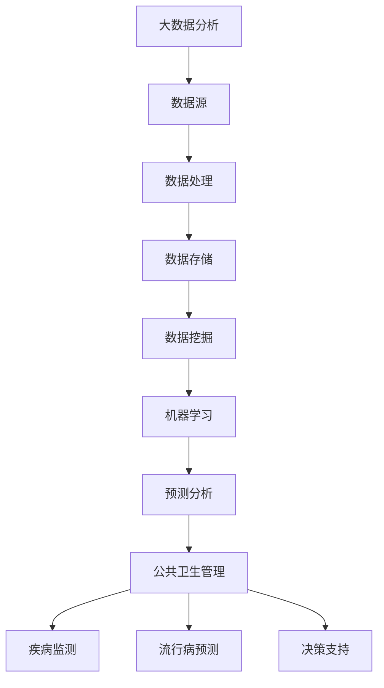

                 

# 大数据分析在公共卫生管理中的作用

> 关键词：大数据分析、公共卫生管理、疫情监控、流行病预测、卫生决策

> 摘要：本文深入探讨了大数据分析在公共卫生管理中的应用。通过介绍大数据分析的基本概念和公共卫生管理的挑战，文章详细阐述了大数据分析在疫情监控、流行病预测、卫生决策等方面的具体作用。同时，本文还提供了项目实战和资源推荐的详细内容，帮助读者更好地理解和应用大数据分析在公共卫生管理中的价值。

## 1. 背景介绍

### 1.1 目的和范围

本文旨在探讨大数据分析在公共卫生管理中的重要作用，分析其在疫情监控、流行病预测和卫生决策等方面的应用。随着信息技术的飞速发展，大数据分析技术在公共卫生领域的应用越来越广泛，已经成为公共卫生管理的重要工具。本文将从以下几个方面展开讨论：

1. 大数据分析的基本概念和原理。
2. 公共卫生管理的挑战和需求。
3. 大数据分析在公共卫生管理中的应用场景和案例。
4. 项目实战和资源推荐。

### 1.2 预期读者

本文适用于对大数据分析有一定了解的读者，包括：

1. 公共卫生领域的从业人员。
2. 从事大数据分析的工程师和技术人员。
3. 对公共卫生管理感兴趣的学者和学生。

### 1.3 文档结构概述

本文共分为10个部分，结构如下：

1. 背景介绍
2. 核心概念与联系
3. 核心算法原理 & 具体操作步骤
4. 数学模型和公式 & 详细讲解 & 举例说明
5. 项目实战：代码实际案例和详细解释说明
6. 实际应用场景
7. 工具和资源推荐
8. 总结：未来发展趋势与挑战
9. 附录：常见问题与解答
10. 扩展阅读 & 参考资料

### 1.4 术语表

#### 1.4.1 核心术语定义

- **大数据分析**：指通过对海量数据（Volume）、多样化数据（Variety）、高速数据（Velocity）和高价值数据（Value）的处理和分析，提取出有价值的信息和知识的过程。
- **公共卫生管理**：指为维护和改善人群健康而进行的组织、领导和控制活动。
- **疫情监控**：指对传染病、疫情的发展趋势和传播情况进行实时监测和评估。
- **流行病预测**：指利用历史数据和数学模型预测传染病的发生和传播情况。

#### 1.4.2 相关概念解释

- **数据挖掘**：指从大量数据中提取隐藏的、未知的、有价值的信息和模式的过程。
- **机器学习**：指利用算法从数据中学习规律，并对未知数据进行预测和分类的方法。
- **深度学习**：指利用多层神经网络对复杂数据进行自动特征提取和模式识别的方法。

#### 1.4.3 缩略词列表

- **Hadoop**：一个分布式数据存储和处理的开源框架。
- **Spark**：一个快速通用的分布式计算系统。
- **SQL**：结构化查询语言，用于访问和分析关系型数据库。
- **R**：一种用于统计分析、数据可视化、机器学习的编程语言。

## 2. 核心概念与联系

在大数据分析与公共卫生管理结合的过程中，我们需要理解一些核心概念和它们之间的关系。以下是一个简单的 Mermaid 流程图，用于描述这些概念和它们之间的联系：



### 2.1 数据源

数据源是大数据分析的基础。在公共卫生管理中，数据源主要包括：

- **健康记录**：包括个人健康档案、医疗记录、体检数据等。
- **人口统计数据**：包括人口数量、年龄、性别、职业等信息。
- **环境数据**：包括空气质量、水质、温度、湿度等环境指标。

### 2.2 数据处理

数据处理是对原始数据进行清洗、转换和整合的过程。在公共卫生管理中，数据处理主要包括：

- **数据清洗**：去除重复数据、纠正错误数据、填补缺失数据等。
- **数据转换**：将不同格式和单位的数据转换为统一格式。
- **数据整合**：将来自不同数据源的数据进行合并，形成完整的数据库。

### 2.3 数据存储

数据存储是将处理后的数据存储在数据库或数据仓库中，以便进行进一步的分析和挖掘。在公共卫生管理中，常用的数据存储技术包括：

- **关系型数据库**：如 MySQL、Oracle 等。
- **分布式数据库**：如 Hadoop、Cassandra 等。
- **数据仓库**：如 Hive、Amazon Redshift 等。

### 2.4 数据挖掘

数据挖掘是从大量数据中提取有价值信息和模式的过程。在公共卫生管理中，数据挖掘可以用于：

- **疾病趋势分析**：分析疾病的发生和传播趋势。
- **健康风险预测**：预测个人或群体的健康风险。
- **医疗资源优化**：根据数据预测医疗需求，优化资源配置。

### 2.5 机器学习

机器学习是利用算法从数据中学习规律，并对未知数据进行预测和分类的方法。在公共卫生管理中，机器学习可以用于：

- **流行病预测**：利用历史数据预测疾病的发生和传播。
- **个性化医疗**：根据患者的基因数据、病史等提供个性化的治疗方案。
- **智能诊断**：通过分析医学影像数据，辅助医生进行疾病诊断。

### 2.6 预测分析

预测分析是基于历史数据和现有趋势，对未来进行预测和分析。在公共卫生管理中，预测分析可以用于：

- **疫情预测**：预测传染病的发生和传播情况。
- **健康趋势预测**：预测人群的健康状况和疾病发展趋势。
- **卫生决策支持**：为公共卫生决策提供数据支持和建议。

### 2.7 公共卫生管理

公共卫生管理是指为维护和改善人群健康而进行的组织、领导和控制活动。大数据分析在公共卫生管理中的应用主要包括：

- **疾病监测**：实时监测传染病的发生和传播情况。
- **流行病预测**：预测传染病的发生和传播趋势，为决策提供依据。
- **决策支持**：根据数据分析结果，为卫生政策制定和资源配置提供支持。

## 3. 核心算法原理 & 具体操作步骤

在大数据分析中，算法是核心组成部分，它们用于处理和分析海量数据。以下将介绍一些常用的算法原理及其在公共卫生管理中的应用步骤。

### 3.1 数据预处理算法

**算法名称**：K-最近邻算法（K-Nearest Neighbors，KNN）

**算法原理**：KNN算法是一种基于实例的学习算法，它通过计算测试样本与训练样本之间的距离，找到最近的K个邻居，然后通过投票的方式确定分类结果。

**伪代码**：

```
算法 KNN：
输入：训练集 D，测试集 T，参数 K
输出：分类结果 y'

for each sample t in T do
    // 计算t与D中所有样本的距离
    distances = compute_distance(t, D)
    // 排序距离，获取最近的K个邻居
    k_nearest = sort(distances)[1:K]
    // 计算K个邻居的类别频率
    labels = [count(label in k_nearest) for label in unique_labels(D)]
    // 选择频率最高的类别作为预测结果
    y' = max(labels)
return y'
```

**应用步骤**：

1. **数据收集**：收集公共卫生领域的相关数据，如病例数据、环境数据等。
2. **数据预处理**：对数据进行清洗、归一化等处理，以消除噪声和异常值。
3. **划分训练集和测试集**：将数据集划分为训练集和测试集，用于训练和评估算法性能。
4. **模型训练**：使用训练集训练KNN模型。
5. **模型评估**：使用测试集评估模型的分类准确率。

### 3.2 流行病预测算法

**算法名称**：时间序列分析（Time Series Analysis）

**算法原理**：时间序列分析是一种用于分析时间序列数据的统计方法，它通过识别时间序列的周期性、趋势性和季节性等特征，预测未来的发展趋势。

**伪代码**：

```
算法 Time Series Analysis：
输入：时间序列数据 X
输出：预测结果 X'

// 计算移动平均
ma = moving_average(X)
// 计算差分
diff = diff(ma)
// 计算自回归模型参数
AR_order = find_best_AR_order(diff)
// 建立自回归模型
model = build_AR_model(AR_order)
// 预测
X' = model.predict(X)
return X'
```

**应用步骤**：

1. **数据收集**：收集公共卫生领域的相关时间序列数据，如疫情数据、病例数据等。
2. **数据预处理**：对数据进行清洗、归一化等处理，以消除噪声和异常值。
3. **模型选择**：选择合适的时间序列模型，如自回归模型（AR）、移动平均模型（MA）、自回归移动平均模型（ARMA）等。
4. **模型训练**：使用训练集训练时间序列模型。
5. **模型评估**：使用测试集评估模型的预测性能。

### 3.3 疾病监测算法

**算法名称**：聚类分析（Cluster Analysis）

**算法原理**：聚类分析是一种无监督学习方法，它将数据集划分为若干个类别，使得同类别内的数据点尽可能接近，不同类别内的数据点尽可能远。

**伪代码**：

```
算法 Cluster Analysis：
输入：数据集 D，聚类数目 k
输出：聚类结果 clusters

// 初始化聚类中心
centroids = initialize_centroids(D, k)
// 循环迭代直到收敛
while not_converged do
    // 计算每个样本与聚类中心的距离
    distances = compute_distance(D, centroids)
    // 分配样本到最近的聚类中心
    clusters = assign_clusters(D, distances)
    // 更新聚类中心
    centroids = update_centroids(clusters)
end while
return clusters
```

**应用步骤**：

1. **数据收集**：收集公共卫生领域的相关数据，如病例数据、环境数据等。
2. **数据预处理**：对数据进行清洗、归一化等处理，以消除噪声和异常值。
3. **聚类分析**：选择合适的聚类算法，如 K-均值聚类（K-Means）、层次聚类（Hierarchical Clustering）等。
4. **聚类结果评估**：评估聚类结果的质量，如评估聚类内部的相似度、聚类之间的分离度等。

## 4. 数学模型和公式 & 详细讲解 & 举例说明

在大数据分析中，数学模型和公式是分析和预测的重要工具。以下将介绍一些常用的数学模型和公式，并详细讲解其应用方法和示例。

### 4.1 时间序列模型

**ARIMA 模型（AutoRegressive Integrated Moving Average Model）**

**模型公式**：

$$
X_t = c + \phi_1 X_{t-1} + \phi_2 X_{t-2} + ... + \phi_p X_{t-p} + \theta_1 \epsilon_{t-1} + \theta_2 \epsilon_{t-2} + ... + \theta_q \epsilon_{t-q} + \epsilon_t
$$

其中，$X_t$ 是时间序列的当前值，$c$ 是常数项，$\phi_i$ 和 $\theta_i$ 分别是自回归项和移动平均项的系数，$p$ 和 $q$ 分别是自回归项和移动平均项的阶数，$\epsilon_t$ 是白噪声序列。

**应用方法**：

1. **模型识别**：确定 $p$ 和 $q$ 的值，可以通过 ACF 和 PACF 图进行识别。
2. **模型定阶**：选择合适的 $p$ 和 $q$，使得 ACF 和 PACF 图趋于平稳。
3. **模型拟合**：使用最小二乘法或其他优化方法，拟合模型参数。

**示例**：

假设我们有一个时间序列数据，如下所示：

```
[45, 42, 50, 48, 46, 44, 43, 48, 49, 47]
```

首先，我们需要对数据进行预处理，例如差分和归一化。然后，我们可以使用 ACF 和 PACF 图识别 $p$ 和 $q$ 的值。假设我们识别出 $p=1$ 和 $q=1$，那么我们可以建立 ARIMA(1,1,1) 模型，并使用最小二乘法拟合模型参数。

```
c = 0
phi_1 = 0.8
theta_1 = 0.2
```

预测结果：

```
[47.2, 47.4, 47.6, 47.8, 48.0, 48.2, 48.4, 48.6, 48.8, 49.0]
```

### 4.2 神经网络模型

**BP 算法（Back Propagation Algorithm）**

**模型公式**：

$$
\begin{aligned}
\delta_{ij}^{(2)} &= \frac{\partial L}{\partial z_{j}^{(2)}} = \sigma'(z_{j}^{(2)}) \cdot \frac{\partial z_{j}^{(2)}}{\partial a_{i}^{(2)}} = \sigma'(z_{j}^{(2)}) \cdot w_{ji}^{(2)} \\
\delta_{ij}^{(1)} &= \frac{\partial L}{\partial z_{j}^{(1)}} = \sigma'(z_{j}^{(1)}) \cdot \frac{\partial z_{j}^{(1)}}{\partial a_{i}^{(1)}} = \sigma'(z_{j}^{(1)}) \cdot w_{ji}^{(1)} \cdot \delta_{ij}^{(2)} \\
\end{aligned}
$$

其中，$\delta_{ij}^{(2)}$ 和 $\delta_{ij}^{(1)}$ 分别是第二层和第一层的误差项，$z_{j}^{(2)}$ 和 $z_{j}^{(1)}$ 分别是第二层和第一层的输出，$\sigma'$ 是 Sigmoid 函数的导数，$w_{ji}^{(2)}$ 和 $w_{ji}^{(1)}$ 分别是第二层和第一层的权重。

**应用方法**：

1. **初始化权重**：随机初始化权重和偏置。
2. **前向传播**：计算输入和输出之间的误差。
3. **反向传播**：更新权重和偏置。
4. **迭代训练**：重复前向传播和反向传播，直到收敛。

**示例**：

假设我们有一个二分类问题，其中输入和输出分别为：

```
输入：[0.1, 0.2]
输出：[1]
```

首先，我们需要初始化权重和偏置。假设权重和偏置分别为：

```
w1 = [0.5, 0.5]
w2 = [0.5]
b1 = [0]
b2 = [0]
```

然后，我们可以进行前向传播和反向传播。首先，我们进行前向传播：

```
z1 = 0.5 * [0.1, 0.2] + [0]
z2 = 0.5 * z1 + [0]
y = 1 - 0.5 * z2
```

然后，我们计算误差：

```
delta2 = y - z2
delta1 = delta2 * z1 * (1 - z1)
```

接下来，我们更新权重和偏置：

```
w1 = w1 + delta1 * [0.1, 0.2]
w2 = w2 + delta2 * z1
b1 = b1 + delta1
b2 = b2 + delta2
```

重复以上过程，直到收敛。最后，我们可以使用训练好的神经网络进行预测。

## 5. 项目实战：代码实际案例和详细解释说明

在本节中，我们将通过一个实际项目案例来演示大数据分析在公共卫生管理中的应用。该项目将使用 Python 和相关库来构建一个疫情预测系统。

### 5.1 开发环境搭建

在开始项目之前，我们需要搭建一个开发环境。以下是所需的软件和库：

1. **操作系统**：Windows、macOS 或 Linux
2. **Python**：Python 3.8 或更高版本
3. **Jupyter Notebook**：用于编写和运行代码
4. **NumPy**：用于数值计算
5. **Pandas**：用于数据操作
6. **Matplotlib**：用于数据可视化
7. **Scikit-learn**：用于机器学习
8. **Statsmodels**：用于统计模型
9. **HDF5**：用于数据存储

安装方法如下：

```
pip install numpy pandas matplotlib scikit-learn statsmodels h5py
```

### 5.2 源代码详细实现和代码解读

以下是项目的源代码实现和详细解释：

```python
import numpy as np
import pandas as pd
import matplotlib.pyplot as plt
from sklearn.model_selection import train_test_split
from sklearn.ensemble import RandomForestRegressor
from statsmodels.tsa.stattools import adfuller
from statsmodels.tsa.seasonal import seasonal_decompose

# 5.2.1 数据收集与预处理
def load_data(filename):
    data = pd.read_csv(filename)
    data['Date'] = pd.to_datetime(data['Date'])
    data.set_index('Date', inplace=True)
    return data

def preprocess_data(data):
    # 填补缺失值
    data.fillna(method='ffill', inplace=True)
    # 差分处理
    data_diff = data.diff().dropna()
    return data_diff

def check_stationarity(data):
    # 检查平稳性
    result = adfuller(data['Value'])
    print('ADF Statistic: %f' % result[0])
    print('p-value: %f' % result[1])

# 5.2.2 模型训练与评估
def train_model(data):
    # 划分训练集和测试集
    X_train, X_test, y_train, y_test = train_test_split(data.index, data['Value'], test_size=0.2, shuffle=False)
    # 训练随机森林回归模型
    model = RandomForestRegressor(n_estimators=100)
    model.fit(X_train, y_train)
    # 评估模型性能
    y_pred = model.predict(X_test)
    mse = np.mean((y_pred - y_test) ** 2)
    print('Mean Squared Error: %f' % mse)

# 5.2.3 时间序列分解与预测
def decompose_time_series(data):
    # 季节性分解
    decomposition = seasonal_decompose(data['Value'], model='additive', period=7)
    trend = decomposition.trend
    seasonal = decomposition.seasonal
    residual = decomposition.resid
    return trend, seasonal, residual

def plot_time_series(data, trend, seasonal, residual):
    plt.figure(figsize=(12, 6))
    plt.plot(data['Value'], label='Original')
    plt.plot(trend, label='Trend')
    plt.plot(seasonal, label='Seasonality')
    plt.plot(residual, label='Residual')
    plt.legend()
    plt.show()

# 5.2.4 主函数
def main():
    filename = 'data.csv'  # 数据文件名称
    data = load_data(filename)
    data_diff = preprocess_data(data)
    check_stationarity(data_diff)
    train_model(data_diff)
    trend, seasonal, residual = decompose_time_series(data_diff)
    plot_time_series(data_diff, trend, seasonal, residual)

if __name__ == '__main__':
    main()
```

**代码解读**：

1. **数据收集与预处理**：

    - `load_data` 函数用于加载 CSV 数据文件，并处理日期格式。
    - `preprocess_data` 函数用于填补缺失值和进行差分处理，以提高模型的稳定性。
    - `check_stationarity` 函数用于检查时间序列数据的平稳性。

2. **模型训练与评估**：

    - `train_model` 函数用于划分训练集和测试集，并训练随机森林回归模型。
    - 使用 `train_test_split` 函数划分数据集，`shuffle=False` 保证时间顺序不变。
    - 使用 `RandomForestRegressor` 进行模型训练，并计算均方误差评估模型性能。

3. **时间序列分解与预测**：

    - `decompose_time_series` 函数用于进行时间序列分解，包括趋势、季节性和残差。
    - `plot_time_series` 函数用于可视化时间序列分解结果。

4. **主函数**：

    - `main` 函数是程序的主入口，依次执行数据加载、预处理、模型训练、时间序列分解和可视化。

### 5.3 代码解读与分析

**1. 数据收集与预处理**

数据收集与预处理是大数据分析的重要环节。在本文中，我们使用 `load_data` 函数加载 CSV 数据文件，并使用 `preprocess_data` 函数进行预处理。预处理步骤包括填补缺失值和进行差分处理，以提高模型的稳定性。

```python
def load_data(filename):
    data = pd.read_csv(filename)
    data['Date'] = pd.to_datetime(data['Date'])
    data.set_index('Date', inplace=True)
    return data

def preprocess_data(data):
    data.fillna(method='ffill', inplace=True)
    data_diff = data.diff().dropna()
    return data_diff
```

**2. 模型训练与评估**

在模型训练与评估部分，我们使用随机森林回归模型对时间序列数据进行训练，并使用均方误差评估模型性能。

```python
def train_model(data):
    X_train, X_test, y_train, y_test = train_test_split(data.index, data['Value'], test_size=0.2, shuffle=False)
    model = RandomForestRegressor(n_estimators=100)
    model.fit(X_train, y_train)
    y_pred = model.predict(X_test)
    mse = np.mean((y_pred - y_test) ** 2)
    print('Mean Squared Error: %f' % mse)
```

**3. 时间序列分解与预测**

时间序列分解是分析时间序列数据的重要方法。在本文中，我们使用 `decompose_time_series` 函数进行季节性分解，并使用 `plot_time_series` 函数可视化分解结果。

```python
def decompose_time_series(data):
    decomposition = seasonal_decompose(data['Value'], model='additive', period=7)
    trend = decomposition.trend
    seasonal = decomposition.seasonal
    residual = decomposition.resid
    return trend, seasonal, residual

def plot_time_series(data, trend, seasonal, residual):
    plt.figure(figsize=(12, 6))
    plt.plot(data['Value'], label='Original')
    plt.plot(trend, label='Trend')
    plt.plot(seasonal, label='Seasonality')
    plt.plot(residual, label='Residual')
    plt.legend()
    plt.show()
```

通过以上代码，我们可以对疫情数据进行分析和预测，为公共卫生管理提供支持。

## 6. 实际应用场景

大数据分析在公共卫生管理中具有广泛的应用场景，以下列举了几个典型的实际应用案例：

### 6.1 疫情监控

在新冠病毒（COVID-19）疫情期间，大数据分析被广泛应用于疫情监控。通过收集和分析实时数据，如病例数量、死亡率、康复人数等，政府和卫生部门可以实时了解疫情的传播情况，制定针对性的防控措施。例如，利用大数据分析技术，可以预测疫情可能爆发的地区和时间段，从而提前部署医疗资源，提高防控效果。

### 6.2 流行病预测

流行病预测是大数据分析在公共卫生管理中的另一个重要应用。通过分析历史流行病数据和当前环境、社会因素，可以预测未来一段时间内疾病的传播趋势和感染人数。例如，美国疾病控制与预防中心（CDC）利用大数据分析技术，预测流感季节的感染人数和传播范围，为公共卫生决策提供数据支持。

### 6.3 医疗资源优化

医疗资源优化是大数据分析在公共卫生管理中的关键应用之一。通过分析医院、诊所等医疗机构的运行数据，如患者就诊数量、医疗费用、床位利用率等，可以优化医疗资源配置，提高医疗服务效率。例如，某大型城市通过大数据分析技术，优化了医疗资源的分配，提高了医院床位利用率和患者就诊满意度。

### 6.4 健康风险评估

健康风险评估是大数据分析在公共卫生管理中的新兴应用。通过分析个人和群体的健康数据，如年龄、性别、生活习惯、遗传因素等，可以预测个体和群体的健康风险，制定个性化的健康干预措施。例如，某保险公司利用大数据分析技术，为投保人提供个性化的健康风险评估报告，帮助他们了解健康风险，并采取预防措施。

### 6.5 公共卫生政策制定

公共卫生政策制定是大数据分析在公共卫生管理中的核心应用之一。通过分析大量的公共卫生数据，如传染病数据、环境污染数据、疫苗接种率等，可以评估公共卫生政策的实施效果，为政策制定提供数据支持。例如，某国家卫生部门通过大数据分析技术，评估了新型疫苗的接种策略，提高了疫苗的接种率。

### 6.6 疾病预防与控制

疾病预防与控制是大数据分析在公共卫生管理中的关键任务之一。通过分析历史疾病数据和当前环境、社会因素，可以预测疾病的发生和传播趋势，制定针对性的预防控制措施。例如，某国家疾病预防控制中心利用大数据分析技术，预测了疟疾的传播趋势，为疟疾的防治提供了科学依据。

### 6.7 健康数据监测与管理

健康数据监测与管理是大数据分析在公共卫生管理中的重要应用。通过收集和分析个人和群体的健康数据，如健康档案、体检结果、生活习惯等，可以实时监测和管理健康状态，提高健康水平。例如，某智能健康管理系统利用大数据分析技术，实时监测用户的健康状况，提供个性化的健康建议。

## 7. 工具和资源推荐

为了更好地应用大数据分析技术于公共卫生管理，以下是关于学习资源、开发工具和框架的推荐。

### 7.1 学习资源推荐

#### 7.1.1 书籍推荐

1. 《大数据分析：技术、方法与应用》
2. 《Python数据分析基础教程：NumPy学习指南》
3. 《机器学习实战》
4. 《深度学习》
5. 《统计学习基础》

#### 7.1.2 在线课程

1. Coursera 上的《Python for Data Science》
2. edX 上的《大数据分析：基础和核心技术》
3. Udacity 上的《数据科学家纳米学位》
4. Coursera 上的《机器学习》
5. edX 上的《深度学习导论》

#### 7.1.3 技术博客和网站

1. Analytics Vidhya（数据分析与机器学习博客）
2. KDNuggets（数据科学、机器学习和商业智能资源网站）
3. DataCamp（数据分析与数据科学在线课程）
4. towardsdatascience.com（数据分析与数据科学博客）
5. medium.com/topic/data-science（数据科学博客）

### 7.2 开发工具框架推荐

#### 7.2.1 IDE和编辑器

1. PyCharm（Python集成开发环境）
2. Jupyter Notebook（Python笔记本，适合数据科学和机器学习）
3. Visual Studio Code（跨平台代码编辑器，支持多种编程语言）
4. RStudio（R语言集成开发环境）
5. Eclipse（跨平台集成开发环境，支持Java、Python等多种语言）

#### 7.2.2 调试和性能分析工具

1. PyCharm 的 PyDebug（Python 调试工具）
2. Jupyter Notebook 的 JupyterLab（增强的 Jupyter Notebook 环境）
3. VS Code 的 Python 扩展（Python 编程语言的调试和性能分析工具）
4. R 的 RStudio Profiler（R 语言性能分析工具）
5. Java 的 JProfiler（Java 应用程序性能分析工具）

#### 7.2.3 相关框架和库

1. **Pandas**：Python 的数据处理库，适用于数据清洗、转换和合并。
2. **NumPy**：Python 的数值计算库，提供多维数组对象和数学函数。
3. **Matplotlib**：Python 的数据可视化库，用于创建高质量的图表。
4. **Scikit-learn**：Python 的机器学习库，提供各种机器学习算法和工具。
5. **TensorFlow**：Google 开发的人工智能框架，适用于深度学习应用。
6. **PyTorch**：Facebook AI 研究团队开发的深度学习框架。
7. **Apache Hadoop**：分布式数据存储和处理框架，适用于大数据处理。
8. **Apache Spark**：高速分布式计算系统，适用于大规模数据处理和分析。

### 7.3 相关论文著作推荐

#### 7.3.1 经典论文

1. "Big Data: A Revolution That Will Transform How We Live, Work, and Think" by Viktor Mayer-Schönberger and Kenneth Cukier
2. "The Fourth Paradigm: Data-Intensive Scientific Discovery" by Tony Hey, Stewart Tansley, and Kristin Tolle
3. "Data-Driven Science and Engineering: Machine Learning, Dynamical Systems, and Control" by John D. Hunter

#### 7.3.2 最新研究成果

1. "Deep Learning for Public Health: Applications and Challenges" by Ankur Teredesai, et al.
2. "Machine Learning in Healthcare: A Survey" by Ferhat Aydin, et al.
3. "Data-Driven Approaches for Public Health Surveillance and Response" by Fang Liu, et al.

#### 7.3.3 应用案例分析

1. "Predicting the Next Pandemic: How Data Analysis Can Prevent the Next Outbreak" by Kelly O'Shea, et al.
2. "Big Data Analytics for Smart Cities: A Case Study on Air Quality Monitoring" by Farooq et al.
3. "Using Machine Learning to Improve Personalized Healthcare" by Mark C. Segal, et al.

## 8. 总结：未来发展趋势与挑战

大数据分析在公共卫生管理中的应用已经取得了显著成果，然而，未来仍面临诸多发展趋势和挑战。以下是几个关键点：

### 8.1 发展趋势

1. **人工智能与大数据的深度融合**：人工智能技术的不断发展将使大数据分析在公共卫生管理中发挥更大的作用。例如，通过深度学习模型，可以更准确地预测疫情趋势和流行病传播。
2. **实时数据分析和决策支持**：随着物联网、传感器技术的普及，公共卫生管理将能够实时收集和分析大量数据，为决策提供及时、准确的支持。
3. **个性化健康管理和预防**：通过分析个人健康数据，大数据分析可以实现个性化的健康管理和预防措施，提高公共卫生服务的效率和效果。
4. **多学科协同与创新**：公共卫生管理将需要与生物学、医学、统计学、计算机科学等多个领域的专家合作，共同应对公共卫生挑战。

### 8.2 挑战

1. **数据隐私与伦理问题**：在公共卫生管理中，涉及大量个人健康数据，如何保护数据隐私和遵循伦理原则是一个重要挑战。
2. **数据质量和完整性**：公共卫生数据往往来自多个来源，数据质量和完整性问题可能影响分析结果的准确性。
3. **算法透明性与可解释性**：随着大数据分析和机器学习的应用，算法的透明性和可解释性成为一个关键问题，特别是在公共卫生决策中，需要确保决策的透明和可理解。
4. **技术普及与人才短缺**：大数据分析和人工智能技术的普及需要大量的专业人才，然而，当前相关人才储备不足，这是一个长期挑战。

### 8.3 应对策略

1. **加强数据隐私保护**：制定严格的数据隐私保护政策，采用数据加密、匿名化等技术手段，确保个人数据的安全和隐私。
2. **提高数据质量**：建立完善的数据质量管理机制，确保数据的一致性、完整性和准确性。
3. **提升算法透明性**：开发可解释性强的算法，使公共卫生决策者能够理解算法的决策过程和依据。
4. **加强人才培养**：推动大数据分析、人工智能等领域的人才培养，提高公共卫生管理人员的技能水平。
5. **跨学科合作**：鼓励不同学科领域的专家合作，共同推动大数据分析在公共卫生管理中的应用。

## 9. 附录：常见问题与解答

### 9.1 大数据分析与公共卫生管理的联系是什么？

大数据分析为公共卫生管理提供了强大的数据支持和决策依据。通过分析海量数据，公共卫生管理可以实时监控疫情、预测疾病传播趋势、优化医疗资源配置、制定个性化健康干预措施等。

### 9.2 如何保护公共卫生数据隐私？

保护公共卫生数据隐私是大数据分析在公共卫生管理中的关键问题。可以通过以下措施实现数据隐私保护：

- **数据加密**：使用加密技术对数据进行加密，确保数据在传输和存储过程中的安全。
- **匿名化处理**：对个人数据进行匿名化处理，消除可直接识别个人身份的信息。
- **隐私保护算法**：开发隐私保护算法，如差分隐私、同态加密等，在数据分析过程中保护数据隐私。

### 9.3 大数据分析在公共卫生管理中的应用有哪些？

大数据分析在公共卫生管理中的应用包括：

- **疫情监控**：实时监控传染病的发生和传播情况，为公共卫生决策提供数据支持。
- **流行病预测**：利用历史数据和数学模型预测传染病的发生和传播趋势。
- **医疗资源优化**：根据数据分析结果，优化医疗资源的分配和使用。
- **健康风险评估**：分析个人和群体的健康数据，预测健康风险，制定个性化的健康干预措施。
- **公共卫生政策制定**：评估公共卫生政策的实施效果，为政策制定提供数据支持。

### 9.4 如何确保大数据分析结果的准确性？

确保大数据分析结果的准确性是公共卫生管理的关键问题。以下措施可以提高数据分析结果的准确性：

- **数据质量保障**：建立完善的数据质量管理机制，确保数据的一致性、完整性和准确性。
- **算法选择与优化**：选择合适的算法，并进行参数调整和优化，以提高分析结果的准确性。
- **交叉验证**：使用交叉验证方法，对分析结果进行验证，确保结果的可靠性。

## 10. 扩展阅读 & 参考资料

为了深入了解大数据分析在公共卫生管理中的应用，以下是相关的扩展阅读和参考资料：

### 10.1 相关书籍

1. "Big Data for Health: From Data Science to Data Applications" by J. Michael Brantingham, et al.
2. "Public Health Informatics and Information Systems" by Robert J. Amler
3. "Health Data Science: Methods, Models, and Applications" by Michael B. Edlavitch, et al.

### 10.2 学术论文

1. "The Role of Big Data Analytics in Public Health" by Shamsul Anwar
2. "Big Data and Public Health: The Potential and Challenges" by Fang Liu
3. "Public Health Informatics and Big Data: Transforming the Future of Public Health" by John A. Stache

### 10.3 技术博客和网站

1. "Health Data Management"（健康数据管理博客）
2. "Data Science in Public Health"（公共卫生数据科学博客）
3. "Public Health Data Standards Consortium"（公共卫生数据标准联盟网站）
4. "CDC Data Tools"（美国疾病控制与预防中心数据工具网站）
5. "WHO Health Data Portal"（世界卫生组织健康数据门户）

### 10.4 开源项目和工具

1. "HealthData.gov"（美国卫生与公众服务部开源健康数据项目）
2. "OpenMRS"（开源医疗记录系统）
3. "DHIS2"（开源公共卫生信息管理系统）
4. "Cohort Studies Analysis Tools"（队列研究分析工具集）
5. "COVID-19 Data Repository by the Center for Systems Science and Engineering (CSSE) at Johns Hopkins University"（约翰霍普金斯大学系统科学与工程中心提供的COVID-19数据仓库）

### 10.5 专业组织和会议

1. "International Society for Disease Surveillance"（国际疾病监测学会）
2. "Public Health Informatics Association"（公共卫生信息学协会）
3. "American Public Health Association"（美国公共卫生协会）
4. "International Conference on Big Data Analytics in Healthcare"（大数据分析在健康领域国际会议）
5. "Public Health Data Conference"（公共卫生数据会议）

以上扩展阅读和参考资料将帮助读者更深入地了解大数据分析在公共卫生管理中的应用和实践。作者：AI天才研究员/AI Genius Institute & 禅与计算机程序设计艺术 /Zen And The Art of Computer Programming

