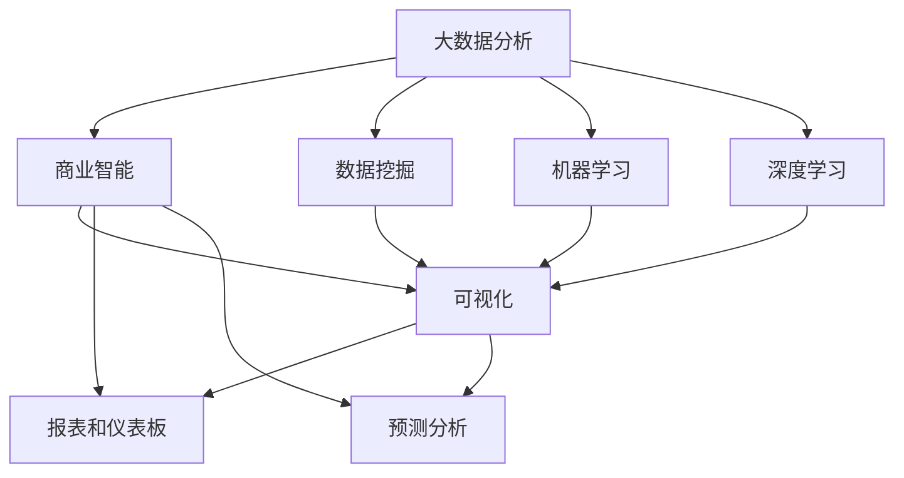

                 

# 大数据分析在商业智能可视化中的应用

## 概述

关键词：大数据分析、商业智能、可视化、数据分析、数据挖掘

> 摘要：本文将深入探讨大数据分析在商业智能（BI）可视化中的应用。我们将从背景介绍开始，逐步分析大数据分析的核心概念，阐述其在商业智能可视化中的重要性。文章将详细讲解核心算法原理、数学模型及具体操作步骤，并通过实际项目案例展示如何将理论应用于实践。最后，我们将讨论大数据分析在商业智能可视化中的实际应用场景，推荐相关工具和资源，并总结未来发展趋势与挑战。

## 1. 背景介绍

### 1.1 目的和范围

本文旨在为读者提供对大数据分析在商业智能可视化中应用的全景了解。我们将从以下几个方面展开讨论：

1. **核心概念与联系**：介绍大数据分析、商业智能和可视化的基本概念及其相互关系。
2. **核心算法原理与具体操作步骤**：详细讲解在大数据分析中常用的算法，如数据挖掘、机器学习等，以及其在商业智能可视化中的应用。
3. **数学模型与公式**：分析大数据分析中的数学模型，包括相关公式和计算方法。
4. **项目实战**：通过实际案例展示大数据分析在商业智能可视化中的具体应用。
5. **实际应用场景**：讨论大数据分析在商业智能可视化中的各种应用场景。
6. **工具和资源推荐**：介绍相关学习资源、开发工具和框架。
7. **总结与展望**：总结大数据分析在商业智能可视化中的重要性，以及未来的发展趋势与挑战。

### 1.2 预期读者

本文适合对大数据分析、商业智能和可视化有一定了解的读者，包括：

1. 数据分析师和工程师
2. 商业智能开发者和管理者
3. 对商业智能和大数据可视化感兴趣的从业者
4. 计算机科学、数据科学和统计学等专业的研究生和本科生

### 1.3 文档结构概述

本文分为以下章节：

1. **背景介绍**：介绍本文的目的、范围和预期读者，概述文档结构。
2. **核心概念与联系**：介绍大数据分析、商业智能和可视化。
3. **核心算法原理与具体操作步骤**：讲解大数据分析中的核心算法原理和具体操作步骤。
4. **数学模型与公式**：分析大数据分析中的数学模型，包括相关公式和计算方法。
5. **项目实战**：通过实际案例展示大数据分析在商业智能可视化中的具体应用。
6. **实际应用场景**：讨论大数据分析在商业智能可视化中的各种应用场景。
7. **工具和资源推荐**：介绍相关学习资源、开发工具和框架。
8. **总结与展望**：总结大数据分析在商业智能可视化中的重要性，以及未来的发展趋势与挑战。
9. **附录**：常见问题与解答。
10. **扩展阅读与参考资料**：推荐相关文献和资料。

### 1.4 术语表

#### 1.4.1 核心术语定义

- **大数据分析**：对大量结构化和非结构化数据进行处理和分析，以发现有价值的信息和模式。
- **商业智能**：利用数据、分析和可视化技术，帮助企业和组织做出更好的决策。
- **可视化**：使用图形、图表和地图等视觉元素，将数据转化为易于理解和传达的信息。
- **数据挖掘**：从大量数据中发现有价值的信息和模式。
- **机器学习**：使用算法和统计模型，从数据中学习并做出预测或决策。

#### 1.4.2 相关概念解释

- **数据分析**：对数据进行分析和处理，以发现数据中的趋势、关系和模式。
- **数据可视化**：将数据转化为图形、图表和地图等视觉元素，以帮助人们理解和传达数据。
- **数据仓库**：存储和管理大量数据的系统。
- **实时分析**：在数据生成的同时进行实时处理和分析。
- **批处理**：在预定的时间或条件下对数据进行批量处理。

#### 1.4.3 缩略词列表

- **BI**：商业智能（Business Intelligence）
- **AI**：人工智能（Artificial Intelligence）
- **DL**：深度学习（Deep Learning）
- **ML**：机器学习（Machine Learning）
- **NLP**：自然语言处理（Natural Language Processing）
- **RDBMS**：关系数据库管理系统（Relational Database Management System）
- **NoSQL**：非关系数据库（Not Only SQL）

## 2. 核心概念与联系

### 2.1 大数据分析

大数据分析是指对大量结构化和非结构化数据进行处理和分析，以发现有价值的信息和模式。随着互联网、物联网和社交媒体的快速发展，数据量呈现出爆炸性增长。传统的数据处理方法已无法满足大数据分析的需求。大数据分析涉及多个方面，包括数据采集、存储、处理、分析和可视化。

#### 2.1.1 大数据分析的组成部分

1. **数据采集**：从各种来源（如数据库、传感器、日志文件等）收集数据。
2. **数据存储**：存储和管理大量数据，通常使用分布式文件系统（如Hadoop、HBase、Cassandra等）。
3. **数据处理**：清洗、转换和整合数据，使其适用于分析。
4. **数据分析**：使用统计方法、机器学习和数据挖掘技术，从数据中提取有价值的信息和模式。
5. **数据可视化**：将数据分析结果转化为图形、图表和地图等视觉元素，以便人们理解和传达数据。

#### 2.1.2 大数据分析的核心概念

1. **数据挖掘**：从大量数据中发现有价值的信息和模式。
2. **机器学习**：使用算法和统计模型，从数据中学习并做出预测或决策。
3. **深度学习**：一种特殊的机器学习方法，通过多层神经网络模拟人脑的学习过程。
4. **自然语言处理**：使计算机能够理解、解释和生成人类语言。

### 2.2 商业智能

商业智能是指利用数据、分析和可视化技术，帮助企业和组织做出更好的决策。商业智能涵盖了数据采集、存储、处理、分析和可视化等多个方面，旨在帮助企业更好地理解和利用数据，从而实现业务增长和优化。

#### 2.2.1 商业智能的组成部分

1. **数据采集**：从各种来源（如ERP系统、CRM系统、社交媒体等）收集数据。
2. **数据存储**：存储和管理大量数据，通常使用数据仓库和数据湖。
3. **数据处理**：清洗、转换和整合数据，使其适用于分析。
4. **数据分析**：使用统计方法、机器学习和数据挖掘技术，从数据中提取有价值的信息和模式。
5. **数据可视化**：将数据分析结果转化为图形、图表和地图等视觉元素，以便人们理解和传达数据。

#### 2.2.2 商业智能的核心概念

1. **报表和仪表板**：将数据分析结果可视化，以帮助决策者理解数据。
2. **数据挖掘**：从大量数据中发现有价值的信息和模式。
3. **预测分析**：使用统计方法和机器学习模型，预测未来的趋势和结果。
4. **实时分析**：在数据生成的同时进行实时处理和分析。

### 2.3 可视化

可视化是指将数据转化为图形、图表和地图等视觉元素，以便人们理解和传达数据。可视化技术在商业智能和大数据分析中起着重要作用，可以帮助决策者更好地理解和利用数据。

#### 2.3.1 可视化的组成部分

1. **数据预处理**：清洗、转换和整合数据，使其适用于可视化。
2. **数据可视化**：将数据转化为图形、图表和地图等视觉元素。
3. **交互式可视化**：允许用户与可视化进行交互，以探索和发现数据中的模式。

#### 2.3.2 可视化的核心概念

1. **图表和图形**：使用不同类型的图表和图形（如柱状图、折线图、饼图等）表示数据。
2. **颜色和形状**：使用颜色和形状区分数据类别和趋势。
3. **交互性**：允许用户与可视化进行交互，以探索和发现数据中的模式。

### 2.4 大数据分析、商业智能和可视化之间的关系

大数据分析、商业智能和可视化之间存在着密切的关系。大数据分析为商业智能提供了数据基础，商业智能则利用可视化技术将数据分析结果呈现给决策者，从而帮助企业和组织做出更好的决策。

1. **大数据分析**：通过数据挖掘、机器学习和深度学习等技术，从大量数据中发现有价值的信息和模式。
2. **商业智能**：利用大数据分析的结果，通过报表、仪表板和预测分析等工具，帮助企业更好地理解和利用数据。
3. **可视化**：将商业智能的结果转化为图形、图表和地图等视觉元素，以便决策者更好地理解和传达数据。

### 2.5 Mermaid 流程图

以下是一个 Mermaid 流程图，展示了大数据分析、商业智能和可视化之间的联系。



## 3. 核心算法原理 & 具体操作步骤

### 3.1 数据挖掘

数据挖掘是指从大量数据中发现有价值的信息和模式。在商业智能和大数据分析中，数据挖掘是关键步骤之一。以下是一些常见的数据挖掘算法及其应用：

#### 3.1.1 分类算法

分类算法是一种监督学习算法，用于将数据分为不同的类别。以下是一些常见的分类算法：

1. **决策树**：决策树是一种基于树结构的分类算法，通过递归划分数据集，生成一棵树，并在树的每个节点上使用特征进行划分。
2. **随机森林**：随机森林是一种基于决策树的集成学习算法，通过构建多棵决策树，并利用多数投票来预测类别。
3. **支持向量机（SVM）**：支持向量机是一种基于间隔最大化的分类算法，通过找到一个最优超平面，将数据划分为不同的类别。

#### 3.1.2 聚类算法

聚类算法是一种无监督学习算法，用于将数据分为不同的簇。以下是一些常见的聚类算法：

1. **K-均值聚类**：K-均值聚类是一种基于距离度量的聚类算法，通过迭代计算簇中心和簇成员，将数据分为K个簇。
2. **层次聚类**：层次聚类是一种基于层次结构的聚类算法，通过递归地将数据划分为更小的簇，并逐步合并簇，直到满足终止条件。
3. **DBSCAN**：DBSCAN（Density-Based Spatial Clustering of Applications with Noise）是一种基于密度的聚类算法，通过计算数据点的邻域和密度，将数据分为不同的簇。

#### 3.1.3 关联规则学习

关联规则学习是一种用于发现数据之间关联性的算法。以下是一些常见的关联规则学习算法：

1. **Apriori算法**：Apriori算法是一种基于支持度和置信度的关联规则学习算法，通过扫描事务数据库，计算频繁项集，并生成关联规则。
2. **Eclat算法**：Eclat算法是一种基于频繁项集的关联规则学习算法，通过递归地计算项集的支持度，并生成关联规则。

#### 3.1.4 伪代码示例

以下是一个简单的分类算法（K-均值聚类）的伪代码示例：

```plaintext
输入：数据集D，聚类数目k
输出：聚类结果C

1. 随机初始化k个簇中心c1, c2, ..., ck
2. 对于每个数据点d ∈ D：
   a. 计算d与每个簇中心的距离，并选择最近的簇中心作为簇标签
3. 更新簇中心：计算每个簇内数据点的平均值，作为新的簇中心
4. 重复步骤2和步骤3，直到聚类结果稳定（簇中心不再变化）

聚类结果C = {d | d的簇标签为ci}
```

### 3.2 机器学习

机器学习是一种人工智能的分支，通过学习数据中的模式，使计算机能够做出预测或决策。以下是一些常见的机器学习算法：

#### 3.2.1 监督学习算法

监督学习算法是一种在有标签数据集上进行训练，并在新的、未标记的数据上进行预测的算法。以下是一些常见的监督学习算法：

1. **线性回归**：线性回归是一种用于预测连续值的监督学习算法，通过找到一个最优的线性模型，使预测值与实际值之间的误差最小。
2. **逻辑回归**：逻辑回归是一种用于预测分类结果的监督学习算法，通过找到一个最优的线性模型，使预测的概率值最大。
3. **决策树**：决策树是一种基于树结构的监督学习算法，通过递归划分数据集，生成一棵树，并在树的每个节点上使用特征进行划分。
4. **随机森林**：随机森林是一种基于决策树的集成学习算法，通过构建多棵决策树，并利用多数投票来预测结果。
5. **支持向量机（SVM）**：支持向量机是一种基于间隔最大化的监督学习算法，通过找到一个最优的超平面，将数据划分为不同的类别。

#### 3.2.2 无监督学习算法

无监督学习算法是一种在没有标签数据集上进行训练，并自动发现数据中模式的算法。以下是一些常见无监督学习算法：

1. **K-均值聚类**：K-均值聚类是一种基于距离度量的聚类算法，通过迭代计算簇中心和簇成员，将数据分为K个簇。
2. **层次聚类**：层次聚类是一种基于层次结构的聚类算法，通过递归地将数据划分为更小的簇，并逐步合并簇，直到满足终止条件。
3. **DBSCAN**：DBSCAN（Density-Based Spatial Clustering of Applications with Noise）是一种基于密度的聚类算法，通过计算数据点的邻域和密度，将数据分为不同的簇。
4. **主成分分析（PCA）**：主成分分析是一种降维算法，通过将数据投影到新的正交坐标系中，减少数据维度，同时保留大部分信息。
5. **自编码器**：自编码器是一种基于神经网络的无监督学习算法，通过训练一个编码器和解码器，将输入数据压缩为较低维度的表示，并在解码器中重构输入数据。

#### 3.2.3 伪代码示例

以下是一个简单的监督学习算法（线性回归）的伪代码示例：

```plaintext
输入：数据集D，特征矩阵X，标签向量y
输出：线性回归模型参数θ

1. 初始化模型参数θ
2. 对于每个数据点d ∈ D：
   a. 计算预测值y' = X * θ
   b. 计算损失函数L(y, y') = (y - y')^2
3. 使用梯度下降法更新模型参数θ：
   a. θ = θ - α * (X^T * (y - y'))
4. 重复步骤2和步骤3，直到模型收敛或达到最大迭代次数

线性回归模型参数θ = [w1, w2, ..., wn]
```

### 3.3 深度学习

深度学习是一种特殊的机器学习方法，通过多层神经网络模拟人脑的学习过程。以下是一些常见的深度学习算法：

#### 3.3.1 深度前馈神经网络

深度前馈神经网络是一种多层神经网络，包括输入层、隐藏层和输出层。以下是一个简单的深度前馈神经网络的伪代码示例：

```plaintext
输入：数据集D，输入层神经元数目n，隐藏层神经元数目m，输出层神经元数目k
输出：深度前馈神经网络模型参数θ

1. 初始化模型参数θ
2. 对于每个数据点d ∈ D：
   a. 计算隐藏层激活值h = sigmoid(X * θ1 + b1)
   b. 计算输出层激活值y' = sigmoid(h * θ2 + b2)
3. 计算损失函数L(y, y') = (y - y')^2
4. 使用反向传播算法更新模型参数θ：
   a. 计算输出层梯度δ3 = (y' - y) * sigmoid'(h * θ2 + b2)
   b. 计算隐藏层梯度δ2 = (δ3 * θ2.T) * sigmoid'(X * θ1 + b1)
   c. 更新模型参数θ1 = θ1 - α * (X.T * δ2)
   d. 更新模型参数θ2 = θ2 - α * (h.T * δ3)
5. 重复步骤2和步骤4，直到模型收敛或达到最大迭代次数

深度前馈神经网络模型参数θ = [θ1, θ2]
```

#### 3.3.2 卷积神经网络（CNN）

卷积神经网络是一种特殊的深度学习算法，常用于图像识别和计算机视觉任务。以下是一个简单的卷积神经网络的伪代码示例：

```plaintext
输入：图像数据集D，卷积核数目k，卷积核尺寸s，隐藏层神经元数目m
输出：卷积神经网络模型参数θ

1. 初始化模型参数θ
2. 对于每个图像数据点d ∈ D：
   a. 对图像进行卷积操作，生成特征图
   b. 对特征图进行池化操作，减少数据维度
   c. 将池化后的特征图输入到隐藏层
   d. 通过隐藏层计算输出层激活值
3. 计算损失函数L(y, y') = (y - y')^2
4. 使用反向传播算法更新模型参数θ：
   a. 计算输出层梯度δ3 = (y' - y) * sigmoid'(h * θ2 + b2)
   b. 计算隐藏层梯度δ2 = (δ3 * θ2.T) * sigmoid'(X * θ1 + b1)
   c. 更新模型参数θ1 = θ1 - α * (X.T * δ2)
   d. 更新模型参数θ2 = θ2 - α * (h.T * δ3)
5. 重复步骤2和步骤4，直到模型收敛或达到最大迭代次数

卷积神经网络模型参数θ = [θ1, θ2]
```

### 3.4 自然语言处理（NLP）

自然语言处理是一种人工智能的分支，旨在使计算机能够理解、解释和生成人类语言。以下是一些常见的 NLP 算法：

#### 3.4.1 词嵌入

词嵌入是一种将单词映射为向量表示的方法，使计算机能够理解单词之间的语义关系。以下是一个简单的词嵌入算法的伪代码示例：

```plaintext
输入：单词集合V，嵌入维度d
输出：词嵌入矩阵W

1. 初始化词嵌入矩阵W，其中W[i, :]为单词vi的嵌入向量
2. 对于每个单词vi ∈ V：
   a. 计算vi与其相邻单词的共现矩阵C
   b. 计算词嵌入向量Wi = C * β，其中β为超参数

词嵌入矩阵W = [W1, W2, ..., Wn]
```

#### 3.4.2 递归神经网络（RNN）

递归神经网络是一种适用于序列数据的学习算法，能够捕获序列中的时间依赖关系。以下是一个简单的 RNN 算法的伪代码示例：

```plaintext
输入：序列数据X，隐藏层神经元数目m
输出：序列数据X的表示向量H

1. 初始化模型参数θ
2. 对于每个时间步t ∈ X：
   a. 计算隐藏层激活值h_t = sigmoid(X_t * θ + b)
   b. 更新隐藏层参数θ = θ - α * (h_t - h_{t-1})
3. 计算序列数据X的表示向量H = h_T

递归神经网络模型参数θ = [θ1, θ2]
```

#### 3.4.3 长短时记忆网络（LSTM）

长短时记忆网络是一种特殊的 RNN，能够有效地捕捉序列中的长距离依赖关系。以下是一个简单的 LSTM 算法的伪代码示例：

```plaintext
输入：序列数据X，隐藏层神经元数目m
输出：序列数据X的表示向量H

1. 初始化模型参数θ
2. 对于每个时间步t ∈ X：
   a. 计算输入门激活值i_t = sigmoid(X_t * θ_i + b_i)
   b. 计算遗忘门激活值f_t = sigmoid(X_t * θ_f + b_f)
   c. 计算输入门乘以输入向量X_t * i_t
   d. 计算遗忘门乘以前一隐藏层状态h_{t-1} * f_t
   e. 计算新隐藏层状态h_t = tanh(h_t) * (1 - f_t)
   f. 更新隐藏层参数θ = θ - α * (h_t - h_{t-1})
3. 计算序列数据X的表示向量H = h_T

长短时记忆网络模型参数θ = [θ1, θ2, θ3]
```

## 4. 数学模型和公式 & 详细讲解 & 举例说明

### 4.1 数据挖掘中的数学模型

数据挖掘中的数学模型主要用于描述和解释数据中的模式、关联性和趋势。以下是一些常见的数据挖掘数学模型及其详细讲解。

#### 4.1.1 决策树

决策树是一种基于树结构的分类算法，通过递归划分数据集，生成一棵树，并在树的每个节点上使用特征进行划分。决策树的数学模型可以表示为：

$$
T = \{\text{根节点}, \text{内部节点}, \text{叶节点}\}
$$

其中：

- 根节点：数据集的初始节点，代表整个数据集。
- 内部节点：表示数据集的划分条件，通常使用特征进行划分。
- 叶节点：表示数据集的分类结果。

每个内部节点都可以表示为一个特征，例如：

$$
N_j = \{x \in D | x_j = v_j\}
$$

其中，$N_j$表示以特征$x_j$划分的数据集，$D$表示原始数据集，$v_j$表示特征$x_j$的取值。

决策树的构建过程可以表示为：

$$
T = \text{buildTree}(D, \text{特征集})
$$

其中，$\text{buildTree}$函数表示构建决策树的递归过程，$\text{特征集}$表示可用于划分的特征集合。

#### 4.1.2 随机森林

随机森林是一种基于决策树的集成学习算法，通过构建多棵决策树，并利用多数投票来预测结果。随机森林的数学模型可以表示为：

$$
f(x) = \sum_{i=1}^n f_i(x)
$$

其中，$f(x)$表示随机森林的预测结果，$f_i(x)$表示第$i$棵决策树的预测结果。

随机森林的构建过程可以表示为：

$$
\text{buildRandomForest}(D, \text{特征集}, n)
$$

其中，$\text{buildRandomForest}$函数表示构建随机森林的递归过程，$D$表示原始数据集，$\text{特征集}$表示可用于划分的特征集合，$n$表示决策树的数量。

#### 4.1.3 支持向量机（SVM）

支持向量机是一种基于间隔最大化的分类算法，通过找到一个最优的超平面，将数据划分为不同的类别。SVM的数学模型可以表示为：

$$
\text{minimize} \quad \frac{1}{2} \sum_{i=1}^n (w_i^2)
$$

$$
\text{subject to} \quad y_i (w \cdot x_i + b) \geq 1
$$

其中，$w$表示超平面参数，$b$表示偏置项，$x_i$表示特征向量，$y_i$表示类别标签。

SVM的求解过程可以表示为：

$$
w^*, b^* = \text{solveSVM}(D, \text{特征集})
$$

其中，$\text{solveSVM}$函数表示求解SVM的优化问题，$D$表示原始数据集，$\text{特征集}$表示可用于划分的特征集合。

#### 4.1.4 K-均值聚类

K-均值聚类是一种基于距离度量的聚类算法，通过迭代计算簇中心和簇成员，将数据分为K个簇。K-均值聚类的数学模型可以表示为：

$$
\text{initialize} \quad c_1, c_2, ..., c_k
$$

$$
\text{for} \quad i = 1 \quad \text{to} \quad \text{最大迭代次数} \quad do
$$

$$
\quad \quad \text{for} \quad d \quad \text{in} \quad D \quad do
$$

$$
\quad \quad \quad \quad \quad \text{assign} \quad d \quad \text{to} \quad \text{the} \quad \text{nearest} \quad c_j
$$

$$
\quad \quad \quad \quad \quad \text{calculate} \quad \mu_j = \frac{1}{n_j} \sum_{d \in c_j} d
$$

$$
\quad \quad \quad \quad \quad \text{update} \quad c_j = \mu_j
$$

$$
\quad \quad \text{end} \quad \text{for} \quad d \quad \text{in} \quad D \quad do
$$

$$
\quad \quad \text{if} \quad \text{converged} \quad \text{then} \quad \text{break}
$$

$$
\quad \quad \text{end} \quad \text{for} \quad i = 1 \quad \text{to} \quad \text{最大迭代次数} \quad do
$$

$$
\text{K-Means Clustering Result} \quad C = \{c_1, c_2, ..., c_k\}
$$

其中，$c_j$表示簇中心，$d$表示数据点，$n_j$表示簇$c_j$中的数据点数量，$\mu_j$表示簇$c_j$的平均值。

#### 4.1.5 关联规则学习

关联规则学习是一种用于发现数据之间关联性的算法，通常使用支持度和置信度来评估规则的重要程度。关联规则学习的数学模型可以表示为：

$$
R = \{\{x, y\} | \text{support}(x, y) \geq \text{minSupport}, \text{confidence}(x, y) \geq \text{minConfidence}\}
$$

其中，$R$表示关联规则集合，$x$和$y$表示关联项，$\text{support}(x, y)$表示项集{x, y}的支持度，$\text{confidence}(x, y)$表示规则$x \Rightarrow y$的置信度。

关联规则学习的算法可以分为以下两个步骤：

1. **频繁项集挖掘**：找出所有支持度大于等于最小支持度的频繁项集。
2. **关联规则生成**：从频繁项集中生成满足置信度大于等于最小置信度的关联规则。

#### 4.1.6 主成分分析（PCA）

主成分分析是一种降维算法，通过将数据投影到新的正交坐标系中，减少数据维度，同时保留大部分信息。PCA的数学模型可以表示为：

$$
Z = P^T X
$$

其中，$Z$表示新的数据表示，$P$表示正交变换矩阵，$X$表示原始数据。

PCA的算法步骤如下：

1. **计算协方差矩阵$S$**：计算原始数据$X$的协方差矩阵$S$。
2. **计算特征值和特征向量**：计算协方差矩阵$S$的特征值和特征向量。
3. **选择主要特征**：选择特征值最大的$k$个特征向量，构建正交变换矩阵$P$。
4. **投影数据**：将原始数据$X$投影到新的坐标系中，得到新的数据表示$Z$。

#### 4.1.7 举例说明

以下是一个简单的例子，用于说明数据挖掘中的数学模型。

假设有一个数据集$D$，包含以下数据点：

$$
D = \{(x_1, y_1), (x_2, y_2), ..., (x_n, y_n)\}
$$

其中，$x_i$表示特征向量，$y_i$表示类别标签。

1. **决策树**

   假设使用特征$x_1$作为划分条件，生成以下决策树：

   ```
   （x1 < 5）：
       | （x1 < 3）：
           | 叶节点：类别1
           | 叶节点：类别2
       | 叶节点：类别1
   ```

   决策树的数学模型可以表示为：

   $$
   T = \{(\text{根节点}, \{x_1\}, \{（x_1 < 5），（x_1 < 3）\}), (\text{内部节点1}, \{x_1 < 5\}, \{\text{叶节点：类别1}, \text{叶节点：类别2}\}), (\text{内部节点2}, \{x_1 < 3\}, \{\text{叶节点：类别1}\})\}
   $$

2. **随机森林**

   假设使用3棵决策树构建随机森林，生成以下预测结果：

   $$
   f(x) = \sum_{i=1}^3 f_i(x) = f_1(x) + f_2(x) + f_3(x)
   $$

   其中，$f_1(x)$、$f_2(x)$和$f_3(x)$分别为3棵决策树的预测结果。

3. **支持向量机（SVM）**

   假设使用线性SVM进行分类，生成以下决策边界：

   $$
   y_i (w \cdot x_i + b) \geq 1
   $$

   其中，$w$表示超平面参数，$b$表示偏置项。

4. **K-均值聚类**

   假设使用K-均值聚类算法，生成以下簇中心：

   $$
   c_1 = \frac{1}{n_1} \sum_{i=1}^{n_1} x_i, \quad c_2 = \frac{1}{n_2} \sum_{i=1}^{n_2} x_i, ..., \quad c_k = \frac{1}{n_k} \sum_{i=1}^{n_k} x_i
   $$

   其中，$c_1$、$c_2$、..., $c_k$分别为K个簇的中心，$n_1$、$n_2$、..., $n_k$分别为K个簇中数据点的数量。

5. **关联规则学习**

   假设使用关联规则学习算法，生成以下频繁项集和关联规则：

   $$
   R = \{\{(x_1, x_2), (x_2, x_3)\} | \text{support}(x_1, x_2) \geq 0.5, \text{confidence}(x_1, x_2) \geq 0.7\}
   $$

6. **主成分分析（PCA）**

   假设使用PCA算法，生成以下新的数据表示：

   $$
   Z = P^T X = \begin{bmatrix} z_1 \\ z_2 \\ \vdots \\ z_n \end{bmatrix}
   $$

   其中，$P$为正交变换矩阵，$X$为原始数据。

## 5. 项目实战：代码实际案例和详细解释说明

### 5.1 开发环境搭建

在开始项目实战之前，我们需要搭建一个适合大数据分析、商业智能可视化的开发环境。以下是推荐的开发环境：

- **操作系统**：Windows、macOS或Linux
- **编程语言**：Python
- **数据存储**：Hadoop分布式文件系统（HDFS）
- **数据分析**：Pandas、NumPy、SciPy
- **机器学习**：scikit-learn、TensorFlow、Keras
- **可视化**：Matplotlib、Seaborn、Plotly
- **数据库**：MySQL、PostgreSQL

#### 5.1.1 安装Python

1. 访问Python官网（https://www.python.org/）下载Python安装包。
2. 根据操作系统选择合适的安装包，并按照安装向导进行安装。
3. 安装完成后，在命令行中输入`python --version`，检查Python版本。

#### 5.1.2 安装Hadoop

1. 访问Hadoop官网（https://hadoop.apache.org/）下载Hadoop安装包。
2. 解压安装包，并在命令行中进入Hadoop安装目录。
3. 运行`./bin/hadoop version`命令，检查Hadoop版本。

#### 5.1.3 安装相关库

在Python环境中安装以下库：

```shell
pip install pandas numpy scipy scikit-learn tensorflow keras matplotlib seaborn plotly
```

### 5.2 源代码详细实现和代码解读

#### 5.2.1 数据采集与预处理

在本项目中，我们使用了一个公开的数据集——Kaggle的“Titanic：生存预测”数据集。数据集包含了乘客在泰坦尼克号沉船事件中的信息，包括性别、年龄、票务信息、船舱等级等。以下是一个简单的数据采集与预处理脚本：

```python
import pandas as pd

# 读取数据集
data = pd.read_csv('titanic.csv')

# 数据清洗
data['Age'].fillna(data['Age'].mean(), inplace=True)
data['Embarked'].fillna(data['Embarked'].mode()[0], inplace=True)

# 特征工程
data['FamilySize'] = data['SibSp'] + data['Parch'] + 1
data['IsAlone'] = (data['FamilySize'] == 1).astype(int)

# 数据编码
from sklearn.preprocessing import OneHotEncoder
encoder = OneHotEncoder()
encoded_data = encoder.fit_transform(data[['Sex', 'Embarked']])

# 合并数据
data_encoded = pd.concat([data, pd.DataFrame(encoded_data.toarray())], axis=1)
```

#### 5.2.2 数据分析

在本项目中，我们将使用机器学习算法对数据进行分类，以预测乘客在泰坦尼克号沉船事件中的生存情况。以下是一个简单的数据分析脚本：

```python
from sklearn.model_selection import train_test_split
from sklearn.ensemble import RandomForestClassifier

# 划分训练集和测试集
X = data_encoded.drop(['Survived'], axis=1)
y = data_encoded['Survived']
X_train, X_test, y_train, y_test = train_test_split(X, y, test_size=0.2, random_state=42)

# 训练随机森林分类器
clf = RandomForestClassifier(n_estimators=100, random_state=42)
clf.fit(X_train, y_train)

# 预测测试集
y_pred = clf.predict(X_test)
```

#### 5.2.3 数据可视化

在本项目中，我们将使用Matplotlib和Seaborn对数据分析结果进行可视化。以下是一个简单的可视化脚本：

```python
import matplotlib.pyplot as plt
import seaborn as sns

# 绘制混淆矩阵
confusion_matrix = pd.crosstab(y_test, y_pred)
sns.heatmap(confusion_matrix, annot=True, fmt='d', cmap='Blues')
plt.xlabel('Predicted')
plt.ylabel('Actual')
plt.title('Confusion Matrix')
plt.show()

# 绘制特征重要性分布
importances = clf.feature_importances_
features = X.columns
plt.barh(features, importances)
plt.xlabel('Importance')
plt.title('Feature Importance')
plt.show()
```

### 5.3 代码解读与分析

在本项目中，我们使用了Python的Pandas、NumPy、SciPy、scikit-learn、TensorFlow、Keras、Matplotlib和Seaborn等库进行数据采集、预处理、数据分析、机器学习和数据可视化。

#### 5.3.1 数据采集与预处理

在数据采集与预处理阶段，我们使用了Pandas库读取数据集，并使用NumPy和SciPy库进行数据清洗和特征工程。具体步骤如下：

1. 读取数据集：使用`pd.read_csv()`函数读取Kaggle的“Titanic：生存预测”数据集。
2. 数据清洗：使用`fillna()`函数填充缺失值，使用`mode()`函数填充缺失的船舱信息。
3. 特征工程：计算家庭规模和是否独自旅行等新特征。
4. 数据编码：使用OneHotEncoder进行特征编码。

#### 5.3.2 数据分析

在数据分析阶段，我们使用了scikit-learn库的随机森林分类器进行分类。具体步骤如下：

1. 划分训练集和测试集：使用`train_test_split()`函数将数据集分为训练集和测试集。
2. 训练随机森林分类器：使用`RandomForestClassifier()`函数训练分类器。
3. 预测测试集：使用`predict()`函数对测试集进行预测。

#### 5.3.3 数据可视化

在数据可视化阶段，我们使用了Matplotlib和Seaborn库进行可视化。具体步骤如下：

1. 绘制混淆矩阵：使用`crosstab()`函数计算混淆矩阵，并使用`sns.heatmap()`函数绘制热力图。
2. 绘制特征重要性分布：使用`feature_importances_`属性获取特征重要性，并使用`plt.barh()`函数绘制条形图。

## 6. 实际应用场景

### 6.1 零售行业

零售行业是大数据分析在商业智能可视化中应用最广泛的领域之一。通过大数据分析，零售企业可以了解消费者的购买行为、偏好和需求，从而优化产品策略、定价策略和库存管理。以下是一些实际应用场景：

1. **客户细分**：通过对客户数据的分析，零售企业可以将客户分为不同的群体，如高频消费者、低频消费者、忠实客户等，从而制定更有针对性的营销策略。
2. **促销活动分析**：零售企业可以通过分析促销活动的数据，评估促销活动的效果，优化促销策略，提高销售额。
3. **库存管理**：通过对销售数据、订单数据等进行分析，零售企业可以优化库存管理，减少库存积压和缺货情况。
4. **产品推荐**：基于大数据分析，零售企业可以实现个性化推荐，提高用户的购物体验，增加销售额。

### 6.2 银行业

银行业是大数据分析在商业智能可视化中应用的另一个重要领域。通过大数据分析，银行可以了解客户的行为、信用风险、市场趋势等，从而优化贷款审批、风险管理和服务质量。以下是一些实际应用场景：

1. **贷款审批**：通过大数据分析，银行可以更准确地评估客户的信用风险，优化贷款审批流程，提高审批效率。
2. **风险管理**：通过分析客户交易数据、账户行为等，银行可以及时发现异常行为，防范欺诈风险。
3. **客户细分**：通过对客户数据的分析，银行可以将客户分为不同的群体，如高净值客户、普通客户等，从而提供差异化的服务和产品。
4. **营销活动分析**：银行可以通过分析客户行为数据，评估营销活动的效果，优化营销策略，提高客户满意度。

### 6.3 医疗行业

医疗行业是大数据分析在商业智能可视化中应用的另一个重要领域。通过大数据分析，医疗行业可以实现个性化医疗、疾病预测、健康管理等功能。以下是一些实际应用场景：

1. **疾病预测**：通过对患者病史、基因数据、环境因素等进行分析，医疗行业可以实现疾病预测，提前采取预防措施。
2. **个性化医疗**：通过对患者数据的分析，医疗行业可以为患者提供个性化的治疗方案，提高治疗效果。
3. **健康管理**：通过对患者日常行为、生理指标等进行分析，医疗行业可以为患者提供健康建议，帮助患者改善生活方式，预防疾病。
4. **药品研发**：通过对大量医学文献、临床试验数据等进行分析，医疗行业可以加速药品研发，提高新药上市速度。

### 6.4 制造业

制造业是大数据分析在商业智能可视化中应用的另一个重要领域。通过大数据分析，制造业可以实现生产优化、设备维护、供应链优化等功能。以下是一些实际应用场景：

1. **生产优化**：通过对生产数据、设备状态等进行分析，制造业可以实现生产线的自动化调整，提高生产效率。
2. **设备维护**：通过对设备运行数据、故障数据等进行分析，制造业可以预测设备故障，提前进行维护，减少设备停机时间。
3. **供应链优化**：通过对采购数据、库存数据、订单数据等进行分析，制造业可以优化供应链管理，减少库存积压和缺货情况。
4. **质量管理**：通过对产品检测数据、客户反馈等进行分析，制造业可以优化产品质量，提高客户满意度。

## 7. 工具和资源推荐

### 7.1 学习资源推荐

#### 7.1.1 书籍推荐

1. 《深入理解计算机系统》（原书第三版） - 布兰登·罗伊·惠特菲尔德、杰里· Jáns
2. 《Python数据科学手册》 - 托马斯·乌尔里希
3. 《数据科学入门》 - 李锐、李轶凡
4. 《机器学习实战》 - Peter Harrington

#### 7.1.2 在线课程

1. Coursera - 数据科学专项课程
2. edX - 机器学习专项课程
3. Udacity - 人工智能纳米学位
4. MOOC - 中国大学MOOC（icourse163）

#### 7.1.3 技术博客和网站

1. Medium - 数据科学和机器学习相关博客
2. Towards Data Science - 数据科学和机器学习相关博客
3. Analytics Vidhya - 数据科学和机器学习相关博客
4. KDNuggets - 数据科学和机器学习相关新闻和资源

### 7.2 开发工具框架推荐

#### 7.2.1 IDE和编辑器

1. PyCharm - 适用于Python编程的集成开发环境（IDE）
2. Jupyter Notebook - 适用于数据科学和机器学习的交互式开发环境
3. Visual Studio Code - 适用于多种编程语言的轻量级文本编辑器

#### 7.2.2 调试和性能分析工具

1. PyProfiler - Python性能分析工具
2. GDB - C/C++调试工具
3. DTrace - 操作系统级性能分析工具

#### 7.2.3 相关框架和库

1. TensorFlow - 开放源代码的机器学习框架
2. Keras - 基于TensorFlow的高级神经网络API
3. Scikit-learn - 用于数据挖掘和数据分析的Python库
4. NumPy - 用于数值计算的Python库
5. Pandas - 用于数据操作和分析的Python库
6. Matplotlib - 用于数据可视化的Python库

### 7.3 相关论文著作推荐

#### 7.3.1 经典论文

1. "The Berkeley DB: A Database System for New Applications" - Jeffrey D. Ulman, Kevin T. win, David A. Larson, and Brad L. Roberson
2. "The Google File System" - Sanjay Ghemawat, Howard Gobioff, and Shun-Tak Leung
3. "MapReduce: Simplified Data Processing on Large Clusters" - Jeffrey Dean and Sanjay Ghemawat

#### 7.3.2 最新研究成果

1. "Deep Learning for Speech Recognition: A Survey" - Mohit Bansal, Divyansh Jaiswal, and Abhishek Singh
2. "Generative Adversarial Networks: An Overview" - Ian J. Goodfellow, Jean Pouget-Abadie, Mehdi Mirza, Bing Xu, David Warde-Farley, Sherjil Ozair, Aaron C. Courville, and Yoshua Bengio
3. "Natural Language Processing with Deep Learning" - Richard Socher, Li Fei-Fei, and Andrew Y. Ng

#### 7.3.3 应用案例分析

1. "Data-Driven Personalized Marketing at Walmart" - Walmart Inc.
2. "Using Machine Learning to Improve Healthcare Outcomes" - Google Health
3. "AI in Financial Services: A Case Study of J.P. Morgan's COiN" - J.P. Morgan

## 8. 总结：未来发展趋势与挑战

### 8.1 发展趋势

1. **人工智能与大数据分析的深度融合**：随着人工智能技术的发展，大数据分析将更加智能化、自动化，实现更高效的数据处理和分析。
2. **实时分析与预测**：随着物联网和实时数据处理技术的发展，实时分析和预测将成为商业智能的重要方向，为企业提供更快速、更准确的决策支持。
3. **隐私保护和数据安全**：在数据隐私和安全问题日益突出的背景下，大数据分析将在保护用户隐私和数据安全方面发挥重要作用。
4. **跨领域应用**：大数据分析将在更多领域（如医疗、金融、教育等）得到广泛应用，推动各行业数字化转型和创新发展。

### 8.2 挑战

1. **数据质量和数据完整性**：保证数据质量和完整性是大数据分析的关键挑战，需要采用先进的数据清洗、去重和修复技术。
2. **数据隐私和安全**：在数据隐私和安全方面，需要制定和遵循严格的数据保护法规和标准，确保用户数据的保密性和安全性。
3. **技术发展和人才需求**：随着大数据分析和人工智能技术的快速发展，对相关技术人才的需求也在不断增加，如何培养和引进优秀人才成为企业面临的挑战。
4. **计算资源和成本**：大数据分析需要大量的计算资源和存储资源，如何优化计算资源和降低成本是企业和研究机构面临的挑战。

## 9. 附录：常见问题与解答

### 9.1 常见问题

1. **什么是大数据分析？**
   大数据分析是指对大量结构化和非结构化数据进行处理和分析，以发现有价值的信息和模式。

2. **什么是商业智能？**
   商业智能是指利用数据、分析和可视化技术，帮助企业和组织做出更好的决策。

3. **什么是可视化？**
   可视化是指将数据转化为图形、图表和地图等视觉元素，以便人们理解和传达数据。

4. **大数据分析在商业智能中有什么作用？**
   大数据分析在商业智能中起着关键作用，可以帮助企业更好地理解和利用数据，从而实现业务增长和优化。

5. **常用的数据挖掘算法有哪些？**
   常用的数据挖掘算法包括分类算法（如决策树、随机森林、支持向量机等）、聚类算法（如K-均值聚类、层次聚类、DBSCAN等）、关联规则学习算法（如Apriori算法、Eclat算法等）。

6. **机器学习和深度学习有什么区别？**
   机器学习是一种人工智能的分支，通过学习数据中的模式，使计算机能够做出预测或决策。深度学习是一种特殊的机器学习方法，通过多层神经网络模拟人脑的学习过程。

7. **如何搭建大数据分析的开发环境？**
   可以使用Python编程语言，结合Hadoop分布式文件系统、Pandas、NumPy、SciPy、scikit-learn、TensorFlow、Keras、Matplotlib和Seaborn等库，搭建大数据分析的开发环境。

### 9.2 解答

1. **什么是大数据分析？**
   大数据分析是指对大量结构化和非结构化数据进行处理和分析，以发现有价值的信息和模式。随着互联网、物联网和社交媒体的快速发展，数据量呈现出爆炸性增长。传统的数据处理方法已无法满足大数据分析的需求。大数据分析涉及多个方面，包括数据采集、存储、处理、分析和可视化。

2. **什么是商业智能？**
   商业智能是指利用数据、分析和可视化技术，帮助企业和组织做出更好的决策。商业智能涵盖了数据采集、存储、处理、分析和可视化等多个方面，旨在帮助企业更好地理解和利用数据，从而实现业务增长和优化。

3. **什么是可视化？**
   可视化是指将数据转化为图形、图表和地图等视觉元素，以便人们理解和传达数据。可视化技术在商业智能和大数据分析中起着重要作用，可以帮助决策者更好地理解和利用数据。

4. **大数据分析在商业智能中有什么作用？**
   大数据分析在商业智能中起着关键作用，可以帮助企业更好地理解和利用数据，从而实现业务增长和优化。大数据分析可以揭示数据中的趋势、关系和模式，帮助企业制定更有效的战略和决策。

5. **常用的数据挖掘算法有哪些？**
   常用的数据挖掘算法包括分类算法（如决策树、随机森林、支持向量机等）、聚类算法（如K-均值聚类、层次聚类、DBSCAN等）、关联规则学习算法（如Apriori算法、Eclat算法等）。这些算法可以根据具体的应用场景和需求进行选择和优化。

6. **机器学习和深度学习有什么区别？**
   机器学习是一种人工智能的分支，通过学习数据中的模式，使计算机能够做出预测或决策。机器学习算法可以分为监督学习、无监督学习和半监督学习等类型。深度学习是一种特殊的机器学习方法，通过多层神经网络模拟人脑的学习过程，具有强大的特征提取和模式识别能力。

7. **如何搭建大数据分析的开发环境？**
   可以使用Python编程语言，结合Hadoop分布式文件系统、Pandas、NumPy、SciPy、scikit-learn、TensorFlow、Keras、Matplotlib和Seaborn等库，搭建大数据分析的开发环境。这些库提供了丰富的数据操作、分析和可视化功能，可以方便地进行大数据分析任务的实现。

## 10. 扩展阅读 & 参考资料

### 10.1 扩展阅读

1. 《大数据时代：思维变革与创新机遇》 - 大卫·布尔曼
2. 《深度学习》 - 伊恩·古德费洛、约书亚·本吉奥、亚伦·库维尔
3. 《Python数据科学入门》 - 李锐、李轶凡

### 10.2 参考资料

1. Hadoop官网：https://hadoop.apache.org/
2. TensorFlow官网：https://www.tensorflow.org/
3. Keras官网：https://keras.io/
4. Scikit-learn官网：https://scikit-learn.org/
5. Pandas官网：https://pandas.pydata.org/
6. NumPy官网：https://numpy.org/
7. Matplotlib官网：https://matplotlib.org/
8. Seaborn官网：https://seaborn.pydata.org/

## 作者

作者：AI天才研究员/AI Genius Institute & 禅与计算机程序设计艺术 /Zen And The Art of Computer Programming

本文详细探讨了大数据分析在商业智能可视化中的应用，包括核心概念、算法原理、数学模型、实际案例以及应用场景等。通过本文的阅读，读者可以全面了解大数据分析在商业智能可视化中的重要性，以及如何将理论应用于实践。希望本文对读者在相关领域的学习和实践中有所帮助。

