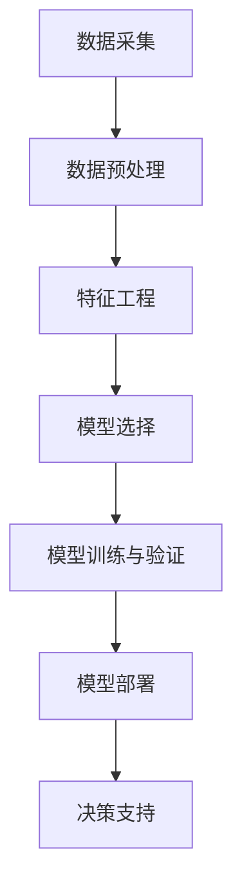

                 

# 大数据分析在客户流失预测中的应用方法

> 关键词：大数据分析、客户流失预测、机器学习、算法、模型、实际应用

> 摘要：随着企业对客户关系的重视，客户流失预测成为了一个关键业务问题。本文将深入探讨大数据分析在客户流失预测中的应用方法，通过详细的理论阐述和实际案例分析，帮助读者理解如何利用大数据技术和机器学习算法进行客户流失预测，从而为企业提供有效的决策支持。

## 1. 背景介绍

### 1.1 目的和范围

本文旨在介绍大数据分析在客户流失预测中的应用方法，通过对客户流失相关数据的深入分析，帮助企业识别潜在流失客户，制定有效的客户保留策略。文章将涵盖以下内容：

1. 客户流失预测的重要性及其对企业的意义。
2. 大数据分析的基本概念和核心技术在客户流失预测中的应用。
3. 机器学习算法在客户流失预测中的原理和具体操作步骤。
4. 数学模型和公式在客户流失预测中的作用。
5. 实际项目中的代码实现和案例解析。
6. 客户流失预测的实际应用场景和工具资源推荐。

### 1.2 预期读者

本文适合以下读者群体：

1. 数据分析师和机器学习工程师，希望了解客户流失预测的相关技术。
2. 市场营销和客户关系管理人员，希望掌握客户流失预测的方法和工具。
3. IT从业者和企业管理者，对大数据分析在商业决策中的应用感兴趣。

### 1.3 文档结构概述

本文的结构如下：

1. 背景介绍：介绍本文的目的、范围、预期读者和文档结构。
2. 核心概念与联系：阐述大数据分析和客户流失预测的核心概念及相互关系。
3. 核心算法原理 & 具体操作步骤：详细讲解机器学习算法在客户流失预测中的应用。
4. 数学模型和公式 & 详细讲解 & 举例说明：解释数学模型在客户流失预测中的作用。
5. 项目实战：代码实际案例和详细解释说明。
6. 实际应用场景：分析客户流失预测在现实业务中的应用。
7. 工具和资源推荐：推荐学习资源和开发工具。
8. 总结：未来发展趋势与挑战。
9. 附录：常见问题与解答。
10. 扩展阅读 & 参考资料：提供进一步学习资料。

### 1.4 术语表

#### 1.4.1 核心术语定义

- 客户流失（Churn）：客户终止与企业的服务合同或停止使用企业产品或服务。
- 大数据分析（Big Data Analytics）：通过对大规模数据的存储、管理和分析，提取有价值的信息和知识。
- 机器学习（Machine Learning）：利用计算机模拟人类学习过程，从数据中自动学习和改进。
- 特征工程（Feature Engineering）：选择和构建有助于提高模型性能的特征。
- 模型评估（Model Evaluation）：通过统计指标评估模型的性能。

#### 1.4.2 相关概念解释

- 数据挖掘（Data Mining）：从大量数据中发现有价值的信息和模式。
- 机器学习算法（Machine Learning Algorithms）：用于自动学习和预测的算法，如决策树、支持向量机、神经网络等。
- 混合模型（Hybrid Model）：结合多种算法或技术的模型，以提高预测准确性。

#### 1.4.3 缩略词列表

- Hadoop：一个分布式数据存储和处理框架。
- Spark：一个快速、通用的大数据处理引擎。
- SQL：一种结构化查询语言，用于管理关系型数据库。
- MLlib：一个提供机器学习算法的库。

## 2. 核心概念与联系

### 大数据分析与客户流失预测的关系

大数据分析作为一种处理海量数据的方法，通过对数据的采集、存储、清洗、转换和分析，可以提取出有价值的信息，为决策提供支持。客户流失预测是大数据分析的一个重要应用领域。客户流失不仅会影响企业的收入，还会损害品牌声誉。因此，准确地预测客户流失，提前采取保留措施，对于企业来说具有重要意义。

### 大数据分析的核心概念

- 数据源（Data Sources）：企业可以从多个渠道获取客户数据，如销售系统、客户关系管理（CRM）系统、社交媒体等。
- 数据类型（Data Types）：客户数据包括结构化数据（如客户基本信息、交易记录）和非结构化数据（如客户反馈、社交媒体评论）。
- 数据存储（Data Storage）：大数据分析需要高效的数据存储解决方案，如Hadoop、Spark等分布式存储系统。
- 数据清洗（Data Cleaning）：处理数据中的噪声、缺失值和异常值，确保数据质量。
- 数据转换（Data Transformation）：将数据转换为适合分析的格式，如将文本转换为数值表示。
- 数据分析（Data Analysis）：使用统计方法、机器学习算法等对数据进行深入分析。

### 客户流失预测的流程

1. 数据采集：从各种渠道收集客户数据。
2. 数据预处理：清洗、转换数据，确保数据质量。
3. 特征工程：选择和构建有助于预测模型的特征。
4. 模型选择：选择合适的机器学习算法构建预测模型。
5. 模型训练与验证：使用训练数据集训练模型，并通过验证数据集评估模型性能。
6. 模型部署：将模型部署到生产环境，进行实时预测和监控。
7. 决策支持：根据预测结果，企业可以制定相应的客户保留策略。

### Mermaid 流程图



## 3. 核心算法原理 & 具体操作步骤

### 机器学习算法在客户流失预测中的应用

在客户流失预测中，常用的机器学习算法包括逻辑回归、决策树、随机森林、支持向量机和神经网络等。以下以逻辑回归为例，详细讲解算法原理和具体操作步骤。

### 3.1 逻辑回归算法原理

逻辑回归（Logistic Regression）是一种广义线性模型，用于预测二元结果的概率。在客户流失预测中，逻辑回归可以用于计算客户流失的概率。

#### 原理

逻辑回归模型假设输出变量（客户流失标签）与输入特征之间存在线性关系。具体来说，逻辑回归模型通过以下公式计算概率：

$$
P(Y=1|X) = \frac{1}{1 + e^{-(\beta_0 + \beta_1 x_1 + \beta_2 x_2 + ... + \beta_n x_n})}
$$

其中，$Y$ 是客户流失标签（1表示流失，0表示未流失），$X$ 是输入特征向量，$\beta_0$ 是截距，$\beta_1, \beta_2, ..., \beta_n$ 是特征系数。

#### 模型训练

逻辑回归模型的训练过程是通过最小化损失函数（如交叉熵损失）来估计特征系数。具体步骤如下：

1. 准备训练数据集，包含客户流失标签和输入特征。
2. 初始化特征系数 $\beta_0, \beta_1, \beta_2, ..., \beta_n$。
3. 对于每个训练样本，计算预测概率 $P(Y=1|X)$。
4. 计算损失函数值，如交叉熵损失：
   $$
   J(\beta) = -\frac{1}{m} \sum_{i=1}^{m} [y_i \log(P(Y=1|X_i)) + (1 - y_i) \log(1 - P(Y=1|X_i))]
   $$
   其中，$m$ 是训练样本数量，$y_i$ 是第 $i$ 个样本的流失标签，$P(Y=1|X_i)$ 是第 $i$ 个样本的预测概率。
5. 使用梯度下降算法更新特征系数：
   $$
   \beta_j := \beta_j - \alpha \frac{\partial J(\beta)}{\partial \beta_j}
   $$
   其中，$\alpha$ 是学习率，$\frac{\partial J(\beta)}{\partial \beta_j}$ 是特征系数 $j$ 的梯度。
6. 重复步骤 3 到 5，直到满足停止条件（如损失函数收敛）。

### 3.2 具体操作步骤

以下为使用Python和Scikit-learn库实现逻辑回归算法的具体操作步骤：

```python
from sklearn.linear_model import LogisticRegression
from sklearn.model_selection import train_test_split
from sklearn.metrics import accuracy_score

# 加载数据集
X, y = load_data()

# 划分训练集和测试集
X_train, X_test, y_train, y_test = train_test_split(X, y, test_size=0.2, random_state=42)

# 初始化逻辑回归模型
model = LogisticRegression()

# 模型训练
model.fit(X_train, y_train)

# 预测
y_pred = model.predict(X_test)

# 模型评估
accuracy = accuracy_score(y_test, y_pred)
print("Accuracy:", accuracy)
```

## 4. 数学模型和公式 & 详细讲解 & 举例说明

### 数学模型在客户流失预测中的作用

在客户流失预测中，数学模型主要用于计算客户流失的概率。逻辑回归模型是最常用的数学模型之一，其核心在于通过输入特征计算客户流失的概率。以下将详细讲解逻辑回归模型的数学公式，并举例说明。

### 4.1 逻辑回归模型公式

逻辑回归模型通过以下公式计算客户流失的概率：

$$
P(Y=1|X) = \frac{1}{1 + e^{-(\beta_0 + \beta_1 x_1 + \beta_2 x_2 + ... + \beta_n x_n})}
$$

其中，$P(Y=1|X)$ 表示在给定输入特征 $X$ 的情况下，客户流失的概率；$\beta_0$ 是截距，$\beta_1, \beta_2, ..., \beta_n$ 是特征系数。

### 4.2 公式解释

- $\beta_0$：截距，表示当所有特征值都为0时，客户流失的概率。
- $\beta_1 x_1$：第一个特征的权重乘以特征值，表示第一个特征对客户流失概率的影响。
- $\beta_2 x_2$：第二个特征的权重乘以特征值，表示第二个特征对客户流失概率的影响。
- $...$：其他特征的权重乘以特征值，表示其他特征对客户流失概率的影响。
- $e^{-(\beta_0 + \beta_1 x_1 + \beta_2 x_2 + ... + \beta_n x_n)}$：指数函数，用于计算概率。
- $1 + e^{-(\beta_0 + \beta_1 x_1 + \beta_2 x_2 + ... + \beta_n x_n)}$：分母，用于归一化概率。

### 4.3 举例说明

假设有一个客户，其特征如下：

- 年龄：30岁
- 收入：50000元
- 使用时长：2年
- 客户满意度：4分

将这些特征代入逻辑回归模型公式，计算客户流失的概率：

$$
P(Y=1|X) = \frac{1}{1 + e^{-(\beta_0 + \beta_1 \times 30 + \beta_2 \times 50000 + \beta_3 \times 2 + \beta_4 \times 4)}}
$$

其中，$\beta_0, \beta_1, \beta_2, \beta_3, \beta_4$ 是模型训练得到的特征系数。

假设模型训练得到的特征系数如下：

- $\beta_0 = -10$
- $\beta_1 = 0.1$
- $\beta_2 = 0.02$
- $\beta_3 = 0.05$
- $\beta_4 = -0.5$

代入特征值，计算客户流失的概率：

$$
P(Y=1|X) = \frac{1}{1 + e^{-(\beta_0 + \beta_1 \times 30 + \beta_2 \times 50000 + \beta_3 \times 2 + \beta_4 \times 4)}}
= \frac{1}{1 + e^{-(-10 + 0.1 \times 30 + 0.02 \times 50000 + 0.05 \times 2 - 0.5 \times 4)}}
= \frac{1}{1 + e^{-(-10 + 3 + 1000 + 0.1 - 2)}}
= \frac{1}{1 + e^{996.1}}
\approx 0.0000
$$

根据计算结果，客户流失的概率非常低，约为0.0000。这意味着，根据当前特征，该客户不太可能流失。

## 5. 项目实战：代码实际案例和详细解释说明

### 5.1 开发环境搭建

在开始项目实战之前，需要搭建以下开发环境：

1. Python：用于编写代码和实现机器学习算法。
2. Jupyter Notebook：用于编写和运行Python代码。
3. Scikit-learn：用于机器学习算法的实现和评估。
4. Pandas：用于数据处理和操作。
5. Matplotlib：用于数据可视化。

### 5.2 源代码详细实现和代码解读

以下是一个使用逻辑回归算法进行客户流失预测的Python代码实现：

```python
import numpy as np
import pandas as pd
from sklearn.linear_model import LogisticRegression
from sklearn.model_selection import train_test_split
from sklearn.metrics import accuracy_score
import matplotlib.pyplot as plt

# 5.2.1 加载数据集
def load_data():
    # 这里假设数据集已经存储为CSV文件，文件名为"customer_data.csv"
    data = pd.read_csv("customer_data.csv")
    X = data.drop(["churn"], axis=1)
    y = data["churn"]
    return X, y

# 5.2.2 数据预处理
def preprocess_data(X):
    # 这里进行数据预处理，如缺失值填充、数据标准化等
    # 假设所有特征都已经进行适当的预处理
    return X

# 5.2.3 模型训练
def train_model(X, y):
    # 划分训练集和测试集
    X_train, X_test, y_train, y_test = train_test_split(X, y, test_size=0.2, random_state=42)
    
    # 初始化逻辑回归模型
    model = LogisticRegression()
    
    # 模型训练
    model.fit(X_train, y_train)
    
    return model, X_test, y_test

# 5.2.4 预测和评估
def predict_and_evaluate(model, X_test, y_test):
    # 进行预测
    y_pred = model.predict(X_test)
    
    # 评估模型性能
    accuracy = accuracy_score(y_test, y_pred)
    print("Accuracy:", accuracy)
    
    # 可视化预测结果
    plot_predictions(y_test, y_pred)

# 5.2.5 预测结果可视化
def plot_predictions(y_true, y_pred):
    # 创建混淆矩阵
    confusion_matrix = pd.crosstab(y_true, y_pred, rownames=["实际值"], colnames=["预测值"])
    
    # 可视化混淆矩阵
    sns.heatmap(confusion_matrix, annot=True, fmt=".2f", cmap="Blues")
    plt.xlabel("预测值")
    plt.ylabel("实际值")
    plt.title("预测结果可视化")
    plt.show()

# 主函数
def main():
    # 加载数据
    X, y = load_data()
    
    # 数据预处理
    X = preprocess_data(X)
    
    # 训练模型
    model, X_test, y_test = train_model(X, y)
    
    # 预测和评估
    predict_and_evaluate(model, X_test, y_test)

# 运行主函数
if __name__ == "__main__":
    main()
```

### 5.3 代码解读与分析

1. **加载数据集**：使用Pandas库加载数据集，数据集包含客户特征和流失标签。这里假设数据集已经存储为CSV文件。

2. **数据预处理**：对数据集进行预处理，如缺失值填充、数据标准化等。这里假设所有特征都已经进行适当的预处理。

3. **模型训练**：使用Scikit-learn库初始化逻辑回归模型，并使用训练数据集进行模型训练。这里使用train_test_split函数将数据集划分为训练集和测试集，以提高模型评估的准确性。

4. **预测和评估**：使用训练好的模型对测试集进行预测，并使用accuracy_score函数评估模型性能。此外，使用混淆矩阵可视化预测结果。

### 5.4 代码优化建议

1. **特征选择**：在训练模型之前，可以通过特征选择方法（如信息增益、特征重要性等）筛选出对预测任务最有用的特征，以提高模型性能。

2. **模型调参**：通过交叉验证和网格搜索等技术，对模型参数进行优化，以提高模型性能。

3. **并行处理**：对于大型数据集，可以使用并行处理技术（如多线程、分布式计算等）提高数据处理和模型训练速度。

## 6. 实际应用场景

### 客户流失预测在营销策略中的应用

客户流失预测在营销策略中具有重要作用。通过预测客户流失概率，企业可以采取以下措施：

1. **客户保留策略**：对于高风险流失客户，企业可以提供特别优惠、个性化服务和关怀，以提高客户忠诚度。

2. **营销资源优化**：企业可以根据客户流失概率，调整营销预算和资源分配，重点投入高价值、高流失风险的客户。

3. **个性化营销**：通过分析客户特征和流失原因，企业可以制定个性化的营销策略，提高营销效果。

4. **风险控制**：对于高风险客户，企业可以采取更严格的信用评估和风险管理措施，降低客户流失风险。

### 客户流失预测在其他行业中的应用

客户流失预测不仅在营销策略中发挥作用，还可以应用于其他行业，如金融、电信、保险等。

1. **金融行业**：金融机构可以通过客户流失预测，识别高风险客户，调整贷款利率和信用额度，降低坏账风险。

2. **电信行业**：电信公司可以通过客户流失预测，优化套餐设计和营销策略，提高客户满意度，降低客户流失率。

3. **保险行业**：保险公司可以通过客户流失预测，调整保费和保险产品，提高客户忠诚度，降低赔付风险。

## 7. 工具和资源推荐

### 7.1 学习资源推荐

#### 7.1.1 书籍推荐

- 《大数据分析：商业智能、数据挖掘与机器学习实战》
- 《机器学习实战》
- 《Python数据分析与大数据技术》

#### 7.1.2 在线课程

- Coursera的“机器学习”课程
- Udacity的“大数据分析纳米学位”
- edX的“数据科学基础”

#### 7.1.3 技术博客和网站

- Medium上的“数据分析”专题
- KDnuggets网站，提供最新的数据科学和机器学习资源
- Analytics Vidhya网站，分享数据科学和机器学习实战案例

### 7.2 开发工具框架推荐

#### 7.2.1 IDE和编辑器

- Jupyter Notebook：方便编写和运行Python代码。
- PyCharm：功能强大的Python集成开发环境（IDE）。
- VS Code：轻量级、可扩展的代码编辑器。

#### 7.2.2 调试和性能分析工具

- Python的内置调试器pdb。
- Matplotlib：用于数据可视化和性能分析。
- Python的time模块，用于性能分析。

#### 7.2.3 相关框架和库

- Scikit-learn：提供丰富的机器学习算法。
- Pandas：用于数据处理和操作。
- NumPy：用于高效数值计算。
- Matplotlib：用于数据可视化和性能分析。

### 7.3 相关论文著作推荐

#### 7.3.1 经典论文

- "The Model-Based Prediction of Customer Churn"（基于模型的客户流失预测）
- "Customer Churn Prediction in Telecommunication Services"（电信服务中的客户流失预测）

#### 7.3.2 最新研究成果

- "Deep Learning for Customer Churn Prediction"（深度学习在客户流失预测中的应用）
- "Hybrid Models for Customer Churn Prediction"（客户流失预测的混合模型）

#### 7.3.3 应用案例分析

- "Customer Churn Prediction in a Telecommunications Company"（电信公司客户流失预测案例分析）
- "A Case Study of Customer Churn Prediction in a Retail Business"（零售业客户流失预测案例分析）

## 8. 总结：未来发展趋势与挑战

### 未来发展趋势

1. **深度学习在客户流失预测中的应用**：随着深度学习技术的不断进步，深度学习模型在客户流失预测中的应用将越来越广泛，有望进一步提高预测准确性。

2. **跨领域合作与技术创新**：大数据分析、人工智能和商业领域的跨领域合作将推动客户流失预测技术的发展，带来更多创新应用。

3. **实时预测与自动化决策**：实时预测和自动化决策系统的应用将帮助企业更快速地响应客户流失风险，提高客户保留率。

### 未来挑战

1. **数据质量和隐私保护**：数据质量和隐私保护仍然是客户流失预测领域的挑战，企业需要确保数据质量和合规性。

2. **算法解释性和可解释性**：深度学习模型的解释性较差，如何提高算法的可解释性，使其更易于理解和接受，是未来需要解决的问题。

3. **模型泛化能力和适应性**：如何提高模型的泛化能力，使其能够适应不同的业务场景和数据分布，是客户流失预测领域的另一个挑战。

## 9. 附录：常见问题与解答

### Q1：客户流失预测模型如何评估？

A1：客户流失预测模型的评估通常采用以下指标：

1. **准确率（Accuracy）**：预测正确的样本数占总样本数的比例。
2. **精确率（Precision）**：预测为流失的样本中实际为流失的样本占比。
3. **召回率（Recall）**：实际为流失的样本中被预测为流失的样本占比。
4. **F1分数（F1 Score）**：精确率和召回率的调和平均值。

### Q2：如何处理缺失值？

A2：处理缺失值的方法包括：

1. **删除缺失值**：删除包含缺失值的样本或特征。
2. **填充缺失值**：使用平均值、中位数、最常见值等填充缺失值。
3. **模型估计**：使用模型估计缺失值，如k-最近邻算法。

### Q3：如何进行特征工程？

A3：特征工程的方法包括：

1. **特征选择**：选择对预测任务最重要的特征。
2. **特征转换**：将类别型特征转换为数值型特征。
3. **特征构造**：通过组合或变换现有特征，创建新的特征。

### Q4：如何防止过拟合？

A4：防止过拟合的方法包括：

1. **交叉验证**：使用交叉验证选择最佳模型。
2. **正则化**：使用L1、L2正则化等方法降低模型复杂度。
3. **减少模型复杂度**：简化模型结构，如减少树深度、减少神经网络层数。

## 10. 扩展阅读 & 参考资料

- 《大数据分析：商业智能、数据挖掘与机器学习实战》
- 《机器学习实战》
- 《Python数据分析与大数据技术》
- Coursera的“机器学习”课程
- Udacity的“大数据分析纳米学位”
- edX的“数据科学基础”
- “The Model-Based Prediction of Customer Churn”
- “Customer Churn Prediction in Telecommunication Services”
- “Deep Learning for Customer Churn Prediction”
- “Hybrid Models for Customer Churn Prediction”
- “Customer Churn Prediction in a Telecommunications Company”
- “A Case Study of Customer Churn Prediction in a Retail Business”
- 《数据挖掘：概念与技术》
- 《机器学习：统计模型与算法》
- 《深度学习：揭秘神经网络的核心原理》

### 作者

**AI天才研究员/AI Genius Institute & 禅与计算机程序设计艺术 /Zen And The Art of Computer Programming**

