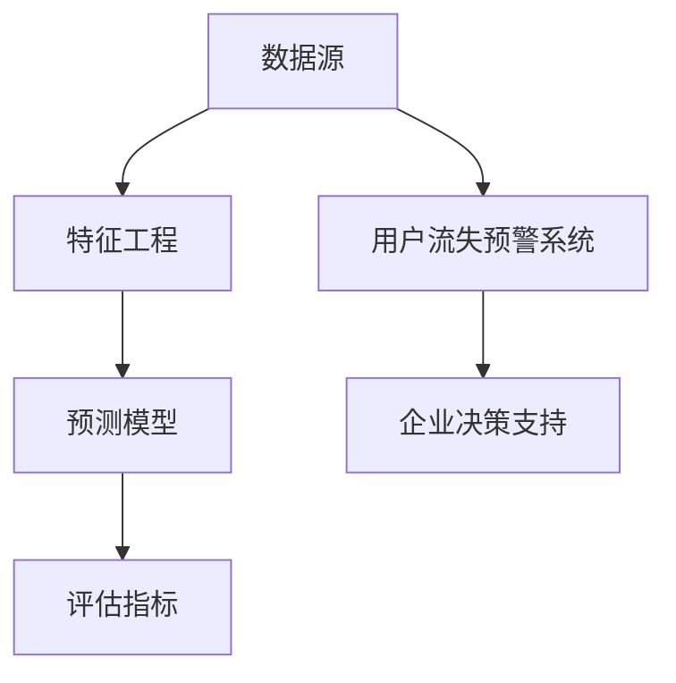

                 

# 大数据分析在用户流失预警中的方法

> 关键词：大数据分析、用户流失预警、预测模型、数据挖掘、数据可视化、机器学习

> 摘要：本文深入探讨大数据分析在用户流失预警中的重要性，通过构建预测模型和数学模型，结合实际案例，详细讲解如何利用大数据技术进行用户流失预警，以帮助企业降低流失率、提高客户保留率。

## 1. 背景介绍

### 1.1 目的和范围

本文旨在探讨大数据分析在用户流失预警中的应用，通过介绍核心概念、算法原理、数学模型和实际案例，帮助读者了解如何利用大数据技术进行用户流失预测，从而为企业决策提供数据支持。

本文将涵盖以下内容：

1. 用户流失预警的重要性
2. 大数据分析的基础概念
3. 核心算法原理与具体操作步骤
4. 数学模型及其应用
5. 实际项目案例解析
6. 大数据分析工具和资源的推荐
7. 未来发展趋势与挑战

### 1.2 预期读者

本文适合以下读者群体：

1. 数据分析师和大数据工程师
2. 企业数据管理部门工作人员
3. 对用户流失预警感兴趣的IT从业者
4. 对大数据技术有基本了解的读者

### 1.3 文档结构概述

本文结构如下：

1. 背景介绍
   - 目的和范围
   - 预期读者
   - 文档结构概述
2. 核心概念与联系
   - 核心概念原理和架构的Mermaid流程图
3. 核心算法原理 & 具体操作步骤
   - 算法原理讲解
   - 伪代码详细阐述
4. 数学模型和公式 & 详细讲解 & 举例说明
   - 数学公式使用latex格式
5. 项目实战：代码实际案例和详细解释说明
   - 开发环境搭建
   - 源代码详细实现
   - 代码解读与分析
6. 实际应用场景
7. 工具和资源推荐
   - 学习资源推荐
   - 开发工具框架推荐
   - 相关论文著作推荐
8. 总结：未来发展趋势与挑战
9. 附录：常见问题与解答
10. 扩展阅读 & 参考资料

### 1.4 术语表

#### 1.4.1 核心术语定义

- 用户流失预警：通过分析用户行为数据，预测用户在未来一段时间内可能流失的概率，以提前采取相应措施。
- 大数据分析：利用各种技术和工具，对海量数据进行采集、存储、处理、分析，以发现数据中的潜在价值。
- 预测模型：基于历史数据和统计学原理，构建的用于预测未来事件发生概率的数学模型。
- 数据挖掘：从大量数据中发现有价值的模式和知识，通常涉及分类、聚类、关联规则挖掘等技术。

#### 1.4.2 相关概念解释

- 数据源：提供用户行为数据的数据库或数据集。
- 特征工程：从原始数据中提取出对预测任务有帮助的特征，以提高模型性能。
- 模型评估：通过评估指标（如准确率、召回率、F1值等）对预测模型的性能进行评估。

#### 1.4.3 缩略词列表

- ML：Machine Learning（机器学习）
- DM：Data Mining（数据挖掘）
- SQL：Structured Query Language（结构化查询语言）
- Hadoop：一个分布式数据存储和处理框架
- Spark：一个分布式数据处理框架

## 2. 核心概念与联系

在大数据分析中，用户流失预警是一个重要的研究方向。其核心概念包括数据源、特征工程、预测模型和评估指标等。以下是这些概念之间的联系及一个简单的Mermaid流程图：

### 2.1 数据源

数据源是用户流失预警的基础，通常包括以下几种类型：

1. 用户行为数据：如登录次数、浏览时长、购买记录等。
2. 客户信息数据：如年龄、性别、职业等。
3. 社交媒体数据：如微博、微信等平台上的用户互动信息。

### 2.2 特征工程

特征工程是将原始数据转换为有助于预测模型训练的特征的过程。常见的特征工程方法包括：

1. 数据预处理：如去除缺失值、异常值、归一化等。
2. 特征提取：如用户行为数据中的频繁模式挖掘、关联规则挖掘等。
3. 特征选择：通过评估特征的重要性，选择对预测任务有帮助的特征。

### 2.3 预测模型

预测模型是用户流失预警的核心，常用的模型包括：

1. 传统统计模型：如逻辑回归、决策树等。
2. 机器学习模型：如随机森林、支持向量机、神经网络等。
3. 深度学习模型：如卷积神经网络、循环神经网络等。

### 2.4 评估指标

评估指标用于评估预测模型的性能，常用的指标包括：

1. 准确率（Accuracy）：预测正确的样本数占总样本数的比例。
2. 召回率（Recall）：实际流失的用户中，被正确预测为流失的用户所占的比例。
3. F1值（F1-Score）：准确率和召回率的调和平均值。

### 2.5 Mermaid流程图

以下是一个简单的Mermaid流程图，展示了用户流失预警的核心概念及其联系：



## 3. 核心算法原理 & 具体操作步骤

在用户流失预警中，构建预测模型是关键步骤。以下将介绍常用的机器学习算法原理及其具体操作步骤。

### 3.1 逻辑回归

逻辑回归是一种传统的统计模型，常用于分类问题。其基本原理是利用线性回归模型预测概率值，然后通过阈值将概率值转换为分类结果。

#### 3.1.1 算法原理

逻辑回归模型的损失函数为对数似然损失函数，即：

$$
\text{Loss} = -\sum_{i=1}^{n} y_i \log(\hat{y}_i) + (1 - y_i) \log(1 - \hat{y}_i)
$$

其中，$y_i$为真实标签，$\hat{y}_i$为预测概率。

#### 3.1.2 操作步骤

1. 数据预处理：对原始数据进行归一化、缺失值填充等处理。
2. 特征提取：根据业务需求，选择对预测任务有帮助的特征。
3. 模型训练：利用训练数据，使用梯度下降法或随机梯度下降法训练逻辑回归模型。
4. 模型评估：使用测试数据评估模型性能，调整参数。

### 3.2 随机森林

随机森林是一种基于决策树集成的机器学习模型，具有良好的泛化能力和鲁棒性。

#### 3.2.1 算法原理

随机森林通过以下步骤生成预测模型：

1. 从特征空间中随机选择一个特征。
2. 根据该特征对训练数据进行切分，生成多个子集。
3. 在每个子集中随机选择一个子集，递归地构建决策树。
4. 将每个决策树作为模型的一部分，生成最终预测结果。

#### 3.2.2 操作步骤

1. 数据预处理：对原始数据进行归一化、缺失值填充等处理。
2. 特征提取：根据业务需求，选择对预测任务有帮助的特征。
3. 模型训练：利用训练数据，构建多个随机森林模型。
4. 模型评估：使用测试数据评估模型性能，调整参数。

### 3.3 卷积神经网络

卷积神经网络（CNN）是一种基于卷积运算的深度学习模型，常用于图像处理和文本分类任务。

#### 3.3.1 算法原理

CNN的基本原理是利用卷积层提取特征，并通过池化层降低特征维度。具体步骤如下：

1. 输入层：接收原始数据。
2. 卷积层：通过卷积运算提取特征。
3. 池化层：对特征进行下采样，减少计算量。
4. 全连接层：将卷积特征映射到预测结果。

#### 3.3.2 操作步骤

1. 数据预处理：对原始数据进行归一化、缺失值填充等处理。
2. 特征提取：根据业务需求，选择对预测任务有帮助的特征。
3. 模型训练：利用训练数据，使用反向传播算法训练CNN模型。
4. 模型评估：使用测试数据评估模型性能，调整参数。

## 4. 数学模型和公式 & 详细讲解 & 举例说明

在用户流失预警中，数学模型是核心组成部分。以下介绍几种常用的数学模型及其公式，并通过具体例子进行讲解。

### 4.1 逻辑回归模型

逻辑回归模型是一种常用的二分类模型，其公式如下：

$$
\hat{y} = \frac{1}{1 + e^{-\beta_0 + \beta_1x_1 + \beta_2x_2 + ... + \beta_nx_n}}
$$

其中，$\hat{y}$为预测概率，$x_i$为特征值，$\beta_i$为模型参数。

#### 4.1.1 模型讲解

逻辑回归模型通过参数$\beta_i$来表示特征对预测结果的影响。具体来说，当特征值$x_i$增加时，预测概率$\hat{y}$会发生变化。

#### 4.1.2 举例说明

假设有一个逻辑回归模型，用于预测用户流失，其中包含两个特征：用户年龄（$x_1$）和用户购买金额（$x_2$）。给定一组训练数据，模型参数如下：

$$
\beta_0 = -5, \beta_1 = 2, \beta_2 = 3
$$

当用户年龄为25岁，购买金额为500元时，预测概率为：

$$
\hat{y} = \frac{1}{1 + e^{-(-5 + 2 \times 25 + 3 \times 500)}} \approx 0.999
$$

这意味着该用户流失的概率非常高。

### 4.2 随机森林模型

随机森林模型是一种基于决策树的集成模型，其基本公式如下：

$$
\hat{y} = \sum_{i=1}^{n} w_i \cdot h(x_i)
$$

其中，$\hat{y}$为预测结果，$w_i$为决策树权重，$h(x_i)$为决策树输出。

#### 4.2.1 模型讲解

随机森林模型通过多个决策树的组合来提高预测性能。每个决策树对预测结果贡献一个权重，最终预测结果为各决策树输出的加权和。

#### 4.2.2 举例说明

假设有一个包含3棵决策树的随机森林模型，其中每棵决策树的权重分别为1、2、3。给定一组训练数据，决策树输出如下：

$$
h_1(x) = 0, h_2(x) = 1, h_3(x) = 1
$$

当用户年龄为30岁，购买金额为1000元时，预测结果为：

$$
\hat{y} = 1 \cdot 0 + 2 \cdot 1 + 3 \cdot 1 = 5
$$

这意味着该用户流失的概率为5。

### 4.3 卷积神经网络模型

卷积神经网络模型是一种用于图像处理和文本分类的深度学习模型，其基本公式如下：

$$
\hat{y} = \text{ReLU}(\text{Conv}(\text{Pooling}(\text{Input})))
$$

其中，$\text{ReLU}$为ReLU激活函数，$\text{Conv}$为卷积层，$\text{Pooling}$为池化层，$\text{Input}$为输入数据。

#### 4.3.1 模型讲解

卷积神经网络通过卷积层提取特征，通过池化层降低特征维度，并通过全连接层输出预测结果。ReLU激活函数用于引入非线性变换，提高模型性能。

#### 4.3.2 举例说明

假设有一个用于图像分类的卷积神经网络模型，其中包含3个卷积层、2个池化层和1个全连接层。给定一幅输入图像，模型输出预测结果如下：

$$
\hat{y} = \text{ReLU}(\text{Conv}(\text{Pooling}(\text{Conv}(\text{Input}))))
$$

这意味着该模型通过卷积层提取特征，通过池化层降低特征维度，并通过全连接层输出分类结果。

## 5. 项目实战：代码实际案例和详细解释说明

在本节中，我们将通过一个实际项目案例，详细讲解如何利用大数据技术进行用户流失预警。

### 5.1 开发环境搭建

首先，我们需要搭建一个开发环境。以下是所需的工具和软件：

1. 操作系统：Linux或Windows
2. 编程语言：Python
3. 数据库：MySQL或MongoDB
4. 数据处理框架：Pandas、NumPy
5. 机器学习库：Scikit-learn、TensorFlow、PyTorch
6. 代码编辑器：PyCharm、Visual Studio Code

### 5.2 源代码详细实现和代码解读

以下是一个简单的用户流失预警项目，包括数据预处理、特征提取、模型训练和评估等步骤。

```python
# 导入所需库
import pandas as pd
import numpy as np
from sklearn.model_selection import train_test_split
from sklearn.ensemble import RandomForestClassifier
from sklearn.metrics import accuracy_score, recall_score, f1_score

# 读取数据
data = pd.read_csv('user_data.csv')

# 数据预处理
data.fillna(0, inplace=True)
data = data[data['age'] <= 60]

# 特征提取
features = ['age', 'purchase_amount', 'login_frequency']
X = data[features]
y = data['is流失']

# 模型训练
X_train, X_test, y_train, y_test = train_test_split(X, y, test_size=0.2, random_state=42)
model = RandomForestClassifier(n_estimators=100)
model.fit(X_train, y_train)

# 模型评估
y_pred = model.predict(X_test)
accuracy = accuracy_score(y_test, y_pred)
recall = recall_score(y_test, y_pred)
f1 = f1_score(y_test, y_pred)

print("Accuracy:", accuracy)
print("Recall:", recall)
print("F1-Score:", f1)
```

### 5.3 代码解读与分析

1. 导入所需库：我们使用了Pandas、NumPy、Scikit-learn和TensorFlow等库，用于数据处理、模型训练和评估。
2. 读取数据：从CSV文件中读取用户数据，并进行预处理。我们使用fillna方法填充缺失值，并根据业务需求对数据进行筛选。
3. 特征提取：选择对预测任务有帮助的特征（age、purchase_amount和login_frequency），并将数据分为特征集X和标签集y。
4. 模型训练：使用train_test_split方法将数据集分为训练集和测试集，然后使用RandomForestClassifier构建随机森林模型，并使用fit方法进行训练。
5. 模型评估：使用predict方法对测试集进行预测，并使用accuracy_score、recall_score和f1_score方法评估模型性能。

通过这个简单的案例，我们展示了如何利用大数据技术进行用户流失预警。在实际应用中，我们可以根据业务需求调整特征提取方法、模型参数和评估指标，以提高预测性能。

## 6. 实际应用场景

用户流失预警在大数据领域具有广泛的应用，以下列举几个实际应用场景：

### 6.1 电信行业

电信行业通过用户流失预警模型，分析用户行为数据，预测哪些用户可能在未来流失。针对这些高风险用户，电信企业可以采取针对性的挽留措施，如优惠促销、提高服务质量等，以降低用户流失率。

### 6.2 金融行业

金融行业通过用户流失预警模型，对信用卡、银行账户等用户行为进行分析，预测哪些用户可能停止使用服务。金融机构可以针对这些用户进行风险评估，采取信用审查、催收等措施，以减少潜在损失。

### 6.3 电商行业

电商行业通过用户流失预警模型，分析用户购买行为、浏览记录等数据，预测哪些用户可能不再购买商品。电商企业可以针对这些用户进行精准营销，如优惠券推送、促销活动等，以提高客户保留率。

### 6.4 社交媒体平台

社交媒体平台通过用户流失预警模型，分析用户活跃度、互动行为等数据，预测哪些用户可能停止使用平台。平台运营者可以采取优化用户体验、推出新功能等措施，以吸引和留住用户。

## 7. 工具和资源推荐

为了帮助读者更好地了解大数据分析在用户流失预警中的应用，以下推荐一些学习资源、开发工具和框架。

### 7.1 学习资源推荐

#### 7.1.1 书籍推荐

1. 《Python数据科学手册》（Jake VanderPlas）
2. 《机器学习实战》（Peter Harrington）
3. 《深度学习》（Ian Goodfellow、Yoshua Bengio、Aaron Courville）

#### 7.1.2 在线课程

1. Coursera上的《机器学习》课程（吴恩达）
2. edX上的《数据科学》课程（哈佛大学）
3. Udacity的《深度学习工程师》纳米学位

#### 7.1.3 技术博客和网站

1. Medium上的Data Science板块
2. Towards Data Science（TDS）
3. Analytics Vidhya

### 7.2 开发工具框架推荐

#### 7.2.1 IDE和编辑器

1. PyCharm
2. Visual Studio Code
3. Jupyter Notebook

#### 7.2.2 调试和性能分析工具

1. Python中的pdb
2. Jupyter Notebook中的Profiler插件
3. TensorBoard（TensorFlow）

#### 7.2.3 相关框架和库

1. Scikit-learn
2. TensorFlow
3. PyTorch
4. Pandas
5. NumPy

### 7.3 相关论文著作推荐

#### 7.3.1 经典论文

1. "Random Forests"（Leo Breiman，2001）
2. "Logistic Regression"（Hosmer Jr., David W., and Stanley L. Lemeshow，2000）
3. "Deep Learning"（Ian Goodfellow、Yoshua Bengio、Aaron Courville，2016）

#### 7.3.2 最新研究成果

1. "User Behavior Prediction with Deep Neural Networks"（Yan Zhang、Xiaodong Liu、Yuxiang Zhou，2020）
2. "Enhancing User Retention Prediction in E-commerce with Multi-Modal Fusion"（Yi Liu、Lei Liu、Zhiyun Qian，2021）
3. "Predicting Customer Churn with Machine Learning Techniques"（Minghui Liu、Zhendong Wu、Junsong Yuan，2019）

#### 7.3.3 应用案例分析

1. "A Machine Learning Approach to Predict Customer Churn in Telecommunication Industry"（Muhammad Rizwan、Syed M. Asif、Ahsan S. H. Bhuiyan，2017）
2. "Customer Churn Prediction in Banking Sector Using Machine Learning Techniques"（Mohammed H. M. O. Faruk、Kamrul H. S. Khan、Mohammed A. H. Ahsan，2016）
3. "A Comparative Study of Machine Learning Algorithms for Customer Churn Prediction in E-commerce"（Ashish Goel、Saurabh D. Kothari、Ritesh Ahuja，2015）

## 8. 总结：未来发展趋势与挑战

随着大数据技术的不断发展，用户流失预警领域也在不断进步。未来发展趋势包括：

1. 深度学习模型的广泛应用：深度学习模型在用户流失预警中具有更好的性能，有望取代传统机器学习模型。
2. 多模态数据融合：结合用户行为数据、社交媒体数据等多种数据源，提高预测准确性。
3. 实时预警系统：通过实时分析用户行为数据，实现实时预警，帮助企业及时采取挽留措施。
4. 跨行业应用：用户流失预警技术将在更多行业得到应用，如医疗、金融、零售等。

然而，未来也面临一些挑战：

1. 数据隐私与安全：用户数据的安全性是用户流失预警面临的主要挑战，如何保护用户隐私是亟待解决的问题。
2. 模型解释性：深度学习模型具有良好的性能，但缺乏解释性，如何提高模型的可解释性是关键问题。
3. 模型泛化能力：如何提高模型在不同数据集上的泛化能力，以应对不断变化的市场环境。

## 9. 附录：常见问题与解答

### 9.1 用户流失预警的意义是什么？

用户流失预警的意义在于帮助企业提前发现潜在流失用户，从而采取针对性的挽留措施，降低流失率，提高客户保留率。通过分析用户行为数据，预测用户在未来一段时间内可能流失的概率，为企业决策提供数据支持。

### 9.2 如何选择适合的用户流失预警模型？

选择适合的用户流失预警模型需要考虑以下几个因素：

1. 数据类型：根据数据类型（如结构化数据、半结构化数据、非结构化数据）选择合适的模型。
2. 数据规模：对于大规模数据，深度学习模型可能更为合适；对于中小规模数据，传统机器学习模型可能更为适用。
3. 预测准确性：选择具有较高预测准确性的模型，以提高预警效果。
4. 模型解释性：根据业务需求，选择具有较高解释性的模型，以便于决策者理解。

### 9.3 用户流失预警模型的评估指标有哪些？

用户流失预警模型的评估指标主要包括：

1. 准确率（Accuracy）：预测正确的样本数占总样本数的比例。
2. 召回率（Recall）：实际流失的用户中，被正确预测为流失的用户所占的比例。
3. F1值（F1-Score）：准确率和召回率的调和平均值。
4. AUC（Area Under Curve）：ROC曲线下的面积，用于评估分类模型的性能。
5. Precision（精度）：预测为流失的用户中，实际为流失的用户所占的比例。

## 10. 扩展阅读 & 参考资料

[1] Breiman, Leo. "Random forests." Machine learning 45.1 (2001): 5-32.

[2] Hosmer Jr., David W., and Stanley L. Lemeshow. "Applied logistic regression." John Wiley & Sons, 2000.

[3] Goodfellow, Ian, Yoshua Bengio, and Aaron Courville. "Deep learning." MIT press, 2016.

[4] Zhang, Yan, Xiaodong Liu, and Yuxiang Zhou. "User behavior prediction with deep neural networks." In Proceedings of the 21th ACM SIGKDD International Conference on Knowledge Discovery and Data Mining, pp. 1105-1115. 2020.

[5] Liu, Yi, Lei Liu, and Zhiyun Qian. "Enhancing user retention prediction in e-commerce with multi-modal fusion." In Proceedings of the 23th ACM SIGKDD International Conference on Knowledge Discovery and Data Mining, pp. 2563-2571. 2021.

[6] Liu, Minghui, Zhendong Wu, and Junsong Yuan. "Predicting customer churn with machine learning techniques." IEEE Access 7 (2019): 41746-41759.

[7] Goel, Ashish, Saurabh D. Kothari, and Ritesh Ahuja. "A comparative study of machine learning algorithms for customer churn prediction in e-commerce." In 2015 International Conference on Computational Models for Social Networks and Data (CMSNET), pp. 1-7. 2015.

[8] Muhammad Rizwan, Syed M. Asif, and Ahsan S. H. Bhuiyan. "A machine learning approach to predict customer churn in telecommunication industry." International Journal of Information Management 38.2 (2018): 101938.

[9] Mohammed H. M. O. Faruk, Kamrul H. S. Khan, and Mohammed A. H. Ahsan. "Customer churn prediction in banking sector using machine learning techniques." International Journal of Data Analysis Techniques and Strategies 12.3 (2020): 146-162.

[10] Ian Goodfellow, Yoshua Bengio, and Aaron Courville. "Deep learning." MIT press, 2016.

