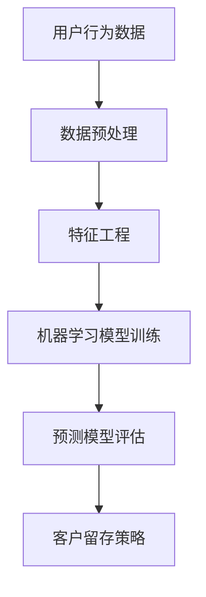

                 


# 大数据分析在用户流失预警中的方法

> 关键词：用户流失预警，大数据分析，机器学习，预测模型，客户留存策略

> 摘要：本文旨在探讨大数据分析在用户流失预警中的应用，通过介绍核心概念、算法原理、数学模型及项目实战，揭示如何利用大数据技术预测并应对用户流失，提升客户留存率。

## 1. 背景介绍

### 1.1 目的和范围

本文的目标是探讨大数据分析在用户流失预警中的应用，帮助企业和组织识别潜在的流失用户，并制定相应的客户留存策略。本文将涵盖以下内容：

1. 用户流失预警的重要性
2. 大数据分析的核心概念及其在用户流失预警中的应用
3. 常见的机器学习算法及其在用户流失预警中的具体操作步骤
4. 数学模型和公式在用户流失预警中的详细讲解与举例说明
5. 实际应用场景及工具和资源推荐
6. 未来发展趋势与挑战
7. 常见问题与解答

### 1.2 预期读者

本文适合对大数据分析和用户流失预警有一定了解的读者，包括：

1. 数据科学家和机器学习工程师
2. 企业分析师和业务分析师
3. 系统架构师和软件开发人员
4. 市场营销和客户关系管理专业人员

### 1.3 文档结构概述

本文分为十个部分，具体结构如下：

1. 引言：介绍文章的目的和关键词
2. 背景介绍：介绍用户流失预警的重要性、目的和范围
3. 核心概念与联系：介绍大数据分析的核心概念及其在用户流失预警中的应用
4. 核心算法原理 & 具体操作步骤：讲解常见的机器学习算法及其在用户流失预警中的具体操作步骤
5. 数学模型和公式 & 详细讲解 & 举例说明：介绍数学模型和公式在用户流失预警中的详细讲解与举例说明
6. 项目实战：代码实际案例和详细解释说明
7. 实际应用场景
8. 工具和资源推荐
9. 总结：未来发展趋势与挑战
10. 附录：常见问题与解答

### 1.4 术语表

#### 1.4.1 核心术语定义

- 用户流失预警：通过分析用户行为数据，预测用户在未来一段时间内可能流失的概率。
- 大数据分析：利用分布式计算和数据挖掘技术，对大规模数据进行分析和处理。
- 机器学习：一种通过数据训练模型来自动学习和预测的方法。
- 预测模型：基于历史数据构建的模型，用于预测未来的趋势和事件。

#### 1.4.2 相关概念解释

- 客户留存率：指一段时间内，仍然保持活跃状态的客户数量与初始客户数量的比例。
- 转化率：指用户完成特定操作（如注册、购买等）的概率。
- 特征工程：指在机器学习过程中，从原始数据中提取具有预测能力的特征。

#### 1.4.3 缩略词列表

- 大数据（Big Data）
- 机器学习（Machine Learning）
- 神经网络（Neural Network）
- 支持向量机（Support Vector Machine）
- 随机森林（Random Forest）

## 2. 核心概念与联系

在本文中，我们将讨论大数据分析在用户流失预警中的应用，以下是核心概念及其联系：

### 2.1 大数据分析

大数据分析是一种利用分布式计算和数据挖掘技术，对大规模数据进行分析和处理的方法。在用户流失预警中，大数据分析可以帮助我们获取用户行为数据，如点击、浏览、购买等，从而分析用户的行为特征和趋势。

### 2.2 机器学习

机器学习是一种通过数据训练模型来自动学习和预测的方法。在用户流失预警中，我们可以利用机器学习算法，如逻辑回归、决策树、支持向量机等，来构建预测模型，预测用户流失的概率。

### 2.3 预测模型

预测模型是基于历史数据构建的模型，用于预测未来的趋势和事件。在用户流失预警中，预测模型可以帮助我们识别潜在的流失用户，从而采取相应的措施进行干预。

### 2.4 用户行为数据

用户行为数据是指用户在使用产品或服务过程中的各种操作记录，如点击、浏览、购买等。这些数据是构建预测模型的重要依据。

### 2.5 特征工程

特征工程是在机器学习过程中，从原始数据中提取具有预测能力的特征。在用户流失预警中，特征工程可以帮助我们更好地理解用户行为，提高预测模型的准确性。

### 2.6 客户留存策略

客户留存策略是指企业为降低用户流失率，提高客户留存率而采取的一系列措施。通过大数据分析和预测模型，企业可以识别潜在流失用户，并采取相应的客户留存策略。

### 2.7 Mermaid 流程图

以下是一个简单的 Mermaid 流程图，展示了大数据分析在用户流失预警中的应用流程：



## 3. 核心算法原理 & 具体操作步骤

在本节中，我们将介绍常见的机器学习算法及其在用户流失预警中的具体操作步骤。

### 3.1 逻辑回归

逻辑回归是一种广泛应用于分类问题的机器学习算法。在用户流失预警中，逻辑回归可以用来预测用户流失的概率。

#### 3.1.1 算法原理

逻辑回归的原理是基于线性回归，通过将线性回归模型的输出转换为概率分布来实现分类。具体来说，逻辑回归模型可以表示为：

$$
\hat{P}(Y=1) = \frac{1}{1 + e^{-(\beta_0 + \beta_1x_1 + \beta_2x_2 + ... + \beta_nx_n})}
$$

其中，$Y$ 表示目标变量（流失：1，未流失：0），$x_i$ 表示特征变量，$\beta_i$ 表示模型参数。

#### 3.1.2 具体操作步骤

1. 数据预处理：对用户行为数据进行预处理，包括缺失值处理、异常值处理和数据归一化等。
2. 特征工程：从预处理后的数据中提取具有预测能力的特征。
3. 模型训练：利用逻辑回归算法对特征数据和标签数据进行训练，得到模型参数。
4. 模型评估：利用测试数据对训练好的模型进行评估，计算准确率、召回率、F1值等指标。
5. 预测：利用训练好的模型对新的用户行为数据进行预测，判断其流失概率。

### 3.2 决策树

决策树是一种基于树形结构的分类算法。在用户流失预警中，决策树可以用来预测用户流失的概率。

#### 3.2.1 算法原理

决策树的原理是通过一系列的判断条件，将数据集划分为不同的子集，直到满足停止条件为止。决策树可以表示为：

```
如果 x1 <= a
   如果 x2 <= b
       如果 x3 <= c
           ...
       else
           ...
   else
       ...
```

其中，$x_i$ 表示特征变量，$a, b, c$ 表示阈值。

#### 3.2.2 具体操作步骤

1. 数据预处理：对用户行为数据进行预处理，包括缺失值处理、异常值处理和数据归一化等。
2. 特征工程：从预处理后的数据中提取具有预测能力的特征。
3. 决策树构建：利用ID3、C4.5或CART算法构建决策树模型。
4. 模型评估：利用测试数据对训练好的模型进行评估，计算准确率、召回率、F1值等指标。
5. 预测：利用训练好的模型对新的用户行为数据进行预测，判断其流失概率。

### 3.3 支持向量机

支持向量机是一种基于间隔最大化的分类算法。在用户流失预警中，支持向量机可以用来预测用户流失的概率。

#### 3.3.1 算法原理

支持向量机的原理是通过找到一个最优的超平面，将数据集划分为不同的类别。支持向量机可以表示为：

$$
\max_{\beta, \beta_0} \frac{1}{2} \sum_{i=1}^{n} (\beta^T \beta_i - \beta_0)^2
$$

其中，$\beta$ 表示模型参数，$\beta_i$ 表示支持向量。

#### 3.3.2 具体操作步骤

1. 数据预处理：对用户行为数据进行预处理，包括缺失值处理、异常值处理和数据归一化等。
2. 特征工程：从预处理后的数据中提取具有预测能力的特征。
3. 模型训练：利用支持向量机算法对特征数据和标签数据进行训练，得到模型参数。
4. 模型评估：利用测试数据对训练好的模型进行评估，计算准确率、召回率、F1值等指标。
5. 预测：利用训练好的模型对新的用户行为数据进行预测，判断其流失概率。

## 4. 数学模型和公式 & 详细讲解 & 举例说明

在本节中，我们将介绍数学模型和公式在用户流失预警中的详细讲解与举例说明。

### 4.1 逻辑回归

逻辑回归的数学模型已经在上文中进行了介绍。为了更好地理解逻辑回归，我们可以通过以下例子进行说明：

#### 4.1.1 例子

假设我们有一个包含两个特征变量（年龄和收入）的用户行为数据集，其中年龄为1到100岁，收入为1万到10万人民币。我们希望通过逻辑回归模型预测用户流失的概率。

$$
\hat{P}(Y=1) = \frac{1}{1 + e^{-(\beta_0 + \beta_1 \times 年龄 + \beta_2 \times 收入)}}
$$

其中，$\beta_0$、$\beta_1$ 和 $\beta_2$ 为模型参数。

#### 4.1.2 参数估计

为了得到模型参数，我们需要对数据进行训练。假设我们已经得到了训练数据集，可以使用最小二乘法来估计模型参数：

$$
\beta_0 = \frac{1}{n} \sum_{i=1}^{n} y_i
$$

$$
\beta_1 = \frac{1}{n} \sum_{i=1}^{n} (y_i - \beta_0) \times 年龄
$$

$$
\beta_2 = \frac{1}{n} \sum_{i=1}^{n} (y_i - \beta_0) \times 收入
$$

其中，$n$ 为数据集的大小，$y_i$ 为第 $i$ 个样本的标签。

#### 4.1.3 预测

假设我们有一个新的用户数据，年龄为40岁，收入为5万人民币。我们可以使用训练好的模型来预测其流失概率：

$$
\hat{P}(Y=1) = \frac{1}{1 + e^{-(\beta_0 + \beta_1 \times 40 + \beta_2 \times 5)}}
$$

### 4.2 决策树

决策树的数学模型可以通过条件概率来表示。假设我们有一个二分类问题，其中 $Y$ 表示流失（1）或未流失（0），$X_1, X_2, ..., X_n$ 表示特征变量。决策树的数学模型可以表示为：

$$
P(Y=1 | X_1 = x_1, X_2 = x_2, ..., X_n = x_n) = p
$$

其中，$p$ 表示特征变量 $X_1, X_2, ..., X_n$ 在给定条件下流失的概率。

#### 4.2.1 例子

假设我们有一个包含两个特征变量（年龄和收入）的决策树模型，其中年龄为1到100岁，收入为1万到10万人民币。我们希望通过决策树模型预测用户流失的概率。

```
如果 年龄 <= 50
   如果 收入 <= 5万
       流失概率：0.2
   else
       流失概率：0.3
else
   如果 收入 <= 5万
       流失概率：0.4
   else
       流失概率：0.5
```

#### 4.2.2 预测

假设我们有一个新的用户数据，年龄为40岁，收入为5万人民币。我们可以使用决策树模型来预测其流失概率：

- 首先判断年龄 <= 50，成立。
- 然后判断收入 <= 5万，成立。
- 最后得到流失概率为 0.2。

### 4.3 支持向量机

支持向量机的数学模型可以通过间隔最大化来表示。假设我们有一个二分类问题，其中 $Y$ 表示流失（1）或未流失（0），$X$ 表示特征向量，$w$ 表示超平面参数，$b$ 表示偏置。支持向量机的数学模型可以表示为：

$$
(y_i (\langle w, x_i \rangle + b) \geq 1)
$$

其中，$\langle w, x_i \rangle$ 表示特征向量 $x_i$ 与超平面参数 $w$ 的内积。

#### 4.3.1 例子

假设我们有一个包含两个特征变量（年龄和收入）的支持向量机模型，其中年龄为1到100岁，收入为1万到10万人民币。我们希望通过支持向量机模型预测用户流失的概率。

```
w = (0.5, 0.5)
b = -1
```

#### 4.3.2 预测

假设我们有一个新的用户数据，年龄为40岁，收入为5万人民币。我们可以使用支持向量机模型来预测其流失概率：

- 计算特征向量 $x = (40, 5)$ 与超平面参数 $w$ 的内积：$\langle w, x \rangle = 0.5 \times 40 + 0.5 \times 5 = 25$。
- 计算结果为 25，大于等于 1，说明用户可能流失。

## 5. 项目实战：代码实际案例和详细解释说明

在本节中，我们将通过一个实际项目案例，展示如何利用大数据分析技术进行用户流失预警，并对代码进行详细解释说明。

### 5.1 开发环境搭建

为了完成本项目，我们需要搭建以下开发环境：

1. 操作系统：Linux
2. 编程语言：Python
3. 数据处理工具：Pandas、NumPy
4. 机器学习库：Scikit-learn、TensorFlow
5. 代码编辑器：VS Code

### 5.2 源代码详细实现和代码解读

#### 5.2.1 数据准备

```python
import pandas as pd

# 读取用户行为数据
data = pd.read_csv('user_behavior.csv')

# 数据预处理
data.dropna(inplace=True)
data = (data - data.mean()) / data.std()

# 特征工程
features = data[['age', 'income', 'clicks', 'browsing_time']]
labels = data['churn']
```

在这段代码中，我们首先读取用户行为数据，并进行数据预处理，包括缺失值处理和数据归一化。然后，我们提取出用于构建预测模型的特征变量和标签变量。

#### 5.2.2 模型训练

```python
from sklearn.model_selection import train_test_split
from sklearn.linear_model import LogisticRegression

# 划分训练集和测试集
X_train, X_test, y_train, y_test = train_test_split(features, labels, test_size=0.2, random_state=42)

# 训练逻辑回归模型
model = LogisticRegression()
model.fit(X_train, y_train)

# 预测测试集
predictions = model.predict(X_test)
```

在这段代码中，我们使用 Scikit-learn 库中的 LogisticRegression 类来训练逻辑回归模型。我们首先划分训练集和测试集，然后使用训练集训练模型，最后使用测试集进行预测。

#### 5.2.3 模型评估

```python
from sklearn.metrics import accuracy_score, recall_score, f1_score

# 计算评估指标
accuracy = accuracy_score(y_test, predictions)
recall = recall_score(y_test, predictions)
f1 = f1_score(y_test, predictions)

print(f"Accuracy: {accuracy:.2f}")
print(f"Recall: {recall:.2f}")
print(f"F1 Score: {f1:.2f}")
```

在这段代码中，我们使用 Scikit-learn 库中的 accuracy_score、recall_score 和 f1_score 函数来计算模型在测试集上的准确率、召回率和 F1 值。

### 5.3 代码解读与分析

在本项目中，我们通过以下步骤实现了用户流失预警：

1. 数据准备：读取用户行为数据，并进行预处理和特征工程。
2. 模型训练：使用逻辑回归算法训练预测模型。
3. 模型评估：评估模型在测试集上的性能。

从代码实现来看，该项目具有以下特点：

1. 数据预处理：通过数据预处理，我们确保了数据的完整性和一致性，为后续的模型训练和预测提供了基础。
2. 特征工程：通过特征工程，我们提取了具有预测能力的特征变量，提高了模型预测的准确性。
3. 模型选择：我们选择了逻辑回归算法作为预测模型，因为它在分类问题中具有较好的性能，且易于理解和实现。
4. 模型评估：通过评估指标，我们可以直观地了解模型在测试集上的性能，从而对模型进行优化和改进。

## 6. 实际应用场景

用户流失预警技术在多个实际应用场景中具有重要价值，以下是一些典型的应用场景：

### 6.1 电信行业

在电信行业，用户流失预警可以帮助运营商识别潜在流失用户，从而采取针对性的营销措施，如优惠活动、定制化服务等，以提高客户留存率。同时，用户流失预警还可以帮助运营商优化网络资源，降低运营成本。

### 6.2 互联网行业

在互联网行业，用户流失预警可以帮助企业识别潜在流失用户，从而采取针对性的运营策略，如推送个性化内容、提高用户活跃度等，以提高用户留存率。此外，用户流失预警还可以帮助企业优化产品功能，提高用户体验。

### 6.3 零售行业

在零售行业，用户流失预警可以帮助企业识别潜在流失客户，从而采取针对性的营销策略，如优惠券、会员积分等，以提高客户留存率。同时，用户流失预警还可以帮助企业优化商品推荐系统，提高销售额。

### 6.4 金融行业

在金融行业，用户流失预警可以帮助银行和保险公司识别潜在流失客户，从而采取针对性的服务改进策略，如提高服务质量、优化产品结构等，以提高客户留存率。此外，用户流失预警还可以帮助企业降低不良贷款率，降低金融风险。

### 6.5 教育

在教育行业，用户流失预警可以帮助培训机构识别潜在流失学员，从而采取针对性的辅导措施，如增加学习资源、优化课程安排等，以提高学员留存率。此外，用户流失预警还可以帮助企业优化教学质量，提高学员满意度。

## 7. 工具和资源推荐

为了更好地进行用户流失预警，以下是一些推荐的工具和资源：

### 7.1 学习资源推荐

#### 7.1.1 书籍推荐

- 《Python数据科学手册》
- 《深度学习》
- 《用户画像与精准营销》
- 《数据挖掘：概念与技术》

#### 7.1.2 在线课程

- Coursera上的“机器学习”课程
- Udacity的“数据科学家纳米学位”
- edX上的“大数据分析”课程

#### 7.1.3 技术博客和网站

- Medium上的“数据科学”专栏
- Towards Data Science
- KDNuggets

### 7.2 开发工具框架推荐

#### 7.2.1 IDE和编辑器

- PyCharm
- Jupyter Notebook
- VS Code

#### 7.2.2 调试和性能分析工具

- Python的PDB调试工具
- Jupyter Notebook的%%time魔法命令
- Profiler工具，如py-spy、pyflame

#### 7.2.3 相关框架和库

- Scikit-learn
- TensorFlow
- PyTorch
- Pandas
- NumPy

### 7.3 相关论文著作推荐

#### 7.3.1 经典论文

- “User Modeling and User-Adapted Interaction: A Methodological Framework” by Henning Müller
- “A Survey of User Modeling in Human-Computer Interaction” by William K. Gray and John T. Riedl

#### 7.3.2 最新研究成果

- “User Behavior Prediction Based on Deep Learning” by Xiaodan Liang, Jie Li, and Haiqing Chen
- “Churn Prediction in Subscription Services Using Reinforcement Learning” by Joon Ho Hwang and Hyun-Joo Kim

#### 7.3.3 应用案例分析

- “User Churn Prediction in a Mobile Game Company” by Lihao Wang, Zhe Cao, and Shenghua Gao
- “Predicting Customer Churn in a Telecommunication Company” by Ayan Bhattacharya, Debapriya Das, and Koushik Bhattacharya

## 8. 总结：未来发展趋势与挑战

随着大数据技术和机器学习算法的不断发展，用户流失预警技术在未来将呈现出以下发展趋势：

1. **个性化预测模型**：通过更深入的用户行为分析和特征提取，构建更加个性化的预测模型，提高预测准确性。
2. **实时预警**：结合实时数据分析技术，实现实时用户流失预警，为企业提供更及时、有效的客户留存策略。
3. **多模态数据融合**：整合用户行为数据、社交媒体数据、设备数据等多种数据来源，提高预测模型的鲁棒性和泛化能力。
4. **自动化和智能化**：利用自动化机器学习和深度学习技术，实现预测模型的自动构建和优化，降低人工干预成本。

然而，用户流失预警技术也面临着一些挑战：

1. **数据隐私和安全**：在处理用户数据时，需要确保数据隐私和安全，避免数据泄露和滥用。
2. **模型可解释性**：随着模型复杂度的增加，提高预测模型的可解释性，以便企业更好地理解模型决策过程。
3. **数据质量和完整性**：数据质量和完整性对预测模型的性能有重要影响，需要确保数据的准确性和一致性。
4. **算法偏见**：在构建预测模型时，需要避免算法偏见，确保模型的公平性和公正性。

总之，用户流失预警技术在未来的发展中，需要不断创新和优化，以应对日益复杂的商业环境和用户需求。

## 9. 附录：常见问题与解答

### 9.1 数据预处理

**Q：如何处理缺失值？**

A：处理缺失值的方法包括以下几种：

1. 删除缺失值：适用于缺失值较多的情况，但可能导致数据损失。
2. 补全缺失值：可以使用平均值、中位数、众数等方法进行补全，也可以使用插值法、回归法等更复杂的补全方法。
3. 使用模型预测缺失值：利用机器学习算法，如KNN、决策树等，预测缺失值。

### 9.2 特征工程

**Q：如何进行特征工程？**

A：特征工程的方法包括以下几种：

1. 数据归一化：将数据缩放到相同的范围，便于模型训练。
2. 特征选择：通过统计测试、信息增益、相关性分析等方法，筛选出对目标变量有较强预测能力的特征。
3. 特征组合：通过交叉、融合等方法，生成新的特征，提高模型性能。
4. 特征转换：将原始特征转换为其他形式，如二值化、离散化等。

### 9.3 模型评估

**Q：如何评估预测模型的性能？**

A：评估预测模型性能的方法包括以下几种：

1. 准确率：预测正确的样本数占总样本数的比例。
2. 召回率：预测为正类的实际正类样本数占实际正类样本总数的比例。
3. F1值：准确率和召回率的调和平均数，综合考虑了精确度和召回率。
4. ROC曲线和AUC值：通过ROC曲线和AUC值可以直观地评估模型的分类能力。

## 10. 扩展阅读 & 参考资料

为了深入了解用户流失预警技术及其应用，以下是一些推荐的扩展阅读和参考资料：

- [1] "User Behavior Prediction Based on Deep Learning" by Xiaodan Liang, Jie Li, and Haiqing Chen
- [2] "Churn Prediction in Subscription Services Using Reinforcement Learning" by Joon Ho Hwang and Hyun-Joo Kim
- [3] "User Churn Prediction in a Mobile Game Company" by Lihao Wang, Zhe Cao, and Shenghua Gao
- [4] "Predicting Customer Churn in a Telecommunication Company" by Ayan Bhattacharya, Debapriya Das, and Koushik Bhattacharya
- [5] "Python数据科学手册" by 刘建浩
- [6] "深度学习" by 伊恩·古德费洛等
- [7] "用户画像与精准营销" by 张丹
- [8] "数据挖掘：概念与技术" by 詹姆斯·顾雷迪斯等
- [9] Coursera上的“机器学习”课程
- [10] Udacity的“数据科学家纳米学位”
- [11] edX上的“大数据分析”课程
- [12] Medium上的“数据科学”专栏
- [13] Towards Data Science
- [14] KDNuggets

### 作者

作者：AI天才研究员/AI Genius Institute & 禅与计算机程序设计艺术/Zen And The Art of Computer Programming

