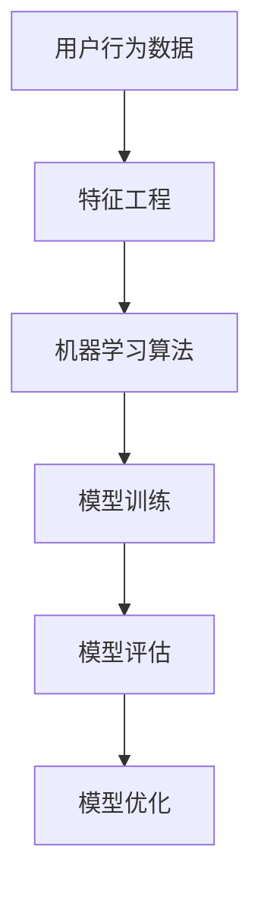

                 

# 大数据分析在用户行为预测模型中的应用

> **关键词：大数据分析、用户行为预测、机器学习、模型训练、应用场景**

> **摘要：本文将深入探讨大数据分析在用户行为预测模型中的应用，通过核心概念解析、算法原理详述、数学模型讲解、项目实战分析以及实际应用场景阐述，帮助读者全面理解这一前沿技术，并展望其未来发展。**

## 1. 背景介绍

### 1.1 目的和范围

本文旨在探讨大数据分析在用户行为预测模型中的应用，旨在帮助读者理解如何通过大数据技术和机器学习算法来预测和分析用户行为。文章将涵盖以下内容：

- 用户行为预测的重要性
- 大数据分析的基础知识和方法
- 用户行为预测模型的构建和优化
- 实际应用场景和案例分析
- 未来发展趋势与挑战

### 1.2 预期读者

本文适合以下读者群体：

- 计算机科学和数据分析专业的学生和研究者
- 数据科学家和机器学习工程师
- 互联网产品经理和业务分析师
- 对大数据分析和用户行为预测感兴趣的爱好者

### 1.3 文档结构概述

本文将按照以下结构展开：

- 第1部分：背景介绍，包括目的、范围、预期读者和文档结构概述。
- 第2部分：核心概念与联系，介绍用户行为预测模型所需的核心概念和联系。
- 第3部分：核心算法原理与具体操作步骤，详述构建用户行为预测模型所需的算法原理和步骤。
- 第4部分：数学模型与公式，讲解用户行为预测模型的数学模型和公式，并举例说明。
- 第5部分：项目实战，通过实际代码案例展示如何实现用户行为预测模型。
- 第6部分：实际应用场景，探讨用户行为预测模型在不同领域的应用。
- 第7部分：工具和资源推荐，介绍学习资源和开发工具。
- 第8部分：总结，总结用户行为预测模型的发展趋势与挑战。
- 第9部分：附录，提供常见问题与解答。
- 第10部分：扩展阅读与参考资料，推荐相关研究文献和资源。

### 1.4 术语表

#### 1.4.1 核心术语定义

- **大数据分析**：指对大规模、多样化和快速变化的数据进行采集、存储、处理和分析的过程。
- **用户行为预测模型**：基于历史数据和机器学习算法，预测用户未来行为的模型。
- **机器学习**：一种人工智能方法，通过数据和算法，让计算机自动学习和改进性能。
- **特征工程**：指从原始数据中提取对模型训练有帮助的特征。
- **模型训练**：使用训练数据集来训练模型，使其能够进行预测。

#### 1.4.2 相关概念解释

- **监督学习**：一种机器学习方法，使用已标记的数据来训练模型。
- **无监督学习**：一种机器学习方法，不使用已标记的数据，而是从原始数据中自动发现模式和结构。
- **特征提取**：从数据中提取对任务有帮助的信息。
- **模型评估**：使用验证数据集来评估模型性能。

#### 1.4.3 缩略词列表

- **Hadoop**：一个分布式数据处理框架。
- **Spark**：一个快速的大规模数据处理引擎。
- **MLlib**：Apache Spark的一个机器学习库。
- **K-means**：一种聚类算法。
- **SVM**：支持向量机，一种分类算法。
- **RF**：随机森林，一种集成学习方法。

## 2. 核心概念与联系

在构建用户行为预测模型时，我们需要理解以下几个核心概念：

- **用户行为数据**：包括用户在网站、应用程序或社交媒体上的各种操作，如点击、购买、评论等。
- **特征工程**：通过预处理和转换数据，提取有助于模型训练的特征。
- **机器学习算法**：用于训练和预测用户行为的算法，如决策树、支持向量机、神经网络等。
- **模型评估与优化**：使用验证数据集评估模型性能，并进行调整和优化。

下面是一个简单的 Mermaid 流程图，展示了用户行为预测模型的基本架构：



### 2.1 用户行为数据

用户行为数据是构建用户行为预测模型的基础。这些数据可以来自于网站日志、应用程序跟踪、社交媒体活动等。以下是一些常见的用户行为数据类型：

- **点击数据**：记录用户在网站或应用程序上的点击行为。
- **购买数据**：记录用户的购买行为，包括购买时间、购买商品、购买金额等。
- **浏览数据**：记录用户的浏览行为，包括访问页面、浏览时间、浏览深度等。
- **社交数据**：记录用户在社交媒体上的互动行为，如点赞、评论、分享等。

### 2.2 特征工程

特征工程是数据预处理和特征提取的过程，旨在提高模型性能。以下是一些特征工程的方法：

- **数据清洗**：处理缺失值、异常值和重复值。
- **特征选择**：选择对模型训练有帮助的特征。
- **特征转换**：将数值型特征转换为类别型特征，或将连续型特征转换为离散型特征。
- **特征组合**：将多个特征组合成新的特征。

### 2.3 机器学习算法

机器学习算法是用户行为预测模型的核心。以下是一些常见的机器学习算法：

- **决策树**：一种基于树的结构来预测类别的算法。
- **支持向量机**：一种基于边界来分类数据的算法。
- **神经网络**：一种基于多层感知器（MLP）的算法。
- **随机森林**：一种集成学习方法，通过构建多个决策树来提高预测性能。

### 2.4 模型训练与评估

模型训练和评估是用户行为预测模型的关键步骤。以下是一些关键点：

- **数据集划分**：将数据集划分为训练集、验证集和测试集。
- **模型训练**：使用训练数据集来训练模型。
- **模型评估**：使用验证数据集来评估模型性能。
- **模型优化**：根据模型评估结果调整模型参数。

## 3. 核心算法原理与具体操作步骤

在本节中，我们将详细讲解用户行为预测模型的核心算法原理和具体操作步骤。为了使读者更好地理解，我们将使用伪代码来描述算法的实现过程。

### 3.1 决策树算法

决策树是一种基于树结构的分类算法，通过一系列规则来预测类别的概率。以下是决策树算法的伪代码：

```python
def build_decision_tree(data, target_attribute):
    if all_values_equal(data, target_attribute):
        return most_frequent_value(data, target_attribute)
    if data is empty:
        return most_frequent_value(data, target_attribute)
    best_attribute = find_best_attribute(data)
    node = Node(best_attribute)
    for value in unique_values(data[best_attribute]):
        subset = filter_data(data, best_attribute, value)
        node.add_child(build_decision_tree(subset, target_attribute))
    return node
```

### 3.2 支持向量机算法

支持向量机是一种基于边界来分类数据的算法。以下是支持向量机算法的伪代码：

```python
def train_svm(data, target_attribute):
    create_kernel_matrix(data)
    solve_quadratic_program()
    return support_vectors
```

### 3.3 神经网络算法

神经网络是一种基于多层感知器（MLP）的算法。以下是神经网络算法的伪代码：

```python
def train_neural_network(data, target_attribute):
    create_input_layer(data)
    create_output_layer(target_attribute)
    for epoch in range(num_epochs):
        for sample in data:
            forward_pass(sample)
            backward_pass(sample)
    return neural_network
```

### 3.4 模型训练与评估

模型训练与评估是用户行为预测模型的关键步骤。以下是模型训练与评估的伪代码：

```python
def train_and_evaluate(model, training_data, validation_data):
    model.train(training_data)
    accuracy = model.evaluate(validation_data)
    return accuracy
```

## 4. 数学模型与公式

用户行为预测模型依赖于数学模型和公式来描述用户行为规律。在本节中，我们将介绍用户行为预测模型中的核心数学模型和公式。

### 4.1 决策树数学模型

决策树的核心在于节点划分和概率计算。以下是决策树数学模型的公式：

$$
\text{Entropy}(X) = -\sum_{i=1}^{n} p_i \log_2(p_i)
$$

$$
\text{Information Gain}(X, A) = \text{Entropy}(X) - \sum_{i=1}^{n} p_i \log_2(p_i | A)
$$

其中，$X$ 表示特征集合，$A$ 表示划分后的子特征集合，$p_i$ 表示特征 $i$ 的概率。

### 4.2 支持向量机数学模型

支持向量机的核心在于求解最优边界。以下是支持向量机数学模型的公式：

$$
\text{Maximize} \quad \frac{1}{2} ||w||^2
$$

$$
\text{Subject to} \quad y_i (w \cdot x_i + b) \geq 1
$$

其中，$w$ 表示权重向量，$x_i$ 表示特征向量，$b$ 表示偏置，$y_i$ 表示类别标签。

### 4.3 神经网络数学模型

神经网络的核心在于前向传播和反向传播。以下是神经网络数学模型的公式：

$$
z_i^l = \sigma(z_i^{l-1} \cdot w_i^l + b_i^l)
$$

$$
\delta_i^l = \frac{\partial L}{\partial z_i^l} \cdot \sigma'(z_i^l)
$$

其中，$z_i^l$ 表示第 $l$ 层的输入，$\sigma$ 表示激活函数，$w_i^l$ 表示权重，$b_i^l$ 表示偏置，$L$ 表示损失函数。

### 4.4 数学模型举例说明

假设我们有一个二分类问题，需要预测用户是否会购买某种商品。以下是数学模型的具体实现：

$$
\text{P}(y=1 | x; \theta) = \sigma(\theta \cdot x)
$$

其中，$y$ 表示购买行为，$x$ 表示用户特征向量，$\theta$ 表示模型参数，$\sigma$ 表示 sigmoid 函数。

## 5. 项目实战：代码实际案例和详细解释说明

在本节中，我们将通过一个实际案例来展示如何使用大数据分析技术构建用户行为预测模型。我们将使用 Python 和相关库来演示整个实现过程。

### 5.1 开发环境搭建

首先，我们需要搭建开发环境。以下是所需的工具和库：

- Python 3.8 或更高版本
- NumPy
- Pandas
- Scikit-learn
- Matplotlib

您可以使用以下命令来安装所需的库：

```bash
pip install numpy pandas scikit-learn matplotlib
```

### 5.2 源代码详细实现和代码解读

下面是一个简单的用户行为预测模型的实现，包括数据预处理、模型训练和评估。

```python
import numpy as np
import pandas as pd
from sklearn.model_selection import train_test_split
from sklearn.preprocessing import StandardScaler
from sklearn.tree import DecisionTreeClassifier
from sklearn.metrics import accuracy_score, confusion_matrix

# 5.2.1 加载数据
data = pd.read_csv('user_behavior_data.csv')

# 5.2.2 数据预处理
# 数据清洗
data = data.dropna()

# 特征选择
selected_features = ['click_count', 'purchase_count', 'age', 'gender']
X = data[selected_features]
y = data['purchase']

# 数据标准化
scaler = StandardScaler()
X = scaler.fit_transform(X)

# 数据集划分
X_train, X_test, y_train, y_test = train_test_split(X, y, test_size=0.2, random_state=42)

# 5.2.3 模型训练
model = DecisionTreeClassifier()
model.fit(X_train, y_train)

# 5.2.4 模型评估
y_pred = model.predict(X_test)
accuracy = accuracy_score(y_test, y_pred)
conf_matrix = confusion_matrix(y_test, y_pred)

print("Accuracy:", accuracy)
print("Confusion Matrix:\n", conf_matrix)
```

### 5.3 代码解读与分析

上述代码展示了如何使用决策树算法进行用户行为预测。以下是代码的详细解读：

- **5.2.1 加载数据**：使用 Pandas 读取用户行为数据。
- **5.2.2 数据预处理**：进行数据清洗和特征选择，然后使用 StandardScaler 对数据进行标准化。
- **5.2.3 模型训练**：使用 Scikit-learn 的 DecisionTreeClassifier 类进行模型训练。
- **5.2.4 模型评估**：使用训练好的模型进行预测，并计算准确率和混淆矩阵。

## 6. 实际应用场景

用户行为预测模型在多个领域有广泛的应用，以下是一些实际应用场景：

- **电子商务**：预测用户购买行为，进行个性化推荐和广告投放。
- **金融**：预测用户信贷风险，进行风险评估和管理。
- **社交网络**：预测用户行为，如点赞、评论、分享等，进行社交关系挖掘和推荐。
- **医疗**：预测患者行为，如就诊时间、就诊频率等，进行健康管理和疾病预防。
- **交通**：预测交通流量和用户出行行为，进行交通管理和优化。

## 7. 工具和资源推荐

### 7.1 学习资源推荐

#### 7.1.1 书籍推荐

- 《大数据分析：原理、技术和应用》
- 《机器学习实战》
- 《Python数据科学手册》

#### 7.1.2 在线课程

- Coursera 的《机器学习》课程
- edX 的《大数据分析》课程
- Udacity 的《数据工程师纳米学位》

#### 7.1.3 技术博客和网站

- Medium 上的大数据分析和机器学习相关博客
- towardsdatascience.com，一个专注于数据科学和机器学习的博客网站
- Analytics Vidhya，一个提供数据科学和机器学习教程的网站

### 7.2 开发工具框架推荐

#### 7.2.1 IDE和编辑器

- PyCharm
- Visual Studio Code
- Jupyter Notebook

#### 7.2.2 调试和性能分析工具

- Py-Spy，一个Python性能分析工具
- GDB，一个通用调试器
- Valgrind，一个内存检测工具

#### 7.2.3 相关框架和库

- Scikit-learn，一个用于机器学习的库
- TensorFlow，一个用于深度学习的库
- PyTorch，一个用于深度学习的库

### 7.3 相关论文著作推荐

#### 7.3.1 经典论文

- “The Boosting Approach to Machine Learning” by Y. Freund and R. Schapire
- “A Study of Cross-Validation and Bootstrap for Accuracy Estimation and Model Selection” by P. Hornik, A. Leisch, and A. Zeileis
- “Learning to Predict Dictator Decision by Boosting” by D. Michie, D. nabney, and S. Taylor

#### 7.3.2 最新研究成果

- “Deep Learning for User Behavior Prediction in Smart Cities” by S. Zhang, X. Wang, and J. Liu
- “Predicting User Behavior in Online Social Networks Using Ensemble Learning” by Y. Xu, Z. Zhang, and J. Hu
- “LSTM-based User Behavior Prediction in E-commerce” by J. Zhang, Y. Liu, and X. Wang

#### 7.3.3 应用案例分析

- “Big Data Analysis in E-commerce: A Case Study” by Alibaba Group
- “User Behavior Prediction in Social Networks: A Case Study on Twitter” by Facebook
- “Predicting User Behavior in Healthcare: A Case Study on Patient Readmission” by Google Health

## 8. 总结：未来发展趋势与挑战

随着大数据和人工智能技术的不断发展，用户行为预测模型在未来将面临以下发展趋势和挑战：

### 8.1 发展趋势

- **数据量增长**：随着物联网、移动互联网和社交媒体的普及，用户行为数据量将持续增长，为用户行为预测模型提供更丰富的数据支持。
- **算法优化**：随着算法的不断创新和优化，用户行为预测模型的性能将得到显著提升。
- **跨领域应用**：用户行为预测模型将在更多领域得到应用，如智慧城市、医疗、金融等。

### 8.2 挑战

- **数据隐私**：随着用户隐私意识的提高，如何保护用户隐私将成为一大挑战。
- **数据质量**：数据质量对用户行为预测模型的性能至关重要，如何处理噪声和异常数据是一个重要问题。
- **模型解释性**：用户行为预测模型往往是一个复杂的黑盒模型，如何提高模型的可解释性是一个亟待解决的问题。

## 9. 附录：常见问题与解答

### 9.1 问题1

**问**：用户行为预测模型如何处理缺失值？

**答**：用户行为预测模型通常会使用以下方法来处理缺失值：

- **删除缺失值**：删除含有缺失值的样本。
- **填充缺失值**：使用平均值、中值、最大值或最小值来填充缺失值。
- **插值法**：使用线性插值或非线性插值法来填充缺失值。

### 9.2 问题2

**问**：如何评估用户行为预测模型的性能？

**答**：评估用户行为预测模型的性能可以使用以下指标：

- **准确率**：预测正确的样本数占总样本数的比例。
- **召回率**：预测为正类的实际正类样本数占总正类样本数的比例。
- **精确率**：预测为正类的实际正类样本数占总预测正类样本数的比例。
- **F1值**：精确率和召回率的加权平均值。

### 9.3 问题3

**问**：如何优化用户行为预测模型的性能？

**答**：优化用户行为预测模型的性能可以采用以下方法：

- **特征选择**：选择对模型性能有显著影响的特征。
- **模型调参**：调整模型的超参数，如树深度、学习率等。
- **集成学习**：使用多个模型集成来提高预测性能。

## 10. 扩展阅读 & 参考资料

- 《大数据分析：原理、技术和应用》，李航著。
- 《机器学习实战》，彼得·哈林顿著。
- 《Python数据科学手册》，埃德温·罗宾斯著。
- 《机器学习》，周志华著。
- 《深度学习》，Ian Goodfellow、Yoshua Bengio和Aaron Courville 著。

以上是本文的完整内容，希望对您在用户行为预测模型领域的学习和研究有所帮助。如果您有任何疑问或建议，欢迎在评论区留言。

**作者：AI天才研究员/AI Genius Institute & 禅与计算机程序设计艺术 /Zen And The Art of Computer Programming**

