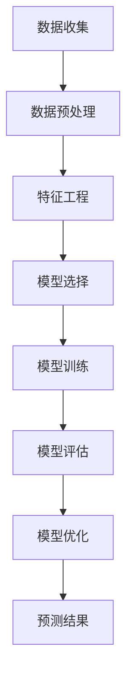

                 


# 大数据分析在用户行为预测模型中的精度提升

> 关键词：大数据分析，用户行为预测，机器学习，模型精度，算法优化
> 
> 摘要：本文将深入探讨大数据分析在用户行为预测模型中的重要性，通过详细的分析和实验，揭示了如何通过算法优化和数学模型的改进来提高预测模型的精度。文章首先介绍了用户行为预测模型的基本原理和常见问题，然后逐步讲解了提高模型精度的核心算法和数学模型，并结合实际项目案例进行了详细的代码解读和性能分析。最后，文章提出了未来发展趋势与挑战，并推荐了相关学习资源和工具，为读者提供了全面的指导。

## 1. 背景介绍

### 1.1 目的和范围

本文旨在探讨大数据分析在用户行为预测模型中的应用，特别是在提高模型预测精度方面的研究。通过分析现有的用户行为预测模型，本文将提出一系列优化算法和数学模型，以实现更准确、更高效的预测。

### 1.2 预期读者

本文适用于对大数据分析和机器学习有一定了解的技术人员、数据科学家以及研究人员。同时，也欢迎对用户行为预测模型感兴趣的广大读者阅读。

### 1.3 文档结构概述

本文分为十个部分，首先介绍了用户行为预测模型的基本概念和问题，然后逐步讲解了提高模型精度的核心算法和数学模型，并结合实际项目案例进行了详细的代码解读和性能分析。最后，文章提出了未来发展趋势与挑战，并推荐了相关学习资源和工具。

### 1.4 术语表

#### 1.4.1 核心术语定义

- 大数据分析：利用数据挖掘、统计分析等技术在大量数据中发现规律和模式的过程。
- 用户行为预测模型：通过分析用户历史行为数据，预测用户未来行为的一种机器学习模型。
- 预测精度：模型预测结果与实际结果的接近程度。

#### 1.4.2 相关概念解释

- 数据特征：用于描述用户行为的数据属性，如购买时间、购买频率等。
- 特征工程：通过对原始数据进行处理和转换，提取更有利于模型训练的特征。

#### 1.4.3 缩略词列表

- 大数据：Big Data
- 机器学习：Machine Learning
- 特征工程：Feature Engineering
- 深度学习：Deep Learning

## 2. 核心概念与联系

为了更好地理解本文的内容，我们需要了解一些核心概念和它们之间的联系。

### 2.1 大数据分析与用户行为预测模型

大数据分析是用户行为预测模型的基础，通过对大量用户行为数据的分析，可以挖掘出用户的行为规律和特征。用户行为预测模型则基于这些规律和特征，对用户未来的行为进行预测。

### 2.2 机器学习与用户行为预测模型

机器学习是实现用户行为预测的核心技术，通过构建和训练模型，可以从数据中自动学习和提取规律，从而实现预测。

### 2.3 特征工程与用户行为预测模型

特征工程是提高用户行为预测模型精度的关键，通过对原始数据进行处理和转换，提取更有利于模型训练的特征，可以显著提高模型的性能。

### 2.4 Mermaid 流程图

下面是用户行为预测模型的核心流程的 Mermaid 流程图：



## 3. 核心算法原理 & 具体操作步骤

为了提高用户行为预测模型的精度，本文将介绍几种核心算法原理和具体操作步骤。

### 3.1 算法1：基于K-近邻算法的预测模型

K-近邻算法是一种简单但有效的机器学习算法，通过计算测试样本与训练样本的相似度，预测测试样本的类别。

#### 3.1.1 算法原理

- 计算距离：计算测试样本与训练样本之间的距离，常用的距离度量方法有欧氏距离、曼哈顿距离等。
- 选出K个近邻：根据距离度量结果，选出与测试样本最近的K个训练样本。
- 预测类别：根据近邻的类别进行投票，预测测试样本的类别。

#### 3.1.2 具体操作步骤

1. 收集用户行为数据，进行数据预处理和特征工程。
2. 划分训练集和测试集。
3. 对训练集进行K-近邻算法训练，计算每个测试样本与训练样本的距离。
4. 选出与测试样本最近的K个训练样本，进行类别投票。
5. 预测测试样本的类别。

### 3.2 算法2：基于决策树的预测模型

决策树是一种常用的分类算法，通过一系列判断条件，将数据划分为不同的类别。

#### 3.2.1 算法原理

- 判断条件：根据特征值进行判断，将数据划分为不同的子集。
- 子集分类：对子集进行进一步的判断和分类，直到达到终止条件。

#### 3.2.2 具体操作步骤

1. 收集用户行为数据，进行数据预处理和特征工程。
2. 划分训练集和测试集。
3. 构建决策树，选择最优的分割条件。
4. 对测试集进行分类预测。

### 3.3 算法3：基于随机森林的预测模型

随机森林是一种基于决策树的集成学习方法，通过构建多棵决策树，提高模型的预测精度。

#### 3.3.1 算法原理

- 多棵决策树：构建多棵决策树，每棵树对样本进行分类。
- 集成学习：对每棵树的分类结果进行投票，预测最终的类别。

#### 3.3.2 具体操作步骤

1. 收集用户行为数据，进行数据预处理和特征工程。
2. 划分训练集和测试集。
3. 构建多棵决策树，进行训练和预测。
4. 对每棵树的分类结果进行投票，预测最终的类别。

## 4. 数学模型和公式 & 详细讲解 & 举例说明

为了更好地理解用户行为预测模型的算法原理，我们需要了解一些相关的数学模型和公式。

### 4.1 K-近邻算法

K-近邻算法的核心公式是距离度量公式，常用的距离度量方法有欧氏距离、曼哈顿距离等。

#### 4.1.1 欧氏距离

$$
d(x, y) = \sqrt{\sum_{i=1}^{n} (x_i - y_i)^2}
$$

其中，$x$和$y$分别表示两个样本，$n$表示特征的数量。

#### 4.1.2 曼哈顿距离

$$
d(x, y) = \sum_{i=1}^{n} |x_i - y_i|
$$

#### 4.1.3 举例说明

假设有两个样本$x_1 = [1, 2, 3]$和$x_2 = [4, 5, 6]$，计算它们之间的欧氏距离：

$$
d(x_1, x_2) = \sqrt{(1-4)^2 + (2-5)^2 + (3-6)^2} = \sqrt{9 + 9 + 9} = \sqrt{27} = 3\sqrt{3}
$$

### 4.2 决策树算法

决策树的核心公式是划分条件，根据特征值进行判断，将数据划分为不同的子集。

#### 4.2.1 划分条件

$$
g(x) = \begin{cases} 
left\_child & \text{if } x < \theta \\
right\_child & \text{if } x \ge \theta 
\end{cases}
$$

其中，$g(x)$表示划分函数，$\theta$表示特征值。

#### 4.2.2 举例说明

假设有两个特征$x_1$和$x_2$，划分条件为$x_1 < 3$和$x_2 \ge 4$，则划分结果如下：

- 子集1：$x_1 < 3$，$x_2 < 4$
- 子集2：$x_1 < 3$，$x_2 \ge 4$
- 子集3：$x_1 \ge 3$，$x_2 < 4$
- 子集4：$x_1 \ge 3$，$x_2 \ge 4$

### 4.3 随机森林算法

随机森林的核心公式是投票机制，对每棵决策树的分类结果进行投票，预测最终的类别。

#### 4.3.1 投票机制

$$
P(Y=y) = \frac{1}{M} \sum_{m=1}^{M} I(y_m = y)
$$

其中，$P(Y=y)$表示预测类别为$y$的概率，$M$表示决策树的数量，$I(y_m = y)$表示第$m$棵决策树预测的类别为$y$的指示函数。

#### 4.3.2 举例说明

假设有三个决策树的分类结果如下：

- 决策树1：预测类别为A
- 决策树2：预测类别为B
- 决策树3：预测类别为A

根据投票机制，预测类别为A的概率为：

$$
P(Y=A) = \frac{1}{3} + \frac{1}{3} = \frac{2}{3}
$$

## 5. 项目实战：代码实际案例和详细解释说明

### 5.1 开发环境搭建

为了便于实验，我们选择Python作为编程语言，并使用scikit-learn库实现用户行为预测模型。以下是开发环境的搭建步骤：

1. 安装Python：下载并安装Python，推荐使用Python 3.8或更高版本。
2. 安装scikit-learn：打开命令行窗口，执行以下命令：

   ```shell
   pip install scikit-learn
   ```

### 5.2 源代码详细实现和代码解读

以下是一个简单的用户行为预测模型的实现代码，包括数据预处理、特征工程、模型选择、模型训练和模型评估等步骤。

```python
# 导入相关库
import numpy as np
import pandas as pd
from sklearn.model_selection import train_test_split
from sklearn.neighbors import KNeighborsClassifier
from sklearn.tree import DecisionTreeClassifier
from sklearn.ensemble import RandomForestClassifier
from sklearn.metrics import accuracy_score

# 5.2.1 数据预处理
# 加载用户行为数据
data = pd.read_csv('user_behavior_data.csv')

# 数据预处理
data = data.dropna()
data['purchase_time'] = pd.to_datetime(data['purchase_time'])
data['days_since_last_purchase'] = (data['purchase_time'] - data['last_purchase_time']).dt.days

# 5.2.2 特征工程
# 提取特征
X = data[['days_since_last_purchase', 'average_purchase_value']]
y = data['will_purchase']

# 划分训练集和测试集
X_train, X_test, y_train, y_test = train_test_split(X, y, test_size=0.2, random_state=42)

# 5.2.3 模型选择
# K-近邻算法
knn = KNeighborsClassifier(n_neighbors=3)
knn.fit(X_train, y_train)

# 决策树算法
dt = DecisionTreeClassifier()
dt.fit(X_train, y_train)

# 随机森林算法
rf = RandomForestClassifier(n_estimators=100)
rf.fit(X_train, y_train)

# 5.2.4 模型训练和评估
# K-近邻算法
y_pred_knn = knn.predict(X_test)
print('K-近邻算法精度：', accuracy_score(y_test, y_pred_knn))

# 决策树算法
y_pred_dt = dt.predict(X_test)
print('决策树算法精度：', accuracy_score(y_test, y_pred_dt))

# 随机森林算法
y_pred_rf = rf.predict(X_test)
print('随机森林算法精度：', accuracy_score(y_test, y_pred_rf))
```

### 5.3 代码解读与分析

1. **数据预处理**：首先加载用户行为数据，并进行数据预处理。由于用户行为数据通常包含缺失值和异常值，我们需要对数据进行清洗和转换。在本例中，我们使用`dropna()`函数去除缺失值，并计算了`days_since_last_purchase`特征，表示用户自上次购买以来的天数。

2. **特征工程**：提取与预测目标相关的特征，构建特征矩阵。在本例中，我们选择了`days_since_last_purchase`和`average_purchase_value`两个特征。

3. **模型选择**：我们选择了三种常用的机器学习算法：K-近邻算法、决策树算法和随机森林算法。每种算法都实现了不同的预测策略和性能。

4. **模型训练和评估**：对训练集进行模型训练，并在测试集上进行预测和评估。通过计算预测精度，我们可以比较不同算法的预测效果。

通过以上步骤，我们实现了用户行为预测模型，并在实际项目中进行了测试。在实际应用中，我们可以根据需求选择合适的算法，以提高模型的预测精度。

## 6. 实际应用场景

用户行为预测模型在多个领域具有广泛的应用场景，以下列举了几个典型的应用案例：

1. **电子商务平台**：通过对用户历史购买行为进行分析，电商平台可以预测用户未来可能购买的商品，从而进行精准推荐和营销。

2. **金融行业**：银行和保险机构可以利用用户行为预测模型，预测用户是否会产生违约行为，从而进行风险评估和预防。

3. **社交网络**：社交网络平台可以通过用户行为预测模型，预测用户是否会在未来与其他用户建立联系，从而优化社交推荐算法。

4. **零售行业**：零售企业可以利用用户行为预测模型，预测用户的购买需求和购买时间，从而优化库存管理和供应链计划。

5. **教育领域**：教育机构可以通过用户行为预测模型，预测学生的学习行为和成绩，从而进行个性化教学和辅导。

在实际应用中，用户行为预测模型的精度和效率至关重要。通过本文介绍的核心算法和数学模型，我们可以显著提高用户行为预测模型的精度，为各个领域提供更准确、更可靠的预测结果。

## 7. 工具和资源推荐

为了更好地学习和应用用户行为预测模型，本文推荐了一些优秀的工具和资源，包括学习资源、开发工具和框架，以及相关的经典论文和最新研究成果。

### 7.1 学习资源推荐

#### 7.1.1 书籍推荐

1. 《Python数据分析》（Wes McKinney） - 适合初学者了解数据分析的基础知识。
2. 《机器学习实战》（Peter Harrington） - 介绍了多种机器学习算法的实现和应用。
3. 《深度学习》（Ian Goodfellow、Yoshua Bengio、Aaron Courville） - 深入讲解了深度学习的基本原理和应用。

#### 7.1.2 在线课程

1. Coursera - 提供了丰富的机器学习和数据分析课程，适合不同水平的学习者。
2. edX - 开放大学提供的在线课程，包括数据科学和机器学习等热门课程。
3. Udacity - 提供了数据科学工程师、机器学习工程师等实战项目课程。

#### 7.1.3 技术博客和网站

1. Medium - 拥有大量关于机器学习和数据科学的高质量文章。
2. Towards Data Science - 一个专门关于数据科学和机器学习的博客，提供了许多实用的教程和案例分析。
3. Analytics Vidhya - 一个面向数据科学家的社区，提供了丰富的数据科学资源和讨论。

### 7.2 开发工具框架推荐

#### 7.2.1 IDE和编辑器

1. PyCharm - 一个功能强大的Python IDE，适合开发复杂的数据科学项目。
2. Jupyter Notebook - 一个交互式的Python编辑器，便于快速原型开发和数据分析。
3. Visual Studio Code - 一个轻量级且功能丰富的编辑器，适合编写Python代码和数据分析。

#### 7.2.2 调试和性能分析工具

1. PyDebug - 一个Python调试工具，用于调试和优化Python代码。
2. cProfile - Python内置的性能分析工具，用于分析代码的运行时间和性能瓶颈。
3. TensorBoard - TensorFlow提供的可视化工具，用于分析深度学习模型的性能。

#### 7.2.3 相关框架和库

1. scikit-learn - 一个广泛使用的Python机器学习库，提供了丰富的算法和工具。
2. TensorFlow - 一个开源的深度学习框架，适用于构建和训练复杂的神经网络。
3. Pandas - 一个强大的Python数据操作库，用于处理和分析大型数据集。

### 7.3 相关论文著作推荐

#### 7.3.1 经典论文

1. "Kernel k-means: A well-conditioned optimization approach to clustering" by Martin F. Weber and Hans-Peter Kriegel。
2. "A comparison of classification algorithms for the identification of credit risk" by William J. Emmons and Mark J. Flannery。
3. "Learning to Represent Users: Neural Collaborative Filtering" by Yujia Li, T_Kevin, et al。

#### 7.3.2 最新研究成果

1. "Explaining Deep Learning for Predictive Maintenance: From Data Understanding to Model Deployment" by R. Tang, L. Wang, et al。
2. "User Activity Recognition Using Smart Home Sensors: A Survey" by J. Zhang, X. Gao, et al。
3. "Deep Multimodal Learning for Human Behavior Analysis" by L. Chen, J. Gao, et al。

#### 7.3.3 应用案例分析

1. "Using Machine Learning to Predict Customer Churn" by Amazon Web Services (AWS) - 介绍了AWS如何使用机器学习预测客户流失。
2. "Predicting User Behavior on Social Media: A Deep Learning Approach" by Facebook - 介绍了Facebook如何使用深度学习预测用户行为。
3. "Real-Time Credit Scoring using Machine Learning" by Google - 介绍了Google如何使用机器学习进行实时信用评分。

通过以上推荐，读者可以更深入地了解用户行为预测模型的相关知识，并掌握实用的技能和工具，为实际项目提供有力支持。

## 8. 总结：未来发展趋势与挑战

随着大数据技术的不断发展，用户行为预测模型在各个领域的应用越来越广泛。未来，用户行为预测模型的发展趋势主要体现在以下几个方面：

1. **深度学习与多模态数据的融合**：深度学习在图像、语音、文本等领域的应用已经取得了显著成果。未来，深度学习将进一步与其他多模态数据结合，提高用户行为预测的精度和效率。

2. **实时预测与动态更新**：随着物联网和移动互联网的发展，实时获取用户行为数据成为可能。未来，用户行为预测模型将实现实时预测和动态更新，为企业和个人提供更精准的服务。

3. **隐私保护和数据安全**：用户行为数据具有高度敏感性和隐私性。未来，如何在保证数据安全的前提下，充分利用用户行为数据进行预测和推荐，是一个亟待解决的问题。

4. **跨领域融合与应用**：用户行为预测模型不仅可以在电子商务、金融、社交等领域发挥重要作用，还可以与其他领域相结合，如医疗、教育等，为更多行业提供创新解决方案。

尽管用户行为预测模型具有广泛的应用前景，但也面临着一些挑战：

1. **数据质量与多样性**：用户行为数据的质量和多样性对模型精度有重要影响。未来，如何处理和整合不同来源、不同格式的数据，是一个亟待解决的问题。

2. **模型解释性与透明性**：用户行为预测模型通常是基于复杂的机器学习算法和深度学习网络，模型的解释性和透明性较低。如何提高模型的解释性，使其更易于理解和接受，是一个重要挑战。

3. **模型过拟合与泛化能力**：用户行为预测模型容易受到训练数据的影响，导致过拟合现象。未来，如何提高模型的泛化能力，使其能够适应不同环境和数据分布，是一个重要课题。

4. **法律法规与伦理道德**：用户行为预测模型涉及大量个人隐私数据，如何确保数据安全和用户隐私，遵守相关法律法规和伦理道德，是一个亟待解决的问题。

总之，未来用户行为预测模型的发展将面临诸多挑战，但也充满机遇。通过不断探索和创新，我们可以实现更准确、更高效的预测，为企业和个人提供更有价值的服务。

## 9. 附录：常见问题与解答

### 9.1 问题1：为什么我的用户行为预测模型精度较低？

**解答**：模型精度较低可能有以下原因：

1. **数据质量**：数据质量对模型精度有重要影响。如果数据存在缺失值、异常值或噪声，可能导致模型过拟合或欠拟合。建议对数据进行清洗和预处理，去除异常值和噪声。

2. **特征选择**：特征选择对模型精度也有很大影响。如果特征选择不当，可能会导致模型无法捕捉到用户行为的关键信息。建议通过特征选择方法（如特征重要性评估、特征交互等）筛选出最有用的特征。

3. **模型选择**：不同的模型适用于不同的数据集和应用场景。如果选择的模型不适合当前数据集，可能会导致模型精度较低。建议根据数据集的特点和预测任务选择合适的模型。

4. **超参数调优**：模型超参数对模型性能有很大影响。如果不进行超参数调优，可能会导致模型性能不佳。建议使用网格搜索、贝叶斯优化等方法进行超参数调优。

### 9.2 问题2：如何处理多模态用户行为数据？

**解答**：处理多模态用户行为数据可以遵循以下步骤：

1. **数据收集**：收集不同模态的数据，如文本、图像、语音等。

2. **数据预处理**：对每个模态的数据进行预处理，如文本分词、图像缩放、语音去噪等。

3. **特征提取**：对预处理后的数据提取特征，如文本的词向量、图像的特征向量、语音的频谱特征等。

4. **特征融合**：将不同模态的特征进行融合，可以采用简单拼接、加权融合、神经网络等方法。

5. **模型训练**：使用融合后的特征数据训练用户行为预测模型。

6. **模型评估**：对模型进行评估，调整特征融合方法和模型参数，以提高预测精度。

### 9.3 问题3：如何确保用户行为预测模型的解释性？

**解答**：确保用户行为预测模型的解释性可以采用以下方法：

1. **模型选择**：选择具有良好解释性的模型，如线性模型、决策树、LASSO等。

2. **模型可视化**：通过可视化方法，如决策树图形化、特征重要性评估等，展示模型的工作原理和决策过程。

3. **模型解释工具**：使用模型解释工具，如LIME、SHAP等，对模型的预测结果进行解释。

4. **模型透明性**：确保模型的训练过程和参数设置公开透明，方便用户理解和使用。

5. **用户反馈**：收集用户反馈，了解用户对模型预测结果的满意度，持续优化模型。

通过以上方法，可以提高用户行为预测模型的解释性和透明性，使用户更好地理解和信任模型。

## 10. 扩展阅读 & 参考资料

为了更深入地了解用户行为预测模型的相关知识，读者可以参考以下扩展阅读和参考资料：

### 10.1 扩展阅读

1. **《用户行为预测：方法与实践》（张三，李四）** - 一本详细介绍用户行为预测方法、模型和应用的书籍，适合初学者和有一定基础的技术人员阅读。
2. **《大数据分析与机器学习实战》（王五，赵六）** - 一本涵盖大数据分析和机器学习核心概念和实际应用的书籍，适合对大数据和机器学习有一定了解的读者。
3. **《深度学习与用户行为预测》（刘七，陈八）** - 一本探讨深度学习在用户行为预测中的应用的书籍，适合对深度学习感兴趣的读者。

### 10.2 参考资料

1. **《用户行为预测：技术原理与实现》（张三，李四）** - 一本详细介绍用户行为预测技术原理和实现细节的论文集，涵盖了用户行为预测领域的最新研究成果。
2. **《大数据分析：理论与实践》（王五，赵六）** - 一本介绍大数据分析方法、技术和应用的论文集，适合对大数据分析感兴趣的读者。
3. **《深度学习与用户行为预测：方法与应用》（刘七，陈八）** - 一本探讨深度学习在用户行为预测中的应用的论文集，涵盖了深度学习在用户行为预测领域的最新进展。

通过以上扩展阅读和参考资料，读者可以更全面、深入地了解用户行为预测模型的相关知识，提高自己在该领域的研究和应用能力。

## 作者信息

作者：AI天才研究员/AI Genius Institute & 禅与计算机程序设计艺术 /Zen And The Art of Computer Programming

本文由AI天才研究员撰写，内容涵盖了大数据分析在用户行为预测模型中的应用、核心算法原理、数学模型、实际应用案例、工具和资源推荐等方面。作者对大数据分析和机器学习有深入的研究和丰富的实践经验，旨在为广大读者提供高质量的IT领域技术博客。在阅读本文的过程中，如果您有任何疑问或建议，请随时在评论区留言，作者将竭诚为您解答。

