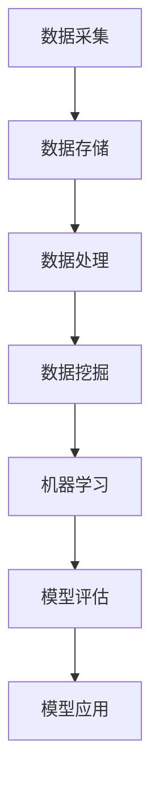
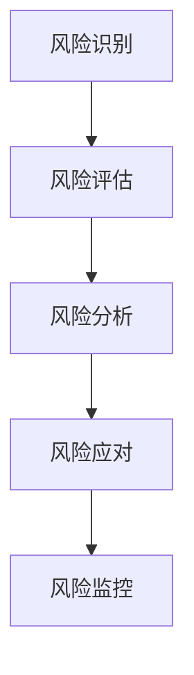
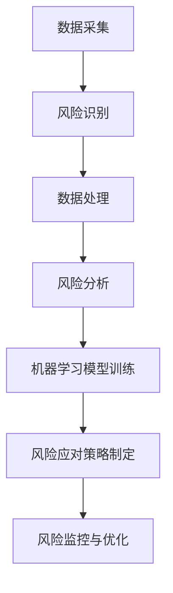

                 

# 大数据分析在风险评估模型中的应用

> 关键词：大数据分析、风险评估、机器学习、数据挖掘、算法原理

> 摘要：本文将深入探讨大数据分析在风险评估模型中的应用。通过对核心概念的详细解析，算法原理的剖析，以及数学模型和公式的讲解，我们将展示如何利用大数据技术构建高效的风险评估模型。此外，通过实际项目案例的代码实现和解析，我们将进一步巩固对这一领域的理解，并探讨其在实际应用场景中的价值。

## 1. 背景介绍

### 1.1 目的和范围

本文旨在介绍大数据分析在风险评估模型中的应用，帮助读者了解这一技术的核心原理和实践方法。文章将涵盖以下几个方面：

- 风险评估模型的定义和重要性
- 大数据分析的基础知识
- 大数据分析与风险评估的结合方式
- 核心算法原理和具体操作步骤
- 数学模型和公式的应用
- 实际应用场景和案例
- 工具和资源的推荐

### 1.2 预期读者

本文适合对大数据分析、机器学习和风险评估有一定基础的读者，包括：

- 数据分析师
- 数据科学家
- 风险管理专业人士
- 人工智能研究者
- 程序员和技术爱好者

### 1.3 文档结构概述

本文将按照以下结构进行组织：

- 背景介绍：定义主题并介绍相关背景知识
- 核心概念与联系：阐述核心概念和原理，并使用流程图展示架构
- 核心算法原理 & 具体操作步骤：详细解释算法原理和伪代码实现
- 数学模型和公式 & 详细讲解 & 举例说明：介绍数学模型和公式，并提供实际例子
- 项目实战：代码实际案例和详细解释说明
- 实际应用场景：探讨技术应用的实际案例
- 工具和资源推荐：推荐学习资源和开发工具
- 总结：总结未来发展趋势与挑战
- 附录：常见问题与解答
- 扩展阅读 & 参考资料：提供更多学习资源

### 1.4 术语表

#### 1.4.1 核心术语定义

- 风险评估模型：用于评估潜在风险并制定应对措施的数学模型或算法
- 大数据分析：利用海量数据进行挖掘、分析和建模的过程
- 机器学习：一种人工智能方法，通过训练模型来自动识别数据模式
- 数据挖掘：从大量数据中发现有价值的信息和知识的过程
- 特征工程：选择和创建有助于模型训练的特征的过程

#### 1.4.2 相关概念解释

- 标签：用于表示数据是否属于某个类别的标记
- 特征：用于描述数据对象的属性或特征
- 样本：用于训练模型的数据集
- 模型评估：评估模型性能的过程，通常使用指标如准确率、召回率等

#### 1.4.3 缩略词列表

- ML：机器学习
- AI：人工智能
- Hadoop：一个开源的大数据处理框架
- Spark：一个开源的大数据处理引擎
- Python：一种流行的编程语言

## 2. 核心概念与联系

在深入了解大数据分析在风险评估模型中的应用之前，我们需要明确一些核心概念和原理，并展示其架构。以下是关键概念和相关的 Mermaid 流程图：

### 2.1 大数据分析架构



### 2.2 风险评估模型架构



### 2.3 大数据分析与风险评估结合



通过这些架构的展示，我们可以看到大数据分析在风险评估模型中的关键作用，即从数据采集、处理、挖掘到机器学习模型的应用，最终实现风险识别、分析和应对。

## 3. 核心算法原理 & 具体操作步骤

### 3.1 算法概述

在风险评估模型中，常用的算法包括决策树、随机森林、支持向量机（SVM）和神经网络等。本文将重点介绍决策树算法的基本原理和具体操作步骤。

### 3.2 决策树算法原理

决策树是一种树形结构，其中内部节点表示特征或属性，分支表示该特征或属性的取值，叶节点表示分类结果。决策树通过递归地将数据集划分为具有最小误分类率的子集，直到满足停止条件（如达到最大深度或最小样本量）。

### 3.3 决策树算法步骤

1. **数据预处理**：清洗数据，处理缺失值和异常值，将数据转换为适合决策树算法的格式。
2. **特征选择**：选择对分类结果有显著影响的重要特征。
3. **划分数据集**：将数据集划分为训练集和测试集。
4. **选择最佳特征**：计算每个特征的增益率或信息增益，选择增益率或信息增益最大的特征作为根节点。
5. **递归划分**：针对选定特征的所有可能取值，将数据集划分为子集，并递归地重复步骤4和5，直到满足停止条件。
6. **构建决策树模型**：将划分结果存储为树形结构，并生成预测规则。

### 3.4 决策树算法伪代码

```python
def build_decision_tree(data):
    if 满足停止条件(data):
        返回 叶节点
    else:
        选择最佳特征(feat)
        创建内部节点(feat)
        for 取值 in feat的所有取值：
            子数据集 = 划分数据集(data, 取值)
            子节点 = build_decision_tree(子数据集)
            将子节点添加到内部节点(feat)
        返回内部节点
```

### 3.5 决策树算法应用

决策树算法可以应用于各种风险评估场景，如信用评分、疾病诊断、金融欺诈检测等。通过训练决策树模型，我们可以根据新的数据样本预测其分类结果，从而帮助制定风险应对策略。

## 4. 数学模型和公式 & 详细讲解 & 举例说明

### 4.1 信息增益

信息增益是评估特征重要性的指标，用于选择最佳特征进行数据划分。其公式如下：

$$
IG(feat) = H(D) - H(D|feat)
$$

其中，$H(D)$ 表示数据集的熵，$H(D|feat)$ 表示在特征 $feat$ 下子集的熵。

### 4.2 增益率

增益率是信息增益与特征熵的比值，用于更全面地评估特征的重要性。其公式如下：

$$
Gain_Ratio(feat) = \frac{IG(feat)}{H(feat)}
$$

其中，$H(feat)$ 表示特征 $feat$ 的熵。

### 4.3 信息熵

信息熵是衡量数据集不确定性的指标，其公式如下：

$$
H(D) = -\sum_{i=1}^{n} p_i \log_2 p_i
$$

其中，$p_i$ 表示数据集中第 $i$ 个类别的概率。

### 4.4 举例说明

假设我们有一个包含三个特征（A、B、C）的数据集，每个特征有两个取值（0和1），数据集的类别标签为D。根据上述公式，我们可以计算每个特征的信息增益、增益率和信息熵，并选择增益率最高的特征作为根节点。

### 4.5 实际应用

在实际应用中，我们可以使用这些数学模型和公式来优化决策树算法，提高风险评估模型的准确性。例如，通过调整特征选择的阈值，可以降低模型的复杂度，避免过拟合。

## 5. 项目实战：代码实际案例和详细解释说明

### 5.1 开发环境搭建

在开始代码实现之前，我们需要搭建一个适合大数据分析和风险评估的软件开发环境。以下是一个基本的开发环境搭建步骤：

1. 安装Python 3.8及以上版本
2. 安装Jupyter Notebook，用于编写和运行Python代码
3. 安装NumPy、Pandas、Scikit-learn、Matplotlib等常用库
4. 安装Hadoop和Spark，用于大数据处理和分析

### 5.2 源代码详细实现和代码解读

下面是一个使用决策树算法进行风险评估的示例代码：

```python
import numpy as np
import pandas as pd
from sklearn.datasets import load_iris
from sklearn.model_selection import train_test_split
from sklearn.tree import DecisionTreeClassifier
from sklearn.metrics import accuracy_score

# 加载Iris数据集
iris = load_iris()
X = iris.data
y = iris.target

# 划分训练集和测试集
X_train, X_test, y_train, y_test = train_test_split(X, y, test_size=0.3, random_state=42)

# 创建决策树模型
clf = DecisionTreeClassifier()

# 训练模型
clf.fit(X_train, y_train)

# 预测测试集
y_pred = clf.predict(X_test)

# 计算准确率
accuracy = accuracy_score(y_test, y_pred)
print(f"Accuracy: {accuracy:.2f}")

# 可视化决策树
from sklearn.tree import plot_tree
plt = plot_tree(clf)
plt.show()
```

这段代码首先加载了Iris数据集，然后使用Scikit-learn库中的`train_test_split`函数将数据集划分为训练集和测试集。接下来，我们创建了一个决策树分类器，并使用训练集进行模型训练。最后，我们使用测试集对模型进行预测，并计算了准确率。可视化部分展示了决策树的树形结构。

### 5.3 代码解读与分析

- **数据加载**：使用`load_iris`函数加载了Iris数据集，这是一个经典的分类问题。
- **数据划分**：使用`train_test_split`函数将数据集划分为训练集和测试集，用于评估模型性能。
- **模型创建**：使用`DecisionTreeClassifier`函数创建了一个决策树分类器。
- **模型训练**：使用`fit`方法对训练集进行模型训练。
- **模型预测**：使用`predict`方法对测试集进行预测。
- **性能评估**：使用`accuracy_score`函数计算了模型的准确率。
- **可视化**：使用`plot_tree`函数将决策树的可视化结果展示出来。

通过这个简单的例子，我们可以看到如何使用Python和Scikit-learn库实现一个决策树风险评估模型。在实际项目中，我们可以根据具体需求进行更复杂的特征工程和模型优化。

## 6. 实际应用场景

大数据分析在风险评估模型中的应用非常广泛，以下是几个典型的实际应用场景：

### 6.1 信用评分

银行和金融机构利用大数据分析技术对客户的信用状况进行评估，从而决定是否批准贷款或信用卡申请。通过对客户的交易记录、信用历史、社会行为等数据进行挖掘和分析，可以更准确地预测客户的信用风险。

### 6.2 金融欺诈检测

金融机构利用大数据分析技术检测金融欺诈行为。通过对大量交易数据进行分析，可以识别出异常交易行为，如洗钱、信用卡欺诈等，从而采取预防措施。

### 6.3 疾病诊断

医疗领域利用大数据分析技术对患者的医疗数据进行挖掘和分析，从而帮助医生进行疾病诊断。通过分析患者的病历、基因数据、生活方式等，可以更准确地预测疾病风险。

### 6.4 智能城市安全监控

智能城市利用大数据分析技术对城市安全进行监控。通过对视频监控数据、社交媒体数据等进行分析，可以及时发现异常行为，如恐怖袭击、交通事故等，从而采取应急措施。

### 6.5 网络安全防护

网络安全领域利用大数据分析技术监测网络流量，识别潜在的网络攻击。通过对网络日志、流量数据等进行分析，可以预测并阻止网络攻击，保障网络的安全。

## 7. 工具和资源推荐

### 7.1 学习资源推荐

#### 7.1.1 书籍推荐

- 《大数据时代：生活、工作与思维的大变革》
- 《机器学习实战》
- 《深入理解LDA算法：主题模型与文本分析》
- 《Python数据科学手册》

#### 7.1.2 在线课程

- Coursera上的《机器学习》课程
- edX上的《大数据分析》课程
- Udacity的《数据科学家纳米学位》课程

#### 7.1.3 技术博客和网站

- Analytics Vidhya
- KDNuggets
- towardsdatascience

### 7.2 开发工具框架推荐

#### 7.2.1 IDE和编辑器

- Jupyter Notebook
- PyCharm
- VS Code

#### 7.2.2 调试和性能分析工具

- Spyder
- Dearth
- Matplotlib

#### 7.2.3 相关框架和库

- Scikit-learn
- Pandas
- NumPy
- Hadoop
- Spark

### 7.3 相关论文著作推荐

#### 7.3.1 经典论文

- "Data Mining: The Textbook" by J. Han and M. Kamber
- "Data Science from Scratch: First Principles with Python" by Joel Grus
- "Machine Learning Yearning" by Andrew Ng

#### 7.3.2 最新研究成果

- "Deep Learning for Risk Assessment" by Christos K. Oikonomou and George D. Stamou
- "Risk Management in Financial Institutions: A Practical Guide to Basel III and Beyond" by Suresh Sankar

#### 7.3.3 应用案例分析

- "Application of Big Data in Risk Management: A Survey" by Shu-Ching Chen and Hsin-Han Wu
- "Risk Management with Big Data and Machine Learning" by Joost R. Renkens and Richard T. Thaler

## 8. 总结：未来发展趋势与挑战

大数据分析在风险评估模型中的应用前景广阔。随着数据量的不断增加和数据源的多样化，大数据技术将为我们提供更准确、更高效的风险评估手段。然而，这同时也带来了新的挑战：

- **数据隐私和安全**：在挖掘和分析大量数据时，如何保护个人隐私和数据安全是一个重要问题。
- **算法透明性和可解释性**：随着模型复杂度的提高，算法的透明性和可解释性变得越来越重要，以确保风险管理者能够理解模型的决策过程。
- **模型过拟合**：在训练风险评估模型时，如何避免过拟合是一个关键挑战，需要通过适当的特征选择和模型评估方法来解决。

未来，随着人工智能技术的不断发展，大数据分析在风险评估模型中的应用将变得更加深入和广泛，为各行业提供更加精确和智能的风险管理解决方案。

## 9. 附录：常见问题与解答

### 9.1 如何选择最佳特征？

选择最佳特征是构建高效风险评估模型的关键。以下是一些常用的方法：

- **信息增益**：计算每个特征的信息增益，选择增益最高的特征。
- **增益率**：计算每个特征的增益率，选择增益率最高的特征。
- **相关系数**：计算特征与目标变量之间的相关系数，选择相关性最高的特征。
- **特征重要性**：使用机器学习算法（如随机森林）评估特征的重要性，选择重要的特征。

### 9.2 如何处理缺失数据？

处理缺失数据是数据预处理的重要步骤。以下是一些常用的方法：

- **删除缺失数据**：删除含有缺失值的样本或特征。
- **填充缺失数据**：使用均值、中位数、众数或插值等方法填充缺失数据。
- **使用模型预测缺失数据**：使用机器学习模型预测缺失数据，例如使用K近邻算法或线性回归模型。

### 9.3 如何评估模型性能？

评估模型性能是评估风险评估模型准确性的关键步骤。以下是一些常用的评估指标：

- **准确率**：正确预测的样本数占总样本数的比例。
- **召回率**：正确预测的正样本数占总正样本数的比例。
- **F1分数**：准确率和召回率的调和平均值。
- **ROC曲线**：评估模型的分类性能，通过计算真阳性率（TPR）和假阳性率（FPR）绘制曲线。

## 10. 扩展阅读 & 参考资料

为了深入了解大数据分析在风险评估模型中的应用，以下是几篇推荐的扩展阅读和参考资料：

- "Big Data Analytics for Risk Management: Methods, Techniques, and Applications" by Hsinchun Chen
- "Risk Management and Analysis with Big Data: Methods and Case Studies" by Adam J.antine and Richard J. Talley
- "Big Data Analytics: Techniques for Handling Big Data with Hadoop and Spark" by Yu-Chi Chen, Hui-Jeng Ho, and Chih-I Wu
- "Machine Learning: A Probabilistic Perspective" by Kevin P. Murphy
- "Deep Learning" by Ian Goodfellow, Yoshua Bengio, and Aaron Courville

通过阅读这些参考资料，读者可以进一步深入了解大数据分析在风险评估模型中的实际应用和前沿研究。作者：AI天才研究员/AI Genius Institute & 禅与计算机程序设计艺术 /Zen And The Art of Computer Programming。

