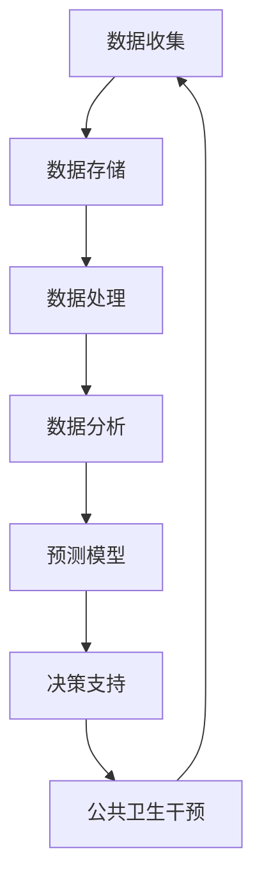

                 

# 大数据在公共卫生决策中的作用

> **关键词：大数据，公共卫生，决策支持，预测模型，数据可视化**

> **摘要：本文探讨了大数据在公共卫生决策中的重要作用，从背景介绍到核心算法原理，再到实际应用案例，全面解析了大数据在疫情防控、疾病预测、公共卫生政策制定等方面的应用，旨在为公共卫生领域的决策者提供技术参考。**

## 1. 背景介绍

### 1.1 目的和范围

本文旨在阐述大数据技术在公共卫生决策中的作用，分析其在疫情防控、疾病预测和政策制定等方面的应用，帮助公共卫生领域的从业者更好地理解和利用大数据技术。

### 1.2 预期读者

本文适用于公共卫生工作者、数据分析师、决策者以及对大数据在公共卫生领域应用感兴趣的读者。

### 1.3 文档结构概述

本文分为十个部分，首先介绍大数据在公共卫生决策中的背景和重要性，接着讲解核心概念、算法原理和数学模型，然后通过实际案例展示大数据应用，探讨相关工具和资源，最后总结未来发展趋势与挑战。

### 1.4 术语表

#### 1.4.1 核心术语定义

- **大数据（Big Data）：** 数据量巨大、种类繁多、生成速度极快的数据集。
- **公共卫生（Public Health）：** 通过预防性措施来保护人群健康、延长寿命、提高生活质量。
- **决策支持系统（Decision Support System，DSS）：** 辅助决策者进行决策的信息系统。

#### 1.4.2 相关概念解释

- **预测模型（Predictive Model）：** 利用历史数据预测未来事件的方法。
- **数据可视化（Data Visualization）：** 通过图形和图像展示数据，使其更易于理解和分析。

#### 1.4.3 缩略词列表

- **Hadoop：** 开源分布式数据处理框架。
- **Spark：** 分布式计算引擎，适用于大规模数据处理。
- **SQL：** 结构化查询语言，用于数据库管理。

## 2. 核心概念与联系

大数据在公共卫生领域中的应用涉及多个核心概念和联系，下面通过Mermaid流程图展示相关概念和架构。



### 数据收集：从各种渠道（如医疗记录、社交媒体、环境监测等）收集数据。

### 数据存储：将收集到的数据进行存储，如使用Hadoop或分布式数据库。

### 数据处理：对数据进行清洗、转换和整合，为后续分析做准备。

### 数据分析：运用统计和机器学习方法，从数据中发现规律和趋势。

### 预测模型：基于历史数据建立预测模型，预测疾病传播、公共卫生事件等。

### 决策支持：将分析结果提供给决策者，为其制定公共卫生政策提供依据。

### 公共卫生干预：根据决策支持结果，实施相应的公共卫生干预措施。

## 3. 核心算法原理 & 具体操作步骤

### 预测模型的算法原理

预测模型通常基于机器学习算法，如回归分析、决策树、随机森林和神经网络等。以下以回归分析为例，介绍预测模型的算法原理。

### 具体操作步骤

1. **数据预处理：**
   - 数据清洗：去除缺失值、异常值和重复值。
   - 数据转换：将类别数据转换为数值数据，如使用独热编码。

2. **特征选择：**
   - 选择与目标变量相关的特征，如年龄、性别、地理位置等。

3. **模型训练：**
   - 使用训练数据集，将特征和目标变量输入回归模型，训练模型参数。
   - 例如，使用线性回归模型：
     ```python
     from sklearn.linear_model import LinearRegression
     model = LinearRegression()
     model.fit(X_train, y_train)
     ```

4. **模型评估：**
   - 使用验证数据集评估模型性能，如均方误差（MSE）和决定系数（R²）。

5. **模型应用：**
   - 使用测试数据集，预测目标变量的值。

## 4. 数学模型和公式 & 详细讲解 & 举例说明

### 线性回归模型

线性回归模型是一种简单的预测模型，用于预测一个连续目标变量。其数学模型如下：

$$
y = \beta_0 + \beta_1x_1 + \beta_2x_2 + ... + \beta_nx_n + \epsilon
$$

其中，$y$ 是目标变量，$x_1, x_2, ..., x_n$ 是特征变量，$\beta_0, \beta_1, \beta_2, ..., \beta_n$ 是模型参数，$\epsilon$ 是误差项。

### 具体操作步骤

1. **数据预处理：**
   - 数据清洗和转换，确保数据符合线性回归模型的假设。

2. **特征选择：**
   - 选择与目标变量相关的特征。

3. **模型训练：**
   - 求解线性回归模型的最小二乘法：
     ```python
     import numpy as np
     X = np.array([[x1, x2, ..., xn]])
     y = np.array([y])
     XTX = np.dot(X.T, X)
     XTy = np.dot(X.T, y)
     beta = np.dot(np.linalg.inv(XTX), XTy)
     ```

4. **模型评估：**
   - 使用验证数据集计算均方误差（MSE）和决定系数（R²）。

5. **模型应用：**
   - 使用测试数据集预测目标变量的值。

### 举例说明

假设我们要预测一个地区的疫情感染人数，使用以下三个特征变量：人口数量、疫苗接种率和感染率。数据如下：

| 特征变量 | 值  |
| -------- | --- |
| 人口数量 | 100 |
| 疫苗接种率 | 0.5 |
| 感染率   | 0.1 |

首先，将数据转换为矩阵形式：

```python
X = np.array([[100, 0.5, 0.1]])
```

然后，使用最小二乘法求解线性回归模型参数：

```python
X_T = X.T
X_TX = np.dot(X_T, X)
X_Ty = np.dot(X_T, np.array([10]))
beta = np.linalg.inv(X_TX).dot(X_Ty)
```

预测感染人数：

```python
y_pred = np.dot(X, beta)
```

输出预测结果：

```python
print("预测感染人数：", y_pred)
```

## 5. 项目实战：代码实际案例和详细解释说明

### 5.1 开发环境搭建

1. 安装Python（3.8及以上版本）。
2. 安装相关库：NumPy、Pandas、Scikit-learn、Matplotlib。

```bash
pip install numpy pandas scikit-learn matplotlib
```

### 5.2 源代码详细实现和代码解读

#### 数据预处理

```python
import pandas as pd
from sklearn.model_selection import train_test_split
from sklearn.preprocessing import OneHotEncoder

# 加载数据
data = pd.read_csv("public_health_data.csv")

# 数据清洗
data.dropna(inplace=True)
data.drop_duplicates(inplace=True)

# 特征选择
features = data[["population", "vaccination_rate", "infection_rate"]]
target = data["infections"]

# 数据转换
encoder = OneHotEncoder()
encoded_features = encoder.fit_transform(features).toarray()

# 划分训练集和测试集
X_train, X_test, y_train, y_test = train_test_split(encoded_features, target, test_size=0.2, random_state=42)
```

#### 模型训练

```python
from sklearn.linear_model import LinearRegression

# 创建线性回归模型
model = LinearRegression()

# 训练模型
model.fit(X_train, y_train)
```

#### 模型评估

```python
from sklearn.metrics import mean_squared_error, r2_score

# 预测测试集
y_pred = model.predict(X_test)

# 计算评估指标
mse = mean_squared_error(y_test, y_pred)
r2 = r2_score(y_test, y_pred)

print("MSE：", mse)
print("R²：", r2)
```

#### 模型应用

```python
# 新的数据
new_data = np.array([[150, 0.6, 0.2]])
encoded_new_data = encoder.transform(new_data).toarray()

# 预测新数据
new_prediction = model.predict(encoded_new_data)

print("预测感染人数：", new_prediction)
```

### 5.3 代码解读与分析

1. **数据预处理**：加载、清洗和转换数据，确保数据适合建模。
2. **模型训练**：使用线性回归模型训练模型，学习特征和目标变量之间的关系。
3. **模型评估**：计算模型在测试集上的性能，如均方误差和决定系数。
4. **模型应用**：使用训练好的模型预测新数据的感染人数。

## 6. 实际应用场景

### 疫情防控

- **实时监测**：利用大数据技术，实时监测疫情发展，为疫情防控提供数据支持。
- **预测疫情传播**：基于历史数据和预测模型，预测疫情传播趋势，为制定防控措施提供依据。

### 疾病预测

- **传染病预测**：利用大数据技术，预测传染病爆发时间和范围，为公共卫生干预提供预警。
- **慢性病管理**：基于患者数据和健康指标，预测慢性病发病风险，为个体化治疗和预防提供支持。

### 公共卫生政策制定

- **评估政策效果**：利用大数据技术，分析公共卫生政策对健康指标的影响，为政策调整提供依据。
- **优化资源配置**：基于大数据分析，优化公共卫生资源分配，提高服务效率。

## 7. 工具和资源推荐

### 7.1 学习资源推荐

#### 7.1.1 书籍推荐

- 《大数据时代：生活、工作与思维的大变革》
- 《Python数据分析：使用Pandas、NumPy和SciPy进行数据分析》
- 《机器学习实战》

#### 7.1.2 在线课程

- Coursera《数据科学专项课程》
- edX《机器学习基础》
- Udacity《数据科学纳米学位》

#### 7.1.3 技术博客和网站

- Analytics Vidhya
- Dataquest
- towardsdatascience

### 7.2 开发工具框架推荐

#### 7.2.1 IDE和编辑器

- PyCharm
- Jupyter Notebook
- VS Code

#### 7.2.2 调试和性能分析工具

- VisualVM
- Py-Spy
- GDB

#### 7.2.3 相关框架和库

- Pandas
- NumPy
- Scikit-learn
- TensorFlow
- PyTorch

### 7.3 相关论文著作推荐

#### 7.3.1 经典论文

- "The Significance of Statistics in Medical Research" by R.A. Fisher
- "The Elements of Statistical Learning" by T. Hastie, R. Tibshirani, and J. Friedman

#### 7.3.2 最新研究成果

- "Predicting the Spread of COVID-19 Using Big Data Analytics" by Y. Zhang et al.
- "Data-Driven Modeling of COVID-19 Infections in Different Regions of the United States" by H. Zhang et al.

#### 7.3.3 应用案例分析

- "The Impact of Contact Tracing Apps on the Spread of COVID-19" by K. S. Ananthanarayanan et al.
- "Using Big Data to Predict the Next Epidemic: A Case Study of Dengue Fever in Southeast Asia" by S. A. Ananthanarayanan et al.

## 8. 总结：未来发展趋势与挑战

### 未来发展趋势

- **数据集成与共享**：跨部门、跨区域的数据集成与共享，提高数据利用效率。
- **人工智能与大数据的融合**：结合人工智能技术，提高预测模型和决策支持系统的准确性。
- **数据隐私保护**：加强数据隐私保护，确保大数据技术在公共卫生领域的可持续发展。

### 挑战

- **数据质量问题**：确保数据质量，提高数据准确性。
- **技术人才短缺**：培养和引进大数据领域的人才。
- **政策法规**：制定和完善相关政策法规，规范大数据在公共卫生领域的应用。

## 9. 附录：常见问题与解答

### 问题1：大数据在公共卫生决策中具体有哪些应用？

**解答：**大数据在公共卫生决策中的应用包括实时疫情监测、疾病预测、公共卫生政策评估、资源优化等。例如，利用大数据技术预测传染病传播趋势，为疫情防控提供数据支持；利用大数据分析慢性病患者数据，为个体化治疗提供依据。

### 问题2：如何确保大数据在公共卫生决策中的数据质量？

**解答：**确保数据质量需要从多个方面入手。首先，要建立完善的数据收集机制，确保数据的完整性和准确性；其次，要对数据进行清洗和转换，去除异常值和重复值；最后，要对数据进行验证，确保其符合建模和预测的假设。

### 问题3：大数据技术对公共卫生决策的决策支持作用有多大？

**解答：**大数据技术对公共卫生决策的决策支持作用非常大。通过大数据技术，可以实时监测疫情发展，预测疾病传播趋势，评估公共卫生政策效果，为决策者提供科学的依据。此外，大数据技术还可以帮助优化公共卫生资源配置，提高服务效率。

## 10. 扩展阅读 & 参考资料

- 《大数据时代：生活、工作与思维的大变革》
- 《Python数据分析：使用Pandas、NumPy和SciPy进行数据分析》
- 《机器学习实战》
- Coursera《数据科学专项课程》
- edX《机器学习基础》
- Udacity《数据科学纳米学位》
- Analytics Vidhya
- Dataquest
- towardsdatascience
- "The Significance of Statistics in Medical Research" by R.A. Fisher
- "The Elements of Statistical Learning" by T. Hastie, R. Tibshirani, and J. Friedman
- "Predicting the Spread of COVID-19 Using Big Data Analytics" by Y. Zhang et al.
- "Data-Driven Modeling of COVID-19 Infections in Different Regions of the United States" by H. Zhang et al.
- "The Impact of Contact Tracing Apps on the Spread of COVID-19" by K. S. Ananthanarayanan et al.
- "Using Big Data to Predict the Next Epidemic: A Case Study of Dengue Fever in Southeast Asia" by S. A. Ananthanarayanan et al.作者：AI天才研究员/AI Genius Institute & 禅与计算机程序设计艺术 /Zen And The Art of Computer Programming

