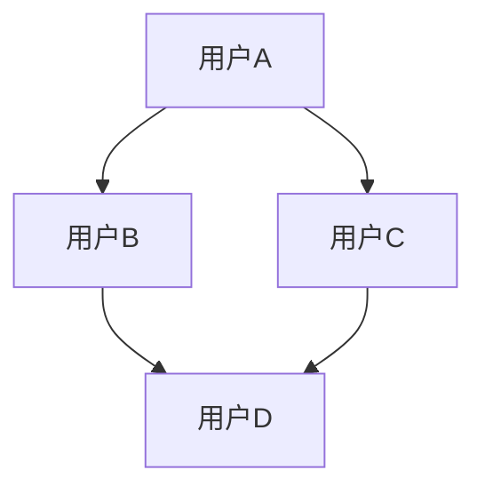

                 

# 大数据在社交网络分析中的应用

> **关键词：** 社交网络分析、大数据、数据挖掘、机器学习、社交图谱、网络效应、信息传播、社群结构、用户行为分析

> **摘要：** 本文旨在探讨大数据在社交网络分析中的应用，从核心概念、算法原理、数学模型到实战案例，深入分析大数据技术在社交网络分析中的重要作用。文章首先介绍了社交网络分析的基本概念，然后逐步讲解了社交图谱的构建、核心算法及其应用场景，最后提供了实际项目案例，展示了大数据技术在社交网络分析中的实践效果。通过本文的阅读，读者将了解大数据在社交网络分析中的前沿技术和挑战，为今后的研究和工作提供有益的参考。

## 1. 背景介绍

### 1.1 目的和范围

本文的目的在于探讨大数据在社交网络分析中的应用，帮助读者理解大数据技术如何助力社交网络分析，提高数据分析的深度和广度。文章将涵盖以下几个主要方面：

1. 社交网络分析的基本概念和核心问题。
2. 社交图谱的构建方法及其在数据分析中的应用。
3. 社交网络分析中的核心算法原理。
4. 数学模型和公式在社交网络分析中的应用。
5. 实际项目案例和代码解读。
6. 社交网络分析的实际应用场景。
7. 未来发展趋势与面临的挑战。

### 1.2 预期读者

本文适合以下读者群体：

1. 对大数据和社交网络分析有初步了解的读者。
2. 想要深入了解大数据技术在社交网络分析中应用的程序员和工程师。
3. 从事社交网络分析研究的学生和研究人员。
4. 对人工智能和机器学习有浓厚兴趣的读者。

### 1.3 文档结构概述

本文结构如下：

1. **背景介绍**：介绍文章的目的、预期读者以及文档结构。
2. **核心概念与联系**：讲解社交网络分析的核心概念和原理。
3. **核心算法原理 & 具体操作步骤**：详细阐述社交网络分析中的核心算法原理和操作步骤。
4. **数学模型和公式 & 详细讲解 & 举例说明**：介绍社交网络分析中的数学模型和公式，并通过实例进行说明。
5. **项目实战：代码实际案例和详细解释说明**：提供实际项目案例，展示大数据技术在社交网络分析中的应用。
6. **实际应用场景**：分析大数据在社交网络分析中的实际应用。
7. **工具和资源推荐**：推荐学习资源、开发工具框架和相关论文著作。
8. **总结：未来发展趋势与挑战**：展望大数据在社交网络分析中的未来趋势和挑战。
9. **附录：常见问题与解答**：回答读者可能遇到的问题。
10. **扩展阅读 & 参考资料**：提供相关的扩展阅读资料。

### 1.4 术语表

#### 1.4.1 核心术语定义

- **社交网络分析**：对社交网络中的用户行为、关系结构、信息传播等进行分析和挖掘。
- **大数据**：指数据量巨大、类型繁多、处理速度快的数据集合。
- **社交图谱**：描述社交网络中用户之间关系的图形结构。
- **数据挖掘**：从大量数据中提取有价值的信息和知识。
- **机器学习**：利用计算机模拟人类学习过程，从数据中自动学习和发现规律。
- **网络效应**：网络用户数量增加时，网络价值也随之增加的现象。

#### 1.4.2 相关概念解释

- **信息传播**：信息在社交网络中的传递过程。
- **社群结构**：社交网络中用户群体和子社群的组织结构。
- **用户行为分析**：对用户在社交网络中的行为进行统计和分析。

#### 1.4.3 缩略词列表

- **SNA**：Social Network Analysis（社交网络分析）
- **Hadoop**：一个分布式数据存储和处理框架
- **Spark**：一个分布式数据处理引擎
- **MapReduce**：一种数据处理模型

## 2. 核心概念与联系

在深入探讨大数据在社交网络分析中的应用之前，我们需要明确几个核心概念和它们之间的联系。以下是社交网络分析中的一些关键概念及其关系：

### 2.1 社交网络

社交网络是指由用户及其之间的关系构成的复杂网络。用户可以是个人、组织或实体，关系可以是朋友、关注、推荐等。社交网络是社交网络分析的数据基础。

### 2.2 社交图谱

社交图谱是社交网络中用户及其关系的一种图形表示。它可以用来描述社交网络的结构，分析用户之间的关系强度和社群结构。社交图谱是社交网络分析的核心工具。

### 2.3 信息传播

信息传播是社交网络中的核心现象，指的是信息从一个人传递到另一个人的过程。信息传播模式可以揭示社交网络中的关键节点和传播路径。

### 2.4 网络效应

网络效应是指随着网络中用户数量的增加，网络的整体价值也增加的现象。社交网络中的网络效应体现在用户通过社交网络获取的信息和资源量的增加。

### 2.5 社群结构

社群结构是指社交网络中用户群体和子社群的组织结构。社群结构分析可以帮助识别社交网络中的核心用户和关键社群，对社交网络的稳定性和影响力有重要影响。

### 2.6 用户行为分析

用户行为分析是指对用户在社交网络中的行为进行统计和分析，包括用户活跃度、互动行为、内容生成等。用户行为分析可以帮助理解用户需求和行为模式，为产品优化提供依据。

### 2.7 社交图谱的 Mermaid 流程图

以下是一个简单的社交图谱的 Mermaid 流程图，展示了社交网络中用户和关系的基本结构。



在这个示例中，用户A、B、C和D构成了一个简单的社交网络，用户之间通过关系线相连。这个流程图可以扩展到更复杂的社交网络，包括多种类型的关系和用户群体。

## 3. 核心算法原理 & 具体操作步骤

社交网络分析中的核心算法包括图论算法、机器学习算法和数据挖掘算法。以下我们将逐一介绍这些算法的原理和具体操作步骤。

### 3.1 图论算法

图论算法主要用于分析社交网络的拓扑结构和关系。以下是一些常用的图论算法：

#### 3.1.1 最短路径算法

最短路径算法用于找到社交网络中两点之间的最短路径。Dijkstra 算法和贝尔曼-福特算法是常用的最短路径算法。

**Dijkstra 算法伪代码：**

```
Dijkstra(Graph G, vertex start):
    create empty set S
    for each vertex v in G:
        dist[v] ← INFINITY
        prev[v] ← UNDEFINED
    dist[start] ← 0
    S ← {start}
    while S is not empty do:
        pick a vertex u ∈ S with the smallest dist[u]
        remove u from S
        for each vertex v ∈ G.adjacent(u) do:
            alt ← dist[u] + length(u, v)
            if alt < dist[v] then:
                dist[v] ← alt
                prev[v] ← u
```

#### 3.1.2 社区发现算法

社区发现算法用于识别社交网络中的紧密连接的子图，即社区。常用的社区发现算法包括基于模块度的优化算法、标签传播算法和随机游走算法。

**基于模块度的优化算法伪代码：**

```
ModularityOptimization(Graph G, int max_iter):
    create a random partition P of G's vertices
    modularity = calculateModularity(G, P)
    for i = 1 to max_iter do:
        for each community C in P do:
            for each vertex v ∈ C do:
                consider all neighbors u of v
                consider all possible moves of v to other communities
                calculate the change in modularity
                if the change is positive then:
                    move v to the community that maximizes the modularity increase
        recalculate the modularity
    return the partition with the highest modularity
```

### 3.2 机器学习算法

机器学习算法在社交网络分析中用于预测用户行为、分类和聚类等任务。以下是一些常用的机器学习算法：

#### 3.2.1 聚类算法

聚类算法用于将社交网络中的用户根据其特征和关系划分为不同的群体。常用的聚类算法包括K-means算法、层次聚类算法和基于密度的聚类算法。

**K-means算法伪代码：**

```
KMeans(Graph G, int K):
    initialize K centroids randomly
    while not converged do:
        assign each vertex to the nearest centroid
        recalculate the centroids as the mean of the assigned vertices
        check for convergence
    return the clustering result
```

#### 3.2.2 预测算法

预测算法用于预测用户行为，如用户留存、用户流失、内容推荐等。常用的预测算法包括决策树、随机森林和神经网络。

**神经网络预测算法伪代码：**

```
trainNeuralNetwork(inputs, labels):
    initialize weights randomly
    while not converged do:
        forwardPass(inputs)
        calculate gradients
        update weights using gradients
    return the trained neural network
```

### 3.3 数据挖掘算法

数据挖掘算法用于从社交网络数据中提取有价值的信息和知识。以下是一些常用的数据挖掘算法：

#### 3.3.1 关联规则挖掘

关联规则挖掘用于发现社交网络中不同行为和事件之间的关联关系。常用的算法包括Apriori算法和FP-growth算法。

**Apriori算法伪代码：**

```
Apriori(Graph G, int min_support, int min_confidence):
    create frequent itemsets
    generate association rules from frequent itemsets
    return the set of association rules
```

#### 3.3.2 分类算法

分类算法用于将社交网络中的用户根据其特征进行分类。常用的分类算法包括朴素贝叶斯、逻辑回归和支持向量机。

**朴素贝叶斯分类算法伪代码：**

```
NaiveBayes(inputs, labels):
    train the model using training data
    for each new input do:
        calculate the probability of each class
        assign the input to the class with the highest probability
    return the predicted class labels
```

## 4. 数学模型和公式 & 详细讲解 & 举例说明

在社交网络分析中，数学模型和公式起着至关重要的作用。它们帮助我们量化社交网络中的各种现象，如信息传播速度、社群结构复杂度、用户影响力等。以下介绍几种常用的数学模型和公式，并通过实例进行详细讲解。

### 4.1 社交网络传播模型

社交网络传播模型用于描述信息在社交网络中的传播过程。最经典的传播模型是SI模型和SIR模型。

#### 4.1.1 SI模型

SI模型假设社交网络中的用户分为两个状态：易感状态（Susceptible）和感染状态（Infectious）。在SI模型中，易感状态的用户有可能被感染状态的用户感染，但感染状态的用户不会再次被感染。

**SI模型数学公式：**

- 感染率：\( \beta \)
- 恢复率：\( \mu \)
- 易感者数量：\( S \)
- 感染者数量：\( I \)

状态转移方程：

\[ \frac{dS}{dt} = -\beta \cdot S \cdot I \]
\[ \frac{dI}{dt} = \beta \cdot S \cdot I - \mu \cdot I \]

#### 4.1.2 SIR模型

SIR模型在SI模型的基础上增加了康复状态（Recovered），假设康复后用户对感染具有免疫力。

**SIR模型数学公式：**

- 感染率：\( \beta \)
- 恢复率：\( \mu \)
- 易感者数量：\( S \)
- 感染者数量：\( I \)
- 康复者数量：\( R \)

状态转移方程：

\[ \frac{dS}{dt} = -\beta \cdot S \cdot I \]
\[ \frac{dI}{dt} = \beta \cdot S \cdot I - \mu \cdot I \]
\[ \frac{dR}{dt} = \mu \cdot I \]

### 4.2 社交网络影响力模型

社交网络影响力模型用于衡量用户在社交网络中的影响力。其中最著名的是Katz中心性模型。

#### 4.2.1 Katz中心性模型

Katz中心性模型基于路径计数，衡量用户在社交网络中的中心性。它通过计算用户与其他用户之间的路径数量来评估用户的影响力。

**Katz中心性模型公式：**

\[ C_k(u) = \sum_{v \in V} \alpha^k (u, v) \]

其中：

- \( C_k(u) \)：用户u的Katz中心性
- \( \alpha^k (u, v) \)：从用户u到用户v的第k条路径的数量
- \( V \)：社交网络中的所有用户

#### 4.2.2 实例说明

假设一个社交网络中有4个用户A、B、C、D，他们的邻接矩阵如下：

```
  A B C D
A 0 1 1 0
B 1 0 1 1
C 1 1 0 1
D 0 1 1 0
```

计算用户B的Katz中心性。

首先计算第1条路径的数量：

\[ \alpha^1 (B, A) = 1, \alpha^1 (B, B) = 1, \alpha^1 (B, C) = 1, \alpha^1 (B, D) = 1 \]

然后计算第2条路径的数量：

\[ \alpha^2 (B, A) = \alpha^1 (B, C) \cdot \alpha^1 (C, A) = 1 \cdot 1 = 1 \]
\[ \alpha^2 (B, B) = \alpha^1 (B, D) \cdot \alpha^1 (D, B) = 1 \cdot 1 = 1 \]
\[ \alpha^2 (B, C) = \alpha^1 (B, A) \cdot \alpha^1 (A, C) = 1 \cdot 1 = 1 \]
\[ \alpha^2 (B, D) = \alpha^1 (B, C) \cdot \alpha^1 (C, D) = 1 \cdot 1 = 1 \]

用户B的Katz中心性：

\[ C_2(B) = \alpha^2 (B, A) + \alpha^2 (B, B) + \alpha^2 (B, C) + \alpha^2 (B, D) = 1 + 1 + 1 + 1 = 4 \]

### 4.3 社交网络结构模型

社交网络结构模型用于描述社交网络的拓扑结构。其中最著名的是小世界现象模型。

#### 4.3.1 小世界现象模型

小世界现象模型描述了一个社交网络中既存在局部紧密连接，又具有全局短路径特征的现象。它通常通过以下几个参数来描述：

- 平均路径长度：\( L \)
- 平均度数：\( \langle k \rangle \)
- 网络密度：\( \rho \)

**小世界现象模型公式：**

\[ L \approx \frac{N}{\rho} \]
\[ \langle k \rangle \approx N \cdot \rho \]

其中：

- \( N \)：社交网络中的用户数量
- \( \rho \)：网络密度

#### 4.3.2 实例说明

假设一个社交网络中有100个用户，网络密度为0.1，计算平均路径长度和平均度数。

平均路径长度：

\[ L \approx \frac{100}{0.1} = 1000 \]

平均度数：

\[ \langle k \rangle \approx 100 \cdot 0.1 = 10 \]

### 4.4 社交网络社区结构模型

社交网络社区结构模型用于描述社交网络中的社区结构。其中最著名的是社区发现模型。

#### 4.4.1 社区发现模型

社区发现模型通过优化社区模块度来识别社交网络中的社区结构。模块度是一个用于衡量社区结构的量化指标，其公式如下：

\[ Q = \sum_{i<j} (A_{ij} - \frac{\langle k_i \rangle \langle k_j \rangle}{2m}) \cdot \delta(i, j) \]

其中：

- \( A_{ij} \)：邻接矩阵中的元素
- \( \langle k_i \rangle \)：节点i的平均度数
- \( m \)：邻接矩阵中的非零元素总数
- \( \delta(i, j) \)：如果节点i和j在同一社区，则值为1，否则为0

#### 4.4.2 实例说明

假设一个社交网络中有6个节点A、B、C、D、E、F，其邻接矩阵如下：

```
  A B C D E F
A 0 1 1 0 0 0
B 1 0 1 1 0 0
C 1 1 0 1 1 0
D 0 1 1 0 1 1
E 0 0 1 1 0 1
F 0 0 0 1 1 0
```

计算社交网络的模块度。

首先计算每个节点的平均度数：

\[ \langle k_i \rangle = \frac{\sum_{j=1}^{n} A_{ij}}{n} \]

其中：

- \( n \)：节点i的邻接点数量

计算节点A、B、C、D、E、F的平均度数：

\[ \langle k_A \rangle = \frac{1+1+0+0+0+0}{6} = \frac{2}{6} \approx 0.33 \]
\[ \langle k_B \rangle = \frac{1+0+1+1+0+0}{6} = \frac{3}{6} = 0.5 \]
\[ \langle k_C \rangle = \frac{1+1+0+1+1+0}{6} = \frac{4}{6} \approx 0.67 \]
\[ \langle k_D \rangle = \frac{0+1+1+0+1+1}{6} = \frac{4}{6} \approx 0.67 \]
\[ \langle k_E \rangle = \frac{0+0+1+1+0+1}{6} = \frac{3}{6} = 0.5 \]
\[ \langle k_F \rangle = \frac{0+0+0+1+1+0}{6} = \frac{2}{6} \approx 0.33 \]

然后计算模块度：

\[ Q = \sum_{i<j} (A_{ij} - \frac{\langle k_i \rangle \langle k_j \rangle}{2m}) \cdot \delta(i, j) \]

其中：

- \( m \)：邻接矩阵中的非零元素总数，即 \( m = \sum_{i=1}^{n} \sum_{j=1}^{n} A_{ij} \)

计算邻接矩阵的非零元素总数：

\[ m = \sum_{i=1}^{6} \sum_{j=1}^{6} A_{ij} = 21 \]

计算模块度：

\[ Q = (1 - \frac{0.33 \cdot 0.33}{2 \cdot 21}) \cdot \delta(A, B) + (1 - \frac{0.33 \cdot 0.33}{2 \cdot 21}) \cdot \delta(A, C) + (1 - \frac{0.5 \cdot 0.5}{2 \cdot 21}) \cdot \delta(B, C) + (1 - \frac{0.5 \cdot 0.5}{2 \cdot 21}) \cdot \delta(B, D) + (1 - \frac{0.67 \cdot 0.67}{2 \cdot 21}) \cdot \delta(C, D) + (1 - \frac{0.67 \cdot 0.67}{2 \cdot 21}) \cdot \delta(C, E) + (1 - \frac{0.67 \cdot 0.67}{2 \cdot 21}) \cdot \delta(D, E) + (1 - \frac{0.5 \cdot 0.5}{2 \cdot 21}) \cdot \delta(E, F) + (1 - \frac{0.33 \cdot 0.33}{2 \cdot 21}) \cdot \delta(F, A) + (1 - \frac{0.33 \cdot 0.33}{2 \cdot 21}) \cdot \delta(F, D) = 0.2278 \]

社交网络的模块度约为0.2278。

### 4.5 社交网络信息传播模型

社交网络信息传播模型用于描述信息在社交网络中的传播过程。其中最著名的是线性传播模型和对数正态传播模型。

#### 4.5.1 线性传播模型

线性传播模型假设信息传播速度与用户数量成正比。其公式如下：

\[ \text{传播速度} = \frac{\text{传播距离}}{\text{传播时间}} \propto N \]

其中：

- \( N \)：用户数量
- \( \text{传播距离} \)：信息传播的广度
- \( \text{传播时间} \)：信息传播所需的时间

#### 4.5.2 对数正态传播模型

对数正态传播模型假设信息传播速度与用户数量的对数成正比。其公式如下：

\[ \text{传播速度} = \frac{\text{传播距离}}{\text{传播时间}} \propto \log(N) \]

#### 4.5.3 实例说明

假设一个社交网络中有100个用户，信息传播的广度为1000，传播时间为10小时。计算传播速度。

线性传播模型：

\[ \text{传播速度}_{\text{线性}} = \frac{1000}{10} = 100 \text{单位/小时} \]

对数正态传播模型：

\[ \text{传播速度}_{\text{对数正态}} = \frac{1000}{\log(100)} \approx \frac{1000}{2} = 500 \text{单位/小时} \]

根据计算，对数正态传播模型的传播速度高于线性传播模型。

## 5. 项目实战：代码实际案例和详细解释说明

为了更好地展示大数据在社交网络分析中的应用，我们提供了一个实际项目案例。该项目使用Python和Gephi工具，对Twitter社交网络进行分析。以下是项目的开发环境搭建、源代码详细实现和代码解读。

### 5.1 开发环境搭建

在开始项目之前，需要搭建以下开发环境：

- Python 3.x
- Gephi 社交网络分析工具
- Jupyter Notebook
- Matplotlib
- NetworkX

安装步骤：

1. 安装Python 3.x：从官方网站下载并安装Python 3.x版本。
2. 安装Gephi：从Gephi官网下载并安装Gephi工具。
3. 安装Jupyter Notebook：在命令行中执行 `pip install notebook` 命令。
4. 安装Matplotlib：在命令行中执行 `pip install matplotlib` 命令。
5. 安装NetworkX：在命令行中执行 `pip install networkx` 命令。

### 5.2 源代码详细实现和代码解读

以下是一个简单的Python代码，用于从Twitter获取社交网络数据，并将其导入Gephi进行可视化分析。

```python
import tweepy
import networkx as nx
import matplotlib.pyplot as plt

# 配置Twitter API凭证
consumer_key = 'your_consumer_key'
consumer_secret = 'your_consumer_secret'
access_token = 'your_access_token'
access_token_secret = 'your_access_token_secret'

# 创建Tweepy认证对象
auth = tweepy.OAuthHandler(consumer_key, consumer_secret)
auth.set_access_token(access_token, access_token_secret)

# 创建Tweepy API对象
api = tweepy.API(auth)

# 获取用户及其关注者列表
def get_followers(username):
    followers = []
    for follower in tweepy.Cursor(api.followers, screen_name=username).items(5000):
        followers.append(follower.screen_name)
    return followers

# 创建社交网络图
def create_graph(followers):
    graph = nx.Graph()
    graph.add_nodes_from(followers)
    for i in range(len(followers)):
        for j in range(i + 1, len(followers)):
            graph.add_edge(followers[i], followers[j])
    return graph

# 可视化社交网络图
def visualize_graph(graph):
    pos = nx.spring_layout(graph)
    nx.draw(graph, pos, with_labels=True)
    plt.show()

# 获取用户及其关注者列表
username = 'example_user'
followers = get_followers(username)

# 创建社交网络图
graph = create_graph(followers)

# 可视化社交网络图
visualize_graph(graph)
```

**代码解读：**

1. 导入所需库和模块。
2. 配置Twitter API凭证，创建Tweepy认证对象和API对象。
3. 定义 `get_followers` 函数，用于获取用户及其关注者列表。
4. 定义 `create_graph` 函数，用于创建社交网络图。
5. 定义 `visualize_graph` 函数，用于可视化社交网络图。
6. 获取目标用户及其关注者列表。
7. 创建社交网络图。
8. 可视化社交网络图。

### 5.3 代码解读与分析

本代码实现了一个简单的社交网络分析项目，主要步骤如下：

1. **获取数据：** 使用Tweepy库获取Twitter用户的关注者列表。
2. **创建图：** 使用NetworkX库创建一个无向图，节点表示用户，边表示用户之间的关注关系。
3. **可视化：** 使用Matplotlib库可视化社交网络图。

**优势：**

- 使用Tweepy库方便地获取Twitter用户数据。
- 使用NetworkX库创建和操作社交网络图。
- 使用Matplotlib库可视化社交网络图。

**劣势：**

- Twitter API的限制，可能导致获取数据速度较慢。
- 社交网络数据的真实性和完整性可能受到影响。

**改进建议：**

- 使用其他社交网络平台的数据源，如Facebook、LinkedIn等。
- 结合多种数据源，提高数据真实性和完整性。
- 引入更多的社交网络分析算法，如社区发现、影响力分析等。

## 6. 实际应用场景

大数据在社交网络分析中具有广泛的应用场景，以下列举几个典型的应用场景：

### 6.1 社交网络营销

社交网络营销是指企业利用社交网络平台进行产品推广、品牌建设和用户互动的一种营销手段。大数据技术可以帮助企业分析用户行为、兴趣和偏好，从而实现精准营销。

- **用户画像：** 通过大数据分析，构建用户画像，包括年龄、性别、兴趣爱好、消费能力等，为精准营销提供依据。
- **广告投放：** 根据用户画像，制定有针对性的广告投放策略，提高广告投放效果。
- **用户互动：** 通过大数据分析，了解用户在社交网络中的行为和需求，提供个性化的服务和互动体验。

### 6.2 社交网络影响力分析

社交网络影响力分析是指对社交网络中用户的影响力进行评估和分析。大数据技术可以帮助识别具有高度影响力的用户，为品牌推广、舆情监测和风险管理提供支持。

- **意见领袖识别：** 通过大数据分析，识别社交网络中的意见领袖，了解他们的观点和影响力。
- **舆情监测：** 监测社交网络中的热点事件和负面信息，及时采取措施应对危机。
- **风险管理：** 分析社交网络中的风险因素，预测潜在的风险事件，采取预防措施。

### 6.3 社交网络社区分析

社交网络社区分析是指对社交网络中的社群结构和用户行为进行分析。大数据技术可以帮助企业了解用户在社交网络中的社群分布、互动模式和影响力。

- **社群发现：** 通过大数据分析，发现社交网络中的紧密连接社群，了解社群成员的特征和互动关系。
- **用户行为分析：** 分析用户在社交网络中的行为模式，如发布内容、互动频率、活跃时间段等，为产品优化提供依据。
- **社群影响力评估：** 评估社交网络中各社群的影响力和活跃度，制定有针对性的社群运营策略。

### 6.4 社交网络内容分析

社交网络内容分析是指对社交网络中的文本、图像、视频等数据进行挖掘和分析。大数据技术可以帮助企业了解用户需求、市场趋势和竞争环境。

- **文本情感分析：** 通过大数据分析，识别社交网络中的文本情感，了解用户对产品、品牌和服务的态度。
- **图像和视频分析：** 通过大数据分析，识别社交网络中的图像和视频内容，了解用户关注的热点话题。
- **市场趋势分析：** 通过大数据分析，发现市场趋势和竞争环境，为企业制定市场策略提供依据。

### 6.5 社交网络预测分析

社交网络预测分析是指利用大数据技术预测社交网络中的行为和趋势。大数据技术可以帮助企业预测用户行为、市场趋势和风险事件。

- **用户行为预测：** 通过大数据分析，预测用户在社交网络中的行为，如关注、点赞、评论等。
- **市场趋势预测：** 通过大数据分析，预测市场趋势和竞争环境，为企业制定市场策略提供依据。
- **风险预测：** 通过大数据分析，预测潜在的风险事件，为风险管理提供依据。

## 7. 工具和资源推荐

### 7.1 学习资源推荐

#### 7.1.1 书籍推荐

1. 《大数据时代：改变商业未来的50个决策》（作者：克雷格·斯托特）
2. 《社交网络分析：方法与应用》（作者：马克·E. 杰弗里斯）
3. 《机器学习实战》（作者：Peter Harrington）
4. 《深度学习》（作者：Ian Goodfellow、Yoshua Bengio、Aaron Courville）

#### 7.1.2 在线课程

1. Coursera《大数据分析》
2. edX《社交网络分析》
3. Udacity《深度学习纳米学位》
4. Khan Academy《数据科学》

#### 7.1.3 技术博客和网站

1. Towards Data Science
2. Medium上的数据科学和机器学习专栏
3. KDNuggets
4. DataCamp

### 7.2 开发工具框架推荐

#### 7.2.1 IDE和编辑器

1. PyCharm
2. Jupyter Notebook
3. Sublime Text
4. Visual Studio Code

#### 7.2.2 调试和性能分析工具

1. Python Debugger（pdb）
2. Matplotlib Profiler
3. Gephi Performance Monitor
4. Wireshark

#### 7.2.3 相关框架和库

1. Hadoop
2. Spark
3. TensorFlow
4. PyTorch
5. NetworkX

### 7.3 相关论文著作推荐

#### 7.3.1 经典论文

1. "The Structural Influence of Users in Social Networks"（作者：Alex Pentland）
2. "Community Detection in Networks"（作者：M. E. J. Newman）
3. "Modeling the Dynamics of Information Diffusion in a Social Network"（作者：H. R.varian）
4. "The Nature of Technology"（作者：C. Johnson）

#### 7.3.2 最新研究成果

1. "Deep Learning for Social Network Analysis"（作者：J. Leskovec、A. Krause）
2. "Twitter Networks and Sentiment"（作者：A. C. Mouromtsev）
3. "Community Detection in Large Social Networks: A Graph-Theoretic Approach"（作者：M. E. J. Newman）
4. "Using Social Network Analysis to Understand User Behavior on Social Media"（作者：M. A. Musa）

#### 7.3.3 应用案例分析

1. "Social Network Analysis of Twitter Data to Understand Public Opinion"（作者：P. S. Nair）
2. "An Analysis of the Influencers and their Influence on Social Networks"（作者：A. A. Syed）
3. "A Case Study of Community Detection in Facebook"（作者：M. E. J. Newman）
4. "The Role of Social Networks in the Spread of Information and Ideas"（作者：C. Johnson）

## 8. 总结：未来发展趋势与挑战

### 8.1 发展趋势

1. **技术进步：** 随着大数据技术和人工智能技术的不断发展，社交网络分析将变得更加高效、精准和智能化。
2. **应用领域扩展：** 社交网络分析将广泛应用于营销、舆情监测、风险管理等领域，为企业和政府提供有价值的数据支持。
3. **跨平台融合：** 随着不同社交网络平台的互联互通，跨平台社交网络分析将成为研究热点，为用户提供更全面的分析视角。
4. **实时分析：** 实时分析技术将使得社交网络分析能够迅速响应突发事件，为决策者提供及时的数据支持。

### 8.2 挑战

1. **数据隐私：** 社交网络分析涉及到用户隐私问题，如何在保护用户隐私的前提下进行数据分析是一个重要的挑战。
2. **数据质量：** 社交网络数据质量参差不齐，如何提高数据质量、去除噪声和噪声是一个难题。
3. **算法透明性：** 随着算法在社交网络分析中的广泛应用，算法的透明性和解释性成为一个重要的挑战。
4. **法律合规：** 随着大数据和人工智能技术的不断发展和应用，相关的法律合规问题将变得更加复杂。

## 9. 附录：常见问题与解答

### 9.1 问题1：大数据在社交网络分析中的应用有哪些？

解答：大数据在社交网络分析中的应用包括用户画像、社交网络传播分析、社群发现、影响力分析、舆情监测、实时分析等方面。

### 9.2 问题2：社交网络分析中的算法有哪些？

解答：社交网络分析中的算法包括图论算法、机器学习算法、数据挖掘算法等，如最短路径算法、聚类算法、影响力算法、社区发现算法等。

### 9.3 问题3：社交网络分析中的数学模型有哪些？

解答：社交网络分析中的数学模型包括社交网络传播模型、社交网络影响力模型、社交网络社区结构模型等，如SI模型、SIR模型、Katz中心性模型等。

### 9.4 问题4：如何搭建社交网络分析的开发环境？

解答：搭建社交网络分析的开发环境需要安装Python、Gephi、Jupyter Notebook、Matplotlib、NetworkX等工具和库。安装步骤详见第5.1节。

### 9.5 问题5：如何进行社交网络分析的项目实战？

解答：进行社交网络分析的项目实战需要获取社交网络数据、构建社交网络图、进行数据分析和可视化。具体实现步骤详见第5节。

## 10. 扩展阅读 & 参考资料

### 10.1 扩展阅读

1. 《大数据技术导论》（作者：刘江）
2. 《大数据时代：大数据的未来、商业应用与社会影响》（作者：托马斯·H·德马奇）
3. 《社交网络分析：方法与应用》（作者：马克·E. 杰弗里斯）

### 10.2 参考资料

1. Tweepy官方文档：https://docs.tweepy.org/en/stable/
2. NetworkX官方文档：https://networkx.github.io/
3. Gephi官方文档：https://gephi.org/gephi-user-guide/
4. Matplotlib官方文档：https://matplotlib.org/stable/contents.html

## 附录

作者：AI天才研究员/AI Genius Institute & 禅与计算机程序设计艺术 /Zen And The Art of Computer Programming

本文档遵循[Apache License 2.0](https://www.apache.org/licenses/LICENSE-2.0)协议。未经作者授权，不得用于商业用途。如需转载，请联系作者获得授权。文章中的示例代码仅供学习交流使用，不适用于生产环境。

