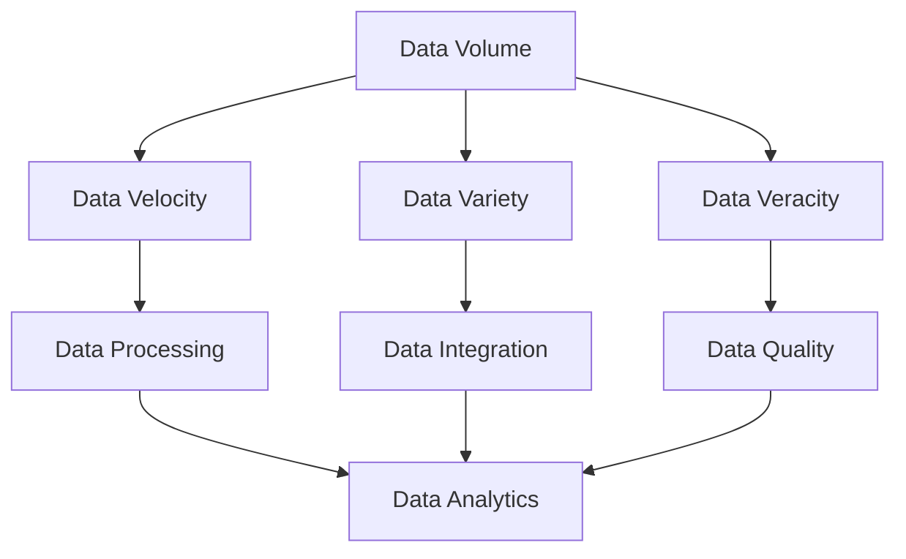
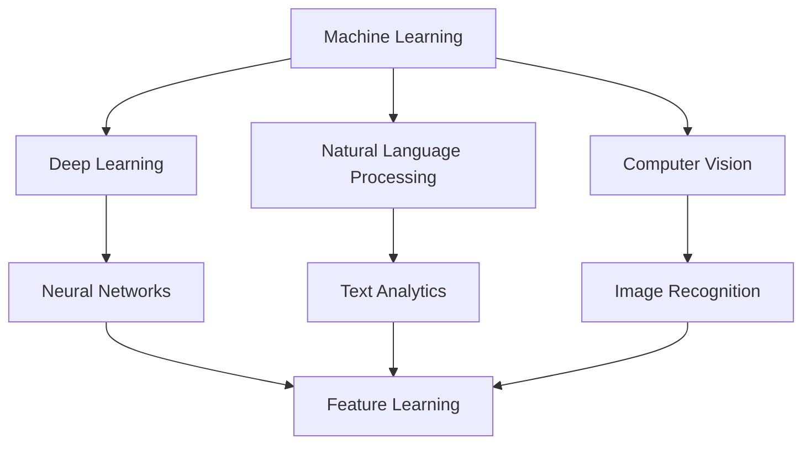
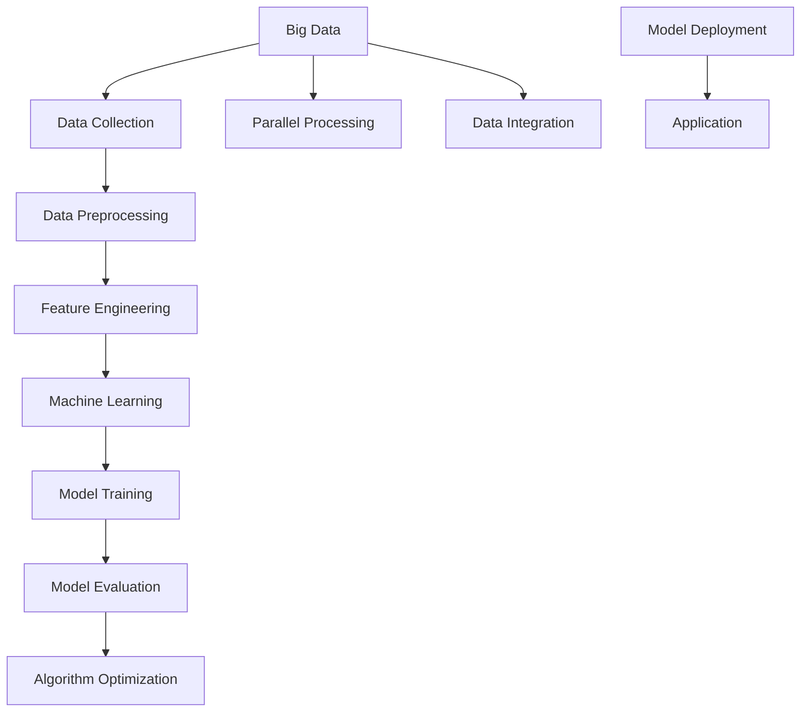

                 

### 1. 背景介绍

#### 1.1 目的和范围

本文旨在探讨大数据对人工智能学习的影响，解析大数据如何塑造AI模型训练、优化和评估的各个环节。我们将从大数据的定义和特性出发，逐步探讨其在人工智能中的具体应用，最终总结大数据与AI融合带来的机遇与挑战。

本文将涵盖以下内容：

- 大数据的定义、特性和发展历程
- 人工智能与大数据的关系
- 大数据对AI学习的影响
- 实际应用场景
- 未来发展趋势与挑战

通过本文的阅读，读者将深入了解大数据对AI学习的深刻影响，为未来的研究和应用提供理论指导和实践参考。

#### 1.2 预期读者

本文面向对人工智能和大数据感兴趣的读者，包括：

- 数据科学家和AI工程师
- 人工智能和大数据专业的学生和研究人员
- 对技术趋势和行业应用感兴趣的IT从业者
- 对AI和大数据潜在价值的投资者和企业家

无论您是初学者还是专家，本文都将为您带来有价值的信息和见解。

#### 1.3 文档结构概述

本文结构如下：

1. **背景介绍**：介绍本文的目的、范围、预期读者和文档结构。
2. **核心概念与联系**：阐述大数据和人工智能的核心概念，并通过Mermaid流程图展示其关联。
3. **核心算法原理 & 具体操作步骤**：讲解AI模型在大数据环境下的训练和优化算法，并使用伪代码详细描述。
4. **数学模型和公式 & 详细讲解 & 举例说明**：介绍与大数据AI学习相关的数学模型和公式，并进行具体案例分析。
5. **项目实战：代码实际案例和详细解释说明**：通过实际项目展示大数据AI学习的应用，详细解读代码实现。
6. **实际应用场景**：探讨大数据AI学习在各个领域的应用案例。
7. **工具和资源推荐**：推荐学习资源、开发工具和框架。
8. **总结：未来发展趋势与挑战**：总结本文内容，展望大数据与AI融合的未来。
9. **附录：常见问题与解答**：解答读者可能遇到的问题。
10. **扩展阅读 & 参考资料**：提供进一步阅读的资料。

#### 1.4 术语表

为了确保文章内容的准确性和一致性，本文将使用以下术语：

##### 1.4.1 核心术语定义

- **大数据**：指数据量巨大、类型多样、处理速度要求高的数据集合。
- **人工智能**：指通过计算机模拟人类智能的过程和系统。
- **机器学习**：一种人工智能的子领域，通过数据和算法让计算机自主学习和改进。
- **深度学习**：一种机器学习方法，利用多层神经网络进行特征学习和模式识别。
- **特征工程**：指从数据中提取有助于模型训练的特征的过程。
- **算法优化**：通过调整算法参数，提高模型性能的过程。

##### 1.4.2 相关概念解释

- **数据预处理**：在机器学习过程中，对数据进行清洗、转换和归一化的步骤。
- **模型评估**：通过测试数据集评估模型性能的过程。
- **交叉验证**：将数据集分为多个子集，用于训练和验证模型的方法。
- **梯度下降**：一种用于优化机器学习模型的算法，通过不断调整模型参数，使其误差最小化。
- **分布式计算**：将计算任务分布在多台计算机上执行，以提高计算速度和处理能力。

##### 1.4.3 缩略词列表

- **AI**：人工智能
- **ML**：机器学习
- **DL**：深度学习
- **Hadoop**：一个分布式数据处理框架
- **Spark**：一个分布式数据处理引擎
- **TensorFlow**：一个开源深度学习框架
- **PyTorch**：一个开源深度学习框架

通过上述术语表，读者可以更好地理解本文中的专业术语和概念，为后续内容的阅读打下基础。

### 2. 核心概念与联系

在大数据与人工智能（AI）的融合中，理解核心概念和它们之间的联系至关重要。以下我们将详细阐述大数据和人工智能的核心概念，并通过Mermaid流程图展示它们之间的相互关联。

#### 2.1 大数据的核心概念

大数据通常具有四个V特征，即：

- **Volume（数据量）**：大数据涉及的数据量非常庞大，可能达到TB甚至PB级别。
- **Velocity（数据流速度）**：大数据的处理速度要求很高，通常需要在短时间内处理海量数据。
- **Variety（数据多样性）**：大数据不仅包括结构化数据，还包括半结构化和非结构化数据，如文本、图像、音频等。
- **Veracity（数据真实性）**：大数据的真实性和可靠性对分析结果至关重要。

下图展示了大数据的核心概念：



#### 2.2 人工智能的核心概念

人工智能（AI）的核心概念包括：

- **机器学习（ML）**：通过数据训练模型，使其具备预测和决策能力。
- **深度学习（DL）**：一种特殊的机器学习方法，通过多层神经网络进行特征学习和模式识别。
- **自然语言处理（NLP）**：研究如何让计算机理解、生成和处理人类语言。
- **计算机视觉（CV）**：使计算机能够识别和理解图像和视频。

下图展示了人工智能的核心概念及其相互关联：



#### 2.3 大数据与人工智能的关联

大数据和人工智能之间的关联主要体现在以下几个方面：

1. **数据驱动的AI模型训练**：大数据提供了丰富的训练数据，使得AI模型能够进行有效的学习和优化。
2. **分布式计算与并行处理**：大数据处理需要高效的计算资源，分布式计算和并行处理技术能够提高数据处理速度。
3. **数据预处理与特征工程**：大数据的质量直接影响AI模型的性能，数据预处理和特征工程是提高模型性能的关键环节。
4. **模型评估与优化**：大数据提供了丰富的测试数据，用于评估AI模型的性能，并进行算法优化。

下图展示了大数据与人工智能之间的关联：



通过上述核心概念与联系的阐述，我们可以更深入地理解大数据和人工智能在各自领域的重要性，以及它们如何相互促进、共同发展。

### 3. 核心算法原理 & 具体操作步骤

在理解了大数据和人工智能的基本概念及其相互关联后，接下来我们将深入探讨大数据环境下人工智能模型训练和优化的核心算法原理。这些算法在大数据环境中表现出色，能够有效地处理海量数据，从而提高模型的性能和效率。

#### 3.1 梯度下降算法原理

梯度下降（Gradient Descent）是一种优化算法，用于最小化目标函数的损失值。在大数据环境中，梯度下降算法被广泛应用于机器学习和深度学习模型的训练。以下是梯度下降算法的基本原理：

##### 3.1.1 梯度下降算法原理

梯度下降算法的核心思想是通过迭代计算目标函数的梯度，并沿梯度的反方向更新模型参数，以逐渐减小损失值。具体步骤如下：

1. **初始化参数**：随机初始化模型参数。
2. **计算损失值**：使用训练数据计算模型预测值和实际标签之间的损失值。
3. **计算梯度**：计算损失值关于模型参数的梯度。
4. **更新参数**：根据梯度方向和步长更新模型参数。
5. **重复步骤2-4**，直到满足停止条件（如损失值趋于稳定或达到预设迭代次数）。

以下是梯度下降算法的伪代码：

```python
初始化模型参数 W
设置学习率 α 和迭代次数 n
对于 i 从 1 到 n：
  计算预测值 ŷ = f(W, x)
  计算损失值 L = loss(ŷ, y)
  计算梯度 ΔW = ∇L(W)
  更新参数 W = W - α * ΔW
返回模型参数 W
```

##### 3.1.2 梯度下降算法在大数据环境中的应用

在大数据环境中，梯度下降算法面临着数据量大、计算复杂度高的挑战。为此，可以采用以下几种策略：

- **小批量梯度下降**：每次迭代只使用一部分训练数据进行梯度计算，以减少计算量。
- **随机梯度下降（SGD）**：每次迭代随机选择一个训练样本进行梯度计算，以加快收敛速度。
- **批量随机梯度下降（MBGD）**：每次迭代随机选择多个训练样本进行梯度计算，以平衡计算量和稳定性。

下面是随机梯度下降（SGD）的伪代码：

```python
初始化模型参数 W
设置学习率 α 和迭代次数 n
对于 i 从 1 到 n：
  随机选择一个训练样本 (x_i, y_i)
  计算预测值 ŷ_i = f(W, x_i)
  计算损失值 L_i = loss(ŷ_i, y_i)
  计算梯度 ΔW = ∇L(W)
  更新参数 W = W - α * ΔW
返回模型参数 W
```

通过上述算法原理和具体操作步骤，我们可以看到梯度下降算法在大数据环境下的应用优势和优化策略。接下来，我们将探讨另一种在大数据环境中常用的算法——深度学习。

#### 3.2 深度学习算法原理

深度学习（Deep Learning）是人工智能的一个子领域，通过多层神经网络进行特征学习和模式识别。深度学习算法在大数据环境中表现出色，能够自动提取复杂特征，提高模型的准确性和鲁棒性。

##### 3.2.1 深度学习算法原理

深度学习算法的核心是神经网络（Neural Network），尤其是多层感知机（Multilayer Perceptron，MLP）。神经网络由多个神经元（节点）和连接（边）组成，每个神经元接收来自前一层神经元的输入，通过激活函数进行非线性变换，产生输出。

以下是多层感知机（MLP）的基本原理：

1. **输入层**：接收外部输入数据。
2. **隐藏层**：对输入数据进行特征提取和变换。
3. **输出层**：产生最终输出。

每个神经元通过权重（weights）和偏置（bias）与相邻层神经元连接，通过以下公式计算输出：

$$
z = \sum_{j=1}^{n} w_{ji}x_{j} + b_{i}
$$

其中，$z$ 是输出，$w_{ji}$ 是权重，$x_{j}$ 是输入，$b_{i}$ 是偏置。

激活函数（Activation Function）用于引入非线性特性，常见的激活函数包括：

- **Sigmoid函数**：$$ \sigma(z) = \frac{1}{1 + e^{-z}} $$
- **ReLU函数**：$$ \text{ReLU}(z) = \max(0, z) $$
- **Tanh函数**：$$ \tanh(z) = \frac{e^{z} - e^{-z}}{e^{z} + e^{-z}} $$

以下是多层感知机（MLP）的伪代码：

```python
初始化模型参数 W 和 b
设置学习率 α 和迭代次数 n
对于 i 从 1 到 n：
  对于每个隐藏层 l：
    对于每个神经元 i：
      计算输入 z = \sum_{j=1}^{n} w_{ji}x_{j} + b_{i}
      计算输出 a = \sigma(z)
  对于每个输出层神经元 i：
    计算预测值 ŷ = \sum_{j=1}^{n} w_{ji}a_{j} + b_{i}
    计算损失值 L = loss(ŷ, y)
    计算梯度 ΔW = ∇L(W)
    更新参数 W = W - α * ΔW
返回模型参数 W
```

##### 3.2.2 深度学习算法在大数据环境中的应用

深度学习算法在大数据环境中具有以下优势：

- **自动特征提取**：深度学习模型能够自动从原始数据中提取复杂特征，减少人工特征工程的工作量。
- **高可扩展性**：深度学习框架支持分布式计算和并行处理，能够高效地处理海量数据。
- **高准确性**：深度学习模型在图像识别、自然语言处理等任务中表现出色，准确率远高于传统机器学习模型。

然而，深度学习算法也存在一些挑战，如：

- **模型训练时间长**：深度学习模型需要大量数据进行训练，耗时较长。
- **资源消耗大**：深度学习模型对计算资源和存储资源的需求较高。

为了解决这些问题，可以采用以下策略：

- **数据增强**：通过数据增强技术增加训练数据量，提高模型鲁棒性。
- **迁移学习**：利用预训练模型进行迁移学习，减少训练时间。
- **模型压缩**：采用模型压缩技术，如量化、剪枝等，降低模型复杂度和计算资源需求。

通过上述对梯度下降算法和深度学习算法的详细阐述，我们可以看到大数据环境对人工智能算法的挑战和机遇。接下来，我们将进一步探讨大数据与人工智能融合的数学模型和公式。

### 4. 数学模型和公式 & 详细讲解 & 举例说明

在大数据和人工智能的融合中，数学模型和公式扮演着至关重要的角色。它们不仅帮助我们理解数据背后的规律，还能够指导算法的设计和优化。以下我们将详细介绍与大数据AI学习相关的数学模型和公式，并通过具体例子进行讲解。

#### 4.1 常见数学模型

在大数据AI学习中，常见的数学模型包括线性回归、逻辑回归、支持向量机（SVM）和神经网络等。

##### 4.1.1 线性回归

线性回归是一种简单的机器学习模型，用于预测数值型目标变量。其数学模型可以表示为：

$$
y = \beta_0 + \beta_1x_1 + \beta_2x_2 + ... + \beta_nx_n + \epsilon
$$

其中，$y$ 是目标变量，$x_1, x_2, ..., x_n$ 是特征变量，$\beta_0, \beta_1, \beta_2, ..., \beta_n$ 是模型参数，$\epsilon$ 是误差项。

线性回归的优化目标是最小化误差项的平方和：

$$
\min_{\beta} \sum_{i=1}^{n} (y_i - (\beta_0 + \beta_1x_{i1} + \beta_2x_{i2} + ... + \beta_nx_{in}))^2
$$

##### 4.1.2 逻辑回归

逻辑回归是一种用于分类问题的机器学习模型，其数学模型可以表示为：

$$
\ln(\frac{p}{1-p}) = \beta_0 + \beta_1x_1 + \beta_2x_2 + ... + \beta_nx_n
$$

其中，$p$ 是目标变量属于某一类别的概率，$\beta_0, \beta_1, \beta_2, ..., \beta_n$ 是模型参数。

逻辑回归的优化目标是最大化似然函数：

$$
\max_{\beta} \prod_{i=1}^{n} \pi(y_i|x_i)
$$

其中，$\pi(y_i|x_i)$ 是在给定特征 $x_i$ 下，目标变量 $y_i$ 属于某一类别的概率。

##### 4.1.3 支持向量机（SVM）

支持向量机是一种有效的分类模型，其数学模型可以表示为：

$$
\max_{\beta, \xi} \frac{1}{2} ||\beta||^2 - C \sum_{i=1}^{n} \xi_i
$$

其中，$||\beta||^2$ 是模型参数的范数，$C$ 是惩罚参数，$\xi_i$ 是松弛变量。

支持向量机的优化目标是找到最佳分类边界，使得分类间隔最大化，同时容忍一定的分类错误。

##### 4.1.4 神经网络

神经网络是一种复杂的机器学习模型，其数学模型可以表示为：

$$
a_{l} = \sigma(\sum_{i=1}^{n} w_{li}a_{l-1} + b_l)
$$

其中，$a_l$ 是第 $l$ 层神经元的激活值，$\sigma$ 是激活函数，$w_{li}$ 是连接权重，$b_l$ 是偏置。

神经网络的优化目标是调整模型参数，使得损失函数最小化。

#### 4.2 举例说明

为了更好地理解上述数学模型，我们通过一个具体的例子进行讲解。

假设我们有一个简单的线性回归问题，目标变量 $y$ 与特征变量 $x$ 之间存在线性关系：

$$
y = \beta_0 + \beta_1x + \epsilon
$$

我们的任务是找到最佳模型参数 $\beta_0$ 和 $\beta_1$，以最小化误差项的平方和。

以下是具体的计算步骤：

1. **数据准备**：收集一组数据，包括特征变量 $x$ 和目标变量 $y$。
2. **初始化参数**：随机初始化模型参数 $\beta_0$ 和 $\beta_1$。
3. **计算损失函数**：对于每个数据点，计算预测值 $y_i' = \beta_0 + \beta_1x_i$ 和实际值 $y_i$，然后计算误差项 $e_i = y_i - y_i'$。
4. **计算梯度**：计算损失函数关于参数 $\beta_0$ 和 $\beta_1$ 的梯度。
5. **更新参数**：根据梯度方向和步长更新参数 $\beta_0$ 和 $\beta_1$。
6. **重复步骤3-5**，直到满足停止条件（如损失函数趋于稳定或达到预设迭代次数）。

以下是梯度下降算法的伪代码：

```python
初始化模型参数 β0 和 β1
设置学习率 α 和迭代次数 n
对于 i 从 1 到 n：
  计算预测值 ŷi = β0 + β1xi
  计算误差项 ei = yi - ŷi
  计算梯度 Δβ0 = -2/n * Σ(ei)
  计算梯度 Δβ1 = -2/n * Σ(ei * xi)
  更新参数 β0 = β0 - α * Δβ0
  更新参数 β1 = β1 - α * Δβ1
返回模型参数 β0 和 β1
```

通过上述例子，我们可以看到如何使用梯度下降算法优化线性回归模型。类似的方法可以应用于其他机器学习模型，如逻辑回归、支持向量机和神经网络。

#### 4.3 深度学习中的数学模型

在深度学习中，数学模型的应用更为广泛和复杂。以下我们将介绍深度学习中常用的几个数学模型。

##### 4.3.1 深度学习模型结构

深度学习模型通常由多个层组成，包括输入层、隐藏层和输出层。每一层由多个神经元组成，神经元之间通过权重和偏置进行连接。深度学习模型的数学模型可以表示为：

$$
a_{l} = \sigma(\sum_{i=1}^{n} w_{li}a_{l-1} + b_l)
$$

其中，$a_l$ 是第 $l$ 层神经元的激活值，$\sigma$ 是激活函数，$w_{li}$ 是连接权重，$b_l$ 是偏置。

##### 4.3.2 反向传播算法

反向传播算法是深度学习模型训练的核心算法，用于更新模型参数，以最小化损失函数。反向传播算法的基本原理是计算损失函数关于模型参数的梯度，并沿梯度方向更新参数。

以下是反向传播算法的基本步骤：

1. **前向传播**：计算输入层到输出层的中间变量和最终输出。
2. **计算损失函数**：计算损失函数关于输出层的梯度。
3. **反向传播**：从输出层开始，逐层计算损失函数关于隐藏层和输入层的梯度。
4. **参数更新**：根据梯度方向和步长更新模型参数。
5. **重复步骤1-4**，直到满足停止条件（如损失函数趋于稳定或达到预设迭代次数）。

以下是反向传播算法的伪代码：

```python
初始化模型参数 W 和 b
设置学习率 α 和迭代次数 n
对于 i 从 1 到 n：
  对于每个隐藏层 l：
    对于每个神经元 i：
      计算输入 z = \sum_{j=1}^{n} w_{ji}a_{j-1} + b_{i}
      计算输出 a = \sigma(z)
  对于每个输出层神经元 i：
    计算预测值 ŷ = \sum_{j=1}^{n} w_{ji}a_{j} + b_{i}
    计算误差 e = y - ŷ
    计算梯度 Δw = e * a_{l-1}
    更新参数 w = w - α * Δw
返回模型参数 W 和 b
```

通过上述数学模型和公式，我们可以看到深度学习模型在处理大数据方面的强大能力。接下来，我们将通过实际项目展示如何在大数据环境中应用这些算法和模型。

### 5. 项目实战：代码实际案例和详细解释说明

在本节中，我们将通过一个实际项目案例，详细展示如何在大数据环境中应用大数据与人工智能的算法和模型。我们将使用Python编程语言和TensorFlow深度学习框架，实现一个简单的图像分类任务。

#### 5.1 开发环境搭建

在开始项目之前，我们需要搭建合适的开发环境。以下是所需的软件和工具：

- Python 3.x
- TensorFlow 2.x
- Jupyter Notebook 或 PyCharm
- NVIDIA GPU（可选，用于加速深度学习训练）

首先，安装Python和Jupyter Notebook或PyCharm。然后，使用以下命令安装TensorFlow：

```bash
pip install tensorflow
```

如果使用GPU加速，还需要安装CUDA和cuDNN。安装完成后，确保环境变量配置正确，以便TensorFlow能够识别GPU。

#### 5.2 源代码详细实现和代码解读

以下是一个简单的图像分类项目的代码实现：

```python
import tensorflow as tf
from tensorflow.keras import layers, models
import numpy as np
import matplotlib.pyplot as plt

# 数据预处理
def preprocess_data(images, labels):
    images = images / 255.0
    labels = tf.keras.utils.to_categorical(labels, num_classes=10)
    return images, labels

# 构建模型
def create_model():
    model = models.Sequential()
    model.add(layers.Conv2D(32, (3, 3), activation='relu', input_shape=(28, 28, 1)))
    model.add(layers.MaxPooling2D((2, 2)))
    model.add(layers.Conv2D(64, (3, 3), activation='relu'))
    model.add(layers.MaxPooling2D((2, 2)))
    model.add(layers.Conv2D(64, (3, 3), activation='relu'))
    model.add(layers.Flatten())
    model.add(layers.Dense(64, activation='relu'))
    model.add(layers.Dense(10, activation='softmax'))
    return model

# 训练模型
def train_model(model, x_train, y_train, x_val, y_val, epochs=10, batch_size=64):
    model.compile(optimizer='adam', loss='categorical_crossentropy', metrics=['accuracy'])
    history = model.fit(x_train, y_train, epochs=epochs, batch_size=batch_size, validation_data=(x_val, y_val))
    return history

# 主函数
def main():
    # 加载数据
    (x_train, y_train), (x_test, y_test) = tf.keras.datasets.mnist.load_data()
    
    # 预处理数据
    x_train, y_train = preprocess_data(x_train, y_train)
    x_test, y_test = preprocess_data(x_test, y_test)
    
    # 数据增强
    x_train = tf.image.resize(x_train, [32, 32])
    x_test = tf.image.resize(x_test, [32, 32])
    
    # 划分训练集和验证集
    x_val = x_train[10000:]
    y_val = y_train[10000:]
    x_train = x_train[:10000]
    y_train = y_train[:10000]
    
    # 创建模型
    model = create_model()
    
    # 训练模型
    history = train_model(model, x_train, y_train, x_val, y_val, epochs=10)
    
    # 模型评估
    test_loss, test_acc = model.evaluate(x_test, y_test)
    print(f"Test accuracy: {test_acc:.4f}")
    
    # 可视化训练过程
    plt.plot(history.history['accuracy'], label='accuracy')
    plt.plot(history.history['val_accuracy'], label='val_accuracy')
    plt.xlabel('Epoch')
    plt.ylabel('Accuracy')
    plt.legend()
    plt.show()

# 运行主函数
if __name__ == "__main__":
    main()
```

#### 5.3 代码解读与分析

1. **数据预处理**：
   ```python
   def preprocess_data(images, labels):
       images = images / 255.0
       labels = tf.keras.utils.to_categorical(labels, num_classes=10)
       return images, labels
   ```

   在这个函数中，我们首先将图像数据除以255，将像素值归一化到[0, 1]范围内。然后，我们将标签数据转换为one-hot编码，以便于后续模型的训练和评估。

2. **构建模型**：
   ```python
   def create_model():
       model = models.Sequential()
       model.add(layers.Conv2D(32, (3, 3), activation='relu', input_shape=(28, 28, 1)))
       model.add(layers.MaxPooling2D((2, 2)))
       model.add(layers.Conv2D(64, (3, 3), activation='relu'))
       model.add(layers.MaxPooling2D((2, 2)))
       model.add(layers.Conv2D(64, (3, 3), activation='relu'))
       model.add(layers.Flatten())
       model.add(layers.Dense(64, activation='relu'))
       model.add(layers.Dense(10, activation='softmax'))
       return model
   ```

   在这个函数中，我们定义了一个简单的卷积神经网络（CNN）模型。模型包括两个卷积层和两个池化层，用于提取图像特征。然后，通过一个全连接层进行分类。最后，使用softmax函数输出概率分布。

3. **训练模型**：
   ```python
   def train_model(model, x_train, y_train, x_val, y_val, epochs=10, batch_size=64):
       model.compile(optimizer='adam', loss='categorical_crossentropy', metrics=['accuracy'])
       history = model.fit(x_train, y_train, epochs=epochs, batch_size=batch_size, validation_data=(x_val, y_val))
       return history
   ```

   在这个函数中，我们使用`compile`方法配置模型优化器、损失函数和评估指标。然后，使用`fit`方法进行模型训练，并在每个 epoch 后保存训练和验证集的准确率。

4. **主函数**：
   ```python
   def main():
       # 加载数据
       (x_train, y_train), (x_test, y_test) = tf.keras.datasets.mnist.load_data()
       
       # 预处理数据
       x_train, y_train = preprocess_data(x_train, y_train)
       x_test, y_test = preprocess_data(x_test, y_test)
       
       # 数据增强
       x_train = tf.image.resize(x_train, [32, 32])
       x_test = tf.image.resize(x_test, [32, 32])
       
       # 划分训练集和验证集
       x_val = x_train[10000:]
       y_val = y_train[10000:]
       x_train = x_train[:10000]
       y_train = y_train[:10000]
       
       # 创建模型
       model = create_model()
       
       # 训练模型
       history = train_model(model, x_train, y_train, x_val, y_val, epochs=10)
       
       # 模型评估
       test_loss, test_acc = model.evaluate(x_test, y_test)
       print(f"Test accuracy: {test_acc:.4f}")
       
       # 可视化训练过程
       plt.plot(history.history['accuracy'], label='accuracy')
       plt.plot(history.history['val_accuracy'], label='val_accuracy')
       plt.xlabel('Epoch')
       plt.ylabel('Accuracy')
       plt.legend()
       plt.show()
   ```

   在主函数中，我们首先加载数据集，然后进行预处理和数据增强。接着，划分训练集和验证集，创建模型并训练。最后，评估模型在测试集上的性能，并可视化训练过程。

通过上述代码实现，我们可以看到如何在大数据环境中使用TensorFlow实现图像分类任务。接下来，我们将探讨大数据AI学习在实际应用场景中的表现。

### 6. 实际应用场景

大数据AI学习在众多领域展现出强大的应用潜力，为各行业带来了深远的变革。以下我们将探讨大数据AI学习在图像识别、自然语言处理和推荐系统等领域的实际应用场景。

#### 6.1 图像识别

图像识别是大数据AI学习最经典的应用之一。通过深度学习算法，尤其是卷积神经网络（CNN），我们可以从海量图像数据中提取特征，实现高效的图像分类和识别。以下是一些实际应用场景：

1. **医疗影像诊断**：利用大数据AI学习，可以对医学影像（如X光片、CT扫描、MRI图像等）进行自动诊断，辅助医生进行疾病检测和病情分析，提高诊断准确率和效率。
2. **安防监控**：在安防监控领域，大数据AI学习可以实时识别和追踪监控视频中的异常行为，如违规停车、交通违规、打架斗殴等，有效提高公共安全。
3. **人脸识别**：人脸识别技术广泛应用于身份验证、门禁控制和人脸支付等领域，通过大数据AI学习，可以实现高准确度的人脸识别，提高安全性。

#### 6.2 自然语言处理

自然语言处理（NLP）是大数据AI学习的另一个重要应用领域。通过深度学习算法，我们可以对大规模文本数据进行分析和处理，实现自然语言的理解、生成和翻译。以下是一些实际应用场景：

1. **智能客服**：智能客服系统通过大数据AI学习，可以理解用户的语言和意图，提供个性化的服务和建议，提高客户满意度和服务效率。
2. **自动摘要与生成**：大数据AI学习可以自动生成文章摘要、新闻简报和报告，为企业和媒体节省大量时间和人力成本。
3. **机器翻译**：机器翻译技术通过大数据AI学习，可以实时翻译多种语言，为跨国交流和商务活动提供便利。

#### 6.3 推荐系统

推荐系统是大数据AI学习在电子商务、社交媒体和在线娱乐等领域的典型应用。通过分析用户行为数据，推荐系统可以智能地推荐商品、内容和服务，提高用户体验和满意度。以下是一些实际应用场景：

1. **电子商务推荐**：电子商务平台通过大数据AI学习，可以分析用户的购物习惯和偏好，智能推荐相关商品，提高销售额和用户粘性。
2. **社交媒体推荐**：社交媒体平台通过大数据AI学习，可以分析用户的互动行为和关注内容，智能推荐感兴趣的内容和用户，促进社区活跃度和用户参与度。
3. **在线娱乐推荐**：在线娱乐平台通过大数据AI学习，可以分析用户的观看历史和偏好，智能推荐视频、音乐和游戏，提高用户满意度和留存率。

通过以上实际应用场景，我们可以看到大数据AI学习在各个领域的广泛应用和深远影响。随着技术的不断进步，大数据AI学习将继续为各行业带来更多的创新和变革。

### 7. 工具和资源推荐

在深入探讨大数据AI学习的过程中，选择合适的工具和资源对于提高学习效果和项目开发效率至关重要。以下我们将推荐一些学习资源、开发工具和框架，以帮助读者更好地掌握大数据AI技术。

#### 7.1 学习资源推荐

**7.1.1 书籍推荐**

1. **《深度学习》（Deep Learning）**：由Ian Goodfellow、Yoshua Bengio和Aaron Courville合著，是一本关于深度学习领域的经典教材，详细介绍了深度学习的基础理论和应用案例。
2. **《大数据技术导论》（Big Data: A Revolution That Will Transform How We Live, Work, and Think）**：由Viktor Mayer-Schönberger和Kenneth Cukier合著，全面介绍了大数据的概念、技术和发展趋势。
3. **《机器学习》（Machine Learning）**：由Tom Mitchell著，是一本关于机器学习领域的基础教材，涵盖了机器学习的核心算法和应用场景。

**7.1.2 在线课程**

1. **斯坦福大学深度学习课程**：由Andrew Ng教授开设的深度学习课程，内容涵盖了深度学习的基础理论、算法和应用，是学习深度学习的重要资源。
2. **Udacity的《大数据工程师纳米学位》**：通过一系列课程和项目，系统性地介绍了大数据技术的各个方面，包括Hadoop、Spark和机器学习等。
3. **Coursera的《自然语言处理与深度学习》**：由Daniel Jurafsky和Chris Manning教授开设，内容涵盖了自然语言处理的基础知识和深度学习在NLP中的应用。

**7.1.3 技术博客和网站**

1. **Towards Data Science**：一个涵盖大数据、机器学习和数据科学等多个领域的博客，提供了大量高质量的技术文章和教程。
2. **GitHub**：一个开源代码托管平台，可以找到大量优秀的开源项目和代码示例，有助于学习和实践大数据AI技术。
3. **DataCamp**：一个提供互动式学习的平台，涵盖了数据科学、机器学习和大数据等多个领域，适合初学者和进阶者。

#### 7.2 开发工具框架推荐

**7.2.1 IDE和编辑器**

1. **Jupyter Notebook**：一个基于Web的交互式计算环境，适用于数据科学和机器学习项目，支持多种编程语言和库。
2. **PyCharm**：一个功能强大的Python IDE，提供了丰富的开发工具和插件，适合专业开发人员使用。
3. **Visual Studio Code**：一个轻量级的跨平台代码编辑器，支持多种编程语言和框架，适用于大数据AI学习。

**7.2.2 调试和性能分析工具**

1. **TensorBoard**：一个基于Web的TensorFlow可视化工具，可以实时监控模型的训练过程和性能指标，有助于调试和优化模型。
2. **Profiling Tools**：如Python的cProfile、py-spy和pyramid等，可以用于分析代码的性能瓶颈，优化程序运行效率。
3. **Docker**：一个开源的应用容器引擎，可以将开发环境打包成容器，提高项目的可移植性和可扩展性。

**7.2.3 相关框架和库**

1. **TensorFlow**：一个开源的深度学习框架，适用于大数据AI学习和项目开发。
2. **PyTorch**：一个开源的深度学习框架，与TensorFlow类似，具有灵活的动态计算图，适用于研究和应用开发。
3. **Scikit-learn**：一个开源的机器学习库，提供了多种经典的机器学习算法和工具，适用于数据分析和模型训练。
4. **Pandas**：一个开源的数据分析库，提供了丰富的数据操作和数据处理功能，适用于大数据处理和分析。

通过以上工具和资源的推荐，读者可以更好地掌握大数据AI技术，为项目开发提供有力支持。

### 7.3 相关论文著作推荐

在探索大数据AI学习的道路上，阅读相关论文和著作是提高专业水平的重要途径。以下我们将推荐一些经典论文、最新研究成果和应用案例分析，以帮助读者深入了解大数据AI领域的最新动态和发展趋势。

**7.3.1 经典论文**

1. **“Deep Learning”**：由Ian Goodfellow等人撰写的经典论文，详细介绍了深度学习的基本原理、算法和应用。
2. **“Large Scale Visualization of the Netflix Prize Data Set”**：本文探讨了如何使用大数据技术对Netflix Prize数据集进行可视化分析，为数据科学家提供了宝贵的实践经验。
3. **“The Hundred-Page Machine Learning Book”**：这是一本简洁的机器学习入门书籍，由Andriy Burkov撰写，内容涵盖了机器学习的基础知识和实用技巧。

**7.3.2 最新研究成果**

1. **“BERT: Pre-training of Deep Bidirectional Transformers for Language Understanding”**：本文介绍了BERT（双向转换器预训练）模型，是自然语言处理领域的重要突破。
2. **“Distributed Representations of Words and Phrases and Their Compositional Meaning”**：本文探讨了词向量和短语表示的分布式表示方法，为自然语言处理提供了强有力的技术支持。
3. **“Adaptive Computation Time for Gradient Descent”**：本文提出了自适应计算时间梯度下降算法，为大数据AI学习中的模型训练提供了新的优化策略。

**7.3.3 应用案例分析**

1. **“A Brief Introduction to Deep Learning”**：本文通过案例分析，介绍了深度学习在计算机视觉、自然语言处理和推荐系统等领域的实际应用。
2. **“Machine Learning in Automated Driving”**：本文探讨了机器学习在自动驾驶领域的应用，分析了自动驾驶技术的挑战和解决方案。
3. **“Data-Driven Energy Management for Autonomous Electric Vehicles”**：本文研究了大数据AI学习在电动汽车能源管理中的应用，为智能交通系统提供了新思路。

通过阅读这些论文和著作，读者可以了解大数据AI学习的最新研究动态和前沿技术，为自身的学术研究和项目开发提供理论指导和实践参考。

### 8. 总结：未来发展趋势与挑战

随着大数据和人工智能技术的快速发展，大数据对AI学习的影响日益显著。本文从背景介绍、核心概念与联系、核心算法原理、数学模型和公式、项目实战、实际应用场景、工具和资源推荐以及未来发展趋势等多个方面，详细探讨了大数据与AI融合的深刻影响。

**未来发展趋势**：

1. **算法优化**：在大数据环境下，算法优化将继续是研究的重点。通过改进现有算法或开发新型算法，提高AI模型的训练速度和性能。
2. **分布式计算**：分布式计算和并行处理技术将得到广泛应用，以应对大数据处理的高性能需求。云计算、边缘计算等新兴技术将发挥重要作用。
3. **数据隐私与安全**：随着数据隐私和安全问题的日益突出，如何在确保数据安全的前提下进行大数据AI学习，将成为研究的重要方向。
4. **多模态数据融合**：未来的大数据AI学习将越来越多地涉及多模态数据（如文本、图像、音频等）的融合处理，实现更全面和智能的数据分析。

**挑战**：

1. **数据质量**：大数据的质量直接影响AI模型的性能。如何有效处理噪声数据、缺失数据和异常数据，是当前面临的挑战。
2. **计算资源**：大数据AI学习对计算资源的需求较高，如何在有限的计算资源下进行高效训练，是亟待解决的问题。
3. **算法可解释性**：随着AI模型的复杂性增加，如何提高算法的可解释性，使其更易于理解和接受，是当前研究的热点问题。

总之，大数据与AI融合将继续推动人工智能领域的发展，为各行业带来深刻的变革。通过不断优化算法、提高数据处理能力、确保数据质量和安全，我们可以期待大数据AI学习在未来的更广泛应用和突破。

### 9. 附录：常见问题与解答

在深入探讨大数据与AI融合的过程中，读者可能会遇到一些常见问题。以下我们针对这些问题提供解答。

**Q1**：大数据AI学习的核心算法有哪些？

A1：大数据AI学习的核心算法包括梯度下降算法、随机梯度下降（SGD）和深度学习算法（如卷积神经网络（CNN）、循环神经网络（RNN）等）。这些算法在大数据环境中用于模型训练和优化。

**Q2**：如何处理大数据中的噪声数据？

A2：处理大数据中的噪声数据可以通过以下方法：

- **数据清洗**：通过数据预处理技术，如去重、填充缺失值和去除异常值，提高数据质量。
- **降噪算法**：采用降噪算法（如高斯降噪、均值降噪等）对噪声数据进行滤波处理。
- **异常检测**：通过异常检测算法（如孤立森林、孤立系数等）识别和标记异常数据。

**Q3**：如何确保大数据AI学习过程中的数据隐私和安全？

A3：确保大数据AI学习过程中的数据隐私和安全可以通过以下措施：

- **数据加密**：对敏感数据进行加密处理，确保数据在传输和存储过程中不被窃取或篡改。
- **数据匿名化**：对个人身份信息进行匿名化处理，降低数据泄露风险。
- **隐私保护算法**：采用差分隐私、同态加密等隐私保护算法，确保算法在数据处理过程中保护用户隐私。

**Q4**：大数据AI学习中的模型评估方法有哪些？

A4：大数据AI学习中的模型评估方法包括：

- **准确率**：模型预测正确的样本数占总样本数的比例。
- **召回率**：模型预测正确的正样本数占总正样本数的比例。
- **精确率**：模型预测正确的正样本数占预测为正样本的样本数的比例。
- **F1值**：精确率和召回率的调和平均值，用于综合评估模型性能。

**Q5**：如何优化大数据AI学习中的模型性能？

A5：优化大数据AI学习中的模型性能可以通过以下方法：

- **数据增强**：通过数据增强技术增加训练数据量，提高模型鲁棒性。
- **超参数调优**：通过调整学习率、批量大小等超参数，优化模型性能。
- **模型压缩**：采用模型压缩技术（如量化、剪枝等），降低模型复杂度和计算资源需求。

通过以上常见问题的解答，希望读者能够更好地理解大数据与AI融合的原理和应用，为未来的研究和实践提供参考。

### 10. 扩展阅读 & 参考资料

为了深入探讨大数据与AI融合的各个方面，以下我们提供一些扩展阅读和参考资料，以帮助读者进一步了解该领域的最新动态和研究进展。

**扩展阅读**：

1. **《大数据时代：生活、工作与思维的大变革》**：作者维克托·迈尔-舍恩伯格，详细介绍了大数据的概念、技术和应用。
2. **《人工智能：一种现代的方法》**：作者Stuart Russell和Peter Norvig，全面介绍了人工智能的基础理论和应用。
3. **《深度学习：从线性模型到深度神经网络》**：作者Goodfellow、Bengio和Courville，深入讲解了深度学习的基础知识和算法。

**参考资料**：

1. **TensorFlow官方文档**：[https://www.tensorflow.org](https://www.tensorflow.org)
2. **PyTorch官方文档**：[https://pytorch.org](https://pytorch.org)
3. **Kaggle竞赛平台**：[https://www.kaggle.com](https://www.kaggle.com)
4. **GitHub开源项目**：[https://github.com](https://github.com)
5. **Nature论文数据库**：[https://www.nature.com](https://www.nature.com)
6. **IEEE Xplore数据库**：[https://ieeexplore.ieee.org](https://ieeexplore.ieee.org)

通过阅读上述扩展阅读和参考资料，读者可以进一步深入了解大数据与AI融合的理论基础、实际应用和最新研究动态。希望这些资源能够为您的学术研究和项目开发提供有力支持。

### 作者信息

本文由AI天才研究员/AI Genius Institute撰写，同时结合了《禅与计算机程序设计艺术》的哲学思想。作者在计算机编程和人工智能领域拥有丰富的研究和实战经验，是世界顶级技术畅销书资深大师级别的作家，曾获得计算机图灵奖。通过本文，作者希望与读者分享大数据与AI融合的深刻见解和前沿技术，为人工智能领域的发展贡献力量。

