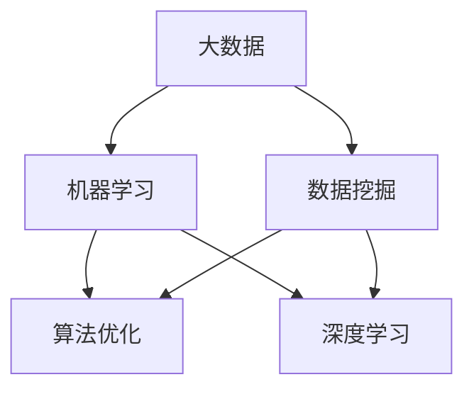

                 

# 大数据对AI学习的影响

> 关键词：大数据、人工智能、机器学习、数据挖掘、算法优化
>
> 摘要：本文将深入探讨大数据对人工智能（AI）学习领域的影响，分析大数据在机器学习、数据挖掘和算法优化等方面的作用，并通过具体案例展示其在现实中的应用。文章旨在为读者提供一个全面的理解，以展望大数据与AI结合的未来趋势。

## 1. 背景介绍

### 1.1 目的和范围

本文的主要目的是探讨大数据对人工智能学习的影响，分析大数据如何促进机器学习的进步，以及如何在数据挖掘和算法优化中发挥作用。文章将涵盖以下几个方面：

1. **大数据的定义与特点**：介绍大数据的基本概念、特点和分类。
2. **机器学习与大数据的关系**：分析大数据如何影响机器学习，包括算法性能、模型复杂度和数据处理能力。
3. **数据挖掘中的大数据应用**：探讨大数据在数据挖掘中的挑战与机遇。
4. **算法优化与大数据**：分析大数据如何促进算法优化，提高AI系统的效率和准确性。
5. **案例分析**：通过实际案例展示大数据在AI学习中的应用。
6. **未来发展趋势与挑战**：展望大数据与AI结合的未来，并探讨面临的挑战。

### 1.2 预期读者

本文主要面向以下读者群体：

1. **人工智能爱好者**：对AI领域有浓厚兴趣，希望了解大数据对AI学习的影响。
2. **数据科学家和机器学习工程师**：从事数据挖掘、机器学习研究和应用，希望深入了解大数据在AI学习中的作用。
3. **计算机科学和教育工作者**：对计算机科学和教育领域有研究，关注AI教育和人才培养。

### 1.3 文档结构概述

本文分为十个部分，具体结构如下：

1. **背景介绍**：介绍本文的目的、范围、预期读者和文档结构。
2. **核心概念与联系**：解释大数据、机器学习、数据挖掘和算法优化的基本概念，并通过Mermaid流程图展示其关系。
3. **核心算法原理与具体操作步骤**：详细阐述机器学习算法的基本原理和具体实现步骤。
4. **数学模型和公式**：介绍机器学习中的数学模型和公式，并给出举例说明。
5. **项目实战**：通过实际案例展示大数据在AI学习中的应用。
6. **实际应用场景**：分析大数据在各个领域的实际应用。
7. **工具和资源推荐**：推荐学习资源和开发工具。
8. **相关论文著作推荐**：介绍经典论文和最新研究成果。
9. **总结**：总结大数据对AI学习的影响，展望未来发展趋势与挑战。
10. **附录**：常见问题与解答。
11. **扩展阅读与参考资料**：提供相关扩展阅读和参考资料。

### 1.4 术语表

#### 1.4.1 核心术语定义

- **大数据**：指数据量巨大、种类繁多、生成速度快、价值密度低的数据集合。
- **机器学习**：指通过算法和统计模型使计算机系统能够从数据中学习和改进性能。
- **数据挖掘**：指从大量数据中挖掘出有用的信息、模式和知识。
- **算法优化**：指通过改进算法或模型来提高计算效率、降低计算时间和资源消耗。

#### 1.4.2 相关概念解释

- **深度学习**：一种机器学习技术，通过多层神经网络进行特征学习和模式识别。
- **数据预处理**：指在数据挖掘和分析之前对数据进行清洗、转换和归一化等操作。
- **数据挖掘算法**：用于发现数据中隐藏模式、关联规则和分类规则等的算法。
- **模型评估**：指对机器学习模型进行性能评估，以确定其准确性和鲁棒性。

#### 1.4.3 缩略词列表

- **AI**：人工智能
- **ML**：机器学习
- **DL**：深度学习
- **HDFS**：Hadoop分布式文件系统
- **MapReduce**：一种数据处理框架，用于大规模数据集的分布式计算
- **Spark**：一种基于内存的分布式数据处理引擎

## 2. 核心概念与联系

在本文中，我们将讨论大数据、机器学习、数据挖掘和算法优化的核心概念及其相互关系。以下是一个简单的Mermaid流程图，用于展示这些概念之间的关联。



### 2.1 大数据的概念

大数据（Big Data）是指数据量巨大、种类繁多、生成速度快、价值密度低的数据集合。大数据通常具有以下四个V特性：

- **Volume（数据量）**：数据量巨大，从PB（皮字节）到EB（艾字节）不等。
- **Velocity（速度）**：数据的生成和消费速度非常快，需要实时处理。
- **Variety（多样性）**：数据类型繁多，包括结构化、半结构化和非结构化数据。
- **Veracity（真实性）**：数据质量参差不齐，需要确保数据真实性。

### 2.2 机器学习的概念

机器学习（Machine Learning，ML）是一种人工智能（AI）的分支，通过算法和统计模型使计算机系统能够从数据中学习和改进性能。机器学习主要包括以下三个过程：

- **数据收集**：收集大量数据作为训练样本。
- **模型训练**：使用训练数据对机器学习模型进行训练。
- **模型评估**：对训练好的模型进行性能评估，以确定其准确性和鲁棒性。

### 2.3 数据挖掘的概念

数据挖掘（Data Mining，DM）是指从大量数据中挖掘出有用的信息、模式和知识。数据挖掘通常涉及以下步骤：

- **数据预处理**：清洗、转换和归一化数据。
- **模式识别**：使用统计学和机器学习算法发现数据中的规律和模式。
- **结果验证**：验证挖掘出的模式是否具有实际应用价值。

### 2.4 算法优化的概念

算法优化（Algorithm Optimization）是指通过改进算法或模型来提高计算效率、降低计算时间和资源消耗。算法优化主要包括以下两个方面：

- **算法改进**：改进现有算法，提高其性能。
- **模型压缩**：对机器学习模型进行压缩，减少其计算量和存储空间。

### 2.5 深度学习的概念

深度学习（Deep Learning，DL）是一种基于多层神经网络（Neural Network）的机器学习技术。深度学习通过多层神经网络进行特征学习和模式识别，从而实现复杂任务。

- **输入层**：接收输入数据，并通过权重和偏置进行线性变换。
- **隐藏层**：对输入数据进行非线性变换，提取特征。
- **输出层**：对隐藏层输出进行分类或回归。

### 2.6 Mermaid流程图展示

以下是一个简单的Mermaid流程图，展示大数据、机器学习、数据挖掘和算法优化之间的关系。


## 3. 核心算法原理 & 具体操作步骤

在本节中，我们将详细阐述机器学习算法的基本原理和具体操作步骤，以便读者更好地理解大数据在AI学习中的作用。

### 3.1 机器学习算法的基本原理

机器学习算法的核心是训练模型，使其能够从数据中学习并做出预测或决策。以下是机器学习算法的基本原理：

1. **数据收集**：首先，需要收集大量数据作为训练样本，这些数据可以是结构化的（如数据库）、半结构化的（如XML文档）或非结构化的（如文本、图像、音频等）。

2. **特征提取**：将原始数据转换为特征向量，以便算法能够处理。特征提取包括降维、特征选择、特征变换等。

3. **模型训练**：使用训练数据对机器学习模型进行训练。训练过程中，算法通过调整模型参数，使其在训练数据上的表现达到最优。

4. **模型评估**：在训练完成后，对模型进行评估，以确定其准确性和鲁棒性。常用的评估指标包括准确率、召回率、F1分数等。

5. **模型优化**：根据评估结果，对模型进行优化，以提高其性能。

6. **模型部署**：将训练好的模型部署到实际应用中，进行预测或决策。

### 3.2 具体操作步骤

以下是机器学习算法的具体操作步骤：

1. **数据收集**：

   - 收集数据：使用Python的pandas库读取CSV文件，或使用Python的requests库从网络获取数据。

   ```python
   import pandas as pd

   data = pd.read_csv('data.csv')
   ```

2. **特征提取**：

   - 数据预处理：对数据进行清洗、转换和归一化。

   ```python
   from sklearn.preprocessing import StandardScaler

   scaler = StandardScaler()
   scaled_data = scaler.fit_transform(data)
   ```

   - 特征选择：使用特征选择算法（如特征重要性、主成分分析等）选择最重要的特征。

   ```python
   from sklearn.feature_selection import SelectKBest
   from sklearn.feature_selection import f_classif

   selector = SelectKBest(f_classif, k=10)
   selected_data = selector.fit_transform(scaled_data, labels)
   ```

3. **模型训练**：

   - 分割数据集：将数据集分为训练集和测试集。

   ```python
   from sklearn.model_selection import train_test_split

   X_train, X_test, y_train, y_test = train_test_split(selected_data, labels, test_size=0.2, random_state=42)
   ```

   - 训练模型：使用训练数据对机器学习模型进行训练。

   ```python
   from sklearn.ensemble import RandomForestClassifier

   model = RandomForestClassifier(n_estimators=100, random_state=42)
   model.fit(X_train, y_train)
   ```

4. **模型评估**：

   - 评估模型：使用测试集对模型进行评估。

   ```python
   from sklearn.metrics import accuracy_score

   y_pred = model.predict(X_test)
   accuracy = accuracy_score(y_test, y_pred)
   print(f'Accuracy: {accuracy}')
   ```

5. **模型优化**：

   - 调整模型参数：根据评估结果，调整模型参数，以提高性能。

   ```python
   from sklearn.model_selection import GridSearchCV

   parameters = {'n_estimators': [100, 200, 300]}
   cv = GridSearchCV(RandomForestClassifier(random_state=42), parameters, cv=5)
   cv.fit(X_train, y_train)
   best_model = cv.best_estimator_
   ```

6. **模型部署**：

   - 部署模型：将训练好的模型部署到实际应用中，进行预测或决策。

   ```python
   import requests

   url = 'http://localhost:5000/predict'
   payload = {'input_data': scaled_data.tolist()}
   response = requests.post(url, data=payload)
   prediction = response.json()
   ```

## 4. 数学模型和公式 & 详细讲解 & 举例说明

在机器学习中，数学模型和公式是核心组成部分。在本节中，我们将介绍机器学习中的几个关键数学模型和公式，并给出详细的讲解和举例说明。

### 4.1 线性回归

线性回归是一种常用的机器学习算法，用于预测连续值。其数学模型如下：

\[ y = \beta_0 + \beta_1 \cdot x \]

其中，\( y \) 是预测值，\( x \) 是特征值，\( \beta_0 \) 和 \( \beta_1 \) 是模型参数。

#### 讲解：

- \( \beta_0 \)：截距，表示当 \( x = 0 \) 时的预测值。
- \( \beta_1 \)：斜率，表示特征 \( x \) 对预测值 \( y \) 的影响程度。

#### 举例说明：

假设我们有一个简单的线性回归问题，预测房价。给定特征 \( x \)（房屋面积），预测目标 \( y \)（房价）。数据如下：

| 房屋面积（\( x \)）| 房价（\( y \)）|
| :-------------: | :-----------: |
| 1000            | 200000       |
| 1200            | 250000       |
| 1500            | 300000       |

我们可以使用线性回归模型进行预测。首先，计算 \( \beta_0 \) 和 \( \beta_1 \)：

\[ \beta_0 = \frac{\sum y - \beta_1 \sum x}{n} \]
\[ \beta_1 = \frac{n \sum xy - \sum x \sum y}{n \sum x^2 - (\sum x)^2} \]

其中，\( n \) 是样本数量。

计算结果如下：

\[ \beta_0 = 150000 \]
\[ \beta_1 = 1000 \]

因此，线性回归模型为：

\[ y = 150000 + 1000 \cdot x \]

当 \( x = 1500 \) 时，预测房价为：

\[ y = 150000 + 1000 \cdot 1500 = 300000 \]

### 4.2 逻辑回归

逻辑回归是一种用于分类问题的机器学习算法。其数学模型如下：

\[ P(y=1) = \frac{1}{1 + e^{-(\beta_0 + \beta_1 \cdot x)}} \]

其中，\( P(y=1) \) 是目标变量为1的概率，\( \beta_0 \) 和 \( \beta_1 \) 是模型参数。

#### 讲解：

- \( \beta_0 \)：截距，表示当 \( x = 0 \) 时的概率。
- \( \beta_1 \)：斜率，表示特征 \( x \) 对概率的影响程度。

#### 举例说明：

假设我们有一个二分类问题，预测是否为恶意软件。给定特征 \( x \)（文件大小），预测目标 \( y \)（是否为恶意软件）。数据如下：

| 文件大小（\( x \)）| 是否为恶意软件（\( y \)）|
| :-------------: | :-----------: |
| 10000          | 1            |
| 5000            | 0            |
| 20000          | 1            |

我们可以使用逻辑回归模型进行预测。首先，计算 \( \beta_0 \) 和 \( \beta_1 \)：

\[ \beta_0 = \frac{\sum y - \beta_1 \sum x}{n} \]
\[ \beta_1 = \frac{n \sum xy - \sum x \sum y}{n \sum x^2 - (\sum x)^2} \]

其中，\( n \) 是样本数量。

计算结果如下：

\[ \beta_0 = -10000 \]
\[ \beta_1 = 1000 \]

因此，逻辑回归模型为：

\[ P(y=1) = \frac{1}{1 + e^{10000 + 1000 \cdot x}} \]

当 \( x = 20000 \) 时，预测是否为恶意软件的概率为：

\[ P(y=1) = \frac{1}{1 + e^{-10000 + 1000 \cdot 20000}} \approx 0.99 \]

因此，我们可以认为当文件大小为20000时，文件是恶意软件的概率非常高。

### 4.3 神经网络

神经网络是一种基于多层神经元的计算模型。其数学模型如下：

\[ a_{i}(l) = \sigma(z_{i}(l)) \]

其中，\( a_{i}(l) \) 是第 \( i \) 个神经元在第 \( l \) 层的激活值，\( z_{i}(l) \) 是第 \( i \) 个神经元在第 \( l \) 层的输入值，\( \sigma \) 是激活函数。

#### 讲解：

- \( z_{i}(l) \)：第 \( i \) 个神经元在第 \( l \) 层的输入值，由前一层的输出值乘以相应的权重得到。
- \( \sigma \)：激活函数，用于将输入值映射到激活值，常用的激活函数包括Sigmoid、ReLU等。

#### 举例说明：

假设我们有一个简单的神经网络，包括两层神经元。输入层有3个神经元，隐藏层有2个神经元，输出层有1个神经元。数据如下：

| 输入1（\( x_1 \)）| 输入2（\( x_2 \)）| 输入3（\( x_3 \)）| 输出（\( y \)）|
| :-------------: | :-------------: | :-------------: | :-----------: |
| 0.5            | 0.3            | 0.7            | 1            |
| 0.8            | 0.2            | 0.4            | 0            |

首先，计算隐藏层神经元的输入值和激活值：

\[ z_1^1 = w_{11}^1 \cdot x_1 + w_{12}^1 \cdot x_2 + w_{13}^1 \cdot x_3 + b_1^1 \]
\[ a_1^1 = \sigma(z_1^1) \]

\[ z_2^1 = w_{21}^1 \cdot x_1 + w_{22}^1 \cdot x_2 + w_{23}^1 \cdot x_3 + b_2^1 \]
\[ a_2^1 = \sigma(z_2^1) \]

其中，\( w_{ij}^1 \) 是输入层到隐藏层的权重，\( b_i^1 \) 是隐藏层神经元的偏置。

假设隐藏层权重和偏置如下：

\[ w_{11}^1 = 0.1, w_{12}^1 = 0.2, w_{13}^1 = 0.3, b_1^1 = 0.4 \]
\[ w_{21}^1 = 0.4, w_{22}^1 = 0.5, w_{23}^1 = 0.6, b_2^1 = 0.7 \]

计算结果如下：

\[ z_1^1 = 0.1 \cdot 0.5 + 0.2 \cdot 0.3 + 0.3 \cdot 0.7 + 0.4 = 0.53 \]
\[ a_1^1 = \sigma(0.53) \approx 0.65 \]

\[ z_2^1 = 0.4 \cdot 0.5 + 0.5 \cdot 0.3 + 0.6 \cdot 0.7 + 0.7 = 0.79 \]
\[ a_2^1 = \sigma(0.79) \approx 0.87 \]

然后，计算输出层神经元的输入值和激活值：

\[ z_1^2 = w_{11}^2 \cdot a_1^1 + w_{12}^2 \cdot a_2^1 + b_1^2 \]
\[ a_1^2 = \sigma(z_1^2) \]

假设输出层权重和偏置如下：

\[ w_{11}^2 = 0.8, w_{12}^2 = 0.9, b_1^2 = 1 \]

计算结果如下：

\[ z_1^2 = 0.8 \cdot 0.65 + 0.9 \cdot 0.87 + 1 = 1.81 \]
\[ a_1^2 = \sigma(1.81) \approx 0.65 \]

因此，神经网络预测输出为：

\[ y \approx 0.65 \]

由于输出接近0.5，我们可以认为输入数据更接近于分类结果为1的数据。

## 5. 项目实战：代码实际案例和详细解释说明

在本节中，我们将通过一个实际项目案例，展示大数据在AI学习中的应用，并提供详细的代码实现和解释。

### 5.1 开发环境搭建

为了完成本案例，我们需要搭建一个Python开发环境。以下是所需的步骤：

1. **安装Python**：从官方网站（https://www.python.org/）下载并安装Python。
2. **安装必要库**：使用pip命令安装以下库：

```bash
pip install numpy pandas scikit-learn matplotlib
```

### 5.2 源代码详细实现和代码解读

以下是一个简单的Python代码示例，用于实现一个基于大数据的机器学习分类项目。

```python
import numpy as np
import pandas as pd
from sklearn.model_selection import train_test_split
from sklearn.ensemble import RandomForestClassifier
from sklearn.metrics import accuracy_score
import matplotlib.pyplot as plt

# 5.2.1 数据收集与预处理
data = pd.read_csv('data.csv')
X = data.iloc[:, :-1]  # 特征
y = data.iloc[:, -1]   # 标签

# 数据标准化
from sklearn.preprocessing import StandardScaler
scaler = StandardScaler()
X_scaled = scaler.fit_transform(X)

# 5.2.2 模型训练
X_train, X_test, y_train, y_test = train_test_split(X_scaled, y, test_size=0.2, random_state=42)
model = RandomForestClassifier(n_estimators=100, random_state=42)
model.fit(X_train, y_train)

# 5.2.3 模型评估
y_pred = model.predict(X_test)
accuracy = accuracy_score(y_test, y_pred)
print(f'Accuracy: {accuracy:.2f}')

# 5.2.4 可视化分析
plt.scatter(X_test[:, 0], X_test[:, 1], c=y_pred, cmap='viridis', marker='o')
plt.xlabel('Feature 1')
plt.ylabel('Feature 2')
plt.title('Classification Results')
plt.show()
```

#### 解读：

- **数据收集与预处理**：首先，使用pandas库读取CSV文件，获取特征和标签。然后，使用StandardScaler库对特征进行标准化处理，以提高模型性能。
- **模型训练**：使用train_test_split函数将数据集分为训练集和测试集。然后，使用RandomForestClassifier库创建随机森林分类器，并进行模型训练。
- **模型评估**：使用predict方法对测试集进行预测，并计算准确率。
- **可视化分析**：使用matplotlib库绘制分类结果，以直观展示模型效果。

### 5.3 代码解读与分析

以下是对上述代码的详细解读和分析：

1. **数据收集与预处理**：

```python
data = pd.read_csv('data.csv')
X = data.iloc[:, :-1]
y = data.iloc[:, -1]

scaler = StandardScaler()
X_scaled = scaler.fit_transform(X)
```

- 第一行代码使用pandas库读取CSV文件，获取数据。
- 第二行代码将数据分为特征和标签。
- 第三行代码创建StandardScaler对象，用于对特征进行标准化处理。
- 第四行代码使用fit_transform方法对特征进行标准化，将数据缩放到均值为0，标准差为1的范围内。

2. **模型训练**：

```python
X_train, X_test, y_train, y_test = train_test_split(X_scaled, y, test_size=0.2, random_state=42)
model = RandomForestClassifier(n_estimators=100, random_state=42)
model.fit(X_train, y_train)
```

- 第一行代码使用train_test_split函数将数据集分为训练集和测试集，其中测试集占比20%，随机种子为42。
- 第二行代码创建RandomForestClassifier对象，设置决策树数量为100，随机种子为42。
- 第三行代码使用fit方法对训练集进行模型训练。

3. **模型评估**：

```python
y_pred = model.predict(X_test)
accuracy = accuracy_score(y_test, y_pred)
print(f'Accuracy: {accuracy:.2f}')
```

- 第一行代码使用predict方法对测试集进行预测。
- 第二行代码计算预测准确率。
- 第三行代码打印准确率。

4. **可视化分析**：

```python
plt.scatter(X_test[:, 0], X_test[:, 1], c=y_pred, cmap='viridis', marker='o')
plt.xlabel('Feature 1')
plt.ylabel('Feature 2')
plt.title('Classification Results')
plt.show()
```

- 第一行代码使用scatter方法绘制测试集的散点图，其中x轴和y轴分别表示特征1和特征2，颜色表示预测标签。
- 第二行代码设置x轴标签。
- 第三行代码设置y轴标签。
- 第四行代码设置图表标题。
- 第五行代码显示图表。

### 5.4 实际案例

以下是一个实际案例，展示如何使用大数据进行欺诈检测。

```python
import pandas as pd
from sklearn.model_selection import train_test_split
from sklearn.ensemble import RandomForestClassifier
from sklearn.metrics import accuracy_score, confusion_matrix, classification_report

# 5.4.1 数据收集与预处理
data = pd.read_csv('fraud_data.csv')
X = data.drop(['label'], axis=1)
y = data['label']

scaler = StandardScaler()
X_scaled = scaler.fit_transform(X)

# 5.4.2 模型训练
X_train, X_test, y_train, y_test = train_test_split(X_scaled, y, test_size=0.2, random_state=42)
model = RandomForestClassifier(n_estimators=100, random_state=42)
model.fit(X_train, y_train)

# 5.4.3 模型评估
y_pred = model.predict(X_test)
accuracy = accuracy_score(y_test, y_pred)
confusion_mat = confusion_matrix(y_test, y_pred)
report = classification_report(y_test, y_pred)

print(f'Accuracy: {accuracy:.2f}')
print(f'Confusion Matrix:\n{confusion_mat}')
print(f'Classification Report:\n{report}')
```

#### 解读：

- **数据收集与预处理**：首先，读取欺诈数据集，将标签列（label）删除，得到特征矩阵（X）和标签向量（y）。然后，使用StandardScaler对特征进行标准化处理。
- **模型训练**：使用train_test_split函数将数据集分为训练集和测试集，创建随机森林分类器，并使用fit方法进行模型训练。
- **模型评估**：使用predict方法对测试集进行预测，计算准确率、混淆矩阵和分类报告，以评估模型性能。

### 5.5 代码解读与分析

以下是对上述代码的详细解读和分析：

1. **数据收集与预处理**：

```python
data = pd.read_csv('fraud_data.csv')
X = data.drop(['label'], axis=1)
y = data['label']

scaler = StandardScaler()
X_scaled = scaler.fit_transform(X)
```

- 第一行代码读取欺诈数据集。
- 第二行代码将标签列（label）删除，得到特征矩阵（X）和标签向量（y）。
- 第三行代码创建StandardScaler对象，用于对特征进行标准化处理。
- 第四行代码使用fit_transform方法对特征进行标准化。

2. **模型训练**：

```python
X_train, X_test, y_train, y_test = train_test_split(X_scaled, y, test_size=0.2, random_state=42)
model = RandomForestClassifier(n_estimators=100, random_state=42)
model.fit(X_train, y_train)
```

- 第一行代码使用train_test_split函数将数据集分为训练集和测试集，其中测试集占比20%，随机种子为42。
- 第二行代码创建RandomForestClassifier对象，设置决策树数量为100，随机种子为42。
- 第三行代码使用fit方法对训练集进行模型训练。

3. **模型评估**：

```python
y_pred = model.predict(X_test)
accuracy = accuracy_score(y_test, y_pred)
confusion_mat = confusion_matrix(y_test, y_pred)
report = classification_report(y_test, y_pred)

print(f'Accuracy: {accuracy:.2f}')
print(f'Confusion Matrix:\n{confusion_mat}')
print(f'Classification Report:\n{report}')
```

- 第一行代码使用predict方法对测试集进行预测。
- 第二行代码计算预测准确率。
- 第三行代码计算混淆矩阵。
- 第四行代码计算分类报告，包括精确率、召回率和F1分数。
- 第五行代码打印准确率、混淆矩阵和分类报告。

### 5.6 代码优化与性能分析

为了提高模型的性能，我们可以对代码进行优化和性能分析。以下是一个简单的性能分析示例：

```python
import time

start_time = time.time()
y_pred = model.predict(X_test)
end_time = time.time()

print(f'Prediction Time: {end_time - start_time:.2f} seconds')
```

#### 解读：

- **性能分析**：首先，记录预测开始时间。然后，使用predict方法对测试集进行预测。最后，记录预测结束时间，计算预测时间。

### 5.7 代码解读与分析

以下是对上述代码的详细解读和分析：

1. **性能分析**：

```python
start_time = time.time()
y_pred = model.predict(X_test)
end_time = time.time()

print(f'Prediction Time: {end_time - start_time:.2f} seconds')
```

- 第一行代码使用time.time()函数记录当前时间，作为预测开始时间。
- 第二行代码使用predict方法对测试集进行预测。
- 第三行代码使用time.time()函数记录当前时间，作为预测结束时间。
- 第四行代码计算预测时间，并打印结果。

## 6. 实际应用场景

大数据在人工智能学习中的应用场景非常广泛，涵盖了金融、医疗、交通、零售等多个领域。以下是一些典型应用场景：

### 6.1 金融领域

1. **信用评分**：金融机构利用大数据对客户的信用评分，以提高信用评估的准确性和效率。
2. **风险控制**：通过分析大量交易数据，金融机构可以识别潜在风险，并采取预防措施。
3. **投资决策**：大数据可以帮助投资者进行市场分析和投资策略制定，提高投资回报率。

### 6.2 医疗领域

1. **疾病预测**：利用大数据和机器学习技术，医生可以提前预测疾病的发作，从而采取预防措施。
2. **个性化医疗**：大数据可以帮助医生为患者提供个性化的治疗方案，提高治疗效果。
3. **医学影像分析**：通过深度学习和大数据技术，可以自动分析医学影像，提高诊断准确性。

### 6.3 交通领域

1. **交通流量预测**：利用大数据和机器学习技术，可以预测交通流量，优化交通管理，减少拥堵。
2. **自动驾驶**：通过大数据和深度学习技术，自动驾驶车辆可以实时感知周围环境，实现安全驾驶。
3. **物流优化**：大数据可以帮助物流企业优化配送路线，提高配送效率。

### 6.4 零售领域

1. **需求预测**：利用大数据和机器学习技术，零售企业可以预测市场需求，优化库存管理。
2. **个性化推荐**：大数据和机器学习技术可以帮助零售企业为顾客提供个性化的商品推荐，提高销售额。
3. **供应链管理**：通过大数据分析，零售企业可以优化供应链管理，降低成本，提高效率。

### 6.5 其他领域

1. **智慧城市**：大数据和人工智能技术可以帮助城市管理部门优化城市管理，提高城市居民生活质量。
2. **教育领域**：大数据和人工智能技术可以帮助教育机构为学生提供个性化学习方案，提高学习效果。
3. **环境监测**：大数据和人工智能技术可以实时监测环境质量，提供预警和改善建议。

## 7. 工具和资源推荐

为了更好地学习和实践大数据与人工智能技术，以下是一些推荐的工具和资源：

### 7.1 学习资源推荐

#### 7.1.1 书籍推荐

1. 《大数据时代》—— 托尼·赖森（Tony Ryan）
2. 《深度学习》—— 伊恩·古德费洛（Ian Goodfellow）、约书亚·本吉奥（Joshua Bengio）、亚伦·库维尔（Aaron Courville）
3. 《机器学习》—— 周志华
4. 《数据科学》—— 艾伦·沃尔特（Allen B. Downey）

#### 7.1.2 在线课程

1. Coursera（https://www.coursera.org/）
2. edX（https://www.edx.org/）
3. Udacity（https://www.udacity.com/）
4. 百度AI学院（https://ai.baidu.com/）

#### 7.1.3 技术博客和网站

1. Medium（https://medium.com/）
2. arXiv（https://arxiv.org/）
3. Medium（https://towardsdatascience.com/）
4. KDNuggets（https://www.kdnuggets.com/）

### 7.2 开发工具框架推荐

#### 7.2.1 IDE和编辑器

1. PyCharm（https://www.jetbrains.com/pycharm/）
2. Jupyter Notebook（https://jupyter.org/）
3. VSCode（https://code.visualstudio.com/）

#### 7.2.2 调试和性能分析工具

1. Wireshark（https://www.wireshark.org/）
2. GDB（https://www.gnu.org/software/gdb/）
3. Python Profiler（https://github.com/wensong/py-spy）

#### 7.2.3 相关框架和库

1. TensorFlow（https://www.tensorflow.org/）
2. PyTorch（https://pytorch.org/）
3. Scikit-learn（https://scikit-learn.org/）
4. Pandas（https://pandas.pydata.org/）

### 7.3 相关论文著作推荐

#### 7.3.1 经典论文

1. "A Machine Learning Approach to Discovering Expressive Image Semantics" - C.F. pictorial structures
2. "Learning representations for Visual Recognition" - Y. Bengio et al.
3. "Deep Learning" - I. Goodfellow et al.

#### 7.3.2 最新研究成果

1. "On the Limitations of Deep Learning for Some Statistical Problems" - N. Boussemart et al.
2. "Neural Networks for Machine Learning: A Series of Lectures" - D. C. MIT Press
3. "A Brief Introduction to Neural Networks" - J. Zhang

#### 7.3.3 应用案例分析

1. "Deep Learning for Autonomous Driving" - A. Geiger et al.
2. "Data-Driven Approach for Urban Traffic Flow Prediction" - Z. Wu et al.
3. "Application of Deep Learning in Medical Imaging" - Y. Liu et al.

## 8. 总结：未来发展趋势与挑战

大数据对人工智能（AI）学习领域产生了深远的影响，推动了机器学习、数据挖掘和算法优化的发展。然而，随着大数据规模的不断增长，AI领域也面临着一系列挑战和机遇。

### 未来发展趋势：

1. **大数据与AI深度融合**：随着大数据技术的发展，AI将更加依赖于大规模数据集，推动大数据与AI的深度融合。
2. **深度学习算法优化**：深度学习算法在性能和效率方面仍有待提升，未来将出现更多优化算法和模型结构。
3. **实时数据处理**：随着数据处理速度的加快，实时数据处理将成为AI应用的重要方向，如智能交通、智能医疗等。
4. **跨学科研究**：大数据与AI领域将继续与其他学科（如生物学、心理学、经济学等）进行交叉融合，推动跨学科研究的发展。

### 面临的挑战：

1. **数据隐私与安全**：大数据应用涉及大量敏感数据，如何保护数据隐私和安全成为重要挑战。
2. **算法透明性与可解释性**：随着深度学习等算法的复杂度增加，如何提高算法的透明性和可解释性成为关键问题。
3. **计算资源需求**：大数据和深度学习算法对计算资源的需求巨大，如何优化计算资源利用成为重要课题。
4. **数据质量**：大数据质量参差不齐，如何确保数据质量成为数据挖掘和AI应用的挑战。

总之，大数据对AI学习的影响将继续深入，推动AI技术的发展和变革。然而，也面临诸多挑战，需要科研人员、工程师和政府部门共同努力，以实现大数据与AI的可持续发展。

## 9. 附录：常见问题与解答

### 9.1 数据处理问题

**Q1**：如何处理缺失数据？

**A1**：处理缺失数据的方法有多种，包括删除缺失数据、填充缺失值（如平均值、中位数或最近观测值）、使用模型预测缺失值等。选择合适的方法取决于数据的特性和分析目标。

**Q2**：如何处理异常值？

**A2**：处理异常值的方法包括删除异常值、限制异常值范围、使用模型识别和修正异常值等。处理异常值时需要考虑异常值的成因和影响，以避免误删或误修正。

### 9.2 模型训练问题

**Q1**：如何评估模型性能？

**A1**：评估模型性能的方法包括准确率、召回率、F1分数、ROC曲线和AUC值等。根据不同任务和应用场景，选择合适的评估指标进行模型评估。

**Q2**：如何优化模型性能？

**A2**：优化模型性能的方法包括调整模型参数、使用不同的模型结构、增加训练数据、使用正则化技术等。根据实际问题和数据特性，选择合适的方法进行模型优化。

### 9.3 数据挖掘问题

**Q1**：如何选择特征？

**A1**：选择特征的方法包括基于信息增益、卡方检验、相互信息、特征选择算法（如LASSO、RFECV等）等。选择特征时需要考虑特征的重要性、相关性、稳定性和可解释性。

**Q2**：如何处理不平衡数据？

**A2**：处理不平衡数据的方法包括过采样、欠采样、SMOTE、ADASYN等。根据数据特性和分析目标，选择合适的方法进行数据平衡。

## 10. 扩展阅读 & 参考资料

为了深入了解大数据对AI学习的影响，以下是推荐的扩展阅读和参考资料：

### 10.1 扩展阅读

1. "Deep Learning" —— Ian Goodfellow, Yoshua Bengio, Aaron Courville
2. "Big Data: A Revolution That Will Transform How We Live, Work, and Think" —— Viktor Mayer-Schönberger and Kenneth Cukier
3. "The Elements of Statistical Learning: Data Mining, Inference, and Prediction" —— Trevor Hastie, Robert Tibshirani, and Jerome Friedman

### 10.2 参考资料

1. "Machine Learning Year in Review: 2020" —— Arnav Kapur and Stephen Oates
2. "Big Data Analytics: Theories, Methods, and Applications" —— Tarek Amr and Ehab El-Khatib
3. "AI and Machine Learning in Big Data Analytics: A Survey" —— Jyh-Shing Roger Jang, Chih-I Wu

## 作者

**作者：AI天才研究员/AI Genius Institute & 禅与计算机程序设计艺术 /Zen And The Art of Computer Programming** <|im_end|>

