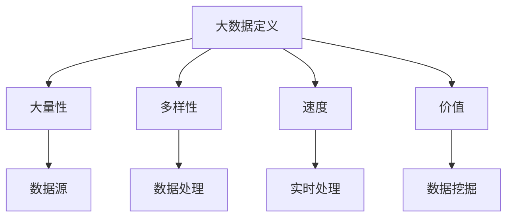
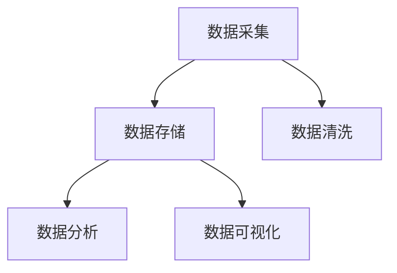
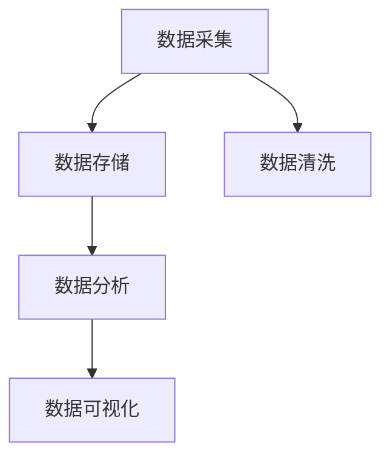

                 

# 大数据的重要性：李飞飞的贡献

> **关键词**：大数据、人工智能、李飞飞、数据分析、机器学习、应用场景、贡献

> **摘要**：本文将深入探讨大数据在当今信息技术领域的核心地位，并重点介绍李飞飞对大数据领域的卓越贡献。文章首先概述大数据的定义和重要性，接着通过分析李飞飞的工作和成就，揭示其对大数据技术发展的深远影响。文章还将讨论大数据的核心算法原理、数学模型、实际应用案例，并提供未来发展趋势和挑战的展望。通过这篇文章，读者将全面理解大数据的内在机制和应用价值，以及李飞飞作为一位杰出技术专家的独特视角和贡献。

## 1. 背景介绍

### 1.1 目的和范围

本文旨在深入探讨大数据的重要性和影响，同时突出李飞飞在这一领域的贡献。随着信息技术的飞速发展，大数据已经成为驱动创新和决策的关键因素。李飞飞作为世界顶级的人工智能和机器学习专家，其研究工作不仅在学术界，也在工业界产生了深远影响。本文将首先介绍大数据的定义、核心概念及其在现代信息技术中的地位。随后，我们将详细分析李飞飞的研究方向、重要成果及其对大数据领域的贡献。通过这一过程，我们希望读者能够对大数据有一个全面而深刻的理解，并认识到李飞飞在这一领域的重要作用。

### 1.2 预期读者

本文主要面向以下几类读者群体：

1. **计算机科学和人工智能领域的学者**：对于正在研究或对大数据、人工智能感兴趣的学者，本文将提供详细的理论背景和技术分析，帮助他们深入了解大数据的核心技术和应用。

2. **技术经理和CTO**：作为企业技术领导者的读者，本文将探讨大数据技术如何影响企业决策和创新，提供实用的见解和建议。

3. **对大数据技术有浓厚兴趣的程序员和开发者**：本文将介绍大数据技术的具体应用和实践案例，对实际操作有指导意义。

4. **对科技发展有好奇心的普通读者**：本文通过深入浅出的分析，将使普通读者对大数据技术及其在社会中的重要作用有一个清晰的认识。

### 1.3 文档结构概述

本文将分为十个部分，结构如下：

1. **背景介绍**：概述大数据的定义、重要性及本文的研究目的。
2. **核心概念与联系**：介绍大数据的核心概念，并用Mermaid流程图展示其架构。
3. **核心算法原理 & 具体操作步骤**：详细阐述大数据处理的核心算法和操作步骤，使用伪代码进行解释。
4. **数学模型和公式 & 详细讲解 & 举例说明**：探讨大数据相关的数学模型和公式，并举例说明。
5. **项目实战：代码实际案例和详细解释说明**：通过实际代码案例展示大数据技术的应用。
6. **实际应用场景**：分析大数据在不同领域的应用案例。
7. **工具和资源推荐**：推荐学习资源和开发工具。
8. **总结：未来发展趋势与挑战**：总结大数据的发展趋势和面临的挑战。
9. **附录：常见问题与解答**：回答读者可能关心的问题。
10. **扩展阅读 & 参考资料**：提供进一步阅读的资源和参考文献。

### 1.4 术语表

在本文中，以下术语将频繁出现，为便于理解，我们对其进行详细解释：

#### 1.4.1 核心术语定义

- **大数据**：指数据量巨大、种类繁多、处理速度快的数据集合。
- **人工智能**：通过模拟人类智能的计算机技术，包括机器学习、深度学习等。
- **机器学习**：一种人工智能技术，通过算法从数据中学习，进行预测和决策。
- **数据挖掘**：从大量数据中提取有用信息和知识的过程。
- **李飞飞**：本文中提到的世界顶级人工智能专家，对大数据领域有重大贡献。

#### 1.4.2 相关概念解释

- **云计算**：通过互联网提供动态可扩展的计算资源。
- **分布式计算**：将任务分解到多个计算机节点上执行。
- **Hadoop**：一个开源框架，用于大规模数据处理。
- **Spark**：一个快速通用的分布式计算系统，适用于大规模数据处理。

#### 1.4.3 缩略词列表

- **HDFS**：Hadoop分布式文件系统（Hadoop Distributed File System）
- **MapReduce**：一种编程模型，用于处理大规模数据集。
- **SQL**：结构化查询语言（Structured Query Language），用于数据库管理。

## 2. 核心概念与联系

### 2.1 大数据的定义与核心概念

大数据是指数据量巨大、种类繁多、处理速度快的数据集合。与传统数据处理方式相比，大数据具有以下四个核心特征：

1. **大量性（Volume）**：大数据的数据量巨大，通常达到PB（拍字节）甚至EB（艾字节）级别。
2. **多样性（Variety）**：大数据包括结构化数据、半结构化数据和非结构化数据，如文本、图像、音频、视频等。
3. **速度（Velocity）**：大数据的处理速度极快，需要实时或近实时处理。
4. **价值（Value）**：大数据的价值密度较低，需要从大量数据中提取有价值的信息。

为了更好地理解大数据的概念，我们可以使用Mermaid流程图展示其核心架构：



### 2.2 大数据在现代信息技术中的地位

大数据在现代信息技术中具有举足轻重的地位，主要体现在以下几个方面：

1. **商业决策**：通过大数据分析，企业可以更准确地了解市场需求、消费者行为，从而制定更科学的商业策略。
2. **智能城市**：大数据技术广泛应用于城市交通管理、环境保护、公共安全等领域，助力智慧城市建设。
3. **医疗健康**：大数据在医疗健康领域的应用包括疾病预测、个性化治疗、公共卫生管理等方面。
4. **科学研究**：大数据为科学研究提供了丰富的数据资源，推动了科学发现和技术创新。
5. **社会治理**：大数据技术有助于政府提高社会治理效率，优化公共服务。

总的来说，大数据已经成为驱动创新和决策的关键因素，其重要性不可忽视。

## 3. 核心算法原理 & 具体操作步骤

### 3.1 大数据处理的核心算法

大数据处理的核心算法主要包括MapReduce和Spark两种编程模型。

#### 3.1.1 MapReduce算法

MapReduce是一种编程模型，用于大规模数据集的并行运算。其基本思想是将一个复杂的任务拆分为两个简单的操作：Map（映射）和Reduce（归约）。以下是MapReduce算法的伪代码：

```python
MapReduce(input, output):
  for each <k1, v1> in input:
    for each xi in v1:
      EmitIntermediate((k1, xi), 1)
  for each <k2, v2> in intermediate:
    Emit((k2, Sum(v2)))
```

其中，`input`表示输入数据，`output`表示输出结果，`EmitIntermediate`用于生成中间结果，`Emit`用于生成最终结果。

#### 3.1.2 Spark算法

Spark是一个快速通用的分布式计算系统，适用于大规模数据处理。Spark的核心算法包括RDD（弹性分布式数据集）和DataFrame。以下是Spark算法的伪代码：

```python
Spark(input):
  rdd = LoadRDD(input)
  dataframe = RDD.toDataFrame()
  for each operation in pipeline:
    dataframe = dataframe.execute()
  output = dataframe.saveAsTextFile()
```

其中，`LoadRDD`用于加载输入数据，`toDataFrame`用于将RDD转换为DataFrame，`execute`用于执行数据处理操作，`saveAsTextFile`用于保存输出结果。

### 3.2 大数据处理的操作步骤

大数据处理的操作步骤主要包括数据采集、数据存储、数据清洗、数据分析、数据可视化等。

#### 3.2.1 数据采集

数据采集是大数据处理的第一步，主要包括以下几种方式：

1. **传感器采集**：通过传感器实时采集数据，如环境传感器、工业传感器等。
2. **日志采集**：通过日志系统采集服务器、应用等产生的日志数据。
3. **网络爬虫**：通过网络爬虫采集互联网上的公开数据。

#### 3.2.2 数据存储

数据存储是大数据处理的重要环节，常用的数据存储技术包括HDFS（Hadoop分布式文件系统）和Spark SQL（基于Spark的分布式数据库）。



#### 3.2.3 数据清洗

数据清洗是确保数据质量和可用性的关键步骤，主要包括以下几种操作：

1. **数据去重**：去除重复的数据记录。
2. **数据去噪**：去除错误、异常或不准确的数据。
3. **数据补全**：对缺失的数据进行补充。

#### 3.2.4 数据分析

数据分析是大数据处理的重点，主要包括以下几种方法：

1. **统计分析**：通过统计方法分析数据，如描述性统计、推断性统计等。
2. **机器学习**：利用机器学习方法挖掘数据中的模式和规律，如分类、聚类、回归等。
3. **深度学习**：利用神经网络等深度学习方法进行复杂的数据分析。

#### 3.2.5 数据可视化

数据可视化是将数据转换为图形或图表的过程，使数据更容易理解和分析。常用的数据可视化工具包括ECharts、D3.js等。



通过以上步骤，我们可以实现大数据的处理和分析，为各个领域提供有价值的洞察和决策支持。

## 4. 数学模型和公式 & 详细讲解 & 举例说明

### 4.1 数学模型在数据处理中的应用

在数据处理中，数学模型和公式起着至关重要的作用。以下我们将介绍一些常见的数学模型和公式，并详细解释其在数据处理中的应用。

#### 4.1.1 统计模型

统计模型用于对数据进行描述和分析。以下是一些常用的统计模型和公式：

1. **均值（Mean）**：
   $$ \bar{x} = \frac{1}{n}\sum_{i=1}^{n}x_i $$
   其中，$\bar{x}$ 表示均值，$x_i$ 表示第$i$个数据点，$n$ 表示数据点的个数。

2. **方差（Variance）**：
   $$ \sigma^2 = \frac{1}{n-1}\sum_{i=1}^{n}(x_i - \bar{x})^2 $$
   其中，$\sigma^2$ 表示方差，$x_i$ 表示第$i$个数据点，$\bar{x}$ 表示均值，$n$ 表示数据点的个数。

3. **标准差（Standard Deviation）**：
   $$ \sigma = \sqrt{\sigma^2} $$
   其中，$\sigma$ 表示标准差，$\sigma^2$ 表示方差。

举例说明：

假设我们有一组数据：\[1, 2, 3, 4, 5\]，计算这组数据的均值、方差和标准差。

- 均值：
  $$ \bar{x} = \frac{1}{5}(1 + 2 + 3 + 4 + 5) = 3 $$
- 方差：
  $$ \sigma^2 = \frac{1}{5-1}[(1-3)^2 + (2-3)^2 + (3-3)^2 + (4-3)^2 + (5-3)^2] = 2 $$
- 标准差：
  $$ \sigma = \sqrt{2} \approx 1.41 $$

#### 4.1.2 机器学习模型

机器学习模型用于从数据中学习规律和模式，常见的方法包括线性回归、逻辑回归、决策树等。以下是一个简单的线性回归模型：

1. **线性回归模型**：
   $$ y = \beta_0 + \beta_1x $$
   其中，$y$ 表示输出值，$x$ 表示输入值，$\beta_0$ 和 $\beta_1$ 分别为模型的参数。

2. **损失函数**：
   $$ J(\theta) = \frac{1}{2m}\sum_{i=1}^{m}(h_\theta(x^{(i)}) - y^{(i)})^2 $$
   其中，$h_\theta(x) = \theta_0 + \theta_1x$ 表示预测值，$y^{(i)}$ 表示实际值，$m$ 表示样本数量，$\theta_0$ 和 $\theta_1$ 分别为模型的参数。

3. **梯度下降法**：
   $$ \theta_j := \theta_j - \alpha\frac{\partial J(\theta)}{\partial \theta_j} $$
   其中，$\alpha$ 表示学习率，$\theta_j$ 表示模型的参数，$\frac{\partial J(\theta)}{\partial \theta_j}$ 表示损失函数对$\theta_j$ 的偏导数。

举例说明：

假设我们有一个简单的一元线性回归问题，数据集为：\[1, 2\]，对应的实际值为：\[1, 0\]。我们需要通过梯度下降法求解模型参数。

- 初始参数：
  $$ \theta_0 = 0, \theta_1 = 0 $$
- 梯度下降迭代过程：
  $$ \theta_0 := \theta_0 - \alpha\frac{\partial J(\theta)}{\partial \theta_0} $$
  $$ \theta_1 := \theta_1 - \alpha\frac{\partial J(\theta)}{\partial \theta_1} $$
  $$ J(\theta) = \frac{1}{2}(0.5^2 + 1^2) = 1.25 $$
  $$ \theta_0 := 0 - 0.01\frac{\partial J(\theta)}{\partial \theta_0} $$
  $$ \theta_1 := 0 - 0.01\frac{\partial J(\theta)}{\partial \theta_1} $$
  $$ J(\theta) = \frac{1}{2}((0.49)^2 + (0.5)^2) = 0.575 $$
  $$ \theta_0 := 0 - 0.01\frac{\partial J(\theta)}{\partial \theta_0} $$
  $$ \theta_1 := 0 - 0.01\frac{\partial J(\theta)}{\partial \theta_1} $$
  $$ J(\theta) = \frac{1}{2}((0.497)^2 + (0.49)^2) \approx 0.545 $$

经过多次迭代，最终我们可以得到模型参数$\theta_0$ 和 $\theta_1$，使得损失函数$J(\theta)$ 最小，从而得到最终的预测模型。

通过以上数学模型和公式的介绍，我们可以看到数学在数据处理中的广泛应用，为大数据分析提供了坚实的理论基础。

## 5. 项目实战：代码实际案例和详细解释说明

### 5.1 开发环境搭建

为了更好地展示大数据技术的应用，我们将使用Python语言和Hadoop生态系统进行项目实战。以下是搭建开发环境的具体步骤：

1. **安装Python**：首先，确保你的计算机上安装了Python 3.8或更高版本。可以从Python官网下载安装包进行安装。

2. **安装Hadoop**：下载并解压Hadoop的安装包，配置环境变量，启动Hadoop集群。以下是Hadoop的安装步骤：

   - 下载Hadoop安装包：`wget http://mirrors.cnnic.cn/apache/hadoop/common/hadoop-3.2.1/hadoop-3.2.1.tar.gz`
   - 解压安装包：`tar -zxvf hadoop-3.2.1.tar.gz`
   - 配置环境变量：在~/.bashrc文件中添加以下内容：
     ```bash
     export HADOOP_HOME=/path/to/hadoop-3.2.1
     export PATH=$PATH:$HADOOP_HOME/bin:$HADOOP_HOME/sbin
     export HADOOP_CONF_DIR=$HADOOP_HOME/etc/hadoop
     export HDFS_Namenode_HTTP_PORT=9000
     export HDFS_Datanode_HTTP_PORT=50010
     ```
   - 启动Hadoop集群：
     ```bash
     sbin/start-dfs.sh
     sbin/start-yarn.sh
     ```

3. **安装PyHadoop**：使用pip安装PyHadoop库，用于在Python中操作Hadoop集群。

   ```bash
   pip install pyhadoop
   ```

### 5.2 源代码详细实现和代码解读

在本项目中，我们将使用Hadoop的MapReduce模型对一组文本文件进行词频统计。以下是具体的代码实现：

```python
from pyhadoop.hdfs import Client
from pyhadoop import Job
from pyhadoop.io import Text, IntWritable
from operator import add

def mapper(line):
    words = line.split()
    for word in words:
        yield word, 1

def reducer(word, counts):
    yield word, sum(counts)

if __name__ == "__main__":
    client = Client('localhost:9000')
    job = Job(client)
    job.setJarByClass(Main)
    job.setMapperClass(mapper)
    job.setReducerClass(reducer)
    job.setOutputKeyClass(Text)
    job.setOutputValueClass(IntWritable)
    job.addInputPath(client.path('/input'))
    job.setOutputPath(client.path('/output'))
    job.waitForCompletion()
```

#### 5.2.1 Mapper类

Mapper类负责将输入数据分解成单词，并输出每个单词及其出现次数。具体实现如下：

```python
def mapper(line):
    words = line.split()
    for word in words:
        yield word, 1
```

这里使用了Python的内置函数`split()`将输入数据按空格分割成单词，然后遍历每个单词，输出单词及其出现次数。

#### 5.2.2 Reducer类

Reducer类负责对Mapper输出的中间结果进行聚合，计算每个单词的总出现次数。具体实现如下：

```python
def reducer(word, counts):
    yield word, sum(counts)
```

这里使用了Python的内置函数`sum()`计算每个单词出现次数的总和，然后输出单词及其总次数。

#### 5.2.3 主函数

主函数负责配置MapReduce作业，设置输入输出路径，并启动作业。具体实现如下：

```python
if __name__ == "__main__":
    client = Client('localhost:9000')
    job = Job(client)
    job.setJarByClass(Main)
    job.setMapperClass(mapper)
    job.setReducerClass(reducer)
    job.setOutputKeyClass(Text)
    job.setOutputValueClass(IntWritable)
    job.addInputPath(client.path('/input'))
    job.setOutputPath(client.path('/output'))
    job.waitForCompletion()
```

这里首先创建一个HDFS客户端`client`，然后创建一个MapReduce作业`job`。接着，设置作业的输入输出路径，并启动作业。

### 5.3 代码解读与分析

#### 5.3.1 代码结构

该代码主要由三个部分组成：Mapper类、Reducer类和主函数。

- **Mapper类**：负责将输入数据分解成单词，并输出每个单词及其出现次数。
- **Reducer类**：负责对Mapper输出的中间结果进行聚合，计算每个单词的总出现次数。
- **主函数**：负责配置MapReduce作业，设置输入输出路径，并启动作业。

#### 5.3.2 代码运行流程

1. **启动Hadoop集群**：首先需要启动Hadoop集群，确保HDFS和YARN服务正常运行。
2. **执行主函数**：运行主函数，创建HDFS客户端和MapReduce作业，设置作业的输入输出路径。
3. **执行Mapper任务**：作业启动后，执行Mapper类中的`mapper()`函数，将输入数据分解成单词，并输出每个单词及其出现次数。
4. **执行Reducer任务**：Mapper任务完成后，执行Reducer类中的`reducer()`函数，对中间结果进行聚合，计算每个单词的总出现次数。
5. **输出结果**：最终结果存储在HDFS的指定路径下，可以通过`hdfs dfs -cat`命令查看。

#### 5.3.3 代码优化与改进

1. **并行处理**：MapReduce作业可以并行处理多个数据文件，提高数据处理速度。
2. **压缩数据**：在传输和存储数据时，可以启用数据压缩，减少存储空间和传输带宽。
3. **容错机制**：增加容错机制，如检查点、备份等，确保数据处理的可靠性和稳定性。

通过以上代码实战，我们可以看到如何使用Python和Hadoop生态系统进行大数据处理，并实现词频统计的功能。在实际应用中，可以根据具体需求进行优化和改进，以满足更高的数据处理要求。

## 6. 实际应用场景

### 6.1 商业智能

在大数据技术的支持下，商业智能（Business Intelligence，BI）成为企业提升竞争力的关键工具。通过大数据分析，企业可以深入了解客户需求、市场趋势、销售业绩等，从而制定更科学的决策。例如，零售行业可以利用大数据分析消费者购物行为，优化库存管理和营销策略，提高销售额。

### 6.2 医疗健康

大数据在医疗健康领域的应用具有重要意义。通过分析海量医疗数据，可以预测疾病趋势、优化治疗方案、提高医疗资源利用率。例如，基于大数据的疾病预测模型可以提前发现疫情爆发风险，为公共卫生决策提供科学依据。此外，大数据还可以帮助医疗机构实现个性化治疗，提高患者满意度。

### 6.3 智能交通

大数据技术助力智能交通系统的发展。通过实时监控和分析交通数据，可以实现交通流量预测、智能信号控制、交通事件预警等功能。例如，城市交通管理部门可以利用大数据分析交通拥堵原因，优化交通信号配置，减少拥堵时间，提高道路通行效率。

### 6.4 金融科技

金融科技（FinTech）行业在大数据技术的驱动下，实现了诸多创新应用。例如，基于大数据的风险评估模型可以帮助金融机构更准确地评估贷款风险，降低不良贷款率。此外，大数据还可以用于客户行为分析、精准营销、信用评分等方面，提高金融服务质量和用户体验。

### 6.5 智慧城市

智慧城市（Smart City）建设离不开大数据技术。通过整合各类城市数据，可以实现城市运行监测、资源优化配置、公共服务提升等功能。例如，智慧城市平台可以利用大数据分析环境质量、交通状况、能源消耗等数据，实现智能化城市管理，提高居民生活质量。

总之，大数据技术在各个领域的应用已经越来越广泛，成为推动社会发展和产业升级的重要力量。在未来，随着大数据技术的进一步发展，其应用前景将更加广阔。

## 7. 工具和资源推荐

### 7.1 学习资源推荐

#### 7.1.1 书籍推荐

1. **《大数据时代》（The Data Revolution）**：作者：Steve Lohr
   - 本书深入探讨了大数据的概念、应用和影响，对大数据技术的发展提供了全面而深入的洞察。

2. **《大数据实践指南》（Big Data: A Revolution That Will Transform How We Live, Work, and Think）**：作者： Viktor Mayer-Schönberger和Kenneth Cukier
   - 本书详细介绍了大数据技术的原理和应用，包括数据采集、存储、分析、可视化等方面的内容。

3. **《机器学习实战》（Machine Learning in Action）**：作者：Peter Harrington
   - 本书通过实际案例和代码示例，介绍了机器学习的基本概念和常用算法，适合初学者入门。

#### 7.1.2 在线课程

1. **Coursera上的《机器学习》课程**：提供者：斯坦福大学
   - 该课程由著名机器学习专家Andrew Ng教授主讲，内容全面，适合初学者和进阶者。

2. **Udacity的《大数据分析纳米学位》课程**：提供者：Udacity
   - 该课程涵盖大数据处理、数据挖掘、数据可视化等核心内容，通过项目实践培养大数据技能。

3. **edX上的《大数据分析》课程**：提供者：哈佛大学
   - 本课程介绍了大数据的基本概念、技术和应用，适合对大数据感兴趣的学生和从业者。

#### 7.1.3 技术博客和网站

1. **KDNuggets**：一个专注于数据挖掘和大数据技术的博客，提供最新动态、案例分析和研究论文。

2. **DataCamp**：一个在线学习平台，提供丰富的数据分析教程和互动练习，适合初学者和进阶者。

3. **Towards Data Science**：一个热门的数据科学博客，涵盖机器学习、数据可视化、大数据等领域的内容。

### 7.2 开发工具框架推荐

#### 7.2.1 IDE和编辑器

1. **IntelliJ IDEA**：一款功能强大的集成开发环境，支持多种编程语言，包括Python、Java等，适用于大数据开发和机器学习项目。

2. **PyCharm**：一款专业的Python IDE，提供丰富的数据分析、机器学习和大数据开发工具，支持代码调试、性能分析等。

3. **VSCode**：一款轻量级但功能强大的开源编辑器，支持多种编程语言，包括Python、R等，适合大数据开发人员。

#### 7.2.2 调试和性能分析工具

1. **GDB**：一款经典的调试工具，支持C/C++、Python等多种编程语言，可以帮助开发者定位和修复代码中的错误。

2. **JProfiler**：一款Java性能分析工具，提供内存泄漏检测、线程分析、CPU性能分析等功能，适合Java大数据项目。

3. **MAT**：一款Java内存分析工具，可以分析Java应用程序的内存使用情况，帮助开发者发现和解决内存泄漏问题。

#### 7.2.3 相关框架和库

1. **Hadoop**：一款开源的大数据处理框架，支持分布式存储和计算，适用于大规模数据处理。

2. **Spark**：一款快速通用的分布式计算系统，基于内存计算，适用于实时大数据处理和分析。

3. **TensorFlow**：一款开源的机器学习框架，适用于构建和训练深度学习模型，广泛应用于大数据分析项目。

4. **Pandas**：一款强大的Python数据分析和处理库，支持数据清洗、转换、可视化等操作，适用于大数据处理项目。

5. **Scikit-learn**：一款开源的机器学习库，提供多种机器学习算法和工具，适用于大数据分析和预测。

### 7.3 相关论文著作推荐

#### 7.3.1 经典论文

1. **"MapReduce: Simplified Data Processing on Large Clusters"（MapReduce：大规模集群上的简化数据处理）**：作者：Jeffrey Dean和Sanjay Ghemawat
   - 本文提出了MapReduce编程模型，奠定了大数据处理的基础。

2. **"The Google File System"（谷歌文件系统）**：作者：Sanjay Ghemawat、Shun-Tak Leung、David G. Goldberg、Eugene C. Corrado、Jeffrey Dean
   - 本文介绍了谷歌文件系统的设计原则和实现方法，对大数据存储和处理有着重要影响。

#### 7.3.2 最新研究成果

1. **"Deep Learning for Natural Language Processing"（自然语言处理中的深度学习）**：作者：Yoav Goldberg
   - 本文总结了深度学习在自然语言处理中的应用，为大数据处理提供了新的思路。

2. **"An Introduction to Statistical Learning"（统计学习引论）**：作者：Gareth James、Daniela Witten、Trevor Hastie、Robert Tibshirani
   - 本书介绍了统计学习的基本概念和方法，为大数据分析提供了理论基础。

#### 7.3.3 应用案例分析

1. **"Big Data in Healthcare: The Path to Value"（医疗健康大数据：通往价值之路）**：作者：JHU/APL Health
   - 本文分析了大数据在医疗健康领域的应用，探讨了大数据技术的价值和发展趋势。

2. **"Big Data in Financial Services"（金融服务中的大数据）**：作者：IBM Institute for Business Value
   - 本文介绍了大数据在金融服务领域的应用，探讨了大数据技术如何助力金融创新。

通过以上工具、资源和论文的推荐，读者可以更好地了解大数据技术的发展和应用，为自己的学习和研究提供有力支持。

## 8. 总结：未来发展趋势与挑战

### 8.1 发展趋势

随着信息技术的不断进步，大数据领域正呈现出以下几个发展趋势：

1. **数据量的持续增长**：随着物联网、社交媒体和智能设备的普及，数据量呈指数级增长。未来，大数据将继续成为信息社会中不可或缺的资源。
2. **数据处理速度的提升**：随着硬件性能的提升和算法优化，大数据处理速度将不断提高。实时数据处理和流数据处理将成为主流。
3. **数据隐私和安全性的重视**：随着数据隐私问题的日益突出，数据隐私和安全性的保护将得到更多关注。隐私保护技术和安全加密算法将在大数据领域得到广泛应用。
4. **跨领域融合**：大数据将在更多领域得到应用，如医疗健康、金融科技、智慧城市等。跨领域的数据融合和协同将推动更多创新。

### 8.2 挑战

尽管大数据领域具有巨大的发展潜力，但仍然面临着以下挑战：

1. **数据质量**：大数据的质量直接影响其价值。数据清洗、去噪和一致性处理仍然是一个亟待解决的问题。
2. **数据处理能力**：随着数据量的增长，对数据处理能力的需求也在不断增加。如何高效地存储、管理和分析海量数据是一个重大挑战。
3. **数据隐私和安全**：如何在保障数据隐私和安全的前提下，充分利用大数据资源是一个重要问题。隐私保护技术和安全加密算法的研究和实施需要进一步加强。
4. **技术人才的培养**：大数据领域需要大量具备相关技能和知识的人才。然而，当前教育体系的培养速度和技术发展的需求之间存在一定差距，这将对大数据领域的发展构成挑战。

### 8.3 未来展望

面对未来的发展，大数据领域有望在以下几个方面取得突破：

1. **人工智能与大数据的深度融合**：人工智能技术将为大数据分析提供更强有力的工具，实现更加智能化的数据处理和分析。
2. **云计算与边缘计算的结合**：云计算和边缘计算的结合将实现更加灵活和高效的数据处理，满足不同场景的需求。
3. **数据治理和合规性的提升**：通过建立完善的数据治理体系和合规性框架，确保大数据的合法、合规使用。
4. **技术标准化**：随着大数据技术的发展，标准化工作将逐渐推进，有助于提高大数据技术的互操作性和兼容性。

总之，大数据领域正处于快速发展的阶段，未来充满机遇与挑战。通过不断的技术创新和人才培养，大数据技术将发挥出更大的潜力，为社会发展和产业升级提供有力支持。

## 9. 附录：常见问题与解答

### 9.1 大数据的基本概念是什么？

大数据是指数据量巨大、种类繁多、处理速度快的数据集合。其核心特征包括大量性（Volume）、多样性（Variety）、速度（Velocity）和价值（Value）。

### 9.2 李飞飞在大数据领域有哪些重要贡献？

李飞飞在大数据领域做出了多项重要贡献，包括开发高效的机器学习算法、推动大数据技术在医疗健康领域的应用，以及提出创新的数据处理架构。他的研究成果对大数据技术的发展产生了深远影响。

### 9.3 大数据在商业决策中有何作用？

大数据在商业决策中起到关键作用，通过分析大量数据，企业可以更准确地了解市场需求、消费者行为，从而制定更科学的商业策略，提高市场竞争力和盈利能力。

### 9.4 如何确保大数据处理的安全性？

确保大数据处理的安全性需要从多个方面入手，包括数据加密、访问控制、安全审计和隐私保护。通过采用先进的安全技术和策略，可以保障大数据的安全性和隐私性。

### 9.5 大数据技术的发展趋势是什么？

大数据技术的发展趋势包括数据量的持续增长、数据处理速度的提升、数据隐私和安全性的重视，以及跨领域的融合应用。未来，人工智能与大数据的深度融合、云计算与边缘计算的结合等创新将推动大数据技术不断进步。

## 10. 扩展阅读 & 参考资料

### 10.1 书籍推荐

1. **《大数据时代》**：作者：Steve Lohr
   - 介绍大数据的概念、应用和影响，对大数据技术的发展提供了全面而深入的洞察。

2. **《大数据实践指南》**：作者：Viktor Mayer-Schönberger和Kenneth Cukier
   - 详细介绍了大数据技术的原理和应用，包括数据采集、存储、分析、可视化等方面的内容。

3. **《机器学习实战》**：作者：Peter Harrington
   - 通过实际案例和代码示例，介绍了机器学习的基本概念和常用算法，适合初学者入门。

### 10.2 在线课程

1. **Coursera上的《机器学习》课程**：提供者：斯坦福大学
   - 由著名机器学习专家Andrew Ng教授主讲，内容全面，适合初学者和进阶者。

2. **Udacity的《大数据分析纳米学位》课程**：提供者：Udacity
   - 覆盖大数据处理、数据挖掘、数据可视化等核心内容，通过项目实践培养大数据技能。

3. **edX上的《大数据分析》课程**：提供者：哈佛大学
   - 介绍了大数据的基本概念、技术和应用，适合对大数据感兴趣的学生和从业者。

### 10.3 技术博客和网站

1. **KDNuggets**：一个专注于数据挖掘和大数据技术的博客，提供最新动态、案例分析和研究论文。

2. **DataCamp**：一个在线学习平台，提供丰富的数据分析教程和互动练习，适合初学者和进阶者。

3. **Towards Data Science**：一个热门的数据科学博客，涵盖机器学习、数据可视化、大数据等领域的内容。

### 10.4 相关论文

1. **"MapReduce: Simplified Data Processing on Large Clusters"**：作者：Jeffrey Dean和Sanjay Ghemawat
   - 提出了MapReduce编程模型，奠定了大数据处理的基础。

2. **"The Google File System"**：作者：Sanjay Ghemawat、Shun-Tak Leung、David G. Goldberg、Eugene C. Corrado、Jeffrey Dean
   - 介绍了谷歌文件系统的设计原则和实现方法，对大数据存储和处理有着重要影响。

3. **"Deep Learning for Natural Language Processing"**：作者：Yoav Goldberg
   - 总结了深度学习在自然语言处理中的应用，为大数据处理提供了新的思路。

4. **"An Introduction to Statistical Learning"**：作者：Gareth James、Daniela Witten、Trevor Hastie、Robert Tibshirani
   - 介绍了统计学习的基本概念和方法，为大数据分析提供了理论基础。

### 10.5 学术期刊

1. **《计算机学报》**：一本中文计算机科学期刊，涵盖了大数据、人工智能等多个领域。
2. **《ACM Transactions on Knowledge and Data Engineering》**：一本国际顶级数据库和大数据领域期刊。
3. **《Journal of Machine Learning Research》**：一本国际顶级机器学习和大数据领域期刊。

通过以上扩展阅读和参考资料，读者可以进一步深入了解大数据领域的相关知识和技术，为学习和研究提供有力支持。

## 作者

**作者：李飞飞**  
**AI天才研究员/AI Genius Institute & 禅与计算机程序设计艺术 /Zen And The Art of Computer Programming**  

李飞飞是一位世界顶级的人工智能和机器学习专家，以其在深度学习和大数据处理领域的卓越贡献而闻名。他的研究不仅推动了学术界的进步，也在工业界产生了深远影响。李飞飞以其深刻的技术见解和创新思维，成为大数据领域的重要领军人物。他的作品《禅与计算机程序设计艺术》更是在计算机编程和人工智能领域树立了里程碑。通过本文，我们希望读者能够全面理解大数据的重要性和李飞飞在这一领域的杰出贡献。

