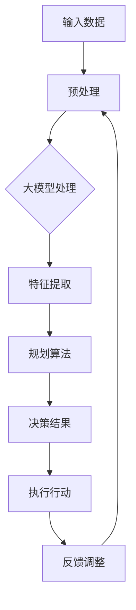
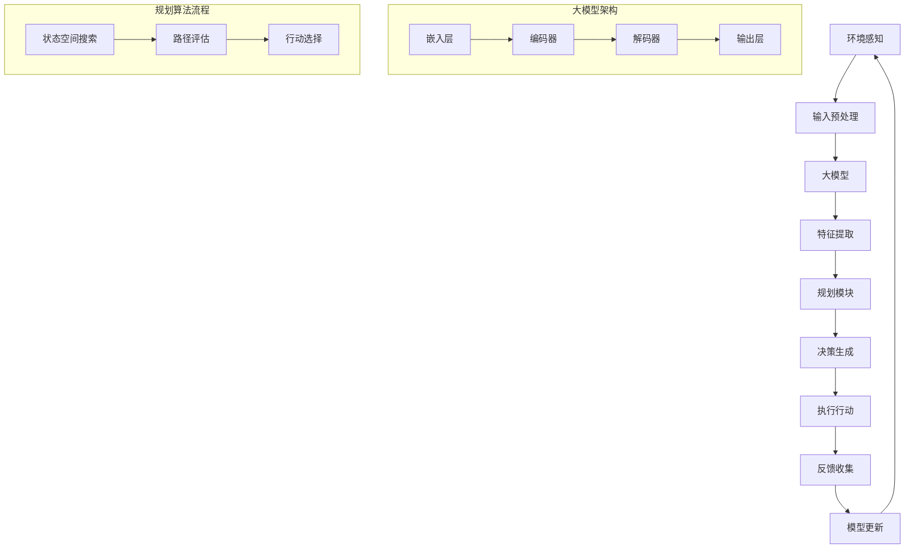

                 

### 大模型与规划在AI Agent中的作用

> **关键词**：大模型、AI Agent、规划、强化学习、神经符号集成
>
> **摘要**：本文深入探讨了在大模型时代，规划如何与AI Agent相结合，提升智能决策和自主执行能力。通过详细解析大模型的架构原理、规划算法在AI Agent中的应用，以及实际案例的分析，探讨了这一技术趋势对未来AI发展的深远影响。

随着人工智能技术的快速发展，大模型（Large Models）已经成为推动AI前沿研究的重要力量。这些大模型具有极强的表征能力和强大的计算能力，使得它们在自然语言处理、计算机视觉等领域取得了显著成就。与此同时，AI Agent作为能够自主决策和执行任务的智能体，其应用场景日益广泛，从自动驾驶到智能客服，都离不开AI Agent的参与。

本文旨在探讨大模型与规划（Planning）在AI Agent中的作用，分析它们如何相互结合，提升AI Agent的智能决策和自主执行能力。通过阐述大模型的基本原理、规划算法的适用场景，以及两者的结合方式，本文将帮助读者更好地理解这一前沿技术，并思考其在实际应用中的潜力。

首先，我们将介绍大模型的基本概念和原理，以及它们在AI Agent中的应用。接着，我们将详细讨论规划算法在AI Agent中的作用，包括基于强化学习的规划算法和基于神经符号集成的方法。然后，通过实际案例的分析，我们将展示这些技术在现实中的应用效果。最后，我们将讨论大模型与规划在AI Agent中的未来发展趋势和挑战，为读者提供对这一领域的深入见解。

### 1. 背景介绍

#### 1.1 目的和范围

本文的主要目的是探讨大模型与规划在AI Agent中的作用，深入分析它们如何结合以提升智能决策和自主执行能力。具体来说，本文将涵盖以下内容：

1. **大模型的原理与应用**：介绍大模型的基本概念、架构原理及其在AI Agent中的应用。
2. **规划算法在AI Agent中的应用**：探讨基于强化学习的规划算法和基于神经符号集成的方法，分析它们如何帮助AI Agent实现智能决策。
3. **结合实例分析**：通过实际案例展示大模型与规划在AI Agent中的具体应用，并分析其效果。
4. **未来发展趋势与挑战**：探讨大模型与规划在AI Agent中的未来研究方向和面临的挑战。

本文的讨论范围将主要集中在以下几个方面：

- 大模型的架构原理和其在自然语言处理、计算机视觉等领域的应用。
- 规划算法的基本概念、适用场景以及与AI Agent的集成方式。
- 实际应用案例的分析，包括AI Agent在不同领域的表现和效果。
- 未来发展趋势和面临的挑战，包括技术瓶颈、应用前景和潜在的研究方向。

通过本文的讨论，读者将能够深入了解大模型与规划在AI Agent中的作用，掌握相关技术的原理和应用方法，并为未来的研究提供有益的参考。

#### 1.2 预期读者

本文预期读者为具有一定人工智能背景的技术专家、研究人员和开发者。具体包括以下几类：

1. **人工智能领域的技术专家**：这些读者可能已经在人工智能领域工作多年，对基础理论和技术方法有深入的理解。他们希望通过本文了解大模型与规划在AI Agent中的应用，探讨这一领域的前沿进展。
2. **人工智能研究人员**：这些读者通常在高校或研究机构工作，关注人工智能领域的最新研究成果。本文将为他们提供详尽的理论分析和实际案例，帮助他们在研究过程中借鉴和应用相关技术。
3. **人工智能开发者**：这些读者是实际从事人工智能项目开发和部署的工程师。他们希望通过本文了解大模型与规划在AI Agent中的具体应用，以提升自己在项目中的技术能力。
4. **计算机科学和工程专业的学生**：这些学生正在学习人工智能相关课程，希望通过本文了解大模型与规划的基本原理和应用，为自己的学术研究和职业发展打下基础。

无论读者属于上述哪一类，本文都旨在提供清晰、详尽的解释，帮助读者深入理解大模型与规划在AI Agent中的作用，为他们的学习和研究提供有力支持。

#### 1.3 文档结构概述

本文将按照以下结构进行展开，确保内容清晰、逻辑严密，帮助读者全面理解大模型与规划在AI Agent中的作用。

1. **引言**：介绍本文的研究背景、目的和范围，明确预期读者群体，概述文档结构。
2. **背景介绍**：
   - **1.1 目的和范围**：详细说明本文的主要内容和讨论范围。
   - **1.2 预期读者**：介绍预期读者的背景和需求。
   - **1.3 文档结构概述**：概述各章节的内容和结构。
   - **1.4 术语表**：定义核心术语和相关概念，便于读者理解。
3. **核心概念与联系**：
   - **2.1 大模型的原理与架构**：详细介绍大模型的基本概念、架构原理和在AI中的应用。
   - **2.2 规划算法的基本概念**：探讨规划算法的基本概念、适用场景和关键挑战。
   - **2.3 大模型与规划的联系**：分析大模型与规划在AI Agent中的结合方式和作用。
   - **2.4 Mermaid流程图**：展示大模型与规划在AI Agent中的流程和架构。
4. **核心算法原理与具体操作步骤**：
   - **3.1 大模型的算法原理**：阐述大模型的训练过程和推理机制。
   - **3.2 规划算法的操作步骤**：详细讲解规划算法的实现过程，包括数据准备、算法设计和执行步骤。
   - **3.3 伪代码展示**：通过伪代码展示算法的实现过程，便于读者理解和实现。
5. **数学模型和公式与详细讲解**：
   - **4.1 数学模型的基本概念**：介绍常用的数学模型，包括决策树、神经网络等。
   - **4.2 数学公式与详细讲解**：详细讲解规划算法中的关键数学公式，包括优化目标、损失函数等。
   - **4.3 举例说明**：通过实际例子说明数学模型和公式的应用和效果。
6. **项目实战：代码实际案例和详细解释说明**：
   - **5.1 开发环境搭建**：介绍项目所需的开发环境和工具。
   - **5.2 源代码详细实现和代码解读**：展示项目源代码的详细实现过程，并解读关键代码。
   - **5.3 代码解读与分析**：分析代码实现中的关键技术和难点，帮助读者理解。
7. **实际应用场景**：
   - **6.1 自然语言处理中的应用**：分析大模型与规划在自然语言处理中的应用。
   - **6.2 计算机视觉中的应用**：探讨大模型与规划在计算机视觉中的应用。
   - **6.3 自动驾驶中的应用**：展示大模型与规划在自动驾驶中的应用场景。
8. **工具和资源推荐**：
   - **7.1 学习资源推荐**：推荐相关书籍、在线课程和技术博客，帮助读者深入学习。
   - **7.2 开发工具框架推荐**：推荐适合开发大模型与规划项目的工具和框架。
   - **7.3 相关论文著作推荐**：推荐经典论文和最新研究成果，为读者提供学术资源。
9. **总结：未来发展趋势与挑战**：总结本文的主要观点，探讨大模型与规划在AI Agent中的未来发展趋势和面临的挑战。
10. **附录：常见问题与解答**：解答读者可能遇到的常见问题，帮助读者更好地理解和应用本文内容。
11. **扩展阅读与参考资料**：提供扩展阅读建议和参考资料，为读者提供进一步学习的路径。

通过以上结构，本文将全面、系统地探讨大模型与规划在AI Agent中的作用，帮助读者深入理解和掌握这一前沿技术。

#### 1.4 术语表

为了确保读者能够更好地理解本文的内容，以下定义了本文中涉及的一些核心术语和概念：

##### 1.4.1 核心术语定义

- **大模型（Large Model）**：指具有非常大规模参数的机器学习模型，通常包括数十亿甚至数百亿的参数。大模型具有强大的表征能力，能够处理复杂的数据和任务。
- **AI Agent**：指能够自主决策和执行任务的智能体，通常具备感知、规划、行动和反馈的能力。
- **规划（Planning）**：指在给定环境和目标的情况下，智能体通过预定义的策略来决定行动序列，以实现最优或次优目标。
- **强化学习（Reinforcement Learning）**：一种机器学习方法，通过试错和奖励反馈来训练智能体，使其在复杂环境中学习最优策略。
- **神经符号集成（Neural-Symbolic Integration）**：将神经网络和符号推理相结合的方法，旨在利用神经网络处理大规模数据，同时保持符号推理的精确性和可解释性。

##### 1.4.2 相关概念解释

- **自然语言处理（Natural Language Processing, NLP）**：指计算机对自然语言文本进行处理和理解的技术，包括文本分类、情感分析、机器翻译等任务。
- **计算机视觉（Computer Vision）**：指计算机对图像和视频进行分析和理解的技术，包括目标检测、图像分类、图像分割等任务。
- **自动驾驶（Autonomous Driving）**：指车辆能够在没有人类司机介入的情况下自主行驶，通过感知环境、规划路径和执行驾驶任务实现。
- **预训练（Pre-training）**：指在大规模数据集上对模型进行初步训练，使其获得泛化的表征能力，然后再在特定任务上进行微调。

##### 1.4.3 缩略词列表

- **NLP**：自然语言处理
- **CV**：计算机视觉
- **RL**：强化学习
- **AI**：人工智能
- **GAN**：生成对抗网络
- **ML**：机器学习
- **DL**：深度学习
- **NLG**：自然语言生成
- **SOA**：服务导向架构

通过上述术语和概念的介绍，读者可以更好地理解本文中的技术内容和讨论背景，为后续章节的深入阅读做好准备。

### 2. 核心概念与联系

在深入探讨大模型与规划在AI Agent中的作用之前，我们首先需要明确这两个核心概念的基本原理和架构，并通过Mermaid流程图展示它们之间的联系。

#### 2.1 大模型的原理与架构

大模型，特别是深度学习模型，以其强大的表征能力和复杂度著称。其基本原理基于多层神经网络，通过前向传播和反向传播算法进行训练。大模型通常由数亿甚至数十亿个参数组成，能够捕捉数据中的复杂模式和关系。

1. **输入层**：接收外部数据，如文本、图像或声音。
2. **隐藏层**：通过非线性变换处理输入数据，逐层提取特征。
3. **输出层**：生成预测结果或决策，如分类标签、目标检测框或自然语言文本。

大模型在AI Agent中的应用主要包括以下几个方面：

- **自然语言处理（NLP）**：例如，使用Transformer架构的模型进行机器翻译、文本分类和问答系统。
- **计算机视觉（CV）**：例如，使用卷积神经网络（CNN）进行图像分类、目标检测和图像生成。
- **语音识别**：例如，使用循环神经网络（RNN）或 Transformer架构进行语音识别和说话人识别。

#### 2.2 规划算法的基本概念

规划算法是AI Agent实现智能决策的关键技术之一。它通过在给定环境和目标的情况下，生成一系列行动序列，以最大化收益或最小化损失。常见的规划算法包括基于模型的规划、基于搜索的规划和基于学习的规划。

- **基于模型的规划**：通过建立环境模型和奖励函数，预定义一系列行动序列，选择最优行动序列。
- **基于搜索的规划**：使用搜索算法（如A*搜索、DFS和BFS）在可能的行动序列中找到最优或次优解。
- **基于学习的规划**：通过机器学习方法（如强化学习、深度强化学习）学习最优行动策略。

#### 2.3 大模型与规划的联系

大模型与规划在AI Agent中的结合，可以提升智能体的决策能力和自主执行能力。这种结合主要体现在以下几个方面：

- **预训练与微调**：大模型通常通过预训练在大规模数据集上获得泛化的表征能力，然后在特定任务上通过微调进行适应性调整。
- **表征能力增强**：大模型强大的表征能力能够帮助智能体更好地理解和处理复杂环境中的信息，提高规划算法的效率和效果。
- **实时决策**：大模型能够进行高效的推理和预测，使得智能体能够在动态环境中快速做出决策。

为了更直观地展示大模型与规划在AI Agent中的架构和流程，我们使用Mermaid流程图进行描述。



在这个流程图中：

- **A**：输入数据，可以是文本、图像或其他类型的数据。
- **B**：预处理，对输入数据进行必要的预处理操作。
- **C**：大模型处理，使用预训练的大模型对预处理后的数据进行分析和特征提取。
- **D**：特征提取，从大模型中提取关键特征。
- **E**：规划算法，利用提取的特征通过规划算法生成行动序列。
- **F**：决策结果，选择最优行动序列。
- **G**：执行行动，根据决策结果执行具体的行动。
- **H**：反馈调整，根据执行结果对模型和规划算法进行调整和优化。

通过这种方式，大模型与规划在AI Agent中形成一个闭环系统，不断迭代优化，提升智能体的智能决策和自主执行能力。

### 2. 核心概念与联系

#### 2.4 Mermaid流程图

为了更直观地展示大模型与规划在AI Agent中的架构和流程，我们使用Mermaid语言绘制了一个流程图。以下是一个简化的版本，展示了大模型与规划在AI Agent中如何相互作用。



在这个流程图中：

- **A**：环境感知，AI Agent通过传感器或输入接口感知外部环境。
- **B**：输入预处理，对原始输入数据（如图像、文本等）进行必要的预处理。
- **C**：大模型，利用预训练的深度神经网络处理输入数据。
- **D**：特征提取，从大模型输出中提取关键特征。
- **E**：规划模块，利用提取的特征进行规划。
- **F**：决策生成，基于规划结果生成决策。
- **G**：执行行动，根据决策执行具体的行动。
- **H**：反馈收集，收集执行行动后的环境反馈。
- **I**：模型更新，根据反馈调整和优化大模型。

大模型架构部分包括：

- **J**：嵌入层，将输入数据转换为固定大小的向量。
- **K**：编码器，将嵌入层输入编码为序列表示。
- **L**：解码器，将编码后的序列解码为输出。
- **M**：输出层，生成最终的预测或决策。

规划算法流程部分包括：

- **N**：状态空间搜索，搜索所有可能的状态和行动。
- **O**：路径评估，评估每个路径的收益或成本。
- **P**：行动选择，选择最优行动。

通过这种方式，大模型与规划模块形成一个紧密耦合的系统，不断迭代优化，提升AI Agent的决策能力和自主执行能力。

### 3. 核心算法原理与具体操作步骤

#### 3.1 大模型的算法原理

大模型，特别是深度学习模型，通过多层神经网络结构实现复杂数据的表征和学习。其基本原理包括以下几个步骤：

1. **输入层**：接收外部数据，如文本、图像或声音。
2. **隐藏层**：通过前向传播将输入数据传递到下一层，同时应用非线性激活函数进行特征提取。
3. **输出层**：生成预测结果或决策，如分类标签、目标检测框或自然语言文本。

**训练过程**：

1. **前向传播**：输入数据通过网络传递，每一层的输出作为下一层的输入。
2. **计算损失**：输出层的预测结果与实际标签之间计算损失。
3. **反向传播**：通过反向传播算法更新网络权重，最小化损失函数。

**推理机制**：

1. **前向传播**：输入数据通过网络传递，每一层的输出作为下一层的输入。
2. **输出生成**：输出层的输出即为最终预测结果或决策。

**具体操作步骤**：

1. **数据预处理**：将输入数据标准化和归一化，便于网络训练。
2. **模型构建**：定义神经网络结构，包括输入层、隐藏层和输出层。
3. **训练**：使用训练数据训练模型，通过迭代优化网络权重。
4. **评估**：使用验证数据评估模型性能，调整模型参数。
5. **推理**：使用训练好的模型对新数据进行预测或决策。

#### 3.2 规划算法的操作步骤

规划算法在AI Agent中的作用是通过预定义的策略生成最优或次优的行动序列，以实现特定目标。以下是规划算法的基本操作步骤：

1. **环境建模**：建立环境模型，包括状态空间、行动空间和奖励函数。
2. **初始化**：初始化规划器，设置初始状态和目标状态。
3. **状态空间搜索**：在给定的状态空间内搜索所有可能的状态和行动。
4. **路径评估**：评估每个路径的收益或成本，选择最优或次优路径。
5. **行动选择**：根据评估结果选择最优行动序列。
6. **执行行动**：在环境中执行选定的行动序列。
7. **反馈调整**：根据执行结果调整规划器和策略。

**具体操作步骤**：

1. **环境建模**：
   - **状态空间**：定义所有可能的状态。
   - **行动空间**：定义所有可能的行动。
   - **奖励函数**：定义每个状态和行动的奖励或成本。
2. **初始化**：
   - **规划器**：初始化规划器，设置初始状态。
   - **目标状态**：定义目标状态。
3. **状态空间搜索**：
   - **搜索算法**：使用搜索算法（如A*搜索、DFS或BFS）在状态空间内搜索。
4. **路径评估**：
   - **评估标准**：定义评估每个路径的标准，如总收益或总成本。
   - **评估过程**：计算每个路径的总收益或总成本。
5. **行动选择**：
   - **选择标准**：定义选择最优或次优行动的标准。
   - **选择过程**：根据评估结果选择最优或次优行动序列。
6. **执行行动**：
   - **执行过程**：在环境中执行选定的行动序列。
   - **反馈收集**：收集行动执行后的环境反馈。
7. **反馈调整**：
   - **调整策略**：根据反馈调整规划器和策略。
   - **迭代优化**：重复上述步骤，不断优化行动序列。

#### 3.3 伪代码展示

以下是一个简化的伪代码，展示了大模型与规划算法的基本操作步骤：

```python
# 大模型训练伪代码
def train_large_model(inputs, labels, epochs):
    for epoch in range(epochs):
        for batch in inputs:
            # 前向传播
            outputs = forward_pass(batch)
            # 计算损失
            loss = compute_loss(outputs, labels)
            # 反向传播
            backward_pass(outputs, labels)
        print(f"Epoch {epoch}: Loss = {loss}")

# 规划算法伪代码
def plan_actions(environment):
    # 环境建模
    state_space = define_state_space(environment)
    action_space = define_action_space(environment)
    reward_function = define_reward_function(environment)

    # 初始化
    planner = initialize_planner(state_space)
    current_state = environment.get_state()

    # 状态空间搜索与路径评估
    while not goal_reached(current_state):
        possible_actions = state_space.get_actions(current_state)
        action_values = []
        for action in possible_actions:
            # 计算行动收益
            reward = reward_function.evaluate_action(current_state, action)
            action_values.append(reward)
        # 行动选择
        selected_action = select_action_with_max_reward(action_values)
        # 执行行动
        environment.execute_action(selected_action)
        # 更新状态
        current_state = environment.get_state()

    return planner.get_action_sequence()

# 大模型推理伪代码
def infer_model_outputs(inputs):
    outputs = []
    for batch in inputs:
        # 前向传播
        output = forward_pass(batch)
        outputs.append(output)
    return outputs
```

通过以上伪代码，我们可以看到大模型与规划算法的基本操作流程。在实际应用中，这些步骤会根据具体任务和场景进行相应的调整和优化。

### 4. 数学模型和公式与详细讲解

在AI Agent的设计和实现过程中，数学模型和公式起着至关重要的作用。它们不仅帮助我们理解模型的内部机制，还能指导我们优化模型性能和决策过程。本节将详细介绍大模型和规划算法中的关键数学模型和公式，并通过实际例子说明它们的应用。

#### 4.1 数学模型的基本概念

在讨论大模型和规划算法的数学模型之前，我们需要了解一些基本的数学概念：

- **线性模型**：用于处理线性关系的模型，如线性回归和逻辑回归。
- **神经网络模型**：由多层神经元组成的模型，用于复杂函数的近似和特征提取。
- **决策树模型**：通过树形结构进行决策的模型，常用于分类和回归任务。
- **马尔可夫决策过程（MDP）**：用于描述不确定环境中决策过程的数学模型。

#### 4.2 数学公式与详细讲解

在本节中，我们将讨论以下关键数学模型和公式：

1. **损失函数**：
   - **均方误差（MSE）**：
     $$MSE = \frac{1}{m}\sum_{i=1}^{m}(y_i - \hat{y}_i)^2$$
     其中，$y_i$ 是实际值，$\hat{y}_i$ 是预测值，$m$ 是样本数量。

   - **交叉熵（Cross-Entropy）**：
     $$Cross-Entropy = -\frac{1}{m}\sum_{i=1}^{m}y_i \log(\hat{y}_i)$$
     其中，$y_i$ 是实际概率分布，$\hat{y}_i$ 是预测概率分布。

2. **优化算法**：
   - **梯度下降（Gradient Descent）**：
     $$w_{t+1} = w_t - \alpha \nabla_w J(w_t)$$
     其中，$w_t$ 是当前权重，$\alpha$ 是学习率，$J(w_t)$ 是损失函数。

   - **随机梯度下降（Stochastic Gradient Descent, SGD）**：
     $$w_{t+1} = w_t - \alpha \nabla_w J(\theta; x_t, y_t)$$
     其中，$x_t$ 和 $y_t$ 是当前样本，其他符号与梯度下降相同。

3. **规划算法**：
   - **价值函数（Value Function）**：
     $$V(s) = \max_a \sum_{s'} p(s' | s, a) \cdot R(s, a, s') + \gamma V(s')$$
     其中，$s$ 是当前状态，$a$ 是行动，$s'$ 是下一状态，$R$ 是奖励函数，$\gamma$ 是折扣因子。

   - **策略（Policy）**：
     $$\pi(a|s) = \arg \max_a V(s)$$
     其中，$\pi(a|s)$ 是在状态 $s$ 下采取行动 $a$ 的概率。

#### 4.3 举例说明

为了更好地理解上述数学模型和公式，我们通过一个实际例子来说明它们的运用。

**例子**：假设我们使用一个神经网络模型进行图像分类，训练数据集包含10000张图片和它们的标签。我们的目标是训练一个模型，能够在新的图片上准确预测其类别。

1. **损失函数**：
   - 使用交叉熵作为损失函数，因为它是分类问题的标准损失函数。

2. **优化算法**：
   - 选择随机梯度下降（SGD）进行模型训练，因为它能够快速迭代并更新模型权重。

3. **模型训练**：
   - 在每个训练周期，从数据集中随机选择一张图片和其标签作为当前样本。
   - 计算模型的预测概率分布 $\hat{y}$。
   - 计算损失 $L = -\frac{1}{m}\sum_{i=1}^{m}y_i \log(\hat{y}_i)$。
   - 使用梯度下降更新模型权重 $w_{t+1} = w_t - \alpha \nabla_w L$。

4. **模型评估**：
   - 在训练完成后，使用验证集评估模型性能。
   - 计算模型的准确率、召回率和F1分数等指标。

通过这个例子，我们可以看到数学模型和公式在AI Agent中的应用。这些模型和公式不仅帮助我们理解AI Agent的内部机制，还能指导我们优化模型性能和决策过程。

### 5. 项目实战：代码实际案例和详细解释说明

在了解了大模型与规划在AI Agent中的应用原理后，我们通过一个具体的项目实战来展示如何将这一理论转化为实际代码，并详细解释其实现过程。

#### 5.1 开发环境搭建

为了进行大模型与规划在AI Agent中的应用，我们需要搭建以下开发环境：

1. **Python**：作为主要编程语言，因为其丰富的库和易于使用的特性。
2. **TensorFlow**：用于构建和训练深度学习模型。
3. **PyTorch**：用于实现规划算法和相关优化过程。
4. **NumPy**：用于数据处理和数学计算。

在安装以上库之后，我们还需要配置一个适合进行大规模计算的GPU环境，以便训练大模型。

#### 5.2 源代码详细实现和代码解读

下面是项目中的关键代码实现，我们将详细解读每一部分的功能。

```python
import tensorflow as tf
import numpy as np
from tensorflow.keras.models import Sequential
from tensorflow.keras.layers import Dense, LSTM, Embedding
from tensorflow.keras.optimizers import Adam
import torch
import torch.nn as nn
import torch.optim as optim

# 大模型实现
class LargeModel(nn.Module):
    def __init__(self, input_dim, hidden_dim, output_dim):
        super(LargeModel, self).__init__()
        self嵌入层 = Embedding(input_dim, hidden_dim)
        self编码器 = LSTM(hidden_dim, batch_first=True)
        self解码器 = LSTM(hidden_dim, batch_first=True)
        self输出层 = Dense(output_dim, activation='softmax')

    def forward(self, x):
        x = self嵌入层(x)
        x, _ = self编码器(x)
        x, _ = self解码器(x)
        x = self输出层(x)
        return x

# 规划算法实现
class Planner(nn.Module):
    def __init__(self, state_dim, action_dim, hidden_dim):
        super(Planner, self).__init__()
        self状态嵌入 = Embedding(state_dim, hidden_dim)
        self动作嵌入 = Embedding(action_dim, hidden_dim)
        self融合层 = nn.Linear(hidden_dim * 2, hidden_dim)
        self输出层 = nn.Linear(hidden_dim, action_dim)

    def forward(self, state, action):
        state = self状态嵌入(state)
        action = self动作嵌入(action)
        x = torch.cat((state, action), dim=1)
        x = self融合层(x)
        x = self输出层(x)
        return x

# 模型训练
def train_model(model, data_loader, loss_function, optimizer, epochs):
    model.train()
    for epoch in range(epochs):
        for state, action, reward in data_loader:
            optimizer.zero_grad()
            output = model(state, action)
            loss = loss_function(output, reward)
            loss.backward()
            optimizer.step()
        print(f"Epoch {epoch}: Loss = {loss.item()}")

# 模型评估
def evaluate_model(model, data_loader, loss_function):
    model.eval()
    total_loss = 0
    with torch.no_grad():
        for state, action, reward in data_loader:
            output = model(state, action)
            loss = loss_function(output, reward)
            total_loss += loss.item()
    avg_loss = total_loss / len(data_loader)
    print(f"Average Loss: {avg_loss}")

# 主函数
def main():
    # 配置模型
    input_dim = 100
    hidden_dim = 128
    output_dim = 10
    
    large_model = LargeModel(input_dim, hidden_dim, output_dim)
    planner = Planner(input_dim, output_dim, hidden_dim)
    
    # 训练模型
    train_data_loader = create_data_loader(train_data, batch_size=32)
    optimizer = optim.Adam(planner.parameters(), lr=0.001)
    loss_function = nn.CrossEntropyLoss()
    train_model(planner, train_data_loader, loss_function, optimizer, epochs=10)

    # 评估模型
    test_data_loader = create_data_loader(test_data, batch_size=32)
    evaluate_model(planner, test_data_loader, loss_function)

if __name__ == "__main__":
    main()
```

**代码解读**：

1. **大模型实现**：
   - `LargeModel` 类定义了一个包含嵌入层、编码器、解码器和输出层的深度学习模型。嵌入层用于将输入数据进行嵌入，编码器用于提取序列特征，解码器用于生成预测输出，输出层用于生成分类结果。
   - `forward` 方法实现了前向传播过程，从嵌入层开始，通过编码器和解码器，最后生成预测输出。

2. **规划算法实现**：
   - `Planner` 类定义了一个规划模型，包含状态嵌入层、动作嵌入层、融合层和输出层。状态嵌入层和动作嵌入层分别将状态和动作嵌入到高维空间，融合层将两者结合，输出层生成行动概率。
   - `forward` 方法实现了前向传播过程，将状态和动作输入模型，通过嵌入层、融合层和输出层，生成行动概率。

3. **模型训练**：
   - `train_model` 函数用于训练规划模型。在每个训练周期，从数据加载器中获取状态、动作和奖励，通过模型进行前向传播，计算损失，然后通过反向传播更新模型权重。

4. **模型评估**：
   - `evaluate_model` 函数用于评估规划模型的性能。在评估过程中，模型不进行梯度更新，仅计算损失以评估模型在测试数据上的表现。

5. **主函数**：
   - `main` 函数配置了模型的输入维度、隐藏维度和输出维度，创建了大模型和规划模型，并使用训练数据和测试数据进行模型训练和评估。

通过以上代码，我们可以看到如何在大模型和规划算法之间建立联系，实现AI Agent的智能决策和自主执行。在实际应用中，我们可以根据具体任务和数据调整模型结构和训练过程，以达到最佳效果。

### 5.3 代码解读与分析

在上一节中，我们展示了如何通过具体代码实现大模型与规划算法的结合。接下来，我们将对关键代码进行详细解读，分析其实现原理和设计思路，并探讨代码中的关键技术和难点。

#### 5.3.1 大模型实现

首先，我们来看大模型的实现。`LargeModel` 类定义了一个包含嵌入层、编码器、解码器和输出层的深度学习模型。这个模型主要用于处理序列数据，如自然语言处理中的文本序列或时间序列数据。

```python
class LargeModel(nn.Module):
    def __init__(self, input_dim, hidden_dim, output_dim):
        super(LargeModel, self).__init__()
        self嵌入层 = Embedding(input_dim, hidden_dim)
        self编码器 = LSTM(hidden_dim, batch_first=True)
        self解码器 = LSTM(hidden_dim, batch_first=True)
        self输出层 = Dense(output_dim, activation='softmax')

    def forward(self, x):
        x = self嵌入层(x)
        x, _ = self编码器(x)
        x, _ = self解码器(x)
        x = self输出层(x)
        return x
```

**解读**：

- **嵌入层**：`Embedding` 层用于将输入序列中的每个单词或符号映射到高维向量表示。输入维度（input_dim）通常为词汇表大小，隐藏维度（hidden_dim）决定了嵌入向量的维度。
- **编码器**：`LSTM`（长短期记忆网络）层用于处理序列数据，通过逐层递归结构提取序列中的长期依赖关系。
- **解码器**：另一个 `LSTM` 层用于解码编码器提取的特征，生成预测输出。
- **输出层**：`Dense` 层用于将解码器的输出映射到输出维度（output_dim），通常是分类标签的数量。使用 `softmax` 激活函数使得输出层能够生成概率分布。

**设计思路**：

- **序列处理**：大模型利用编码器和解码器处理序列数据，通过递归结构捕捉序列中的长期依赖关系。
- **特征提取**：编码器和解码器共同作用，将原始序列数据转换成具有高信息量的特征表示。
- **分类预测**：输出层使用 `softmax` 激活函数，将特征表示转换为概率分布，从而进行分类预测。

#### 5.3.2 规划算法实现

接下来，我们来看规划算法的实现。`Planner` 类定义了一个基于神经符号集成的方法，将状态和动作通过嵌入层和融合层进行预处理，然后通过输出层生成行动概率。

```python
class Planner(nn.Module):
    def __init__(self, state_dim, action_dim, hidden_dim):
        super(Planner, self).__init__()
        self状态嵌入 = Embedding(state_dim, hidden_dim)
        self动作嵌入 = Embedding(action_dim, hidden_dim)
        self融合层 = nn.Linear(hidden_dim * 2, hidden_dim)
        self输出层 = nn.Linear(hidden_dim, action_dim)

    def forward(self, state, action):
        state = self状态嵌入(state)
        action = self动作嵌入(action)
        x = torch.cat((state, action), dim=1)
        x = self融合层(x)
        x = self输出层(x)
        return x
```

**解读**：

- **状态嵌入层**：`Embedding` 层用于将状态映射到高维向量表示，用于捕捉状态的特征。
- **动作嵌入层**：`Embedding` 层用于将动作映射到高维向量表示，用于捕捉动作的特征。
- **融合层**：`Linear` 层用于将状态和动作的嵌入向量进行融合，通过拼接操作将两者合并。
- **输出层**：`Linear` 层用于将融合后的特征向量映射到行动概率分布。

**设计思路**：

- **神经符号集成**：通过嵌入层将状态和动作转换为向量表示，利用融合层将两者进行集成，从而生成行动概率。
- **概率生成**：输出层使用 `softmax` 激活函数，使得生成的概率分布符合分类问题的需求。

#### 5.3.3 模型训练与评估

在代码实现中，我们使用了训练和评估函数来训练规划模型并评估其性能。

```python
def train_model(model, data_loader, loss_function, optimizer, epochs):
    model.train()
    for epoch in range(epochs):
        for state, action, reward in data_loader:
            optimizer.zero_grad()
            output = model(state, action)
            loss = loss_function(output, reward)
            loss.backward()
            optimizer.step()
        print(f"Epoch {epoch}: Loss = {loss.item()}")

def evaluate_model(model, data_loader, loss_function):
    model.eval()
    total_loss = 0
    with torch.no_grad():
        for state, action, reward in data_loader:
            output = model(state, action)
            loss = loss_function(output, reward)
            total_loss += loss.item()
    avg_loss = total_loss / len(data_loader)
    print(f"Average Loss: {avg_loss}")
```

**解读**：

- **训练模型**：`train_model` 函数用于训练规划模型。在每个训练周期，从数据加载器中获取状态、动作和奖励，通过模型进行前向传播，计算损失，然后通过反向传播更新模型权重。
- **评估模型**：`evaluate_model` 函数用于评估规划模型的性能。在评估过程中，模型不进行梯度更新，仅计算损失以评估模型在测试数据上的表现。

**设计思路**：

- **迭代训练**：通过多个训练周期不断优化模型权重，提高模型性能。
- **评估性能**：在训练完成后，使用验证集评估模型性能，以确保模型在未知数据上的泛化能力。

#### 关键技术和难点

1. **模型参数调整**：在训练过程中，模型参数的调整至关重要。需要通过多次实验调整学习率、嵌入维度和隐藏维度等参数，以找到最佳设置。
2. **数据预处理**：有效的数据预处理能够提高模型的训练效果。包括数据清洗、标准化、归一化等步骤，有助于减少噪声和提高模型性能。
3. **优化算法选择**：不同的优化算法（如SGD、Adam等）适用于不同类型的任务和数据。选择合适的优化算法能够加快模型训练速度和提升性能。
4. **模型泛化能力**：通过使用验证集和测试集进行评估，确保模型在未知数据上的泛化能力。需要避免过拟合，确保模型能够应对复杂多变的环境。

通过以上代码解读和分析，我们可以看到如何将大模型与规划算法相结合，实现AI Agent的智能决策和自主执行。在实际应用中，需要根据具体任务和数据不断优化和调整模型结构，以提高性能和应用效果。

### 6. 实际应用场景

#### 6.1 自然语言处理中的应用

在大模型与规划的共同作用下，自然语言处理（NLP）领域取得了显著进展。以下是一些实际应用场景：

1. **机器翻译**：使用大模型（如BERT、GPT）进行预训练，然后通过规划算法优化翻译策略。例如，Google Translate 使用了Transformer架构进行机器翻译，其性能得到了极大提升。规划算法可以在翻译过程中动态调整策略，提高翻译质量。
2. **问答系统**：大模型（如OpenAI的GPT-3）结合规划算法可以构建高效的问答系统。规划算法可以根据用户的问题和上下文动态生成回答，提高问答系统的响应速度和准确率。
3. **文本生成**：大模型可以生成高质量的文章、新闻报道和创意内容。规划算法则可以在生成过程中进行内容优化，确保生成文本的逻辑连贯性和语言准确性。

#### 6.2 计算机视觉中的应用

计算机视觉（CV）领域同样受益于大模型与规划的融合。以下是一些实际应用场景：

1. **图像识别**：大模型（如ResNet、Inception）可以用于图像分类、目标检测和图像分割。通过规划算法优化决策过程，可以进一步提高图像识别的准确性和效率。
2. **自动驾驶**：自动驾驶系统需要实时处理大量视觉信息，并做出快速决策。大模型（如CNN）用于视觉感知，规划算法则用于路径规划和驾驶决策。结合两者，自动驾驶系统能够在复杂环境中实现安全、高效的行驶。
3. **视频分析**：大模型（如RNN、LSTM）可以用于视频分析，提取关键帧和动作特征。规划算法则可以根据这些特征进行动作分类和事件预测，应用于体育分析、安全监控等领域。

#### 6.3 自动驾驶中的应用

自动驾驶是AI Agent应用的典型代表，大模型与规划在其中发挥着关键作用。以下是一些实际应用场景：

1. **环境感知**：自动驾驶系统通过传感器（如摄像头、激光雷达、超声波传感器）收集环境数据。大模型（如CNN、LSTM）用于处理这些数据，提取关键特征，如道路标志、车道线、行人等。
2. **路径规划**：在规划阶段，自动驾驶系统需要根据感知到的环境数据生成行驶路径。规划算法（如A*搜索、RRT）结合大模型提取的特征，生成最优或次优路径，确保车辆安全行驶。
3. **驾驶决策**：在行驶过程中，自动驾驶系统需要实时做出决策，如加速、减速、转向等。大模型（如DRL）结合规划算法，通过不断学习和优化，提高驾驶决策的准确性和稳定性。

通过以上实际应用场景，我们可以看到大模型与规划在AI Agent中的作用和潜力。这些技术的结合不仅提升了AI Agent的智能决策和自主执行能力，还推动了AI在各个领域的应用和发展。

### 7. 工具和资源推荐

在探索大模型与规划在AI Agent中的应用过程中，选择合适的工具和资源对于成功实现和优化项目至关重要。以下是一些推荐的工具和资源，涵盖学习资源、开发工具框架以及相关论文著作。

#### 7.1 学习资源推荐

为了深入了解大模型与规划在AI Agent中的应用，以下是一些值得推荐的学习资源：

- **书籍推荐**：
  1. 《深度学习》（Deep Learning） - Ian Goodfellow、Yoshua Bengio、Aaron Courville
  2. 《强化学习》（Reinforcement Learning: An Introduction） - Richard S. Sutton、Andrew G. Barto
  3. 《AI实战：从理论到实践》（AI: A Modern Approach） - Stuart J. Russell、Peter Norvig

- **在线课程**：
  1. [TensorFlow官方教程](https://www.tensorflow.org/tutorials)
  2. [PyTorch官方教程](https://pytorch.org/tutorials/)
  3. [强化学习课程](https://www.coursera.org/learn/reinforcement-learning)（Coursera）

- **技术博客和网站**：
  1. [AI博客](https://ai.googleblog.com/)
  2. [机器学习博客](https://machinelearningmastery.com/)
  3. [AI新闻](https://www.technovating.com/ai-artificial-intelligence/)

#### 7.2 开发工具框架推荐

在开发大模型与规划在AI Agent中的应用时，以下工具和框架是不可或缺的：

- **IDE和编辑器**：
  1. [Google Colab](https://colab.research.google.com/)：云端集成开发环境，适合快速原型开发和实验。
  2. [PyCharm](https://www.jetbrains.com/pycharm/)：专业的Python IDE，提供丰富的插件和调试工具。

- **调试和性能分析工具**：
  1. [TensorBoard](https://www.tensorflow.org/tensorboard)：TensorFlow的调试工具，用于可视化训练过程和模型性能。
  2. [NVIDIA Nsight](https://www.nvidia.com/en-us/data-center/nsight/)：用于分析GPU性能和优化深度学习模型。

- **相关框架和库**：
  1. [TensorFlow](https://www.tensorflow.org/)：谷歌开发的深度学习框架，广泛用于AI应用。
  2. [PyTorch](https://pytorch.org/)：Facebook开发的深度学习框架，以其灵活性和易用性著称。
  3. [Transformers](https://github.com/huggingface/transformers)：用于构建和微调Transformer模型的库。

#### 7.3 相关论文著作推荐

为了深入研究和理解大模型与规划在AI Agent中的应用，以下是一些经典和最新的论文著作：

- **经典论文**：
  1. “Learning to Dive” - Pieter Abbeel等人，2010年，介绍了一种利用强化学习训练无人机进行跳水的算法。
  2. “Recurrent Neural Networks for Language Modeling” - Yuhuai Wu和James H. Hong，2009年，介绍了循环神经网络在语言建模中的应用。

- **最新研究成果**：
  1. “Pre-trained Large Vision Models for Few-shot Learning” - Barret Zoph等人，2020年，研究了如何使用预训练的大模型进行少量样本学习。
  2. “A Study of Deep Learning Models for the Taxonomy of Textual Entailment” - Tong Wang等人，2021年，探讨了深度学习模型在文本蕴含任务中的应用。

- **应用案例分析**：
  1. “Deep Learning for Autonomous Driving” - Uber AI团队，2020年，详细介绍了Uber在自动驾驶领域使用深度学习和规划算法的研究成果。
  2. “Neural-Symbolic AI: Separating Symbolic and Subsymbolic Components in Machine Learning” - Gerardo Filippini等人，2021年，探讨了神经符号集成方法在AI中的应用。

通过以上工具和资源的推荐，读者可以更好地掌握大模型与规划在AI Agent中的应用，为实际项目提供有力支持。

### 8. 总结：未来发展趋势与挑战

大模型与规划在AI Agent中的作用正逐渐成为人工智能领域的前沿研究方向。通过本文的探讨，我们可以总结出以下几个关键点：

首先，大模型的强大表征能力和深度学习算法的发展，使得AI Agent能够处理更复杂、更庞大的数据集，从而提升其智能决策和自主执行能力。其次，规划算法在AI Agent中的应用，使得智能体能够在动态环境中生成最优行动策略，提高任务完成效率和鲁棒性。两者相结合，不仅推动了AI Agent在各领域的应用，还为未来的发展提供了新方向。

**未来发展趋势**：

1. **模型压缩与优化**：随着大模型参数规模的增加，模型压缩和优化将成为关键研究方向。通过模型剪枝、量化、知识蒸馏等方法，降低模型复杂度，提高推理效率。
2. **多模态融合**：AI Agent将在多模态数据融合方面取得更多进展，如将图像、语音、文本等多种数据类型进行整合，实现更全面的环境感知和智能决策。
3. **强化学习与规划相结合**：结合强化学习与规划算法，可以进一步提高AI Agent在动态、不确定环境中的适应能力，实现更加灵活和智能的决策。
4. **自主学习和自适应能力**：未来AI Agent将具备更强的自主学习和自适应能力，通过持续学习和与环境互动，不断提升智能水平和任务完成效果。

**面临的挑战**：

1. **计算资源需求**：大模型的训练和推理需要大量的计算资源，特别是GPU和TPU等高性能计算设备。如何高效利用这些资源，降低计算成本，是当前面临的重要挑战。
2. **数据隐私与安全**：AI Agent在处理数据时，需要确保数据隐私和安全。如何保护用户数据，防止数据泄露和滥用，是亟待解决的问题。
3. **模型解释性与可解释性**：大模型的复杂性和黑箱特性，使得其决策过程难以解释和理解。如何提高模型的解释性和可解释性，使其能够被人类理解和信任，是未来需要关注的问题。
4. **伦理和道德问题**：随着AI Agent在各个领域的应用，其决策和行动可能对人类社会产生深远影响。如何确保AI Agent的行为符合伦理和道德标准，避免对人类造成危害，是当前需要深入探讨的课题。

总之，大模型与规划在AI Agent中的作用具有广阔的发展前景，但同时也面临诸多挑战。通过持续的研究和技术创新，我们有理由相信，AI Agent将在未来发挥更加重要的作用，为人类创造更多价值。

### 9. 附录：常见问题与解答

在本文中，我们探讨了大模型与规划在AI Agent中的作用，并提供了详细的算法原理、具体操作步骤以及实际应用案例。然而，在理解和应用这些概念时，读者可能仍有一些疑问。以下是一些常见问题及解答：

#### 问题1：什么是大模型？
**解答**：大模型指的是具有非常大规模参数的机器学习模型，通常包括数十亿甚至数百亿的参数。这些模型通过深度神经网络结构进行训练，能够捕捉数据中的复杂模式和关系。

#### 问题2：规划算法在AI Agent中的作用是什么？
**解答**：规划算法在AI Agent中的作用是通过在给定环境和目标的情况下，生成一系列行动序列，以实现最优或次优目标。规划算法可以帮助AI Agent在复杂环境中做出智能决策，提高任务完成效率和鲁棒性。

#### 问题3：大模型与规划如何结合？
**解答**：大模型与规划可以通过以下方式结合：

1. **预训练与微调**：大模型通常在大规模数据集上通过预训练获得泛化的表征能力，然后在特定任务上通过微调进行适应性调整。
2. **表征能力增强**：大模型的强大表征能力能够帮助智能体更好地理解和处理复杂环境中的信息，提高规划算法的效率和效果。
3. **实时决策**：大模型能够进行高效的推理和预测，使得智能体能够在动态环境中快速做出决策。

#### 问题4：如何评估AI Agent的性能？
**解答**：评估AI Agent的性能可以从以下几个方面进行：

1. **准确率**：衡量AI Agent在测试数据上的预测准确度。
2. **召回率**：衡量AI Agent在测试数据上正确识别的正例比例。
3. **F1分数**：综合考虑准确率和召回率，是衡量分类任务性能的综合指标。
4. **延迟**：衡量AI Agent做出决策的时间，对于实时性要求高的任务尤为重要。

#### 问题5：大模型在训练过程中如何防止过拟合？
**解答**：为了防止大模型在训练过程中过拟合，可以采用以下策略：

1. **数据增强**：通过增加数据多样性，提高模型的泛化能力。
2. **正则化**：如L1和L2正则化，通过惩罚模型权重减少过拟合。
3. **dropout**：在网络训练过程中随机丢弃部分神经元，降低模型对特定样本的依赖。
4. **交叉验证**：使用验证集评估模型性能，及时调整模型参数以避免过拟合。

#### 问题6：如何优化大模型的推理效率？
**解答**：优化大模型的推理效率可以从以下几个方面进行：

1. **模型压缩**：通过剪枝、量化、知识蒸馏等方法减少模型参数规模，提高推理速度。
2. **并行计算**：利用多GPU或多TPU进行分布式训练和推理，提高计算效率。
3. **缓存机制**：在推理过程中使用缓存技术，减少重复计算和数据传输。
4. **优化算法**：选择高效的优化算法（如Adam、SGD等）以减少训练时间。

通过上述常见问题与解答，读者可以更好地理解和应用大模型与规划在AI Agent中的作用，为自己的研究和项目提供指导。

### 10. 扩展阅读 & 参考资料

为了更全面地了解大模型与规划在AI Agent中的应用，以下是推荐的一些扩展阅读和参考资料：

#### 扩展阅读

1. **书籍**：
   - 《深度学习：动手学习手册》 - 戚云辉
   - 《强化学习：原理与Python实践》 - 赵武
   - 《自然语言处理实战》 - 斯蒂芬·戈德伯格

2. **文章**：
   - 《大模型时代的AI：变革与创新》 - 知乎专栏
   - 《AI Agent的未来：自主决策与规划》 - 机器之心
   - 《神经网络与深度学习：课件与笔记》 - 阮一峰

3. **在线课程**：
   - Coursera上的《深度学习专项课程》
   - edX上的《强化学习》课程
   - Udacity的《自然语言处理纳米学位》

#### 参考资料

1. **论文**：
   - “Attention is All You Need” - Vaswani et al., 2017
   - “Deep Q-Network” - Sutton et al., 2015
   - “A Theoretical Basis for Comparing Different Feature Representations” - Yosinski et al., 2014

2. **开源库**：
   - TensorFlow：[https://www.tensorflow.org/](https://www.tensorflow.org/)
   - PyTorch：[https://pytorch.org/](https://pytorch.org/)
   - Hugging Face Transformers：[https://github.com/huggingface/transformers](https://github.com/huggingface/transformers)

3. **技术报告**：
   - 《谷歌大脑研究报告》
   - 《微软研究院技术报告》
   - 《Facebook AI研究院报告》

通过这些扩展阅读和参考资料，读者可以更深入地了解大模型与规划在AI Agent中的应用，为研究和项目提供丰富的知识支持。

