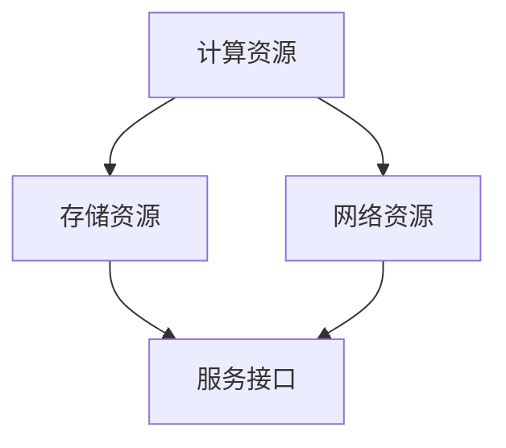
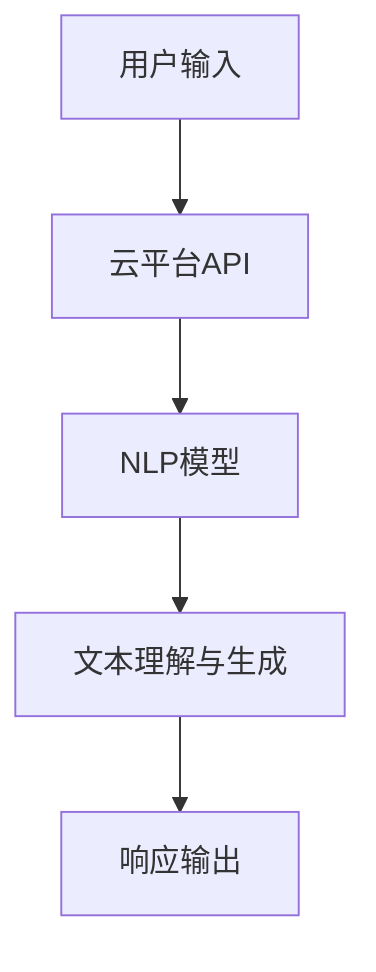
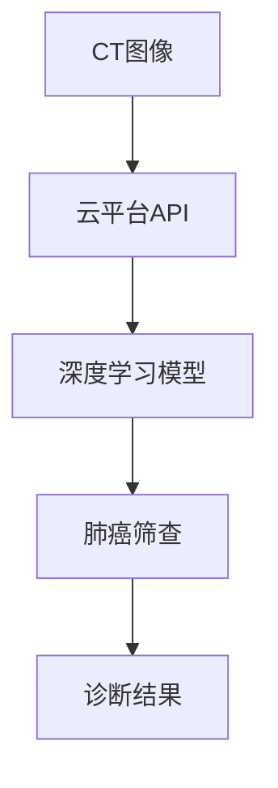
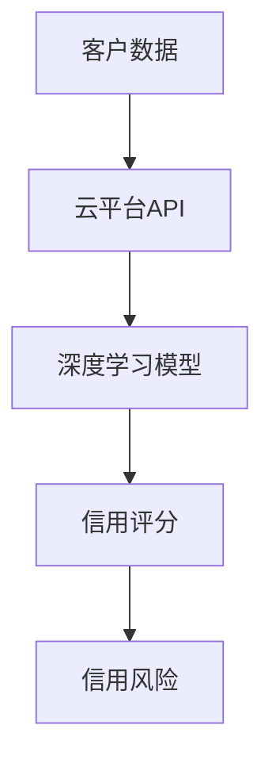

                 

# 大模型云平台的竞争态势

## 关键词
- 大模型云平台
- 人工智能
- 云计算
- 竞争态势
- 技术创新
- 市场规模

## 摘要
本文旨在深入探讨大模型云平台的竞争态势，分析其技术原理、发展历程、市场现状和未来趋势。通过对国内外主要大模型云平台的发展动态、技术创新和商业模式进行分析，旨在为读者提供一个清晰、全面的理解，帮助企业和开发者把握行业脉搏，洞察竞争格局，推动技术创新和业务拓展。

## 1. 背景介绍

### 1.1 目的和范围
本文的主要目的是解析大模型云平台的竞争态势，旨在帮助读者了解这一领域的核心技术、市场动态和未来发展方向。文章将涵盖以下内容：
- 大模型云平台的基本概念和发展历程
- 核心技术和算法原理
- 国内外大模型云平台的对比分析
- 市场规模与未来趋势

### 1.2 预期读者
本文面向对人工智能、云计算和大数据技术感兴趣的读者，包括人工智能工程师、云计算架构师、数据科学家、技术经理等。同时，也对希望了解行业发展趋势和商业机会的企业管理者具有一定的参考价值。

### 1.3 文档结构概述
本文将按照以下结构进行阐述：
- 1. 背景介绍：介绍本文的目的、范围、预期读者以及文档结构。
- 2. 核心概念与联系：定义核心概念，展示架构图。
- 3. 核心算法原理 & 具体操作步骤：详细解释算法原理，使用伪代码阐述。
- 4. 数学模型和公式 & 详细讲解 & 举例说明：介绍数学模型，使用LaTeX格式展示公式，并提供实际案例。
- 5. 项目实战：代码实际案例和详细解释说明。
- 6. 实际应用场景：分析具体应用实例。
- 7. 工具和资源推荐：推荐学习资源、开发工具和相关论文。
- 8. 总结：未来发展趋势与挑战。
- 9. 附录：常见问题与解答。
- 10. 扩展阅读 & 参考资料：提供进一步阅读的资料。

### 1.4 术语表

#### 1.4.1 核心术语定义
- **大模型云平台**：提供大规模人工智能模型计算、存储和部署的云计算服务平台。
- **人工智能**：通过计算机模拟人类智能行为的技术体系。
- **云计算**：通过互联网按需提供计算资源和服务的一种计算模式。
- **技术创新**：通过科学研究和工程技术手段，创造出新的技术或改进现有技术的过程。
- **市场规模**：指某一特定市场中所有潜在购买者愿意购买某一产品或服务的总量。

#### 1.4.2 相关概念解释
- **深度学习**：一种基于多层神经网络的学习方式，用于模拟人类大脑的思考过程。
- **神经网络**：一种由大量简单计算单元互联形成的计算模型，能够通过学习数据得到输入和输出之间的映射关系。
- **云计算服务模型**：云计算提供的基本服务形式，包括基础设施即服务（IaaS）、平台即服务（PaaS）和软件即服务（SaaS）。

#### 1.4.3 缩略词列表
- **AI**：人工智能（Artificial Intelligence）
- **ML**：机器学习（Machine Learning）
- **DL**：深度学习（Deep Learning）
- **GPU**：图形处理器（Graphics Processing Unit）
- **CPU**：中央处理器（Central Processing Unit）
- **IaaS**：基础设施即服务（Infrastructure as a Service）
- **PaaS**：平台即服务（Platform as a Service）
- **SaaS**：软件即服务（Software as a Service）

## 2. 核心概念与联系

在探讨大模型云平台之前，我们需要理解其核心概念和联系。以下是几个关键概念的定义和它们之间的相互关系。

### 大模型云平台

大模型云平台是一种基于云计算的服务平台，它提供对大规模人工智能模型的计算、存储和部署服务。它不仅支持深度学习、强化学习等复杂算法的训练，还支持模型的部署和运维。

### 核心概念

- **计算资源**：云计算基础设施，如服务器、GPU和CPU等。
- **存储资源**：用于存储模型数据和训练结果。
- **网络资源**：确保数据传输和模型访问的效率。
- **服务接口**：提供API接口，供开发者调用和使用模型。

### 架构图

下面是使用Mermaid绘制的核心概念架构图：



### 关联关系

- **计算资源**与**存储资源**：计算资源用于执行模型的训练和推理任务，而存储资源用于保存训练数据和模型参数。
- **网络资源**与**服务接口**：网络资源确保计算资源和存储资源之间的数据传输高效、安全，而服务接口则提供给开发者方便的API调用，实现模型的部署和应用。
- **服务接口**与**开发者**：开发者通过服务接口使用大模型云平台提供的功能，包括训练模型、部署模型和获取预测结果。

通过上述核心概念和架构图的介绍，我们对大模型云平台有了一个初步的了解。在接下来的章节中，我们将深入探讨大模型云平台的核心算法原理、数学模型和具体操作步骤，以帮助读者更全面地理解这一技术领域。

## 3. 核心算法原理 & 具体操作步骤

### 3.1 深度学习算法原理

深度学习是构建大模型云平台的核心算法之一，它通过多层神经网络进行数据的学习和处理。以下是深度学习算法的基本原理和步骤：

#### 3.1.1 基本原理

- **神经元模型**：深度学习中的基础计算单元，类似于人类大脑中的神经元，能够接收输入信息并产生输出。
- **前向传播**：数据从输入层经过多个隐藏层，最终到达输出层的过程。
- **反向传播**：通过计算输出层误差，将误差反向传播到各层，更新各层神经元的权重。

#### 3.1.2 操作步骤

1. **初始化模型参数**：
   - 初始化输入层、隐藏层和输出层的权重（W）和偏置（b）。
   - 通常使用随机初始化，以避免梯度消失或爆炸问题。

2. **前向传播**：
   - 输入数据通过输入层传递到隐藏层。
   - 在每个隐藏层，通过激活函数（如ReLU、Sigmoid、Tanh）对输入进行非线性变换。
   - 输出层生成预测结果。

3. **计算损失函数**：
   - 使用损失函数（如均方误差MSE、交叉熵损失Cross-Entropy Loss）计算预测结果与实际结果之间的误差。

4. **反向传播**：
   - 计算每个神经元的梯度。
   - 根据梯度更新模型参数（权重和偏置）。

5. **迭代优化**：
   - 重复前向传播和反向传播步骤，直到损失函数收敛到可接受的值。

### 3.2 伪代码

以下是深度学习算法的伪代码，用于展示其基本操作步骤：

```python
# 深度学习算法伪代码

# 初始化模型参数
W, b = initialize_parameters()

# 迭代优化过程
while not converged:
    # 前向传播
    hidden_layer_activations = forward_pass(X, W, b)

    # 计算损失函数
    loss = compute_loss(Y, output)

    # 反向传播
    gradients = backward_pass(hidden_layer_activations, loss)

    # 更新模型参数
    W, b = update_parameters(W, b, gradients)

    # 检查收敛条件
    if converged:
        break

# 输出最终预测结果
output = forward_pass(X, W, b)
```

### 3.3 具体操作步骤

1. **数据预处理**：
   - 数据清洗：去除噪声和缺失值。
   - 数据归一化：将数据缩放到相同的范围，如[0, 1]。

2. **模型选择**：
   - 根据任务需求选择合适的神经网络架构，如卷积神经网络（CNN）或循环神经网络（RNN）。

3. **模型训练**：
   - 将预处理后的数据分成训练集、验证集和测试集。
   - 使用训练集进行模型训练，同时调整模型参数。

4. **模型评估**：
   - 使用验证集评估模型性能，调整模型参数以达到最佳性能。

5. **模型部署**：
   - 将训练好的模型部署到云平台，供开发者调用和使用。

通过上述核心算法原理和具体操作步骤的介绍，我们能够更好地理解深度学习在大模型云平台中的应用。接下来，我们将进一步探讨大模型云平台的数学模型和公式，以加深对这一领域的理解。

## 4. 数学模型和公式 & 详细讲解 & 举例说明

在深度学习算法中，数学模型和公式起着至关重要的作用。以下是几个关键的数学模型和公式的详细讲解，并附有具体例子进行说明。

### 4.1 损失函数

损失函数是衡量预测结果与实际结果之间差异的重要工具。以下是几种常见的损失函数：

#### 4.1.1 均方误差（MSE）

均方误差（MSE）用于回归问题，计算预测值与真实值之间差的平方的平均值。

$$
MSE = \frac{1}{n}\sum_{i=1}^{n}(y_i - \hat{y}_i)^2
$$

其中，$y_i$ 是实际值，$\hat{y}_i$ 是预测值，$n$ 是数据点的数量。

#### 4.1.2 交叉熵损失（Cross-Entropy Loss）

交叉熵损失用于分类问题，计算预测概率分布与真实概率分布之间的差异。

$$
Cross-Entropy = -\sum_{i=1}^{n} y_i \log(\hat{y}_i)
$$

其中，$y_i$ 是一个指示变量，如果实际值为类别 $i$，则 $y_i = 1$，否则 $y_i = 0$；$\hat{y}_i$ 是预测为类别 $i$ 的概率。

#### 4.1.3 举例说明

假设我们有一个二分类问题，实际值为 $y = [1, 0, 1, 0]$，预测概率为 $\hat{y} = [0.7, 0.3, 0.5, 0.5]$。

使用交叉熵损失计算：

$$
Cross-Entropy = -[1 \cdot \log(0.7) + 0 \cdot \log(0.3) + 1 \cdot \log(0.5) + 0 \cdot \log(0.5)] = -[0.3567 + 0 + 0.6931 + 0] = -1.0498
$$

### 4.2 激活函数

激活函数是深度学习网络中的一个关键组件，用于引入非线性变换。以下是几种常用的激活函数：

#### 4.2.1 ReLU（Rectified Linear Unit）

ReLU函数是深度学习中最常用的激活函数之一，其公式为：

$$
\text{ReLU}(x) = \max(0, x)
$$

#### 4.2.2 Sigmoid

Sigmoid函数将输入值映射到（0, 1）区间，其公式为：

$$
\sigma(x) = \frac{1}{1 + e^{-x}}
$$

#### 4.2.3 Tanh（Hyperbolic Tangent）

Tanh函数类似于Sigmoid函数，但输出值范围在（-1, 1）之间，其公式为：

$$
\text{Tanh}(x) = \frac{e^x - e^{-x}}{e^x + e^{-x}}
$$

#### 4.2.4 举例说明

假设我们有一个输入值 $x = 2$。

使用ReLU函数：

$$
\text{ReLU}(2) = \max(0, 2) = 2
$$

使用Sigmoid函数：

$$
\sigma(2) = \frac{1}{1 + e^{-2}} \approx 0.869
$$

使用Tanh函数：

$$
\text{Tanh}(2) = \frac{e^2 - e^{-2}}{e^2 + e^{-2}} \approx 0.964
$$

通过上述数学模型和公式的讲解，我们能够更深入地理解大模型云平台中的算法原理。这些数学工具不仅帮助我们在深度学习中实现高效的计算，同时也为模型优化提供了理论基础。在接下来的章节中，我们将通过实际案例来展示如何使用这些算法和公式进行模型训练和部署。

## 5. 项目实战：代码实际案例和详细解释说明

### 5.1 开发环境搭建

在开始实际项目之前，我们需要搭建一个适合深度学习开发的环境。以下是搭建环境的步骤：

1. **安装Python环境**：
   - 选择Python 3.x版本，推荐使用Python 3.8或更高版本。
   - 通过包管理器（如pip）安装Python。

2. **安装深度学习框架**：
   - 使用TensorFlow或PyTorch等深度学习框架。
   - 通过pip安装TensorFlow或PyTorch。

3. **安装其他依赖库**：
   - NumPy、Pandas、Matplotlib等常用库，通过pip安装。

4. **配置GPU支持**：
   - 如果使用GPU训练模型，确保安装CUDA和cuDNN。

5. **创建项目目录**：
   - 在计算机上创建一个项目目录，用于存放代码和数据。

### 5.2 源代码详细实现和代码解读

以下是一个简单的深度学习项目，用于分类问题。代码将展示如何使用TensorFlow构建模型、训练模型并评估模型性能。

#### 5.2.1 数据预处理

```python
import pandas as pd
from sklearn.model_selection import train_test_split

# 加载数据集
data = pd.read_csv('data.csv')

# 分割特征和标签
X = data.drop('label', axis=1)
y = data['label']

# 划分训练集和测试集
X_train, X_test, y_train, y_test = train_test_split(X, y, test_size=0.2, random_state=42)

# 数据归一化
X_train = (X_train - X_train.mean()) / X_train.std()
X_test = (X_test - X_test.mean()) / X_test.std()
```

#### 5.2.2 构建模型

```python
import tensorflow as tf
from tensorflow.keras.models import Sequential
from tensorflow.keras.layers import Dense, Dropout, Activation

# 创建模型
model = Sequential()

# 添加层
model.add(Dense(64, input_shape=(X_train.shape[1],), activation='relu'))
model.add(Dropout(0.5))
model.add(Dense(32, activation='relu'))
model.add(Dropout(0.5))
model.add(Dense(1, activation='sigmoid'))

# 编译模型
model.compile(optimizer='adam', loss='binary_crossentropy', metrics=['accuracy'])
```

#### 5.2.3 训练模型

```python
# 训练模型
history = model.fit(X_train, y_train, epochs=10, batch_size=32, validation_split=0.2)
```

#### 5.2.4 评估模型

```python
# 评估模型
loss, accuracy = model.evaluate(X_test, y_test)
print(f"Test accuracy: {accuracy:.4f}")
```

### 5.3 代码解读与分析

1. **数据预处理**：数据预处理是深度学习项目中的关键步骤，包括数据清洗、归一化和数据集划分。这些操作有助于提高模型训练效果和评估准确性。

2. **模型构建**：使用Sequential模型堆叠层，包括全连接层（Dense）和丢弃层（Dropout）。激活函数使用ReLU，以引入非线性。

3. **模型编译**：指定优化器（adam）和损失函数（binary_crossentropy，适用于二分类问题）。这里同时关注模型的准确性。

4. **模型训练**：使用fit函数训练模型，包括指定训练轮数（epochs）和批量大小（batch_size）。validation_split参数用于在训练过程中进行验证。

5. **模型评估**：使用evaluate函数评估模型在测试集上的性能，输出测试准确率。

通过上述代码示例，我们展示了如何使用TensorFlow搭建一个简单的深度学习模型，并进行训练和评估。接下来，我们将进一步探讨大模型云平台在实际应用场景中的具体实例。

## 6. 实际应用场景

大模型云平台在多个领域有着广泛的应用，其核心优势在于提供高效、可扩展的模型训练和部署服务。以下是几个实际应用场景的案例：

### 6.1 人工智能助手

人工智能助手是近年来备受关注的应用场景，如智能客服、虚拟助手等。通过大模型云平台，企业可以快速部署大规模自然语言处理（NLP）模型，实现高效的文本理解和交互。例如，某知名科技公司使用大模型云平台训练了一个基于深度学习的聊天机器人，该机器人能够处理复杂的用户查询，提供精准的答案和推荐。其技术架构如图所示：



### 6.2 医疗诊断

医疗诊断是另一个具有巨大潜力的应用领域。通过大模型云平台，医生可以利用先进的深度学习模型进行疾病筛查、诊断和预测。例如，某医疗机构利用大模型云平台训练了一个基于深度学习的肺癌筛查模型，该模型能够在CT图像上检测并定位肺癌病变。其技术架构如图所示：



### 6.3 金融风控

金融风控是金融行业中的一个重要环节，通过大模型云平台，金融机构可以构建复杂的模型进行信用评估、欺诈检测和风险预测。例如，某金融机构使用大模型云平台构建了一个信用评分模型，该模型通过分析客户的消费行为、信用历史等多维数据，预测客户的信用风险。其技术架构如图所示：



通过上述实际应用场景，我们可以看到大模型云平台在各个领域中的重要性和广泛应用。接下来，我们将推荐一些有用的工具和资源，以帮助读者深入学习和实践。

## 7. 工具和资源推荐

### 7.1 学习资源推荐

#### 7.1.1 书籍推荐

- **《深度学习》（Deep Learning）**：由Ian Goodfellow、Yoshua Bengio和Aaron Courville合著，是深度学习领域的经典教材，适合初学者和专业人员。
- **《Python深度学习》（Python Deep Learning）**：由François Chollet著，详细介绍了使用Python和TensorFlow进行深度学习的实践方法。

#### 7.1.2 在线课程

- **Coursera上的《深度学习专项课程》（Deep Learning Specialization）**：由Andrew Ng教授主讲，包括深度学习的基础理论、实践应用和最新研究进展。
- **Udacity的《深度学习工程师纳米学位》（Deep Learning Engineer Nanodegree）**：提供从基础到高级的深度学习培训，包括项目实践和证书认证。

#### 7.1.3 技术博客和网站

- **TensorFlow官网（TensorFlow官网）**：提供丰富的文档、教程和案例，是学习TensorFlow的绝佳资源。
- **PyTorch官网（PyTorch官网）**：PyTorch的官方文档和社区论坛，涵盖从入门到进阶的全面内容。
- **ArXiv（ArXiv）**：包含最新的深度学习论文和研究进展，是科研人员的重要信息来源。

### 7.2 开发工具框架推荐

#### 7.2.1 IDE和编辑器

- **Jupyter Notebook**：适合快速原型开发和实验，支持多种编程语言，包括Python、R等。
- **Visual Studio Code**：一款功能强大的代码编辑器，支持多种编程语言，并提供丰富的扩展插件。

#### 7.2.2 调试和性能分析工具

- **TensorBoard**：TensorFlow的官方可视化工具，用于分析模型的训练过程和性能。
- **PyTorch Profiler**：PyTorch的性能分析工具，用于诊断和优化模型性能。

#### 7.2.3 相关框架和库

- **TensorFlow**：Google开发的开放源代码深度学习框架，广泛应用于工业和科研领域。
- **PyTorch**：Facebook开发的开源深度学习框架，具有灵活的动态计算图和强大的社区支持。
- **Keras**：基于Theano和TensorFlow的高级神经网络API，提供简洁、易用的接口。

### 7.3 相关论文著作推荐

#### 7.3.1 经典论文

- **“A Learning Algorithm for Continually Running Fully Recurrent Neural Networks”**：由Sepp Hochreiter和Jürgen Schmidhuber在1997年发表，提出了长短期记忆网络（LSTM）。
- **“AlexNet: Image Classification with Deep Convolutional Neural Networks”**：由Alex Krizhevsky、Geoffrey Hinton和Yann LeCun在2012年发表，推动了深度学习在图像分类领域的应用。

#### 7.3.2 最新研究成果

- **“Transformers: State-of-the-Art Model for Natural Language Processing”**：由Vaswani等人于2017年提出，引入了自注意力机制，为NLP领域带来了重大突破。
- **“BERT: Pre-training of Deep Bidirectional Transformers for Language Understanding”**：由Google于2018年发布，通过大规模预训练和上下文理解，显著提升了自然语言处理任务的效果。

#### 7.3.3 应用案例分析

- **“Facebook AI Research: Building Large-Scale Language Models in the wild”**：Facebook AI Research（FAIR）的案例分析，介绍了如何在实际环境中构建和部署大规模语言模型。
- **“DeepMind’s AlphaGo Zero: Mastering the Game of Go with Deep Neural Networks and Tree Search”**：DeepMind的AlphaGo Zero项目，展示了深度学习和强化学习在游戏和策略决策中的应用。

通过上述工具和资源的推荐，读者可以更深入地了解大模型云平台的实践方法和前沿技术，为自身的学习和项目开发提供有力支持。

## 8. 总结：未来发展趋势与挑战

大模型云平台的竞争态势正迅速演变，随着人工智能和云计算技术的不断进步，这一领域有望在未来几年迎来更加激烈的市场竞争和技术创新。以下是对未来发展趋势和面临的挑战的总结：

### 发展趋势

1. **技术不断革新**：随着深度学习和神经网络技术的不断进步，大模型云平台将支持更复杂、更高效的人工智能算法。例如，生成对抗网络（GAN）和变分自编码器（VAE）等新兴算法的应用将进一步提升模型训练和推理能力。

2. **生态体系完善**：大模型云平台将逐渐形成完整的生态体系，包括开源框架、开发工具、服务接口和行业解决方案。这种生态系统将促进开发者之间的合作和创新，加速新技术的普及和应用。

3. **商业模式多样化**：除了传统的云服务模式，大模型云平台还将探索更多商业模式，如基于使用量计费、数据增值服务、合作伙伴关系等。这些创新模式将有助于平台提供商实现更高盈利能力和市场占有率。

4. **市场需求的增长**：随着人工智能技术的广泛应用，从金融、医疗到制造业、零售业等各个行业，对大模型云平台的需求将持续增长。这种需求将推动市场规模的扩大，并吸引更多企业进入这一领域。

### 面临的挑战

1. **数据隐私和安全**：随着数据量的增加和应用的广泛，数据隐私和安全成为大模型云平台面临的重要挑战。如何保护用户数据隐私、确保数据传输和存储的安全性，是平台提供商需要重点解决的问题。

2. **计算资源调度**：大模型云平台需要高效地管理和调度计算资源，以满足不同客户的需求。特别是在处理大规模、复杂模型时，如何优化资源利用、降低成本，是一个巨大的挑战。

3. **算法伦理和公平性**：人工智能算法的决策过程可能受到偏见和歧视的影响，这将对社会的公平性和伦理提出挑战。大模型云平台需要建立严格的伦理准则，确保算法的透明性和公平性。

4. **市场竞争加剧**：随着越来越多的企业进入大模型云平台市场，竞争将更加激烈。平台提供商需要不断创新，提升技术和服务质量，以保持竞争优势。

总体而言，大模型云平台的未来充满机遇和挑战。只有不断创新、提升技术和服务质量，才能在这个快速发展的市场中脱颖而出，满足不断变化的市场需求。

## 9. 附录：常见问题与解答

### 问题1：大模型云平台与传统云计算服务有何区别？

**解答**：传统云计算服务主要提供计算、存储和网络等基础设施资源，而大模型云平台则在此基础上，专门为大规模人工智能模型的训练和部署提供定制化服务。大模型云平台通常具备高性能计算资源、高效的数据存储和处理能力，以及专门为深度学习算法优化的计算框架和工具。

### 问题2：如何选择适合的大模型云平台？

**解答**：选择适合的大模型云平台需要考虑以下几个因素：
- **计算资源**：确保平台能够提供足够的计算资源，以满足模型的训练需求。
- **性能优化**：平台是否提供优化工具，如GPU加速、模型压缩等，以提升训练和推理速度。
- **生态系统**：平台是否拥有丰富的开发工具、API接口和行业解决方案，以支持快速开发和部署。
- **成本**：根据预算和需求，评估平台的定价策略和费用结构。

### 问题3：大模型云平台如何保障数据安全和隐私？

**解答**：大模型云平台通常采取以下措施保障数据安全和隐私：
- **数据加密**：使用加密技术对数据进行加密存储和传输，防止数据泄露。
- **访问控制**：通过权限管理和身份验证，确保只有授权用户可以访问数据。
- **审计和监控**：建立审计和监控机制，记录用户操作和数据访问情况，以应对潜在的安全威胁。
- **数据备份和恢复**：定期备份数据，确保在数据丢失或损坏时能够快速恢复。

### 问题4：如何评估大模型云平台的性能？

**解答**：评估大模型云平台的性能可以从以下几个方面进行：
- **计算速度**：通过训练和推理任务的时间，评估平台的计算效率。
- **存储容量**：评估平台提供的存储空间，确保满足模型数据存储需求。
- **稳定性**：通过长时间运行任务，评估平台的稳定性和可靠性。
- **扩展性**：评估平台在增加计算或存储需求时，能否快速扩展资源。

通过上述常见问题的解答，读者可以更好地理解大模型云平台的技术原理和应用，为其选择和使用提供参考。

## 10. 扩展阅读 & 参考资料

为了帮助读者更深入地了解大模型云平台的发展现状和未来趋势，本文提供了以下扩展阅读和参考资料：

### 10.1 书籍推荐

- **《深度学习：从线性回归到深度网络》**：作者：弗朗索瓦·肖莱（François Chollet），详细介绍了深度学习的基本概念和应用。
- **《人工智能：一种现代的方法》**：作者：Stuart Russell 和 Peter Norvig，全面涵盖了人工智能的基础理论和最新进展。

### 10.2 在线课程

- **《深度学习课程》**：由Andrew Ng在Coursera上提供，适合初学者和进阶者，涵盖深度学习的基础知识和实际应用。
- **《TensorFlow高级课程》**：由TensorFlow官方提供的在线课程，内容包括TensorFlow的高级功能和应用案例。

### 10.3 技术博客和网站

- **《AI博客》（https://ai.googleblog.com/）**：谷歌官方的AI博客，介绍最新的AI研究成果和案例。
- **《机器学习博客》（https://machinelearningmastery.com/）**：提供实用的机器学习和深度学习教程和案例。

### 10.4 开发工具和框架

- **TensorFlow（https://www.tensorflow.org/）**：谷歌开源的深度学习框架，支持多种编程语言和操作系统。
- **PyTorch（https://pytorch.org/）**：Facebook开源的深度学习框架，具有灵活的动态计算图和强大的社区支持。

### 10.5 学术论文和期刊

- **《自然》（Nature）**：国际顶级科学期刊，定期发布人工智能领域的最新研究论文。
- **《科学》（Science）**：另一本国际顶级科学期刊，涵盖包括人工智能在内的多个科学领域。

通过这些扩展阅读和参考资料，读者可以进一步探索大模型云平台的深度知识和前沿技术，不断提升自己的专业能力。

