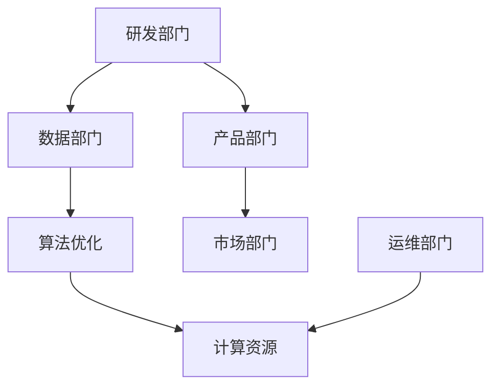
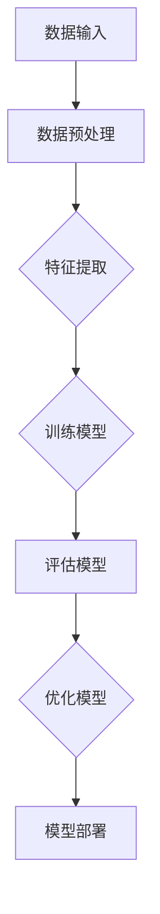

                 

## 大模型企业如何应对激烈竞争

> **关键词：** 大模型企业，竞争策略，市场定位，技术创新，可持续发展

**摘要：** 在当今数字化时代，大型人工智能模型企业面临着前所未有的竞争压力。本文将深入分析大模型企业在竞争激烈的市场环境中如何通过明确市场定位、持续技术创新和构建可持续发展模式来保持竞争优势。我们将结合实际案例，探讨核心概念与联系，详细阐述算法原理和数学模型，并提供项目实战案例和资源推荐，为读者提供全方位的指导。

## 1. 背景介绍

### 1.1 目的和范围

本文旨在探讨大模型企业如何在全球竞争激烈的环境中保持领先地位。本文将分析市场动态，探讨成功企业的战略和操作步骤，并通过数学模型和实际案例来阐述这些策略的有效性。本文将重点关注以下几个方面：

1. **市场定位**：探讨企业如何通过市场研究找到自己的细分市场，并制定相应的战略。
2. **技术创新**：分析企业如何通过持续创新保持技术领先地位。
3. **可持续发展**：讨论企业如何通过可持续的发展模式来降低成本和提高效率。
4. **竞争策略**：探讨企业如何制定有效的竞争策略来应对市场挑战。

### 1.2 预期读者

本文面向以下几类读者：

1. **大模型企业的决策者**：需要了解如何在激烈的市场竞争中保持领先地位。
2. **技术专家**：需要深入了解大模型企业的技术发展动态和算法原理。
3. **市场分析师**：希望了解大模型企业的市场定位和竞争策略。
4. **学术研究者**：对大模型企业的竞争战略和可持续发展模式感兴趣的学者。

### 1.3 文档结构概述

本文将分为以下几个部分：

1. **背景介绍**：介绍本文的目的、范围和预期读者。
2. **核心概念与联系**：阐述大模型企业涉及的核心理念和架构。
3. **核心算法原理 & 具体操作步骤**：详细讲解大模型算法的实现步骤。
4. **数学模型和公式**：介绍大模型中使用的数学模型和公式。
5. **项目实战**：提供大模型企业的代码实现案例。
6. **实际应用场景**：探讨大模型企业在实际中的应用。
7. **工具和资源推荐**：推荐学习资源和开发工具。
8. **总结**：总结未来发展趋势与挑战。
9. **附录**：常见问题与解答。
10. **扩展阅读**：推荐相关文献和研究。

### 1.4 术语表

#### 1.4.1 核心术语定义

- **大模型企业**：指专门从事大规模人工智能模型开发、部署和运营的企业。
- **市场定位**：企业在市场中选择目标客户群和市场细分的过程。
- **技术创新**：通过研发和改进技术来提高产品性能和竞争力。
- **可持续发展**：企业在满足当前需求的同时，不损害未来代际满足其需求的能力。

#### 1.4.2 相关概念解释

- **市场竞争**：企业之间为了争夺市场份额而进行的竞争。
- **技术壁垒**：指新进入者难以克服的技术难题。
- **客户需求**：消费者对产品或服务的期望和要求。

#### 1.4.3 缩略词列表

- **AI**：人工智能
- **ML**：机器学习
- **DL**：深度学习
- **GPU**：图形处理器
- **TPU**：张量处理器
- **IoT**：物联网

## 2. 核心概念与联系

### 2.1 大模型企业的核心概念

在探讨大模型企业的竞争策略之前，我们需要了解其核心概念。大模型企业主要涉及以下几个核心概念：

1. **人工智能模型**：这是企业的基础，包括机器学习和深度学习模型。
2. **数据处理**：涉及数据收集、清洗、预处理和分析。
3. **算法优化**：通过算法改进来提高模型性能。
4. **计算资源**：包括GPU、TPU等高性能计算设备。

### 2.2 大模型企业的架构

大模型企业的架构通常包括以下几个关键部分：

1. **研发部门**：负责算法研发和技术创新。
2. **数据部门**：负责数据收集和处理。
3. **产品部门**：负责产品的设计、开发和部署。
4. **市场部门**：负责市场研究和竞争分析。
5. **运维部门**：负责计算资源的配置和管理。

### 2.3 大模型企业的联系

大模型企业的各个部分相互联系，共同构成了一个整体。以下是这些部分的联系：

1. **研发与数据**：研发部门需要数据部门提供高质量的数据来训练和优化模型。
2. **产品与研发**：产品部门根据研发部门的技术成果来设计和开发产品。
3. **市场与产品**：市场部门通过市场研究来指导产品部门的产品开发。
4. **运维与计算资源**：运维部门确保计算资源的有效利用。

### 2.4 Mermaid 流程图

为了更好地展示大模型企业的架构和联系，我们可以使用Mermaid绘制一个流程图。



在这个流程图中，A、B、C、D、E和F分别代表研发部门、数据部门、算法优化、产品部门、市场部门和计算资源，G代表运维部门。线条表示它们之间的联系。

## 3. 核心算法原理 & 具体操作步骤

### 3.1 算法原理

大模型企业的核心算法主要基于深度学习和机器学习。以下是一个简单的算法原理框架：



在这个算法框架中，A表示数据输入，B表示数据预处理，C表示特征提取，D表示模型训练，E表示模型评估，F表示模型优化，G表示模型部署。

### 3.2 具体操作步骤

以下是具体操作步骤的伪代码：

```python
# 数据输入
input_data = read_data('data.csv')

# 数据预处理
preprocessed_data = preprocess_data(input_data)

# 特征提取
features = extract_features(preprocessed_data)

# 训练模型
model = train_model(features)

# 评估模型
evaluation_results = evaluate_model(model)

# 优化模型
optimized_model = optimize_model(model, evaluation_results)

# 模型部署
deploy_model(optimized_model)
```

在这个伪代码中，`read_data`函数负责读取数据，`preprocess_data`函数负责数据预处理，`extract_features`函数负责特征提取，`train_model`函数负责模型训练，`evaluate_model`函数负责模型评估，`optimize_model`函数负责模型优化，`deploy_model`函数负责模型部署。

### 3.3 算法原理的详细解释

- **数据输入**：首先，我们需要从数据源读取数据。这些数据可以是结构化的（如CSV文件）或非结构化的（如图像、文本等）。

- **数据预处理**：这一步骤包括数据清洗、缺失值处理、异常值检测和归一化等。目的是确保数据质量，使其适合进一步处理。

- **特征提取**：特征提取是将原始数据转换成适用于机器学习算法的格式。这通常涉及特征选择、降维和编码等操作。

- **模型训练**：在训练阶段，机器学习算法通过调整模型的参数来最小化预测误差。这通常涉及迭代过程，其中模型在训练数据集上不断优化。

- **模型评估**：模型评估是测试模型在未知数据上的表现。常用的评估指标包括准确率、召回率、F1分数等。

- **模型优化**：根据评估结果，对模型进行调整和优化。这可能涉及调整超参数、添加正则化项或使用更复杂的模型架构。

- **模型部署**：最后，将优化后的模型部署到生产环境，使其能够实时处理新的数据并生成预测结果。

### 3.4 算法原理的示例

假设我们有一个分类问题，目标是预测客户是否会购买某种产品。以下是具体示例：

1. **数据输入**：我们读取一个包含客户购买历史数据的CSV文件。
2. **数据预处理**：我们清洗数据，处理缺失值，并对数据进行归一化处理。
3. **特征提取**：我们选择客户的年龄、收入、购买历史等作为特征，并对这些特征进行编码处理。
4. **模型训练**：我们使用逻辑回归模型来训练数据，并调整超参数以最小化预测误差。
5. **模型评估**：我们使用测试数据集来评估模型的性能，并根据评估结果调整模型。
6. **模型优化**：我们发现模型的准确率较低，于是尝试使用随机森林模型来替代逻辑回归模型，并重新训练模型。
7. **模型部署**：我们将优化后的随机森林模型部署到生产环境，并实时处理新的客户数据。

通过这个示例，我们可以看到算法原理在实际应用中的具体操作步骤。

## 4. 数学模型和公式 & 详细讲解 & 举例说明

### 4.1 数学模型概述

在大模型企业的算法中，通常会涉及到以下数学模型和公式：

1. **损失函数**：用于评估模型预测结果与真实值之间的差异。
2. **优化算法**：用于调整模型参数以最小化损失函数。
3. **正则化**：用于防止模型过拟合。

### 4.2 损失函数

常见的损失函数包括：

- **均方误差（MSE）**：用于回归问题，计算预测值与真实值之间差的平方的平均值。
  $$MSE = \frac{1}{n}\sum_{i=1}^{n}(y_i - \hat{y}_i)^2$$
  其中，\(y_i\) 是真实值，\(\hat{y}_i\) 是预测值。

- **交叉熵损失（Cross-Entropy Loss）**：用于分类问题，计算真实标签与预测概率之间的差异。
  $$Cross-Entropy Loss = -\sum_{i=1}^{n}y_i\log(\hat{y}_i)$$
  其中，\(y_i\) 是真实标签，\(\hat{y}_i\) 是预测概率。

### 4.3 优化算法

常见的优化算法包括：

- **梯度下降（Gradient Descent）**：通过计算损失函数关于模型参数的梯度，来更新模型参数。
  $$\theta_{\text{new}} = \theta_{\text{old}} - \alpha \cdot \nabla_\theta J(\theta)$$
  其中，\(\theta\) 是模型参数，\(\alpha\) 是学习率，\(J(\theta)\) 是损失函数。

- **随机梯度下降（Stochastic Gradient Descent，SGD）**：在梯度下降的基础上，每次更新模型参数时只使用一个样本来计算梯度。
  $$\theta_{\text{new}} = \theta_{\text{old}} - \alpha \cdot \nabla_{\theta} J(\theta; x_i, y_i)$$

- **批量梯度下降（Batch Gradient Descent）**：在梯度下降的基础上，每次更新模型参数时使用全部样本来计算梯度。

### 4.4 正则化

常见的正则化方法包括：

- **L1正则化（L1 Regularization）**：在损失函数中添加 \(||\theta||_1\) 的项。
  $$J(\theta) = \frac{1}{m}\sum_{i=1}^{m}(y_i - \hat{y}_i)^2 + \lambda ||\theta||_1$$

- **L2正则化（L2 Regularization）**：在损失函数中添加 \(||\theta||_2^2\) 的项。
  $$J(\theta) = \frac{1}{m}\sum_{i=1}^{m}(y_i - \hat{y}_i)^2 + \lambda ||\theta||_2^2$$

- **Dropout**：在训练过程中随机丢弃一部分神经元，以防止模型过拟合。

### 4.5 举例说明

假设我们有一个二分类问题，目标是预测客户是否会购买某种产品。以下是具体的数学模型和公式应用：

1. **损失函数**：我们选择交叉熵损失函数，因为这是一个二分类问题。
   $$Cross-Entropy Loss = -\sum_{i=1}^{n}y_i\log(\hat{y}_i) + (1 - y_i)\log(1 - \hat{y}_i)$$

2. **优化算法**：我们选择随机梯度下降算法来优化模型参数。
   $$\theta_{\text{new}} = \theta_{\text{old}} - \alpha \cdot \nabla_{\theta} J(\theta; x_i, y_i)$$

3. **正则化**：我们选择L2正则化来防止模型过拟合。
   $$J(\theta) = \frac{1}{m}\sum_{i=1}^{m}(y_i - \hat{y}_i)^2 + \lambda ||\theta||_2^2$$

通过这个例子，我们可以看到数学模型和公式在大模型企业算法中的应用。这些模型和公式帮助我们在实际应用中优化模型性能和防止过拟合。

## 5. 项目实战：代码实际案例和详细解释说明

### 5.1 开发环境搭建

在进行大模型项目的开发之前，我们需要搭建一个合适的开发环境。以下是一个基本的开发环境搭建步骤：

1. **安装Python**：Python是大多数机器学习项目的首选语言。您可以从Python官方网站下载并安装Python。
2. **安装Jupyter Notebook**：Jupyter Notebook是一个交互式开发环境，非常适合进行机器学习和数据分析。您可以使用pip命令来安装Jupyter Notebook：
   ```shell
   pip install notebook
   ```
3. **安装必要的库**：安装用于数据预处理、模型训练和评估的库，如NumPy、Pandas、Scikit-learn、TensorFlow等。您可以使用以下命令来安装：
   ```shell
   pip install numpy pandas scikit-learn tensorflow
   ```
4. **配置GPU支持**：如果您的项目需要使用GPU进行加速计算，您需要安装CUDA和cuDNN。这些库可以加速TensorFlow和PyTorch等深度学习框架的计算。

### 5.2 源代码详细实现和代码解读

以下是一个简单的深度学习项目，用于分类问题。我们将使用TensorFlow框架来实现。

```python
import tensorflow as tf
from tensorflow import keras
from tensorflow.keras import layers
import numpy as np
import pandas as pd

# 5.2.1 数据预处理
# 读取数据
data = pd.read_csv('data.csv')

# 分割特征和标签
X = data.drop('target', axis=1)
y = data['target']

# 划分训练集和测试集
X_train, X_test, y_train, y_test = train_test_split(X, y, test_size=0.2, random_state=42)

# 标准化特征
mean = X_train.mean()
std = X_train.std()
X_train = (X_train - mean) / std
X_test = (X_test - mean) / std

# 5.2.2 模型构建
model = keras.Sequential([
    layers.Dense(64, activation='relu', input_shape=(X_train.shape[1],)),
    layers.Dense(64, activation='relu'),
    layers.Dense(1, activation='sigmoid')
])

# 5.2.3 模型编译
model.compile(optimizer='adam',
              loss='binary_crossentropy',
              metrics=['accuracy'])

# 5.2.4 模型训练
history = model.fit(X_train, y_train, epochs=10, batch_size=32, validation_data=(X_test, y_test))

# 5.2.5 模型评估
test_loss, test_acc = model.evaluate(X_test, y_test)
print(f"Test accuracy: {test_acc:.3f}")

# 5.2.6 预测
predictions = model.predict(X_test)
predicted_labels = (predictions > 0.5)

# 5.2.7 代码解读
# 在这段代码中，我们首先读取数据，并进行预处理。然后，我们构建一个简单的全连接神经网络模型，并使用adam优化器和二进制交叉熵损失函数进行编译。接下来，我们训练模型，并在测试集上评估其性能。最后，我们使用训练好的模型进行预测。

```

### 5.3 代码解读与分析

1. **数据预处理**：数据预处理是机器学习项目的重要步骤。我们首先读取数据，然后分离特征和标签。接着，我们使用训练集来划分训练集和测试集。最后，我们对特征进行标准化处理，这有助于提高模型性能。

2. **模型构建**：在这段代码中，我们使用Keras构建了一个简单的全连接神经网络模型。这个模型包含两个隐藏层，每层有64个神经元。激活函数使用ReLU，输出层使用Sigmoid函数以进行二分类。

3. **模型编译**：我们使用adam优化器和二进制交叉熵损失函数来编译模型。adam优化器是一种高效的梯度下降算法，而二进制交叉熵损失函数适用于二分类问题。

4. **模型训练**：我们使用训练集来训练模型，并设置10个训练周期和32个批量大小。我们还使用了验证集来监控训练过程中的性能。

5. **模型评估**：我们在测试集上评估模型的性能，并打印测试准确率。

6. **预测**：最后，我们使用训练好的模型对测试集进行预测，并得到预测标签。

通过这个代码实例，我们可以看到如何使用TensorFlow框架构建和训练一个简单的深度学习模型。这个实例展示了从数据预处理到模型训练和评估的完整流程。

### 5.4 代码实际应用场景

这个代码实例可以应用于多种实际场景，例如：

- **客户流失预测**：使用客户历史数据来预测哪些客户可能会流失，从而采取预防措施。
- **信用评分**：使用财务数据来评估个人的信用评分，帮助金融机构做出信贷决策。
- **疾病诊断**：使用医学数据来预测患者是否患有某种疾病，辅助医生进行诊断。

在实际应用中，根据问题的不同，我们需要调整模型架构、超参数和数据处理步骤。这个实例为我们提供了一个基本的框架，我们可以在此基础上进行改进和优化。

## 6. 实际应用场景

大模型企业在实际应用中有着广泛的应用场景，以下是一些典型的应用案例：

### 6.1 金融行业

在金融行业中，大模型企业通过开发智能投顾、风险管理和反欺诈系统来提高金融服务的效率。例如，通过深度学习模型分析客户交易行为，预测市场趋势，为投资者提供个性化的投资建议。此外，大模型企业还利用图神经网络来分析社交网络和交易网络，识别潜在的欺诈行为。

### 6.2 医疗健康

在医疗健康领域，大模型企业通过开发医学影像分析、疾病预测和个性化治疗方案来改善医疗服务。例如，使用深度学习模型自动识别医学影像中的病变区域，提高疾病诊断的准确率。此外，大模型企业还可以利用电子健康记录来预测患者未来的健康风险，为医生提供决策支持。

### 6.3 电子商务

在电子商务领域，大模型企业通过开发推荐系统和个性化营销策略来提高用户体验和销售额。例如，使用协同过滤和深度学习模型来推荐商品，根据用户的浏览和购买历史进行个性化推荐。此外，大模型企业还可以分析用户行为数据，优化广告投放策略，提高广告效果。

### 6.4 自动驾驶

在自动驾驶领域，大模型企业通过开发感知、规划和控制算法来推动自动驾驶技术的发展。例如，使用深度学习模型进行道路场景理解，识别交通标志、行人、车辆等目标。此外，大模型企业还可以利用强化学习算法来优化自动驾驶车的决策策略，提高行驶安全性和效率。

### 6.5 教育科技

在教育科技领域，大模型企业通过开发智能教学系统和学习分析工具来提高教育质量。例如，使用自然语言处理技术进行智能问答系统，为学生提供实时解答。此外，大模型企业还可以利用数据分析技术，对学生学习行为进行分析，为教师提供个性化的教学建议。

这些应用案例展示了大模型企业在不同行业中的广泛潜力。随着技术的不断进步和数据的日益丰富，大模型企业的应用场景将更加多样化和深入。

### 7. 工具和资源推荐

为了帮助读者深入了解大模型企业的技术和发展，我们推荐以下工具和资源：

#### 7.1 学习资源推荐

**书籍推荐**：
- **《深度学习》（Goodfellow, Bengio, Courville）**：这是一本经典的深度学习教材，涵盖了深度学习的理论基础和实战技巧。
- **《Python机器学习》（Sebastian Raschka）**：这本书详细介绍了如何使用Python进行机器学习和深度学习项目。

**在线课程**：
- **Coursera上的《深度学习》课程**：由吴恩达教授主讲，提供了丰富的理论和实践内容。
- **Udacity的《深度学习工程师纳米学位》**：包含多个实战项目，帮助学习者掌握深度学习技能。

**技术博客和网站**：
- **Medium上的Machine Learning Blog**：汇集了大量的深度学习和机器学习文章。
- **Towards Data Science**：一个热门的数据科学社区，提供了丰富的技术文章和项目案例。

#### 7.2 开发工具框架推荐

**IDE和编辑器**：
- **Jupyter Notebook**：适用于数据科学和机器学习项目的交互式开发环境。
- **Visual Studio Code**：一个功能强大的开源编辑器，适用于各种编程语言。

**调试和性能分析工具**：
- **TensorBoard**：TensorFlow的官方可视化工具，用于监控模型训练过程和性能分析。
- **PyTorch Profiler**：用于分析PyTorch模型性能的工具。

**相关框架和库**：
- **TensorFlow**：Google开发的开源深度学习框架。
- **PyTorch**：由Facebook开发的开源深度学习框架，具有灵活的动态计算图功能。

#### 7.3 相关论文著作推荐

**经典论文**：
- **“A Theoretical Framework for Back-Propagating Error”**：该论文提出了反向传播算法，是深度学习的基础。
- **“Deep Learning”**：这是一本全面介绍深度学习理论和实践的书籍，由Ian Goodfellow等人撰写。

**最新研究成果**：
- **“Transformers: State-of-the-Art Natural Language Processing”**：这篇论文介绍了Transformer模型，推动了自然语言处理的最新进展。
- **“GPT-3: Language Models are Few-Shot Learners”**：这篇论文展示了GPT-3模型在零样本学习中的强大能力。

**应用案例分析**：
- **“Deep Learning for Healthcare”**：这篇综述文章介绍了深度学习在医疗健康领域的应用案例。
- **“AI in Autonomous Driving”**：这篇论文探讨了深度学习在自动驾驶技术中的应用，分析了当前面临的挑战和解决方案。

通过这些工具和资源，读者可以进一步深入了解大模型企业的技术和发展，掌握相关技能，并在实际项目中应用这些知识。

## 8. 总结：未来发展趋势与挑战

### 8.1 未来发展趋势

1. **技术融合**：大模型企业将继续融合多种技术，如自然语言处理、计算机视觉、强化学习等，实现更复杂的任务。
2. **跨领域应用**：随着技术的进步和数据的积累，大模型企业将在更多领域（如金融、医疗、教育等）发挥作用。
3. **边缘计算**：随着物联网和5G技术的发展，边缘计算将成为大模型企业的重要方向，以降低延迟和改善用户体验。
4. **可解释性**：为了增强模型的透明度和可信度，大模型企业将致力于提高模型的可解释性，使决策过程更加透明。

### 8.2 挑战

1. **数据隐私**：随着数据量的增加，保护用户隐私将成为一个重大挑战。大模型企业需要制定严格的数据保护政策。
2. **算法公平性**：模型决策的公平性是一个重要问题。大模型企业需要确保算法不歧视任何特定群体。
3. **计算资源**：大模型训练和部署需要大量的计算资源，这可能导致资源短缺和成本增加。企业需要寻找高效的计算解决方案。
4. **模型安全**：大模型企业需要确保模型的安全，防止恶意攻击和滥用。

### 8.3 应对策略

1. **数据安全与隐私保护**：大模型企业应采用加密技术、差分隐私等手段来保护用户数据。
2. **算法公平性**：通过交叉验证、平衡数据集等方法来提高模型的公平性。
3. **计算优化**：采用分布式计算、硬件加速等技术来提高计算效率。
4. **安全防护**：实施严格的访问控制和监控机制，确保模型的安全性。

大模型企业在未来将继续面临各种挑战，但通过技术创新和策略调整，它们有望克服这些挑战，实现可持续发展。

## 9. 附录：常见问题与解答

### 9.1 问题1：大模型企业的主要技术挑战是什么？

**解答**：大模型企业的主要技术挑战包括数据隐私保护、算法公平性、计算资源短缺和模型安全。数据隐私保护要求企业在处理用户数据时采取严格的安全措施。算法公平性是确保模型不歧视任何特定群体的问题。计算资源短缺是一个普遍问题，企业需要寻找高效的计算解决方案。模型安全是防止模型被恶意攻击和滥用的问题。

### 9.2 问题2：大模型企业的模型训练过程是怎样的？

**解答**：大模型企业的模型训练过程通常包括以下几个步骤：

1. 数据收集与预处理：收集相关数据，并进行清洗、归一化和特征提取等预处理操作。
2. 模型设计：根据任务需求设计神经网络架构，选择适当的模型类型和参数。
3. 模型训练：使用训练数据对模型进行训练，通过反向传播算法不断调整模型参数，以最小化损失函数。
4. 模型评估：使用验证数据评估模型性能，调整模型参数以优化性能。
5. 模型部署：将训练好的模型部署到生产环境，进行实际应用。

### 9.3 问题3：大模型企业在金融行业的应用有哪些？

**解答**：大模型企业在金融行业的应用包括：

1. **智能投顾**：通过分析用户财务数据和市场趋势，提供个性化的投资建议。
2. **风险管理**：使用模型预测市场风险，帮助金融机构做出更明智的风险管理决策。
3. **信用评分**：利用用户的财务和行为数据，评估个人的信用评分。
4. **反欺诈系统**：通过分析交易行为，识别和预防潜在的欺诈活动。
5. **市场预测**：使用深度学习模型预测市场趋势，辅助投资决策。

### 9.4 问题4：大模型企业的可持续发展策略有哪些？

**解答**：大模型企业的可持续发展策略包括：

1. **技术创新**：持续研发新技术，提高模型性能和效率。
2. **数据管理**：确保数据的质量和安全，采用隐私保护技术。
3. **计算优化**：采用分布式计算、硬件加速等技术，提高计算效率。
4. **合作伙伴关系**：与其他企业合作，共享技术和资源。
5. **社会责任**：关注社会责任，确保技术发展符合伦理和法律要求。

## 10. 扩展阅读 & 参考资料

为了深入探索大模型企业的技术和发展，以下是推荐的一些扩展阅读和参考资料：

### 10.1 书籍推荐

- **《深度学习》（Ian Goodfellow, Yoshua Bengio, Aaron Courville）**：这是深度学习领域的经典教材，详细介绍了深度学习的理论基础和实践技巧。
- **《Python机器学习》（Sebastian Raschka）**：这本书通过大量示例，讲解了如何使用Python进行机器学习和深度学习项目。
- **《大规模机器学习》（Gareth James, Daniel C. Cook, Russell A. Patella）**：这本书涵盖了大规模机器学习的方法和工具，适合对大规模数据处理感兴趣的读者。

### 10.2 在线课程

- **Coursera上的《深度学习》课程**：由吴恩达教授主讲，提供了丰富的理论和实践内容。
- **Udacity的《深度学习工程师纳米学位》**：包含多个实战项目，帮助学习者掌握深度学习技能。
- **edX上的《机器学习基础》课程**：由美国麻省理工学院（MIT）教授主讲，介绍了机器学习的基础知识。

### 10.3 技术博客和网站

- **Medium上的Machine Learning Blog**：汇集了大量的深度学习和机器学习文章。
- **Towards Data Science**：一个热门的数据科学社区，提供了丰富的技术文章和项目案例。
- **Reddit上的r/MachineLearning**：一个讨论机器学习和深度学习的Reddit论坛。

### 10.4 开发工具框架推荐

- **TensorFlow**：Google开发的开源深度学习框架，适用于各种类型的深度学习项目。
- **PyTorch**：Facebook开发的开源深度学习框架，具有灵活的动态计算图功能。
- **Keras**：一个基于TensorFlow和Theano的高层神经网络API，简化了深度学习模型的构建和训练。

### 10.5 相关论文著作推荐

- **“A Theoretical Framework for Back-Propagating Error”**：该论文提出了反向传播算法，是深度学习的基础。
- **“Deep Learning”**：这是一本全面介绍深度学习理论和实践的书籍，由Ian Goodfellow等人撰写。
- **“Transformers: State-of-the-Art Natural Language Processing”**：这篇论文介绍了Transformer模型，推动了自然语言处理的最新进展。

通过这些扩展阅读和参考资料，读者可以进一步深入了解大模型企业的技术和发展，掌握相关技能，并在实际项目中应用这些知识。

