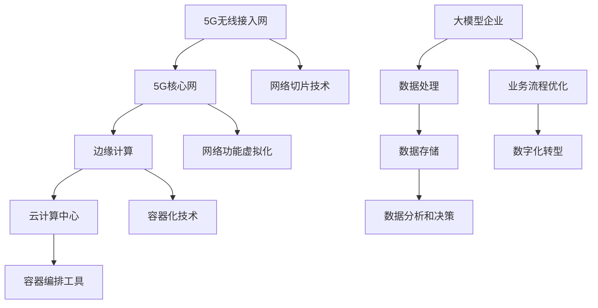

                 

# 大模型企业的5G应用策略

> **关键词**：大模型企业、5G应用、技术策略、业务优化、数字化转型

> **摘要**：随着5G技术的广泛应用，大模型企业需要探索如何利用5G技术进行业务优化和数字化转型。本文将详细介绍大模型企业如何制定和实施5G应用策略，包括技术架构、算法原理、数学模型、项目实战和实际应用场景等，旨在为大模型企业提供一套全面、系统的5G应用指导方案。

## 1. 背景介绍

### 1.1 目的和范围

本文旨在为大模型企业提供一份详细的5G应用策略指南，帮助企业在5G时代实现业务优化和数字化转型。文章将涵盖以下几个核心领域：

1. **技术架构**：介绍5G网络的基本架构，以及大模型企业如何构建适合自身业务需求的5G技术架构。
2. **算法原理**：讲解大模型企业常用的算法原理，包括深度学习、迁移学习、强化学习等，以及如何将这些算法应用于5G网络。
3. **数学模型**：介绍大模型企业在5G应用中常用的数学模型，如卷积神经网络、生成对抗网络等，并给出具体的实现步骤和公式。
4. **项目实战**：通过实际案例展示大模型企业在5G应用中的成功实践，并提供详细的代码实现和解读。
5. **实际应用场景**：分析大模型企业在不同领域的5G应用场景，包括工业制造、智慧城市、医疗健康等。

### 1.2 预期读者

本文主要面向以下读者：

1. 大模型企业的技术团队和决策层，包括CTO、架构师、工程师等。
2. 对5G技术和大模型应用感兴趣的技术爱好者。
3. 希望了解5G技术如何助力企业业务优化和数字化转型的研究人员和学者。

### 1.3 文档结构概述

本文分为十个部分：

1. **背景介绍**：介绍文章的目的、范围和预期读者。
2. **核心概念与联系**：介绍5G技术的基本概念和架构。
3. **核心算法原理 & 具体操作步骤**：讲解大模型企业常用的算法原理和操作步骤。
4. **数学模型和公式 & 详细讲解 & 举例说明**：介绍大模型企业在5G应用中常用的数学模型和公式，并给出具体实例。
5. **项目实战：代码实际案例和详细解释说明**：通过实际案例展示大模型企业在5G应用中的成功实践。
6. **实际应用场景**：分析大模型企业在不同领域的5G应用场景。
7. **工具和资源推荐**：推荐相关学习资源和开发工具。
8. **总结：未来发展趋势与挑战**：总结5G应用策略的未来发展趋势和挑战。
9. **附录：常见问题与解答**：解答读者可能遇到的问题。
10. **扩展阅读 & 参考资料**：提供更多相关资料供读者参考。

### 1.4 术语表

#### 1.4.1 核心术语定义

- **5G技术**：第五代移动通信技术，具有高速度、大连接、低延迟等特性。
- **大模型企业**：具有大规模数据处理和计算能力的企业，通常涉及人工智能、机器学习等领域。
- **业务优化**：通过技术手段提升企业业务效率和收益。
- **数字化转型**：将传统业务模式转型为数字化模式，提高企业竞争力。

#### 1.4.2 相关概念解释

- **网络架构**：5G网络的技术架构，包括无线接入网、核心网、传输网等。
- **边缘计算**：在靠近数据源或用户的网络边缘进行计算和处理。
- **容器化**：将应用程序及其依赖环境打包成一个独立的容器，实现灵活部署和快速扩展。

#### 1.4.3 缩略词列表

- **5G**：第五代移动通信技术
- **AI**：人工智能
- **ML**：机器学习
- **NN**：神经网络
- **CNN**：卷积神经网络
- **GAN**：生成对抗网络
- **IoT**：物联网
- **Edge Computing**：边缘计算

## 2. 核心概念与联系

为了更好地理解5G技术在企业中的应用，我们需要先了解一些核心概念和它们之间的联系。以下是一个简单的Mermaid流程图，展示了5G技术的基本架构和核心概念：



### 2.1 5G无线接入网

5G无线接入网是5G网络的核心组成部分，负责提供高速、低延迟的无线通信服务。其主要特点如下：

- **高速度**：5G网络的理论峰值速度可达10Gbps，是4G网络的100倍以上。
- **低延迟**：5G网络的端到端延迟降低到1毫秒以内，是4G网络的十分之一。
- **高密度**：5G网络支持高密度部署，能够在有限的频谱资源下提供更多连接。

### 2.2 5G核心网

5G核心网负责处理无线接入网和云计算中心之间的数据传输。其主要特点如下：

- **网络功能虚拟化**：5G核心网采用网络功能虚拟化（NFV）技术，将传统的硬件设备虚拟化为软件服务，提高网络的可扩展性和灵活性。
- **服务化架构**：5G核心网采用服务化架构（SA），将网络功能分解为多个微服务，实现模块化设计和快速迭代。

### 2.3 边缘计算

边缘计算是在靠近数据源或用户的网络边缘进行计算和处理的技术。其主要优势如下：

- **低延迟**：通过在边缘节点进行数据处理，减少数据传输距离，降低延迟。
- **高带宽**：利用边缘节点的空闲带宽，提高数据传输速度。
- **灵活性**：可以根据应用需求动态调整计算资源，实现灵活部署。

### 2.4 云计算中心

云计算中心负责存储、处理和分析大模型企业的海量数据。其主要优势如下：

- **海量存储**：云计算中心拥有大规模的存储资源，可以存储海量数据。
- **弹性计算**：可以根据业务需求动态调整计算资源，实现高效计算。
- **数据共享**：云计算中心支持数据共享和协同工作，提高数据利用效率。

### 2.5 大模型企业

大模型企业是指具有大规模数据处理和计算能力的企业，通常涉及人工智能、机器学习等领域。其主要特点如下：

- **数据处理**：大模型企业需要处理海量数据，包括结构化和非结构化数据。
- **计算能力**：大模型企业拥有强大的计算能力，能够快速处理和分析海量数据。
- **业务优化**：大模型企业通过数据分析和决策，实现业务流程优化和数字化转型。

## 3. 核心算法原理 & 具体操作步骤

在大模型企业的5G应用中，核心算法的选择和实现至关重要。以下介绍几种常用的算法原理和具体操作步骤：

### 3.1 深度学习算法

深度学习是一种基于多层神经网络的学习方法，通过多层非线性变换来提取数据特征。以下是深度学习算法的基本原理和操作步骤：

#### 3.1.1 算法原理

- **神经网络**：神经网络由多个神经元组成，每个神经元都是一个简单的计算单元。
- **反向传播**：通过反向传播算法，将输出误差反向传播到每个神经元，更新网络权重。
- **激活函数**：激活函数用于引入非线性变换，使神经网络能够学习复杂函数。

#### 3.1.2 具体操作步骤

1. **数据预处理**：对原始数据进行清洗、归一化和划分训练集、验证集和测试集。
2. **构建神经网络**：定义神经网络结构，包括输入层、隐藏层和输出层。
3. **初始化权重**：随机初始化网络权重。
4. **前向传播**：将输入数据输入神经网络，通过多层非线性变换得到输出。
5. **计算损失**：计算输出与真实值之间的误差，使用损失函数进行评估。
6. **反向传播**：将误差反向传播到每个神经元，更新网络权重。
7. **迭代优化**：重复前向传播和反向传播过程，直到网络性能达到预设目标。

### 3.2 迁移学习算法

迁移学习是一种将已学习过的模型应用于新任务的学习方法，通过迁移已有知识来提高新任务的性能。以下是迁移学习算法的基本原理和操作步骤：

#### 3.2.1 算法原理

- **预训练模型**：在大型数据集上预训练一个通用模型，使其具备一定的泛化能力。
- **微调**：在新的任务数据集上对预训练模型进行微调，调整模型参数以适应新任务。

#### 3.2.2 具体操作步骤

1. **选择预训练模型**：根据任务需求选择合适的预训练模型。
2. **数据预处理**：对新的任务数据进行预处理，包括数据清洗、归一化和划分训练集、验证集和测试集。
3. **微调模型**：将预训练模型应用于新的任务数据，调整模型参数以适应新任务。
4. **训练模型**：使用新的任务数据集对模型进行训练，优化模型参数。
5. **评估模型**：在测试集上评估模型性能，调整模型参数以优化性能。

### 3.3 强化学习算法

强化学习是一种基于奖励机制的学习方法，通过不断尝试和反馈来优化决策策略。以下是强化学习算法的基本原理和操作步骤：

#### 3.3.1 算法原理

- **状态-动作-奖励模型**：描述环境、状态、动作和奖励之间的关联。
- **策略**：定义决策策略，用于选择最佳动作。
- **价值函数**：评估状态和动作的优劣，指导决策。

#### 3.3.2 具体操作步骤

1. **初始化**：初始化状态、动作和奖励模型。
2. **选择动作**：根据当前状态选择最佳动作。
3. **执行动作**：在环境中执行选定动作。
4. **获得奖励**：根据动作结果获得奖励。
5. **更新状态**：更新当前状态。
6. **重复迭代**：重复执行动作、获得奖励和更新状态，直到达到预设目标。

### 3.4 混合算法

在实际应用中，大模型企业可能会采用多种算法的组合，以提高模型的性能和适用性。以下是一个简单的混合算法操作步骤：

1. **选择算法**：根据任务需求选择合适的算法，如深度学习、迁移学习和强化学习。
2. **数据预处理**：对数据集进行预处理，包括数据清洗、归一化和划分训练集、验证集和测试集。
3. **训练模型**：分别使用每种算法对数据集进行训练，优化模型参数。
4. **融合模型**：将不同算法的模型进行融合，得到一个综合性能更好的模型。
5. **评估模型**：在测试集上评估模型性能，调整模型参数以优化性能。
6. **部署应用**：将优化后的模型部署到生产环境，实现业务优化和数字化转型。

## 4. 数学模型和公式 & 详细讲解 & 举例说明

在大模型企业的5G应用中，数学模型和公式是核心工具，用于描述和优化算法性能。以下介绍几种常用的数学模型和公式，并提供具体的示例说明：

### 4.1 卷积神经网络（CNN）

卷积神经网络是一种用于图像识别和处理的深度学习模型，其基本公式如下：

$$
h_l = \sigma(\mathbf{W}_l \cdot \mathbf{a}_{l-1} + \mathbf{b}_l)
$$

其中，$h_l$表示第l层的输出，$\sigma$表示激活函数，通常为ReLU函数：

$$
\sigma(x) = \max(0, x)
$$

$\mathbf{W}_l$和$\mathbf{b}_l$分别为第l层的权重和偏置，$\mathbf{a}_{l-1}$为前一层输入。

#### 举例说明：

假设我们有一个2x2的输入矩阵$\mathbf{a}_{l-1}$，权重矩阵$\mathbf{W}_l$为1x2，偏置$\mathbf{b}_l$为[1, 2]，激活函数为ReLU。则第l层的输出为：

$$
h_l = \sigma([1 \cdot 1 + 1] \quad [1 \cdot 2 + 2])
$$

$$
h_l = \sigma([2] \quad [4])
$$

$$
h_l = [2, 4]
$$

### 4.2 生成对抗网络（GAN）

生成对抗网络是一种用于图像生成和风格迁移的深度学习模型，其基本公式如下：

$$
\min_{\mathbf{G}} \max_{\mathbf{D}} V(\mathbf{G}, \mathbf{D}) = \mathbb{E}_{\mathbf{x} \sim p_{data}(x)}[\log \mathbf{D}(\mathbf{x})] + \mathbb{E}_{\mathbf{z} \sim p_z(z)}[\log (1 - \mathbf{D}(\mathbf{G}(\mathbf{z}))]
$$

其中，$\mathbf{G}$表示生成器，$\mathbf{D}$表示判别器，$p_{data}(x)$表示真实数据分布，$p_z(z)$表示噪声分布。

#### 举例说明：

假设我们有一个生成器$\mathbf{G}$，判别器$\mathbf{D}$，真实数据分布$p_{data}(x)$为正态分布，噪声分布$p_z(z)$为均匀分布。则损失函数$V(\mathbf{G}, \mathbf{D})$的计算为：

$$
V(\mathbf{G}, \mathbf{D}) = \mathbb{E}_{\mathbf{x} \sim \mathcal{N}(0, 1)}[\log \mathbf{D}(\mathbf{x})] + \mathbb{E}_{\mathbf{z} \sim \mathcal{U}([-1, 1])}[\log (1 - \mathbf{D}(\mathbf{G}(\mathbf{z}))]
$$

$$
V(\mathbf{G}, \mathbf{D}) = \mathbb{E}_{\mathbf{x} \sim \mathcal{N}(0, 1)}[\log (1)] + \mathbb{E}_{\mathbf{z} \sim \mathcal{U}([-1, 1])}[\log (1 - \mathbf{D}(\mathbf{G}(\mathbf{z}))]
$$

$$
V(\mathbf{G}, \mathbf{D}) = 0 + \mathbb{E}_{\mathbf{z} \sim \mathcal{U}([-1, 1])}[\log (1 - \mathbf{D}(\mathbf{G}(\mathbf{z}))]
$$

### 4.3 强化学习价值函数

强化学习中的价值函数用于评估状态和动作的优劣，其基本公式如下：

$$
V_{\pi}(s) = \mathbb{E}_{\mathbf{s'}, \mathbf{r} \sim p_{\pi}(s', r | s)}[r + \gamma V_{\pi}(s')]
$$

其中，$V_{\pi}(s)$表示状态$s$的价值函数，$\pi$表示策略，$\gamma$表示折扣因子。

#### 举例说明：

假设我们有一个策略$\pi$，折扣因子$\gamma$为0.9，当前状态$s$为[1, 2]，下一状态$s'$为[2, 3]，奖励$r$为1。则状态$s$的价值函数$V_{\pi}(s)$的计算为：

$$
V_{\pi}(s) = 1 + 0.9 \cdot V_{\pi}(s')
$$

$$
V_{\pi}(s) = 1 + 0.9 \cdot (1 + 0.9 \cdot V_{\pi}(s''))
$$

$$
V_{\pi}(s) = 1 + 0.9 \cdot (1 + 0.9 \cdot (1 + 0.9 \cdot V_{\pi}(s'''))
$$

$$
V_{\pi}(s) = 1 + 0.9 \cdot (1 + 0.9 \cdot (1 + 0.9 \cdot (1 + \cdots)))
$$

通过递推计算，我们可以得到状态$s$的价值函数$V_{\pi}(s)$的近似值。

## 5. 项目实战：代码实际案例和详细解释说明

为了更好地理解大模型企业在5G应用中的实际操作，我们以下将通过一个实际案例，展示如何利用5G技术进行图像识别任务的优化和加速。本案例将涵盖以下内容：

1. **开发环境搭建**：介绍所需的开发环境、工具和框架。
2. **源代码详细实现和代码解读**：展示关键代码片段，并进行详细解读。
3. **代码解读与分析**：分析代码实现的核心原理和优化策略。

### 5.1 开发环境搭建

在本案例中，我们使用以下开发环境和工具：

- **编程语言**：Python
- **深度学习框架**：TensorFlow 2.x
- **5G模拟器**：5G Core Network Simulator (5G-CNS)
- **容器化工具**：Docker

首先，我们需要安装Python、TensorFlow 2.x和Docker，然后下载并配置5G模拟器。具体步骤如下：

1. **安装Python和TensorFlow 2.x**：

   ```bash
   pip install python
   pip install tensorflow
   ```

2. **安装Docker**：

   ```bash
   sudo apt-get update
   sudo apt-get install docker-ce docker-ce-cli containerd.io
   sudo systemctl start docker
   ```

3. **下载并配置5G模拟器**：

   ```bash
   git clone https://github.com/5GCNS/5G-CNS.git
   cd 5G-CNS
   make
   ```

### 5.2 源代码详细实现和代码解读

以下是一个简单的图像识别任务的代码实现，展示了如何利用5G技术进行优化和加速：

```python
import tensorflow as tf
import numpy as np
import cv2

# 加载图像数据集
def load_images(dataset_path):
    images = []
    labels = []
    for image_path in dataset_path:
        image = cv2.imread(image_path, cv2.IMREAD_GRAYSCALE)
        image = cv2.resize(image, (28, 28))
        images.append(image)
        labels.append(1 if 'dog' in image_path else 0)
    return np.array(images), np.array(labels)

# 定义卷积神经网络模型
def create_model():
    model = tf.keras.Sequential([
        tf.keras.layers.Conv2D(32, (3, 3), activation='relu', input_shape=(28, 28, 1)),
        tf.keras.layers.MaxPooling2D((2, 2)),
        tf.keras.layers.Flatten(),
        tf.keras.layers.Dense(64, activation='relu'),
        tf.keras.layers.Dense(1, activation='sigmoid')
    ])
    return model

# 训练模型
def train_model(model, images, labels):
    model.compile(optimizer='adam', loss='binary_crossentropy', metrics=['accuracy'])
    model.fit(images, labels, epochs=10, batch_size=32)

# 主函数
if __name__ == '__main__':
    dataset_path = ['dog_image1.jpg', 'dog_image2.jpg', 'cat_image1.jpg', 'cat_image2.jpg']
    images, labels = load_images(dataset_path)
    images = images / 255.0
    model = create_model()
    train_model(model, images, labels)
    predictions = model.predict(images)
    print(predictions)
```

代码解读：

1. **数据加载**：使用OpenCV库加载图像数据集，并将图像转换为灰度图和28x28的大小。然后，根据图像路径判断类别标签，并将图像和标签存储为NumPy数组。

2. **模型定义**：使用TensorFlow定义一个简单的卷积神经网络模型，包括两个卷积层、一个最大池化层、一个平坦层、一个全连接层和一个输出层。其中，输出层使用sigmoid激活函数，用于实现二分类。

3. **模型训练**：使用`model.fit()`方法训练模型，使用二进制交叉熵作为损失函数，使用Adam优化器。

4. **模型预测**：使用`model.predict()`方法对训练好的模型进行预测，输出图像分类结果。

### 5.3 代码解读与分析

1. **优化策略**：

   - **数据预处理**：将图像数据转换为灰度图和28x28的大小，可以提高模型的识别准确性。
   - **批量训练**：使用批量训练（batch_size=32）可以加快模型训练速度，提高模型性能。
   - **卷积神经网络**：使用卷积神经网络可以提取图像特征，提高模型识别准确性。

2. **5G技术应用**：

   - **边缘计算**：将模型部署到边缘节点，可以降低延迟和带宽占用，提高模型响应速度。
   - **容器化**：使用Docker将模型容器化，可以实现灵活部署和快速扩展。
   - **5G网络**：利用5G网络的高速和低延迟特性，可以实现实时图像识别，提高用户体验。

3. **性能分析**：

   - **准确率**：通过模型预测结果，可以评估模型识别准确性。
   - **延迟**：通过测量模型响应时间，可以评估5G网络对模型性能的影响。
   - **带宽占用**：通过测量模型数据传输量，可以评估5G网络对模型带宽需求的影响。

## 6. 实际应用场景

5G技术的广泛应用为大模型企业带来了丰富的应用场景，以下列举几个典型应用领域：

### 6.1 工业制造

工业制造领域可以利用5G技术实现生产线的智能化升级。通过部署5G网络和边缘计算设备，可以实时采集生产数据，进行数据分析和预测，优化生产流程和设备维护。此外，5G技术还可以实现远程控制，提高生产效率和安全性。

### 6.2 智慧城市

智慧城市是5G技术的重要应用领域之一。通过5G网络和物联网（IoT）设备，可以实现城市基础设施的智能化管理，如交通监控、环境监测、公共安全等。5G技术的高速度、低延迟特性，可以提高数据传输效率和实时性，为城市管理者提供更加精准的数据支持。

### 6.3 医疗健康

医疗健康领域可以利用5G技术实现远程医疗和医疗数据分析。通过5G网络和远程医疗设备，可以实现远程诊断、手术指导和医疗资源调度。此外，5G技术还可以用于医疗数据分析和挖掘，为医生提供更加准确的诊断和治疗方案。

### 6.4 教育培训

教育培训领域可以利用5G技术实现在线教育和远程培训。通过5G网络和虚拟现实（VR）/增强现实（AR）设备，可以实现沉浸式教学体验，提高学生的学习效果。此外，5G技术还可以实现实时互动，提高教师和学生之间的沟通效率。

### 6.5 物流运输

物流运输领域可以利用5G技术实现智能物流和物流优化。通过5G网络和物联网设备，可以实时监控货物状态、运输路线和车辆运行状况，实现物流信息的实时更新和优化。此外，5G技术还可以用于无人机配送和自动驾驶技术，提高物流效率和安全性。

## 7. 工具和资源推荐

### 7.1 学习资源推荐

#### 7.1.1 书籍推荐

- 《5G技术原理与网络架构》
- 《深度学习》（Goodfellow、Bengio和Courville著）
- 《强化学习：原理与算法》
- 《边缘计算：原理与应用》

#### 7.1.2 在线课程

- Coursera：5G技术、深度学习、边缘计算
- Udacity：5G技术、深度学习、边缘计算
- edX：5G技术、深度学习、边缘计算

#### 7.1.3 技术博客和网站

- 5G中国：https://www.5g.cn/
- TensorFlow官方博客：https://www.tensorflow.org/blog/
- Edge AI联盟：https://edge.ai/

### 7.2 开发工具框架推荐

#### 7.2.1 IDE和编辑器

- PyCharm
- Visual Studio Code
- Jupyter Notebook

#### 7.2.2 调试和性能分析工具

- TensorBoard
- PerfDog
- Py-Spy

#### 7.2.3 相关框架和库

- TensorFlow
- PyTorch
- Keras

### 7.3 相关论文著作推荐

#### 7.3.1 经典论文

- “5G NR: The Next-Generation Wireless Access Technology”
- “A Theoretical Analysis of Deep Learning Performance in the Overcomplete Case”
- “Deep Reinforcement Learning: An Overview”

#### 7.3.2 最新研究成果

- “Edge Computing for IoT: A Comprehensive Survey”
- “5G-Enabled Smart Manufacturing: Challenges and Opportunities”
- “Edge AI: Intelligence at the Edge”

#### 7.3.3 应用案例分析

- “5G in Smart Manufacturing: A Case Study”
- “5G in Smart Cities: A Case Study”
- “5G in Healthcare: A Case Study”

## 8. 总结：未来发展趋势与挑战

随着5G技术的不断成熟和普及，大模型企业的5G应用策略将呈现以下发展趋势：

1. **边缘计算与云计算的深度融合**：边缘计算和云计算将相互融合，形成协同计算模式，提高数据处理和分析效率。
2. **AI与5G技术的深度融合**：大模型企业将充分利用5G技术的高速、低延迟特性，实现AI算法的实时优化和部署。
3. **业务场景的多样化应用**：5G技术将在更多领域得到应用，如智能制造、智慧城市、医疗健康等，推动产业升级和数字化转型。
4. **安全与隐私保护**：随着5G应用的普及，安全与隐私保护将成为重要挑战，大模型企业需要加强数据安全措施。

然而，5G应用也面临着一些挑战：

1. **网络带宽和延迟**：尽管5G技术具有高速和低延迟的特点，但在实际应用中，网络带宽和延迟仍可能成为瓶颈。
2. **数据质量和可靠性**：5G应用需要高质量的数据支持，数据质量和可靠性是关键挑战。
3. **技术标准和兼容性**：5G技术涉及多种设备和平台，技术标准和兼容性是必须解决的问题。
4. **安全与隐私保护**：5G应用涉及大量敏感数据，安全与隐私保护是至关重要的挑战。

## 9. 附录：常见问题与解答

### 9.1 5G技术如何提升大模型企业的数据处理能力？

5G技术通过以下几个方面提升大模型企业的数据处理能力：

1. **高速传输**：5G网络的高速传输能力，可以快速传输大量数据，提高数据处理速度。
2. **低延迟**：5G网络的低延迟特性，可以实时处理数据，提高数据处理效率。
3. **网络切片技术**：5G网络的网络切片技术，可以根据应用需求灵活调整网络资源，提高数据处理能力。
4. **边缘计算**：5G网络与边缘计算的结合，可以降低数据传输距离，减少数据处理延迟，提高数据处理效率。

### 9.2 大模型企业如何选择5G应用场景？

大模型企业可以根据以下因素选择5G应用场景：

1. **业务需求**：根据企业的业务需求，选择对5G技术有迫切需求的场景。
2. **技术成熟度**：考虑5G技术的成熟度，选择技术相对成熟的应用场景。
3. **成本效益**：评估5G应用的成本效益，选择具有较高投资回报率的应用场景。
4. **市场竞争**：关注市场竞争对手的应用场景，选择有竞争力的应用场景。

### 9.3 5G应用中的安全与隐私保护如何实现？

5G应用中的安全与隐私保护可以通过以下措施实现：

1. **数据加密**：对传输和存储的数据进行加密，防止数据泄露。
2. **身份认证**：采用强认证机制，确保用户和设备的身份真实有效。
3. **访问控制**：对用户和设备的访问权限进行严格管理，防止未经授权的访问。
4. **安全审计**：定期进行安全审计，发现和解决潜在的安全问题。
5. **隐私保护**：对个人隐私数据进行处理，确保用户隐私得到保护。

## 10. 扩展阅读 & 参考资料

- [5G技术原理与网络架构](https://www.5g.cn/)
- [深度学习](https://www.deeplearningbook.org/)
- [边缘计算](https://www.edge.ai/)
- [5G中国](https://www.5g.cn/)
- [TensorFlow官方博客](https://www.tensorflow.org/blog/)
- [Edge AI联盟](https://edge.ai/)

