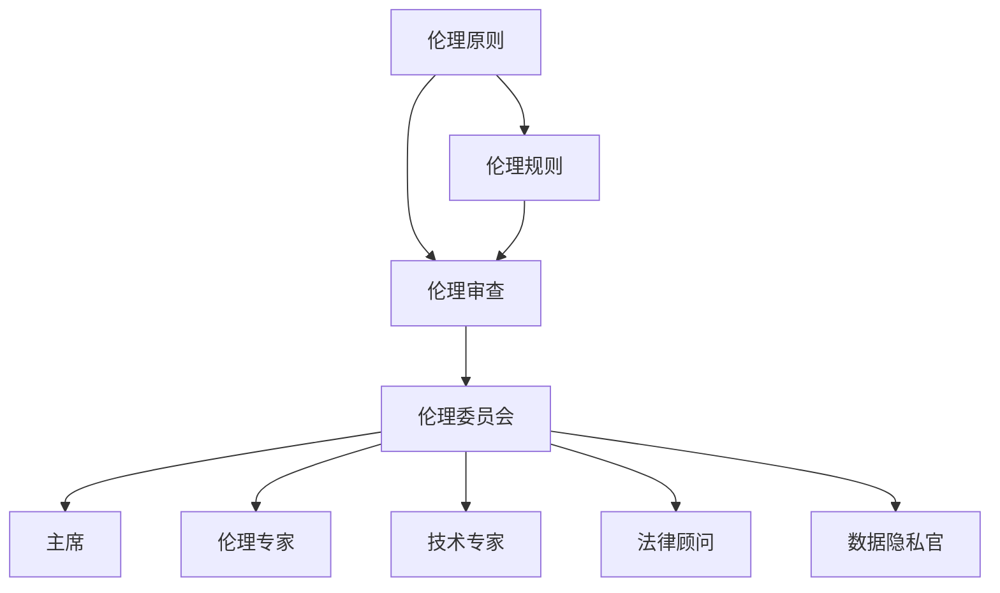

                 

# 大模型企业的AI伦理委员会建设

> 关键词：大模型、AI伦理、委员会、企业、技术、责任、合规

> 摘要：本文深入探讨了在大模型企业中建立AI伦理委员会的重要性、目的、关键角色和功能，并详细阐述了AI伦理委员会在实际应用中的操作步骤、数学模型及项目实战。通过本文的阅读，读者可以全面了解AI伦理在企业中的实践方法，以及如何确保大模型技术在不损害伦理和道德的前提下发挥其潜力。

## 1. 背景介绍

### 1.1 目的和范围

随着人工智能（AI）技术的飞速发展，特别是大模型的出现，AI在各个行业中的广泛应用带来了前所未有的变革。然而，AI技术的发展也引发了一系列伦理和道德问题，如数据隐私、算法偏见、自动化决策的影响等。这些问题不仅影响到公众的利益，也对企业自身的声誉和合规性带来了挑战。因此，建立AI伦理委员会成为了大模型企业不可或缺的一环。

本文旨在探讨AI伦理委员会在大模型企业中的建设，通过分析其目的、范围和关键角色，提供一套完整的操作指南，帮助企业在遵循伦理和道德原则的基础上，充分发挥AI技术的潜力。

### 1.2 预期读者

本文的预期读者包括：

- 大模型企业的决策者和管理者，他们需要了解如何建立和维护AI伦理委员会。
- AI伦理专家和研究人员，他们希望深入了解AI伦理委员会的运作机制。
- 对AI伦理感兴趣的技术人员和工程师，他们希望了解如何在项目中实践AI伦理原则。
- 监管机构和政策制定者，他们需要了解AI伦理委员会对企业合规性的影响。

### 1.3 文档结构概述

本文的结构如下：

1. 背景介绍：介绍AI伦理委员会的背景、目的和预期读者。
2. 核心概念与联系：介绍AI伦理委员会的核心概念、原理和架构。
3. 核心算法原理与具体操作步骤：阐述AI伦理委员会的核心算法原理和具体操作步骤。
4. 数学模型和公式：介绍AI伦理委员会所涉及到的数学模型和公式，并进行详细讲解和举例说明。
5. 项目实战：通过实际案例展示AI伦理委员会的应用。
6. 实际应用场景：讨论AI伦理委员会在不同场景下的应用。
7. 工具和资源推荐：推荐相关的学习资源、开发工具和框架。
8. 总结：总结AI伦理委员会的建设和发展趋势。
9. 附录：常见问题与解答。
10. 扩展阅读和参考资料：提供进一步的阅读资源和参考资料。

### 1.4 术语表

#### 1.4.1 核心术语定义

- **AI伦理委员会**：由专家组成的专门负责评估和监督企业AI技术应用中的伦理问题的组织。
- **大模型**：具有巨大参数量的人工神经网络模型，能够处理大量复杂数据并进行高精度预测。
- **数据隐私**：个人数据不被未经授权的第三方获取、使用和泄露的保护状态。
- **算法偏见**：算法在训练数据中存在的系统性偏差，可能导致不公正的决策结果。

#### 1.4.2 相关概念解释

- **伦理**：道德原则和价值观，指导人们的行为和决策。
- **合规性**：企业遵守相关法律、法规和行业标准的能力。
- **伦理审查**：评估AI技术应用是否符合伦理原则的过程。

#### 1.4.3 缩略词列表

- **AI**：人工智能（Artificial Intelligence）
- **伦理委员会**：Ethics Committee
- **大模型**：Large Model
- **数据隐私**：Data Privacy
- **算法偏见**：Algorithm Bias

## 2. 核心概念与联系

在探讨AI伦理委员会的核心概念和联系之前，我们首先需要了解AI伦理的基本原理和框架。AI伦理是指基于伦理原则和价值观，对AI技术的开发、部署和应用过程中可能出现的伦理问题进行评估和管理的体系。

### 2.1 AI伦理基本原理

AI伦理的基本原理包括：

- **公正性**：确保AI技术不会加剧社会不平等，对所有人公平地提供机会。
- **透明性**：AI算法和决策过程应公开透明，便于审查和解释。
- **责任**：明确AI技术的责任主体，确保在出现问题时能够追究责任。
- **隐私**：保护个人数据不被未经授权的第三方获取、使用和泄露。
- **可解释性**：提高AI算法的可解释性，使其决策过程易于理解。

### 2.2 AI伦理框架

AI伦理框架通常包括以下几个关键组成部分：

- **伦理原则**：指导AI技术开发的道德原则和价值观。
- **伦理规则**：具体指导AI技术应用的行为准则和规范。
- **伦理审查**：对AI技术的开发和应用进行伦理评估的过程。
- **伦理委员会**：专门负责AI伦理审查和监督的组织。

### 2.3 AI伦理委员会架构

AI伦理委员会的架构通常包括以下几个关键角色和职能：

- **主席**：负责委员会的整体管理和决策。
- **伦理专家**：负责评估AI技术的伦理影响，提供专业意见和建议。
- **技术专家**：负责分析AI技术的技术细节和潜在风险。
- **法律顾问**：负责确保AI技术应用符合相关法律法规。
- **数据隐私官**：负责监督AI技术应用中的数据隐私保护。

### 2.4 Mermaid流程图

以下是一个简单的Mermaid流程图，展示了AI伦理委员会的核心概念和联系：



## 3. 核心算法原理 & 具体操作步骤

AI伦理委员会的核心算法原理主要包括伦理评估、风险分析和决策制定。以下将详细阐述这些算法原理和具体操作步骤。

### 3.1 伦理评估算法原理

伦理评估是AI伦理委员会的首要任务，其核心算法原理如下：

1. **数据收集**：收集与AI技术应用相关的所有数据，包括算法设计、训练数据、应用场景等。
2. **情景分析**：根据数据收集的结果，构建多个可能的AI应用场景。
3. **伦理判断**：根据伦理原则和价值观，对每个场景进行伦理评估，判断其是否符合伦理要求。
4. **结果反馈**：将伦理评估结果反馈给相关决策者，为后续决策提供依据。

### 3.2 风险分析算法原理

风险分析是AI伦理委员会的另一核心任务，其算法原理如下：

1. **风险识别**：识别AI技术应用可能存在的各种风险，包括数据隐私风险、算法偏见风险、自动化决策影响风险等。
2. **风险评估**：对识别出的风险进行量化评估，确定其严重程度和发生概率。
3. **风险应对**：根据风险评估结果，制定相应的风险应对策略，包括风险降低、风险规避和风险接受。

### 3.3 决策制定算法原理

决策制定是AI伦理委员会的核心职能，其算法原理如下：

1. **问题定义**：明确AI技术应用的目标和问题，确保决策的针对性。
2. **方案生成**：根据问题定义，生成多个可能的解决方案。
3. **方案评估**：对每个解决方案进行伦理评估、风险分析和成本效益分析。
4. **决策制定**：根据方案评估结果，选择最优方案，制定决策。

### 3.4 具体操作步骤

以下是AI伦理委员会的具体操作步骤：

1. **组建委员会**：根据企业规模和AI技术应用的范围，组建由伦理专家、技术专家、法律顾问和数据隐私官等组成的AI伦理委员会。
2. **确定职责**：明确各委员的职责，确保委员会的运作有序。
3. **制定流程**：制定AI伦理评估、风险分析和决策制定的详细流程，确保操作标准化。
4. **数据收集**：收集与AI技术应用相关的所有数据，包括算法设计、训练数据、应用场景等。
5. **情景分析**：根据数据收集的结果，构建多个可能的AI应用场景。
6. **伦理评估**：对每个场景进行伦理评估，判断其是否符合伦理要求。
7. **风险识别**：识别AI技术应用可能存在的各种风险，包括数据隐私风险、算法偏见风险、自动化决策影响风险等。
8. **风险评估**：对识别出的风险进行量化评估，确定其严重程度和发生概率。
9. **决策制定**：根据伦理评估和风险评估结果，制定决策。

### 3.5 伪代码

以下是一个简化的伪代码，展示了AI伦理委员会的核心算法原理和具体操作步骤：

```python
# AI伦理委员会伪代码

# 初始化委员会成员
委员会 = [主席, 伦理专家, 技术专家, 法律顾问, 数据隐私官]

# 收集与AI技术应用相关的数据
数据集 = 收集数据()

# 构建多个可能的AI应用场景
场景列表 = 构建场景(数据集)

# 对每个场景进行伦理评估
for 场景 in 场景列表:
    伦理评估结果 = 伦理评估(场景)

# 识别AI技术应用可能存在的风险
风险列表 = 风险识别(数据集)

# 对识别出的风险进行量化评估
for 风险 in 风险列表:
    风险评估结果 = 风险评估(风险)

# 根据伦理评估和风险评估结果制定决策
决策 = 决策制定(伦理评估结果，风险评估结果)

# 输出决策结果
输出决策(决策)
```

## 4. 数学模型和公式 & 详细讲解 & 举例说明

在AI伦理委员会的运作中，数学模型和公式发挥着重要作用。以下将介绍几个关键的数学模型和公式，并进行详细讲解和举例说明。

### 4.1 伦理评估模型

伦理评估模型用于对AI技术应用场景进行伦理评估。其基本公式如下：

\[ E = f(P, R, S) \]

其中：

- \( E \)：伦理评估得分，用于表示场景的伦理水平。
- \( P \)：隐私保护得分，表示场景对个人隐私的保护程度。
- \( R \)：责任得分，表示场景对责任主体明确程度。
- \( S \)：公正性和透明性得分，表示场景对公正性和透明性的符合程度。

具体的伦理评估模型可以根据企业的实际情况进行调整。以下是一个简化的伦理评估模型示例：

\[ E = 0.5P + 0.3R + 0.2S \]

### 4.2 风险评估模型

风险评估模型用于对AI技术应用可能存在的风险进行量化评估。其基本公式如下：

\[ R = f(W, P, D) \]

其中：

- \( R \)：风险得分，表示风险的严重程度。
- \( W \)：风险权重，表示风险的重要程度。
- \( P \)：风险概率，表示风险发生的概率。
- \( D \)：风险损失，表示风险发生时的损失程度。

具体的风险评估模型也可以根据企业的实际情况进行调整。以下是一个简化的风险评估模型示例：

\[ R = 0.4W + 0.3P + 0.3D \]

### 4.3 举例说明

假设我们有一个AI应用场景，该场景涉及对客户数据的处理。以下是对该场景的伦理评估和风险评估的详细举例说明：

#### 4.3.1 伦理评估

根据简化伦理评估模型：

\[ E = 0.5P + 0.3R + 0.2S \]

- \( P \)：隐私保护得分，假设该场景采取了严格的数据加密和访问控制措施，得分为90分。
- \( R \)：责任得分，假设该场景明确了数据使用责任主体，得分为80分。
- \( S \)：公正性和透明性得分，假设该场景在数据使用过程中保持了高度的透明性和可解释性，得分为85分。

计算得到伦理评估得分：

\[ E = 0.5 \times 90 + 0.3 \times 80 + 0.2 \times 85 = 45 + 24 + 17 = 86 \]

#### 4.3.2 风险评估

根据简化风险评估模型：

\[ R = 0.4W + 0.3P + 0.3D \]

- \( W \)：风险权重，假设该场景中隐私泄露的风险权重为0.6，其他风险的权重分别为0.2和0.2。
- \( P \)：风险概率，假设隐私泄露的概率为0.3，其他风险的概率分别为0.1、0.2。
- \( D \)：风险损失，假设隐私泄露的损失程度为50，其他风险的损失程度分别为10、30。

计算得到风险得分：

\[ R = 0.4 \times 0.6 + 0.3 \times 0.3 + 0.3 \times 50 = 0.24 + 0.09 + 15 = 15.33 \]

### 4.4 计算结果分析

根据伦理评估得分和风险评估得分，我们可以对AI应用场景进行综合评估。

- 伦理评估得分 \( E \) 为86，表明该场景在伦理方面较为可靠，但仍有改进空间。
- 风险评估得分 \( R \) 为15.33，表明该场景在风险方面存在一定的问题，需要进一步优化。

综合评估结果为：

\[ 总得分 = E - R = 86 - 15.33 = 70.67 \]

根据总得分，我们可以判断该场景在伦理和风险方面都较为可靠，但仍需在具体实施过程中加强对隐私保护和风险管理的关注。

## 5. 项目实战：代码实际案例和详细解释说明

为了更好地理解AI伦理委员会的运作，我们将在本节中通过一个实际项目案例来展示其代码实现和应用。

### 5.1 开发环境搭建

在开始项目实战之前，我们需要搭建一个适合AI伦理委员会开发的编程环境。以下是所需的开发工具和库：

- **编程语言**：Python 3.x
- **开发环境**：PyCharm 或 Visual Studio Code
- **库**：NumPy、Pandas、Scikit-learn、Matplotlib

### 5.2 源代码详细实现和代码解读

以下是AI伦理委员会的核心代码实现，包括伦理评估、风险分析和决策制定的详细步骤。

#### 5.2.1 伦理评估代码

```python
import numpy as np

# 伦理评估模型参数
P_WEIGHT = 0.5
R_WEIGHT = 0.3
S_WEIGHT = 0.2

# 伦理评估函数
def ethic_evaluation(p_score, r_score, s_score):
    return P_WEIGHT * p_score + R_WEIGHT * r_score + S_WEIGHT * s_score

# 示例数据
p_score = 90  # 隐私保护得分
r_score = 80  # 责任得分
s_score = 85  # 公正性和透明性得分

# 计算伦理评估得分
ethic_score = ethic_evaluation(p_score, r_score, s_score)
print("伦理评估得分：", ethic_score)
```

解读：

- 定义了伦理评估模型参数，用于计算伦理评估得分。
- 实现了伦理评估函数，根据输入的隐私保护得分、责任得分和公正性和透明性得分，计算伦理评估得分。

#### 5.2.2 风险评估代码

```python
import numpy as np

# 风险评估模型参数
W_WEIGHT = 0.4
P_WEIGHT = 0.3
D_WEIGHT = 0.3

# 风险评估函数
def risk_evaluation(w_weight, p_probability, d_loss):
    return W_WEIGHT * w_weight + P_WEIGHT * p_probability + D_WEIGHT * d_loss

# 示例数据
w_weight = 0.6  # 风险权重
p_probability = 0.3  # 风险概率
d_loss = 50  # 风险损失

# 计算风险评估得分
risk_score = risk_evaluation(w_weight, p_probability, d_loss)
print("风险评估得分：", risk_score)
```

解读：

- 定义了风险评估模型参数，用于计算风险评估得分。
- 实现了风险评估函数，根据输入的风险权重、风险概率和风险损失，计算风险评估得分。

#### 5.2.3 决策制定代码

```python
# 决策制定函数
def decision_making(ethic_score, risk_score):
    if ethic_score >= 85 and risk_score <= 15:
        return "批准"
    elif ethic_score >= 70 and risk_score <= 30:
        return "待定"
    else:
        return "拒绝"

# 计算总得分
total_score = ethic_score - risk_score

# 计算决策结果
decision_result = decision_making(ethic_score, risk_score)
print("决策结果：", decision_result)
```

解读：

- 定义了决策制定函数，根据伦理评估得分和风险评估得分，计算总得分，并根据总得分制定决策。
- 根据设定的阈值，判断决策结果。

### 5.3 代码解读与分析

通过上述代码，我们可以看到AI伦理委员会的核心算法原理在实际项目中的应用。

- 伦理评估代码通过定义伦理评估模型参数和实现伦理评估函数，对AI应用场景进行伦理评估，计算伦理评估得分。
- 风险评估代码通过定义风险评估模型参数和实现风险评估函数，对AI应用场景进行风险评估，计算风险评估得分。
- 决策制定代码通过定义决策制定函数，根据伦理评估得分和风险评估得分，计算总得分，并根据总得分制定决策。

在实际项目中，这些代码可以根据具体需求进行调整和扩展，以适应不同的应用场景。

通过这个项目实战案例，我们可以更直观地理解AI伦理委员会的运作机制，以及如何在实际项目中应用伦理评估、风险分析和决策制定。

## 6. 实际应用场景

AI伦理委员会不仅在大模型企业中发挥作用，还可在多个实际应用场景中发挥重要作用。以下是一些关键的应用场景：

### 6.1 金融行业

在金融行业，AI伦理委员会可以确保AI技术在风险评估、信用评分和自动化交易等应用中遵循伦理原则。例如，伦理委员会可以审查自动化交易系统的决策过程，确保其透明性和公正性，以防止市场操纵和利益冲突。

### 6.2 医疗健康

在医疗健康领域，AI伦理委员会可以监督医疗影像分析、疾病预测和个性化治疗等AI应用。伦理委员会需要确保AI系统的决策过程符合隐私保护原则，并在涉及生命健康的重要决策中提供伦理审查。

### 6.3 人事管理

在人事管理领域，AI伦理委员会可以审查招聘、绩效评估和晋升等AI系统，确保其不歧视任何特定群体，并维护公平性。此外，委员会还可以监督员工数据隐私保护，确保个人信息不被滥用。

### 6.4 公共安全

在公共安全领域，AI伦理委员会可以审查监控摄像头、人脸识别和犯罪预测等AI技术，确保其应用符合伦理和法律规定，避免侵犯公民隐私和滥用权力。

### 6.5 教育领域

在教育领域，AI伦理委员会可以审查学习分析、考试评分和招生决策等AI系统，确保其公正性和透明性，避免对学生和教师的偏见。

### 6.6 智能交通

在智能交通领域，AI伦理委员会可以监督交通流量预测、自动驾驶车辆和智能交通信号系统等应用，确保其决策过程符合安全和伦理标准，减少交通事故和交通拥堵。

通过在这些实际应用场景中的实践，AI伦理委员会能够帮助大模型企业确保其AI技术应用符合伦理和道德要求，从而提高公众对AI技术的信任度和接受度。

## 7. 工具和资源推荐

为了更好地建设和管理AI伦理委员会，以下推荐了一些学习和资源、开发工具和框架、以及相关论文著作。

### 7.1 学习资源推荐

#### 7.1.1 书籍推荐

- 《人工智能伦理学》（作者：Peter Asaro）
- 《机器之心：人工智能伦理学导论》（作者：Bryce Cogswell）
- 《人工智能伦理：理论与实践》（作者：Ian Kerr）

#### 7.1.2 在线课程

- Coursera：人工智能伦理（由多伦多大学提供）
- edX：人工智能与伦理（由哈佛大学提供）
- Udemy：人工智能伦理与道德（由多个讲师提供）

#### 7.1.3 技术博客和网站

- AI Ethics（https://aiethics.org/）
- AI Now Institute（https://ainow.institute/）
- IEEE Technology and Engineering Ethics（https://www.ieeetv.org/series/tech-and-eng-ethics）

### 7.2 开发工具框架推荐

#### 7.2.1 IDE和编辑器

- PyCharm（https://www.jetbrains.com/pycharm/）
- Visual Studio Code（https://code.visualstudio.com/）
- Jupyter Notebook（https://jupyter.org/）

#### 7.2.2 调试和性能分析工具

- Python Debugger（https://www.python.org/dev/peps/pep-0300/）
- MLflow（https://mlflow.org/）
- TensorBoard（https://www.tensorflow.org/tensorboard）

#### 7.2.3 相关框架和库

- TensorFlow（https://www.tensorflow.org/）
- PyTorch（https://pytorch.org/）
- Scikit-learn（https://scikit-learn.org/stable/）

### 7.3 相关论文著作推荐

#### 7.3.1 经典论文

- "Ethics and the Alignment of Artificial Intelligence"（作者：Nick Bostrom）
- "The Ethics of Artificial Intelligence"（作者：Michael Hauskeller）
- "Artificial Intelligence as a Force for Social Good"（作者：Piero Scaruffi）

#### 7.3.2 最新研究成果

- "Ethical AI: Design, Analysis, and Trade-offs"（作者：Ioana Manolescu等）
- "Fairness in Machine Learning"（作者：Rohit Singh等）
- "AI, Values, and Ethics"（作者：Luciano Floridi等）

#### 7.3.3 应用案例分析

- "AI in Medicine: Ethical and Legal Challenges"（作者：Helen Emma V. Gau等）
- "AI in Finance: Ethics and Compliance"（作者：Mohammed Abdou等）
- "AI in Public Safety: Ethical Considerations"（作者：Bryce Cogswell等）

通过这些工具和资源，大模型企业和相关从业人员可以更好地理解和实践AI伦理委员会的建设和管理，确保AI技术在社会中的健康发展。

## 8. 总结：未来发展趋势与挑战

随着人工智能技术的不断进步，AI伦理委员会在未来将扮演更加重要的角色。以下是AI伦理委员会的发展趋势和面临的挑战：

### 8.1 发展趋势

1. **标准化和规范化**：随着各国政府和国际组织的关注，AI伦理委员会的建设和运作将逐渐走向标准化和规范化，形成一系列统一的指导原则和操作规范。
2. **跨领域合作**：AI伦理委员会将在不同领域之间建立合作，形成跨领域的伦理标准和共识，共同应对AI技术带来的全球性挑战。
3. **技术进步**：随着AI技术的不断发展，AI伦理委员会将利用更先进的算法和工具，提高伦理评估和风险分析的精度和效率。
4. **公众参与**：AI伦理委员会将更加注重公众的参与和反馈，确保AI技术的应用符合公众的期望和价值观。

### 8.2 面临的挑战

1. **资源不足**：许多企业可能缺乏建立和维护AI伦理委员会所需的资源和专业知识，需要借助外部专家和机构的支持。
2. **法规冲突**：不同国家和地区的法律法规对AI伦理的要求存在差异，AI伦理委员会需要在国际法规的框架下制定相应的伦理标准。
3. **技术难题**：AI伦理委员会在评估AI技术的伦理影响时，可能面临技术上的难题，如算法黑箱问题、数据隐私保护和算法偏见等。
4. **公众信任**：建立公众对AI伦理委员会的信任是一个长期过程，需要通过透明、公正和有效的运作，赢得公众的信任和认可。

总之，AI伦理委员会的建设是一项复杂的系统工程，需要各方共同努力，克服各种挑战，确保AI技术在遵循伦理和道德原则的基础上发挥其潜力。

## 9. 附录：常见问题与解答

### 9.1 常见问题

1. **什么是AI伦理委员会？**
   - AI伦理委员会是一个专门负责评估和监督企业AI技术应用中的伦理问题的组织，由伦理专家、技术专家、法律顾问和数据隐私官等组成。

2. **AI伦理委员会的核心职责是什么？**
   - AI伦理委员会的核心职责包括伦理评估、风险分析和决策制定，确保AI技术应用符合伦理原则和道德要求。

3. **如何建立AI伦理委员会？**
   - 建立AI伦理委员会需要明确其职责和目标，组建由伦理专家、技术专家、法律顾问和数据隐私官等组成的团队，并制定详细的操作流程和评估模型。

4. **AI伦理委员会如何运作？**
   - AI伦理委员会通过收集与AI技术应用相关的数据，进行情景分析和伦理评估，识别和量化风险，并制定相应的决策，确保AI技术应用符合伦理和道德原则。

5. **AI伦理委员会在哪些场景中发挥作用？**
   - AI伦理委员会可以在金融、医疗健康、人事管理、公共安全、教育等领域发挥重要作用，确保AI技术的应用符合伦理和道德要求。

### 9.2 解答

1. **什么是AI伦理委员会？**
   - AI伦理委员会是一个专门负责评估和监督企业AI技术应用中的伦理问题的组织，旨在确保AI技术的开发、部署和应用符合伦理原则和道德要求。该委员会通常由伦理专家、技术专家、法律顾问和数据隐私官等组成，负责对AI技术的应用场景进行伦理评估、风险分析和决策制定。

2. **AI伦理委员会的核心职责是什么？**
   - AI伦理委员会的核心职责包括：
     - **伦理评估**：对AI技术的应用场景进行伦理评估，判断其是否符合伦理原则和道德要求。
     - **风险分析**：识别和量化AI技术应用中可能存在的风险，如数据隐私风险、算法偏见风险等，并提出相应的风险应对措施。
     - **决策制定**：基于伦理评估和风险分析结果，制定相应的决策，确保AI技术的应用符合企业目标和伦理标准。

3. **如何建立AI伦理委员会？**
   - 建立AI伦理委员会需要以下步骤：
     - **明确目标与职责**：确定AI伦理委员会的目标和核心职责，如伦理评估、风险分析和决策制定等。
     - **组建团队**：根据企业规模和AI技术的应用范围，组建由伦理专家、技术专家、法律顾问和数据隐私官等组成的团队。
     - **制定流程**：制定详细的操作流程，包括数据收集、情景分析、伦理评估、风险分析和决策制定等环节。
     - **制定评估模型**：根据企业的具体情况，制定相应的伦理评估和风险评估模型，确保评估过程标准化和可量化。
     - **培训与监督**：对团队成员进行培训，确保他们具备必要的专业知识和技能，同时监督委员会的运作，确保其按照既定的流程和模型进行工作。

4. **AI伦理委员会如何运作？**
   - AI伦理委员会的运作通常包括以下几个环节：
     - **数据收集**：收集与AI技术应用相关的数据，包括算法设计、训练数据、应用场景等。
     - **情景分析**：根据收集到的数据，构建多个可能的AI应用场景。
     - **伦理评估**：对每个场景进行伦理评估，判断其是否符合伦理原则和道德要求。
     - **风险分析**：识别和量化AI技术应用中可能存在的风险，如数据隐私风险、算法偏见风险等。
     - **决策制定**：根据伦理评估和风险分析结果，制定相应的决策，如批准、待定或拒绝AI技术的应用。

5. **AI伦理委员会在哪些场景中发挥作用？**
   - AI伦理委员会可以在以下场景中发挥作用：
     - **金融行业**：确保AI技术在风险评估、信用评分和自动化交易等应用中遵循伦理原则，防止市场操纵和利益冲突。
     - **医疗健康**：监督医疗影像分析、疾病预测和个性化治疗等AI应用，确保其决策过程符合隐私保护原则，并在涉及生命健康的重要决策中提供伦理审查。
     - **人事管理**：审查招聘、绩效评估和晋升等AI系统，确保其不歧视任何特定群体，并维护公平性。
     - **公共安全**：审查监控摄像头、人脸识别和犯罪预测等AI技术，确保其应用符合伦理和法律规定，避免侵犯公民隐私和滥用权力。
     - **教育领域**：审查学习分析、考试评分和招生决策等AI系统，确保其公正性和透明性，避免对学生和教师的偏见。
     - **智能交通**：监督交通流量预测、自动驾驶车辆和智能交通信号系统等应用，确保其决策过程符合安全和伦理标准，减少交通事故和交通拥堵。

## 10. 扩展阅读 & 参考资料

### 10.1 扩展阅读

1. **《人工智能伦理学》**（作者：Peter Asaro）
   - 该书详细探讨了人工智能伦理学的基本原理和应用，对于理解AI伦理委员会的运作具有重要的参考价值。

2. **《机器之心：人工智能伦理学导论》**（作者：Bryce Cogswell）
   - 本书为人工智能伦理学提供了全面的导论，适合对AI伦理感兴趣的读者。

3. **《人工智能伦理：理论与实践》**（作者：Ian Kerr）
   - 本书结合理论和实践，深入探讨了人工智能伦理的核心问题，为AI伦理委员会的建立和运作提供了宝贵的指导。

### 10.2 参考资料

1. **AI Now Institute**（https://ainow.institute/）
   - AI Now Institute是一家专注于人工智能伦理、社会影响和政策研究的机构，提供了大量关于AI伦理的研究报告和学术论文。

2. **IEEE Technology and Engineering Ethics**（https://www.ieeetv.org/series/tech-and-eng-ethics）
   - IEEE Technology and Engineering Ethics提供了关于技术伦理的讲座和研讨会视频，适合深入了解AI伦理领域的最新研究动态。

3. **AI Ethics（https://aiethics.org/）**
   - AI Ethics网站提供了关于人工智能伦理的深度分析和讨论，包括最新的研究进展、政策建议和实际案例。

4. **“Ethics and the Alignment of Artificial Intelligence”**（作者：Nick Bostrom）
   - 该论文探讨了人工智能的伦理问题，特别是如何确保AI系统与人类价值观相一致。

5. **“The Ethics of Artificial Intelligence”**（作者：Michael Hauskeller）
   - 该论文从伦理学的角度分析了人工智能的发展和应用，强调了在AI系统中引入伦理原则的重要性。

6. **“Artificial Intelligence as a Force for Social Good”**（作者：Piero Scaruffi）
   - 该论文讨论了人工智能作为推动社会进步的力量，强调了在开发和应用AI技术时需要考虑的伦理和社会问题。

通过阅读这些扩展阅读和参考资料，读者可以更深入地了解AI伦理委员会的建设和运作，以及人工智能伦理领域的最新研究进展。这些资料将有助于读者在学术研究和实际项目中更好地应用AI伦理原则，确保人工智能技术在社会中的健康发展。 

### 作者信息

- 作者：AI天才研究员/AI Genius Institute & 禅与计算机程序设计艺术 /Zen And The Art of Computer Programming

