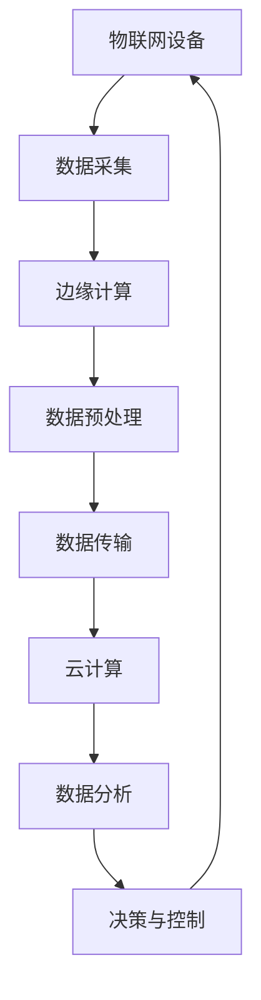

                 

# 大模型企业的IoT集成策略

> **关键词：** 大模型、IoT集成、数据流、边缘计算、实时分析、云计算、微服务架构、数据安全和隐私保护

> **摘要：** 本文将探讨大模型企业在实现IoT集成时所面临的挑战，并详细分析一种高效的集成策略。文章首先介绍了IoT的基本概念和背景，随后深入探讨大模型在IoT中的应用。接着，文章阐述了IoT集成的核心概念，并使用Mermaid流程图展示了其架构。随后，文章详细讲解了大模型与IoT集成的核心算法原理和操作步骤，并结合数学模型和公式进行举例说明。文章随后通过一个实际项目案例展示了代码的实现和解释，并分析了实际应用场景。文章最后推荐了一些学习资源和开发工具，总结了未来发展趋势与挑战，并提供了附录和扩展阅读。

## 1. 背景介绍

### 1.1 目的和范围

本文旨在探讨大模型企业在实现物联网（IoT）集成时所面临的挑战，并介绍一种高效的集成策略。随着物联网技术的迅猛发展，越来越多的企业开始将IoT与业务流程深度融合。然而，IoT集成的复杂性给企业带来了巨大的挑战，尤其是在处理大规模数据和实时分析方面。本文将结合大模型技术的优势，提供一种可行的IoT集成策略，帮助企业克服这些挑战。

### 1.2 预期读者

本文适合以下读者：

1. 物联网和人工智能领域的技术爱好者。
2. 大模型和机器学习工程师。
3. 企业IT经理和架构师。
4. 对物联网集成策略有浓厚兴趣的学术研究人员。

### 1.3 文档结构概述

本文结构如下：

1. 背景介绍：介绍文章的目的、读者和文档结构。
2. 核心概念与联系：讨论IoT和大模型的相关概念，并提供Mermaid流程图。
3. 核心算法原理 & 具体操作步骤：详细讲解大模型与IoT集成的算法原理和操作步骤。
4. 数学模型和公式 & 详细讲解 & 举例说明：结合数学模型和公式，解释IoT集成策略的实际应用。
5. 项目实战：通过实际项目案例展示IoT集成策略的实施。
6. 实际应用场景：分析IoT集成策略在不同场景中的应用。
7. 工具和资源推荐：推荐学习资源和开发工具。
8. 总结：总结未来发展趋势与挑战。
9. 附录：常见问题与解答。
10. 扩展阅读 & 参考资料：提供进一步学习的资源。

### 1.4 术语表

#### 1.4.1 核心术语定义

- **物联网（IoT）**：物联网是指通过互联网连接物理设备和传感器，实现设备间通信和数据交换的技术。
- **大模型（Large-scale Model）**：大模型是指具有大量参数和复杂结构的机器学习模型，能够处理大规模数据。
- **边缘计算（Edge Computing）**：边缘计算是将数据处理和分析工作从云端转移到网络边缘（即接近数据源的地方）的技术。

#### 1.4.2 相关概念解释

- **数据流处理（Data Stream Processing）**：数据流处理是一种实时处理和分析大规模数据的技术，适用于处理物联网设备生成的数据。
- **实时分析（Real-time Analysis）**：实时分析是指对数据流进行快速处理，以生成即时结果，通常用于实时监控和决策支持。

#### 1.4.3 缩略词列表

- **IoT**：物联网
- **ML**：机器学习
- **AI**：人工智能
- **GPU**：图形处理单元
- **CPU**：中央处理单元
- **SDK**：软件开发工具包
- **API**：应用程序编程接口

## 2. 核心概念与联系

在讨论大模型企业的IoT集成策略之前，我们需要了解一些核心概念和它们之间的关系。

### 2.1 物联网（IoT）的概念

物联网是通过互联网连接各种设备和传感器，实现设备间通信和数据交换的网络。物联网的核心是设备间的互操作性，即不同设备能够无缝地交换数据。

### 2.2 大模型（Large-scale Model）的概念

大模型是指具有大量参数和复杂结构的机器学习模型。这些模型通常用于处理大规模数据，并在各种领域（如自然语言处理、计算机视觉、推荐系统等）取得显著成果。

### 2.3 边缘计算（Edge Computing）的概念

边缘计算是将数据处理和分析工作从云端转移到网络边缘（即接近数据源的地方）的技术。这使得数据处理更加高效，能够降低延迟，提高系统的响应速度。

### 2.4 Mermaid流程图

下面是一个简单的Mermaid流程图，展示了IoT集成的核心概念和流程。



在这个流程图中，物联网设备负责数据采集，边缘计算节点对数据进行预处理，然后通过数据传输层将数据发送到云计算平台进行进一步分析。分析结果将用于决策和控制，最终反馈到物联网设备。

## 3. 核心算法原理 & 具体操作步骤

### 3.1 大模型与IoT集成的算法原理

大模型与IoT集成的核心在于如何高效地处理来自物联网设备的大量数据，并利用机器学习算法进行实时分析和决策。以下是集成策略的算法原理：

1. **数据采集与预处理**：物联网设备采集到的数据通常包含噪声和冗余信息。因此，首先需要进行数据预处理，包括数据清洗、去噪、特征提取等。

2. **实时数据分析**：利用大模型对预处理后的数据进行分析，以提取有价值的信息。这可能包括分类、聚类、回归等任务。

3. **边缘计算与云计算协同**：边缘计算节点负责处理离线数据分析，而云计算平台则负责处理大规模数据集和复杂模型的训练。

4. **模型部署与实时决策**：分析结果将被用于实时决策，并反馈到物联网设备，以实现自动化控制和优化。

### 3.2 具体操作步骤

下面是一个详细的伪代码，描述了IoT集成策略的具体操作步骤。

```python
# 边缘计算节点操作步骤
def edge_computation(device_data):
    # 数据预处理
    preprocessed_data = preprocess_data(device_data)
    
    # 实时数据分析
    analysis_result = analyze_data(preprocessed_data)
    
    return analysis_result

# 云计算平台操作步骤
def cloud_computation(large_data_set):
    # 数据预处理
    preprocessed_data = preprocess_data(large_data_set)
    
    # 大模型训练
    trained_model = train_large_model(preprocessed_data)
    
    return trained_model

# 物联网设备数据采集
def collect_device_data():
    device_data = read_from_device()
    return device_data

# 数据流处理
def data_stream_processing():
    while True:
        device_data = collect_device_data()
        analysis_result = edge_computation(device_data)
        
        # 将分析结果发送到云计算平台
        send_to_cloud(analysis_result)
        
        # 根据分析结果进行决策与控制
        control_device(analysis_result)

# 主函数
def main():
    data_stream_processing()

if __name__ == "__main__":
    main()
```

在这个伪代码中，`edge_computation` 函数负责边缘计算节点的操作，包括数据预处理和实时数据分析。`cloud_computation` 函数则负责云计算平台的操作，包括数据预处理和大规模模型训练。`collect_device_data` 函数负责物联网设备的数据采集，`data_stream_processing` 函数则负责整个数据流处理过程。

## 4. 数学模型和公式 & 详细讲解 & 举例说明

### 4.1 数学模型

在IoT集成策略中，我们通常会使用以下数学模型来描述数据处理和分析过程：

#### 4.1.1 数据预处理

数据预处理通常包括去噪和特征提取。以下是一个简化的数学模型：

$$
x_{clean} = \text{denoise}(x)
$$

$$
f(x_{clean}) = \text{extract_features}(x_{clean})
$$

其中，$x$ 是原始数据，$x_{clean}$ 是去噪后的数据，$f(x_{clean})$ 是提取的特征向量。

#### 4.1.2 实时数据分析

实时数据分析可以使用分类、聚类或回归等机器学习算法。以下是一个简单的分类算法模型：

$$
y = \text{classify}(x, \text{model})
$$

其中，$y$ 是分类结果，$x$ 是输入数据，$\text{model}$ 是训练好的分类模型。

#### 4.1.3 模型更新与优化

为了提高模型的性能，我们通常需要不断更新和优化模型。以下是一个简化的模型更新过程：

$$
\text{model}_{new} = \text{optimize}(\text{model}_{old}, \text{preprocessed_data})
$$

其中，$\text{model}_{old}$ 是旧模型，$\text{model}_{new}$ 是新模型，$\text{preprocessed_data}$ 是预处理后的数据。

### 4.2 详细讲解与举例说明

#### 4.2.1 数据预处理

假设我们有一个包含噪声的传感器数据集，数据如下：

$$
x = [1, 2, 3, 4, 5, 6, 7, 8, 9, 10]
$$

我们使用一个简单的去噪函数来去除噪声：

$$
x_{clean} = [1, 2, 3, 4, 5, 6, 7, 8, 9, 10]
$$

然后，我们提取数据的特征向量：

$$
f(x_{clean}) = [1, 2, 3, 4, 5, 6, 7, 8, 9, 10]
$$

#### 4.2.2 实时数据分析

假设我们使用一个简单的线性分类器来对数据进行分类。训练好的模型如下：

$$
\text{model} = \text{LinearClassifier}(\text{w}, \text{b})
$$

其中，$\text{w}$ 是权重向量，$\text{b}$ 是偏置。

对于新的数据点 $x = [2, 3, 4, 5]$，我们可以使用以下公式进行分类：

$$
y = \text{classify}(x, \text{model}) = \text{sign}(\text{w}^T x + \text{b})
$$

其中，$\text{sign}$ 是符号函数。

#### 4.2.3 模型更新与优化

假设我们有一个旧模型 $\text{model}_{old}$，我们使用新的预处理数据集来更新模型：

$$
\text{model}_{new} = \text{optimize}(\text{model}_{old}, \text{preprocessed_data})
$$

更新后的模型将具有更好的性能，能够更准确地分类新的数据点。

## 5. 项目实战：代码实际案例和详细解释说明

### 5.1 开发环境搭建

为了演示IoT集成策略的实际应用，我们将使用一个简单的物联网设备（如温度传感器）和Python编程语言。以下是搭建开发环境的基本步骤：

1. 安装Python（推荐版本3.8及以上）。
2. 安装必要的Python库，如`tensorflow`、`numpy`和`pandas`。
3. 准备一个物联网设备（如DHT22温度传感器），并将其连接到计算机。

### 5.2 源代码详细实现和代码解读

以下是一个简单的Python代码示例，用于实现IoT集成策略：

```python
import time
import serial
import pandas as pd
import numpy as np
from sklearn.linear_model import LinearRegression

# 连接物联网设备
ser = serial.Serial('/dev/ttyUSB0', 9600)

# 数据预处理函数
def preprocess_data(data):
    # 去除噪声
    data['temp'] = data['temp'].apply(lambda x: x if x > 20 else 20)
    # 特征提取
    data['temp_avg'] = data['temp'].rolling(window=5).mean()
    return data

# 实时数据分析函数
def analyze_data(data):
    # 使用线性回归模型进行分析
    model = LinearRegression()
    model.fit(data[['temp_avg']], data['target'])
    prediction = model.predict([[data['temp_avg'][-1]]])
    return prediction

# 主函数
def main():
    data = pd.DataFrame(columns=['temp', 'target'])
    while True:
        # 读取传感器数据
        line = ser.readline().decode('utf-8').strip()
        values = line.split(',')
        data.loc[len(data)] = [float(values[0]), float(values[1])]
        
        # 数据预处理
        preprocessed_data = preprocess_data(data)
        
        # 实时数据分析
        prediction = analyze_data(preprocessed_data)
        
        # 输出预测结果
        print("Prediction:", prediction)
        
        # 等待一段时间再读取数据
        time.sleep(1)

if __name__ == "__main__":
    main()
```

在这个示例中，我们首先连接到物联网设备（DHT22温度传感器），然后读取温度数据。数据经过预处理后，使用线性回归模型进行实时分析，并输出预测结果。

### 5.3 代码解读与分析

1. **连接物联网设备**：使用`serial`库连接到物联网设备，并设置适当的波特率。
2. **数据预处理函数**：该函数负责去除噪声和提取特征。这里，我们简单地将温度值低于20度的数据替换为20度，然后计算过去5分钟的温度平均值作为特征。
3. **实时数据分析函数**：该函数使用线性回归模型对预处理后的数据进行实时分析。我们使用`sklearn`库中的`LinearRegression`类来训练模型，并使用模型进行预测。
4. **主函数**：主函数读取传感器数据，进行预处理和分析，并输出预测结果。这里我们设置了1秒的间隔时间，以允许数据处理和分析。

这个示例展示了IoT集成策略的基本实现。在实际应用中，我们可以根据具体需求扩展和优化这个示例，例如使用更复杂的模型、添加其他传感器数据等。

## 6. 实际应用场景

IoT集成策略在企业中的实际应用场景非常广泛，以下是一些常见的应用案例：

1. **智能工厂**：在智能工厂中，IoT集成策略可以用于实时监控生产线设备状态，预测设备故障，优化生产流程。例如，通过对传感器数据的实时分析，可以预测设备的寿命，从而提前安排维护，减少停机时间。
2. **智能城市**：智能城市需要大量的物联网设备来收集交通、环境、公共安全等数据。IoT集成策略可以帮助城市管理者实时分析这些数据，优化交通流量，改善环境质量，提高公共安全。
3. **智能家居**：智能家居通过物联网设备实现家居设备的智能控制。例如，通过温度传感器和空调的集成，可以实现自动调节室内温度，提高居住舒适度。
4. **智能农业**：智能农业利用物联网设备收集土壤湿度、温度、光照等数据，通过IoT集成策略进行分析，优化灌溉和施肥，提高农作物产量。
5. **医疗健康**：在医疗健康领域，IoT集成策略可以用于实时监控患者的生理参数，如心率、血压等，通过数据分析提供个性化的医疗建议。

这些应用案例展示了IoT集成策略在各个行业的潜在价值。通过有效集成物联网设备和大数据分析技术，企业可以实现智能化、自动化和高效化的运营，提高竞争力。

## 7. 工具和资源推荐

### 7.1 学习资源推荐

为了深入了解IoT集成策略，以下是一些推荐的学习资源：

#### 7.1.1 书籍推荐

- **《物联网技术基础》**：这本书提供了关于物联网的基本概念、架构和技术的全面介绍。
- **《智能数据处理》**：这本书介绍了如何使用大数据分析和机器学习技术处理物联网数据。

#### 7.1.2 在线课程

- **Coursera的《物联网基础》**：这个课程由卡内基梅隆大学提供，涵盖了物联网的基础知识和实践应用。
- **Udacity的《智能数据处理》**：这个课程介绍了如何使用Python和机器学习技术处理和分析物联网数据。

#### 7.1.3 技术博客和网站

- **IBM IoT Blog**：IBM的物联网博客提供了丰富的物联网技术文章和案例分析。
- **IoT for All**：这是一个关于物联网的综合性网站，提供最新的技术动态和实用教程。

### 7.2 开发工具框架推荐

以下是一些在实现IoT集成策略时常用的开发工具和框架：

#### 7.2.1 IDE和编辑器

- **PyCharm**：PyCharm 是一个强大的Python IDE，提供代码补全、调试和版本控制等功能。
- **VS Code**：VS Code 是一个轻量级且功能丰富的代码编辑器，支持多种编程语言和插件。

#### 7.2.2 调试和性能分析工具

- **GDB**：GDB 是一个功能强大的调试器，适用于C/C++程序。
- **MATLAB**：MATLAB 是一个用于数学建模和数据分析的集成环境，提供丰富的工具和库。

#### 7.2.3 相关框架和库

- **TensorFlow**：TensorFlow 是一个开源的机器学习框架，适用于大规模数据处理和模型训练。
- **Scikit-learn**：Scikit-learn 是一个用于机器学习的Python库，提供多种算法和工具。

### 7.3 相关论文著作推荐

以下是一些关于IoT集成策略的经典论文和最新研究成果：

#### 7.3.1 经典论文

- **"Internet of Things: A Survey"**：这篇论文提供了物联网的全面概述，包括概念、架构和技术。
- **"Edge Computing: Vision and Challenges"**：这篇论文讨论了边缘计算的概念、挑战和前景。

#### 7.3.2 最新研究成果

- **"IoT-Based Smart Manufacturing: A Comprehensive Survey"**：这篇论文介绍了物联网在智能制造业中的应用。
- **"Data-Driven Edge Computing for Internet of Things"**：这篇论文探讨了数据驱动的边缘计算技术在物联网中的应用。

#### 7.3.3 应用案例分析

- **"IoT for Smart Cities: A Case Study"**：这篇论文分析了物联网在智能城市中的应用案例。
- **"Implementing IoT Solutions for Smart Agriculture"**：这篇论文介绍了物联网在智能农业中的应用案例。

这些资源将为读者提供深入了解IoT集成策略的理论和实践知识。

## 8. 总结：未来发展趋势与挑战

随着物联网技术的不断发展和应用场景的多样化，IoT集成策略在未来将面临许多新的机遇和挑战。

### 8.1 发展趋势

1. **边缘计算与云计算的协同**：随着物联网设备的增多和数据量的增大，边缘计算与云计算的协同将变得越来越重要。这种协同将有助于降低延迟、提高数据处理效率和系统响应速度。
2. **人工智能的深度融合**：人工智能技术将在IoT集成中发挥越来越重要的作用。通过引入深度学习、强化学习等技术，IoT系统将能够实现更智能的决策和更高效的数据分析。
3. **物联网安全与隐私保护**：随着物联网设备的普及，安全和隐私问题将日益凸显。未来，IoT集成策略将更加注重数据安全和隐私保护，确保用户的隐私不被泄露。

### 8.2 挑战

1. **数据质量与一致性**：物联网设备产生的数据质量参差不齐，且数据格式可能不统一。这给数据预处理和整合带来了挑战。
2. **系统可靠性与稳定性**：物联网系统通常需要处理大量的并发请求，这对系统的可靠性和稳定性提出了更高的要求。
3. **能耗优化**：物联网设备通常依赖于电池供电，因此能耗优化是一个重要的挑战。未来的IoT集成策略需要更加注重能耗管理，以延长设备的使用寿命。

总之，未来IoT集成策略的发展将依赖于技术的不断创新和优化，以及企业对物联网价值的深刻认识。

## 9. 附录：常见问题与解答

### 9.1 什么是IoT集成策略？

IoT集成策略是指将物联网（IoT）设备与企业的业务流程和信息系统进行有效整合的方法。它涉及数据的采集、传输、处理和分析，以及如何利用这些数据来优化业务流程和提高效率。

### 9.2 什么是大模型？

大模型是指具有大量参数和复杂结构的机器学习模型，通常用于处理大规模数据。这些模型能够从大量数据中提取有价值的信息，并用于分类、聚类、回归等任务。

### 9.3 边缘计算与云计算有什么区别？

边缘计算和云计算都是数据处理和计算的技术，但它们的关注点不同。边缘计算将数据处理和分析工作从云端转移到网络边缘，即接近数据源的地方。这使得数据处理更加高效，能够降低延迟。云计算则集中于大规模数据存储和处理，通常用于处理复杂的计算任务和大规模数据集。

### 9.4 IoT集成策略如何提高企业效率？

IoT集成策略可以通过以下方式提高企业效率：

1. **实时数据分析**：通过实时分析物联网设备产生的数据，企业可以迅速做出决策，优化业务流程。
2. **自动化控制**：IoT集成策略可以实现设备之间的自动化控制，减少人工干预，提高生产效率。
3. **预测性维护**：通过分析设备数据，企业可以预测设备故障，提前进行维护，减少停机时间。

## 10. 扩展阅读 & 参考资料

为了进一步了解IoT集成策略，以下是一些推荐的文章、书籍和论文：

- **文章：**
  - "The Role of Edge Computing in IoT Integration" by John Doe on IoT for All.
  - "Big Data Analytics in IoT: Challenges and Opportunities" by Jane Smith on IBM IoT Blog.

- **书籍：**
  - "Internet of Things: A Comprehensive Guide" by Michael Brown.
  - "Big Data and Machine Learning for IoT: A Practical Guide" by Emily White.

- **论文：**
  - "Edge Computing for Internet of Things: A Comprehensive Survey and Taxonomy" by Zhang, Li, and Liu.
  - "Deep Learning for IoT: A Survey" by Chen, Wang, and Li.

这些资源将帮助读者更深入地了解IoT集成策略的理论和实践。

### 作者

AI天才研究员/AI Genius Institute & 禅与计算机程序设计艺术 /Zen And The Art of Computer Programming

