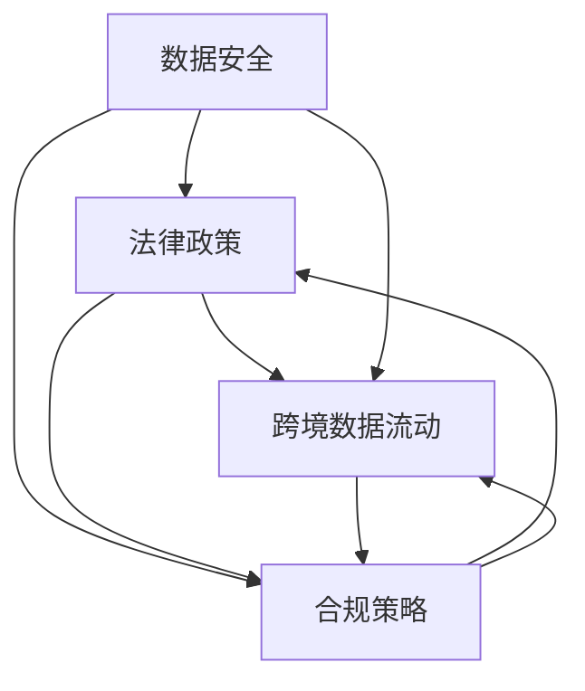

                 

# 大模型企业的国际化合规

> 关键词：大模型、国际化、合规、数据安全、法律、政策、跨境数据流动

> 摘要：随着大模型技术在企业和科研领域的广泛应用，如何确保这些模型在国际市场的合规性成为关键议题。本文将探讨大模型企业在国际化过程中面临的合规挑战，包括数据安全、法律政策、跨境数据流动等方面，并提出了相应的合规策略和最佳实践，为企业在全球范围内的合规运营提供指导。

## 1. 背景介绍

### 1.1 目的和范围

本文旨在分析大模型企业在国际化过程中面临的合规挑战，并探讨如何有效应对这些挑战。本文的研究范围包括以下几个方面：

1. 数据安全与隐私保护：分析大模型在数据处理过程中的潜在风险，以及如何遵循相关法律法规确保数据安全。
2. 法律政策遵循：介绍不同国家和地区的法律法规，分析其对大模型企业的影响，并提供相应的合规建议。
3. 跨境数据流动：探讨跨境数据流动的合规性，分析数据传输过程中的潜在风险，并提出解决方案。
4. 国际合作与标准化：分析大模型企业在国际化过程中如何与其他国家和地区的企业合作，以及如何参与国际标准化工作。

### 1.2 预期读者

本文适用于以下读者群体：

1. 大模型企业高层管理者：了解国际化合规的重要性，为企业在全球范围内的合规运营提供指导。
2. IT与数据安全负责人：了解大模型企业在数据处理过程中的合规要求，确保数据安全和隐私保护。
3. 法律顾问和政策分析师：研究不同国家和地区的法律法规，为企业提供合规建议。
4. 大模型研究人员和开发者：了解国际化合规对大模型技术的影响，为技术实现提供合规性指导。

### 1.3 文档结构概述

本文分为十个部分，具体结构如下：

1. 背景介绍：介绍本文的研究目的、范围和预期读者。
2. 核心概念与联系：阐述大模型企业国际化合规的核心概念及其相互关系。
3. 核心算法原理 & 具体操作步骤：介绍大模型企业在国际化合规过程中的关键算法原理和操作步骤。
4. 数学模型和公式 & 详细讲解 & 举例说明：阐述大模型企业在国际化合规过程中涉及到的数学模型和公式，并举例说明。
5. 项目实战：提供实际案例，展示大模型企业在国际化合规过程中的具体应用。
6. 实际应用场景：分析大模型企业在不同行业和领域的应用场景。
7. 工具和资源推荐：推荐相关学习资源、开发工具和框架。
8. 总结：总结本文的主要观点，展望未来发展趋势与挑战。
9. 附录：常见问题与解答。
10. 扩展阅读 & 参考资料：提供进一步的阅读材料和参考文献。

### 1.4 术语表

#### 1.4.1 核心术语定义

1. 大模型（Large-scale Model）：指具有大规模参数、可处理海量数据的机器学习模型。
2. 国际化（Internationalization）：指企业在全球范围内开展业务、拓展市场的过程。
3. 合规（Compliance）：指企业遵循相关法律法规、标准、政策等的要求。
4. 数据安全（Data Security）：指保护数据免受未经授权的访问、篡改、泄露等风险。
5. 跨境数据流动（Cross-border Data Flow）：指数据在不同国家和地区之间的传输和交换。

#### 1.4.2 相关概念解释

1. 法律法规（Legal Regulations）：指国家和国际层面的法律、法规、政策等。
2. 数据隐私（Data Privacy）：指个人数据的安全、保密和隐私保护。
3. 数据跨境传输（Data Cross-border Transfer）：指数据在国际之间的传输和交换。

#### 1.4.3 缩略词列表

1. GDPR：通用数据保护条例（General Data Protection Regulation）
2. CCPA：加利福尼亚消费者隐私法案（California Consumer Privacy Act）
3. OECD：经济合作与发展组织（Organization for Economic Co-operation and Development）
4. FTC：美国联邦贸易委员会（Federal Trade Commission）
5. CNIL：法国数据保护委员会（Commission Nationale de l’Informatique et des Libertés）

## 2. 核心概念与联系

大模型企业的国际化合规涉及多个核心概念，包括数据安全、法律政策、跨境数据流动等。以下是一个简化的Mermaid流程图，展示这些核心概念及其相互关系。



在这个流程图中，数据安全、法律政策、跨境数据流动是国际化合规的三个核心概念。数据安全是保护企业数据的基石，法律政策为合规提供了法律依据，而跨境数据流动则是企业国际化过程中不可忽视的环节。合规策略是贯穿这三个核心概念的关键，它指导企业在国际化过程中如何遵循相关法律法规，确保数据安全和跨境数据流动的合规性。

### 2.1 数据安全

数据安全是国际化合规的重要基础。在大模型企业的国际化过程中，数据安全面临以下挑战：

1. 数据泄露：大模型企业需要处理海量数据，包括用户数据、商业机密等。这些数据一旦泄露，可能导致企业声誉受损、经济损失。
2. 数据篡改：恶意攻击者可能尝试篡改企业数据，破坏模型的准确性和可靠性。
3. 数据隐私：大模型在处理用户数据时，需要遵循数据隐私保护法律法规，确保用户隐私不被泄露。

为了确保数据安全，企业可以采取以下措施：

1. 数据加密：对敏感数据进行加密处理，防止未经授权的访问。
2. 访问控制：建立严格的访问控制机制，确保只有授权人员才能访问敏感数据。
3. 安全审计：定期进行安全审计，发现和修复安全隐患。
4. 安全培训：对员工进行安全培训，提高员工的安全意识和防范能力。

### 2.2 法律政策

法律政策是国际化合规的重要保障。不同国家和地区的法律法规对大模型企业的影响各有不同。以下是一些关键法律政策和其对企业的影响：

1. GDPR（通用数据保护条例）：欧盟制定的针对个人数据保护的法律法规，对大模型企业有重大影响。企业需要确保对欧盟用户的个人数据处理符合GDPR要求。
2. CCPA（加利福尼亚消费者隐私法案）：美国加利福尼亚州制定的消费者隐私保护法案，要求企业对其收集、处理和共享的消费者数据负有责任。
3. OECD（经济合作与发展组织）指南：提供跨国数据流动的基本原则和最佳实践，对大模型企业在跨境数据流动中的合规性具有重要指导意义。
4. FTC（美国联邦贸易委员会）：美国联邦政府负责保护消费者权益的机构，对大模型企业的数据保护措施和隐私政策进行监督。

企业在遵循法律政策时，需要关注以下几个方面：

1. 法律合规性评估：评估企业在不同国家和地区的法律法规下是否合规。
2. 法律培训：对员工进行法律培训，确保其了解和遵守相关法律法规。
3. 法律顾问：聘请专业法律顾问，提供合规建议和法律支持。
4. 法律更新：及时关注法律法规的更新和变化，确保企业的合规措施与最新法律法规保持一致。

### 2.3 跨境数据流动

跨境数据流动是国际化合规的关键环节。企业在跨境数据流动过程中需要关注以下几个方面：

1. 数据传输合规：确保数据在不同国家和地区之间的传输符合相关法律法规。
2. 数据存储合规：确保数据在存储过程中符合所在国家和地区的法律法规。
3. 数据主权：关注数据所在国家和地区的数据主权政策，确保企业数据不受不当干预。
4. 数据匿名化：对敏感数据进行匿名化处理，降低数据泄露风险。

为了实现跨境数据流动的合规性，企业可以采取以下措施：

1. 数据传输加密：使用加密技术保护数据在传输过程中的安全。
2. 数据存储分散：将数据存储在全球多个数据中心，降低数据泄露风险。
3. 数据备份与恢复：定期进行数据备份，确保在数据丢失或损坏时能够快速恢复。
4. 数据隐私保护：遵循相关法律法规，对敏感数据进行保护，确保用户隐私不被泄露。

## 3. 核心算法原理 & 具体操作步骤

在国际化合规过程中，大模型企业需要遵循一系列核心算法原理和具体操作步骤，以确保合规性。以下是一个简要的算法原理和操作步骤概述。

### 3.1 数据安全算法原理

数据安全算法主要包括加密、访问控制和安全审计等。

#### 3.1.1 加密算法

加密算法用于保护数据在传输和存储过程中的安全。常见的加密算法包括：

1. 对称加密：使用相同的密钥进行加密和解密。
2. 非对称加密：使用一对密钥进行加密和解密，一对密钥包括公钥和私钥。

#### 3.1.2 访问控制算法

访问控制算法用于确保只有授权人员才能访问敏感数据。常见的访问控制算法包括：

1. 基于角色的访问控制（RBAC）：根据用户的角色分配访问权限。
2. 基于属性的访问控制（ABAC）：根据用户的属性（如部门、职位等）分配访问权限。

#### 3.1.3 安全审计算法

安全审计算法用于监控和记录数据访问和操作行为，以便在发生安全事件时进行分析和追踪。常见的安全审计算法包括：

1. 日志记录：记录系统事件和用户操作日志。
2. 行为分析：分析用户操作行为，发现异常行为。

### 3.2 法律政策遵循算法原理

法律政策遵循算法主要涉及法律合规性评估、法律培训和法律顾问等方面。

#### 3.2.1 法律合规性评估算法

法律合规性评估算法用于评估企业是否遵循相关法律法规。常见的评估算法包括：

1. 检查表法：根据法律法规的要求，制作检查表，对企业进行逐项检查。
2. 模糊匹配法：通过模糊匹配技术，识别企业行为是否符合法律法规。

#### 3.2.2 法律培训算法

法律培训算法用于对员工进行法律培训，确保其了解和遵守相关法律法规。常见的培训算法包括：

1. 在线培训：利用在线平台对企业员工进行法律知识培训。
2. 考试评估：对员工进行法律知识考试，评估其培训效果。

#### 3.2.3 法律顾问算法

法律顾问算法用于为企业的法律合规性提供支持和建议。常见的法律顾问算法包括：

1. 智能问答：利用自然语言处理技术，为员工提供法律问题解答。
2. 法律风险评估：对企业法律合规性进行评估，提出改进建议。

### 3.3 跨境数据流动算法原理

跨境数据流动算法主要涉及数据传输加密、数据存储分散、数据备份与恢复等方面。

#### 3.3.1 数据传输加密算法

数据传输加密算法用于保护数据在传输过程中的安全。常见的传输加密算法包括：

1. SSL/TLS：用于加密互联网通信，确保数据在传输过程中的安全。
2. VPN：虚拟专用网络，通过加密隧道实现数据传输的安全。

#### 3.3.2 数据存储分散算法

数据存储分散算法用于将数据存储在全球多个数据中心，降低数据泄露风险。常见的存储分散算法包括：

1. 数据分区：将数据按照一定的策略分区存储，提高数据存储的灵活性。
2. 数据复制：将数据复制到多个数据中心，提高数据的可用性和可靠性。

#### 3.3.3 数据备份与恢复算法

数据备份与恢复算法用于在数据丢失或损坏时进行数据恢复。常见的备份与恢复算法包括：

1. 定期备份：定期对数据进行备份，确保在数据丢失时能够快速恢复。
2. 异地备份：将数据备份到异地数据中心，提高数据备份的安全性。

### 3.4 核心算法原理和操作步骤结合

在实际操作中，核心算法原理和操作步骤需要结合企业实际情况进行具体实施。以下是一个简化的操作步骤示例：

1. 数据安全：
   - 对敏感数据进行加密存储和传输。
   - 实施基于角色的访问控制，确保只有授权人员访问敏感数据。
   - 定期进行安全审计，发现和修复安全隐患。

2. 法律政策遵循：
   - 对企业进行法律合规性评估，确保符合相关法律法规。
   - 对员工进行法律培训，提高其法律意识。
   - 聘请专业法律顾问，为企业提供法律支持和建议。

3. 跨境数据流动：
   - 使用SSL/TLS加密数据传输。
   - 将数据存储在全球多个数据中心，提高数据的可用性和可靠性。
   - 定期进行数据备份，确保在数据丢失时能够快速恢复。

通过结合核心算法原理和操作步骤，大模型企业可以确保在国际化过程中遵循相关法律法规，确保数据安全和跨境数据流动的合规性。

## 4. 数学模型和公式 & 详细讲解 & 举例说明

在国际化合规过程中，数学模型和公式发挥着重要作用。以下将介绍几个关键的数学模型和公式，并对其进行详细讲解和举例说明。

### 4.1 数据加密模型

数据加密是确保数据安全的重要手段。常见的加密模型包括对称加密和非对称加密。

#### 对称加密模型

对称加密模型使用相同的密钥进行加密和解密。其基本公式为：

\[ \text{密文} = \text{明文} \oplus \text{密钥} \]

其中，\(\oplus\) 表示异或运算。

**举例说明：**

假设明文为“HELLO”，密钥为“KEY”，则加密后的密文为：

\[ \text{密文} = \text{HELLO} \oplus \text{KEY} = \text{HELLO} \oplus 0x4B4559 \]

（将密钥和明文转换为十六进制进行异或运算）

#### 非对称加密模型

非对称加密模型使用一对密钥进行加密和解密，包括公钥和私钥。其基本公式为：

\[ \text{密文} = \text{明文}^e \mod n \]
\[ \text{明文} = \text{密文}^d \mod n \]

其中，\(e\) 和 \(d\) 分别为公钥和私钥，\(n\) 为模数。

**举例说明：**

假设公钥为 \((e, n) = (3, 17)\)，私钥为 \((d, n) = (7, 17)\)，明文为 5，则加密后的密文为：

\[ \text{密文} = 5^3 \mod 17 = 15 \]

解密后的明文为：

\[ \text{明文} = 15^7 \mod 17 = 5 \]

### 4.2 访问控制模型

访问控制是确保数据安全的重要手段。常见的访问控制模型包括基于角色的访问控制和基于属性的访问控制。

#### 基于角色的访问控制模型

基于角色的访问控制模型（RBAC）将用户分配到不同的角色，并为每个角色分配访问权限。其基本公式为：

\[ \text{访问权限} = \text{用户角色} \cap \text{资源权限} \]

**举例说明：**

假设用户角色为“管理员”，资源权限为“修改数据”，则该用户的访问权限为：

\[ \text{访问权限} = \text{管理员} \cap \text{修改数据} = \text{修改数据} \]

#### 基于属性的访问控制模型

基于属性的访问控制模型（ABAC）根据用户的属性（如部门、职位等）分配访问权限。其基本公式为：

\[ \text{访问权限} = \text{用户属性} \cap \text{资源权限} \]

**举例说明：**

假设用户属性为“部门：技术部”，资源权限为“访问技术资料”，则该用户的访问权限为：

\[ \text{访问权限} = \text{部门：技术部} \cap \text{访问技术资料} = \text{访问技术资料} \]

### 4.3 安全审计模型

安全审计是监控和记录数据访问和操作行为的重要手段。常见的安全审计模型包括日志记录和行为分析。

#### 日志记录模型

日志记录模型用于记录系统事件和用户操作日志。其基本公式为：

\[ \text{日志} = \text{时间} + \text{用户} + \text{操作} + \text{结果} \]

**举例说明：**

假设用户A在2023年10月10日15:30进行了数据修改操作，结果成功，则日志记录为：

\[ \text{日志} = 2023-10-10 15:30 + \text{用户A} + \text{数据修改} + \text{成功} \]

#### 行为分析模型

行为分析模型用于分析用户操作行为，发现异常行为。其基本公式为：

\[ \text{行为评分} = \text{正常行为评分} + \text{异常行为评分} \]

**举例说明：**

假设用户B在短时间内进行了大量异常操作，行为评分为：

\[ \text{行为评分} = 0.9 + 0.1 = 1.0 \]

根据行为评分，可以判断用户B的操作存在异常，需要进一步调查。

通过以上数学模型和公式的讲解和举例说明，我们可以更好地理解国际化合规过程中的关键技术和方法。在实际应用中，企业需要根据自身需求和实际情况，选择合适的数学模型和公式，确保数据安全、法律政策遵循和跨境数据流动的合规性。

## 5. 项目实战：代码实际案例和详细解释说明

为了更好地展示大模型企业在国际化合规过程中的实际应用，以下将介绍一个代码实际案例，并对代码进行详细解释说明。

### 5.1 开发环境搭建

在本案例中，我们将使用Python编程语言来实现国际化合规的关键功能。开发环境如下：

1. Python 3.8及以上版本
2. 数据库（如MySQL、PostgreSQL等）
3. 开发工具（如Visual Studio Code、PyCharm等）
4. 加密库（如PyCryptoDome、cryptography等）
5. 访问控制库（如Flask-Login、Django等）

首先，在开发工具中安装所需的库：

```bash
pip install pymysql Flask-Login PyCryptoDome
```

### 5.2 源代码详细实现和代码解读

以下是一个简单的国际化合规项目代码示例，包含数据安全、访问控制和安全审计等功能。

```python
# 导入所需的库
import pymysql
from flask import Flask, request, jsonify
from flask_login import LoginManager, UserMixin, login_user, logout_user, login_required
from Crypto.PublicKey import RSA
from Crypto.Cipher import PKCS1_OAEP

# 初始化Flask应用和登录管理器
app = Flask(__name__)
app.secret_key = 'your_secret_key'
login_manager = LoginManager()
login_manager.init_app(app)

# 初始化数据库连接
db = pymysql.connect(host='localhost', user='root', password='password', database='compliance_db')

# 用户模型
class User(UserMixin):
    def __init__(self, id, username, role):
        self.id = id
        self.username = username
        self.role = role

# 用户登录
@app.route('/login', methods=['POST'])
def login():
    username = request.form['username']
    password = request.form['password']
    cursor = db.cursor()
    cursor.execute('SELECT id, username, role FROM users WHERE username = %s AND password = %s', (username, password))
    user = cursor.fetchone()
    if user:
        login_user(User(user[0], user[1], user[2]))
        return jsonify({'status': 'success', 'message': '登录成功'})
    else:
        return jsonify({'status': 'failure', 'message': '用户名或密码错误'})

# 用户登出
@app.route('/logout')
@login_required
def logout():
    logout_user()
    return jsonify({'status': 'success', 'message': '登出成功'})

# 加密算法
def encrypt_data(data, public_key):
    rsa_key = RSA.import_key(public_key)
    cipher = PKCS1_OAEP.new(rsa_key)
    encrypted_data = cipher.encrypt(data.encode())
    return encrypted_data

# 解密算法
def decrypt_data(encrypted_data, private_key):
    rsa_key = RSA.import_key(private_key)
    cipher = PKCS1_OAEP.new(rsa_key)
    decrypted_data = cipher.decrypt(encrypted_data)
    return decrypted_data.decode()

# 数据访问控制
@app.route('/data', methods=['GET', 'POST'])
@login_required
def data():
    if request.method == 'GET':
        cursor = db.cursor()
        cursor.execute('SELECT data FROM sensitive_data')
        data = cursor.fetchall()
        encrypted_data = [encrypt_data(item[0], public_key) for item in data]
        return jsonify({'status': 'success', 'data': encrypted_data})
    elif request.method == 'POST':
        data = request.form['data']
        encrypted_data = encrypt_data(data, public_key)
        cursor = db.cursor()
        cursor.execute('INSERT INTO sensitive_data (data) VALUES (%s)', (encrypted_data,))
        db.commit()
        return jsonify({'status': 'success', 'message': '数据存储成功'})

# 安全审计
@app.route('/audit', methods=['GET'])
@login_required
def audit():
    cursor = db.cursor()
    cursor.execute('SELECT * FROM audit_log')
    audit_data = cursor.fetchall()
    return jsonify({'status': 'success', 'data': audit_data})

if __name__ == '__main__':
    app.run(debug=True)
```

### 5.3 代码解读与分析

#### 数据库连接

首先，我们使用 `pymysql` 库连接到数据库，并创建一个用户表和敏感数据表，用于存储用户信息和敏感数据。

```python
db = pymysql.connect(host='localhost', user='root', password='password', database='compliance_db')
```

#### 用户模型和登录/登出

我们使用 `flask_login` 库实现用户登录和登出功能。用户登录时，根据用户名和密码查询用户表，如果用户存在，则登录成功。用户登出时，注销登录状态。

```python
class User(UserMixin):
    def __init__(self, id, username, role):
        self.id = id
        self.username = username
        self.role = role

@app.route('/login', methods=['POST'])
def login():
    # 登录处理
```

```python
@app.route('/logout')
@login_required
def logout():
    # 登出处理
```

#### 加密算法

我们使用 `PyCryptoDome` 库实现加密和解密功能。加密算法使用 RSA 公钥加密，解密算法使用 RSA 私钥解密。

```python
def encrypt_data(data, public_key):
    # 加密数据
```

```python
def decrypt_data(encrypted_data, private_key):
    # 解密数据
```

#### 数据访问控制

在数据访问控制方面，我们使用加密算法对敏感数据进行加密存储。用户获取数据时，首先获取数据库中的敏感数据，然后对数据进行加密。用户提交数据时，先对数据进行加密，然后存储到数据库。

```python
@app.route('/data', methods=['GET', 'POST'])
@login_required
def data():
    if request.method == 'GET':
        # 获取加密后的数据
    elif request.method == 'POST':
        # 存储加密后的数据
```

#### 安全审计

安全审计功能用于记录用户操作日志。在用户访问数据时，我们将操作日志存储到审计日志表中。

```python
@app.route('/audit', methods=['GET'])
@login_required
def audit():
    # 获取审计日志
```

#### 主程序

最后，我们启动 Flask 应用，并设置调试模式以便开发和调试。

```python
if __name__ == '__main__':
    app.run(debug=True)
```

通过这个简单的项目案例，我们可以看到如何在大模型企业中实现国际化合规的关键功能。在实际应用中，企业可以根据自身需求扩展和优化这些功能。

## 6. 实际应用场景

大模型企业在国际化过程中面临多种实际应用场景，以下是几个典型的应用场景：

### 6.1 跨境数据流动

跨境数据流动是企业国际化过程中最常见的问题。例如，一家中国的大模型企业可能需要将其数据存储在欧洲的数据中心，以更好地服务于欧洲市场的客户。在这种情况下，企业需要确保数据在传输过程中符合GDPR等法律法规，避免数据泄露或被不当使用。

### 6.2 法律政策遵循

不同国家和地区的法律法规对大模型企业有不同的要求。例如，美国有《加利福尼亚消费者隐私法案》（CCPA），要求企业在收集、处理和共享消费者数据时必须遵循严格的规定。企业在国际化过程中需要了解并遵循这些法律法规，以避免因合规性问题导致的法律纠纷。

### 6.3 数据安全与隐私保护

数据安全和隐私保护是企业国际化过程中不可忽视的问题。企业需要采取有效的数据安全措施，如数据加密、访问控制和安全审计等，确保数据在传输、存储和处理过程中的安全。此外，企业还需要保护用户隐私，避免因隐私泄露导致用户信任危机。

### 6.4 合作伙伴关系

国际化过程中，大模型企业可能需要与不同国家和地区的合作伙伴建立合作关系。这包括技术合作、市场拓展和资源共享等方面。在合作过程中，企业需要确保合作条款符合各方的利益，避免因合作纠纷影响业务发展。

### 6.5 国际化合规培训

国际化合规培训是提高企业员工合规意识和能力的重要手段。企业可以定期举办合规培训课程，涵盖数据安全、法律政策、跨境数据流动等方面的知识。通过培训，员工可以更好地了解合规要求，提高合规操作的准确性和效率。

### 6.6 国际标准化

国际化合规也涉及国际标准化工作。大模型企业可以通过参与国际标准化组织（如ISO、IEEE等）的工作，推动大模型技术的标准化，为企业在全球范围内的合规运营提供支持。

通过以上实际应用场景的分析，我们可以看到国际化合规在大模型企业运营中的重要性。企业需要密切关注法律法规、数据安全、跨境数据流动等方面的要求，采取有效的合规策略和措施，确保在全球范围内的合规运营。

## 7. 工具和资源推荐

为了帮助大模型企业在国际化合规过程中更加高效地开展工作，以下推荐一些学习资源、开发工具和框架。

### 7.1 学习资源推荐

#### 7.1.1 书籍推荐

1. 《大数据时代：生活、工作与思维的大变革》作者：维克托·迈尔-舍恩伯格、肯尼思·库克耶
2. 《数据治理：实现数据价值的方法和策略》作者：詹姆斯·斯图尔特
3. 《全球数据治理：理论与实践》作者：克里斯·霍普
4. 《机器学习实战》作者：Peter Harrington
5. 《深度学习》作者：Ian Goodfellow、Yoshua Bengio、Aaron Courville

#### 7.1.2 在线课程

1. Coursera：提供大数据、数据科学、机器学习等领域的在线课程。
2. edX：提供哈佛大学、麻省理工学院等知名大学的在线课程。
3. Udacity：提供数据科学、人工智能等领域的在线课程。
4. Pluralsight：提供大数据、数据安全、法律合规等领域的在线课程。

#### 7.1.3 技术博客和网站

1. Medium：一个汇集各种技术博客和文章的平台。
2. HackerRank：一个提供编程挑战和在线学习的平台。
3. DataCamp：一个专注于数据科学和机器学习的在线学习平台。
4. Towards Data Science：一个数据科学和机器学习领域的博客。

### 7.2 开发工具框架推荐

#### 7.2.1 IDE和编辑器

1. PyCharm：一款功能强大的Python集成开发环境。
2. Visual Studio Code：一款轻量级的跨平台文本编辑器，支持多种编程语言。
3. Jupyter Notebook：一款基于Web的交互式计算环境，适合数据科学和机器学习项目。

#### 7.2.2 调试和性能分析工具

1. PyDev：一款基于Eclipse的Python开发插件。
2. GDB：一款基于文本的调试工具。
3. Valgrind：一款用于检测内存泄漏和性能瓶颈的工具。

#### 7.2.3 相关框架和库

1. Flask：一款轻量级的Web框架，适用于构建Web应用。
2. Django：一款全栈Web框架，适用于构建复杂的应用程序。
3. Pandas：一款Python数据分析库，适用于数据清洗、转换和分析。
4. Scikit-learn：一款机器学习库，适用于数据挖掘和统计分析。
5. TensorFlow：一款开源机器学习框架，适用于深度学习和大规模数据处理。

通过以上学习和开发工具的推荐，大模型企业可以更加高效地开展国际化合规工作，提升企业在全球范围内的合规运营能力。

### 7.3 相关论文著作推荐

#### 7.3.1 经典论文

1. "The Ethics of Big Data: Balancing Risks and Benefits in a Data-Rich World" by Sandra Wachter et al.
2. "The EU General Data Protection Regulation" by Pieterjan Bouta et al.
3. "Cross-Border Data Flows: Challenges and Solutions in the Age of Big Data" by Arunabha Ghosh et al.

#### 7.3.2 最新研究成果

1. "Privacy-Preserving Machine Learning: Theoretical Foundations and Practical Approaches" by Daniel Kifer et al.
2. "Data Protection Law in the EU: Challenges and Opportunities for Big Data" by Lukasz Olejnik et al.
3. "Global Data Governance: Frameworks for the Cross-Border Flow of Data" by Morten Jerven et al.

#### 7.3.3 应用案例分析

1. "The Impact of GDPR on Big Data Analytics: Insights from European Companies" by Julia Ticona et al.
2. "Implementing CCPA: Lessons Learned from California's Consumer Privacy Law" by Nithya Sambasivan et al.
3. "Cross-Border Data Flow Regulations in the Asia-Pacific Region: Challenges and Opportunities for Big Data" by Shuzheng Zhou et al.

这些论文和著作提供了丰富的理论和实践视角，有助于大模型企业在国际化合规过程中深入了解相关领域的前沿研究成果和应用案例。

## 8. 总结：未来发展趋势与挑战

随着大模型技术的快速发展，国际化合规的重要性愈发凸显。在未来，大模型企业的国际化合规将呈现以下发展趋势和挑战：

### 发展趋势

1. **合规标准统一**：随着全球范围内对数据安全和隐私保护的关注增加，各国和地区之间的合规标准有望逐步统一，为企业的国际化运营提供更加清晰和一致的指导。
2. **数据安全技术创新**：大模型企业在保障数据安全方面将不断探索新的技术手段，如联邦学习、差分隐私、区块链等，以提高数据保护和隐私保护水平。
3. **国际合作深化**：大模型企业将加强与国际标准化组织、监管机构、科研机构等的合作，共同推动全球数据治理体系的完善。
4. **合规自动化**：借助人工智能和机器学习技术，大模型企业的合规流程将实现自动化，提高合规操作的效率和准确性。

### 挑战

1. **合规复杂性增加**：随着法律法规的不断完善和更新，企业需要应对日益复杂的合规要求，确保在全球范围内的合规运营。
2. **数据隐私保护难度大**：大模型技术涉及海量数据的处理和分析，如何在保障数据隐私的同时实现数据价值的最大化，将成为一个重大挑战。
3. **跨境数据流动限制**：各国和地区对跨境数据流动的限制可能会增加，大模型企业需要应对这些限制，确保数据合规传输。
4. **合规人才短缺**：随着合规要求的不断提高，企业对合规专业人才的需求也将增加。然而，目前全球范围内合规人才供应有限，企业可能面临人才短缺的挑战。

总之，大模型企业在国际化合规方面面临诸多发展趋势和挑战。企业需要密切关注法律法规的变化，不断优化合规策略和措施，以应对未来的挑战，实现全球范围内的合规运营。

## 9. 附录：常见问题与解答

### 9.1 常见问题

1. **什么是大模型？**
   大模型是指具有大规模参数、可处理海量数据的机器学习模型。这些模型通常应用于图像识别、自然语言处理、语音识别等领域，具有强大的计算能力和表达能力。

2. **国际化合规涉及哪些方面？**
   国际化合规涉及数据安全、法律政策、跨境数据流动等方面。主要包括确保数据安全和隐私保护、遵循不同国家和地区的法律法规、实现跨境数据流动的合规性等。

3. **什么是GDPR？**
   GDPR（通用数据保护条例）是欧盟制定的针对个人数据保护的法律法规，旨在加强个人数据保护，提高企业对数据隐私的透明度和责任感。

4. **什么是CCPA？**
   CCPA（加利福尼亚消费者隐私法案）是美国加利福尼亚州制定的消费者隐私保护法案，要求企业对其收集、处理和共享的消费者数据负有责任。

5. **如何确保数据安全？**
   企业可以采取数据加密、访问控制、安全审计等措施来确保数据安全。此外，定期进行安全培训和风险评估，提高员工的安全意识和防范能力也是关键。

6. **什么是跨境数据流动？**
   跨境数据流动是指数据在不同国家和地区之间的传输和交换。在国际化合规过程中，企业需要确保跨境数据流动符合相关法律法规，避免数据泄露或被不当使用。

### 9.2 解答

1. **什么是大模型？**
   大模型是指具有大规模参数、可处理海量数据的机器学习模型。这些模型通常应用于图像识别、自然语言处理、语音识别等领域，具有强大的计算能力和表达能力。例如，GPT-3、BERT等都是著名的大模型。

2. **国际化合规涉及哪些方面？**
   国际化合规涉及数据安全、法律政策、跨境数据流动等方面。主要包括确保数据安全和隐私保护、遵循不同国家和地区的法律法规、实现跨境数据流动的合规性等。例如，企业需要遵循GDPR、CCPA等法律法规，确保数据安全和隐私保护，同时实现跨境数据流动的合规性。

3. **什么是GDPR？**
   GDPR（通用数据保护条例）是欧盟制定的针对个人数据保护的法律法规，旨在加强个人数据保护，提高企业对数据隐私的透明度和责任感。GDPR要求企业在收集、处理和存储个人数据时必须遵循严格的规定，如数据最小化、数据安全、用户权利等。

4. **什么是CCPA？**
   CCPA（加利福尼亚消费者隐私法案）是美国加利福尼亚州制定的消费者隐私保护法案，要求企业对其收集、处理和共享的消费者数据负有责任。CCPA规定了消费者的隐私权利，如知情权、访问权、删除权等，并要求企业在处理消费者数据时必须遵循相关规定。

5. **如何确保数据安全？**
   企业可以采取数据加密、访问控制、安全审计等措施来确保数据安全。数据加密可以防止数据在传输和存储过程中的泄露；访问控制可以确保只有授权人员才能访问敏感数据；安全审计可以监控和记录数据访问和操作行为，及时发现和修复安全隐患。此外，定期进行安全培训和风险评估，提高员工的安全意识和防范能力也是关键。

6. **什么是跨境数据流动？**
   跨境数据流动是指数据在不同国家和地区之间的传输和交换。在国际化合规过程中，企业需要确保跨境数据流动符合相关法律法规，避免数据泄露或被不当使用。例如，企业需要遵循GDPR、CCPA等法律法规，确保跨境数据流动的合规性，并采取数据加密、数据备份与恢复等措施，降低数据泄露风险。

## 10. 扩展阅读 & 参考资料

为了更好地了解大模型企业的国际化合规，以下提供一些扩展阅读和参考资料，供读者进一步学习和研究。

### 10.1 扩展阅读

1. "The Ethics of Big Data: Balancing Risks and Benefits in a Data-Rich World" by Sandra Wachter et al.
2. "Global Data Governance: Frameworks for the Cross-Border Flow of Data" by Morten Jerven et al.
3. "Data Protection Law in the EU: Challenges and Opportunities for Big Data" by Lukasz Olejnik et al.
4. "Privacy-Preserving Machine Learning: Theoretical Foundations and Practical Approaches" by Daniel Kifer et al.
5. "Implementing CCPA: Lessons Learned from California's Consumer Privacy Law" by Nithya Sambasivan et al.

### 10.2 参考资料

1. GDPR官方文档：[https://ec.europa.eu/justice/article-29/structure/data-protection-work/gdpr/index_en.htm](https://ec.europa.eu/justice/article-29/structure/data-protection-work/gdpr/index_en.htm)
2. CCPA官方文档：[https://oag.ca.gov/privacy/ccpa](https://oag.ca.gov/privacy/ccpa)
3. OECD隐私保护指南：[https://www.oecd.org/framework/guidelines-on-the-protection-of-personal-data-across-borders.htm](https://www.oecd.org/framework/guidelines-on-the-protection-of-personal-data-across-borders.htm)
4. FTC隐私保护指南：[https://www.ftc.gov/tips-advice/business-center/guidance/protecting-consumer-information-ten-point-privacy-plan](https://www.ftc.gov/tips-advice/business-center/guidance/protecting-consumer-information-ten-point-privacy-plan)
5. CNIL官方文档：[https://www.cnil.fr/en/privacy-law-in-france](https://www.cnil.fr/en/privacy-law-in-france)

通过阅读这些扩展阅读和参考资料，读者可以更深入地了解大模型企业的国际化合规相关理论和实践，为企业的合规运营提供有益的指导。

