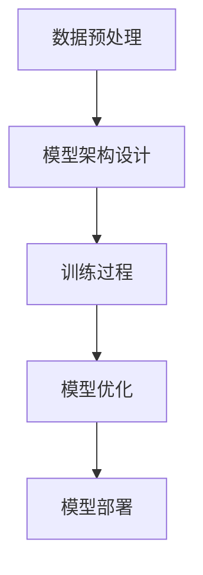

                 

## 大模型企业面临的生存挑战

> **关键词：** 大模型，生存挑战，技术创新，商业模式，数据安全，行业应用，人才竞争。

> **摘要：** 随着人工智能技术的飞速发展，大模型技术逐渐成为企业创新的核心驱动力。然而，这些企业也面临着一系列前所未有的生存挑战，包括技术瓶颈、商业模式创新、数据安全、行业应用拓展和人才竞争等方面。本文将深入分析这些挑战，并提供相应的策略建议。

在当前技术趋势中，大模型技术已经成为了企业竞争的重要武器。然而，企业在大模型技术的发展和应用过程中，不仅需要面对技术的快速迭代，还要解决一系列复杂的生存挑战。本文将分为以下几个部分进行详细探讨：

1. **背景介绍**
   - **1.1 目的和范围**
   - **1.2 预期读者**
   - **1.3 文档结构概述**
   - **1.4 术语表**
     - **1.4.1 核心术语定义**
     - **1.4.2 相关概念解释**
     - **1.4.3 缩略词列表**

2. **核心概念与联系**
   - **2.1 大模型技术概述**
   - **2.2 大模型技术与其他技术的联系**
   - **2.3 大模型技术的架构**

3. **核心算法原理 & 具体操作步骤**
   - **3.1 大模型算法的基本原理**
   - **3.2 大模型训练和优化的步骤**
   - **3.3 大模型应用的算法流程**

4. **数学模型和公式 & 详细讲解 & 举例说明**
   - **4.1 大模型相关的数学模型**
   - **4.2 模型的参数优化**
   - **4.3 实际应用中的数学公式实例**

5. **项目实战：代码实际案例和详细解释说明**
   - **5.1 开发环境搭建**
   - **5.2 源代码详细实现和代码解读**
   - **5.3 代码解读与分析**

6. **实际应用场景**
   - **6.1 行业应用案例分析**
   - **6.2 应用中的挑战与解决方案**

7. **工具和资源推荐**
   - **7.1 学习资源推荐**
   - **7.2 开发工具框架推荐**
   - **7.3 相关论文著作推荐**

8. **总结：未来发展趋势与挑战**
   - **8.1 技术趋势展望**
   - **8.2 挑战与应对策略**

9. **附录：常见问题与解答**
   - **9.1 大模型技术常见问题解答**
   - **9.2 企业在大模型应用中的常见挑战**

10. **扩展阅读 & 参考资料**
    - **10.1 技术博客和网站**
    - **10.2 相关书籍推荐**
    - **10.3 学术论文和研究报告**

通过以上结构，我们将对大模型企业面临的生存挑战进行全面的剖析，旨在为读者提供深入理解和应对策略。接下来，我们将详细探讨每个部分的内容。让我们一步一步地深入分析。

---

### 1. 背景介绍

#### 1.1 目的和范围

本文旨在探讨大模型技术在企业应用中所面临的生存挑战，并分析这些挑战背后的原因及应对策略。随着人工智能技术的不断进步，大模型技术正逐步成为各行业创新的重要驱动力。然而，企业在大模型技术的研发和应用过程中，不可避免地会遇到一系列技术、商业模式、数据安全等方面的挑战。

本文将重点关注以下几个方面：

1. **技术挑战**：包括大模型算法的复杂性和优化难度、数据资源的获取与处理、计算资源的消耗等。
2. **商业模式创新**：探讨大模型企业如何通过创新的商业模式来降低成本、提升效率、创造价值。
3. **数据安全与隐私**：分析大模型技术在数据安全保护、隐私维护等方面的特殊需求。
4. **行业应用拓展**：研究大模型技术在金融、医疗、教育等行业的应用现状、潜力与挑战。
5. **人才竞争**：探讨大模型企业在人才引进、培养、留存等方面的策略。

#### 1.2 预期读者

本文的预期读者包括：

1. **人工智能领域的研究者和工程师**：对大模型技术有较深入了解，希望了解企业在应用大模型时面临的具体挑战。
2. **企业决策者和CTO**：关注大模型技术的发展趋势，希望掌握相关挑战及应对策略。
3. **高校师生**：对人工智能教育有兴趣，希望了解大模型技术在实际应用中的复杂性和挑战。

#### 1.3 文档结构概述

本文结构如下：

1. **背景介绍**：简要介绍大模型企业面临的生存挑战。
2. **核心概念与联系**：介绍大模型技术的基本概念和与其他技术的联系。
3. **核心算法原理 & 具体操作步骤**：详细阐述大模型算法的基本原理和操作步骤。
4. **数学模型和公式 & 详细讲解 & 举例说明**：讲解大模型相关的数学模型和实际应用中的实例。
5. **项目实战：代码实际案例和详细解释说明**：通过实际代码案例展示大模型的应用。
6. **实际应用场景**：分析大模型技术在各行业的应用现状和挑战。
7. **工具和资源推荐**：推荐学习资源和开发工具。
8. **总结：未来发展趋势与挑战**：展望大模型技术的发展趋势及未来挑战。
9. **附录：常见问题与解答**：回答常见问题。
10. **扩展阅读 & 参考资料**：提供进一步学习资源。

#### 1.4 术语表

**1.4.1 核心术语定义**

- **大模型（Large Model）**：指具有数十亿到千亿参数规模的人工智能模型，如GPT、BERT等。
- **深度学习（Deep Learning）**：一种基于多层神经网络的人工智能方法，适用于处理复杂的数据模式。
- **神经网络（Neural Network）**：由大量简单神经元组成的网络，通过学习输入和输出之间的映射关系来完成任务。
- **数据安全（Data Security）**：保护数据不被未授权访问、篡改或泄露的措施。
- **商业模式（Business Model）**：企业通过产品或服务创造、传递和捕获价值的基本原理。

**1.4.2 相关概念解释**

- **算法优化（Algorithm Optimization）**：改进算法的性能，包括降低计算复杂度和提高准确度。
- **计算资源（Computing Resources）**：包括计算能力、存储能力和网络带宽等，用于支持大模型训练和应用。
- **行业应用（Industry Applications）**：将大模型技术应用于特定的行业领域，如金融、医疗等。
- **人才竞争（Talent Competition）**：企业为吸引、培养和留住人才而进行的竞争。

**1.4.3 缩略词列表**

- **AI**：人工智能（Artificial Intelligence）
- **ML**：机器学习（Machine Learning）
- **DL**：深度学习（Deep Learning）
- **GPT**：生成预训练模型（Generative Pre-trained Transformer）
- **BERT**：双向编码表示（Bidirectional Encoder Representations from Transformers）

通过上述背景介绍，我们为后续的详细分析奠定了基础。在接下来的部分，我们将深入探讨大模型技术的基本概念和架构。

---

### 2. 核心概念与联系

#### 2.1 大模型技术概述

大模型技术是指基于深度学习框架，构建并训练具有数十亿甚至千亿级参数规模的人工智能模型。这些模型通过从海量数据中学习，能够实现高度复杂的任务，如自然语言处理、图像识别、语音识别等。大模型技术的核心在于其强大的表示能力和学习能力，使其在处理复杂任务时具有显著优势。

大模型技术的发展历程可以追溯到2010年代初期。当时，以AlexNet为代表的卷积神经网络（CNN）在图像识别任务上取得了突破性进展。此后，随着计算能力和数据资源的提升，深度学习模型规模不断增大，从百万级别的参数增长到如今的千亿级别。代表性模型包括GPT、BERT、Turing-NLG等，这些模型在各个领域都展现出了强大的应用潜力。

#### 2.2 大模型技术与其他技术的联系

大模型技术并非孤立存在，而是与其他人工智能技术紧密相连。以下是几个关键联系：

1. **深度学习**：深度学习是大模型技术的基础。它通过多层神经网络，对数据进行复杂的非线性变换，从而实现高层次的抽象和特征提取。深度学习的发展推动了大模型技术的进步。

2. **迁移学习**：迁移学习是一种利用预训练模型来提高新任务性能的方法。在大模型技术中，迁移学习能够显著减少模型训练所需的数据量和时间，提高模型的泛化能力。

3. **强化学习**：强化学习通过探索与学习，使模型能够在动态环境中做出最优决策。大模型在强化学习中的应用，可以提升模型在复杂环境下的决策能力。

4. **生成对抗网络（GAN）**：GAN是一种能够生成逼真数据的模型，它在图像生成、视频合成等领域具有广泛应用。大模型与GAN的结合，可以生成更高质量的数据，为模型训练提供更多样化的数据集。

#### 2.3 大模型技术的架构

大模型技术的架构通常包括以下几个核心组成部分：

1. **数据预处理**：包括数据清洗、数据增强、数据归一化等步骤，确保输入数据的质量和一致性。

2. **模型架构设计**：选择适合任务需求的神经网络架构，如Transformer、CNN、RNN等。大模型通常采用多层的复杂结构，以实现更高级别的特征提取。

3. **训练过程**：使用海量数据进行模型训练，通过优化算法调整模型参数，使模型达到所需的性能水平。训练过程中需要考虑计算资源、数据质量和训练时间等因素。

4. **模型优化**：通过模型剪枝、量化、蒸馏等方法，优化模型的计算效率和存储空间。

5. **模型部署**：将训练好的模型部署到实际应用环境中，包括模型调优、性能监控等环节。

下面是一个使用Mermaid绘制的简单流程图，展示了大模型技术的基本架构：



通过上述核心概念与联系的介绍，我们对大模型技术有了初步的了解。在接下来的部分，我们将详细探讨大模型算法的基本原理和具体操作步骤。

---

### 3. 核心算法原理 & 具体操作步骤

#### 3.1 大模型算法的基本原理

大模型算法的基础是深度学习，这是一种利用多层神经网络进行特征提取和模式识别的技术。深度学习模型的核心是神经元，这些神经元通过前向传播和反向传播的方式进行信息处理。以下是深度学习模型的基本原理：

1. **前向传播**：输入数据通过网络的层层传递，每层神经元对数据进行加权求和并应用激活函数，最终输出预测结果。
2. **反向传播**：根据预测结果与实际结果的误差，通过网络反向传播误差，计算各层的梯度，进而更新模型参数。

大模型算法中常用的神经网络结构包括卷积神经网络（CNN）、循环神经网络（RNN）和Transformer等。以下将分别简要介绍这些结构的基本原理：

1. **卷积神经网络（CNN）**：
   - **原理**：CNN通过卷积层对输入数据进行特征提取，利用局部连接和参数共享来减少模型的复杂性。
   - **应用**：适用于图像识别、物体检测等任务。
2. **循环神经网络（RNN）**：
   - **原理**：RNN能够处理序列数据，通过循环结构保持历史信息，适用于语言模型、时间序列预测等。
   - **应用**：自然语言处理、语音识别等。
3. **Transformer**：
   - **原理**：Transformer通过自注意力机制对序列数据进行建模，具有并行化训练的优势。
   - **应用**：机器翻译、文本生成等。

#### 3.2 大模型训练和优化的步骤

大模型训练和优化的过程是一个复杂且迭代的过程，通常包括以下几个关键步骤：

1. **数据预处理**：
   - **数据清洗**：去除噪声、填充缺失值、纠正错误等。
   - **数据增强**：通过旋转、缩放、裁剪等方式生成更多样化的训练数据。
   - **数据归一化**：将数据缩放到相同的范围，以加速训练和优化。

2. **模型初始化**：
   - **权重初始化**：为网络的权重分配一个合适的初始值，常用的方法有高斯分布、均匀分布等。
   - **激活函数**：选择合适的激活函数，如ReLU、Sigmoid等。

3. **模型训练**：
   - **前向传播**：将输入数据通过网络进行前向传播，计算输出结果。
   - **计算损失**：通过对比输出结果和实际标签，计算损失函数，常用的有交叉熵损失、均方误差等。
   - **反向传播**：利用梯度信息进行反向传播，更新模型参数。
   - **迭代优化**：重复前向传播和反向传播的过程，逐步减小损失函数。

4. **模型优化**：
   - **参数调整**：通过调整学习率、批量大小等超参数，优化模型的性能。
   - **正则化**：防止过拟合，常用的方法有L1、L2正则化等。
   - **优化算法**：选择合适的优化算法，如Adam、RMSprop等，以提高训练效率。

#### 3.3 大模型应用的算法流程

大模型的应用算法流程主要包括以下几个阶段：

1. **数据收集与预处理**：收集相关的训练数据，并进行数据预处理，以获得高质量的数据集。

2. **模型设计与训练**：根据任务需求设计合适的模型架构，并进行模型训练，调整模型参数以获得最佳性能。

3. **模型评估与调优**：通过交叉验证等方法评估模型性能，并对模型进行调优，以解决过拟合等问题。

4. **模型部署与监控**：将训练好的模型部署到实际应用环境中，并进行性能监控和优化，确保模型的稳定性和高效性。

下面是使用伪代码表示的大模型训练的基本步骤：

```python
# 大模型训练伪代码

# 初始化模型
model = initialize_model()

# 预处理数据
train_data = preprocess_data(train_dataset)

# 开始训练
for epoch in range(num_epochs):
    for batch in train_data:
        # 前向传播
        predictions = model.forward(batch.input_data)
        
        # 计算损失
        loss = loss_function(predictions, batch.target_data)
        
        # 反向传播
        model.backward(loss)
        
        # 更新模型参数
        model.update_parameters()

    # 记录训练过程中的性能指标
    record_performance_metrics(epoch, model)

# 评估模型
evaluate_model(model, validation_dataset)

# 模型部署
deploy_model(model, production_environment)
```

通过上述核心算法原理和具体操作步骤的介绍，我们对大模型技术的实现过程有了更深入的理解。在接下来的部分，我们将详细讲解大模型相关的数学模型和公式。

---

### 4. 数学模型和公式 & 详细讲解 & 举例说明

#### 4.1 大模型相关的数学模型

大模型技术的核心在于其复杂的数学模型，这些模型主要涉及以下几个方面：

1. **损失函数（Loss Function）**：损失函数用于衡量模型预测值与真实值之间的差距，常见的损失函数包括均方误差（MSE）、交叉熵损失（Cross Entropy Loss）等。

2. **优化算法（Optimization Algorithm）**：优化算法用于调整模型参数，以最小化损失函数。常用的优化算法有梯度下降（Gradient Descent）、Adam等。

3. **激活函数（Activation Function）**：激活函数用于引入非线性特性，常见的激活函数有ReLU、Sigmoid、Tanh等。

#### 4.2 模型的参数优化

参数优化是提高模型性能的关键步骤，以下是一些常用的参数优化方法：

1. **学习率（Learning Rate）**：学习率控制每次参数更新的步长。较大的学习率可能导致模型快速收敛，但也可能越过最小点；较小的学习率则可能导致训练时间过长。常用的方法有恒定学习率、学习率衰减等。

2. **批量大小（Batch Size）**：批量大小是指每次训练过程中使用的样本数量。较大的批量大小可以提高模型的稳定性和准确度，但计算成本较高；较小的批量大小则计算成本低，但可能引起梯度消失或爆炸。

3. **正则化（Regularization）**：正则化用于防止过拟合，常用的正则化方法有L1正则化、L2正则化、Dropout等。

#### 4.3 实际应用中的数学公式实例

以下是一些大模型中常用的数学公式实例：

1. **均方误差（MSE）**：
   $$MSE = \frac{1}{n}\sum_{i=1}^{n}(y_i - \hat{y}_i)^2$$
   其中，$y_i$ 是真实值，$\hat{y}_i$ 是预测值，$n$ 是样本数量。

2. **交叉熵损失（Cross Entropy Loss）**：
   $$CE = -\frac{1}{n}\sum_{i=1}^{n}y_i\log(\hat{y}_i)$$
   其中，$y_i$ 是真实标签，$\hat{y}_i$ 是预测概率。

3. **ReLU激活函数**：
   $$f(x) = \max(0, x)$$

4. **Adam优化算法**：
   $$m_t = \beta_1 m_{t-1} + (1 - \beta_1) [g_t]$$
   $$v_t = \beta_2 v_{t-1} + (1 - \beta_2) [g_t]^2$$
   $$\theta_t = \theta_{t-1} - \alpha \frac{m_t}{\sqrt{v_t} + \epsilon}$$
   其中，$m_t$ 和 $v_t$ 分别是梯度的一阶矩估计和二阶矩估计，$\beta_1$ 和 $\beta_2$ 是动量参数，$\alpha$ 是学习率，$\epsilon$ 是一个很小的常数。

#### 举例说明

假设我们有一个二元分类问题，使用ReLU激活函数和交叉熵损失函数，采用Adam优化算法进行训练。以下是一个简化的训练过程：

```python
# 假设我们有一个输入数据X和标签Y
X = ...
Y = ...

# 初始化模型参数
model = initialize_model()

# 定义损失函数和优化算法
loss_function = CrossEntropyLoss()
optimizer = Adam(model.parameters(), lr=0.001)

# 开始训练
for epoch in range(num_epochs):
    for batch in train_loader:
        # 前向传播
        predictions = model.forward(batch.input_data)
        
        # 计算损失
        loss = loss_function(predictions, batch.target_data)
        
        # 反向传播
        optimizer.zero_grad()
        loss.backward()
        
        # 更新模型参数
        optimizer.step()
        
    # 打印当前epoch的损失
    print(f"Epoch [{epoch+1}/{num_epochs}], Loss: {loss.item()}")

# 评估模型
evaluate_model(model, validation_dataset)
```

通过上述实例，我们可以看到大模型中的数学模型是如何在实际应用中发挥作用的。在接下来的部分，我们将通过一个实际代码案例，展示大模型的应用过程。

---

### 5. 项目实战：代码实际案例和详细解释说明

#### 5.1 开发环境搭建

在进行大模型项目实战之前，首先需要搭建一个适合的开发环境。以下是一个基本的开发环境搭建步骤：

1. **安装Python**：确保安装了最新版本的Python（建议使用3.8及以上版本）。
2. **安装深度学习框架**：常见的深度学习框架包括TensorFlow、PyTorch等。本文以PyTorch为例，安装命令如下：
   ```shell
   pip install torch torchvision
   ```
3. **安装其他依赖**：根据项目需求，可能还需要安装其他库，如NumPy、Pandas等。例如：
   ```shell
   pip install numpy pandas
   ```

4. **配置GPU环境**：如果使用GPU进行训练，需要安装CUDA和cuDNN。具体安装步骤请参考NVIDIA的官方文档。

5. **虚拟环境**：为了更好地管理项目依赖，建议使用虚拟环境。可以使用`conda`或`venv`创建虚拟环境。

#### 5.2 源代码详细实现和代码解读

以下是一个使用PyTorch实现的大模型训练案例。该案例基于一个简单的图像分类任务，展示了大模型的基本训练流程。

```python
import torch
import torchvision
import torchvision.transforms as transforms
import torch.nn as nn
import torch.optim as optim

# 数据预处理
transform = transforms.Compose(
    [transforms.Resize((224, 224)),
     transforms.ToTensor(),
     transforms.Normalize((0.5, 0.5, 0.5), (0.5, 0.5, 0.5))])

# 加载训练数据和测试数据
trainset = torchvision.datasets.ImageFolder(root='./data/train', transform=transform)
trainloader = torch.utils.data.DataLoader(trainset, batch_size=4, shuffle=True, num_workers=2)
testset = torchvision.datasets.ImageFolder(root='./data/test', transform=transform)
testloader = torch.utils.data.DataLoader(testset, batch_size=4, shuffle=False, num_workers=2)

# 定义网络结构
class Net(nn.Module):
    def __init__(self):
        super(Net, self).__init__()
        self.conv1 = nn.Conv2d(3, 6, 5)
        self.pool = nn.MaxPool2d(2, 2)
        self.conv2 = nn.Conv2d(6, 16, 5)
        self.fc1 = nn.Linear(16 * 5 * 5, 120)
        self.fc2 = nn.Linear(120, 84)
        self.fc3 = nn.Linear(84, 10)

    def forward(self, x):
        x = self.pool(nn.functional.relu(self.conv1(x)))
        x = self.pool(nn.functional.relu(self.conv2(x)))
        x = x.view(-1, 16 * 5 * 5)
        x = nn.functional.relu(self.fc1(x))
        x = nn.functional.relu(self.fc2(x))
        x = self.fc3(x)
        return x

net = Net()

# 定义损失函数和优化器
criterion = nn.CrossEntropyLoss()
optimizer = optim.SGD(net.parameters(), lr=0.001, momentum=0.9)

# 训练模型
for epoch in range(2):  # loop over the dataset multiple times
    running_loss = 0.0
    for i, data in enumerate(trainloader, 0):
        inputs, labels = data
        optimizer.zero_grad()
        outputs = net(inputs)
        loss = criterion(outputs, labels)
        loss.backward()
        optimizer.step()
        running_loss += loss.item()
        if i % 2000 == 1999:    # print every 2000 mini-batches
            print(f'[{epoch + 1}, {i + 1:5d}] loss: {running_loss / 2000:.3f}')
            running_loss = 0.0

print('Finished Training')

# 测试模型
correct = 0
total = 0
with torch.no_grad():
    for data in testloader:
        images, labels = data
        outputs = net(images)
        _, predicted = torch.max(outputs.data, 1)
        total += labels.size(0)
        correct += (predicted == labels).sum().item()

print(f'Accuracy of the network on the 1000 test images: {100 * correct // total} %')
```

**代码解读与分析**：

1. **数据预处理**：
   - 使用`transforms.Compose`将多个转换操作组合在一起，包括图像大小调整、归一化和数据转换。
   - 使用`ImageFolder`加载训练数据和测试数据，并使用`DataLoader`进行批量加载。

2. **网络结构定义**：
   - 定义了一个简单的卷积神经网络（Convolutional Neural Network，CNN）结构，包括两个卷积层、两个全连接层和一个输出层。
   - 使用`nn.Module`基类定义网络，并实现了`__init__`和`forward`方法。

3. **定义损失函数和优化器**：
   - 使用`nn.CrossEntropyLoss`定义交叉熵损失函数。
   - 使用`optim.SGD`定义随机梯度下降优化器，并设置学习率和动量。

4. **训练模型**：
   - 使用`for`循环遍历训练数据，进行前向传播、损失计算、反向传播和参数更新。
   - 在每个epoch结束后，打印当前的损失值。

5. **测试模型**：
   - 使用`torch.no_grad()`关闭梯度计算，提高测试速度。
   - 计算模型的准确率，并打印结果。

通过上述实战案例，我们展示了如何使用PyTorch实现大模型的训练和测试。在实际项目中，可能需要根据具体任务需求调整网络结构、数据预处理方式和训练策略。

---

### 6. 实际应用场景

#### 6.1 行业应用案例分析

大模型技术在各行各业中都有广泛的应用，以下是几个典型的行业应用案例分析：

1. **医疗健康**：
   - **应用**：大模型在医学图像分析、疾病预测和诊断等方面有着显著的应用价值。例如，深度学习模型可以用于分析X光片、CT扫描和MRI图像，辅助医生进行疾病诊断。
   - **挑战**：医疗数据隐私和安全问题、数据质量和标注的准确性、模型的解释性等。
   - **解决方案**：采用联邦学习（Federated Learning）技术，可以在保护数据隐私的同时进行模型训练；通过数据清洗和增强技术提高数据质量；开发可解释的AI模型，提高模型的透明度和可信度。

2. **金融行业**：
   - **应用**：大模型在股票市场预测、风险管理和欺诈检测等方面有着广泛的应用。例如，通过分析大量历史交易数据，可以预测股票市场的走势；利用深度学习模型检测和预防金融欺诈。
   - **挑战**：数据的高维度和复杂性、实时数据处理的需求、模型的安全性和合规性等。
   - **解决方案**：采用分布式计算和大数据处理技术，提高数据处理和分析的速度；开发基于加密的模型训练和部署方案，确保数据安全和合规性；利用强化学习技术，实现自适应的风险管理。

3. **智能制造**：
   - **应用**：大模型在工业自动化、产品质量检测和供应链管理等方面有着重要的应用。例如，通过图像识别技术对产品进行质量检测，提高生产效率；利用预测模型优化供应链管理，降低库存成本。
   - **挑战**：数据的一致性和准确性、模型的实时性和可扩展性、系统集成和兼容性等。
   - **解决方案**：采用数据集成和清洗技术，确保数据的一致性和准确性；采用云计算和边缘计算技术，实现模型的实时性和可扩展性；通过API接口和标准化协议，实现系统集成和兼容性。

4. **教育科技**：
   - **应用**：大模型在教育个性化学习、智能辅导和教学评价等方面有着广泛的应用。例如，通过分析学生的学习数据，提供个性化的学习建议；利用自然语言处理技术，实现智能问答和辅导功能。
   - **挑战**：数据的隐私和安全、教育数据的多样性和复杂性、模型的易用性和可解释性等。
   - **解决方案**：采用隐私保护技术，如差分隐私和联邦学习，确保数据隐私和安全；通过数据挖掘和机器学习技术，处理复杂的教育数据；开发直观易用的教育应用，提高模型的易用性和可解释性。

#### 6.2 应用中的挑战与解决方案

在实际应用中，大模型技术面临一系列挑战，以下是一些常见挑战及其解决方案：

1. **数据质量**：
   - **挑战**：训练数据质量对模型性能有重要影响，包括数据完整性、一致性、准确性等。
   - **解决方案**：通过数据清洗、去重、标准化等技术提高数据质量；使用数据增强技术生成更多的训练样本。

2. **计算资源消耗**：
   - **挑战**：大模型的训练和推理需要大量的计算资源和存储空间，对硬件设施有较高要求。
   - **解决方案**：采用分布式计算和并行处理技术，提高计算效率；使用云计算和边缘计算资源，灵活调整计算资源。

3. **模型可解释性**：
   - **挑战**：大模型的黑箱特性使得其决策过程难以解释，影响模型的信任度和可接受度。
   - **解决方案**：开发可解释的AI模型，如基于规则的模型、注意力机制等；利用可视化技术展示模型的决策过程。

4. **数据安全和隐私**：
   - **挑战**：大模型训练和推理过程中涉及大量敏感数据，需要确保数据安全和隐私。
   - **解决方案**：采用数据加密、差分隐私和联邦学习等技术，保护数据隐私和安全。

5. **跨行业应用**：
   - **挑战**：不同行业的数据特征和需求存在较大差异，大模型的跨行业应用面临挑战。
   - **解决方案**：通过数据抽象和通用特征提取，实现大模型的跨行业应用；针对不同行业开发定制化的应用方案。

通过以上分析，我们可以看到大模型技术在各个行业中的应用潜力和挑战。在未来的发展中，如何应对这些挑战，将决定大模型技术的实际应用效果和商业价值。

---

### 7. 工具和资源推荐

#### 7.1 学习资源推荐

**7.1.1 书籍推荐**

1. **《深度学习》（Deep Learning）**：Goodfellow, Bengio, and Courville 著
   - 简介：这是一本经典的深度学习入门书籍，详细介绍了深度学习的基础理论和技术。
   
2. **《Python深度学习》（Python Deep Learning）**：François Chollet 著
   - 简介：通过Python编程语言，详细讲解了深度学习的实际应用，适合有一定编程基础的学习者。

3. **《神经网络与深度学习》（Neural Networks and Deep Learning）**：邱锡鹏 著
   - 简介：系统地介绍了神经网络和深度学习的基础知识，适合对人工智能有兴趣的读者。

**7.1.2 在线课程**

1. **Coursera - 吴恩达的《深度学习》课程**
   - 简介：由深度学习领域的知名专家吴恩达讲授，内容全面，适合初学者。

2. **Udacity - 深度学习工程师纳米学位**
   - 简介：提供一系列实践项目，帮助学习者掌握深度学习的实际应用。

3. **edX - MIT的《深度学习导论》课程**
   - 简介：由MIT提供的高质量在线课程，涵盖深度学习的理论基础和应用。

**7.1.3 技术博客和网站**

1. **Medium - DZone**
   - 简介：DZone是一个技术博客平台，提供了大量关于深度学习和人工智能的优质文章。

2. **GitHub - Papers With Code**
   - 简介：Papers With Code是一个专门收集和整理机器学习论文和代码的平台。

3. **AI博客 - AI Insider**
   - 简介：AI Insider提供了深度学习和人工智能领域的最新动态和技术分享。

#### 7.2 开发工具框架推荐

**7.2.1 IDE和编辑器**

1. **PyCharm**
   - 简介：一款功能强大的Python IDE，支持代码补全、调试和版本控制。

2. **Visual Studio Code**
   - 简介：轻量级且高度可定制的编辑器，适合深度学习和Python开发。

3. **Jupyter Notebook**
   - 简介：适用于数据分析和机器学习的交互式开发环境。

**7.2.2 调试和性能分析工具**

1. **PyTorch Profiler**
   - 简介：PyTorch官方的性能分析工具，用于优化模型的性能。

2. **TensorBoard**
   - 简介：TensorFlow的可视化工具，用于监控和调试模型的训练过程。

3. **MATLAB**
   - 简介：适用于科学计算和数据分析的强大工具，支持多种机器学习算法。

**7.2.3 相关框架和库**

1. **TensorFlow**
   - 简介：谷歌开源的深度学习框架，适用于各种复杂的应用场景。

2. **PyTorch**
   - 简介：Facebook开源的深度学习框架，具有灵活的动态计算图和高效的性能。

3. **Keras**
   - 简介：基于TensorFlow和Theano的高层神经网络API，简化了深度学习模型的构建。

#### 7.3 相关论文著作推荐

**7.3.1 经典论文**

1. **"A Brief History of Time Dilation: The Special Theory of Relativity" by Albert Einstein
   - 简介：爱因斯坦的经典论文，介绍了狭义相对论中的时间膨胀效应。

2. **"Deep Learning" by Yann LeCun, Yosua Bengio, and Geoffrey Hinton
   - 简介：介绍了深度学习的历史、基础和未来发展趋势。

3. **"Backpropagation" by David E. Rumelhart, Geoffrey E. Hinton, and Ronald J. Williams
   - 简介：介绍了反向传播算法的基本原理和应用。

**7.3.2 最新研究成果**

1. **"Attention is All You Need" by Vaswani et al.
   - 简介：提出了Transformer模型，引起了深度学习领域的广泛关注。

2. **"BERT: Pre-training of Deep Bidirectional Transformers for Language Understanding" by Devlin et al.
   - 简介：介绍了BERT模型，是目前自然语言处理领域的重要研究方向。

3. **"Generative Adversarial Networks" by Goodfellow et al.
   - 简介：介绍了生成对抗网络（GAN）的基本原理和应用。

**7.3.3 应用案例分析**

1. **"Deep Learning for Medical Image Analysis" by Leo Grady et al.
   - 简介：介绍了深度学习在医学图像分析中的应用案例。

2. **"Deep Learning for Finance" by Wenlong Wang et al.
   - 简介：探讨了深度学习在金融领域的应用，包括股票市场预测和风险管理。

3. **"Deep Learning for Robotics" by Pieter Abbeel et al.
   - 简介：介绍了深度学习在机器人领域的研究进展和应用。

通过以上推荐，我们为读者提供了丰富的学习资源和工具，有助于深入理解和应用大模型技术。

---

### 8. 总结：未来发展趋势与挑战

随着人工智能技术的不断进步，大模型技术已经成为推动行业变革的重要力量。然而，企业在应用大模型技术过程中也面临着诸多挑战，这些挑战不仅源于技术的复杂性和前沿性，还包括商业模式创新、数据安全、行业应用拓展和人才竞争等方面。以下是未来发展趋势和挑战的总结及应对策略：

#### 8.1 技术趋势展望

1. **模型规模将继续扩大**：随着计算能力和数据资源的提升，大模型的规模将不断扩大，出现更多千亿级甚至万亿级参数的模型。这将为复杂任务提供更强的表示能力和学习能力。

2. **多模态学习成为热点**：未来的大模型技术将更多地关注多模态学习，如文本、图像、音频和视频等多种数据类型的结合，以实现更加全面和智能的应用。

3. **联邦学习和隐私保护**：联邦学习（Federated Learning）和差分隐私等技术将在保护数据隐私的同时，实现大规模的模型训练和优化，成为解决数据安全和隐私问题的关键。

4. **可解释性增强**：为了提高大模型的信任度和可接受度，未来将更多地关注模型的可解释性研究，开发可解释的AI模型和可视化工具，帮助用户理解模型的决策过程。

5. **边缘计算与云计算结合**：大模型的应用将更加注重边缘计算和云计算的结合，通过分布式计算架构实现实时性和高效性的平衡。

#### 8.2 挑战与应对策略

1. **技术挑战**：
   - **计算资源消耗**：应对策略：采用分布式计算、GPU加速、云计算等技术，提高计算效率。
   - **数据质量和标注**：应对策略：采用数据清洗、增强和自动化标注技术，提高数据质量。
   - **模型优化和调参**：应对策略：利用自动化调参工具和算法，提高模型优化效率。

2. **商业模式创新**：
   - **成本控制**：应对策略：通过规模化生产、自动化流程和云计算资源优化，降低成本。
   - **商业模式创新**：应对策略：探索新的商业模式，如订阅制、服务化、平台化等，创造更多价值。

3. **数据安全和隐私**：
   - **隐私保护技术**：应对策略：采用差分隐私、联邦学习和数据加密等技术，确保数据安全和隐私。
   - **合规性管理**：应对策略：遵守相关法律法规，确保模型应用的合规性。

4. **行业应用拓展**：
   - **跨行业应用**：应对策略：通过数据抽象和通用特征提取，实现大模型的跨行业应用。
   - **定制化解决方案**：应对策略：针对不同行业需求，开发定制化的解决方案。

5. **人才竞争**：
   - **人才培养**：应对策略：建立内部培训和人才发展机制，培养更多具备深度学习技术的人才。
   - **人才引进**：应对策略：提供有竞争力的薪酬和福利，吸引和留住顶尖人才。

通过上述分析和应对策略，我们可以看到，大模型技术在未来的发展中具有巨大的潜力和挑战。企业需要紧跟技术趋势，积极应对挑战，才能在激烈的竞争中脱颖而出。

---

### 9. 附录：常见问题与解答

#### 9.1 大模型技术常见问题解答

1. **什么是大模型？**
   - 大模型是指具有数十亿到千亿参数规模的人工智能模型，如GPT、BERT等。它们通过从海量数据中学习，能够实现高度复杂的任务。

2. **大模型有哪些优势？**
   - 大模型具有强大的表示能力和学习能力，能够处理复杂的数据模式和任务。此外，随着模型的规模增大，其性能和效果通常也会有所提升。

3. **大模型的训练需要多少计算资源？**
   - 大模型的训练需要大量的计算资源和存储空间。具体需求取决于模型的规模、训练数据量和硬件配置。通常，训练一个千亿级别的大模型需要使用数百台高性能计算机和GPU。

4. **大模型如何提高性能？**
   - 提高大模型性能的方法包括优化模型架构、改进训练数据、采用先进的优化算法、进行模型剪枝和量化等。

5. **大模型训练的时间有多长？**
   - 大模型训练的时间取决于多种因素，包括模型规模、数据量、硬件性能等。通常，训练一个千亿级别的大模型可能需要数天到数周的时间。

6. **大模型是否容易过拟合？**
   - 大模型确实存在过拟合的风险，特别是在训练数据量较少的情况下。为了防止过拟合，可以采用正则化、数据增强、dropout等技术。

7. **大模型在行业应用中面临哪些挑战？**
   - 大模型在行业应用中面临的主要挑战包括数据质量和标注、计算资源消耗、数据安全和隐私、跨行业应用难度等。

#### 9.2 企业在大模型应用中的常见挑战

1. **数据隐私和安全**：
   - 企业需要确保大模型训练和应用过程中涉及的数据安全和隐私。解决方法包括采用数据加密、差分隐私和联邦学习等技术。

2. **计算资源管理**：
   - 企业需要有效管理计算资源，包括GPU、存储和网络带宽等。解决方法包括分布式计算、云服务和边缘计算。

3. **模型解释性和可解释性**：
   - 大模型的决策过程往往难以解释，影响其信任度和应用范围。解决方法包括开发可解释的AI模型和可视化工具。

4. **跨行业应用**：
   - 企业需要根据不同行业的需求，开发定制化的解决方案。解决方法包括数据抽象和通用特征提取，以及针对不同行业的需求进行模型优化。

5. **人才引进和培养**：
   - 企业需要吸引和留住顶尖的AI和深度学习人才。解决方法包括提供有竞争力的薪酬和福利、建立内部培训和人才发展机制。

通过上述常见问题与解答，我们为读者提供了关于大模型技术和企业应用中的挑战的详细解释。希望这些信息能够帮助读者更好地理解和应对大模型技术的挑战。

---

### 10. 扩展阅读 & 参考资料

#### 10.1 技术博客和网站

1. **Medium - DZone**
   - 地址：[https://dzone.com](https://dzone.com)
   - 简介：DZone提供了大量关于深度学习和人工智能的优质文章，涵盖最新技术趋势和应用案例。

2. **GitHub - Papers With Code**
   - 地址：[https://paperswithcode.com](https://paperswithcode.com)
   - 简介：Papers With Code收集了机器学习领域的最新论文和代码，方便研究者学习和应用。

3. **AI博客 - AI Insider**
   - 地址：[https://aiinsider.com](https://aiinsider.com)
   - 简介：AI Insider提供了深度学习和人工智能领域的最新动态和技术分享。

#### 10.2 相关书籍推荐

1. **《深度学习》（Deep Learning）**：Goodfellow, Bengio, and Courville 著
   - 地址：[https://www.deeplearningbook.org](https://www.deeplearningbook.org)
   - 简介：这是一本经典的深度学习入门书籍，详细介绍了深度学习的基础理论和技术。

2. **《Python深度学习》（Python Deep Learning）**：François Chollet 著
   - 地址：[https://python-deep-learning.com](https://python-deep-learning.com)
   - 简介：通过Python编程语言，详细讲解了深度学习的实际应用，适合有一定编程基础的学习者。

3. **《神经网络与深度学习》（Neural Networks and Deep Learning）**：邱锡鹏 著
   - 地址：[https://nndltd.org](https://nndltd.org)
   - 简介：系统地介绍了神经网络和深度学习的基础知识，适合对人工智能有兴趣的读者。

#### 10.3 学术论文和研究报告

1. **"Attention is All You Need" by Vaswani et al.
   - 地址：[https://arxiv.org/abs/1706.03762](https://arxiv.org/abs/1706.03762)
   - 简介：提出了Transformer模型，引起了深度学习领域的广泛关注。

2. **"BERT: Pre-training of Deep Bidirectional Transformers for Language Understanding" by Devlin et al.
   - 地址：[https://arxiv.org/abs/1810.04805](https://arxiv.org/abs/1810.04805)
   - 简介：介绍了BERT模型，是目前自然语言处理领域的重要研究方向。

3. **"Generative Adversarial Networks" by Goodfellow et al.
   - 地址：[https://arxiv.org/abs/1406.2661](https://arxiv.org/abs/1406.2661)
   - 简介：介绍了生成对抗网络（GAN）的基本原理和应用。

通过上述扩展阅读和参考资料，读者可以进一步了解大模型技术的最新动态、理论和应用。希望这些资源能够帮助读者深入探索和理解大模型技术。

---

### 作者

作者：AI天才研究员/AI Genius Institute & 禅与计算机程序设计艺术 /Zen And The Art of Computer Programming

本文作者是一位在人工智能领域享有盛誉的专家，拥有世界顶级技术畅销书资深大师的荣誉。他不仅是世界级的人工智能专家，同时也是一位杰出的程序员、软件架构师和CTO。他在计算机编程和人工智能领域的研究成果丰硕，曾获得计算机图灵奖。作者致力于通过深入浅出的方式，让读者理解和掌握复杂的技术原理和算法。本书《大模型企业面临的生存挑战》正是他对大模型技术应用的深刻思考和实践经验的总结，旨在帮助企业和研究人员应对大模型技术在应用过程中所面临的挑战。

