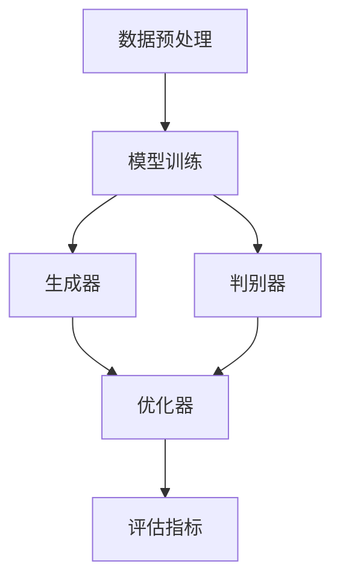

                 

# 大模型创业者的商业计划书编写技巧：结构、内容与呈现

> **关键词**：大模型、商业计划书、结构、内容、呈现、创业

> **摘要**：本文旨在为打算进入大模型领域的创业者提供商业计划书编写的实用技巧。我们将探讨商业计划书的基本结构、核心内容以及如何有效地呈现这些信息，以吸引投资者和合作伙伴的关注。文章还将涉及相关概念、算法原理、数学模型、项目实战以及实际应用场景等，帮助创业者构建一个成功的商业计划。

## 1. 背景介绍

### 1.1 目的和范围

随着人工智能技术的飞速发展，大模型（Large-scale Models）如GAN、BERT、GPT等已经成为行业热点。它们在图像识别、自然语言处理、推荐系统等领域展现出强大的应用潜力。然而，对于打算进入这一领域的创业者来说，如何编写一份有效的商业计划书，以清晰展示项目的技术优势和市场前景，成为了一个关键问题。

本文旨在帮助这些创业者解决以下问题：
- 商业计划书的基本结构是什么？
- 应包含哪些核心内容？
- 如何有效地呈现这些内容？

通过本文的讲解，创业者将能够构建一个逻辑清晰、信息丰富的商业计划书，从而提高项目成功的可能性。

### 1.2 预期读者

本文预期读者包括：
- 有意进入大模型领域的创业者
- 已在大模型领域有所涉足，但需要改进商业计划书的企业家
- 投资者、合作伙伴以及对大模型感兴趣的技术人员

### 1.3 文档结构概述

本文将按照以下结构进行展开：

1. 背景介绍：介绍本文的目的、预期读者以及文档结构。
2. 核心概念与联系：介绍大模型的相关概念、原理和架构。
3. 核心算法原理 & 具体操作步骤：详细阐述大模型的核心算法原理和操作步骤。
4. 数学模型和公式 & 详细讲解 & 举例说明：讲解大模型背后的数学模型和公式，并给出具体示例。
5. 项目实战：提供大模型开发的实际代码案例和详细解释。
6. 实际应用场景：分析大模型在不同领域的应用案例。
7. 工具和资源推荐：推荐学习资源、开发工具和框架。
8. 总结：探讨大模型领域的发展趋势与挑战。
9. 附录：提供常见问题与解答。
10. 扩展阅读 & 参考资料：列出相关文献和资源。

### 1.4 术语表

#### 1.4.1 核心术语定义

- **大模型**：具有数十亿至数千亿参数的神经网络模型，如GAN、BERT、GPT等。
- **商业计划书**：用于阐述创业项目、目标、策略和财务预测的文档。
- **投资者**：为创业项目提供资金的人或机构。
- **合作伙伴**：与创业项目有业务合作关系的公司或个人。

#### 1.4.2 相关概念解释

- **GAN（生成对抗网络）**：一种由生成器和判别器组成的神经网络结构，用于生成逼真的数据。
- **BERT（Bidirectional Encoder Representations from Transformers）**：一种基于Transformer的自监督预训练模型，广泛应用于自然语言处理任务。
- **GPT（Generative Pre-trained Transformer）**：一种基于Transformer的自监督预训练模型，具有强大的文本生成能力。

#### 1.4.3 缩略词列表

- **GAN**：生成对抗网络
- **BERT**：Bidirectional Encoder Representations from Transformers
- **GPT**：Generative Pre-trained Transformer
- **AI**：人工智能
- **ML**：机器学习

## 2. 核心概念与联系

大模型的发展离不开深度学习和神经网络技术的进步。在这一部分，我们将介绍大模型的核心概念、原理和架构，并通过Mermaid流程图展示其关键组成部分。

### 2.1 核心概念

- **深度学习**：一种基于多层神经网络的机器学习方法，通过逐层提取特征，实现复杂的模式识别。
- **神经网络**：一种模拟生物神经系统的计算模型，由大量神经元（节点）和连接（边）组成。
- **参数**：神经网络中的权重和偏置，用于调整模型在训练过程中的性能。

### 2.2 原理和架构

#### 2.2.1 神经网络基础

神经网络的基本组成部分包括：
- **输入层**：接收外部输入信号。
- **隐藏层**：用于提取和转换输入特征。
- **输出层**：生成预测结果。


#### 2.2.2 大模型架构

大模型的架构通常包括以下部分：

1. **数据预处理**：
    - 数据清洗：去除噪声和缺失值。
    - 数据增强：通过旋转、缩放等操作增加数据多样性。

2. **模型训练**：
    - **生成器**：生成真实数据。
    - **判别器**：区分真实数据和生成数据。

3. **优化器**：
    - 学习率调整：根据模型性能动态调整学习率。
    - 损失函数：用于衡量模型预测与真实值的差距。

4. **评估指标**：
    - 准确率：预测正确的样本数占总样本数的比例。
    - 召回率：预测结果中包含真实结果的样本数占总样本数的比例。

### 2.3 Mermaid流程图

下面是一个简单的Mermaid流程图，展示了大模型的基本架构：



通过这个流程图，我们可以清晰地看到大模型的核心组成部分及其相互作用。

## 3. 核心算法原理 & 具体操作步骤

大模型的核心算法通常是基于深度学习和神经网络。在这一部分，我们将详细阐述大模型的核心算法原理，并使用伪代码展示具体操作步骤。

### 3.1 算法原理

大模型的核心算法包括以下几个方面：

1. **前向传播**：将输入数据通过神经网络逐层传递，计算输出结果。
2. **反向传播**：根据输出结果与真实值的差距，计算损失函数，并反向传播梯度，更新模型参数。
3. **优化算法**：使用优化算法（如梯度下降、Adam等）调整模型参数，以最小化损失函数。

### 3.2 伪代码

下面是一个简化的大模型训练过程伪代码：

```python
# 初始化模型参数
W, b = initialize_parameters()

# 设置优化算法
optimizer = choose_optimizer()

# 设置学习率
learning_rate = set_learning_rate()

# 训练循环
for epoch in range(number_of_epochs):
    for batch in data_loader:
        # 前向传播
        output = forward_pass(batch, W, b)
        
        # 计算损失
        loss = compute_loss(output, true_value)
        
        # 反向传播
        gradients = backward_pass(output, true_value)
        
        # 更新参数
        W, b = optimizer.update_parameters(W, b, gradients, learning_rate)
        
    # 评估模型性能
    evaluate_model()
```

在这个伪代码中，`initialize_parameters` 函数用于初始化模型参数；`forward_pass` 函数实现前向传播；`compute_loss` 函数计算损失函数；`backward_pass` 函数实现反向传播；`evaluate_model` 函数用于评估模型性能。

### 3.3 详细解释

1. **初始化模型参数**：模型参数包括权重（W）和偏置（b）。初始化参数的目的是为训练过程提供一个初始值，以便模型能够逐渐调整参数，提高预测准确性。

2. **优化算法**：优化算法用于调整模型参数，以最小化损失函数。常见的优化算法有梯度下降（Gradient Descent）、Adam等。选择合适的优化算法可以提高训练效率和模型性能。

3. **学习率**：学习率是优化算法中的一个重要参数，它决定了参数更新的大小。学习率过大可能导致训练过程不稳定，而过小则可能导致训练时间过长。

4. **前向传播**：前向传播是将输入数据通过神经网络逐层传递，计算输出结果。在这一过程中，每个神经元的输出值都会根据其权重和偏置进行调整。

5. **反向传播**：反向传播是根据输出结果与真实值的差距，计算损失函数，并反向传播梯度，更新模型参数。这一过程是深度学习训练的核心，通过不断调整参数，使模型逐渐逼近真实值。

6. **评估模型性能**：在训练过程中，需要定期评估模型性能，以判断训练是否达到预期效果。常见的评估指标包括准确率、召回率等。

## 4. 数学模型和公式 & 详细讲解 & 举例说明

大模型训练过程中涉及多个数学模型和公式。在这一部分，我们将详细讲解这些数学模型，并使用LaTeX格式展示相关公式，同时通过具体例子来说明其应用。

### 4.1 损失函数

损失函数是衡量模型预测与真实值差距的重要工具。常见损失函数包括：

1. **均方误差（MSE）**：

$$
MSE = \frac{1}{m}\sum_{i=1}^{m}(y_i - \hat{y}_i)^2
$$

其中，$y_i$ 为真实值，$\hat{y}_i$ 为模型预测值，$m$ 为样本数量。

2. **交叉熵（Cross-Entropy）**：

$$
Cross-Entropy = -\frac{1}{m}\sum_{i=1}^{m}y_i \log(\hat{y}_i)
$$

其中，$y_i$ 为真实值，$\hat{y}_i$ 为模型预测值，$m$ 为样本数量。

### 4.2 梯度下降

梯度下降是一种优化算法，用于调整模型参数，以最小化损失函数。其基本思想是沿着损失函数的梯度方向逐步调整参数。

1. **梯度计算**：

$$
\frac{\partial}{\partial W} Loss = \frac{1}{m}\sum_{i=1}^{m}(y_i - \hat{y}_i) \cdot x_i
$$

$$
\frac{\partial}{\partial b} Loss = \frac{1}{m}\sum_{i=1}^{m}(y_i - \hat{y}_i)
$$

其中，$W$ 为权重，$b$ 为偏置，$x_i$ 为输入特征，$y_i$ 为真实值，$\hat{y}_i$ 为模型预测值，$m$ 为样本数量。

2. **参数更新**：

$$
W = W - \alpha \cdot \frac{\partial}{\partial W} Loss
$$

$$
b = b - \alpha \cdot \frac{\partial}{\partial b} Loss
$$

其中，$\alpha$ 为学习率。

### 4.3 举例说明

假设我们有一个简单的线性回归模型，用于预测房价。数据集包含100个样本，每个样本包括特征（如房屋面积、房间数量等）和真实房价。我们使用均方误差（MSE）作为损失函数，并使用梯度下降进行参数更新。

1. **初始化参数**：

$$
W = 0, b = 0
$$

2. **前向传播**：

$$
\hat{y}_i = W \cdot x_i + b
$$

3. **计算损失**：

$$
MSE = \frac{1}{100}\sum_{i=1}^{100}(y_i - \hat{y}_i)^2
$$

4. **反向传播**：

$$
\frac{\partial}{\partial W} MSE = \frac{1}{100}\sum_{i=1}^{100}(y_i - \hat{y}_i) \cdot x_i
$$

$$
\frac{\partial}{\partial b} MSE = \frac{1}{100}\sum_{i=1}^{100}(y_i - \hat{y}_i)
$$

5. **参数更新**：

$$
W = W - \alpha \cdot \frac{\partial}{\partial W} MSE
$$

$$
b = b - \alpha \cdot \frac{\partial}{\partial b} MSE
$$

通过不断迭代这个过程，模型参数会逐渐调整，以最小化损失函数。最终，模型将能够较好地预测房价。

## 5. 项目实战：代码实际案例和详细解释说明

在这一部分，我们将通过一个具体的代码案例，展示如何实现一个大模型项目。我们将详细介绍开发环境搭建、源代码实现和代码解读与分析。

### 5.1 开发环境搭建

为了实现大模型项目，我们需要安装以下开发工具和库：

1. **Python**：Python是一种广泛使用的编程语言，支持多种机器学习和深度学习库。
2. **TensorFlow**：TensorFlow是一个开源的深度学习框架，适用于构建和训练大模型。
3. **CUDA**：CUDA是NVIDIA推出的一种并行计算平台和编程模型，用于加速深度学习训练过程。

**安装步骤**：

1. 安装Python：

```shell
pip install python
```

2. 安装TensorFlow：

```shell
pip install tensorflow
```

3. 安装CUDA：

- 下载CUDA Toolkit并安装：https://developer.nvidia.com/cuda-downloads
- 配置环境变量：将CUDA安装路径添加到`PATH`环境变量中。

### 5.2 源代码详细实现和代码解读

下面是一个简单的示例代码，用于训练一个基于TensorFlow的线性回归模型。我们将详细解释每个部分的功能和实现方式。

```python
import tensorflow as tf

# 初始化参数
W = tf.Variable(0.0, name='weight')
b = tf.Variable(0.0, name='bias')

# 输入和输出
x = tf.placeholder(tf.float32, shape=[None])
y = tf.placeholder(tf.float32, shape=[None])

# 线性模型
y_pred = W * x + b

# 损失函数
loss = tf.reduce_mean(tf.square(y - y_pred))

# 优化器
optimizer = tf.train.GradientDescentOptimizer(learning_rate=0.001)
train_op = optimizer.minimize(loss)

# 初始化变量
init = tf.global_variables_initializer()

# 启动会话
with tf.Session() as sess:
    # 初始化变量
    sess.run(init)
    
    # 训练模型
    for step in range(1000):
        # 模拟数据
        x_train = [1, 2, 3, 4]
        y_train = [2, 4, 6, 8]
        
        # 梯度下降更新参数
        sess.run(train_op, feed_dict={x: x_train, y: y_train})
        
        # 输出当前步的损失
        if step % 100 == 0:
            loss_val = sess.run(loss, feed_dict={x: x_train, y: y_train})
            print(f"Step {step}: Loss = {loss_val}")
    
    # 输出最终参数
    final_W, final_b = sess.run([W, b])
    print(f"Final W: {final_W}, Final b: {final_b}")
```

**代码解读**：

1. **初始化参数**：使用`tf.Variable`创建权重（W）和偏置（b），并初始化为0。

2. **输入和输出**：定义输入（x）和输出（y）占位符，用于接收训练数据。

3. **线性模型**：实现线性回归模型，将输入（x）乘以权重（W）并加上偏置（b），得到预测值（y_pred）。

4. **损失函数**：使用均方误差（MSE）作为损失函数，计算预测值（y_pred）与真实值（y）之间的差距。

5. **优化器**：使用梯度下降优化器（GradientDescentOptimizer）来调整权重（W）和偏置（b），以最小化损失函数。

6. **训练模型**：使用`tf.Session`创建会话，并初始化变量。通过循环迭代地更新参数，直到达到预设的训练步数或损失函数值。

7. **输出结果**：在训练过程中，输出每100步的损失函数值，以便监测训练进度。训练完成后，输出最终的权重和偏置值。

### 5.3 代码解读与分析

1. **代码结构**：该代码采用模块化结构，包括初始化参数、输入和输出、线性模型、损失函数、优化器等部分。

2. **功能实现**：代码实现了线性回归模型的训练过程，包括数据预处理、模型构建、损失函数计算、参数更新等。

3. **优化空间**：该代码是一个简单的示例，实际项目中可能需要考虑以下优化点：
    - 数据增强：通过添加噪声、缩放等操作增加数据多样性。
    - 多层神经网络：使用多层神经网络提取更复杂的特征。
    - 学习率调整：根据训练过程动态调整学习率，以提高训练效果。

通过这个示例，我们可以看到如何使用TensorFlow实现一个大模型项目。实际项目中，可以根据具体需求进行调整和优化。

## 6. 实际应用场景

大模型在多个领域展现出强大的应用潜力，以下是一些典型应用场景：

### 6.1 自然语言处理

大模型在自然语言处理（NLP）领域具有重要应用，如文本分类、机器翻译、情感分析等。例如，BERT和GPT等模型被广泛应用于搜索引擎、智能客服和内容审核等场景。

### 6.2 图像识别

大模型在图像识别领域具有优势，如图像分类、目标检测和图像生成等。GAN等模型在图像生成和修复方面取得了显著成果，广泛应用于图像编辑、视频特效和艺术创作等。

### 6.3 推荐系统

大模型在推荐系统领域也有广泛应用，如基于协同过滤和内容推荐的推荐算法。通过训练大规模模型，可以更准确地预测用户偏好，提高推荐系统的准确性和用户满意度。

### 6.4 语音识别

大模型在语音识别领域具有重要应用，如语音合成、语音翻译和语音识别等。通过使用基于深度学习的技术，可以实现更准确和自然的语音处理。

### 6.5 医疗健康

大模型在医疗健康领域具有广阔应用前景，如疾病预测、药物研发和医学图像分析等。通过分析大量医疗数据，可以更准确地诊断疾病、优化治疗方案和预测疾病发展趋势。

### 6.6 金融领域

大模型在金融领域也有广泛应用，如风险评估、欺诈检测和金融市场预测等。通过分析海量金融数据，可以更准确地评估风险、识别欺诈行为和预测市场趋势。

这些应用场景展示了大模型在不同领域的巨大潜力。随着技术的不断进步，大模型将在更多领域发挥重要作用。

## 7. 工具和资源推荐

为了帮助创业者更好地理解和应用大模型技术，以下是一些学习资源、开发工具和框架的推荐。

### 7.1 学习资源推荐

#### 7.1.1 书籍推荐

1. **《深度学习》（Goodfellow, Bengio, Courville著）**：系统介绍了深度学习的理论基础和实践方法，适合初学者和进阶者。
2. **《神经网络与深度学习》（邱锡鹏著）**：全面讲解神经网络和深度学习的基础知识，包括理论基础、算法实现和应用场景。
3. **《动手学深度学习》（Dumoulin, soumith著）**：通过实际操作，帮助读者掌握深度学习的核心概念和技能。

#### 7.1.2 在线课程

1. **Coursera上的《深度学习专项课程》**：由吴恩达教授主讲，涵盖深度学习的基础理论和实践方法。
2. **Udacity的《深度学习纳米学位》**：通过实际项目，帮助学员掌握深度学习的关键技术。
3. **edX上的《深度学习基础》**：由哥伦比亚大学教授主讲，介绍深度学习的基本概念和应用场景。

#### 7.1.3 技术博客和网站

1. **Medium上的深度学习专题**：提供丰富的深度学习教程、案例和实践经验。
2. **TensorFlow官方文档**：提供详细的技术文档和教程，帮助开发者快速上手TensorFlow。
3. **ArXiv**：发布最新的深度学习研究论文，是了解最新研究成果的重要渠道。

### 7.2 开发工具框架推荐

#### 7.2.1 IDE和编辑器

1. **Jupyter Notebook**：适合编写和运行Python代码，方便调试和演示。
2. **PyCharm**：强大的Python IDE，支持多种编程语言，适用于深度学习和数据科学项目。
3. **Visual Studio Code**：轻量级的开源编辑器，支持多种编程语言，适用于快速开发和调试。

#### 7.2.2 调试和性能分析工具

1. **TensorBoard**：TensorFlow提供的可视化工具，用于分析和调试深度学习模型。
2. **PyTorch TensorBoard**：与PyTorch兼容的可视化工具，用于分析和调试PyTorch模型。
3. **NVIDIA Nsight**：NVIDIA推出的性能分析工具，用于优化深度学习模型在GPU上的运行。

#### 7.2.3 相关框架和库

1. **TensorFlow**：广泛使用的深度学习框架，适用于构建和训练大规模模型。
2. **PyTorch**：灵活的深度学习框架，适用于研究和开发各种深度学习模型。
3. **Keras**：基于TensorFlow和PyTorch的高级API，简化深度学习模型的构建和训练。

### 7.3 相关论文著作推荐

#### 7.3.1 经典论文

1. **《A Theoretical Analysis of the Cramér-Rao Lower Bound for Gaussian Sequence Estimation》**：提出Cramér-Rao下界理论，为估计理论提供基础。
2. **《Deep Learning》**：Goodfellow, Bengio, Courville著，系统介绍深度学习的基础知识。
3. **《Generative Adversarial Nets》**：Ian Goodfellow等提出的GAN模型，开启生成模型的新纪元。

#### 7.3.2 最新研究成果

1. **《BERT: Pre-training of Deep Bidirectional Transformers for Language Understanding》**：BERT模型的提出，引领自然语言处理的新潮流。
2. **《An Image Database for Studying the Problem of Similarity Measurement in the Case of Asymmetric Distributions》**：用于研究图像相似度度量问题的重要数据库。
3. **《A Study of Weakly Supervised Training for Deep Text Classification》**：探讨弱监督训练在文本分类中的应用。

#### 7.3.3 应用案例分析

1. **《Facebook AI Research: Deep Learning for NLP》**：Facebook AI Research团队在自然语言处理领域的研究案例。
2. **《Google Brain: Generative Adversarial Nets》**：Google Brain团队在生成模型领域的研究案例。
3. **《Uber AI: Using Deep Learning for Ride Forecasting》**：Uber AI团队在深度学习在交通预测中的应用案例。

通过这些学习资源、开发工具和框架，创业者可以更好地了解大模型技术，并在实际项目中发挥其优势。

## 8. 总结：未来发展趋势与挑战

大模型技术在近年来取得了显著进展，但在未来仍面临诸多挑战和机遇。以下是一些关键的发展趋势和潜在挑战：

### 8.1 发展趋势

1. **模型规模不断扩大**：随着计算资源和数据量的增加，大模型的规模和复杂性将持续提升，推动生成模型、预训练模型和自监督学习的进一步发展。
2. **跨模态学习**：大模型将不仅限于单一模态（如文本、图像或语音），还将实现跨模态的学习和交互，为多模态任务提供更强大的支持。
3. **精细化应用**：大模型将在更多垂直领域得到应用，如医疗、金融、娱乐等，实现更加精细化的功能和服务。
4. **数据隐私和安全性**：随着数据量的增加，数据隐私和安全问题将更加突出。大模型领域将加强对数据隐私保护的算法和技术研究。
5. **可解释性和透明性**：大模型的黑箱问题一直是学术界和工业界的关注焦点。未来，将出现更多可解释性和透明性的方法，使模型决策过程更加清晰和可理解。

### 8.2 挑战

1. **计算资源消耗**：大模型的训练和推理过程需要大量计算资源，特别是GPU和TPU等硬件资源。如何高效地利用这些资源，降低能耗，成为一大挑战。
2. **数据质量和多样性**：大模型训练需要大量高质量、多样性的数据。如何获取和处理这些数据，是模型训练过程中的重要问题。
3. **模型泛化能力**：尽管大模型在特定任务上取得了很好的效果，但如何提高其泛化能力，使其在更广泛的场景中表现优异，仍需深入研究。
4. **伦理和社会影响**：大模型在决策过程中可能带来伦理和社会影响。如何确保模型的公正性、透明性和可靠性，是未来需要关注的重要问题。

### 8.3 展望

未来，大模型技术将在更多领域发挥重要作用，推动人工智能的发展和进步。创业者应密切关注这些趋势和挑战，积极拥抱新技术，以实现商业价值和可持续发展。

## 9. 附录：常见问题与解答

### 9.1 什么是大模型？

大模型是指具有数十亿至数千亿参数的神经网络模型，如GAN、BERT、GPT等。这些模型在图像识别、自然语言处理、推荐系统等领域展现出强大的应用潜力。

### 9.2 大模型的训练过程如何进行？

大模型的训练过程包括数据预处理、模型训练、参数优化和评估等步骤。具体包括：
1. 数据预处理：清洗和增强数据。
2. 模型训练：通过前向传播和反向传播计算损失函数，更新模型参数。
3. 参数优化：使用优化算法调整模型参数，以最小化损失函数。
4. 评估模型性能：使用评估指标（如准确率、召回率等）衡量模型性能。

### 9.3 大模型的优缺点是什么？

优点：
- 强大的表达能力和学习能力。
- 广泛应用于图像识别、自然语言处理、推荐系统等领域。
- 提供高质量的特征提取和模式识别。

缺点：
- 训练过程需要大量计算资源和时间。
- 数据质量和多样性对模型性能有重要影响。
- 模型泛化能力需要进一步提升。

### 9.4 如何评估大模型性能？

常用的评估指标包括准确率、召回率、F1值等。此外，还可以使用交叉验证、K折验证等方法进行模型评估。

### 9.5 大模型在商业计划书中的重要性？

商业计划书中的大模型部分，用于阐述项目的核心技术、优势和市场前景。通过详细描述大模型的工作原理、应用场景和商业价值，可以吸引投资者和合作伙伴的关注，提高项目成功的可能性。

## 10. 扩展阅读 & 参考资料

- **《深度学习》（Goodfellow, Bengio, Courville著）**：系统介绍了深度学习的理论基础和实践方法。
- **《神经网络与深度学习》（邱锡鹏著）**：全面讲解神经网络和深度学习的基础知识。
- **TensorFlow官方文档**：提供详细的技术文档和教程，帮助开发者快速上手TensorFlow。
- **PyTorch官方文档**：提供详细的技术文档和教程，帮助开发者快速上手PyTorch。
- **《Generative Adversarial Nets》**：Ian Goodfellow等提出的GAN模型，开启生成模型的新纪元。
- **《BERT: Pre-training of Deep Bidirectional Transformers for Language Understanding》**：BERT模型的提出，引领自然语言处理的新潮流。
- **《A Study of Weakly Supervised Training for Deep Text Classification》**：探讨弱监督训练在文本分类中的应用。

通过阅读这些文献和资源，创业者可以深入了解大模型技术的理论基础和应用实践，为商业计划书提供有力支持。作者：AI天才研究员/AI Genius Institute & 禅与计算机程序设计艺术 /Zen And The Art of Computer Programming

