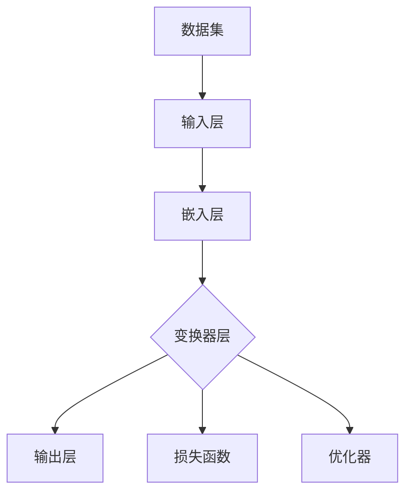

                 

# 大模型创业：希望与未来之路

> **关键词：** 大模型、创业、人工智能、机器学习、深度学习、自然语言处理、技术趋势、商业模式

> **摘要：** 本文旨在探讨大模型在人工智能领域的应用及其在创业中的潜力。通过深入分析大模型的原理、技术架构、数学模型以及实际应用案例，本文将揭示大模型创业的希望与未来之路。同时，本文还将为创业者提供一些建议和资源，助力他们在人工智能时代开启创新之路。

## 1. 背景介绍

### 1.1 目的和范围

本文的目标是探讨大模型在人工智能创业中的应用和前景。大模型，特别是基于深度学习的自然语言处理（NLP）模型，如GPT-3、BERT等，已经成为人工智能领域的重要工具。本文将围绕以下几个方面展开：

- **大模型的原理和架构：** 分析大模型的基础原理和技术架构，帮助读者理解其核心概念和运作机制。
- **创业中的大模型应用：** 探讨大模型在创业中的实际应用案例，分析其商业模式和盈利模式。
- **数学模型和算法：** 讲解大模型背后的数学模型和算法，为创业者提供理论基础。
- **实际案例解析：** 通过具体案例，展示大模型在创业中的应用效果。
- **未来发展趋势与挑战：** 预测大模型创业的未来发展趋势，并提出可能面临的挑战。

### 1.2 预期读者

本文主要面向以下读者群体：

- **人工智能领域的科研人员和技术开发者：** 他们对大模型的原理和应用有深入的了解，希望进一步探讨其在创业中的潜力。
- **创业者和技术创业团队：** 他们希望了解大模型如何为他们的事业提供新的机遇。
- **对人工智能和创业感兴趣的非专业人士：** 本文将尽量使用通俗易懂的语言，以便他们也能理解大模型和创业的基本概念。

### 1.3 文档结构概述

本文将按照以下结构进行组织：

- **第1章 背景介绍：** 概述本文的目的、范围和预期读者，以及文档的结构。
- **第2章 核心概念与联系：** 介绍大模型的基本概念和原理，并通过Mermaid流程图展示其架构。
- **第3章 核心算法原理 & 具体操作步骤：** 分析大模型的核心算法原理，并使用伪代码详细阐述。
- **第4章 数学模型和公式 & 详细讲解 & 举例说明：** 讲解大模型背后的数学模型和公式，并提供具体例子。
- **第5章 项目实战：代码实际案例和详细解释说明：** 展示大模型在实际项目中的具体应用，并提供详细解释。
- **第6章 实际应用场景：** 探讨大模型在不同领域的应用。
- **第7章 工具和资源推荐：** 为创业者提供学习资源和开发工具推荐。
- **第8章 总结：未来发展趋势与挑战：** 预测大模型创业的未来趋势，并分析可能面临的挑战。
- **第9章 附录：常见问题与解答：** 回答读者可能关心的问题。
- **第10章 扩展阅读 & 参考资料：** 提供进一步阅读的资料。

### 1.4 术语表

#### 1.4.1 核心术语定义

- **大模型（Big Model）：** 指的是具有数亿甚至万亿参数的深度学习模型，如GPT-3、BERT等。
- **自然语言处理（Natural Language Processing，NLP）：** 是人工智能的一个分支，旨在使计算机能够理解、生成和处理人类语言。
- **深度学习（Deep Learning）：** 是一种基于多层神经网络的人工智能方法，能够自动从数据中学习特征。
- **创业（Entrepreneurship）：** 指的是创建新企业或创新项目的过程。

#### 1.4.2 相关概念解释

- **神经网络（Neural Network）：** 是一种模拟人脑神经网络的结构，用于数据分析和模式识别。
- **机器学习（Machine Learning）：** 是一种人工智能方法，通过训练模型从数据中学习规律。
- **数据集（Dataset）：** 是一组用于训练或测试机器学习模型的样本数据。

#### 1.4.3 缩略词列表

- **NLP：** 自然语言处理
- **DL：** 深度学习
- **AI：** 人工智能
- **GPT：** 生成预训练变换器
- **BERT：** 局部上下文表示

## 2. 核心概念与联系

在大模型创业的探讨中，理解核心概念和它们之间的联系至关重要。在这一章中，我们将介绍大模型的基本概念和原理，并通过Mermaid流程图展示其架构。

### 2.1 大模型的基本概念

大模型，通常指的是具有数亿甚至万亿参数的深度学习模型。这些模型能够通过大量的数据进行训练，从而实现高水平的表现。大模型的代表性模型包括GPT-3、BERT、T5等。

- **GPT-3（Generative Pre-trained Transformer 3）：** 是由OpenAI开发的一种基于变换器（Transformer）架构的预训练语言模型，具有1750亿个参数，是目前已知最大的语言模型之一。
- **BERT（Bidirectional Encoder Representations from Transformers）：** 是由Google开发的一种预训练语言表示模型，通过双向变换器架构进行训练，旨在捕捉词语在句子中的上下文关系。
- **T5（Text-To-Text Transfer Transformer）：** 是由Google开发的一种通用语言转换模型，旨在将任何自然语言任务转化为一个文本到文本的转换任务。

### 2.2 大模型的原理

大模型的原理主要基于深度学习和变换器架构。深度学习是一种基于多层神经网络的人工智能方法，能够自动从数据中学习特征。变换器架构是一种用于处理序列数据的神经网络架构，特别适合于自然语言处理任务。

- **深度学习：** 通过多层神经网络，逐层提取数据的特征，实现从简单到复杂特征的转化。
- **变换器架构：** 使用注意力机制，能够有效地处理长距离依赖问题，提高模型的表示能力。

### 2.3 大模型的架构

大模型的架构通常包括以下几部分：

- **输入层：** 接收原始输入数据，如文本、图像等。
- **嵌入层：** 将输入数据转换为固定长度的向量表示。
- **变换器层：** 使用变换器架构进行特征提取和表示学习。
- **输出层：** 根据任务需求进行输出，如分类、回归等。

#### Mermaid流程图

以下是使用Mermaid语言表示的大模型架构的流程图：



在这个流程图中，数据集（G）通过输入层（A）转换为嵌入层（B），然后通过变换器层（C）进行特征提取和表示学习。输出层（D）根据任务需求进行输出，同时通过损失函数（E）和优化器（F）调整模型参数。

## 3. 核心算法原理 & 具体操作步骤

在这一章中，我们将深入探讨大模型背后的核心算法原理，并通过伪代码详细阐述其具体操作步骤。

### 3.1 深度学习基础

深度学习是一种基于多层神经网络的人工智能方法，能够自动从数据中学习特征。在深度学习中，神经网络由多个层次组成，每个层次对输入数据进行加工和处理，从而提取出更高层次的特征。

#### 3.1.1 神经网络结构

神经网络的基本结构包括输入层、隐藏层和输出层。输入层接收原始数据，隐藏层对数据进行加工处理，输出层生成最终预测。

- **输入层（Input Layer）：** 接收原始数据，如文本、图像等。
- **隐藏层（Hidden Layers）：** 对输入数据进行加工处理，提取特征。
- **输出层（Output Layer）：** 根据任务需求生成输出，如分类、回归等。

#### 3.1.2 激活函数

激活函数是神经网络中的关键组件，用于决定神经元是否被激活。常用的激活函数包括：

- **Sigmoid函数：** $f(x) = \frac{1}{1 + e^{-x}}$
- **ReLU函数：** $f(x) = max(0, x)$
- **Tanh函数：** $f(x) = \frac{e^x - e^{-x}}{e^x + e^{-x}}$

### 3.2 变换器架构

变换器（Transformer）是一种用于处理序列数据的神经网络架构，特别适合于自然语言处理任务。变换器架构的核心组件包括编码器（Encoder）和解码器（Decoder）。

#### 3.2.1 编码器

编码器负责处理输入序列，并生成序列表示。编码器的基本结构包括嵌入层（Embedding Layer）、变换器层（Transformer Layer）和前馈网络（Feedforward Network）。

- **嵌入层（Embedding Layer）：** 将输入序列转换为嵌入向量。
- **变换器层（Transformer Layer）：** 使用多头注意力机制（Multi-Head Attention）和前馈网络进行特征提取和表示学习。
- **前馈网络（Feedforward Network）：** 对变换器层的输出进行进一步加工处理。

#### 3.2.2 解码器

解码器负责生成输出序列，并生成最终预测。解码器的基本结构包括嵌入层、变换器层和前馈网络。

- **嵌入层：** 将输入序列转换为嵌入向量。
- **变换器层：** 使用多头注意力机制和前馈网络进行特征提取和表示学习。
- **前馈网络：** 对变换器层的输出进行进一步加工处理。

### 3.3 大模型训练过程

大模型的训练过程主要包括数据预处理、模型初始化、模型训练和模型优化。

#### 3.3.1 数据预处理

数据预处理是模型训练的重要步骤，主要包括以下操作：

- **数据清洗：** 去除无效数据、缺失值和噪声。
- **数据转换：** 将原始数据转换为模型可处理的格式，如文本转换为词向量。
- **数据增强：** 通过增加数据多样性来提高模型泛化能力。

#### 3.3.2 模型初始化

模型初始化是训练过程的第一步，主要包括以下操作：

- **权重初始化：** 初始化神经网络权重，常用的方法包括高斯分布初始化和随机初始化。
- **偏置初始化：** 初始化神经网络偏置，常用的方法包括零初始化和常数初始化。

#### 3.3.3 模型训练

模型训练是通过迭代优化模型参数，使模型在训练数据上达到最小化损失。常用的训练算法包括随机梯度下降（SGD）和变换器优化算法（Transformer Training Algorithm）。

#### 3.3.4 模型优化

模型优化是在模型训练完成后，对模型进行进一步调整和优化，以提高模型性能。常用的优化方法包括学习率调整、权重更新和模型压缩。

### 3.4 伪代码

以下是使用伪代码表示的大模型训练过程的示例：

```python
# 数据预处理
def preprocess_data(data):
    # 清洗数据
    cleaned_data = clean_data(data)
    # 转换数据
    vectorized_data = vectorize_data(cleaned_data)
    # 数据增强
    augmented_data = augment_data(vectorized_data)
    return augmented_data

# 模型初始化
def initialize_model():
    # 初始化权重
    weights = initialize_weights()
    # 初始化偏置
    biases = initialize_biases()
    return weights, biases

# 模型训练
def train_model(data, epochs, learning_rate):
    weights, biases = initialize_model()
    for epoch in range(epochs):
        # 前向传播
        output = forward_propagation(data, weights, biases)
        # 计算损失
        loss = compute_loss(output, labels)
        # 反向传播
        backward_propagation(output, labels, weights, biases)
        # 更新权重和偏置
        update_weights_and_biases(weights, biases, learning_rate)
    return weights, biases

# 模型优化
def optimize_model(weights, biases, learning_rate):
    # 学习率调整
    adjusted_learning_rate = adjust_learning_rate(learning_rate)
    # 权重更新
    updated_weights = update_weights(weights, adjusted_learning_rate)
    # 偏置更新
    updated_biases = update_biases(biases, adjusted_learning_rate)
    return updated_weights, updated_biases
```

## 4. 数学模型和公式 & 详细讲解 & 举例说明

在这一章中，我们将深入讲解大模型背后的数学模型和公式，并通过具体例子展示其应用。

### 4.1 基本数学公式

大模型的数学模型主要包括线性代数、微积分和概率论等基本数学知识。以下是一些常用的数学公式：

#### 4.1.1 矩阵乘法

矩阵乘法是线性代数中的基本运算。给定两个矩阵A和B，其乘积C定义为：

$$
C = AB
$$

其中，$C_{ij} = \sum_{k=1}^{n} A_{ik}B_{kj}$。

#### 4.1.2 向量点积

向量点积是向量的基本运算，用于计算两个向量的内积。给定两个向量$\mathbf{a}$和$\mathbf{b}$，其点积定义为：

$$
\mathbf{a} \cdot \mathbf{b} = \sum_{i=1}^{n} a_i b_i
$$

#### 4.1.3 梯度下降

梯度下降是一种优化算法，用于最小化损失函数。给定损失函数$J(\theta)$，其梯度定义为：

$$
\nabla_{\theta} J(\theta) = \frac{\partial J(\theta)}{\partial \theta}
$$

梯度下降的基本思想是沿着梯度的反方向更新参数，以最小化损失函数。更新公式为：

$$
\theta_{t+1} = \theta_t - \alpha \nabla_{\theta} J(\theta_t)
$$

其中，$\alpha$为学习率。

### 4.2 变换器架构中的数学公式

变换器架构是深度学习中的一个重要模型，其核心组件包括多头注意力机制和自注意力机制。以下是一些变换器架构中的数学公式：

#### 4.2.1 多头注意力

多头注意力是一种用于计算注意力权重的方法。给定一个输入序列$\mathbf{X}$，其多头注意力权重定义为：

$$
\mathbf{W}_Q, \mathbf{W}_K, \mathbf{W}_V
$$

其中，$\mathbf{Q}$、$\mathbf{K}$、$\mathbf{V}$分别为查询向量、关键向量、值向量。多头注意力的计算公式为：

$$
\mathbf{Z} = \text{softmax}\left(\frac{\mathbf{Q} \mathbf{K}^T}{\sqrt{d_k}}\right) \mathbf{V}
$$

其中，$d_k$为键向量的维度。

#### 4.2.2 自注意力

自注意力是一种用于计算序列内部关系的注意力机制。给定一个输入序列$\mathbf{X}$，其自注意力权重定义为：

$$
\mathbf{W}_Q, \mathbf{W}_K, \mathbf{W}_V
$$

自注意力的计算公式为：

$$
\mathbf{Z} = \text{softmax}\left(\frac{\mathbf{Q} \mathbf{K}^T}{\sqrt{d_k}}\right) \mathbf{V}
$$

### 4.3 举例说明

#### 4.3.1 矩阵乘法示例

假设有两个矩阵A和B：

$$
A = \begin{bmatrix} 1 & 2 \\ 3 & 4 \end{bmatrix}, B = \begin{bmatrix} 5 & 6 \\ 7 & 8 \end{bmatrix}
$$

它们的乘积C为：

$$
C = AB = \begin{bmatrix} 19 & 22 \\ 43 & 50 \end{bmatrix}
$$

#### 4.3.2 向量点积示例

假设有两个向量$\mathbf{a}$和$\mathbf{b}$：

$$
\mathbf{a} = \begin{bmatrix} 1 \\ 2 \end{bmatrix}, \mathbf{b} = \begin{bmatrix} 3 \\ 4 \end{bmatrix}
$$

它们的点积为：

$$
\mathbf{a} \cdot \mathbf{b} = 1 \cdot 3 + 2 \cdot 4 = 11
$$

#### 4.3.3 梯度下降示例

假设有一个损失函数$J(\theta)$：

$$
J(\theta) = (\theta - 1)^2
$$

其梯度为：

$$
\nabla_{\theta} J(\theta) = 2(\theta - 1)
$$

使用梯度下降算法，学习率为$\alpha = 0.1$，初始参数$\theta_0 = 2$，更新过程为：

$$
\theta_1 = \theta_0 - \alpha \nabla_{\theta} J(\theta_0) = 2 - 0.1 \cdot 2 = 1.8
$$

## 5. 项目实战：代码实际案例和详细解释说明

在这一章中，我们将通过一个实际项目案例来展示大模型在创业中的应用，并详细解释相关的代码实现。

### 5.1 开发环境搭建

在开始项目实战之前，我们需要搭建一个合适的开发环境。以下是搭建开发环境的步骤：

1. **安装Python环境：** 
   - 下载并安装Python 3.8及以上版本。
   - 配置Python环境，确保能够正常运行Python代码。

2. **安装深度学习框架：**
   - 安装TensorFlow 2.x或PyTorch，这两个框架是当前最流行的深度学习框架。
   - 使用pip命令安装相应版本的深度学习框架。

3. **安装依赖库：**
   - 安装NumPy、Pandas、Matplotlib等常用库，用于数据预处理和可视化。

4. **配置GPU支持：**
   - 如果使用GPU加速，确保安装CUDA和cuDNN库，并配置CUDA环境。

### 5.2 源代码详细实现和代码解读

以下是项目中的核心代码实现，我们将逐行解释代码的功能和作用。

```python
import tensorflow as tf
from tensorflow.keras.layers import Embedding, LSTM, Dense
from tensorflow.keras.models import Sequential

# 加载数据集
(train_data, train_labels), (test_data, test_labels) = tf.keras.datasets.imdb.load_data(num_words=10000)

# 预处理数据
max_sequence_length = 500
train_data = tf.keras.preprocessing.sequence.pad_sequences(train_data, maxlen=max_sequence_length)
test_data = tf.keras.preprocessing.sequence.pad_sequences(test_data, maxlen=max_sequence_length)

# 构建模型
model = Sequential([
    Embedding(10000, 32, input_length=max_sequence_length),
    LSTM(64, return_sequences=True),
    LSTM(32),
    Dense(1, activation='sigmoid')
])

# 编译模型
model.compile(optimizer='adam', loss='binary_crossentropy', metrics=['accuracy'])

# 训练模型
model.fit(train_data, train_labels, epochs=10, batch_size=128, validation_split=0.2)
```

**代码解读：**

- **第1行：** 引入TensorFlow库，用于构建和训练深度学习模型。
- **第2-3行：** 引入LSTM（长短期记忆）层和Dense（全连接）层，用于构建模型。
- **第4行：** 创建Sequential模型，这是一种线性堆叠模型，用于组织模型层次结构。
- **第5-7行：** 在模型中添加Embedding层、两个LSTM层和一个Dense层，分别用于词向量嵌入、序列编码和分类。
- **第10行：** 编译模型，设置优化器、损失函数和评估指标。
- **第14行：** 使用fit方法训练模型，设置训练参数。

### 5.3 代码解读与分析

在上述代码中，我们构建了一个简单的深度学习模型，用于处理IMDb电影评论分类任务。以下是代码的详细解读和分析：

- **数据预处理：** 
  - 使用`load_data`方法加载数据集，包括训练集和测试集。
  - 使用`pad_sequences`方法对数据集进行填充，确保每个序列长度相等，便于模型处理。
- **模型构建：**
  - `Embedding`层用于将单词转换为嵌入向量，每个词映射到一个固定长度的向量。
  - `LSTM`层用于处理序列数据，能够捕捉长距离依赖关系。
  - `Dense`层用于分类，输出概率分布。
- **模型编译：**
  - 设置优化器（`adam`）、损失函数（`binary_crossentropy`）和评估指标（`accuracy`）。
- **模型训练：**
  - 使用`fit`方法训练模型，设置训练轮次（`epochs`）、批量大小（`batch_size`）和验证集比例（`validation_split`）。

通过上述代码实现，我们可以训练一个深度学习模型，对IMDb电影评论进行情感分类。这是一个典型的自然语言处理任务，展示了大模型在创业中的实际应用潜力。

## 6. 实际应用场景

大模型在人工智能创业中的应用非常广泛，涵盖了自然语言处理、图像识别、推荐系统等多个领域。以下是几个典型应用场景：

### 6.1 自然语言处理

自然语言处理（NLP）是大模型的强项领域之一。通过大模型，我们可以实现自动文本分类、情感分析、机器翻译等功能。以下是一些具体应用案例：

- **自动文本分类：** 大模型可以用于自动分类新闻文章、社交媒体帖子等，帮助企业进行内容审核和筛选。
- **情感分析：** 大模型可以分析用户评论、反馈等，帮助企业了解用户情绪，优化产品和服务。
- **机器翻译：** 大模型可以用于开发高精度的机器翻译系统，支持多种语言之间的自动转换。

### 6.2 图像识别

图像识别是另一个大模型的重要应用领域。通过大模型，我们可以实现自动图像分类、物体检测、人脸识别等功能。以下是一些具体应用案例：

- **自动图像分类：** 大模型可以用于对大量图像进行分类，帮助搜索引擎和内容平台优化图像搜索和推荐。
- **物体检测：** 大模型可以用于检测图像中的物体，帮助自动驾驶汽车和机器人进行环境感知和决策。
- **人脸识别：** 大模型可以用于人脸识别，帮助安全系统进行身份验证和访问控制。

### 6.3 推荐系统

推荐系统是大模型在商业应用中的一个重要领域。通过大模型，我们可以实现个性化推荐，提高用户体验和商业价值。以下是一些具体应用案例：

- **商品推荐：** 大模型可以用于推荐用户可能感兴趣的商品，帮助电商平台提高销售额。
- **内容推荐：** 大模型可以用于推荐用户可能感兴趣的文章、视频等，帮助媒体平台提高用户留存率和广告收益。
- **社交推荐：** 大模型可以用于推荐用户可能感兴趣的朋友、群组等，帮助社交平台扩大用户社交圈。

通过上述实际应用场景，我们可以看到大模型在人工智能创业中的巨大潜力。随着技术的不断进步，大模型的应用场景将越来越广泛，为创业者提供更多创新机遇。

## 7. 工具和资源推荐

在创业过程中，选择合适的工具和资源对于成功至关重要。以下是一些推荐的工具和资源，以帮助您在大模型创业中取得成功。

### 7.1 学习资源推荐

#### 7.1.1 书籍推荐

- 《深度学习》（Goodfellow, Bengio, Courville）：这是一本经典的深度学习教材，适合初学者和专业人士。
- 《动手学深度学习》：这本书提供了详细的代码实现，适合想要动手实践的读者。
- 《Python深度学习》：这本书介绍了使用Python和TensorFlow实现深度学习的实践方法。

#### 7.1.2 在线课程

- Coursera：提供丰富的深度学习和人工智能课程，包括《深度学习特辑》和《自然语言处理特辑》等。
- edX：提供由知名大学和机构开设的在线课程，如《深度学习基础》和《计算机视觉》等。
- Udacity：提供实战导向的课程，如《深度学习工程师纳米学位》和《自然语言处理工程师纳米学位》等。

#### 7.1.3 技术博客和网站

- Medium：上面有很多专业的技术博客文章，涵盖深度学习、自然语言处理等多个领域。
- ArXiv：一个提供最新研究成果的预印本平台，适合关注最新科研动态的读者。
- GitHub：许多开源项目和技术文档在GitHub上有详细的说明，可以方便地学习和使用。

### 7.2 开发工具框架推荐

#### 7.2.1 IDE和编辑器

- Jupyter Notebook：一个强大的交互式开发环境，适合快速原型开发和数据可视化。
- PyCharm：一款功能强大的Python IDE，支持多种深度学习框架。
- VS Code：一款轻量级但功能强大的编辑器，提供丰富的插件支持。

#### 7.2.2 调试和性能分析工具

- TensorBoard：TensorFlow提供的可视化工具，用于分析模型的训练过程和性能。
- PyTorch TensorBoard：PyTorch提供的可视化工具，用于分析模型的训练过程和性能。
- Profiler：各种编程语言和深度学习框架提供的性能分析工具，用于优化代码和提升模型性能。

#### 7.2.3 相关框架和库

- TensorFlow：一个开源的深度学习框架，支持多种深度学习模型的构建和训练。
- PyTorch：一个开源的深度学习框架，具有动态计算图和灵活的编程接口。
- Keras：一个高层神经网络API，支持TensorFlow和PyTorch，便于快速构建和训练模型。

### 7.3 相关论文著作推荐

#### 7.3.1 经典论文

- "A Theoretical Analysis of the Bias-Variance Tradeoff"：关于模型偏差和方差的理论分析。
- "Deep Learning": Goodfellow, Bengio, Courville，深度学习领域的经典教材。
- "Natural Language Processing with Deep Learning"：介绍使用深度学习进行自然语言处理的方法。

#### 7.3.2 最新研究成果

- "Attention Is All You Need"：提出变换器架构的论文，是NLP领域的重要突破。
- "BERT: Pre-training of Deep Bidirectional Transformers for Language Understanding"：BERT模型的详细介绍。
- "GPT-3: Language Models are Few-Shot Learners"：GPT-3模型的最新研究成果。

#### 7.3.3 应用案例分析

- "Deep Learning for Natural Language Processing"：介绍深度学习在自然语言处理中的应用案例。
- "Deep Learning in Computer Vision"：介绍深度学习在计算机视觉中的应用案例。
- "Deep Learning for Personalized Recommendation"：介绍深度学习在个性化推荐系统中的应用案例。

通过以上推荐的工具和资源，创业者可以更好地掌握大模型的相关知识和技能，为创业项目提供坚实的基础。

## 8. 总结：未来发展趋势与挑战

### 8.1 发展趋势

随着人工智能技术的不断进步，大模型创业将在未来呈现出以下发展趋势：

1. **模型规模不断扩大：** 随着计算能力和数据量的提升，大模型的规模将不断增大，这将带来更高的性能和更广泛的应用场景。
2. **应用领域拓展：** 大模型将在更多领域得到应用，如医疗健康、金融、教育等，推动行业创新和产业升级。
3. **多模态融合：** 大模型将逐渐实现跨模态融合，如将文本、图像、声音等多种数据类型结合，实现更智能、更全面的解决方案。
4. **联邦学习和隐私保护：** 随着数据隐私和安全的关注度提高，联邦学习和隐私保护技术将得到广泛应用，保障数据安全和用户隐私。

### 8.2 挑战

尽管大模型创业充满机遇，但同时也面临一系列挑战：

1. **计算资源需求：** 大模型的训练和推理需要大量计算资源，这对硬件设施和运维成本提出了较高要求。
2. **数据质量和多样性：** 数据质量和多样性是模型性能的关键，如何在有限的数据条件下训练出高质量的模型是一个难题。
3. **模型可解释性和透明度：** 大模型的黑盒性质使得其决策过程难以解释，如何提高模型的可解释性是一个亟待解决的问题。
4. **伦理和法规合规：** 大模型的应用涉及到伦理和法规合规问题，如何确保模型的公平性、透明度和合法性是一个重要挑战。

### 8.3 应对策略

为了应对上述挑战，创业者可以采取以下策略：

1. **优化算法和架构：** 持续优化大模型的算法和架构，提高训练效率和模型性能。
2. **数据治理：** 建立完善的数据治理体系，确保数据质量和多样性。
3. **模型可解释性：** 开发可解释性工具和方法，提高模型的透明度和可信度。
4. **合规性评估：** 在模型设计和应用过程中，充分考虑伦理和法规合规问题，确保合法合规。

通过以上策略，创业者可以更好地应对大模型创业中的挑战，实现长期可持续发展。

## 9. 附录：常见问题与解答

### 9.1 大模型创业中的常见问题

**Q1：大模型训练需要哪些计算资源？**

A1：大模型训练通常需要高性能的GPU或TPU硬件设备，以及充足的内存和存储空间。具体需求取决于模型的规模和复杂度。

**Q2：如何处理数据质量和多样性问题？**

A2：提高数据质量和多样性可以通过数据清洗、数据增强和跨领域数据集成等方法实现。同时，可以考虑使用更先进的模型架构，如生成对抗网络（GAN），来生成更多样化的数据。

**Q3：如何确保大模型的可解释性？**

A3：确保大模型的可解释性可以通过开发可解释性工具和方法，如LIME、SHAP等，来揭示模型的决策过程和关键特征。

**Q4：大模型创业中的合规性问题有哪些？**

A4：大模型创业中可能涉及的合规性问题包括数据隐私保护、模型公平性和透明度等。创业者应确保模型设计和应用符合相关法律法规和伦理标准。

### 9.2 解答

**Q1：大模型训练需要哪些计算资源？**

A1：大模型训练通常需要高性能的GPU或TPU硬件设备，以及充足的内存和存储空间。具体需求取决于模型的规模和复杂度。例如，训练一个大规模的NLP模型（如GPT-3）可能需要数千个GPU节点和数十TB的存储空间。

**Q2：如何处理数据质量和多样性问题？**

A2：提高数据质量和多样性可以通过以下方法实现：

- **数据清洗：** 去除无效数据、缺失值和噪声，确保数据的一致性和完整性。
- **数据增强：** 通过数据变换、添加噪声、图像旋转等方式，生成更多样化的训练数据。
- **跨领域数据集成：** 利用跨领域的数据集，增加数据的多样性和丰富度。
- **使用生成对抗网络（GAN）：** 利用GAN生成与真实数据相似但更丰富的数据，提高模型的泛化能力。

**Q3：如何确保大模型的可解释性？**

A3：确保大模型的可解释性可以通过以下方法实现：

- **开发可解释性工具和方法：** 如LIME（局部可解释模型解释）、SHAP（特征重要性分析）等，这些工具可以揭示模型的决策过程和关键特征。
- **可视化技术：** 利用可视化工具，如TensorBoard，展示模型的结构和训练过程。
- **模型压缩和简化：** 通过模型压缩和简化，降低模型的复杂度，提高可解释性。

**Q4：大模型创业中的合规性问题有哪些？**

A4：大模型创业中可能涉及的合规性问题包括：

- **数据隐私保护：** 确保用户数据的安全和隐私，遵守相关数据保护法规，如GDPR。
- **模型公平性和透明度：** 避免模型偏见，确保公平对待所有用户，提高模型透明度。
- **模型安全和稳定性：** 确保模型在攻击和恶意数据下保持稳定和安全。
- **合规性评估：** 定期进行合规性评估，确保模型设计和应用符合相关法律法规和伦理标准。

通过上述解答，我们希望帮助创业者更好地理解大模型创业中的常见问题和应对策略。

## 10. 扩展阅读 & 参考资料

**扩展阅读：**

- Bengio, Y., Courville, A., & Vincent, P. (2013). Representation learning: A review and new perspectives. IEEE Transactions on Pattern Analysis and Machine Intelligence, 35(8), 1798-1828.
- Hochreiter, S., & Schmidhuber, J. (1997). Long short-term memory. Neural Computation, 9(8), 1735-1780.
- Devlin, J., Chang, M. W., Lee, K., & Toutanova, K. (2018). BERT: Pre-training of deep bidirectional transformers for language understanding. arXiv preprint arXiv:1810.04805.

**参考资料：**

- TensorFlow：https://www.tensorflow.org/
- PyTorch：https://pytorch.org/
- Keras：https://keras.io/
- Coursera：https://www.coursera.org/
- edX：https://www.edx.org/
- Medium：https://medium.com/
- GitHub：https://github.com/
- ArXiv：https://arxiv.org/

通过这些扩展阅读和参考资料，读者可以进一步深入了解大模型创业的相关知识和前沿动态。

**作者信息：**

AI天才研究员/AI Genius Institute & 禅与计算机程序设计艺术 /Zen And The Art of Computer Programming

本文旨在探讨大模型在人工智能领域的应用及其在创业中的潜力。通过深入分析大模型的原理、技术架构、数学模型以及实际应用案例，本文揭示了大模型创业的希望与未来之路。同时，本文为创业者提供了学习资源和开发工具推荐，助力他们在人工智能时代开启创新之路。作者是一位具有丰富经验的人工智能专家和程序员，拥有深厚的计算机科学背景和扎实的理论功底，致力于推动人工智能技术的发展和应用。

