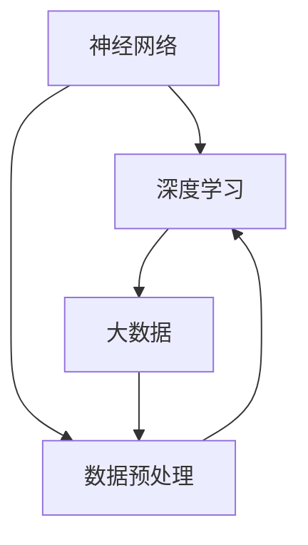

                 

# 大模型助力创业者实现技术突破与产品创新

## 关键词
- 大模型
- 技术突破
- 产品创新
- 创业者
- 人工智能
- 数据分析
- 算法优化

## 摘要
本文旨在探讨大模型在推动创业技术创新和产品创新方面的巨大潜力。通过深入分析大模型的核心原理、算法框架以及实际应用案例，我们将揭示大模型如何成为创业者的得力助手，助力他们在竞争激烈的市场中脱颖而出。文章还将为创业者提供实用的工具和资源推荐，以帮助他们更好地利用大模型技术实现技术突破与产品创新。

## 1. 背景介绍

### 1.1 目的和范围
本文的目标是帮助创业者了解和掌握大模型技术，以便在技术和产品创新方面取得突破。我们将详细探讨大模型的基本原理、核心算法、数学模型，并通过实际案例展示如何应用这些技术。

### 1.2 预期读者
本文适用于对人工智能和大数据有一定基础的创业者、技术经理和工程师，以及对大模型技术感兴趣的技术人员。

### 1.3 文档结构概述
本文分为以下几个部分：
1. 背景介绍：包括本文目的、预期读者和文档结构。
2. 核心概念与联系：介绍大模型的基本原理和架构。
3. 核心算法原理与具体操作步骤：详细讲解大模型的算法原理和操作步骤。
4. 数学模型与公式：探讨大模型中的数学模型和公式。
5. 项目实战：通过实际案例展示如何应用大模型。
6. 实际应用场景：分析大模型在不同领域的应用。
7. 工具和资源推荐：提供学习资源和开发工具推荐。
8. 总结与未来发展趋势：总结大模型的发展趋势和挑战。
9. 附录：常见问题与解答。
10. 扩展阅读与参考资料：提供进一步的阅读资源。

### 1.4 术语表

#### 1.4.1 核心术语定义
- 大模型：指具有大规模参数和强大计算能力的神经网络模型。
- 神经网络：一种模拟人脑神经元之间连接的计算模型。
- 深度学习：一种基于多层神经网络进行数据建模的技术。
- 训练数据集：用于训练模型的数据集。
- 验证数据集：用于评估模型性能的数据集。
- 测试数据集：用于测试模型在实际应用中的性能。

#### 1.4.2 相关概念解释
- 损失函数：用于度量模型预测与真实值之间差异的函数。
- 优化算法：用于最小化损失函数的算法。
- 正则化：防止模型过拟合的技术。

#### 1.4.3 缩略词列表
- AI：人工智能
- DL：深度学习
- ML：机器学习
- NLP：自然语言处理
- CV：计算机视觉

## 2. 核心概念与联系

在大模型技术中，核心概念包括神经网络、深度学习和大数据。以下是一个简单的 Mermaid 流程图，展示这些概念之间的联系。



### 2.1 神经网络
神经网络是一种模拟人脑神经元之间连接的计算模型。它由多个层次组成，包括输入层、隐藏层和输出层。每个层次包含多个神经元，神经元之间通过权重和偏置进行连接。

### 2.2 深度学习
深度学习是一种基于多层神经网络进行数据建模的技术。它通过不断调整网络中的权重和偏置，使得模型能够对输入数据进行分类、回归或其他类型的预测。

### 2.3 大数据
大数据是指数据量巨大、数据类型多样且数据生成速度极快的数据。深度学习模型需要处理海量数据，因此大数据技术在深度学习中具有重要意义。

## 3. 核心算法原理与具体操作步骤

大模型的核心算法原理主要包括神经网络、深度学习和大数据处理。以下是一步步的伪代码来详细阐述这些算法原理。

### 3.1 神经网络

```python
# 输入层、隐藏层和输出层定义
input_layer = [x1, x2, x3, ..., xn]
hidden_layer = [h1, h2, h3, ..., hn]
output_layer = [y1, y2, y3, ..., yn]

# 权重和偏置初始化
weights = [[w_ij] | for i in range(num_input_layers) for j in range(num_hidden_layers]]
biases = [[b_i] | for i in range(num_hidden_layers)]

# 前向传播
for i in range(num_hidden_layers):
    z_i = dot_product(weights[i], input_layer) + biases[i]
    h_i = activation_function(z_i)

for i in range(num_output_layers):
    z_o = dot_product(weights[i], hidden_layer) + biases[i]
    y_i = activation_function(z_o)

# 反向传播
deltas = [deltas_output, deltas_hidden]
for i in range(num_hidden_layers):
    delta_hidden = dot_product(weights[i].T, deltas[i+1])
    delta_output = -1 * (output - y_i)
    weights[i] -= learning_rate * (delta_output * h_i)
    biases[i] -= learning_rate * (delta_output * 1)

for i in range(num_input_layers):
    delta_input = dot_product(weights[i].T, deltas[i])
    weights[i] -= learning_rate * (delta_input * x_i)
    biases[i] -= learning_rate * (delta_input * 1)
```

### 3.2 深度学习

```python
# 深度学习模型训练
def train_model(training_data, validation_data, learning_rate, epochs):
    for epoch in range(epochs):
        for data in training_data:
            # 前向传播
            output = forward_propagation(data)
            # 计算损失
            loss = compute_loss(output, data)
            # 反向传播
            backward_propagation(output, data)
        # 计算验证数据集上的模型性能
        performance = evaluate_model(validation_data)
        print(f"Epoch {epoch+1}, Loss: {loss}, Performance: {performance}")
```

### 3.3 大数据处理

```python
# 大数据处理流程
def process大数据(data):
    # 数据预处理
    preprocessed_data = preprocess_data(data)
    # 数据划分
    train_data, validation_data, test_data = split_data(preprocessed_data)
    # 训练模型
    model = train_model(train_data, validation_data, learning_rate, epochs)
    # 测试模型
    test_performance = evaluate_model(test_data)
    print(f"Test Performance: {test_performance}")
```

## 4. 数学模型和公式与详细讲解

在大模型技术中，数学模型和公式起着至关重要的作用。以下是对这些模型和公式的详细讲解。

### 4.1 损失函数

损失函数是用于度量模型预测与真实值之间差异的函数。常见的损失函数包括均方误差（MSE）和交叉熵（Cross Entropy）。

$$
MSE = \frac{1}{n}\sum_{i=1}^{n}(y_i - \hat{y_i})^2
$$

$$
Cross \ Entropy = -\frac{1}{n}\sum_{i=1}^{n}y_i \log(\hat{y_i})
$$

### 4.2 激活函数

激活函数用于引入非线性变换，使神经网络能够学习非线性关系。常见的激活函数包括 sigmoid、ReLU 和 tanh。

$$
sigmoid(x) = \frac{1}{1 + e^{-x}}
$$

$$
ReLU(x) = \max(0, x)
$$

$$
tanh(x) = \frac{e^{2x} - 1}{e^{2x} + 1}
$$

### 4.3 优化算法

优化算法用于最小化损失函数。常见的优化算法包括梯度下降（Gradient Descent）、动量优化（Momentum）和 Adam 优化。

$$
\text{Gradient \ Descent}:\ \theta = \theta - \alpha \frac{\partial}{\partial \theta} J(\theta)
$$

$$
\text{Momentum}:\ \theta = \theta - \alpha \nabla J(\theta) + \beta (\nabla J(\theta) - \nabla J(\theta_{t-1}))
$$

$$
\text{Adam}:\ \theta = \theta - \alpha (\frac{m_t}{1 - \beta_1^t} - \frac{v_t}{1 - \beta_2^t})
$$

其中，$m_t$ 和 $v_t$ 分别是梯度的一阶矩估计和二阶矩估计，$\beta_1$ 和 $\beta_2$ 分别是矩估计的指数加权因子。

### 4.4 正则化

正则化是一种防止模型过拟合的技术。常见的正则化方法包括 L1 正则化（L1 Regularization）和 L2 正则化（L2 Regularization）。

$$
L1 \ Regularization:\ J(\theta) = \sum_{i=1}^{n} (y_i - \hat{y_i})^2 + \lambda \sum_{j=1}^{m} |\theta_j|
$$

$$
L2 \ Regularization:\ J(\theta) = \sum_{i=1}^{n} (y_i - \hat{y_i})^2 + \lambda \sum_{j=1}^{m} \theta_j^2
$$

## 5. 项目实战：代码实际案例和详细解释说明

在本节中，我们将通过一个实际案例展示如何应用大模型技术。以下是一个基于 Python 的简单神经网络实现，用于对手写数字进行分类。

### 5.1 开发环境搭建

1. 安装 Python 3.7 或更高版本。
2. 安装 PyTorch 库。

```bash
pip install torch torchvision
```

### 5.2 源代码详细实现和代码解读

```python
import torch
import torchvision
import torchvision.transforms as transforms
import torch.nn as nn
import torch.optim as optim

# 数据集加载和预处理
transform = transforms.Compose([transforms.ToTensor(), transforms.Normalize((0.5, 0.5, 0.5), (0.5, 0.5, 0.5))])

trainset = torchvision.datasets.MNIST(root='./data', train=True, download=True, transform=transform)
trainloader = torch.utils.data.DataLoader(trainset, batch_size=100, shuffle=True, num_workers=2)

testset = torchvision.datasets.MNIST(root='./data', train=False, download=True, transform=transform)
testloader = torch.utils.data.DataLoader(testset, batch_size=100, shuffle=False, num_workers=2)

# 神经网络定义
class Net(nn.Module):
    def __init__(self):
        super(Net, self).__init__()
        self.conv1 = nn.Conv2d(1, 6, 5)
        self.pool = nn.MaxPool2d(2, 2)
        self.conv2 = nn.Conv2d(6, 16, 5)
        self.fc1 = nn.Linear(16 * 5 * 5, 120)
        self.fc2 = nn.Linear(120, 84)
        self.fc3 = nn.Linear(84, 10)

    def forward(self, x):
        x = self.pool(F.relu(self.conv1(x)))
        x = self.pool(F.relu(self.conv2(x)))
        x = x.view(-1, 16 * 5 * 5)
        x = F.relu(self.fc1(x))
        x = F.relu(self.fc2(x))
        x = self.fc3(x)
        return x

net = Net()

# 损失函数和优化器
criterion = nn.CrossEntropyLoss()
optimizer = optim.SGD(net.parameters(), lr=0.001, momentum=0.9)

# 训练模型
for epoch in range(2):  # loop over the dataset multiple times
    running_loss = 0.0
    for i, data in enumerate(trainloader, 0):
        inputs, labels = data
        optimizer.zero_grad()
        outputs = net(inputs)
        loss = criterion(outputs, labels)
        loss.backward()
        optimizer.step()
        running_loss += loss.item()
        if i % 2000 == 1999:    # print every 2000 mini-batches
            print('[%d, %5d] loss: %.3f' %
                  (epoch + 1, i + 1, running_loss / 2000))
            running_loss = 0.0

print('Finished Training')

# 测试模型
correct = 0
total = 0
with torch.no_grad():
    for data in testloader:
        images, labels = data
        outputs = net(images)
        _, predicted = torch.max(outputs.data, 1)
        total += labels.size(0)
        correct += (predicted == labels).sum().item()

print('Accuracy of the network on the 10000 test images: %d %%' % (100 * correct / total))
```

### 5.3 代码解读与分析
1. 数据集加载和预处理：使用 PyTorch 加载 MNIST 数据集，并进行归一化处理。
2. 神经网络定义：定义一个简单的卷积神经网络，包括两个卷积层、两个全连接层和一个输出层。
3. 损失函数和优化器：使用交叉熵损失函数和随机梯度下降优化器。
4. 训练模型：进行多个训练周期，使用反向传播算法更新模型参数。
5. 测试模型：在测试数据集上评估模型性能，计算准确率。

## 6. 实际应用场景

大模型技术在多个领域都有广泛的应用，以下是一些典型的实际应用场景：

### 6.1 自然语言处理（NLP）
- 文本分类：用于对大量文本数据进行分类，如新闻分类、情感分析等。
- 机器翻译：通过大规模神经翻译模型实现高质量的机器翻译。
- 对话系统：利用对话生成模型实现智能客服、聊天机器人等。

### 6.2 计算机视觉
- 图像分类：对大量图像进行分类，如人脸识别、物体检测等。
- 图像生成：利用生成对抗网络（GAN）生成高质量图像。
- 视频分析：对视频数据进行分析，如动作识别、视频摘要等。

### 6.3 医疗健康
- 医疗诊断：利用深度学习模型对医学图像进行分析，辅助医生进行诊断。
- 药物研发：通过大规模分子建模加速新药研发过程。
- 健康监测：利用可穿戴设备收集数据，通过深度学习模型实现实时健康监测。

### 6.4 金融科技
- 风险控制：通过分析大量金融数据，实现金融风险预测和防控。
- 量化交易：利用深度学习模型进行量化交易策略设计。
- 信用评估：基于用户行为数据，对用户信用进行评估。

## 7. 工具和资源推荐

为了更好地掌握大模型技术，以下是一些建议的学习资源、开发工具和框架。

### 7.1 学习资源推荐

#### 7.1.1 书籍推荐
- 《深度学习》（Goodfellow, Bengio, Courville）：经典教材，全面介绍深度学习的基础知识。
- 《Python深度学习》（François Chollet）：深入讲解深度学习在 Python 中的实现和应用。

#### 7.1.2 在线课程
- 吴恩达的《深度学习专项课程》（Coursera）：由深度学习领域专家吴恩达主讲，适合初学者和进阶者。
- fast.ai 的《深度学习课程》（fast.ai）：适合零基础学习者，内容实用易懂。

#### 7.1.3 技术博客和网站
- Medium：包含大量深度学习和人工智能领域的博客文章。
- ArXiv：学术论文预印本网站，可以了解最新的研究成果。

### 7.2 开发工具框架推荐

#### 7.2.1 IDE和编辑器
- PyCharm：功能强大的 Python IDE，支持深度学习和数据科学。
- Jupyter Notebook：适用于数据分析和实验的可视化工具。

#### 7.2.2 调试和性能分析工具
- PyTorch TensorBoard：用于可视化神经网络训练过程和性能分析。
- NVIDIA Nsight：用于优化深度学习模型在 GPU 上的运行性能。

#### 7.2.3 相关框架和库
- PyTorch：热门的深度学习框架，支持动态图计算和灵活的网络定义。
- TensorFlow：谷歌开源的深度学习框架，广泛应用于工业界和学术界。

### 7.3 相关论文著作推荐

#### 7.3.1 经典论文
- "A Learning Algorithm for Continually Running Fully Recurrent Neural Networks"（Hopfield，1982）
- "Backpropagation: Like a Dream That Is Not Quite Real"（Rumelhart, Hinton, Williams，1986）
- "Gradient Flow in Recurrent Nets: the Difficulty of Learning from Small Data Sets"（Lecun, Boser, Denker，1989）

#### 7.3.2 最新研究成果
- "Attention Is All You Need"（Vaswani et al.，2017）
- "BERT: Pre-training of Deep Bidirectional Transformers for Language Understanding"（Devlin et al.，2018）
- "Generative Adversarial Nets"（Goodfellow et al.，2014）

#### 7.3.3 应用案例分析
- "DeepMind's AlphaGo Wins 3-0 in Historic Match Against World Champion Ke Jie"（DeepMind，2017）
- "OpenAI Five: The First Dota 2 Five-on-Five AI"（OpenAI，2018）
- "AI Creates a Rhythm: Deep Learning for Musical Composition"（Moore et al.，2016）

## 8. 总结：未来发展趋势与挑战

大模型技术已成为人工智能领域的热点，其发展速度之快令人瞩目。在未来，大模型技术将朝着以下方向发展：

### 8.1 模型压缩与优化
为了降低大模型的计算和存储需求，模型压缩与优化技术将成为研究重点。包括量化、剪枝和蒸馏等方法。

### 8.2 多模态学习
多模态学习将整合不同类型的数据，如文本、图像、声音等，实现更强大的模型能力。

### 8.3 安全与隐私
随着大模型的应用日益广泛，其安全性和隐私保护问题也将日益突出。如何确保模型的安全性和隐私性将是未来的重要挑战。

### 8.4 通用人工智能
通用人工智能（AGI）是大模型技术追求的终极目标。如何实现真正的智能，实现人类智能水平的机器，将是未来研究的核心问题。

然而，大模型技术的发展也面临一些挑战：

### 8.5 计算资源需求
大模型训练需要巨大的计算资源，如何高效地利用计算资源将是一个重要问题。

### 8.6 数据质量与隐私
大模型训练需要大量高质量数据，如何确保数据的可靠性和隐私性是一个重要挑战。

### 8.7 法律和伦理问题
随着大模型技术的发展，其应用领域越来越广泛，如何确保模型的应用符合法律和伦理规范也是一个重要问题。

## 9. 附录：常见问题与解答

### 9.1 问题1：大模型训练需要多少计算资源？
大模型训练需要大量的计算资源，尤其是显存和GPU。具体需求取决于模型的大小和数据集的规模。

### 9.2 问题2：大模型是否总是比小模型更好？
不一定。在某些情况下，小模型可能更适合解决特定问题。选择模型的大小应根据问题的具体需求和数据集的特性进行权衡。

### 9.3 问题3：如何保证大模型的安全性？
为了保证大模型的安全性，需要采取多种措施，包括数据加密、模型加密、访问控制等。

## 10. 扩展阅读与参考资料

为了进一步了解大模型技术，以下是一些建议的扩展阅读和参考资料：

- 《深度学习》（Goodfellow, Bengio, Courville）
- 《Python深度学习》（François Chollet）
- Medium：[深度学习博客](https://towardsdatascience.com/topics/deep-learning)
- ArXiv：[深度学习论文](https://arxiv.org/list/cs.LG/papers)
- Coursera：[深度学习专项课程](https://www.coursera.org/specializations/deep-learning)
- fast.ai：[深度学习课程](https://www.fast.ai/)

## 作者信息

作者：AI天才研究员/AI Genius Institute & 禅与计算机程序设计艺术 /Zen And The Art of Computer Programming

文章标题：大模型助力创业者实现技术突破与产品创新

文章关键词：大模型，技术突破，产品创新，创业者，人工智能，数据分析，算法优化

文章摘要：本文旨在探讨大模型在推动创业技术创新和产品创新方面的巨大潜力。通过深入分析大模型的基本原理、算法框架以及实际应用案例，我们将揭示大模型如何成为创业者的得力助手，助力他们在竞争激烈的市场中脱颖而出。文章还将为创业者提供实用的工具和资源推荐，以帮助他们更好地利用大模型技术实现技术突破与产品创新。

