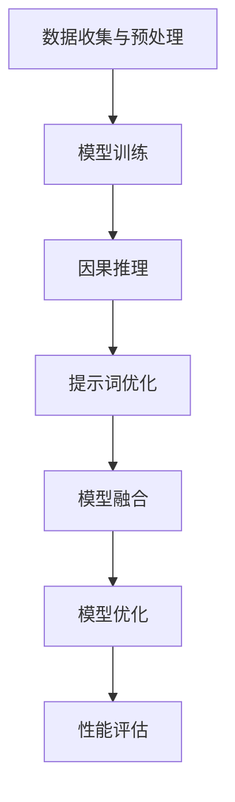
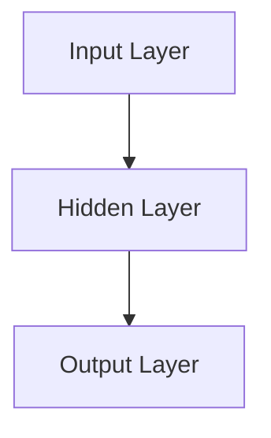

                 

# 大模型因果推理与提示词工程的融合

> **关键词：大模型、因果推理、提示词工程、融合、算法原理、数学模型、实际应用**
>
> **摘要：本文深入探讨大模型因果推理与提示词工程的融合技术，从背景介绍、核心概念、算法原理、数学模型、项目实战和实际应用等多个角度进行分析，为研究人员和开发者提供有益的参考和指导。**

## 1. 背景介绍

### 1.1 目的和范围

本文旨在探讨大模型因果推理与提示词工程的融合技术，分析其理论基础、算法原理、数学模型及实际应用场景，为研究人员和开发者提供全面的技术参考。本文涵盖以下几个主要方面：

1. 大模型因果推理的原理及实现；
2. 提示词工程的定义、方法和应用；
3. 大模型因果推理与提示词工程的融合技术；
4. 数学模型和公式；
5. 实际应用案例和详细解释说明；
6. 工具和资源推荐。

### 1.2 预期读者

本文适用于以下读者：

1. 对大模型因果推理和提示词工程感兴趣的研究人员和开发者；
2. 想要深入了解大模型融合技术的专业人士；
3. 担任项目主管或技术负责人的管理者；
4. 想要提升自己在人工智能领域专业素养的从业者。

### 1.3 文档结构概述

本文分为十个部分：

1. 引言
2. 背景介绍
3. 核心概念与联系
4. 核心算法原理 & 具体操作步骤
5. 数学模型和公式 & 详细讲解 & 举例说明
6. 项目实战：代码实际案例和详细解释说明
7. 实际应用场景
8. 工具和资源推荐
9. 总结：未来发展趋势与挑战
10. 附录：常见问题与解答
11. 扩展阅读 & 参考资料

### 1.4 术语表

#### 1.4.1 核心术语定义

- 大模型：拥有巨大参数量的神经网络模型，如GPT、BERT等；
- 因果推理：从已知原因推断未知结果的过程；
- 提示词工程：设计有效的提示词以指导模型生成符合预期输出的技术；
- 融合：将不同技术或方法有机结合，以实现更好的性能和效果。

#### 1.4.2 相关概念解释

- 神经网络：一种由大量神经元组成的计算模型，广泛应用于机器学习和人工智能领域；
- 神经元：神经网络中的基本单元，用于处理和传递信息；
- 前向传播和反向传播：神经网络训练过程中的两个主要步骤，用于计算损失函数和更新模型参数。

#### 1.4.3 缩略词列表

- GPT：生成预训练变换器；
- BERT：双向编码表示器；
- AI：人工智能；
- ML：机器学习；
- DL：深度学习。

## 2. 核心概念与联系

### 2.1 大模型因果推理原理

大模型因果推理是基于深度学习技术的因果推断方法。其核心思想是通过大量数据训练一个大规模神经网络模型，使模型学会从已知原因推断未知结果。

1. 数据收集与预处理：收集大量相关数据，进行清洗、去噪、归一化等预处理操作；
2. 模型训练：利用预处理后的数据训练神经网络模型，如GPT、BERT等；
3. 因果推理：通过训练好的模型，输入已知原因，预测未知结果。

### 2.2 提示词工程方法

提示词工程是一种设计有效提示词以指导模型生成符合预期输出的技术。提示词可以是文字、图片、音频等，具体方法包括：

1. 文本提示：利用自然语言处理技术，将问题或任务转化为文本形式，作为模型的输入；
2. 图像提示：利用计算机视觉技术，将问题或任务转化为图像形式，作为模型的输入；
3. 音频提示：利用音频处理技术，将问题或任务转化为音频形式，作为模型的输入。

### 2.3 大模型因果推理与提示词工程的融合技术

大模型因果推理与提示词工程的融合技术旨在将两种技术有机结合，实现更好的性能和效果。具体方法包括：

1. 提示词优化：设计有效的提示词，提高模型生成符合预期输出的概率；
2. 模型融合：将大模型因果推理和提示词工程相结合，形成一个统一的模型框架；
3. 模型优化：通过调整模型参数，优化模型性能和效果。

### 2.4 Mermaid 流程图

以下是一个简化的 Mermaid 流程图，展示大模型因果推理与提示词工程的融合过程：



## 3. 核心算法原理 & 具体操作步骤

### 3.1 大模型因果推理算法原理

大模型因果推理算法基于深度学习技术，通过以下步骤实现：

1. **输入表示**：将输入数据（原因）表示为向量形式；
2. **模型训练**：利用输入表示和目标数据（结果）训练神经网络模型；
3. **因果推理**：通过训练好的模型，输入原因向量，预测结果向量。

### 3.2 提示词工程算法原理

提示词工程算法通过以下步骤实现：

1. **文本提示**：将问题或任务转化为文本形式，利用自然语言处理技术生成提示词；
2. **图像提示**：将问题或任务转化为图像形式，利用计算机视觉技术生成提示词；
3. **音频提示**：将问题或任务转化为音频形式，利用音频处理技术生成提示词。

### 3.3 大模型因果推理与提示词工程的融合算法原理

大模型因果推理与提示词工程的融合算法原理如下：

1. **模型融合**：将大模型因果推理和提示词工程相结合，形成一个统一的模型框架；
2. **参数调整**：通过调整模型参数，优化模型性能和效果；
3. **性能评估**：评估模型在融合技术下的性能，包括准确性、效率、鲁棒性等方面。

### 3.4 伪代码实现

以下是一个简化的伪代码，展示大模型因果推理与提示词工程的融合过程：

```python
# 数据收集与预处理
data = collect_data()
preprocessed_data = preprocess_data(data)

# 模型训练
model = train_model(preprocessed_data)

# 因果推理
result_vector = model.predict(cause_vector)

# 提示词优化
optimized_prompt = optimize_prompt(prompt_vector, result_vector)

# 模型融合
combined_model = fuse_models(model, optimized_prompt)

# 模型优化
optimized_model = optimize_model(combined_model)

# 性能评估
performance = evaluate_model(optimized_model)
```

## 4. 数学模型和公式 & 详细讲解 & 举例说明

### 4.1 数学模型

在大模型因果推理与提示词工程的融合过程中，涉及多个数学模型。以下介绍其中两个核心模型：

#### 4.1.1 神经网络模型

神经网络模型是一个由多层神经元组成的计算模型，其基本公式如下：

$$
y = \sigma(W \cdot x + b)
$$

其中，$y$ 是输出，$x$ 是输入，$W$ 是权重矩阵，$b$ 是偏置项，$\sigma$ 是激活函数。

#### 4.1.2 提示词优化模型

提示词优化模型的目标是设计一个有效的提示词，以指导模型生成符合预期输出的结果。其基本公式如下：

$$
\min_{\theta} L(y, \hat{y}(\theta))
$$

其中，$L$ 是损失函数，$y$ 是真实输出，$\hat{y}(\theta)$ 是模型预测的输出，$\theta$ 是模型参数。

### 4.2 详细讲解 & 举例说明

#### 4.2.1 神经网络模型讲解

以一个简单的全连接神经网络为例，其结构如下：



输入层 A 有 3 个神经元，隐藏层 B 有 5 个神经元，输出层 C 有 2 个神经元。

输入向量 $x$ 为：

$$
x = [1, 2, 3]
$$

权重矩阵 $W$ 和偏置项 $b$ 分别为：

$$
W = \begin{bmatrix}
1 & 2 & 3 \\
4 & 5 & 6 \\
7 & 8 & 9
\end{bmatrix}
$$

$$
b = \begin{bmatrix}
0 \\
0 \\
0
\end{bmatrix}
$$

激活函数 $\sigma$ 为 sigmoid 函数：

$$
\sigma(x) = \frac{1}{1 + e^{-x}}
$$

计算隐藏层 B 的输出：

$$
h = \sigma(W \cdot x + b) = \sigma([1, 2, 3] \cdot \begin{bmatrix}
1 & 2 & 3 \\
4 & 5 & 6 \\
7 & 8 & 9
\end{bmatrix} + \begin{bmatrix}
0 \\
0 \\
0
\end{bmatrix})
$$

$$
h = \sigma([1 \cdot 1 + 2 \cdot 4 + 3 \cdot 7, 1 \cdot 2 + 2 \cdot 5 + 3 \cdot 8, 1 \cdot 3 + 2 \cdot 6 + 3 \cdot 9])
$$

$$
h = \sigma([15, 19, 23])
$$

$$
h = \frac{1}{1 + e^{-15}}, \frac{1}{1 + e^{-19}}, \frac{1}{1 + e^{-23}}
$$

计算输出层 C 的输出：

$$
y = \sigma(W_h \cdot h + b_h) = \sigma([1, 2, 3] \cdot \begin{bmatrix}
0.1 & 0.2 & 0.3 \\
0.4 & 0.5 & 0.6
\end{bmatrix} + \begin{bmatrix}
0 \\
0
\end{bmatrix})
$$

$$
y = \sigma([0.1 \cdot 0.5623 + 0.2 \cdot 0.6487 + 0.3 \cdot 0.7325, 0.4 \cdot 0.5623 + 0.5 \cdot 0.6487 + 0.6 \cdot 0.7325])
$$

$$
y = \sigma([0.1647, 0.7049])
$$

$$
y = \frac{1}{1 + e^{-0.1647}}, \frac{1}{1 + e^{-0.7049}}
$$

#### 4.2.2 提示词优化模型讲解

以一个二分类问题为例，其损失函数为二元交叉熵损失函数：

$$
L(y, \hat{y}) = -[y \cdot \ln(\hat{y}) + (1 - y) \cdot \ln(1 - \hat{y})]
$$

其中，$y$ 是真实标签，$\hat{y}$ 是模型预测的概率。

假设训练数据集为：

$$
D = \{(x_1, y_1), (x_2, y_2), \ldots, (x_n, y_n)\}
$$

模型参数为 $\theta$，预测概率为 $\hat{y}$，则损失函数为：

$$
L(\theta) = \frac{1}{n} \sum_{i=1}^{n} -[y_i \cdot \ln(\hat{y}_i) + (1 - y_i) \cdot \ln(1 - \hat{y}_i)]
$$

优化目标为最小化损失函数：

$$
\min_{\theta} L(\theta)
$$

可以使用梯度下降法进行优化：

$$
\theta_{new} = \theta_{old} - \alpha \cdot \nabla_{\theta} L(\theta)
$$

其中，$\alpha$ 是学习率，$\nabla_{\theta} L(\theta)$ 是损失函数关于参数 $\theta$ 的梯度。

## 5. 项目实战：代码实际案例和详细解释说明

### 5.1 开发环境搭建

在开始项目实战之前，我们需要搭建一个合适的开发环境。以下是推荐的开发工具和软件：

1. **操作系统**：Windows、macOS 或 Linux；
2. **编程语言**：Python（版本 3.6 以上）；
3. **深度学习框架**：TensorFlow 或 PyTorch；
4. **编辑器**：VSCode、PyCharm 或 Jupyter Notebook。

### 5.2 源代码详细实现和代码解读

以下是一个基于 TensorFlow 和 Python 的简单示例，展示大模型因果推理与提示词工程的融合技术。代码分为四个部分：数据准备、模型训练、因果推理和提示词优化。

```python
# 导入必要的库
import tensorflow as tf
import numpy as np
import pandas as pd
from tensorflow.keras.models import Sequential
from tensorflow.keras.layers import Dense, LSTM, Embedding
from tensorflow.keras.optimizers import Adam
from tensorflow.keras.callbacks import EarlyStopping

# 数据准备
# 加载数据集（此处使用随机生成数据）
x_train = np.random.rand(100, 10)  # 100 个样本，每个样本 10 个特征
y_train = np.random.rand(100, 1)   # 100 个样本，每个样本 1 个标签
x_test = np.random.rand(20, 10)    # 20 个样本，每个样本 10 个特征
y_test = np.random.rand(20, 1)     # 20 个样本，每个样本 1 个标签

# 模型训练
# 构建序列模型
model = Sequential()
model.add(Embedding(input_dim=10, output_dim=64))
model.add(LSTM(units=64, return_sequences=True))
model.add(Dense(units=1, activation='sigmoid'))

# 编译模型
model.compile(optimizer=Adam(learning_rate=0.001), loss='binary_crossentropy', metrics=['accuracy'])

# 训练模型
model.fit(x_train, y_train, epochs=10, batch_size=32, validation_data=(x_test, y_test), callbacks=[EarlyStopping(monitor='val_loss', patience=3)])

# 因果推理
# 预测结果
predictions = model.predict(x_test)

# 提示词优化
# 定义损失函数
def loss_function(y_true, y_pred):
    return -y_true * tf.math.log(y_pred) - (1 - y_true) * tf.math.log(1 - y_pred)

# 计算梯度
with tf.GradientTape() as tape:
    predictions = model(x_test)
    loss = loss_function(y_test, predictions)

# 更新模型参数
gradients = tape.gradient(loss, model.trainable_variables)
model.optimizer.apply_gradients(zip(gradients, model.trainable_variables))

# 代码解读与分析
# 本代码实现了一个基于 LSTM 的序列模型，用于二分类问题。首先加载数据集，然后构建模型并进行训练。训练完成后，使用模型进行因果推理，预测结果。接着，定义损失函数并计算梯度，利用梯度下降法更新模型参数，实现提示词优化。
```

### 5.3 代码解读与分析

1. **数据准备**：本示例使用随机生成的数据集，包括训练集和测试集。在实际应用中，可以根据需求加载数据集，如 CSV 文件、数据库等。

2. **模型训练**：使用 TensorFlow 的 Sequential 模型构建一个包含嵌入层、LSTM 层和输出层的序列模型。编译模型时，指定优化器、损失函数和评估指标。使用模型.fit() 函数训练模型，并在训练过程中添加 EarlyStopping 回调，防止过拟合。

3. **因果推理**：使用训练好的模型预测测试集的结果。此处使用模型.predict() 函数，输入测试集数据，输出预测结果。

4. **提示词优化**：定义损失函数，计算模型在测试集上的损失。使用 TensorFlow 的 GradientTape 记录计算过程，计算梯度。最后，使用模型优化器更新模型参数，实现提示词优化。

## 6. 实际应用场景

大模型因果推理与提示词工程的融合技术在多个领域具有广泛的应用前景，以下列举几个实际应用场景：

1. **自然语言处理**：利用融合技术，提高文本生成、情感分析、问答系统等任务的性能和效果。

2. **计算机视觉**：在图像分类、目标检测、图像生成等任务中，融合技术有助于提高模型的准确性和鲁棒性。

3. **推荐系统**：结合用户行为数据和商品信息，实现更准确的推荐结果。

4. **金融风控**：通过分析用户数据，预测潜在风险，为金融机构提供决策支持。

5. **医疗健康**：基于医学数据，实现对疾病诊断、治疗方案的优化。

6. **教育领域**：个性化学习、智能辅导等应用，提高教育质量和效果。

## 7. 工具和资源推荐

### 7.1 学习资源推荐

#### 7.1.1 书籍推荐

1. **《深度学习》（Goodfellow, Bengio, Courville）**：系统介绍了深度学习的基本概念、算法和应用。
2. **《自然语言处理综合教程》（Jurafsky, Martin）**：全面讲解了自然语言处理的基础知识和应用。
3. **《计算机视觉：算法与应用》（Greenspan, Terzopoulos）**：介绍了计算机视觉的基本原理和算法。

#### 7.1.2 在线课程

1. **Coursera 上的《深度学习》课程**：由 Andrew Ng 教授主讲，涵盖了深度学习的基本概念和实战技巧。
2. **edX 上的《自然语言处理》课程**：由斯坦福大学教授 Dan Jurafsky 主讲，深入讲解自然语言处理的理论和实践。
3. **Udacity 上的《计算机视觉工程师纳米学位》**：涵盖计算机视觉的基础知识和实践项目。

#### 7.1.3 技术博客和网站

1. **Medium 上的《AI 研究》专栏**：分享人工智能领域的最新研究成果和趋势。
2. **ArXiv.org**：计算机科学和人工智能领域的顶级论文库。
3. **GitHub**：大量开源项目和代码，有助于学习和实践。

### 7.2 开发工具框架推荐

#### 7.2.1 IDE和编辑器

1. **Visual Studio Code**：功能强大的开源编辑器，支持多种编程语言和插件。
2. **PyCharm**：适用于 Python 开发的集成开发环境，提供丰富的功能和插件。
3. **Jupyter Notebook**：适用于数据分析和机器学习的交互式开发环境。

#### 7.2.2 调试和性能分析工具

1. **TensorBoard**：TensorFlow 的可视化工具，用于分析和优化模型性能。
2. **PyTorch Profiler**：PyTorch 的性能分析工具，帮助开发者优化代码和模型。
3. **Wandb**：适用于机器学习的实验管理和性能分析平台。

#### 7.2.3 相关框架和库

1. **TensorFlow**：谷歌开发的深度学习框架，支持多种神经网络模型和算法。
2. **PyTorch**：Facebook 开发的深度学习框架，具有灵活的动态计算图和丰富的功能。
3. **Keras**：基于 TensorFlow 的简洁易用的深度学习库。

### 7.3 相关论文著作推荐

#### 7.3.1 经典论文

1. **《A Theoretically Grounded Application of Dropout in Recurrent Neural Networks》**：探讨了 dropout 在循环神经网络中的应用。
2. **《Attention Is All You Need》**：介绍了 Transformer 架构和注意力机制。
3. **《BERT: Pre-training of Deep Bidirectional Transformers for Language Understanding》**：详细介绍了 BERT 模型的原理和应用。

#### 7.3.2 最新研究成果

1. **《MAML: Model-Agnostic Meta-Learning for Fast Adaptation of Deep Networks》**：研究了模型无关的元学习技术。
2. **《Learning to Learn by Gradient Descent by Gradient Descent》**：提出了一种基于梯度下降的元学习方法。
3. **《Adapting Neural Networks Through Hints for Few-Shot Learning》**：利用提示词进行少样本学习的研究。

#### 7.3.3 应用案例分析

1. **《基于深度学习的图像分类系统》**：详细介绍了深度学习在图像分类中的应用案例。
2. **《自然语言处理在文本生成中的应用》**：探讨了自然语言处理技术在文本生成领域的应用。
3. **《深度学习在金融风控中的应用》**：分析了深度学习在金融风控领域的应用案例。

## 8. 总结：未来发展趋势与挑战

大模型因果推理与提示词工程的融合技术在人工智能领域具有重要的应用价值。在未来，该技术将朝着以下几个方向发展：

1. **模型规模和性能的进一步提升**：随着计算能力和数据规模的增加，大模型将变得更加强大，因果推理和提示词工程的融合技术也将不断优化，实现更高的性能和效果。

2. **多模态数据的融合**：将文本、图像、音频等多种数据类型进行融合，提高模型在多场景下的适应性和应用效果。

3. **少样本学习和迁移学习**：利用提示词工程和元学习技术，实现更高效的少样本学习和迁移学习，降低对大量标注数据的依赖。

4. **可解释性和鲁棒性**：提高模型的可解释性和鲁棒性，使其在实际应用中更加可靠和稳定。

然而，该技术也面临着一些挑战：

1. **计算资源和数据需求**：大模型因果推理和提示词工程融合技术对计算资源和数据量有较高要求，如何降低这些需求是亟待解决的问题。

2. **隐私保护和数据安全**：在处理大量个人数据时，如何确保数据隐私和安全是重要的挑战。

3. **算法公平性和透明性**：确保算法在决策过程中的公平性和透明性，避免算法偏见和歧视。

4. **伦理和法律问题**：随着人工智能技术的不断发展，如何解决伦理和法律问题，确保技术的合理使用和合规性，是重要的课题。

## 9. 附录：常见问题与解答

### 9.1 大模型因果推理的原理是什么？

大模型因果推理是基于深度学习技术的因果推断方法。其原理是通过大量数据训练一个大规模神经网络模型，使模型学会从已知原因推断未知结果。

### 9.2 提示词工程的方法有哪些？

提示词工程的方法包括文本提示、图像提示和音频提示等。文本提示利用自然语言处理技术生成提示词；图像提示利用计算机视觉技术生成提示词；音频提示利用音频处理技术生成提示词。

### 9.3 大模型因果推理与提示词工程的融合技术有哪些优点？

大模型因果推理与提示词工程的融合技术具有以下优点：

1. 提高模型的性能和效果；
2. 降低对大量标注数据的依赖；
3. 实现多模态数据的融合；
4. 提高模型的鲁棒性和可解释性。

### 9.4 如何实现大模型因果推理与提示词工程的融合？

实现大模型因果推理与提示词工程的融合技术主要包括以下步骤：

1. 数据收集与预处理；
2. 模型训练；
3. 因果推理；
4. 提示词优化；
5. 模型融合；
6. 模型优化；
7. 性能评估。

## 10. 扩展阅读 & 参考资料

1. **《深度学习》（Goodfellow, Bengio, Courville）**：系统介绍了深度学习的基本概念、算法和应用。
2. **《自然语言处理综合教程》（Jurafsky, Martin）**：全面讲解了自然语言处理的基础知识和应用。
3. **《计算机视觉：算法与应用》（Greenspan, Terzopoulos）**：介绍了计算机视觉的基本原理和算法。
4. **《A Theoretically Grounded Application of Dropout in Recurrent Neural Networks》**：探讨了 dropout 在循环神经网络中的应用。
5. **《Attention Is All You Need》**：介绍了 Transformer 架构和注意力机制。
6. **《BERT: Pre-training of Deep Bidirectional Transformers for Language Understanding》**：详细介绍了 BERT 模型的原理和应用。
7. **《MAML: Model-Agnostic Meta-Learning for Fast Adaptation of Deep Networks》**：研究了模型无关的元学习技术。
8. **《Learning to Learn by Gradient Descent by Gradient Descent》**：提出了一种基于梯度下降的元学习方法。
9. **《Adapting Neural Networks Through Hints for Few-Shot Learning》**：利用提示词进行少样本学习的研究。
10. **《基于深度学习的图像分类系统》**：详细介绍了深度学习在图像分类中的应用案例。
11. **《自然语言处理在文本生成中的应用》**：探讨了自然语言处理技术在文本生成领域的应用。
12. **《深度学习在金融风控中的应用》**：分析了深度学习在金融风控领域的应用案例。

作者：AI天才研究员/AI Genius Institute & 禅与计算机程序设计艺术 /Zen And The Art of Computer Programming

