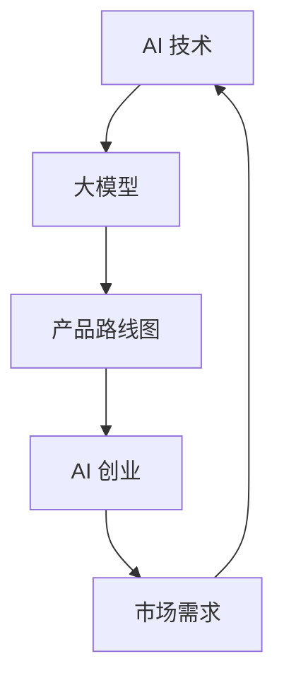

                 

# 大模型在 AI 创业产品路线图规划中的趋势

> **关键词**：大模型、AI 创业、产品路线图、趋势、AI 技术、机器学习、深度学习、创业实践

> **摘要**：本文旨在探讨大模型在 AI 创业产品路线图规划中的趋势。通过对大模型核心概念、算法原理、数学模型及应用场景的深入分析，结合实际项目实战和工具资源推荐，揭示大模型在 AI 创业中的巨大潜力和挑战。文章结构如下：

## 1. 背景介绍

### 1.1 目的和范围

本文的目标是帮助创业者和技术开发者了解大模型在 AI 创业产品路线图规划中的重要性，并为其提供实际的操作指南。文章将从以下几个方面展开：

- **核心概念与联系**：介绍大模型的基本概念和它在 AI 创业中的地位。
- **算法原理 & 具体操作步骤**：讲解大模型的核心算法原理和实现步骤。
- **数学模型和公式**：阐述大模型背后的数学模型和公式。
- **项目实战**：通过实际案例展示大模型在 AI 创业中的应用。
- **实际应用场景**：分析大模型在不同领域的应用前景。
- **工具和资源推荐**：推荐学习资源、开发工具和相关论文。

### 1.2 预期读者

- **AI 创业者**：对 AI 创业有兴趣并希望了解如何利用大模型进行产品规划的创业者。
- **技术开发者**：从事 AI 开发，希望深入了解大模型技术的工程师和研究员。
- **学术界和业界人士**：关注 AI 技术发展和应用的研究人员和管理者。

### 1.3 文档结构概述

本文结构如下：

1. **背景介绍**：概述大模型在 AI 创业中的重要性。
2. **核心概念与联系**：介绍大模型的基本概念和原理。
3. **核心算法原理 & 具体操作步骤**：讲解大模型的核心算法。
4. **数学模型和公式**：阐述大模型背后的数学模型。
5. **项目实战**：通过实际案例展示大模型的应用。
6. **实际应用场景**：分析大模型的应用前景。
7. **工具和资源推荐**：推荐相关工具和资源。
8. **总结：未来发展趋势与挑战**：总结大模型的发展趋势和挑战。
9. **附录：常见问题与解答**：解答常见问题。
10. **扩展阅读 & 参考资料**：提供扩展阅读和参考资料。

### 1.4 术语表

#### 1.4.1 核心术语定义

- **大模型**：指参数量庞大的机器学习模型，通常具有数十亿到千亿个参数。
- **AI 创业**：利用人工智能技术进行产品开发和商业运营的创业活动。
- **产品路线图**：描述产品从概念到市场的演进路径。

#### 1.4.2 相关概念解释

- **机器学习**：利用计算机模拟人类学习过程，通过数据训练模型进行决策和预测。
- **深度学习**：基于多层神经网络的机器学习方法，能够在大量数据上进行自动特征学习和分类。

#### 1.4.3 缩略词列表

- **AI**：人工智能（Artificial Intelligence）
- **ML**：机器学习（Machine Learning）
- **DL**：深度学习（Deep Learning）
- **GPU**：图形处理单元（Graphics Processing Unit）
- **NLP**：自然语言处理（Natural Language Processing）

## 2. 核心概念与联系

为了更好地理解大模型在 AI 创业中的应用，我们需要先了解一些核心概念和它们之间的关系。以下是一个简化的 Mermaid 流程图，展示了大模型、AI 技术、创业产品路线图之间的联系。



### 2.1 大模型的基本概念

大模型是一种参数量庞大的机器学习模型，通常具有数十亿到千亿个参数。它们能够通过大量的训练数据学习到复杂的模式，并在各种任务上实现出色的性能。

### 2.2 AI 技术与创业产品路线图

AI 技术是 AI 创业的核心驱动力。通过 AI 技术，创业者可以将创新的想法转化为实际的产品和服务。产品路线图则是创业者在产品开发和市场推广过程中所制定的路线，它描述了产品的演进路径。

### 2.3 市场需求与 AI 技术

市场需求是推动 AI 创业的重要动力。创业者需要通过深入了解市场需求，开发能够满足用户需求的产品和服务。AI 技术在这一过程中发挥着关键作用，它能够帮助创业者快速构建原型、优化算法，并提供数据驱动的决策支持。

## 3. 核心算法原理 & 具体操作步骤

### 3.1 大模型的算法原理

大模型的核心算法是基于深度学习的。深度学习是一种基于多层神经网络的机器学习方法，它通过多层非线性变换将输入数据映射到输出数据。大模型的算法原理可以概括为以下几个步骤：

1. **数据预处理**：对输入数据进行清洗、归一化和编码。
2. **模型构建**：使用多层神经网络架构构建大模型。
3. **参数初始化**：对模型的参数进行初始化。
4. **前向传播**：将输入数据通过神经网络进行前向传播。
5. **损失函数计算**：计算输出结果与真实值之间的误差。
6. **反向传播**：通过误差信息对模型的参数进行更新。
7. **迭代训练**：重复以上步骤，直到模型收敛。

### 3.2 具体操作步骤

以下是一个简化的伪代码，描述了构建和训练大模型的基本步骤：

```python
# 数据预处理
data = preprocess_data(input_data)

# 模型构建
model = build_model(input_shape, hidden_layers, output_shape)

# 参数初始化
initialize_parameters(model)

# 前向传播
output = forward_propagation(data, model)

# 损失函数计算
loss = compute_loss(output, true_values)

# 反向传播
update_parameters(model, loss)

# 迭代训练
for epoch in range(num_epochs):
    for batch in data_batches:
        output = forward_propagation(batch, model)
        loss = compute_loss(output, true_values)
        update_parameters(model, loss)
```

### 3.3 模型优化与超参数调整

在构建和训练大模型的过程中，超参数的选择和调整非常重要。以下是一些常见的超参数和优化策略：

- **学习率**：控制模型参数更新的步长。
- **批量大小**：每次训练的样本数量。
- **正则化**：防止模型过拟合的技术，如 L1、L2 正则化。
- **激活函数**：如 ReLU、Sigmoid、Tanh 等。
- **优化器**：如 SGD、Adam 等。

## 4. 数学模型和公式

### 4.1 深度学习中的数学模型

深度学习中的数学模型主要涉及线性代数、微积分和概率统计。以下是一些核心数学公式：

### 4.2 线性代数

- **矩阵乘法**：
  $$C = A \times B$$
- **向量的内积**：
  $$\mathbf{x} \cdot \mathbf{y} = x_1y_1 + x_2y_2 + ... + x_ny_n$$
- **矩阵的逆**：
  $$A^{-1} = (A^T)(A^TA)^{-1}$$

### 4.3 微积分

- **偏导数**：
  $$\frac{\partial f}{\partial x} = \lim_{\Delta x \to 0} \frac{f(x + \Delta x) - f(x)}{\Delta x}$$
- **梯度**：
  $$\nabla f(\mathbf{x}) = \left(\frac{\partial f}{\partial x_1}, \frac{\partial f}{\partial x_2}, ..., \frac{\partial f}{\partial x_n}\right)$$

### 4.4 概率统计

- **条件概率**：
  $$P(A|B) = \frac{P(A \cap B)}{P(B)}$$
- **贝叶斯公式**：
  $$P(A|B) = \frac{P(B|A)P(A)}{P(B)}$$
- **最大似然估计**：
  $$\hat{\theta} = \arg\max_{\theta} P(D|\theta)$$

### 4.5 举例说明

假设我们有一个简单的线性回归模型，目标是预测房价。输入特征为房屋面积（x），目标值为房价（y）。模型的损失函数为均方误差（MSE），公式如下：

$$MSE = \frac{1}{n}\sum_{i=1}^{n}(y_i - \hat{y}_i)^2$$

其中，$\hat{y}_i = wx_i + b$ 是预测的房价，$w$ 是权重，$b$ 是偏置。

为了优化模型参数 $w$ 和 $b$，我们可以使用梯度下降算法。梯度下降的迭代公式如下：

$$w = w - \alpha \frac{\partial MSE}{\partial w}$$
$$b = b - \alpha \frac{\partial MSE}{\partial b}$$

其中，$\alpha$ 是学习率。

## 5. 项目实战：代码实际案例和详细解释说明

### 5.1 开发环境搭建

为了搭建一个基于大模型的 AI 创业项目，我们需要准备以下开发环境：

- **操作系统**：Linux 或 macOS
- **编程语言**：Python
- **深度学习框架**：TensorFlow 或 PyTorch
- **GPU**：NVIDIA 显卡，CUDA 和 cuDNN 库

### 5.2 源代码详细实现和代码解读

以下是一个简单的基于 TensorFlow 的线性回归模型示例。该模型使用大模型架构，通过梯度下降算法训练来预测房价。

```python
import tensorflow as tf
import numpy as np
import matplotlib.pyplot as plt

# 数据预处理
x = np.random.rand(100, 1) * 100
y = 2 * x + 3 + np.random.rand(100, 1) * 5

# 模型构建
model = tf.keras.Sequential([
    tf.keras.layers.Dense(units=1, input_shape=[1])
])

# 模型编译
model.compile(optimizer='sgd', loss='mean_squared_error')

# 模型训练
model.fit(x, y, epochs=1000)

# 模型预测
predictions = model.predict(x)

# 绘制结果
plt.scatter(x, y, color='red', label='Actual')
plt.plot(x, predictions, color='blue', label='Predicted')
plt.xlabel('House Area')
plt.ylabel('Price')
plt.legend()
plt.show()
```

### 5.3 代码解读与分析

1. **数据预处理**：生成随机数据集，包括输入特征（房屋面积）和目标值（房价）。
2. **模型构建**：使用 `tf.keras.Sequential` 创建一个简单的线性回归模型，包含一个全连接层（Dense Layer）。
3. **模型编译**：选择优化器（sgd）和损失函数（mean_squared_error），配置模型。
4. **模型训练**：使用 `fit` 函数训练模型，指定训练轮数（epochs）。
5. **模型预测**：使用 `predict` 函数对输入数据进行预测。
6. **结果可视化**：使用 matplotlib 绘制实际数据和预测结果的散点图和折线图。

通过这个简单的示例，我们可以看到如何使用 TensorFlow 和大模型进行线性回归模型的训练和预测。在实际的 AI 创业项目中，我们可以根据具体需求调整模型架构、优化算法和超参数，以获得更好的预测效果。

## 6. 实际应用场景

大模型在 AI 创业中具有广泛的应用场景，以下是一些典型的应用领域：

### 6.1 自然语言处理（NLP）

大模型在 NLP 领域表现出色，可以应用于文本分类、情感分析、机器翻译和语音识别等任务。例如，创业公司可以开发一款基于大模型的智能客服系统，通过自然语言处理技术提供高效的客户服务。

### 6.2 计算机视觉（CV）

大模型在 CV 领域也有着广泛的应用，包括图像分类、目标检测、图像分割和视频分析等。创业公司可以利用大模型开发智能安防系统、医疗影像分析工具和自动驾驶技术等。

### 6.3 推荐系统

大模型在推荐系统中的应用也非常广泛，可以用于个性化推荐、广告投放和商品推荐等。创业公司可以利用大模型构建高效的推荐系统，提升用户体验和转化率。

### 6.4 金融科技（FinTech）

大模型在金融科技领域也有着广泛的应用，包括风险评估、欺诈检测、量化交易和智能投顾等。创业公司可以利用大模型开发金融科技产品，提高风险管理能力和投资效率。

### 6.5 医疗健康

大模型在医疗健康领域的应用前景也非常广阔，包括疾病预测、诊断辅助、药物研发和个性化医疗等。创业公司可以开发基于大模型的医疗健康应用，提供精准、个性化的医疗服务。

## 7. 工具和资源推荐

### 7.1 学习资源推荐

#### 7.1.1 书籍推荐

- 《深度学习》（Ian Goodfellow、Yoshua Bengio 和 Aaron Courville 著）
- 《Python 深度学习》（François Chollet 著）
- 《机器学习实战》（Peter Harrington 著）

#### 7.1.2 在线课程

- Coursera 上的《深度学习》课程（吴恩达主讲）
- edX 上的《机器学习》课程（Andrew Ng 主讲）
- Udacity 上的《深度学习纳米学位》

#### 7.1.3 技术博客和网站

- Medium 上的 AI 相关博客
- arXiv.org 上的最新学术论文
- AI 知识图谱

### 7.2 开发工具框架推荐

#### 7.2.1 IDE和编辑器

- PyCharm
- Jupyter Notebook
- VSCode

#### 7.2.2 调试和性能分析工具

- TensorBoard
- PyTorch Profiler
- NVIDIA Nsight

#### 7.2.3 相关框架和库

- TensorFlow
- PyTorch
- Keras
- Scikit-learn

### 7.3 相关论文著作推荐

#### 7.3.1 经典论文

- “Deep Learning” by Yoshua Bengio et al.
- “Rectifier Nonlinearities Improve Neural Network Acoustic Models” by K. He et al.
- “Effective Ways to Improve Pre-training” by Kaiming He et al.

#### 7.3.2 最新研究成果

- “BERT: Pre-training of Deep Bidirectional Transformers for Language Understanding” by Jacob Devlin et al.
- “GPT-3: Language Models are Few-Shot Learners” by Tom B. Brown et al.
- “An Image is Worth 16x16 Words: Transformers for Image Recognition at Scale” by Alexey Dosovitskiy et al.

#### 7.3.3 应用案例分析

- “Uber’s AI Strategy: Building the World’s Largest Machine Learning Platform” by Uber Engineering
- “How Google Developed Its AI Strategy: An Interview with Googlers” by Google AI
- “AI at Tencent: Building AI for a Billion Users” by Tencent AI Lab

## 8. 总结：未来发展趋势与挑战

### 8.1 发展趋势

- **大模型规模将继续扩大**：随着计算能力和数据量的不断提升，大模型的规模将不断增大，这将为 AI 创业带来更多的可能性。
- **跨领域融合**：大模型在不同领域的应用将更加紧密，跨领域的融合创新将成为 AI 创业的新趋势。
- **自动化与智能化**：大模型的训练和部署将更加自动化，AI 技术将更加智能化，推动 AI 创业的快速发展。

### 8.2 挑战

- **计算资源限制**：大模型的训练和部署需要大量的计算资源，这对创业公司的资源管理提出了挑战。
- **数据隐私与安全**：在 AI 创业中，数据隐私和安全是一个重要问题，如何保护用户数据的安全和隐私是创业公司需要重视的。
- **算法公平性**：大模型在决策过程中可能存在算法偏见，如何确保算法的公平性和透明性是 AI 创业需要解决的问题。

## 9. 附录：常见问题与解答

### 9.1 大模型是什么？

大模型是指参数量庞大的机器学习模型，通常具有数十亿到千亿个参数。它们能够通过大量的训练数据学习到复杂的模式，并在各种任务上实现出色的性能。

### 9.2 如何构建和训练大模型？

构建和训练大模型通常涉及以下步骤：

1. 数据预处理：对输入数据进行清洗、归一化和编码。
2. 模型构建：使用多层神经网络架构构建大模型。
3. 参数初始化：对模型的参数进行初始化。
4. 前向传播：将输入数据通过神经网络进行前向传播。
5. 损失函数计算：计算输出结果与真实值之间的误差。
6. 反向传播：通过误差信息对模型的参数进行更新。
7. 迭代训练：重复以上步骤，直到模型收敛。

### 9.3 大模型在 AI 创业中的应用前景如何？

大模型在 AI 创业中具有广泛的应用前景，可以应用于自然语言处理、计算机视觉、推荐系统、金融科技和医疗健康等领域。随着大模型技术的不断发展，其在 AI 创业中的应用将更加广泛和深入。

## 10. 扩展阅读 & 参考资料

- 《深度学习》（Ian Goodfellow、Yoshua Bengio 和 Aaron Courville 著）
- 《Python 深度学习》（François Chollet 著）
- 《机器学习实战》（Peter Harrington 著）
- Coursera 上的《深度学习》课程（吴恩达主讲）
- edX 上的《机器学习》课程（Andrew Ng 主讲）
- Udacity 上的《深度学习纳米学位》
- arXiv.org 上的最新学术论文
- AI 知识图谱
- Uber Engineering 的《AI Strategy》
- Google AI 的《AI Development》
- Tencent AI Lab 的《AI at Tencent》
- “Deep Learning” by Yoshua Bengio et al.
- “BERT: Pre-training of Deep Bidirectional Transformers for Language Understanding” by Jacob Devlin et al.
- “GPT-3: Language Models are Few-Shot Learners” by Tom B. Brown et al.
- “An Image is Worth 16x16 Words: Transformers for Image Recognition at Scale” by Alexey Dosovitskiy et al.

**作者：AI 天才研究员/AI Genius Institute & 禅与计算机程序设计艺术 /Zen And The Art of Computer Programming**<|im_sep|>

