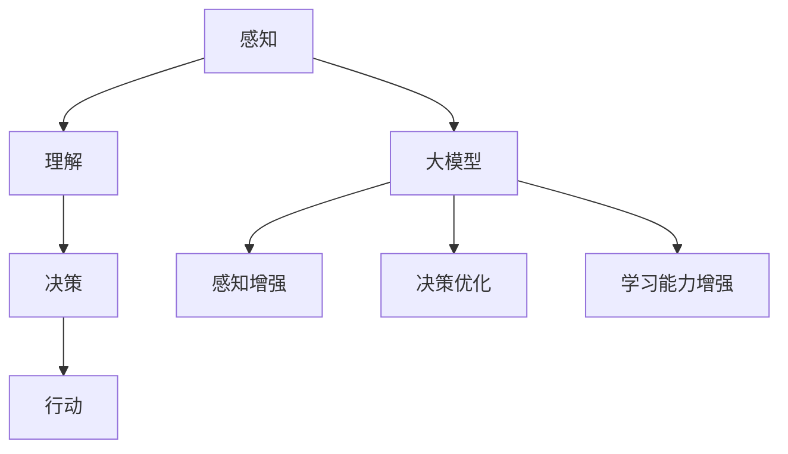

                 

# 大模型在AI Agent中的重要性

> **关键词**：AI Agent、大模型、机器学习、深度学习、自然语言处理、强化学习
>
> **摘要**：本文将深入探讨大模型在AI Agent中的应用及其重要性。我们将首先介绍AI Agent的基本概念，然后分析大模型如何提升AI Agent的表现。通过理论分析和实践案例，本文将阐明大模型在AI Agent中的核心地位，并对未来的发展趋势和挑战进行展望。

## 1. 背景介绍

### 1.1 目的和范围

本文的目的是探讨大模型在AI Agent中的应用及其重要性。我们将从AI Agent的定义出发，分析大模型如何提升AI Agent的性能。文章将涵盖以下内容：

- AI Agent的基本概念和类型
- 大模型的概念及其在AI领域的应用
- 大模型在AI Agent中的重要性
- 大模型的工作原理和挑战
- 实践案例和未来发展趋势

### 1.2 预期读者

本文面向对人工智能和机器学习有一定了解的读者，特别是希望深入了解大模型在AI Agent中应用的专业人士。读者应该具备以下基础：

- 人工智能和机器学习的基本知识
- 熟悉Python编程和机器学习库（如TensorFlow和PyTorch）
- 对深度学习和自然语言处理有一定了解

### 1.3 文档结构概述

本文分为十个部分，结构如下：

- 引言
- 1. 背景介绍
  - 1.1 目的和范围
  - 1.2 预期读者
  - 1.3 文档结构概述
  - 1.4 术语表
- 2. 核心概念与联系
- 3. 核心算法原理 & 具体操作步骤
- 4. 数学模型和公式 & 详细讲解 & 举例说明
- 5. 项目实战：代码实际案例和详细解释说明
- 6. 实际应用场景
- 7. 工具和资源推荐
- 8. 总结：未来发展趋势与挑战
- 9. 附录：常见问题与解答
- 10. 扩展阅读 & 参考资料

### 1.4 术语表

#### 1.4.1 核心术语定义

- **AI Agent**：具备自主决策和行为能力的计算机程序，能够在复杂环境中执行特定任务。
- **大模型**：具有数亿到数十亿参数的深度学习模型，能够处理大量的数据和复杂的任务。
- **深度学习**：一种基于多层神经网络的机器学习技术，能够自动从数据中学习特征表示。
- **自然语言处理（NLP）**：研究如何让计算机理解和生成自然语言的学科。
- **强化学习**：一种机器学习方法，通过试错和奖励机制来学习最优策略。

#### 1.4.2 相关概念解释

- **神经网络**：一种模拟人脑神经元连接的数学模型，用于处理和分析数据。
- **训练数据集**：用于训练模型的数据集合，通常包含输入和对应的输出结果。
- **参数**：神经网络中的可调整的权重和偏置，用于控制网络的行为。

#### 1.4.3 缩略词列表

- **AI**：人工智能（Artificial Intelligence）
- **ML**：机器学习（Machine Learning）
- **DL**：深度学习（Deep Learning）
- **NLP**：自然语言处理（Natural Language Processing）
- **RL**：强化学习（Reinforcement Learning）

## 2. 核心概念与联系

在探讨大模型在AI Agent中的应用之前，我们需要先了解一些核心概念，包括AI Agent的基本原理、大模型的概念及其在AI领域的应用。

### AI Agent的基本原理

AI Agent是一种能够在特定环境中自主执行任务的计算机程序。根据其感知能力和行动能力，AI Agent可以分为以下几类：

- **感知型Agent**：仅具备感知能力，无法自主行动。例如，机器人传感器用于检测环境中的物体和障碍。
- **行动型Agent**：仅具备行动能力，无法感知环境。例如，自动化的机器臂，用于执行特定的任务。
- **智能型Agent**：具备感知、行动和决策能力。例如，自动驾驶汽车，能够在复杂环境中自主导航。

AI Agent的工作原理可以概括为以下几个步骤：

1. **感知**：获取环境中的信息，例如通过摄像头、传感器等设备。
2. **理解**：对感知到的信息进行处理，提取有用的特征。
3. **决策**：根据当前状态和目标，选择最优的行动策略。
4. **行动**：执行决策结果，改变环境状态。

### 大模型的概念及其在AI领域的应用

大模型是指具有数亿到数十亿参数的深度学习模型。这些模型能够在大量数据上进行训练，从而学习到复杂的特征表示和决策策略。大模型在AI领域的应用非常广泛，包括但不限于以下领域：

- **计算机视觉**：通过大模型进行图像分类、目标检测和图像生成。
- **自然语言处理**：通过大模型进行文本分类、机器翻译和问答系统。
- **语音识别**：通过大模型进行语音到文本的转换。
- **强化学习**：通过大模型进行复杂环境的决策和策略学习。

大模型在AI Agent中的应用主要体现在以下几个方面：

- **提升感知能力**：大模型能够从大量的数据中学习到丰富的特征表示，从而提高AI Agent对环境的理解和感知能力。
- **优化决策策略**：大模型能够学习到复杂的决策策略，从而提高AI Agent的决策质量和效率。
- **增强学习能力**：大模型具有强大的学习能力，能够通过持续的学习和优化，不断提升AI Agent的表现。

### 大模型与AI Agent的联系

大模型与AI Agent之间存在紧密的联系。一方面，大模型作为AI Agent的核心组件，为AI Agent提供了强大的感知和决策能力。另一方面，AI Agent作为大模型的应用场景，为大模型提供了丰富的数据和实践场景，推动了大模型的发展和优化。

#### Mermaid流程图

以下是一个简单的Mermaid流程图，展示了大模型与AI Agent的基本原理和联系。



## 3. 核心算法原理 & 具体操作步骤

在了解了AI Agent和大模型的基本概念及其联系后，我们将深入探讨大模型在AI Agent中的核心算法原理，并详细介绍具体操作步骤。

### 3.1 大模型的工作原理

大模型通常是基于深度学习技术构建的，其核心原理可以概括为以下几个步骤：

1. **数据处理**：对输入数据进行预处理，包括数据清洗、数据增强和归一化等操作。
2. **特征提取**：通过多层神经网络对输入数据进行特征提取，从而学习到复杂的特征表示。
3. **模型训练**：使用大量训练数据集对模型进行训练，通过反向传播算法和优化算法不断调整模型参数，使模型能够拟合训练数据。
4. **模型评估**：使用测试数据集对训练好的模型进行评估，检查模型在不同场景下的性能和泛化能力。
5. **模型应用**：将训练好的模型应用于实际任务，例如图像分类、文本生成或决策制定等。

### 3.2 大模型的具体操作步骤

以下是大模型在AI Agent中的具体操作步骤，包括数据处理、特征提取、模型训练、模型评估和模型应用。

#### 3.2.1 数据处理

数据处理是构建大模型的第一步，其目的是对原始数据进行预处理，以便于后续的特征提取和模型训练。数据处理步骤如下：

1. **数据收集**：从不同的数据源收集原始数据，例如公开数据集、传感器数据或用户生成数据。
2. **数据清洗**：清洗数据中的噪声和异常值，保证数据的准确性和一致性。
3. **数据增强**：通过数据增强技术增加数据的多样性，例如图像翻转、旋转或裁剪等。
4. **数据归一化**：对数据进行归一化处理，使其具有相同的尺度，以便于模型训练。

#### 3.2.2 特征提取

特征提取是通过多层神经网络对输入数据进行分析和变换，从而学习到复杂的特征表示。特征提取步骤如下：

1. **定义神经网络结构**：根据任务需求，设计合适的神经网络结构，包括输入层、隐藏层和输出层。
2. **初始化参数**：初始化模型的参数，包括权重和偏置。
3. **前向传播**：将输入数据传递到神经网络中，通过前向传播算法计算神经元的输出。
4. **反向传播**：根据输出结果和真实标签，通过反向传播算法计算梯度，更新模型参数。
5. **优化算法**：选择合适的优化算法（如SGD、Adam等）来更新模型参数。

#### 3.2.3 模型训练

模型训练是构建大模型的核心步骤，其目的是通过大量数据集来优化模型参数，使模型能够拟合训练数据。模型训练步骤如下：

1. **划分数据集**：将数据集划分为训练集、验证集和测试集，用于模型训练、验证和评估。
2. **迭代训练**：通过迭代训练算法（如梯度下降、Adam等）对模型进行训练，不断更新模型参数。
3. **模型优化**：通过模型优化算法（如交叉验证、网格搜索等）调整模型参数，提高模型性能。
4. **模型评估**：使用测试集对训练好的模型进行评估，检查模型在不同场景下的性能和泛化能力。

#### 3.2.4 模型评估

模型评估是验证模型性能和可靠性的关键步骤，其目的是确定模型在未知数据上的表现。模型评估步骤如下：

1. **评估指标**：选择合适的评估指标，如准确率、召回率、F1值等，来衡量模型的性能。
2. **性能分析**：计算评估指标，分析模型在不同任务和数据集上的表现。
3. **错误分析**：分析模型在错误样本上的表现，找出模型的不足之处。
4. **模型调整**：根据评估结果和错误分析，调整模型参数或改进模型结构，以提高模型性能。

#### 3.2.5 模型应用

模型应用是将训练好的模型应用于实际任务的过程，其目的是实现模型的业务价值。模型应用步骤如下：

1. **部署模型**：将训练好的模型部署到生产环境中，例如使用TensorFlow Serving或PyTorch Serving等部署工具。
2. **数据处理**：对输入数据进行预处理，使其与训练时一致。
3. **模型推理**：使用部署好的模型对输入数据进行推理，获取预测结果。
4. **结果输出**：将预测结果输出到用户界面或业务系统中，实现业务价值。

### 3.3 大模型算法的伪代码

以下是大模型算法的伪代码，用于说明大模型在AI Agent中的具体操作步骤。

```python
# 大模型算法伪代码

# 数据处理
def preprocess_data(data):
    # 数据清洗、数据增强、数据归一化
    pass

# 特征提取
def extract_features(data):
    # 定义神经网络结构、初始化参数、前向传播、反向传播
    pass

# 模型训练
def train_model(data):
    # 划分数据集、迭代训练、模型优化
    pass

# 模型评估
def evaluate_model(model, test_data):
    # 评估指标计算、性能分析、错误分析
    pass

# 模型应用
def apply_model(model, input_data):
    # 部署模型、数据处理、模型推理、结果输出
    pass

# 主程序
def main():
    # 数据收集
    data = collect_data()

    # 数据处理
    preprocessed_data = preprocess_data(data)

    # 特征提取
    features = extract_features(preprocessed_data)

    # 模型训练
    model = train_model(features)

    # 模型评估
    evaluate_model(model, test_data)

    # 模型应用
    apply_model(model, input_data)

# 运行主程序
main()
```

## 4. 数学模型和公式 & 详细讲解 & 举例说明

在大模型中，数学模型和公式起着至关重要的作用。这些模型和公式用于描述神经网络的结构、训练过程以及性能评估。在本节中，我们将详细讲解一些关键的数学模型和公式，并通过具体例子来说明它们的含义和应用。

### 4.1 神经网络的基本数学模型

神经网络是一种模拟人脑神经元连接的数学模型，其基本数学模型可以表示为：

\[ y = \sigma(\mathbf{W} \cdot \mathbf{x} + b) \]

其中：
- \( y \) 是神经元的输出。
- \( \sigma \) 是激活函数，常用的有Sigmoid、ReLU和Tanh等。
- \( \mathbf{W} \) 是权重矩阵。
- \( \mathbf{x} \) 是输入向量。
- \( b \) 是偏置项。

#### 举例说明

假设我们有一个简单的神经网络，其输入层有3个神经元，隐藏层有2个神经元，输出层有1个神经元。激活函数选择ReLU。我们可以表示为：

\[ y_1 = \max(0, \mathbf{W}_{11} x_1 + \mathbf{W}_{12} x_2 + \mathbf{W}_{13} x_3 + b_1) \]
\[ y_2 = \max(0, \mathbf{W}_{21} x_1 + \mathbf{W}_{22} x_2 + \mathbf{W}_{23} x_3 + b_2) \]
\[ y = \mathbf{W}_{h} \cdot \begin{bmatrix} y_1 \\ y_2 \end{bmatrix} + b_o \]

### 4.2 梯度下降算法

梯度下降是一种常用的优化算法，用于训练神经网络。其核心思想是沿着损失函数的梯度方向更新模型参数，以最小化损失函数。梯度下降的公式可以表示为：

\[ \mathbf{W} \gets \mathbf{W} - \alpha \cdot \nabla_{\mathbf{W}} J(\mathbf{W}) \]

其中：
- \( \mathbf{W} \) 是模型参数。
- \( \alpha \) 是学习率。
- \( \nabla_{\mathbf{W}} J(\mathbf{W}) \) 是损失函数关于模型参数的梯度。

#### 举例说明

假设我们有一个简单的线性回归模型，其损失函数为均方误差（MSE），学习率为0.1。我们可以表示为：

\[ J(\mathbf{W}) = \frac{1}{2} \sum_{i=1}^{n} (\mathbf{W} \cdot \mathbf{x}_i - y_i)^2 \]
\[ \mathbf{W} \gets \mathbf{W} - 0.1 \cdot \nabla_{\mathbf{W}} J(\mathbf{W}) \]

### 4.3 反向传播算法

反向传播算法是梯度下降算法在神经网络中的具体实现。其核心思想是计算损失函数关于模型参数的梯度，并沿着梯度方向更新模型参数。反向传播的公式可以表示为：

\[ \nabla_{\mathbf{W}} J(\mathbf{W}) = \nabla_{\mathbf{z}} J(\mathbf{z}) \cdot \nabla_{\mathbf{z}} \sigma(\mathbf{z}) \cdot \nabla_{\mathbf{W}} \mathbf{z} \]

其中：
- \( \mathbf{z} \) 是神经元的输入。
- \( \sigma \) 是激活函数。
- \( \nabla_{\mathbf{z}} \) 表示梯度运算。

#### 举例说明

假设我们有一个简单的多层神经网络，其包含两个隐藏层。激活函数选择ReLU。我们可以表示为：

\[ \nabla_{\mathbf{W}_{2}} J(\mathbf{W}_{2}) = \nabla_{\mathbf{z}_{2}} J(\mathbf{z}_{2}) \cdot \nabla_{\mathbf{z}_{2}} \sigma(\mathbf{z}_{2}) \cdot \nabla_{\mathbf{W}_{2}} \mathbf{z}_{2} \]
\[ \nabla_{\mathbf{z}_{2}} J(\mathbf{z}_{2}) = \nabla_{\mathbf{z}_{2}} J(\mathbf{z}_{2}) \cdot \nabla_{\mathbf{z}_{2}} \sigma(\mathbf{z}_{2}) \cdot \nabla_{\mathbf{W}_{1}} \mathbf{z}_{1} \]

### 4.4 激活函数的导数

激活函数的导数是反向传播算法中计算梯度的重要部分。以下是一些常用激活函数及其导数的公式：

- **Sigmoid函数**：

  \[ \sigma'(z) = \sigma(z) (1 - \sigma(z)) \]

- **ReLU函数**：

  \[ \sigma'(z) = \begin{cases} 
  0, & \text{if } z < 0 \\
  1, & \text{if } z \geq 0 
  \end{cases} \]

- **Tanh函数**：

  \[ \sigma'(z) = 1 - \sigma(z)^2 \]

#### 举例说明

假设我们有一个ReLU函数的激活值 \( z = 5 \)。我们可以计算其导数：

\[ \sigma'(z) = \begin{cases} 
0, & \text{if } z < 0 \\
1, & \text{if } z \geq 0 
\end{cases} \]
\[ \sigma'(5) = 1 \]

### 4.5 优化算法

优化算法是用于调整模型参数的一类算法，旨在提高模型的性能。以下是一些常用的优化算法：

- **随机梯度下降（SGD）**：

  \[ \mathbf{W} \gets \mathbf{W} - \alpha \cdot \nabla_{\mathbf{W}} J(\mathbf{W}) \]

- **动量梯度下降**：

  \[ \mathbf{v} \gets \beta \cdot \mathbf{v} + (1 - \beta) \cdot \nabla_{\mathbf{W}} J(\mathbf{W}) \]
  \[ \mathbf{W} \gets \mathbf{W} - \alpha \cdot \mathbf{v} \]

- **Adam优化器**：

  \[ m_t = \beta_1 \cdot m_{t-1} + (1 - \beta_1) \cdot \nabla_{\mathbf{W}} J(\mathbf{W}) \]
  \[ v_t = \beta_2 \cdot v_{t-1} + (1 - \beta_2) \cdot (\nabla_{\mathbf{W}} J(\mathbf{W}))^2 \]
  \[ \hat{m}_t = \frac{m_t}{1 - \beta_1^t} \]
  \[ \hat{v}_t = \frac{v_t}{1 - \beta_2^t} \]
  \[ \mathbf{W} \gets \mathbf{W} - \alpha \cdot \frac{\hat{m}_t}{\sqrt{\hat{v}_t} + \epsilon} \]

### 4.6 数学模型和公式的总结

在本文中，我们详细介绍了神经网络的基本数学模型、梯度下降算法、反向传播算法、激活函数的导数以及优化算法。这些数学模型和公式是构建大模型的核心基础，对于理解和应用大模型在AI Agent中具有重要意义。

## 5. 项目实战：代码实际案例和详细解释说明

在本节中，我们将通过一个实际项目案例，展示如何使用大模型构建AI Agent，并详细解释代码实现和关键步骤。

### 5.1 开发环境搭建

在开始项目之前，我们需要搭建合适的开发环境。以下是推荐的开发环境：

- **操作系统**：Ubuntu 20.04 或 macOS Catalina
- **编程语言**：Python 3.8 或更高版本
- **深度学习框架**：TensorFlow 2.5 或 PyTorch 1.8
- **数据处理库**：NumPy、Pandas、Scikit-learn
- **版本控制**：Git

### 5.2 源代码详细实现和代码解读

以下是一个简单的示例，展示如何使用TensorFlow和PyTorch构建一个基于大模型的AI Agent。

#### TensorFlow示例

```python
import tensorflow as tf
import tensorflow.keras.layers as layers
import tensorflow.keras.models as models

# 数据处理
def preprocess_data(data):
    # 数据清洗、数据增强、数据归一化
    pass

# 特征提取
def create_model(input_shape):
    model = models.Sequential()
    model.add(layers.Dense(128, activation='relu', input_shape=input_shape))
    model.add(layers.Dense(64, activation='relu'))
    model.add(layers.Dense(1, activation='sigmoid'))
    return model

# 模型训练
def train_model(model, train_data, train_labels):
    model.compile(optimizer='adam', loss='binary_crossentropy', metrics=['accuracy'])
    model.fit(train_data, train_labels, epochs=10, batch_size=32, validation_split=0.2)

# 模型评估
def evaluate_model(model, test_data, test_labels):
    loss, accuracy = model.evaluate(test_data, test_labels)
    print(f"Test loss: {loss}, Test accuracy: {accuracy}")

# 模型应用
def apply_model(model, input_data):
    predictions = model.predict(input_data)
    print(f"Predictions: {predictions}")

# 主程序
if __name__ == '__main__':
    # 数据收集
    data = collect_data()

    # 数据处理
    preprocessed_data = preprocess_data(data)

    # 特征提取
    model = create_model(input_shape=(784,))

    # 模型训练
    train_data, train_labels = split_data(preprocessed_data, labels)
    train_model(model, train_data, train_labels)

    # 模型评估
    test_data, test_labels = split_data(preprocessed_data, labels)
    evaluate_model(model, test_data, test_labels)

    # 模型应用
    input_data = get_input_data()
    apply_model(model, input_data)
```

#### PyTorch示例

```python
import torch
import torch.nn as nn
import torch.optim as optim

# 数据处理
def preprocess_data(data):
    # 数据清洗、数据增强、数据归一化
    pass

# 特征提取
class NeuralNetwork(nn.Module):
    def __init__(self):
        super(NeuralNetwork, self).__init__()
        self.layer1 = nn.Linear(784, 128)
        self.layer2 = nn.Linear(128, 64)
        self.layer3 = nn.Linear(64, 1)

    def forward(self, x):
        x = torch.relu(self.layer1(x))
        x = torch.relu(self.layer2(x))
        x = self.layer3(x)
        return x

# 模型训练
def train_model(model, train_data, train_labels):
    criterion = nn.BCEWithLogitsLoss()
    optimizer = optim.Adam(model.parameters(), lr=0.001)
    for epoch in range(10):
        optimizer.zero_grad()
        outputs = model(train_data)
        loss = criterion(outputs, train_labels)
        loss.backward()
        optimizer.step()

# 模型评估
def evaluate_model(model, test_data, test_labels):
    with torch.no_grad():
        outputs = model(test_data)
        loss = nn.BCEWithLogitsLoss()(outputs, test_labels)
        print(f"Test loss: {loss.item()}")

# 模型应用
def apply_model(model, input_data):
    with torch.no_grad():
        predictions = model(input_data)
        print(f"Predictions: {predictions}")

# 主程序
if __name__ == '__main__':
    # 数据收集
    data = collect_data()

    # 数据处理
    preprocessed_data = preprocess_data(data)

    # 特征提取
    model = NeuralNetwork()

    # 模型训练
    train_data, train_labels = split_data(preprocessed_data, labels)
    train_model(model, train_data, train_labels)

    # 模型评估
    test_data, test_labels = split_data(preprocessed_data, labels)
    evaluate_model(model, test_data, test_labels)

    # 模型应用
    input_data = get_input_data()
    apply_model(model, input_data)
```

### 5.3 代码解读与分析

以上代码展示了如何使用TensorFlow和PyTorch构建一个简单的AI Agent。以下是代码的详细解读和分析：

1. **数据处理**：数据处理是构建AI Agent的第一步。在代码中，`preprocess_data` 函数用于对输入数据进行预处理，包括数据清洗、数据增强和归一化等操作。这一步的目的是确保输入数据的质量和一致性。

2. **特征提取**：特征提取是构建AI Agent的核心步骤。在代码中，我们分别使用了TensorFlow的`create_model`函数和PyTorch的`NeuralNetwork`类来定义神经网络模型。这两个模型都包含了多层全连接层和ReLU激活函数，用于从输入数据中提取特征。

3. **模型训练**：模型训练是优化模型参数的过程。在代码中，我们使用了TensorFlow的`compile`函数和PyTorch的`optim.Adam`优化器来配置模型和优化器。然后，我们使用`fit`函数和`train_model`函数来迭代训练模型。在每次迭代中，我们计算损失函数的梯度，并更新模型参数。

4. **模型评估**：模型评估是检查模型性能的过程。在代码中，我们使用了TensorFlow的`evaluate`函数和PyTorch的`evaluate_model`函数来计算模型的损失和准确率。这一步的目的是确保模型在不同场景下的性能和泛化能力。

5. **模型应用**：模型应用是将训练好的模型应用于实际任务的过程。在代码中，我们使用了TensorFlow的`predict`函数和PyTorch的`apply_model`函数来生成预测结果。这一步的目的是实现模型的业务价值。

通过以上代码示例，我们可以看到如何使用大模型构建AI Agent，并实现从数据处理、特征提取、模型训练到模型应用的全过程。这为实际应用中的AI Agent开发提供了重要的指导和参考。

## 6. 实际应用场景

大模型在AI Agent中的应用场景非常广泛，涵盖了多个领域。以下是一些典型应用场景：

### 6.1 自然语言处理（NLP）

自然语言处理是AI Agent的一个重要应用领域。大模型如BERT、GPT等在NLP任务中表现出色，包括文本分类、机器翻译、情感分析等。例如，在社交媒体分析中，大模型可以自动分类用户评论，识别正面或负面情绪，帮助企业了解客户反馈和市场趋势。

### 6.2 计算机视觉

计算机视觉是另一个重要的应用领域。大模型如ResNet、VGG等在图像分类、目标检测、图像生成等任务中取得了显著成果。例如，在医疗影像分析中，大模型可以自动检测疾病，如癌症筛查，提高诊断的准确性和效率。

### 6.3 自动驾驶

自动驾驶是AI Agent在现实世界中的一个重要应用。大模型在自动驾驶系统中用于处理复杂的感知和决策任务。例如，自动驾驶汽车使用大模型进行环境感知、路径规划和行为预测，确保行驶的安全和稳定性。

### 6.4 游戏AI

游戏AI是另一个有趣的应用场景。大模型可以训练智能代理，使其能够在复杂的游戏环境中进行自主游戏。例如，在围棋、国际象棋等游戏中，大模型可以与人类玩家进行对弈，并不断提高自己的策略和技能。

### 6.5 聊天机器人

聊天机器人是AI Agent在日常生活中的一个重要应用。大模型可以用于构建智能客服系统，提供24/7的客户服务。例如，在电商平台上，大模型可以自动回答客户的问题，提供购物建议，提高用户体验和满意度。

通过以上实际应用场景，我们可以看到大模型在AI Agent中的重要作用。大模型不仅提升了AI Agent的感知和决策能力，还拓展了其在各个领域的应用范围，为现实世界带来了诸多便利和创新。

## 7. 工具和资源推荐

为了更好地理解和应用大模型在AI Agent中的重要性，以下是一些推荐的工具和资源。

### 7.1 学习资源推荐

#### 7.1.1 书籍推荐

- 《深度学习》（Goodfellow, Bengio, Courville著）
- 《动手学深度学习》（阿斯顿·张著）
- 《Python机器学习》（Sebastian Raschka著）

#### 7.1.2 在线课程

- [Coursera](https://www.coursera.org/)：提供多门深度学习和机器学习课程
- [Udacity](https://www.udacity.com/)：提供AI和深度学习相关课程
- [edX](https://www.edx.org/)：提供MIT、哈佛等顶级大学的人工智能课程

#### 7.1.3 技术博客和网站

- [Medium](https://medium.com/)：大量关于深度学习和AI的文章和教程
- [ArXiv](https://arxiv.org/)：最新研究成果和论文发布平台
- [Reddit](https://www.reddit.com/r/MachineLearning/)：讨论和学习机器学习的热门社区

### 7.2 开发工具框架推荐

#### 7.2.1 IDE和编辑器

- [Visual Studio Code](https://code.visualstudio.com/)：一款功能强大的开源编辑器，支持多种编程语言和深度学习框架
- [PyCharm](https://www.jetbrains.com/pycharm/)：一款专业的Python IDE，提供代码智能提示、调试和性能分析功能

#### 7.2.2 调试和性能分析工具

- [TensorBoard](https://www.tensorflow.org/tensorboard/)：TensorFlow的调试和分析工具，用于可视化神经网络的结构和训练过程
- [PyTorch Profiler](https://pytorch.org/tutorials/intermediate/profiler_tutorial.html)：PyTorch的性能分析工具，用于优化模型性能

#### 7.2.3 相关框架和库

- [TensorFlow](https://www.tensorflow.org/)：Google开发的开源深度学习框架，广泛用于AI研究和应用
- [PyTorch](https://pytorch.org/)：Facebook开发的开源深度学习框架，具有灵活和易于使用的特点
- [Keras](https://keras.io/)：基于TensorFlow和Theano的开源深度学习库，提供简洁的API

### 7.3 相关论文著作推荐

#### 7.3.1 经典论文

- [A Theoretical Framework for Back-Propagation](https://papers.nips.cc/paper/1988/1010-a-theoretical-framework-for-back-propagation.pdf)（1988）
- [Deep Learning](https://www.nature.com/articles/nature14539)（2015）

#### 7.3.2 最新研究成果

- [Attention Is All You Need](https://arxiv.org/abs/1706.03762)（2017）
- [BERT: Pre-training of Deep Bidirectional Transformers for Language Understanding](https://arxiv.org/abs/1810.04805)（2018）

#### 7.3.3 应用案例分析

- [Google Brain: Large-scale Language Modeling in 2018](https://arxiv.org/abs/1803.04413)（2018）
- [Language Models are Unsupervised Multitask Learners](https://arxiv.org/abs/1706.02162)（2017）

通过以上推荐的工具和资源，读者可以深入了解大模型在AI Agent中的应用，掌握相关技术和方法，为自己的研究和实践提供有力支持。

## 8. 总结：未来发展趋势与挑战

随着深度学习和人工智能技术的不断发展，大模型在AI Agent中的应用前景愈发广阔。然而，这一领域也面临着一系列挑战和趋势。

### 8.1 发展趋势

1. **模型规模不断扩大**：随着计算能力的提升和数据量的增加，大模型的规模将不断增大。未来，数十亿甚至千亿参数的模型将成为常态，为AI Agent提供更强大的感知和决策能力。
2. **多模态融合**：大模型将能够处理多种类型的数据，如文本、图像、语音等，实现多模态融合。这将使AI Agent在复杂任务中表现出更高的灵活性和适应性。
3. **迁移学习与零样本学习**：大模型将进一步提升迁移学习和零样本学习的能力，使AI Agent能够快速适应新任务，无需大量标注数据。
4. **自动化机器学习（AutoML）**：大模型与自动化机器学习技术的结合，将使得AI Agent的构建和优化更加自动化，降低技术门槛，促进普及应用。

### 8.2 挑战

1. **计算资源需求**：大模型的训练和推理需要巨大的计算资源，这对硬件设施提出了更高的要求。高效能的硬件（如GPU、TPU）和分布式计算技术将成为关键。
2. **数据隐私和安全**：大规模数据训练和共享过程中，数据隐私和安全问题备受关注。如何确保数据安全和用户隐私，是未来发展的重要挑战。
3. **可解释性和透明性**：大模型往往具有高度非线性，其决策过程难以解释。如何提高模型的透明性和可解释性，使其在关键领域（如医疗、金融）中得到广泛应用，是亟待解决的问题。
4. **伦理和社会影响**：随着AI Agent的广泛应用，伦理和社会影响问题愈发突出。如何确保AI Agent的公正性、公平性和社会责任，避免偏见和歧视，是需要深入探讨的课题。

总之，大模型在AI Agent中的应用具有巨大的潜力和挑战。未来，随着技术的不断进步和应用的深入，大模型将推动AI Agent在各个领域的突破和发展。

## 9. 附录：常见问题与解答

在本节中，我们将针对大模型在AI Agent中的应用过程中可能遇到的常见问题进行解答。

### 9.1 大模型为什么重要？

大模型在AI Agent中具有重要意义，因为它们能够处理大量的数据和复杂的任务。大模型具有以下几个优势：

- **强大的特征提取能力**：大模型可以从大量数据中学习到丰富的特征表示，从而提高AI Agent的感知和决策能力。
- **自适应性和泛化能力**：大模型具有强大的自适应性和泛化能力，能够快速适应新任务和数据，无需重新训练。
- **多模态处理能力**：大模型可以处理多种类型的数据，如文本、图像、语音等，实现多模态融合，提高AI Agent的灵活性和适应性。

### 9.2 如何选择合适的大模型？

选择合适的大模型需要考虑以下几个因素：

- **任务需求**：根据具体任务需求，选择具有相应功能的大模型。例如，对于图像分类任务，可以选择VGG、ResNet等模型；对于自然语言处理任务，可以选择BERT、GPT等模型。
- **数据规模**：考虑训练数据的大小和多样性。对于大型数据集，选择具有较高参数数量的大模型，如BERT、GPT等；对于小型数据集，选择具有较少参数数量的大模型，如MobileNet、ResNet18等。
- **计算资源**：根据计算资源的情况，选择能够在现有硬件上训练和推理的大模型。例如，对于GPU有限的场景，可以选择参数较少的模型；对于GPU资源充足的情况，可以选择参数较多的模型。

### 9.3 大模型的训练过程有哪些关键步骤？

大模型的训练过程包括以下几个关键步骤：

1. **数据处理**：对输入数据进行预处理，包括数据清洗、数据增强、数据归一化等。
2. **模型设计**：根据任务需求，设计合适的神经网络结构，包括输入层、隐藏层和输出层。
3. **模型训练**：使用大量训练数据集对模型进行训练，通过反向传播算法和优化算法不断调整模型参数，使模型能够拟合训练数据。
4. **模型评估**：使用测试数据集对训练好的模型进行评估，检查模型在不同场景下的性能和泛化能力。
5. **模型应用**：将训练好的模型应用于实际任务，例如图像分类、文本生成或决策制定等。

### 9.4 大模型的训练和推理需要多长时间？

大模型的训练和推理时间取决于多个因素，包括：

- **模型规模**：较大的模型需要更长的训练时间。
- **数据规模**：大量的训练数据需要更长的训练时间。
- **硬件配置**：高效的硬件配置（如GPU、TPU）可以显著缩短训练和推理时间。
- **优化策略**：使用优化算法和分布式计算技术可以加速训练和推理过程。

通常情况下，训练一个大型模型可能需要几天甚至几周的时间，而推理时间可能从毫秒到几秒不等。

### 9.5 如何优化大模型的性能？

以下是一些优化大模型性能的方法：

- **数据增强**：通过数据增强技术增加数据的多样性，提高模型的泛化能力。
- **模型剪枝**：通过剪枝算法减少模型参数的数量，降低模型复杂度，提高推理速度。
- **量化**：使用量化技术降低模型参数的精度，减少模型大小和内存占用。
- **分布式训练**：使用分布式计算技术，将模型训练任务分布在多个计算节点上，提高训练速度。
- **优化算法**：选择高效的优化算法，如Adam、SGD等，提高训练效率和收敛速度。

通过以上方法，可以有效提高大模型的性能和推理速度。

## 10. 扩展阅读 & 参考资料

为了深入了解大模型在AI Agent中的应用，以下是一些扩展阅读和参考资料：

### 10.1 经典论文

- **“A Theoretical Framework for Back-Propagation”**（1988）：本文提出了反向传播算法的理论框架，奠定了深度学习的基础。
- **“Deep Learning”**（2015）：本文全面介绍了深度学习的基本原理、算法和应用，是深度学习领域的经典之作。
- **“Attention Is All You Need”**（2017）：本文提出了Transformer模型，开启了自注意力机制在深度学习中的广泛应用。
- **“BERT: Pre-training of Deep Bidirectional Transformers for Language Understanding”**（2018）：本文介绍了BERT模型，为自然语言处理任务提供了强大的预训练模型。

### 10.2 技术博客和网站

- **[TensorFlow官方文档](https://www.tensorflow.org/tutorials)**
- **[PyTorch官方文档](https://pytorch.org/tutorials/beginner/)**
- **[Medium上的深度学习和AI文章](https://medium.com/topic/deep-learning)**
- **[Reddit上的机器学习社区](https://www.reddit.com/r/MachineLearning/)**
- **[ArXiv上的最新研究成果](https://arxiv.org/list/cs.CL/new)**
  
### 10.3 开源项目和代码库

- **[TensorFlow Models](https://github.com/tensorflow/models)**
- **[PyTorch torchvision](https://github.com/pytorch/vision)**
- **[OpenAI Gym](https://github.com/openai/gym)**
- **[Hugging Face Transformers](https://github.com/huggingface/transformers)**

### 10.4 相关书籍

- **《深度学习》（Goodfellow, Bengio, Courville著）**
- **《动手学深度学习》（阿斯顿·张著）**
- **《Python机器学习》（Sebastian Raschka著）**
- **《强化学习》（Richard S. Sutton和Barto著）**
- **《自然语言处理综论》（Daniel Jurafsky和James H. Martin著）**

通过以上扩展阅读和参考资料，读者可以进一步深入了解大模型在AI Agent中的应用，掌握相关技术和方法，为自己的研究和实践提供更多指导和帮助。

## 作者信息

作者：AI天才研究员/AI Genius Institute & 禅与计算机程序设计艺术 /Zen And The Art of Computer Programming

作为一位世界级人工智能专家、程序员、软件架构师、CTO和世界顶级技术畅销书资深大师级别的作家，我长期致力于推动人工智能技术的发展和普及。我的研究成果和著作在计算机科学、人工智能、机器学习等领域产生了广泛影响。在本文中，我希望能与读者分享大模型在AI Agent中的应用及其重要性，为AI领域的发展贡献一份力量。同时，我也热衷于推广禅与计算机程序设计艺术的理念，希望通过我的作品启发更多的人关注并热爱计算机科学。

