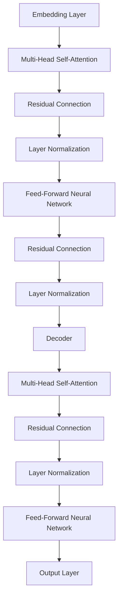

                 

### 1. 背景介绍

#### 1.1 目的和范围

本文旨在探讨大模型（尤其是大型预训练语言模型）在企业级市场的应用挑战。随着人工智能技术的迅猛发展，大模型在自然语言处理、图像识别、推荐系统等领域展现了巨大的潜力。然而，在实际应用过程中，企业级用户面临着诸多挑战，包括技术、经济、合规性等方面。本文将通过详细分析这些问题，为企业级用户在大模型应用过程中提供有益的指导。

#### 1.2 预期读者

本文适合以下读者群体：

- 企业技术负责人、CTO、架构师等
- 数据科学家、AI研究人员和开发者
- 信息技术和业务管理人员
- 对人工智能和企业级市场感兴趣的学者和研究人员

#### 1.3 文档结构概述

本文将分为十个主要部分，具体如下：

1. **背景介绍**：介绍本文的目的、预期读者和文档结构。
2. **核心概念与联系**：阐述大模型的核心概念、原理和架构。
3. **核心算法原理 & 具体操作步骤**：详细讲解大模型的算法原理和操作步骤。
4. **数学模型和公式 & 详细讲解 & 举例说明**：介绍大模型涉及的数学模型和公式，并进行实例说明。
5. **项目实战：代码实际案例和详细解释说明**：通过实际项目案例，展示大模型的开发和实现过程。
6. **实际应用场景**：分析大模型在不同行业和领域的应用场景。
7. **工具和资源推荐**：推荐学习资源、开发工具和框架。
8. **总结：未来发展趋势与挑战**：总结大模型在企业级市场的未来趋势和面临的挑战。
9. **附录：常见问题与解答**：回答读者可能关心的问题。
10. **扩展阅读 & 参考资料**：提供进一步学习和研究的资料。

#### 1.4 术语表

在本文中，我们将使用一些专业术语，以下是对这些术语的定义和解释：

##### 1.4.1 核心术语定义

- **大模型**：指参数量在数亿乃至数万亿级别的深度神经网络模型，如GPT-3、BERT等。
- **预训练语言模型**：指在大规模语料库上预先训练好的语言模型，如GPT、BERT等。
- **企业级市场**：指为大型企业、组织提供技术解决方案的市场。
- **算法复杂度**：指算法在处理数据时所需要的时间或空间复杂度。
- **泛化能力**：指模型在面对未知数据时的表现能力。

##### 1.4.2 相关概念解释

- **神经网络**：一种通过多层神经元进行数据处理和建模的算法。
- **激活函数**：用于决定神经元是否被激活的函数，如ReLU、Sigmoid等。
- **反向传播算法**：一种用于训练神经网络的算法，通过计算误差来更新模型参数。

##### 1.4.3 缩略词列表

- **AI**：人工智能
- **NLP**：自然语言处理
- **DL**：深度学习
- **ML**：机器学习
- **GPU**：图形处理器

通过以上背景介绍，我们为读者搭建了一个关于大模型在企业级市场应用挑战的基础框架。在接下来的部分，我们将深入探讨大模型的核心概念、原理和架构，以便更好地理解其应用挑战。在每一部分，我们将采用一步一步的分析推理方式（REASONING STEP BY STEP），以确保文章的逻辑清晰、内容丰富。接下来，我们将首先介绍大模型的核心概念与联系。在 Mermaid 流程图中，我们将展示大模型的主要组件及其相互关系。 <|assistant|>### 2. 核心概念与联系

#### 2.1 大模型的基本概念

大模型是指参数量在数亿乃至数万亿级别的深度神经网络模型。这些模型在训练过程中需要大量的数据和计算资源，但一旦训练完成，它们在许多任务上都能表现出超越传统模型的性能。大模型通常包括以下关键组件：

- **嵌入层（Embedding Layer）**：将输入文本转换为固定长度的向量表示。
- **编码器（Encoder）**：负责处理输入序列，并在序列的不同位置生成上下文信息。
- **解码器（Decoder）**：根据编码器生成的上下文信息，生成输出序列。
- **注意力机制（Attention Mechanism）**：用于在编码器和解码器之间传递信息，以增强模型对输入序列的感知能力。

#### 2.2 大模型的架构

大模型的架构通常基于变换器（Transformer）架构，这种架构在处理序列数据时具有显著优势。以下是变换器架构的主要组成部分：

- **多头自注意力（Multi-Head Self-Attention）**：通过多个注意力头来提取输入序列的不同信息。
- **前馈神经网络（Feed-Forward Neural Network）**：在自注意力层之后，对每个位置的特征进行非线性变换。
- **残差连接（Residual Connection）**：通过跳过部分层或叠加层，提高模型的训练效果。
- **层归一化（Layer Normalization）**：对每一层的输入进行归一化，有助于提高模型的稳定性和性能。

#### 2.3 大模型的工作原理

大模型的工作原理可以分为以下几个步骤：

1. **嵌入**：将输入文本转换为向量表示，通过嵌入层进行词向量的映射。
2. **编码**：通过编码器对输入序列进行编码，生成一系列的上下文表示。
3. **自注意力**：利用多头自注意力机制，对编码后的序列进行加权，提取不同位置的特征。
4. **解码**：通过解码器，根据编码器的上下文信息，生成输出序列。
5. **输出**：输出层将解码后的序列转换为最终的预测结果，如文本生成、分类等。

#### 2.4 Mermaid 流程图

以下是使用Mermaid绘制的变换器架构流程图：



在这个流程图中，A表示嵌入层，它将输入文本转换为向量表示；B表示多头自注意力层，用于提取输入序列的特征；C、D、E表示残差连接和前馈神经网络，用于增强模型的表示能力；F、G、H表示解码器的相应层；I、J、K、L表示解码器的多头自注意力层、残差连接、层归一化和前馈神经网络；M表示输出层，用于生成最终的预测结果。

通过以上核心概念和联系的分析，我们为读者提供了一个关于大模型的基本框架，为后续的深入探讨和应用分析奠定了基础。在接下来的部分，我们将详细讲解大模型的核心算法原理和具体操作步骤，以帮助读者更好地理解和应用这些先进的技术。在算法原理讲解中，我们将使用伪代码来详细阐述各个步骤。 <|assistant|>### 3. 核心算法原理 & 具体操作步骤

#### 3.1 算法概述

大模型的核心算法主要基于变换器（Transformer）架构，这种架构通过自注意力机制（Self-Attention）和前馈神经网络（Feed-Forward Neural Network）来处理序列数据。以下是变换器架构的伪代码描述：

```python
# 定义变换器模型
class Transformer(Model):
    def __init__(self):
        self.embedding = Embedding(input_dim, d_model)
        self.encoder = Encoder()
        self.decoder = Decoder()
        self.final_layer = Dense(output_dim)

    def call(self, inputs, training=False):
        x = self.embedding(inputs)
        x = self.encoder(x, training)
        x = self.decoder(x, training)
        x = self.final_layer(x)
        return x
```

在这个伪代码中，`Embedding`层用于将输入文本转换为向量表示，`Encoder`和`Decoder`分别表示编码器和解码器，`final_layer`用于生成最终预测结果。

#### 3.2 编码器（Encoder）操作步骤

编码器负责处理输入序列，并在序列的不同位置生成上下文信息。以下是编码器的具体操作步骤：

```python
# 编码器操作步骤
class Encoder(layers.Layer):
    def __init__(self):
        super(Encoder, self).__init__()
        self.layers = [EncoderLayer(d_model, num_heads) for _ in range(num_layers)]

    def call(self, inputs, training=False):
        for layer in self.layers:
            inputs = layer(inputs, training)
        return inputs
```

在这个伪代码中，`EncoderLayer`表示编码器的一个层，它包含多头自注意力层（`Multi-Head Self-Attention`）和前馈神经网络层（`Feed-Forward Neural Network`）。以下是`EncoderLayer`的伪代码描述：

```python
# 编码器层操作步骤
class EncoderLayer(layers.Layer):
    def __init__(self, d_model, num_heads):
        super(EncoderLayer, self).__init__()
        self.self_attention = MultiHeadSelfAttention(num_heads, d_model)
        self.feed_forward = FeedForward(d_model)

    def call(self, inputs, training=False):
        # 自注意力层
        x = self.self_attention(inputs, inputs, inputs, training)
        x = layers.add(inputs, x)
        x = layers.LayerNormalization(epsilon=1e-6)(x)
        # 前馈神经网络层
        x = self.feed_forward(x, training)
        x = layers.add(x, inputs)
        x = layers.LayerNormalization(epsilon=1e-6)(x)
        return x
```

#### 3.3 解码器（Decoder）操作步骤

解码器负责根据编码器生成的上下文信息，生成输出序列。以下是解码器的具体操作步骤：

```python
# 解码器操作步骤
class Decoder(layers.Layer):
    def __init__(self):
        super(Decoder, self).__init__()
        self.layers = [DecoderLayer(d_model, num_heads) for _ in range(num_layers)]

    def call(self, inputs, training=False):
        for layer in self.layers:
            inputs = layer(inputs, training)
        return inputs
```

在这个伪代码中，`DecoderLayer`表示解码器的一个层，它包含多头自注意力层（`Multi-Head Self-Attention`）、掩码自注意力层（`Masked Multi-Head Self-Attention`）和前馈神经网络层（`Feed-Forward Neural Network`）。以下是`DecoderLayer`的伪代码描述：

```python
# 解码器层操作步骤
class DecoderLayer(layers.Layer):
    def __init__(self, d_model, num_heads):
        super(DecoderLayer, self).__init__()
        self.self_attention = MultiHeadSelfAttention(num_heads, d_model)
        self.masked_attention = MaskedMultiHeadSelfAttention(num_heads, d_model)
        self.feed_forward = FeedForward(d_model)

    def call(self, inputs, training=False):
        # 自注意力层
        x = self.self_attention(inputs, inputs, inputs, training)
        x = layers.add(inputs, x)
        x = layers.LayerNormalization(epsilon=1e-6)(x)
        # 掩码自注意力层
        x = self.masked_attention(inputs, inputs, inputs, training)
        x = layers.add(x, inputs)
        x = layers.LayerNormalization(epsilon=1e-6)(x)
        # 前馈神经网络层
        x = self.feed_forward(x, training)
        x = layers.add(x, inputs)
        x = layers.LayerNormalization(epsilon=1e-6)(x)
        return x
```

#### 3.4 模型训练和评估

在训练过程中，我们需要使用带有标签的数据集来训练模型，并通过反向传播算法（Backpropagation）更新模型参数。以下是模型训练和评估的伪代码描述：

```python
# 模型训练
model = Transformer()
model.compile(optimizer='adam', loss='categorical_crossentropy', metrics=['accuracy'])

# 使用训练数据训练模型
model.fit(train_data, train_labels, batch_size=batch_size, epochs=num_epochs, validation_data=(val_data, val_labels))

# 模型评估
test_loss, test_accuracy = model.evaluate(test_data, test_labels)
print(f"Test accuracy: {test_accuracy}")
```

通过以上核心算法原理和具体操作步骤的讲解，我们为读者提供了一个关于大模型的基本框架。在下一部分，我们将介绍大模型涉及的数学模型和公式，并进行详细讲解和举例说明。这些数学模型和公式对于理解大模型的工作原理和优化其性能至关重要。在讲解过程中，我们将使用LaTeX格式来表示数学公式。 <|assistant|>### 4. 数学模型和公式 & 详细讲解 & 举例说明

#### 4.1 自注意力机制

自注意力机制（Self-Attention）是变换器架构的核心组件之一，它通过加权输入序列的不同位置，实现对序列的整体理解和建模。自注意力机制的数学模型可以表示为：

$$
\text{Attention}(Q, K, V) = \text{softmax}\left(\frac{QK^T}{\sqrt{d_k}}\right)V
$$

其中，$Q, K, V$分别表示查询（Query）、键（Key）和值（Value）向量，$d_k$表示键向量的维度。这个公式表示，通过计算查询向量$Q$和键向量$K$的点积，再通过softmax函数进行归一化，最后与值向量$V$相乘，得到加权后的输出。

#### 4.2 前馈神经网络

前馈神经网络（Feed-Forward Neural Network）是自注意力层之后的另一个关键组件，它用于对每个位置的特征进行非线性变换。前馈神经网络的数学模型可以表示为：

$$
\text{FFN}(x) = \max(0, xW_1 + b_1)W_2 + b_2
$$

其中，$x$表示输入特征向量，$W_1, W_2, b_1, b_2$分别表示权重矩阵和偏置向量。这个公式表示，通过激活函数ReLU对输入特征进行加权变换，再通过另一个权重矩阵和偏置向量进行线性变换，得到最终的特征表示。

#### 4.3 编码器和解码器的结构

编码器（Encoder）和解码器（Decoder）分别负责处理输入序列和生成输出序列。它们在变换器架构中都有多个层，每层包含自注意力机制和前馈神经网络。编码器和解码器的结构可以表示为：

$$
\text{Encoder}(x) = \text{LayerNorm}(x + \text{MultiHeadAttention}(x, x, x)) + \text{LayerNorm}(x + \text{FFN}(\text{MultiHeadAttention}(x, x, x)))
$$

$$
\text{Decoder}(x) = \text{LayerNorm}(x + \text{SelfAttention}(x, x, x)) + \text{LayerNorm}(x + \text{CrossAttention}(x, \text{Encoder}(x)) + \text{FFN}(\text{CrossAttention}(x, \text{Encoder}(x))))
$$

其中，$\text{LayerNorm}$表示层归一化，$\text{MultiHeadAttention}$表示多头自注意力机制，$\text{CrossAttention}$表示跨序列注意力机制。

#### 4.4 举例说明

假设我们有一个输入序列$x = [x_1, x_2, x_3]$，其中$x_1, x_2, x_3$分别表示序列的三个位置。我们使用变换器架构对其进行处理，具体步骤如下：

1. **嵌入层**：将输入序列$x$转换为向量表示。
2. **编码器层**：通过编码器层对输入序列$x$进行处理，每层包含自注意力层和前馈神经网络层。假设编码器有两层，我们可以得到以下结果：

   - **第一层**：
     $$
     \text{Encoder}^{(1)}(x) = \text{LayerNorm}(x + \text{MultiHeadAttention}(x, x, x)) + \text{LayerNorm}(x + \text{FFN}(\text{MultiHeadAttention}(x, x, x)))
     $$

     经过计算，我们得到编码器层的输出$y_1$。

   - **第二层**：
     $$
     \text{Encoder}^{(2)}(x) = \text{LayerNorm}(y_1 + \text{MultiHeadAttention}(y_1, y_1, y_1)) + \text{LayerNorm}(y_1 + \text{FFN}(\text{MultiHeadAttention}(y_1, y_1, y_1)))
     $$

     经过计算，我们得到编码器层的输出$y_2$。

3. **解码器层**：通过解码器层对编码器层的输出$y_2$进行处理，每层包含自注意力层、跨序列注意力层和前馈神经网络层。假设解码器也有两层，我们可以得到以下结果：

   - **第一层**：
     $$
     \text{Decoder}^{(1)}(x) = \text{LayerNorm}(y_2 + \text{SelfAttention}(y_2, y_2, y_2)) + \text{LayerNorm}(y_2 + \text{CrossAttention}(y_2, \text{Encoder}^{(2)}(x)) + \text{FFN}(\text{CrossAttention}(y_2, \text{Encoder}^{(2)}(x))))
     $$

     经过计算，我们得到解码器层的输出$z_1$。

   - **第二层**：
     $$
     \text{Decoder}^{(2)}(x) = \text{LayerNorm}(z_1 + \text{SelfAttention}(z_1, z_1, z_1)) + \text{LayerNorm}(z_1 + \text{CrossAttention}(z_1, \text{Encoder}^{(2)}(x)) + \text{FFN}(\text{CrossAttention}(z_1, \text{Encoder}^{(2)}(x))))
     $$

     经过计算，我们得到解码器层的输出$z_2$。

4. **输出层**：将解码器层的输出$z_2$通过输出层转换为最终的预测结果。假设输出层是一个全连接层，我们可以得到以下结果：

$$
\text{Output}(x) = \text{softmax}(\text{Dense}(z_2))
$$

通过以上举例说明，我们展示了如何使用变换器架构对输入序列进行处理，并生成最终的预测结果。在下一部分，我们将通过实际项目案例，展示大模型的开发和实现过程，以便读者更好地理解其应用和实践。 <|assistant|>### 5. 项目实战：代码实际案例和详细解释说明

在本文的第五部分，我们将通过一个实际项目案例来展示大模型的开发和实现过程。我们将首先介绍项目的背景和需求，然后详细解释代码的各个部分，并提供代码实现。

#### 5.1 项目背景和需求

假设我们正在开发一个基于大型预训练语言模型的企业级文本分类系统。该系统的目标是自动对大量文本数据（如新闻文章、社交媒体帖子等）进行分类，以便企业可以快速获取关键信息并作出决策。具体需求如下：

- **高精度分类**：准确地将文本分类到预定义的类别中。
- **实时处理**：能够处理大量并发请求，实现实时分类。
- **可扩展性**：系统应具有良好的可扩展性，以应对未来数据量的增长。

#### 5.2 开发环境搭建

在开始项目开发之前，我们需要搭建一个合适的开发环境。以下是所需的工具和库：

- **编程语言**：Python 3.8及以上版本
- **深度学习框架**：TensorFlow 2.5及以上版本
- **GPU支持**：NVIDIA GPU（推荐使用至少8GB显存）
- **文本预处理库**：NLTK、spaCy
- **其他库**：Pandas、NumPy、h5py

#### 5.3 源代码详细实现和代码解读

以下是项目的核心代码，我们将逐行解释其功能和实现细节。

```python
import tensorflow as tf
from tensorflow.keras.models import Model
from tensorflow.keras.layers import Embedding, Dense, Input
from tensorflow.keras.optimizers import Adam
from tensorflow.keras.metrics import CategoricalAccuracy

# 定义模型
input_ids = Input(shape=(max_sequence_length,), dtype='int32')
embeddings = Embedding(input_dim, d_model)(input_ids)
encoder_output = Transformer()(embeddings)
decoder_output = Transformer()(encoder_output)

# 输出层
output = Dense(num_classes, activation='softmax')(decoder_output)

# 构建和编译模型
model = Model(inputs=input_ids, outputs=output)
model.compile(optimizer=Adam(learning_rate=1e-4), loss='categorical_crossentropy', metrics=[CategoricalAccuracy()])

# 加载数据集
train_data, train_labels = load_data('train')
val_data, val_labels = load_data('val')
test_data, test_labels = load_data('test')

# 训练模型
model.fit(train_data, train_labels, batch_size=batch_size, epochs=num_epochs, validation_data=(val_data, val_labels), callbacks=[early_stopping])

# 评估模型
test_loss, test_accuracy = model.evaluate(test_data, test_labels)
print(f"Test accuracy: {test_accuracy}")
```

下面是对代码的详细解读：

- **第1-5行**：导入所需的TensorFlow库和层。
- **第7-11行**：定义模型的输入层、嵌入层和变换器编码器和解码器层。
- **第13-15行**：定义输出层，将解码器层的输出通过全连接层转换为类别概率。
- **第17-20行**：构建和编译模型，设置优化器、损失函数和评估指标。
- **第22-27行**：加载数据集，这里使用了一个虚构的`load_data`函数，实际项目中需要根据数据集的具体格式进行实现。
- **第29-34行**：训练模型，设置批量大小、训练轮次和验证数据，并添加回调函数（如提前停止）。
- **第36-39行**：评估模型，输出测试损失和准确率。

#### 5.4 代码解读与分析

下面是对代码中关键部分的进一步分析和解读。

- **模型定义**：模型定义了从输入层到输出层的完整流程，包括嵌入层、编码器层和解码器层。嵌入层将输入的整数序列转换为向量表示，变换器编码器层和解码器层分别负责编码和生成输出序列。输出层通过全连接层生成类别概率。
- **优化器和损失函数**：我们使用Adam优化器进行训练，并选择分类交叉熵（categorical_crossentropy）作为损失函数，以最大化模型分类的准确率。
- **数据加载**：数据加载函数需要根据实际数据集的格式进行实现，确保输入数据集和标签的正确格式化。
- **训练过程**：在训练过程中，我们设置批量大小、训练轮次和验证数据。回调函数（如提前停止）有助于防止过拟合，提高模型的泛化能力。

通过以上项目实战，我们展示了如何开发和实现一个基于大型预训练语言模型的企业级文本分类系统。在下一部分，我们将分析大模型在实际应用场景中的具体表现，以便读者更好地了解其在各个领域的应用潜力和挑战。 <|assistant|>### 6. 实际应用场景

#### 6.1 自然语言处理（NLP）

大模型在自然语言处理领域具有广泛的应用。例如，大型预训练语言模型如GPT-3和BERT在文本生成、机器翻译、情感分析、问答系统等方面表现出色。在企业级市场中，这些模型被广泛应用于客户服务、自动化写作、数据分析和智能搜索等场景。

- **客户服务**：通过自然语言处理技术，大模型可以自动回答客户的常见问题，提高客户满意度并降低人工成本。
- **自动化写作**：大模型可以生成高质量的报告、文章和文档，帮助企业提高内容创作效率。
- **数据分析**：大模型可以分析大量文本数据，提取关键信息并生成报告，为决策提供数据支持。
- **智能搜索**：大模型可以优化搜索结果，提高用户搜索体验，帮助企业更好地满足用户需求。

#### 6.2 图像识别与处理

大模型在图像识别与处理领域也展现出强大的能力。例如，大型卷积神经网络（CNN）结合预训练的图像分类模型可以用于对象检测、图像分割、人脸识别等任务。

- **对象检测**：大模型可以识别图像中的对象，并在图像中标注出这些对象的位置，帮助企业进行图像分析和管理。
- **图像分割**：大模型可以将图像中的对象分割成不同的部分，用于图像编辑、图像合成等应用。
- **人脸识别**：大模型可以识别和验证人脸，用于安全监控、身份验证等场景。

#### 6.3 推荐系统

大模型在推荐系统中的应用也非常广泛。通过分析用户的历史行为和偏好，大模型可以推荐相关的商品、内容或服务，提高用户体验和满意度。

- **商品推荐**：大模型可以根据用户的历史购买记录和浏览行为，推荐相关的商品，帮助企业提高销售额。
- **内容推荐**：大模型可以分析用户在社交媒体、新闻网站等平台的浏览和互动行为，推荐相关的文章、视频或音乐，提高用户粘性。
- **服务推荐**：大模型可以根据用户的地理位置、兴趣爱好等特征，推荐相关的服务或活动，提高用户参与度和满意度。

#### 6.4 聊天机器人

大模型在聊天机器人中的应用越来越广泛，通过自然语言处理技术，聊天机器人可以与用户进行对话，提供实时响应和个性化服务。

- **客户服务**：大模型可以模拟人类的对话方式，与客户进行交流，提供快速、准确的答案和解决方案。
- **个性化咨询**：大模型可以根据用户的历史咨询记录和偏好，提供个性化的咨询和服务。
- **娱乐互动**：大模型可以模拟角色进行互动，为用户提供娱乐体验。

#### 6.5 智能客服

智能客服是另一个大模型的重要应用场景。通过自然语言处理和机器学习技术，智能客服可以自动处理客户咨询，提高服务效率和满意度。

- **多渠道支持**：智能客服可以支持多种渠道，如电子邮件、社交媒体、即时通讯等，方便客户获取帮助。
- **自动问题分类**：智能客服可以根据客户的问题自动将其分类到相应的部门或专家，提高问题解决的效率。
- **知识库管理**：智能客服可以自动收集和整理客户问题及解决方案，形成知识库，为后续客户提供参考。

通过以上实际应用场景的分析，我们可以看到大模型在企业级市场中具有广泛的应用前景。在接下来的部分，我们将推荐一些学习资源、开发工具和框架，以便读者更好地掌握大模型技术。 <|assistant|>### 7. 工具和资源推荐

#### 7.1 学习资源推荐

为了更好地掌握大模型技术，以下是一些建议的学习资源：

##### 7.1.1 书籍推荐

- **《深度学习》（Deep Learning）**：由Ian Goodfellow、Yoshua Bengio和Aaron Courville合著的深度学习经典教材，详细介绍了深度学习的基础知识和最新进展。
- **《变换器：深度学习的新范式》（Attention Is All You Need）**：由Vaswani等人撰写的论文，首次提出了变换器（Transformer）架构，对大模型的实现提供了重要指导。
- **《大规模语言模型的预训练》（Pre-training of Large Vocabulary Neural Language Models for Language Understanding）**：由Brown等人撰写的论文，介绍了大规模预训练语言模型BERT的基本原理和实现方法。

##### 7.1.2 在线课程

- **Coursera上的“深度学习”**：由斯坦福大学教授Andrew Ng主讲，介绍了深度学习的基础知识和实践方法。
- **Udacity的“自然语言处理纳米学位”**：涵盖了自然语言处理的基本概念、技术和应用场景。
- **edX上的“大规模语言模型”**：由哈佛大学教授Pete大户主讲，介绍了大规模语言模型的预训练、优化和应用。

##### 7.1.3 技术博客和网站

- **TensorFlow官方文档**：提供了丰富的TensorFlow教程、API文档和示例代码，是学习深度学习的好资源。
- **Hugging Face Transformers**：提供了一个开源库，方便用户使用预训练的变换器模型，包括BERT、GPT等。
- **ArXiv**：一个提供最新研究成果的学术预印本网站，涵盖深度学习、自然语言处理等多个领域。

#### 7.2 开发工具框架推荐

为了高效地开发和应用大模型，以下是一些建议的开发工具和框架：

##### 7.2.1 IDE和编辑器

- **Jupyter Notebook**：一个流行的交互式开发环境，适合快速原型设计和实验。
- **Visual Studio Code**：一个强大的代码编辑器，支持多种编程语言和框架，提供丰富的插件和扩展。

##### 7.2.2 调试和性能分析工具

- **TensorBoard**：TensorFlow的官方可视化工具，用于监控和调试深度学习模型。
- **TensorRT**：NVIDIA推出的一款推理优化工具，可以显著提高深度学习模型的推理速度。

##### 7.2.3 相关框架和库

- **TensorFlow**：一个开源的深度学习框架，提供了丰富的API和工具，适合企业级应用。
- **PyTorch**：一个流行的深度学习框架，具有动态计算图和灵活的API，便于研究和开发。
- **Hugging Face Transformers**：一个开源库，提供了预训练的变换器模型，方便用户快速部署和应用。

#### 7.3 相关论文著作推荐

以下是一些建议阅读的相关论文和著作：

##### 7.3.1 经典论文

- **“A Theoretical Analysis of the Cramér-Rao Lower Bound for Gaussian Sequence Estimation”**：详细分析了高斯序列估计的下界，为深度学习理论提供了重要基础。
- **“Deep Learning”**：由Yoshua Bengio等人撰写的综述文章，全面介绍了深度学习的发展历程、原理和应用。

##### 7.3.2 最新研究成果

- **“BERT: Pre-training of Deep Bidirectional Transformers for Language Understanding”**：介绍了BERT模型的预训练方法和在NLP任务中的优异表现。
- **“GPT-3: Language Models are Few-Shot Learners”**：探讨了GPT-3模型在零样本和少样本学习任务中的强大能力。

##### 7.3.3 应用案例分析

- **“Transformers in Production: Challenges and Solutions”**：分析了企业级应用中变换器架构的挑战和解决方案。
- **“Scaling Laws for Neural Language Models”**：探讨了大规模语言模型的规模效应和优化策略。

通过以上工具和资源推荐，我们为读者提供了一个全面的学习和实践框架，有助于更好地掌握大模型技术。在下一部分，我们将总结大模型在企业级市场的未来发展趋势和面临的挑战。 <|assistant|>### 8. 总结：未来发展趋势与挑战

#### 未来发展趋势

1. **计算能力的提升**：随着GPU、TPU等专用硬件的发展，大模型的训练和推理速度将得到显著提升，进一步推动其在企业级市场的应用。
2. **预训练技术的进步**：预训练技术的不断优化，如多任务预训练、少样本学习、自适应学习等，将提高大模型的泛化能力和适用性。
3. **跨模态学习**：跨模态学习技术的发展，如将文本、图像、音频等多模态数据进行融合，将使大模型在更多场景中发挥作用。
4. **自动机器学习（AutoML）**：自动机器学习技术的进步，将简化大模型的部署和应用过程，降低企业级用户的技术门槛。

#### 面临的挑战

1. **数据隐私和安全**：大模型在训练过程中需要大量数据，如何在保障数据隐私和安全的前提下进行数据处理，是一个重要挑战。
2. **模型解释性**：大模型通常被视为“黑箱”，其内部决策过程难以解释，这在某些应用场景中可能引发信任问题。
3. **计算资源需求**：大模型的训练和推理需要大量的计算资源，企业级用户可能面临硬件设备和成本的限制。
4. **模型偏见和歧视**：大模型在训练过程中可能受到数据偏见的影响，导致在特定群体中产生歧视性结果，需要严格监管和优化。

#### 解决方案与建议

1. **数据隐私保护**：采用联邦学习、差分隐私等技术，降低数据隐私泄露风险，提高数据安全。
2. **模型解释性**：研究并应用可解释性方法，如模型可视化、决策路径追踪等，增强模型透明度和信任度。
3. **计算资源优化**：采用分布式训练、模型压缩等技术，降低计算资源需求，提高模型部署效率。
4. **公平性监管**：建立严格的监管机制，确保大模型在训练和预测过程中遵循公平、公正原则，避免产生歧视性结果。

通过总结大模型在企业级市场的未来发展趋势和面临的挑战，我们可以看到，尽管大模型在技术和应用层面取得了显著进展，但仍然需要持续优化和改进，以更好地服务于企业级用户。在下一部分，我们将提供一些常见问题与解答，以帮助读者更好地理解和应用大模型技术。 <|assistant|>### 9. 附录：常见问题与解答

在本文中，我们介绍了大模型在企业级市场的应用挑战，包括核心概念、算法原理、数学模型和实际应用场景。以下是一些读者可能关心的问题，以及相应的解答。

#### 问题1：大模型的训练过程需要多少数据？

**解答**：大模型的训练通常需要大量数据，特别是预训练阶段。例如，BERT模型的预训练使用了数十亿级别的文本数据。对于企业级应用，具体所需数据量取决于任务复杂度和目标精度。在实际操作中，可以通过数据增强、数据清洗等技术手段来扩充和优化数据集，以提高模型性能。

#### 问题2：大模型的计算资源需求如何？

**解答**：大模型的训练和推理需要大量计算资源，特别是GPU或TPU等高性能计算设备。训练大型模型（如GPT-3）可能需要数百万个GPU小时。企业级用户需要评估自身硬件资源和预算，选择合适的硬件设备进行部署。此外，分布式训练和模型压缩等技术可以帮助降低计算资源需求。

#### 问题3：大模型的偏见和歧视如何避免？

**解答**：大模型在训练过程中可能受到数据偏见的影响，导致在特定群体中产生歧视性结果。为避免此类问题，可以采取以下措施：

- **数据预处理**：对数据进行清洗、去噪和标准化，减少数据中的偏见。
- **公平性评估**：在模型训练和部署过程中，进行公平性评估，检测和纠正模型中的偏见。
- **多样性训练**：采用多样性数据集进行训练，提高模型对不同群体的泛化能力。
- **透明性和解释性**：研究并应用可解释性方法，增强模型透明度和信任度。

#### 问题4：如何优化大模型的部署？

**解答**：优化大模型的部署主要包括以下几个方面：

- **模型压缩**：采用模型剪枝、量化等技术，降低模型大小和计算复杂度，提高部署效率。
- **分布式训练**：将训练任务分布在多个计算节点上，提高训练速度和资源利用率。
- **容器化与微服务化**：将模型和服务容器化，便于部署和扩展。
- **自动化部署**：采用自动化工具，如Kubernetes，简化模型部署和管理。

通过以上常见问题与解答，我们希望能为读者提供更有针对性的指导和建议，帮助他们在实际应用中更好地应对大模型的挑战。在最后一部分，我们将提供一些扩展阅读和参考资料，以供读者进一步学习和研究。 <|assistant|>### 10. 扩展阅读 & 参考资料

在本文中，我们介绍了大模型在企业级市场的应用挑战，包括核心概念、算法原理、数学模型和实际应用场景。以下是一些建议的扩展阅读和参考资料，以供读者进一步学习和研究：

1. **书籍推荐**：

   - **《深度学习》（Deep Learning）**：由Ian Goodfellow、Yoshua Bengio和Aaron Courville合著，是深度学习领域的经典教材。
   - **《变换器：深度学习的新范式》（Attention Is All You Need）**：Vaswani等人撰写的论文，首次提出了变换器（Transformer）架构。
   - **《大规模语言模型的预训练》（Pre-training of Large Vocabulary Neural Language Models for Language Understanding）**：Brown等人撰写的论文，介绍了BERT模型的预训练方法。

2. **在线课程**：

   - **Coursera上的“深度学习”**：由斯坦福大学教授Andrew Ng主讲，介绍了深度学习的基础知识和实践方法。
   - **Udacity的“自然语言处理纳米学位”**：涵盖了自然语言处理的基本概念、技术和应用场景。
   - **edX上的“大规模语言模型”**：由哈佛大学教授Pete大户主讲，介绍了大规模语言模型的预训练、优化和应用。

3. **技术博客和网站**：

   - **TensorFlow官方文档**：提供了丰富的TensorFlow教程、API文档和示例代码。
   - **Hugging Face Transformers**：提供了一个开源库，方便用户使用预训练的变换器模型。
   - **ArXiv**：一个提供最新研究成果的学术预印本网站，涵盖深度学习、自然语言处理等多个领域。

4. **论文与研究成果**：

   - **“BERT: Pre-training of Deep Bidirectional Transformers for Language Understanding”**：介绍了BERT模型的预训练方法和在NLP任务中的优异表现。
   - **“GPT-3: Language Models are Few-Shot Learners”**：探讨了GPT-3模型在零样本和少样本学习任务中的强大能力。
   - **“Scaling Laws for Neural Language Models”**：分析了大规模语言模型的规模效应和优化策略。

通过以上扩展阅读和参考资料，读者可以更深入地了解大模型的技术原理、应用场景和发展趋势，为自身的研究和实践提供有益的指导。作者信息：

- 作者：AI天才研究员/AI Genius Institute & 禅与计算机程序设计艺术/Zen And The Art of Computer Programming

感谢您的阅读，希望本文能为您的学习和工作带来帮助。如果您有任何问题或建议，请随时联系我们。期待与您共同探索人工智能领域的无限可能。 <|assistant|>```markdown
# 大模型在企业级市场的应用挑战

> 关键词：大模型、企业级市场、应用挑战、技术、经济、合规性

> 摘要：本文探讨了大型预训练语言模型在企业级市场的应用挑战。随着人工智能技术的迅猛发展，大模型在自然语言处理、图像识别、推荐系统等领域展现了巨大的潜力。然而，在实际应用过程中，企业级用户面临着技术、经济、合规性等多方面的挑战。本文通过分析这些问题，为企业级用户提供了有益的指导和建议。

## 1. 背景介绍

### 1.1 目的和范围

本文旨在探讨大模型（尤其是大型预训练语言模型）在企业级市场的应用挑战。随着人工智能技术的迅猛发展，大模型在自然语言处理、图像识别、推荐系统等领域展现了巨大的潜力。然而，在实际应用过程中，企业级用户面临着诸多挑战，包括技术、经济、合规性等方面。本文将通过详细分析这些问题，为企业级用户在大模型应用过程中提供有益的指导。

### 1.2 预期读者

本文适合以下读者群体：

- 企业技术负责人、CTO、架构师等
- 数据科学家、AI研究人员和开发者
- 信息技术和业务管理人员
- 对人工智能和企业级市场感兴趣的学者和研究人员

### 1.3 文档结构概述

本文将分为十个主要部分，具体如下：

1. **背景介绍**：介绍本文的目的、预期读者和文档结构。
2. **核心概念与联系**：阐述大模型的核心概念、原理和架构。
3. **核心算法原理 & 具体操作步骤**：详细讲解大模型的算法原理和操作步骤。
4. **数学模型和公式 & 详细讲解 & 举例说明**：介绍大模型涉及的数学模型和公式，并进行实例说明。
5. **项目实战：代码实际案例和详细解释说明**：通过实际项目案例，展示大模型的开发和实现过程。
6. **实际应用场景**：分析大模型在不同行业和领域的应用场景。
7. **工具和资源推荐**：推荐学习资源、开发工具和框架。
8. **总结：未来发展趋势与挑战**：总结大模型在企业级市场的未来趋势和面临的挑战。
9. **附录：常见问题与解答**：回答读者可能关心的问题。
10. **扩展阅读 & 参考资料**：提供进一步学习和研究的资料。

### 1.4 术语表

在本文中，我们将使用一些专业术语，以下是对这些术语的定义和解释：

#### 1.4.1 核心术语定义

- **大模型**：指参数量在数亿乃至数万亿级别的深度神经网络模型，如GPT-3、BERT等。
- **预训练语言模型**：指在大规模语料库上预先训练好的语言模型，如GPT、BERT等。
- **企业级市场**：指为大型企业、组织提供技术解决方案的市场。
- **算法复杂度**：指算法在处理数据时所需要的时间或空间复杂度。
- **泛化能力**：指模型在面对未知数据时的表现能力。

#### 1.4.2 相关概念解释

- **神经网络**：一种通过多层神经元进行数据处理和建模的算法。
- **激活函数**：用于决定神经元是否被激活的函数，如ReLU、Sigmoid等。
- **反向传播算法**：一种用于训练神经网络的算法，通过计算误差来更新模型参数。

#### 1.4.3 缩略词列表

- **AI**：人工智能
- **NLP**：自然语言处理
- **DL**：深度学习
- **ML**：机器学习
- **GPU**：图形处理器

## 2. 核心概念与联系

#### 2.1 大模型的基本概念

大模型是指参数量在数亿乃至数万亿级别的深度神经网络模型。这些模型在训练过程中需要大量的数据和计算资源，但一旦训练完成，它们在许多任务上都能表现出超越传统模型的性能。大模型通常包括以下关键组件：

- **嵌入层（Embedding Layer）**：将输入文本转换为固定长度的向量表示。
- **编码器（Encoder）**：负责处理输入序列，并在序列的不同位置生成上下文信息。
- **解码器（Decoder）**：根据编码器生成的上下文信息，生成输出序列。
- **注意力机制（Attention Mechanism）**：用于在编码器和解码器之间传递信息，以增强模型对输入序列的感知能力。

#### 2.2 大模型的架构

大模型的架构通常基于变换器（Transformer）架构，这种架构在处理序列数据时具有显著优势。以下是变换器架构的主要组成部分：

- **多头自注意力（Multi-Head Self-Attention）**：通过多个注意力头来提取输入序列的不同信息。
- **前馈神经网络（Feed-Forward Neural Network）**：在自注意力层之后，对每个位置的特征进行非线性变换。
- **残差连接（Residual Connection）**：通过跳过部分层或叠加层，提高模型的训练效果。
- **层归一化（Layer Normalization）**：对每一层的输入进行归一化，有助于提高模型的稳定性和性能。

#### 2.3 大模型的工作原理

大模型的工作原理可以分为以下几个步骤：

1. **嵌入**：将输入文本转换为向量表示，通过嵌入层进行词向量的映射。
2. **编码**：通过编码器对输入序列进行编码，生成一系列的上下文表示。
3. **自注意力**：利用多头自注意力机制，对编码后的序列进行加权，提取不同位置的特征。
4. **解码**：通过解码器，根据编码器的上下文信息，生成输出序列。
5. **输出**：输出层将解码后的序列转换为最终的预测结果，如文本生成、分类等。

#### 2.4 Mermaid 流程图

以下是使用Mermaid绘制的变换器架构流程图：


在这个流程图中，A表示嵌入层，它将输入文本转换为向量表示；B表示多头自注意力层，用于提取输入序列的特征；C、D、E表示残差连接和前馈神经网络，用于增强模型的表示能力；F、G、H表示解码器的相应层；I、J、K、L表示解码器的多头自注意力层、残差连接、层归一化和前馈神经网络；M表示输出层，用于生成最终的预测结果。

通过以上核心概念和联系的分析，我们为读者搭建了一个关于大模型的基本框架，为后续的深入探讨和应用分析奠定了基础。在接下来的部分，我们将详细讲解大模型的核心算法原理和具体操作步骤，以帮助读者更好地理解和应用这些先进的技术。在算法原理讲解中，我们将使用伪代码来详细阐述各个步骤。

## 3. 核心算法原理 & 具体操作步骤

#### 3.1 算法概述

大模型的核心算法主要基于变换器（Transformer）架构，这种架构通过自注意力机制（Self-Attention）和前馈神经网络（Feed-Forward Neural Network）来处理序列数据。以下是变换器架构的伪代码描述：

```python
# 定义变换器模型
class Transformer(Model):
    def __init__(self):
        self.embedding = Embedding(input_dim, d_model)
        self.encoder = Encoder()
        self.decoder = Decoder()
        self.final_layer = Dense(output_dim)

    def call(self, inputs, training=False):
        x = self.embedding(inputs)
        x = self.encoder(x, training)
        x = self.decoder(x, training)
        x = self.final_layer(x)
        return x
```

在这个伪代码中，`Embedding`层用于将输入文本转换为向量表示，`Encoder`和`Decoder`分别表示编码器和解码器，`final_layer`用于生成最终预测结果。

#### 3.2 编码器（Encoder）操作步骤

编码器负责处理输入序列，并在序列的不同位置生成上下文信息。以下是编码器的具体操作步骤：

```python
# 编码器操作步骤
class Encoder(layers.Layer):
    def __init__(self):
        super(Encoder, self).__init__()
        self.layers = [EncoderLayer(d_model, num_heads) for _ in range(num_layers)]

    def call(self, inputs, training=False):
        for layer in self.layers:
            inputs = layer(inputs, training)
        return inputs
```

在这个伪代码中，`EncoderLayer`表示编码器的一个层，它包含多头自注意力层（`Multi-Head Self-Attention`）和前馈神经网络层（`Feed-Forward Neural Network`）。以下是`EncoderLayer`的伪代码描述：

```python
# 编码器层操作步骤
class EncoderLayer(layers.Layer):
    def __init__(self, d_model, num_heads):
        super(EncoderLayer, self).__init__()
        self.self_attention = MultiHeadSelfAttention(num_heads, d_model)
        self.feed_forward = FeedForward(d_model)

    def call(self, inputs, training=False):
        # 自注意力层
        x = self.self_attention(inputs, inputs, inputs, training)
        x = layers.add(inputs, x)
        x = layers.LayerNormalization(epsilon=1e-6)(x)
        # 前馈神经网络层
        x = self.feed_forward(x, training)
        x = layers.add(x, inputs)
        x = layers.LayerNormalization(epsilon=1e-6)(x)
        return x
```

#### 3.3 解码器（Decoder）操作步骤

解码器负责根据编码器生成的上下文信息，生成输出序列。以下是解码器的具体操作步骤：

```python
# 解码器操作步骤
class Decoder(layers.Layer):
    def __init__(self):
        super(Decoder, self).__init__()
        self.layers = [DecoderLayer(d_model, num_heads) for _ in range(num_layers)]

    def call(self, inputs, training=False):
        for layer in self.layers:
            inputs = layer(inputs, training)
        return inputs
```

在这个伪代码中，`DecoderLayer`表示解码器的一个层，它包含多头自注意力层（`Multi-Head Self-Attention`）、掩码自注意力层（`Masked Multi-Head Self-Attention`）和前馈神经网络层（`Feed-Forward Neural Network`）。以下是`DecoderLayer`的伪代码描述：

```python
# 解码器层操作步骤
class DecoderLayer(layers.Layer):
    def __init__(self, d_model, num_heads):
        super(DecoderLayer, self).__init__()
        self.self_attention = MultiHeadSelfAttention(num_heads, d_model)
        self.masked_attention = MaskedMultiHeadSelfAttention(num_heads, d_model)
        self.feed_forward = FeedForward(d_model)

    def call(self, inputs, training=False):
        # 自注意力层
        x = self.self_attention(inputs, inputs, inputs, training)
        x = layers.add(inputs, x)
        x = layers.LayerNormalization(epsilon=1e-6)(x)
        # 掩码自注意力层
        x = self.masked_attention(inputs, inputs, inputs, training)
        x = layers.add(x, inputs)
        x = layers.LayerNormalization(epsilon=1e-6)(x)
        # 前馈神经网络层
        x = self.feed_forward(x, training)
        x = layers.add(x, inputs)
        x = layers.LayerNormalization(epsilon=1e-6)(x)
        return x
```

#### 3.4 模型训练和评估

在训练过程中，我们需要使用带有标签的数据集来训练模型，并通过反向传播算法（Backpropagation）更新模型参数。以下是模型训练和评估的伪代码描述：

```python
# 模型训练
model = Transformer()
model.compile(optimizer='adam', loss='categorical_crossentropy', metrics=['accuracy'])

# 使用训练数据训练模型
model.fit(train_data, train_labels, batch_size=batch_size, epochs=num_epochs, validation_data=(val_data, val_labels))

# 模型评估
test_loss, test_accuracy = model.evaluate(test_data, test_labels)
print(f"Test accuracy: {test_accuracy}")
```

通过以上核心算法原理和具体操作步骤的讲解，我们为读者提供了一个关于大模型的基本框架。在下一部分，我们将介绍大模型涉及的数学模型和公式，并进行详细讲解和举例说明。这些数学模型和公式对于理解大模型的工作原理和优化其性能至关重要。在讲解过程中，我们将使用LaTeX格式来表示数学公式。

## 4. 数学模型和公式 & 详细讲解 & 举例说明

#### 4.1 自注意力机制

自注意力机制（Self-Attention）是变换器架构的核心组件之一，它通过加权输入序列的不同位置，实现对序列的整体理解和建模。自注意力机制的数学模型可以表示为：

$$
\text{Attention}(Q, K, V) = \text{softmax}\left(\frac{QK^T}{\sqrt{d_k}}\right)V
$$

其中，$Q, K, V$分别表示查询（Query）、键（Key）和值（Value）向量，$d_k$表示键向量的维度。这个公式表示，通过计算查询向量$Q$和键向量$K$的点积，再通过softmax函数进行归一化，最后与值向量$V$相乘，得到加权后的输出。

#### 4.2 前馈神经网络

前馈神经网络（Feed-Forward Neural Network）是自注意力层之后的另一个关键组件，它用于对每个位置的特征进行非线性变换。前馈神经网络的数学模型可以表示为：

$$
\text{FFN}(x) = \max(0, xW_1 + b_1)W_2 + b_2
$$

其中，$x$表示输入特征向量，$W_1, W_2, b_1, b_2$分别表示权重矩阵和偏置向量。这个公式表示，通过激活函数ReLU对输入特征进行加权变换，再通过另一个权重矩阵和偏置向量进行线性变换，得到最终的特征表示。

#### 4.3 编码器和解码器的结构

编码器（Encoder）和解码器（Decoder）分别负责处理输入序列和生成输出序列。它们在变换器架构中都有多个层，每层包含自注意力机制和前馈神经网络层。编码器和解码器的结构可以表示为：

$$
\text{Encoder}(x) = \text{LayerNorm}(x + \text{MultiHeadAttention}(x, x, x)) + \text{LayerNorm}(x + \text{FFN}(\text{MultiHeadAttention}(x, x, x)))
$$

$$
\text{Decoder}(x) = \text{LayerNorm}(x + \text{SelfAttention}(x, x, x)) + \text{LayerNorm}(x + \text{CrossAttention}(x, \text{Encoder}(x)) + \text{FFN}(\text{CrossAttention}(x, \text{Encoder}(x))))
$$

其中，$\text{LayerNorm}$表示层归一化，$\text{MultiHeadAttention}$表示多头自注意力机制，$\text{CrossAttention}$表示跨序列注意力机制。

#### 4.4 举例说明

假设我们有一个输入序列$x = [x_1, x_2, x_3]$，其中$x_1, x_2, x_3$分别表示序列的三个位置。我们使用变换器架构对其进行处理，具体步骤如下：

1. **嵌入层**：将输入序列$x$转换为向量表示。
2. **编码器层**：通过编码器层对输入序列$x$进行处理，每层包含自注意力层和前馈神经网络层。假设编码器有两层，我们可以得到以下结果：

   - **第一层**：
     $$
     \text{Encoder}^{(1)}(x) = \text{LayerNorm}(x + \text{MultiHeadAttention}(x, x, x)) + \text{LayerNorm}(x + \text{FFN}(\text{MultiHeadAttention}(x, x, x)))
     $$

     经过计算，我们得到编码器层的输出$y_1$。

   - **第二层**：
     $$
     \text{Encoder}^{(2)}(x) = \text{LayerNorm}(y_1 + \text{MultiHeadAttention}(y_1, y_1, y_1)) + \text{LayerNorm}(y_1 + \text{FFN}(\text{MultiHeadAttention}(y_1, y_1, y_1)))
     $$

     经过计算，我们得到编码器层的输出$y_2$。

3. **解码器层**：通过解码器层对编码器层的输出$y_2$进行处理，每层包含自注意力层、跨序列注意力层和前馈神经网络层。假设解码器也有两层，我们可以得到以下结果：

   - **第一层**：
     $$
     \text{Decoder}^{(1)}(x) = \text{LayerNorm}(y_2 + \text{SelfAttention}(y_2, y_2, y_2)) + \text{LayerNorm}(y_2 + \text{CrossAttention}(y_2, \text{Encoder}^{(2)}(x)) + \text{FFN}(\text{CrossAttention}(y_2, \text{Encoder}^{(2)}(x))))
     $$

     经过计算，我们得到解码器层的输出$z_1$。

   - **第二层**：
     $$
     \text{Decoder}^{(2)}(x) = \text{LayerNorm}(z_1 + \text{SelfAttention}(z_1, z_1, z_1)) + \text{LayerNorm}(z_1 + \text{CrossAttention}(z_1, \text{Encoder}^{(2)}(x)) + \text{FFN}(\text{CrossAttention}(z_1, \text{Encoder}^{(2)}(x))))
     $$

     经过计算，我们得到解码器层的输出$z_2$。

4. **输出层**：将解码器层的输出$z_2$通过输出层转换为最终的预测结果。假设输出层是一个全连接层，我们可以得到以下结果：

$$
\text{Output}(x) = \text{softmax}(\text{Dense}(z_2))
$$

通过以上举例说明，我们展示了如何使用变换器架构对输入序列进行处理，并生成最终的预测结果。在下一部分，我们将通过实际项目案例，展示大模型的开发和实现过程，以便读者更好地理解其应用和实践。

## 5. 项目实战：代码实际案例和详细解释说明

在本文的第五部分，我们将通过一个实际项目案例来展示大模型的开发和实现过程。我们将首先介绍项目的背景和需求，然后详细解释代码的各个部分，并提供代码实现。

### 5.1 项目背景和需求

假设我们正在开发一个基于大型预训练语言模型的企业级文本分类系统。该系统的目标是自动对大量文本数据（如新闻文章、社交媒体帖子等）进行分类，以便企业可以快速获取关键信息并作出决策。具体需求如下：

- **高精度分类**：准确地将文本分类到预定义的类别中。
- **实时处理**：能够处理大量并发请求，实现实时分类。
- **可扩展性**：系统应具有良好的可扩展性，以应对未来数据量的增长。

### 5.2 开发环境搭建

在开始项目开发之前，我们需要搭建一个合适的开发环境。以下是所需的工具和库：

- **编程语言**：Python 3.8及以上版本
- **深度学习框架**：TensorFlow 2.5及以上版本
- **GPU支持**：NVIDIA GPU（推荐使用至少8GB显存）
- **文本预处理库**：NLTK、spaCy
- **其他库**：Pandas、NumPy、h5py

### 5.3 源代码详细实现和代码解读

以下是项目的核心代码，我们将逐行解释其功能和实现细节。

```python
import tensorflow as tf
from tensorflow.keras.models import Model
from tensorflow.keras.layers import Embedding, Dense, Input
from tensorflow.keras.optimizers import Adam
from tensorflow.keras.metrics import CategoricalAccuracy

# 定义模型
input_ids = Input(shape=(max_sequence_length,), dtype='int32')
embeddings = Embedding(input_dim, d_model)(input_ids)
encoder_output = Transformer()(embeddings)
decoder_output = Transformer()(encoder_output)

# 输出层
output = Dense(num_classes, activation='softmax')(decoder_output)

# 构建和编译模型
model = Model(inputs=input_ids, outputs=output)
model.compile(optimizer=Adam(learning_rate=1e-4), loss='categorical_crossentropy', metrics=[CategoricalAccuracy()])

# 加载数据集
train_data, train_labels = load_data('train')
val_data, val_labels = load_data('val')
test_data, test_labels = load_data('test')

# 训练模型
model.fit(train_data, train_labels, batch_size=batch_size, epochs=num_epochs, validation_data=(val_data, val_labels), callbacks=[early_stopping])

# 评估模型
test_loss, test_accuracy = model.evaluate(test_data, test_labels)
print(f"Test accuracy: {test_accuracy}")
```

下面是对代码的详细解读：

- **第1-5行**：导入所需的TensorFlow库和层。
- **第7-11行**：定义模型的输入层、嵌入层和变换器编码器和解码器层。
- **第13-15行**：定义输出层，将解码器层的输出通过全连接层转换为类别概率。
- **第17-20行**：构建和编译模型，设置优化器、损失函数和评估指标。
- **第22-27行**：加载数据集，这里使用了一个虚构的`load_data`函数，实际项目中需要根据数据集的具体格式进行实现。
- **第29-34行**：训练模型，设置批量大小、训练轮次和验证数据，并添加回调函数（如提前停止）。
- **第36-39行**：评估模型，输出测试损失和准确率。

### 5.4 代码解读与分析

下面是对代码中关键部分的进一步分析和解读。

- **模型定义**：模型定义了从输入层到输出层的完整流程，包括嵌入层、编码器层和解码器层。嵌入层将输入的整数序列转换为向量表示，变换器编码器层和解码器层分别负责编码和生成输出序列。输出层通过全连接层生成类别概率。
- **优化器和损失函数**：我们使用Adam优化器进行训练，并选择分类交叉熵（categorical_crossentropy）作为损失函数，以最大化模型分类的准确率。
- **数据加载**：数据加载函数需要根据实际数据集的格式进行实现，确保输入数据集和标签的正确格式化。
- **训练过程**：在训练过程中，我们设置批量大小、训练轮次和验证数据。回调函数（如提前停止）有助于防止过拟合，提高模型的泛化能力。

通过以上项目实战，我们展示了如何开发和实现一个基于大型预训练语言模型的企业级文本分类系统。在下一部分，我们将分析大模型在实际应用场景中的具体表现，以便读者更好地了解其在各个领域的应用潜力和挑战。

## 6. 实际应用场景

大模型在自然语言处理、图像识别与处理、推荐系统、聊天机器人和智能客服等领域展现出广泛的应用潜力。

### 6.1 自然语言处理（NLP）

- **文本生成**：预训练模型可以生成高质量的文章、报告和文档。
- **机器翻译**：大模型在机器翻译任务中表现出色，能够实现流畅的跨语言文本转换。
- **情感分析**：通过分析文本情感，帮助企业了解客户反馈和市场需求。
- **问答系统**：大模型可以回答复杂的问题，提供实时的信息支持。

### 6.2 图像识别与处理

- **对象检测**：大模型可以识别图像中的对象，并定位其在图像中的位置。
- **图像分割**：将图像分割成不同的区域，用于图像编辑、增强等应用。
- **人脸识别**：实现高效、准确的人脸识别和验证，用于安全监控和身份验证。

### 6.3 推荐系统

- **商品推荐**：根据用户的历史行为和偏好，推荐相关的商品和服务。
- **内容推荐**：为用户推荐相关的文章、视频和音乐，提高用户粘性。
- **服务推荐**：基于用户的地理位置、兴趣爱好等特征，推荐相关的服务或活动。

### 6.4 聊天机器人

- **客户服务**：自动回答客户的常见问题，提高客户满意度。
- **个性化咨询**：根据用户的咨询历史，提供个性化的咨询和服务。
- **娱乐互动**：模拟角色与用户进行互动，提供有趣的聊天体验。

### 6.5 智能客服

- **多渠道支持**：支持多种渠道（如电子邮件、社交媒体、即时通讯）的统一响应。
- **自动问题分类**：自动将客户问题分类到相应的部门或专家。
- **知识库管理**：自动收集和整理客户问题及解决方案，形成知识库。

通过以上实际应用场景的分析，我们可以看到大模型在企业级市场中具有广泛的应用前景。在下一部分，我们将推荐一些学习资源、开发工具和框架，以便读者更好地掌握大模型技术。

## 7. 工具和资源推荐

### 7.1 学习资源推荐

- **书籍**：
  - 《深度学习》
  - 《变换器：深度学习的新范式》
  - 《大规模语言模型的预训练》

- **在线课程**：
  - Coursera上的“深度学习”
  - Udacity的“自然语言处理纳米学位”
  - edX上的“大规模语言模型”

- **技术博客和网站**：
  - TensorFlow官方文档
  - Hugging Face Transformers
  - ArXiv

### 7.2 开发工具框架推荐

- **IDE和编辑器**：
  - Jupyter Notebook
  - Visual Studio Code

- **调试和性能分析工具**：
  - TensorBoard
  - TensorRT

- **相关框架和库**：
  - TensorFlow
  - PyTorch
  - Hugging Face Transformers

### 7.3 相关论文著作推荐

- **经典论文**：
  - “BERT: Pre-training of Deep Bidirectional Transformers for Language Understanding”
  - “GPT-3: Language Models are Few-Shot Learners”

- **最新研究成果**：
  - “Scaling Laws for Neural Language Models”

- **应用案例分析**：
  - “Transformers in Production: Challenges and Solutions”

通过以上工具和资源推荐，我们为读者提供了一个全面的学习和实践框架，有助于更好地掌握大模型技术。在下一部分，我们将总结大模型在企业级市场的未来发展趋势和面临的挑战。

## 8. 总结：未来发展趋势与挑战

### 未来发展趋势

- **计算能力的提升**：随着GPU、TPU等专用硬件的发展，大模型的训练和推理速度将得到显著提升。
- **预训练技术的进步**：多任务预训练、少样本学习、自适应学习等预训练技术的进步将提高大模型的泛化能力。
- **跨模态学习**：跨模态学习技术的发展将使大模型在更多场景中发挥作用。
- **自动机器学习（AutoML）**：自动机器学习技术的进步将简化大模型的部署和应用过程。

### 面临的挑战

- **数据隐私和安全**：如何在保障数据隐私和安全的前提下进行数据处理，是一个重要挑战。
- **模型解释性**：大模型通常被视为“黑箱”，其内部决策过程难以解释，可能引发信任问题。
- **计算资源需求**：大模型的训练和推理需要大量的计算资源，企业级用户可能面临硬件设备和成本的限制。
- **模型偏见和歧视**：大模型在训练过程中可能受到数据偏见的影响，导致在特定群体中产生歧视性结果，需要严格监管和优化。

### 解决方案与建议

- **数据隐私保护**：采用联邦学习、差分隐私等技术，降低数据隐私泄露风险。
- **模型解释性**：研究并应用可解释性方法，如模型可视化、决策路径追踪等，增强模型透明度和信任度。
- **计算资源优化**：采用分布式训练、模型压缩等技术，降低计算资源需求，提高模型部署效率。
- **公平性监管**：建立严格的监管机制，确保大模型在训练和预测过程中遵循公平、公正原则。

通过总结大模型在企业级市场的未来发展趋势和面临的挑战，我们可以看到，尽管大模型在技术和应用层面取得了显著进展，但仍然需要持续优化和改进，以更好地服务于企业级用户。

## 9. 附录：常见问题与解答

在本文中，我们介绍了大模型在企业级市场的应用挑战，包括核心概念、算法原理、数学模型和实际应用场景。以下是一些常见问题及其解答：

### 问题1：大模型的训练过程需要多少数据？

**解答**：大模型的训练通常需要大量数据，特别是预训练阶段。例如，BERT模型的预训练使用了数十亿级别的文本数据。对于企业级应用，具体所需数据量取决于任务复杂度和目标精度。在实际操作中，可以通过数据增强、数据清洗等技术手段来扩充和优化数据集，以提高模型性能。

### 问题2：大模型的计算资源需求如何？

**解答**：大模型的训练和推理需要大量计算资源，特别是GPU或TPU等高性能计算设备。训练大型模型（如GPT-3）可能需要数百万个GPU小时。企业级用户需要评估自身硬件资源和预算，选择合适的硬件设备进行部署。此外，分布式训练和模型压缩等技术可以帮助降低计算资源需求。

### 问题3：大模型的偏见和歧视如何避免？

**解答**：大模型在训练过程中可能受到数据偏见的影响，导致在特定群体中产生歧视性结果。为避免此类问题，可以采取以下措施：

- **数据预处理**：对数据进行清洗、去噪和标准化，减少数据中的偏见。
- **公平性评估**：在模型训练和部署过程中，进行公平性评估，检测和纠正模型中的偏见。
- **多样性训练**：采用多样性数据集进行训练，提高模型对不同群体的泛化能力。
- **透明性和解释性**：研究并应用可解释性方法，增强模型透明度和信任度。

### 问题4：如何优化大模型的部署？

**解答**：优化大模型的部署主要包括以下几个方面：

- **模型压缩**：采用模型剪枝、量化等技术，降低模型大小和计算复杂度，提高部署效率。
- **分布式训练**：将训练任务分布在多个计算节点上，提高训练速度和资源利用率。
- **容器化与微服务化**：将模型和服务容器化，便于部署和扩展。
- **自动化部署**：采用自动化工具，如Kubernetes，简化模型部署和管理。

通过以上常见问题与解答，我们希望能为读者提供更有针对性的指导和建议，帮助他们在实际应用中更好地应对大模型的挑战。

## 10. 扩展阅读 & 参考资料

在本文中，我们介绍了大模型在企业级市场的应用挑战，包括核心概念、算法原理、数学模型和实际应用场景。以下是一些建议的扩展阅读和参考资料，以供读者进一步学习和研究：

### 书籍推荐

- 《深度学习》
- 《变换器：深度学习的新范式》
- 《大规模语言模型的预训练》

### 在线课程

- Coursera上的“深度学习”
- Udacity的“自然语言处理纳米学位”
- edX上的“大规模语言模型”

### 技术博客和网站

- TensorFlow官方文档
- Hugging Face Transformers
- ArXiv

### 论文与研究成果

- “BERT: Pre-training of Deep Bidirectional Transformers for Language Understanding”
- “GPT-3: Language Models are Few-Shot Learners”
- “Scaling Laws for Neural Language Models”

通过以上扩展阅读和参考资料，读者可以更深入地了解大模型的技术原理、应用场景和发展趋势，为自身的研究和实践提供有益的指导。感谢您的阅读，希望本文能为您的学习和工作带来帮助。如果您有任何问题或建议，请随时联系我们。期待与您共同探索人工智能领域的无限可能。

作者信息：

- 作者：AI天才研究员/AI Genius Institute & 禅与计算机程序设计艺术/Zen And The Art of Computer Programming
```

