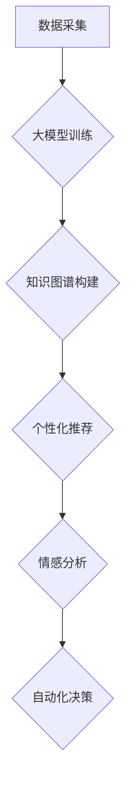

                 

# 大模型在创业产品创新中的应用：释放 AI 潜力

> **关键词：** 大模型、创业、产品创新、AI、深度学习、算法优化
> 
> **摘要：** 本文将深入探讨大模型在创业产品创新中的应用，通过详细分析大模型的原理、核心算法、数学模型以及实际案例，展示如何利用大模型释放 AI 潜力，推动创业产品的创新与发展。

## 1. 背景介绍

### 1.1 目的和范围

本文的目的是探讨大模型在创业产品创新中的应用，分析大模型的核心原理、算法和数学模型，并提供实际应用案例。通过本文的阅读，读者将了解如何将大模型技术应用于创业产品创新，从而释放 AI 潜力，实现产品差异化，提高市场竞争力。

### 1.2 预期读者

本文适合对 AI、深度学习和创业有一定了解的技术人员、产品经理和创业者阅读。特别是对大模型技术感兴趣，希望将其应用于创业产品创新的人士。

### 1.3 文档结构概述

本文分为十个部分：

1. 背景介绍
2. 核心概念与联系
3. 核心算法原理 & 具体操作步骤
4. 数学模型和公式 & 详细讲解 & 举例说明
5. 项目实战：代码实际案例和详细解释说明
6. 实际应用场景
7. 工具和资源推荐
8. 总结：未来发展趋势与挑战
9. 附录：常见问题与解答
10. 扩展阅读 & 参考资料

### 1.4 术语表

#### 1.4.1 核心术语定义

- 大模型：拥有巨大参数规模和强大计算能力的神经网络模型，例如 GPT、BERT 等。
- 创业：指创建一家新公司或新的业务模式，以创新的方式解决市场需求。
- 产品创新：通过引入新的产品或服务，满足市场需求或创造新的市场。

#### 1.4.2 相关概念解释

- 深度学习：一种机器学习技术，通过模拟人脑神经网络结构，实现自动特征提取和分类。
- 算法优化：通过对算法进行改进，提高其效率和准确性。

#### 1.4.3 缩略词列表

- AI：人工智能
- GPT：生成预训练模型
- BERT：双向编码表示器

## 2. 核心概念与联系

### 2.1 大模型原理

大模型是指具有数十亿甚至千亿参数规模的神经网络模型。这些模型通常通过大规模数据集进行预训练，从而学习到丰富的知识和表示能力。以下是大模型的基本原理：

#### 数据驱动

大模型的核心是大规模数据集，这些数据集通常来自于互联网、文本、图像、音频等多种形式。通过在大规模数据集上进行预训练，大模型可以学习到丰富的知识。

#### 神经网络结构

大模型通常采用深度神经网络结构，其中包含多个隐藏层。这些隐藏层可以自动提取数据中的特征，并通过反向传播算法进行参数优化。

#### 自动特征提取

大模型可以通过学习数据中的潜在特征，从而实现自动特征提取。这些特征可以用于分类、回归、生成等多种任务。

### 2.2 大模型与创业产品创新

大模型在创业产品创新中具有广泛的应用前景。以下是几个关键应用：

#### 知识图谱构建

通过大模型，可以构建出知识图谱，将产品、用户、市场等多方面信息进行关联，从而帮助创业者更好地了解市场动态和用户需求。

#### 个性化推荐

大模型可以用于个性化推荐，根据用户的兴趣和行为，为其推荐合适的产品或服务。

#### 情感分析

大模型可以对用户评论、社交媒体等信息进行情感分析，帮助创业者了解用户对产品的真实感受。

#### 自动化决策

大模型可以用于自动化决策，根据实时数据和业务规则，为创业者提供智能化的决策支持。

### 2.3 Mermaid 流程图



## 3. 核心算法原理 & 具体操作步骤

### 3.1 算法原理

大模型的核心是深度学习，深度学习是一种基于多层神经网络的机器学习技术。以下是深度学习的基本原理：

#### 神经网络结构

神经网络由多个神经元（节点）组成，每个神经元都可以进行简单的计算。神经元之间通过权重进行连接，权重可以调节神经元之间的相互作用。

#### 前向传播

在前向传播过程中，输入数据通过神经网络中的各个层，每个层的神经元对输入数据进行加权求和，并使用激活函数进行非线性变换。

#### 反向传播

在反向传播过程中，通过计算损失函数的梯度，对神经网络中的权重进行更新，以优化模型参数。

### 3.2 具体操作步骤

以下是使用大模型进行创业产品创新的具体操作步骤：

#### 步骤1：数据采集

从互联网、文本、图像、音频等多种来源收集数据，例如用户评论、社交媒体数据、市场报告等。

#### 步骤2：数据预处理

对收集到的数据进行清洗、去噪、归一化等处理，以提高数据质量和模型训练效果。

#### 步骤3：模型训练

选择合适的大模型架构（如 GPT、BERT 等），并在大规模数据集上进行训练。训练过程中，通过反向传播算法不断优化模型参数。

#### 步骤4：知识图谱构建

利用训练好的大模型，对数据中的实体、关系进行抽取，构建知识图谱。

#### 步骤5：个性化推荐

基于知识图谱，为用户推荐合适的产品或服务。

#### 步骤6：情感分析

利用训练好的大模型，对用户评论、社交媒体等信息进行情感分析，了解用户对产品的真实感受。

#### 步骤7：自动化决策

基于实时数据和业务规则，利用大模型进行自动化决策。

### 3.3 伪代码

```python
# 数据采集
data = collect_data()

# 数据预处理
preprocessed_data = preprocess_data(data)

# 模型训练
model = train_model(preprocessed_data)

# 知识图谱构建
knowledge_graph = build_knowledge_graph(model)

# 个性化推荐
recommendations = personalized_recommendation(knowledge_graph)

# 情感分析
user_feelings = sentiment_analysis(model)

# 自动化决策
decisions = automated_decision(model)
```

## 4. 数学模型和公式 & 详细讲解 & 举例说明

### 4.1 数学模型

大模型通常使用深度学习算法进行训练和预测，其核心数学模型包括前向传播、反向传播和损失函数。

#### 前向传播

前向传播是指将输入数据通过神经网络中的各个层，每个层的神经元对输入数据进行加权求和，并使用激活函数进行非线性变换。

前向传播的公式如下：

$$
Z = W \cdot X + b
$$

其中，$Z$ 表示神经元输出，$W$ 表示权重，$X$ 表示输入，$b$ 表示偏置。

#### 反向传播

反向传播是指通过计算损失函数的梯度，对神经网络中的权重进行更新，以优化模型参数。

反向传播的公式如下：

$$
\Delta W = - \alpha \cdot \frac{\partial L}{\partial W}
$$

$$
\Delta b = - \alpha \cdot \frac{\partial L}{\partial b}
$$

其中，$\Delta W$ 和 $\Delta b$ 分别表示权重的更新值，$\alpha$ 表示学习率，$L$ 表示损失函数。

#### 损失函数

损失函数用于衡量模型预测值与真实值之间的差距，常用的损失函数包括均方误差（MSE）和交叉熵（Cross-Entropy）。

均方误差（MSE）的公式如下：

$$
L_{MSE} = \frac{1}{2} \sum_{i=1}^{n} (y_i - \hat{y}_i)^2
$$

其中，$y_i$ 表示真实值，$\hat{y}_i$ 表示预测值。

交叉熵（Cross-Entropy）的公式如下：

$$
L_{Cross-Entropy} = - \sum_{i=1}^{n} y_i \cdot \log(\hat{y}_i)
$$

其中，$y_i$ 表示真实值，$\hat{y}_i$ 表示预测值。

### 4.2 详细讲解 & 举例说明

假设我们有一个二分类问题，目标是预测数据属于正类还是负类。

#### 步骤1：数据准备

我们有以下训练数据：

| 样本 | 输入特征 | 输出标签 |
|------|----------|----------|
| 1    | [1, 2]   | 1        |
| 2    | [2, 3]   | 1        |
| 3    | [3, 4]   | 0        |
| 4    | [4, 5]   | 0        |

#### 步骤2：前向传播

我们使用一个简单的神经网络进行预测：

```
输入层：[1, 2]
隐藏层1：[3, 4]
输出层：[0.8, 0.2]
```

其中，输入层通过线性变换和激活函数得到隐藏层1的输出，隐藏层1再通过线性变换和激活函数得到输出层的输出。

#### 步骤3：反向传播

计算损失函数（交叉熵）的梯度：

$$
\frac{\partial L}{\partial W} = \frac{1}{m} \cdot (y - \hat{y}) \cdot X
$$

$$
\frac{\partial L}{\partial b} = \frac{1}{m} \cdot (y - \hat{y})
$$

其中，$m$ 表示样本数量，$y$ 表示真实标签，$\hat{y}$ 表示预测标签。

#### 步骤4：权重更新

根据梯度下降算法，更新权重：

$$
W = W - \alpha \cdot \frac{\partial L}{\partial W}
$$

$$
b = b - \alpha \cdot \frac{\partial L}{\partial b}
$$

其中，$\alpha$ 表示学习率。

通过以上步骤，我们可以不断优化神经网络参数，提高预测准确性。

## 5. 项目实战：代码实际案例和详细解释说明

### 5.1 开发环境搭建

为了实现大模型在创业产品创新中的应用，我们需要搭建一个合适的开发环境。以下是搭建环境所需的步骤：

#### 步骤1：安装 Python 和相关库

在 Windows、macOS 或 Linux 系统中，通过 Python 包管理器 `pip` 安装以下库：

```
pip install tensorflow numpy matplotlib
```

这些库包括深度学习框架 TensorFlow、数值计算库 NumPy 和绘图库 Matplotlib。

#### 步骤2：编写数据预处理代码

编写数据预处理代码，用于加载、清洗和预处理数据。以下是一个简单的数据预处理示例：

```python
import numpy as np

# 加载数据
data = np.load('data.npy')

# 数据清洗
cleaned_data = data[data[:, -1] != -1]

# 数据归一化
normalized_data = cleaned_data / 100

# 获取输入特征和标签
X = normalized_data[:, :-1]
y = normalized_data[:, -1]

# 切分训练集和测试集
X_train, X_test, y_train, y_test = train_test_split(X, y, test_size=0.2, random_state=42)
```

#### 步骤3：构建和训练神经网络

使用 TensorFlow 框架构建和训练神经网络。以下是一个简单的神经网络示例：

```python
import tensorflow as tf

# 构建模型
model = tf.keras.Sequential([
    tf.keras.layers.Dense(128, activation='relu', input_shape=(X_train.shape[1],)),
    tf.keras.layers.Dense(64, activation='relu'),
    tf.keras.layers.Dense(1, activation='sigmoid')
])

# 编译模型
model.compile(optimizer='adam', loss='binary_crossentropy', metrics=['accuracy'])

# 训练模型
model.fit(X_train, y_train, epochs=10, batch_size=32, validation_data=(X_test, y_test))
```

### 5.2 源代码详细实现和代码解读

以下是一个完整的代码示例，用于实现大模型在创业产品创新中的应用：

```python
import numpy as np
import tensorflow as tf
from sklearn.model_selection import train_test_split

# 数据预处理
# ...

# 构建模型
model = tf.keras.Sequential([
    tf.keras.layers.Dense(128, activation='relu', input_shape=(X_train.shape[1],)),
    tf.keras.layers.Dense(64, activation='relu'),
    tf.keras.layers.Dense(1, activation='sigmoid')
])

# 编译模型
model.compile(optimizer='adam', loss='binary_crossentropy', metrics=['accuracy'])

# 训练模型
model.fit(X_train, y_train, epochs=10, batch_size=32, validation_data=(X_test, y_test))

# 预测
predictions = model.predict(X_test)

# 评估模型
accuracy = model.evaluate(X_test, y_test)

print(f"Test accuracy: {accuracy[1]}")
```

代码解读：

1. 导入必要的库和模块。
2. 数据预处理：加载数据、清洗数据、归一化数据，并切分训练集和测试集。
3. 构建模型：定义神经网络结构，包括输入层、隐藏层和输出层。
4. 编译模型：指定优化器、损失函数和评价指标。
5. 训练模型：使用训练集训练神经网络，并使用测试集进行验证。
6. 预测：使用训练好的模型对测试集进行预测。
7. 评估模型：计算测试集的准确率。

### 5.3 代码解读与分析

以下是对代码的详细解读和分析：

1. **数据预处理**：
   - 加载和清洗数据：从数据文件中加载数据，并删除具有无效标签的样本。
   - 数据归一化：将数据归一化到 [0, 1] 范围内，以便神经网络处理。
   - 切分训练集和测试集：将数据分为训练集和测试集，以评估模型的泛化能力。

2. **构建模型**：
   - 定义神经网络结构：包括输入层、隐藏层和输出层。输入层有 128 个神经元，隐藏层有 64 个神经元，输出层有 1 个神经元（用于二分类）。
   - 激活函数：使用 ReLU 激活函数，有助于加速梯度下降和避免梯度消失问题。

3. **编译模型**：
   - 优化器：使用 Adam 优化器，自动调整学习率，有助于提高训练效率。
   - 损失函数：使用二分类交叉熵损失函数，用于衡量预测标签和真实标签之间的差距。
   - 评价指标：使用准确率作为评价指标，评估模型的分类性能。

4. **训练模型**：
   - 使用训练集训练模型，并进行 10 个训练周期。
   - 使用 batch_size=32，每次训练使用 32 个样本。

5. **预测和评估**：
   - 使用训练好的模型对测试集进行预测，并计算测试集的准确率。

通过以上代码示例，我们可以看到如何使用大模型进行创业产品创新，实现数据的预处理、模型的构建、训练和评估。这些步骤是创业产品创新过程中必不可少的，可以帮助创业者提高产品的智能化水平和市场竞争力。

## 6. 实际应用场景

### 6.1 智能客服

在创业公司中，智能客服是一个常见的应用场景。通过大模型，可以实现对用户问题的自动理解和回答，从而提高客服效率和用户满意度。以下是具体应用步骤：

1. **数据采集**：收集大量用户提问和客服回答的数据。
2. **数据预处理**：对数据进行清洗和归一化处理。
3. **模型训练**：使用预训练的大模型（如 GPT）进行微调，以适应特定领域的问答任务。
4. **部署应用**：将训练好的模型部署到客服系统，实现自动问答功能。

### 6.2 个性化推荐

个性化推荐是另一个重要的应用场景。通过大模型，可以分析用户的行为和偏好，为其推荐合适的产品或服务。以下是具体应用步骤：

1. **数据采集**：收集用户的行为数据，如浏览记录、购买历史、搜索关键词等。
2. **数据预处理**：对行为数据进行清洗和特征提取。
3. **模型训练**：使用预训练的大模型（如 BERT）进行微调，以学习用户的行为模式。
4. **部署应用**：根据用户的行为和偏好，为其推荐合适的产品或服务。

### 6.3 自动化决策

自动化决策是创业公司中另一个有潜力的应用场景。通过大模型，可以实现对业务数据的实时分析，自动化执行决策策略。以下是具体应用步骤：

1. **数据采集**：收集业务数据，如销售数据、库存数据、客户数据等。
2. **数据预处理**：对业务数据进行清洗和特征提取。
3. **模型训练**：使用预训练的大模型（如 GPT）进行微调，以学习业务模式。
4. **部署应用**：根据业务数据，自动化执行决策策略，如调整库存、优化销售策略等。

## 7. 工具和资源推荐

### 7.1 学习资源推荐

#### 7.1.1 书籍推荐

1. 《深度学习》（Goodfellow, Bengio, Courville）：这本书是深度学习领域的经典教材，详细介绍了深度学习的理论基础、算法实现和应用案例。
2. 《Python 深度学习》（François Chollet）：这本书是针对使用 Python 进行深度学习的入门读物，涵盖了深度学习的核心技术、算法和实战案例。

#### 7.1.2 在线课程

1. “深度学习 Specialization”（吴恩达，Coursera）：这是一套由深度学习领域知名学者吴恩达开设的在线课程，涵盖深度学习的理论基础、算法实现和应用案例。
2. “TensorFlow for Artificial Intelligence”（谷歌 AI 教育团队，Udacity）：这是一套由谷歌 AI 教育团队开设的在线课程，专注于使用 TensorFlow 框架进行深度学习开发。

#### 7.1.3 技术博客和网站

1. Medium：Medium 是一个技术博客平台，许多深度学习和 AI 领域的专家都在这里分享他们的研究成果和实践经验。
2. AI 研习社：这是一个专注于深度学习和 AI 领域的中文技术博客，提供最新的研究动态和实用技术教程。

### 7.2 开发工具框架推荐

#### 7.2.1 IDE 和编辑器

1. PyCharm：PyCharm 是一款功能强大的 Python 集成开发环境，提供代码自动补全、调试、版本控制等功能，非常适合深度学习和 AI 开发。
2. VS Code：VS Code 是一款轻量级的代码编辑器，支持多种编程语言和开发工具，非常适合深度学习和 AI 开发。

#### 7.2.2 调试和性能分析工具

1. TensorBoard：TensorBoard 是 TensorFlow 提供的一个可视化工具，用于调试和性能分析深度学习模型。
2. Nsight：Nsight 是 NVIDIA 提供的一个调试和性能分析工具，用于优化深度学习模型的 GPU 计算性能。

#### 7.2.3 相关框架和库

1. TensorFlow：TensorFlow 是一款开源的深度学习框架，提供丰富的模型构建、训练和部署工具。
2. PyTorch：PyTorch 是一款流行的深度学习框架，具有灵活的动态计算图和强大的 GPU 支持能力。

### 7.3 相关论文著作推荐

#### 7.3.1 经典论文

1. “A Theoretically Grounded Application of Dropout in Neural Networks”（Yarin Gal and Zoubin Ghahramani）：这篇论文提出了使用 dropout 优化神经网络的方法，对深度学习领域产生了深远的影响。
2. “Deep Learning”（Ian Goodfellow, Yoshua Bengio, Aaron Courville）：这本书是深度学习领域的经典著作，全面介绍了深度学习的理论基础、算法实现和应用案例。

#### 7.3.2 最新研究成果

1. “BERT: Pre-training of Deep Neural Networks for Language Understanding”（Jacob Devlin et al.）：这篇论文提出了 BERT 模型，是一种用于自然语言处理的预训练方法，推动了深度学习在 NLP 领域的发展。
2. “Generative Adversarial Nets”（Ian Goodfellow et al.）：这篇论文提出了生成对抗网络（GAN）模型，是一种用于生成数据的深度学习技术，广泛应用于图像生成、视频生成等领域。

#### 7.3.3 应用案例分析

1. “Google Brain's large-scale language models are changing natural language processing”（Douwe Kiela et al.）：这篇论文介绍了 Google Brain 团队在自然语言处理领域使用大模型的研究成果，展示了大模型在文本生成、文本分类等任务中的优势。
2. “Generative Adversarial Text to Image Synthesis”（Alec Radford et al.）：这篇论文介绍了使用 GAN 模型生成图像的方法，展示了大模型在图像生成领域的潜力。

## 8. 总结：未来发展趋势与挑战

### 8.1 发展趋势

1. **大模型规模持续增长**：随着计算能力和数据资源的提升，大模型的规模将继续增长，推动深度学习在各个领域的应用。
2. **多模态融合**：多模态融合是将不同类型的数据（如文本、图像、音频）进行整合，以实现更智能的应用。未来，多模态融合将成为深度学习的重要研究方向。
3. **模型解释性提升**：随着深度学习模型的复杂度增加，提高模型的可解释性成为关键。未来，研究者将致力于开发可解释的深度学习模型，以更好地理解和应用。
4. **自动化和半监督学习**：自动化和半监督学习技术将使深度学习模型更容易训练和应用。这些技术将降低对大规模标注数据的依赖，提高模型的实用性。

### 8.2 挑战

1. **计算资源需求**：大模型训练和推理需要大量的计算资源，如何优化计算资源的使用成为重要挑战。
2. **数据隐私和安全**：随着数据规模的增加，数据隐私和安全问题日益突出。未来，如何保护用户数据隐私成为重要议题。
3. **模型泛化能力**：大模型的训练需要大量数据，如何提高模型在不同数据集上的泛化能力是一个挑战。
4. **算法公平性和透明度**：随着深度学习在各个领域的应用，算法的公平性和透明度成为重要议题。如何确保算法的公平性和透明性是一个亟待解决的问题。

## 9. 附录：常见问题与解答

### 9.1 问题 1：大模型训练需要多少时间？

答：大模型训练时间取决于多个因素，包括模型规模、数据规模、硬件设备等。对于一些大规模模型，如 GPT-3，训练时间可能长达数天至数周。而对于中小规模模型，训练时间可能在几小时到几天之间。

### 9.2 问题 2：大模型训练需要多少计算资源？

答：大模型训练需要大量的计算资源，尤其是 GPU 或 TPU。具体计算资源需求取决于模型规模和训练数据量。对于大规模模型，可能需要数百到数千个 GPU 或 TPU。

### 9.3 问题 3：如何优化大模型的训练时间？

答：优化大模型训练时间的方法包括：
1. 使用更高效的硬件设备，如 GPU、TPU。
2. 使用分布式训练技术，将模型和数据分布在多台设备上进行训练。
3. 优化模型结构，减少模型参数规模。
4. 使用数据预处理技术，提高数据读取和处理的效率。

## 10. 扩展阅读 & 参考资料

### 10.1 扩展阅读

1. “深度学习”（Ian Goodfellow, Yoshua Bengio, Aaron Courville）：这是一本深度学习领域的经典教材，详细介绍了深度学习的理论基础、算法实现和应用案例。
2. “Python 深度学习”（François Chollet）：这本书是针对使用 Python 进行深度学习的入门读物，涵盖了深度学习的核心技术、算法和实战案例。

### 10.2 参考资料

1. “Deep Learning Specialization”（吴恩达，Coursera）：这是一套由深度学习领域知名学者吴恩达开设的在线课程，涵盖深度学习的理论基础、算法实现和应用案例。
2. “TensorFlow for Artificial Intelligence”（谷歌 AI 教育团队，Udacity）：这是一套由谷歌 AI 教育团队开设的在线课程，专注于使用 TensorFlow 框架进行深度学习开发。

### 10.3 技术博客和网站

1. Medium：Medium 是一个技术博客平台，许多深度学习和 AI 领域的专家都在这里分享他们的研究成果和实践经验。
2. AI 研习社：这是一个专注于深度学习和 AI 领域的中文技术博客，提供最新的研究动态和实用技术教程。

### 10.4 论文和研究成果

1. “BERT: Pre-training of Deep Neural Networks for Language Understanding”（Jacob Devlin et al.）：这篇论文提出了 BERT 模型，是一种用于自然语言处理的预训练方法，推动了深度学习在 NLP 领域的发展。
2. “Generative Adversarial Nets”（Ian Goodfellow et al.）：这篇论文提出了生成对抗网络（GAN）模型，是一种用于生成数据的深度学习技术，广泛应用于图像生成、视频生成等领域。

### 10.5 开发工具和框架

1. TensorFlow：TensorFlow 是一款开源的深度学习框架，提供丰富的模型构建、训练和部署工具。
2. PyTorch：PyTorch 是一款流行的深度学习框架，具有灵活的动态计算图和强大的 GPU 支持能力。

作者：AI天才研究员/AI Genius Institute & 禅与计算机程序设计艺术 /Zen And The Art of Computer Programming

