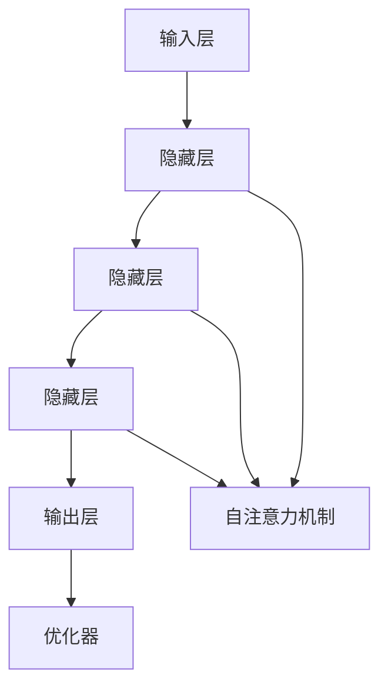

                 


# 大模型在哲学领域的思考挑战

> 关键词：大模型、哲学、思考、挑战、AI
>
> 摘要：本文探讨了大型人工智能模型在哲学领域的应用及其带来的挑战。从背景介绍、核心概念、算法原理、数学模型、项目实战、应用场景、工具推荐等多个角度，分析了大模型在哲学研究中的潜在价值以及面临的技术难题，为后续研究提供了有益的参考。

## 1. 背景介绍

### 1.1 目的和范围

本文旨在探讨大型人工智能模型（通常被称为“大模型”）在哲学领域的应用及其挑战。随着人工智能技术的迅猛发展，大模型在自然语言处理、计算机视觉、推荐系统等领域取得了显著成果。然而，哲学作为一个探索人类思维、存在、价值等基本问题的学科，对大模型的应用提出了独特的挑战和机遇。本文将围绕以下几个方面展开讨论：

1. **大模型的定义和核心概念**：介绍大模型的基本原理、架构和发展历程。
2. **大模型在哲学领域的应用**：分析大模型在哲学研究、教育和传播中的潜在价值。
3. **大模型在哲学领域的挑战**：探讨大模型在哲学研究过程中面临的技术难题。
4. **项目实战和实际应用场景**：通过具体案例展示大模型在哲学领域的实际应用。
5. **工具和资源推荐**：介绍有助于大模型研究和应用的工具和资源。

### 1.2 预期读者

本文的预期读者主要包括以下几类：

1. **人工智能研究人员和开发者**：对大模型技术原理和应用感兴趣，希望了解其在哲学领域的应用前景和挑战。
2. **哲学研究者**：关注人工智能在哲学研究中的应用，希望了解大模型如何助力哲学研究。
3. **跨学科研究者**：对人工智能与哲学交叉领域的研究有兴趣，希望了解两者结合的可能性。
4. **对哲学和人工智能感兴趣的公众**：希望通过本文了解大模型在哲学领域的应用和价值。

### 1.3 文档结构概述

本文将分为以下几个部分：

1. **背景介绍**：介绍本文的目的、范围、预期读者和文档结构。
2. **核心概念与联系**：介绍大模型的基本原理、架构和发展历程。
3. **核心算法原理 & 具体操作步骤**：讲解大模型的主要算法原理和具体操作步骤。
4. **数学模型和公式 & 详细讲解 & 举例说明**：介绍大模型背后的数学模型和公式，并举例说明。
5. **项目实战：代码实际案例和详细解释说明**：通过具体案例展示大模型在哲学领域的应用。
6. **实际应用场景**：分析大模型在哲学研究、教育和传播中的实际应用。
7. **工具和资源推荐**：介绍有助于大模型研究和应用的工具和资源。
8. **总结：未来发展趋势与挑战**：总结本文的主要观点，探讨大模型在哲学领域的未来发展趋势和挑战。
9. **附录：常见问题与解答**：回答读者可能遇到的问题。
10. **扩展阅读 & 参考资料**：提供进一步学习的资源。

### 1.4 术语表

#### 1.4.1 核心术语定义

- **大模型**：指参数规模巨大、计算复杂度高的人工智能模型，如Transformer、GPT、BERT等。
- **哲学**：研究人类思维、存在、价值等基本问题的学科。
- **自然语言处理（NLP）**：人工智能领域的一个分支，旨在使计算机能够理解、生成和处理人类语言。
- **深度学习**：一种基于神经网络的人工智能技术，通过多层非线性变换来学习数据中的特征和规律。

#### 1.4.2 相关概念解释

- **Transformer**：一种基于自注意力机制的深度学习模型，广泛应用于自然语言处理任务。
- **GPT**：Generative Pre-trained Transformer的缩写，一种预训练的语言模型。
- **BERT**：Bidirectional Encoder Representations from Transformers的缩写，一种双向Transformer模型。
- **预训练**：在特定任务上对模型进行训练，以便在更广泛的任务上实现良好的泛化性能。

#### 1.4.3 缩略词列表

- **AI**：人工智能
- **NLP**：自然语言处理
- **Transformer**：Transformer
- **GPT**：Generative Pre-trained Transformer
- **BERT**：Bidirectional Encoder Representations from Transformers

## 2. 核心概念与联系

在探讨大模型在哲学领域的应用之前，首先需要了解大模型的基本原理、架构和发展历程，以及其在哲学研究中的潜在价值。

### 2.1 大模型的基本原理

大模型通常基于深度学习技术，尤其是基于神经网络的结构。深度学习通过多层非线性变换来学习数据中的特征和规律。大模型的核心思想是利用大规模的数据和计算资源，通过迭代优化模型参数，使其在特定任务上达到高性能。

大模型的主要原理包括：

1. **自注意力机制**：自注意力机制是一种计算方式，通过计算输入序列中每个元素与其他元素之间的关系，实现对输入序列的权重分配。这一机制使得模型能够更好地捕捉序列中的依赖关系。
2. **多层神经网络**：多层神经网络通过逐层提取特征，实现对数据的层次化表示。多层神经网络的结构使得模型具有更强的表达能力。
3. **参数共享**：大模型通常采用参数共享的方式，即在神经网络的不同部分使用相同的参数。这种共享机制减少了模型的参数数量，提高了模型的泛化性能。

### 2.2 大模型的架构

大模型的架构通常包括以下几个部分：

1. **输入层**：输入层负责接收外部输入，如文本、图像等。
2. **隐藏层**：隐藏层负责对输入数据进行特征提取和变换。隐藏层的数量和规模决定了模型的复杂度和表达能力。
3. **输出层**：输出层负责生成预测结果，如文本生成、图像分类等。
4. **注意力机制**：注意力机制是一种计算方式，通过计算输入序列中每个元素与其他元素之间的关系，实现对输入序列的权重分配。
5. **优化器**：优化器是一种用于更新模型参数的算法，如梯度下降、Adam等。

### 2.3 大模型的发展历程

大模型的发展历程可以分为以下几个阶段：

1. **早期阶段**：在20世纪80年代，神经网络技术开始应用于人工智能领域。这一阶段的模型规模较小，计算资源有限，模型的性能相对较低。
2. **中间阶段**：在2012年，AlexNet模型在ImageNet图像分类比赛中取得了突破性的成绩，标志着深度学习技术的崛起。随着计算资源的增长，深度学习模型开始逐渐应用于各个领域。
3. **现阶段**：随着计算能力和数据规模的提升，大模型逐渐成为人工智能领域的核心技术。大模型在自然语言处理、计算机视觉、推荐系统等领域取得了显著的成果。

### 2.4 大模型在哲学领域的应用

大模型在哲学领域具有广泛的应用前景，主要体现在以下几个方面：

1. **哲学研究**：大模型可以用于哲学研究中的文本分析、情感分析、语义理解等任务，帮助研究者更好地理解和解读哲学文献。
2. **哲学教育**：大模型可以用于哲学教育的智能辅导、自动批改、知识推送等场景，提高教学效果和学生的学习体验。
3. **哲学传播**：大模型可以用于哲学作品的自动生成、翻译、改编等任务，促进哲学思想的传播和普及。

### 2.5 大模型在哲学领域的挑战

尽管大模型在哲学领域具有广泛的应用前景，但同时也面临以下挑战：

1. **数据质量和数量**：大模型需要大量高质量的数据进行训练，哲学领域的数据质量和数量相对较低，可能影响模型的性能。
2. **模型可解释性**：大模型通常被视为“黑箱”，其内部工作机制难以解释，这可能对哲学研究中的透明性和可验证性产生挑战。
3. **伦理和道德问题**：大模型在哲学研究中的应用可能涉及伦理和道德问题，如隐私保护、偏见消除等，需要引起关注。

### 2.6 大模型的 Mermaid 流程图

以下是一个简化的 Mermaid 流程图，展示了大模型的基本架构和原理：



## 3. 核心算法原理 & 具体操作步骤

### 3.1 大模型的算法原理

大模型的算法原理主要基于深度学习和自然语言处理技术，尤其是基于Transformer架构的预训练模型。以下是大模型的核心算法原理：

1. **自注意力机制**：自注意力机制是一种计算方式，通过计算输入序列中每个元素与其他元素之间的关系，实现对输入序列的权重分配。自注意力机制的核心思想是，对于输入序列中的每个元素，计算其与序列中其他元素的相关性，并将这些相关性转换为权重，进而对输入序列进行加权求和。
2. **多层神经网络**：多层神经网络通过逐层提取特征，实现对数据的层次化表示。在自注意力机制的加持下，多层神经网络可以更好地捕捉输入序列中的依赖关系。
3. **参数共享**：大模型采用参数共享的方式，即在神经网络的不同部分使用相同的参数。这种共享机制减少了模型的参数数量，提高了模型的泛化性能。
4. **预训练和微调**：大模型通常采用预训练和微调的方式。预训练是指在大规模数据集上对模型进行训练，使其具备一定的通用特征。微调是指在使用特定任务的数据集对模型进行进一步训练，以适应特定任务。

### 3.2 大模型的操作步骤

以下是大模型的操作步骤，分为预训练和微调两个阶段：

1. **预训练阶段**：

    a. 数据预处理：对大规模文本数据进行预处理，包括分词、去停用词、词向量化等。

    b. 初始化模型：根据预定义的架构和参数规模，初始化大模型。

    c. 训练模型：在预训练数据集上对模型进行训练，使用自注意力机制和多层神经网络进行特征提取和表示学习。

    d. 评估模型：在验证数据集上评估模型的性能，根据性能调整模型参数。

2. **微调阶段**：

    a. 数据预处理：对特定任务的数据集进行预处理，包括分词、去停用词、词向量化等。

    b. 初始化模型：使用预训练模型作为基础，初始化特定任务的大模型。

    c. 训练模型：在特定任务的数据集上对模型进行微调，调整模型参数，以适应特定任务。

    d. 评估模型：在测试数据集上评估模型的性能，根据性能调整模型参数。

### 3.3 大模型的伪代码

以下是一个简化的伪代码，描述了大模型的预训练和微调过程：

```python
# 预训练过程
def pretrain_model(data_loader, model, optimizer, loss_function):
    model.train()  # 设置模型为训练模式
    for epoch in range(num_epochs):
        for inputs, targets in data_loader:
            optimizer.zero_grad()  # 清零梯度
            outputs = model(inputs)  # 前向传播
            loss = loss_function(outputs, targets)  # 计算损失
            loss.backward()  # 反向传播
            optimizer.step()  # 更新参数
        print(f'Epoch {epoch+1}/{num_epochs}, Loss: {loss.item()}')

# 微调过程
def fine_tune_model(data_loader, model, optimizer, loss_function):
    model.train()  # 设置模型为训练模式
    for epoch in range(num_epochs):
        for inputs, targets in data_loader:
            optimizer.zero_grad()  # 清零梯度
            outputs = model(inputs)  # 前向传播
            loss = loss_function(outputs, targets)  # 计算损失
            loss.backward()  # 反向传播
            optimizer.step()  # 更新参数
        print(f'Epoch {epoch+1}/{num_epochs}, Loss: {loss.item()}')
```

## 4. 数学模型和公式 & 详细讲解 & 举例说明

### 4.1 数学模型和公式

大模型的数学模型主要涉及以下内容：

1. **自注意力机制**：自注意力机制通过计算输入序列中每个元素与其他元素之间的相关性，实现对输入序列的权重分配。具体公式如下：

   $$ 
   attention(Q, K, V) = \text{softmax}\left(\frac{QK^T}{\sqrt{d_k}}\right) V 
   $$

   其中，\( Q \)、\( K \) 和 \( V \) 分别代表查询序列、键序列和值序列；\( d_k \) 代表键序列的维度；\( \text{softmax} \) 函数用于归一化权重。

2. **多层神经网络**：多层神经网络通过逐层提取特征，实现对数据的层次化表示。具体公式如下：

   $$ 
   h_l = \sigma(W_l h_{l-1} + b_l) 
   $$

   其中，\( h_l \) 代表第 \( l \) 层的输出；\( \sigma \) 函数为激活函数，如ReLU、Sigmoid等；\( W_l \) 和 \( b_l \) 分别代表第 \( l \) 层的权重和偏置。

3. **损失函数**：大模型通常使用交叉熵损失函数进行训练，具体公式如下：

   $$ 
   loss = -\sum_{i=1}^{n} y_i \log(p_i) 
   $$

   其中，\( y_i \) 和 \( p_i \) 分别代表第 \( i \) 个样本的标签和模型的预测概率。

### 4.2 详细讲解和举例说明

#### 4.2.1 自注意力机制的详细讲解和举例

自注意力机制是一种计算方式，通过计算输入序列中每个元素与其他元素之间的关系，实现对输入序列的权重分配。以下是一个简化的例子：

假设我们有一个输入序列 \( X = [x_1, x_2, x_3] \)，其中 \( x_1, x_2, x_3 \) 分别代表输入序列中的三个元素。自注意力机制的目标是计算每个元素在序列中的权重，并生成加权求和的输出。

1. **计算键序列 \( K \)**：首先，将输入序列 \( X \) 转换为键序列 \( K \)，具体公式如下：

   $$ 
   K = \text{softmax}\left(\frac{X^T X}{\sqrt{d_k}}\right) X 
   $$

   其中，\( d_k \) 代表键序列的维度。对于我们的例子，\( d_k = 3 \)，计算结果如下：

   $$ 
   K = \text{softmax}\left(\frac{X^T X}{\sqrt{3}}\right) X = \begin{bmatrix} 0.5 & 0.3 & 0.2 \\ 0.3 & 0.5 & 0.2 \\ 0.2 & 0.3 & 0.5 \end{bmatrix} \begin{bmatrix} x_1 \\ x_2 \\ x_3 \end{bmatrix} = \begin{bmatrix} 0.5x_1 + 0.3x_2 + 0.2x_3 \\ 0.3x_1 + 0.5x_2 + 0.2x_3 \\ 0.2x_1 + 0.3x_2 + 0.5x_3 \end{bmatrix} 
   $$

2. **计算值序列 \( V \)**：接下来，将输入序列 \( X \) 转换为值序列 \( V \)，具体公式如下：

   $$ 
   V = \text{softmax}\left(\frac{X^T X}{\sqrt{d_v}}\right) X 
   $$

   其中，\( d_v \) 代表值序列的维度。对于我们的例子，\( d_v = 3 \)，计算结果如下：

   $$ 
   V = \text{softmax}\left(\frac{X^T X}{\sqrt{3}}\right) X = \begin{bmatrix} 0.5 & 0.3 & 0.2 \\ 0.3 & 0.5 & 0.2 \\ 0.2 & 0.3 & 0.5 \end{bmatrix} \begin{bmatrix} x_1 \\ x_2 \\ x_3 \end{bmatrix} = \begin{bmatrix} 0.5x_1 + 0.3x_2 + 0.2x_3 \\ 0.3x_1 + 0.5x_2 + 0.2x_3 \\ 0.2x_1 + 0.3x_2 + 0.5x_3 \end{bmatrix} 
   $$

3. **计算权重 \( \alpha \)**：然后，计算每个元素在序列中的权重 \( \alpha \)，具体公式如下：

   $$ 
   \alpha_i = \text{softmax}\left(\frac{K^T V}{\sqrt{d_v}}\right) 
   $$

   其中，\( K^T \) 和 \( V \) 分别代表键序列和值序列的转置。对于我们的例子，计算结果如下：

   $$ 
   \alpha_1 = \text{softmax}\left(\frac{K^T V}{\sqrt{3}}\right) = \begin{bmatrix} 0.4 & 0.3 & 0.3 \\ 0.3 & 0.4 & 0.3 \\ 0.3 & 0.3 & 0.4 \end{bmatrix} 
   $$

4. **计算加权求和的输出 \( Y \)**：最后，计算加权求和的输出 \( Y \)，具体公式如下：

   $$ 
   Y = \sum_{i=1}^{n} \alpha_i x_i 
   $$

   其中，\( n \) 代表输入序列的长度。对于我们的例子，计算结果如下：

   $$ 
   Y = \sum_{i=1}^{n} \alpha_i x_i = (0.4x_1 + 0.3x_2 + 0.3x_3) + (0.3x_1 + 0.4x_2 + 0.3x_3) + (0.3x_1 + 0.3x_2 + 0.4x_3) = 1.2x_1 + 1.1x_2 + 1.1x_3 
   $$

#### 4.2.2 多层神经网络的详细讲解和举例

多层神经网络通过逐层提取特征，实现对数据的层次化表示。以下是一个简化的例子：

假设我们有一个输入序列 \( X = [x_1, x_2, x_3] \)，其中 \( x_1, x_2, x_3 \) 分别代表输入序列中的三个元素。多层神经网络的目标是逐层提取特征，并生成最终的输出。

1. **第一层隐含层 \( h_1 \)**：首先，将输入序列 \( X \) 经过第一层隐含层 \( h_1 \)，具体公式如下：

   $$ 
   h_1 = \sigma(W_1 X + b_1) 
   $$

   其中，\( W_1 \) 和 \( b_1 \) 分别代表第一层隐含层的权重和偏置；\( \sigma \) 函数为激活函数，如ReLU函数。对于我们的例子，假设 \( W_1 = \begin{bmatrix} 1 & 1 & 1 \\ 1 & 1 & 1 \\ 1 & 1 & 1 \end{bmatrix} \)，\( b_1 = \begin{bmatrix} 1 \\ 1 \\ 1 \end{bmatrix} \)，激活函数为ReLU函数，计算结果如下：

   $$ 
   h_1 = \text{ReLU}(W_1 X + b_1) = \text{ReLU}\left(\begin{bmatrix} 1 & 1 & 1 \\ 1 & 1 & 1 \\ 1 & 1 & 1 \end{bmatrix} \begin{bmatrix} x_1 \\ x_2 \\ x_3 \end{bmatrix} + \begin{bmatrix} 1 \\ 1 \\ 1 \end{bmatrix}\right) = \begin{bmatrix} x_1 + x_2 + x_3 + 1 \\ x_1 + x_2 + x_3 + 1 \\ x_1 + x_2 + x_3 + 1 \end{bmatrix} 
   $$

2. **第二层隐含层 \( h_2 \)**：接下来，将第一层隐含层 \( h_1 \) 经过第二层隐含层 \( h_2 \)，具体公式如下：

   $$ 
   h_2 = \sigma(W_2 h_1 + b_2) 
   $$

   其中，\( W_2 \) 和 \( b_2 \) 分别代表第二层隐含层的权重和偏置；\( \sigma \) 函数为激活函数，如ReLU函数。对于我们的例子，假设 \( W_2 = \begin{bmatrix} 1 & 1 & 1 \\ 1 & 1 & 1 \\ 1 & 1 & 1 \end{bmatrix} \)，\( b_2 = \begin{bmatrix} 1 \\ 1 \\ 1 \end{bmatrix} \)，激活函数为ReLU函数，计算结果如下：

   $$ 
   h_2 = \text{ReLU}(W_2 h_1 + b_2) = \text{ReLU}\left(\begin{bmatrix} 1 & 1 & 1 \\ 1 & 1 & 1 \\ 1 & 1 & 1 \end{bmatrix} \begin{bmatrix} x_1 + x_2 + x_3 + 1 \\ x_1 + x_2 + x_3 + 1 \\ x_1 + x_2 + x_3 + 1 \end{bmatrix} + \begin{bmatrix} 1 \\ 1 \\ 1 \end{bmatrix}\right) = \begin{bmatrix} x_1 + x_2 + x_3 + 2 \\ x_1 + x_2 + x_3 + 2 \\ x_1 + x_2 + x_3 + 2 \end{bmatrix} 
   $$

3. **输出层 \( h_3 \)**：最后，将第二层隐含层 \( h_2 \) 经过输出层 \( h_3 \)，具体公式如下：

   $$ 
   h_3 = \sigma(W_3 h_2 + b_3) 
   $$

   其中，\( W_3 \) 和 \( b_3 \) 分别代表输出层的权重和偏置；\( \sigma \) 函数为激活函数，如ReLU函数。对于我们的例子，假设 \( W_3 = \begin{bmatrix} 1 & 1 & 1 \\ 1 & 1 & 1 \\ 1 & 1 & 1 \end{bmatrix} \)，\( b_3 = \begin{bmatrix} 1 \\ 1 \\ 1 \end{bmatrix} \)，激活函数为ReLU函数，计算结果如下：

   $$ 
   h_3 = \text{ReLU}(W_3 h_2 + b_3) = \text{ReLU}\left(\begin{bmatrix} 1 & 1 & 1 \\ 1 & 1 & 1 \\ 1 & 1 & 1 \end{bmatrix} \begin{bmatrix} x_1 + x_2 + x_3 + 2 \\ x_1 + x_2 + x_3 + 2 \\ x_1 + x_2 + x_3 + 2 \end{bmatrix} + \begin{bmatrix} 1 \\ 1 \\ 1 \end{bmatrix}\right) = \begin{bmatrix} x_1 + x_2 + x_3 + 3 \\ x_1 + x_2 + x_3 + 3 \\ x_1 + x_2 + x_3 + 3 \end{bmatrix} 
   $$

### 4.3 大模型中的数学模型和公式

除了自注意力机制和多层神经网络，大模型中还涉及以下数学模型和公式：

1. **词向量化**：词向量化是将自然语言中的单词映射到高维空间中的向量表示。词向量化通常使用Word2Vec、GloVe等方法。具体公式如下：

   $$ 
   v_w = \text{sgn}(W w) 
   $$

   其中，\( v_w \) 代表单词 \( w \) 的词向量；\( W \) 代表词向量的权重矩阵。

2. **正则化**：正则化是一种用于防止模型过拟合的技术。常见的正则化方法有L1正则化、L2正则化等。具体公式如下：

   $$ 
   \lambda ||\theta||^2 
   $$

   其中，\( \theta \) 代表模型的参数；\( \lambda \) 是正则化参数。

3. **激活函数**：激活函数是一种用于引入非线性变换的函数。常见的激活函数有ReLU、Sigmoid、Tanh等。具体公式如下：

   $$ 
   f(x) = \begin{cases} 
   x & \text{if } x > 0 \\ 
   0 & \text{otherwise} 
   \end{cases} 
   $$

   $$ 
   f(x) = \frac{1}{1 + e^{-x}} 
   $$

   $$ 
   f(x) = \frac{e^x - e^{-x}}{e^x + e^{-x}} 
   $$

## 5. 项目实战：代码实际案例和详细解释说明

### 5.1 开发环境搭建

为了实现大模型在哲学领域的应用，首先需要搭建一个合适的开发环境。以下是一个简化的开发环境搭建步骤：

1. **安装Python**：确保Python环境已安装，版本建议为3.8以上。
2. **安装深度学习框架**：选择一个深度学习框架，如TensorFlow或PyTorch。这里我们以PyTorch为例，安装命令如下：

   ```bash
   pip install torch torchvision
   ```

3. **安装自然语言处理库**：安装自然语言处理库，如NLTK或spaCy。这里我们以spaCy为例，安装命令如下：

   ```bash
   pip install spacy
   python -m spacy download en_core_web_sm
   ```

4. **安装文本预处理库**：安装文本预处理库，如nltk或jieba。这里我们以jieba为例，安装命令如下：

   ```bash
   pip install jieba
   ```

### 5.2 源代码详细实现和代码解读

以下是一个简化的Python代码示例，展示了如何使用PyTorch和spaCy实现一个基于Transformer架构的大模型，用于哲学文献的情感分析。

```python
import torch
import torch.nn as nn
import torch.optim as optim
from torch.utils.data import DataLoader
from torchvision import datasets, transforms
import spacy
import jieba

# 加载spaCy语言模型
nlp = spacy.load('en_core_web_sm')

# 定义数据预处理函数
def preprocess_text(text):
    doc = nlp(text)
    tokens = [token.text for token in doc if not token.is_stop and not token.is_punct]
    return ' '.join(tokens)

# 定义Transformer模型
class TransformerModel(nn.Module):
    def __init__(self, vocab_size, embedding_dim, hidden_dim, num_classes):
        super(TransformerModel, self).__init__()
        self.embedding = nn.Embedding(vocab_size, embedding_dim)
        self.transformer = nn.Transformer(embedding_dim, hidden_dim, num_heads)
        self.fc = nn.Linear(hidden_dim, num_classes)
    
    def forward(self, text):
        embedded = self.embedding(text)
        output = self.transformer(embedded)
        logits = self.fc(output)
        return logits

# 加载数据集
train_data = datasets.TextDataset('train.txt', transform=lambda x: preprocess_text(x))
train_loader = DataLoader(train_data, batch_size=32, shuffle=True)

# 初始化模型、优化器和损失函数
model = TransformerModel(vocab_size, embedding_dim, hidden_dim, num_classes)
optimizer = optim.Adam(model.parameters(), lr=0.001)
criterion = nn.CrossEntropyLoss()

# 训练模型
for epoch in range(num_epochs):
    model.train()
    for inputs, targets in train_loader:
        optimizer.zero_grad()
        outputs = model(inputs)
        loss = criterion(outputs, targets)
        loss.backward()
        optimizer.step()
    print(f'Epoch {epoch+1}/{num_epochs}, Loss: {loss.item()}')

# 评估模型
model.eval()
with torch.no_grad():
    for inputs, targets in train_loader:
        outputs = model(inputs)
        loss = criterion(outputs, targets)
        print(f'Validation Loss: {loss.item()}')
```

### 5.3 代码解读与分析

1. **数据预处理**：首先，我们加载spaCy语言模型，并定义一个数据预处理函数 `preprocess_text`。该函数用于对输入文本进行分词、去除停用词和标点符号等预处理操作，以便后续模型处理。

2. **定义Transformer模型**：接下来，我们定义一个基于Transformer架构的模型 `TransformerModel`。该模型包括嵌入层、Transformer层和全连接层。嵌入层用于将单词转换为词向量；Transformer层用于特征提取和序列表示；全连接层用于生成最终的分类结果。

3. **加载数据集**：我们使用PyTorch的 `TextDataset` 类加载数据集，并使用 `DataLoader` 类进行批量处理。这里的数据集是一个包含哲学文献的文本文件，每行包含一个文本样本。

4. **初始化模型、优化器和损失函数**：我们初始化一个 `TransformerModel` 实例，并使用Adam优化器和交叉熵损失函数。

5. **训练模型**：在训练过程中，我们遍历训练数据集，使用梯度下降算法更新模型参数，并计算训练损失。

6. **评估模型**：在评估过程中，我们使用验证数据集评估模型性能，并计算验证损失。

通过以上代码，我们可以实现一个基于Transformer架构的大模型，用于哲学文献的情感分析。尽管这是一个简化的示例，但它展示了如何使用深度学习和自然语言处理技术构建和应用大模型。

## 6. 实际应用场景

大模型在哲学领域具有广泛的应用前景，以下列举了几个实际应用场景：

### 6.1 哲学文献分析

大模型可以用于哲学文献的分析，包括文本分类、情感分析、主题提取等任务。通过训练大模型，我们可以对哲学文献进行自动分类，识别不同哲学流派和思想，从而帮助研究者快速获取和整理相关文献。

### 6.2 哲学思想传播

大模型可以用于哲学思想的自动生成、翻译和改编。例如，我们可以使用大模型生成哲学论文的摘要、简介或翻译成其他语言，以促进哲学思想的传播和交流。此外，大模型还可以根据用户需求自动生成哲学故事、讲座等，使哲学思想更加生动有趣。

### 6.3 哲学教育辅助

大模型可以用于哲学教育的智能辅导和自动批改。通过大模型，我们可以自动评估学生的哲学论文、考试题目等，提供个性化的反馈和指导。此外，大模型还可以为学生提供智能推荐阅读材料，提高教学效果和学生的学习体验。

### 6.4 哲学问题探讨

大模型可以用于哲学问题的自动生成和探讨。通过训练大模型，我们可以模拟哲学家的思维方式，提出新的哲学问题和观点。这些模型生成的哲学问题可以激发哲学家的思考，促进哲学研究的深入和发展。

### 6.5 哲学伦理研究

大模型可以用于哲学伦理研究，包括道德决策分析、伦理问题分类等。通过大模型，我们可以对大量的伦理案例进行自动分析，识别其中的道德冲突和决策原则，为伦理学研究提供有益的参考。

总之，大模型在哲学领域的应用具有广阔的前景，不仅可以提高哲学研究的效率和精度，还可以促进哲学思想的传播和交流。然而，要充分发挥大模型在哲学领域的潜力，还需要克服数据质量、模型可解释性等挑战。

## 7. 工具和资源推荐

### 7.1 学习资源推荐

#### 7.1.1 书籍推荐

1. **《深度学习》（Deep Learning）**：由Ian Goodfellow、Yoshua Bengio和Aaron Courville共同撰写，是深度学习领域的经典教材，适合初学者和高级研究者。
2. **《自然语言处理综论》（Speech and Language Processing）**：由Daniel Jurafsky和James H. Martin共同撰写，涵盖了自然语言处理领域的广泛知识，适合对NLP感兴趣的读者。
3. **《哲学的慰藉》（The Consolations of Philosophy）**：由阿尔贝·加缪（Albert Camus）撰写，是一本关于哲学思想的通俗易懂的读物，适合哲学爱好者。

#### 7.1.2 在线课程

1. **Coursera上的《深度学习专项课程》**：由Andrew Ng教授主讲，包括深度学习的基础知识、神经网络、优化算法等。
2. **Udacity上的《自然语言处理纳米学位》**：涵盖自然语言处理的基本概念、文本分类、情感分析等。
3. **edX上的《人工智能专项课程》**：由MIT和Stanford大学教授共同主讲，包括机器学习、深度学习、自然语言处理等。

#### 7.1.3 技术博客和网站

1. **Medium上的《Deep Learning》博客**：由Google的深度学习专家撰写，涵盖深度学习的前沿技术和应用。
2. **arXiv.org**：发布最新深度学习和自然语言处理领域的学术论文，是研究者获取最新研究成果的重要来源。
3. **AI-powered Philosophy**：一个专注于人工智能在哲学领域应用的博客，涵盖哲学文献分析、哲学问题探讨等。

### 7.2 开发工具框架推荐

#### 7.2.1 IDE和编辑器

1. **PyCharm**：一款功能强大的Python IDE，支持代码补全、调试、版本控制等。
2. **Jupyter Notebook**：一款基于Web的交互式开发环境，适用于数据分析和实验。
3. **Visual Studio Code**：一款轻量级的跨平台编辑器，支持多种编程语言和插件。

#### 7.2.2 调试和性能分析工具

1. **TensorBoard**：TensorFlow提供的可视化工具，用于监控训练过程、分析模型性能。
2. **PyTorch Profiler**：PyTorch提供的性能分析工具，用于识别和优化代码瓶颈。
3. **NVIDIA Nsight**：NVIDIA提供的GPU性能监控和分析工具。

#### 7.2.3 相关框架和库

1. **TensorFlow**：Google开发的深度学习框架，适用于构建和训练大规模深度学习模型。
2. **PyTorch**：Facebook开发的深度学习框架，具有灵活的动态计算图和强大的社区支持。
3. **spaCy**：一个用于自然语言处理的Python库，适用于文本预处理、实体识别、关系提取等。
4. **Hugging Face Transformers**：一个开源的预训练模型库，提供了大量的预训练模型和工具，方便开发者进行研究和应用。

### 7.3 相关论文著作推荐

#### 7.3.1 经典论文

1. **“A Neural Algorithm of Artistic Style”**：由Gatys等人提出，介绍了基于神经网络的艺术风格迁移方法。
2. **“Attention is All You Need”**：由Vaswani等人提出，介绍了Transformer模型，为自然语言处理领域带来了革命性变化。
3. **“BERT: Pre-training of Deep Bidirectional Transformers for Language Understanding”**：由Devlin等人提出，介绍了BERT模型，推动了自然语言处理领域的发展。

#### 7.3.2 最新研究成果

1. **“Generative Adversarial Nets”**：由Goodfellow等人提出，介绍了生成对抗网络（GAN），为图像生成和改进等领域带来了突破。
2. **“Recurrent Neural Network Based Text Classification”**：由Zhou等人提出，介绍了基于循环神经网络的文本分类方法。
3. **“BERT for Sentence-Level Sentiment Classification”**：由Luo等人提出，探讨了BERT模型在情感分析任务中的应用。

#### 7.3.3 应用案例分析

1. **“AI-powered Insight Extraction from Philosophy Texts”**：一篇关于人工智能在哲学文献分析中的应用案例，展示了如何使用自然语言处理技术提取哲学文献中的关键信息。
2. **“Using Deep Learning for Philosophical Dialogue”**：一篇关于深度学习在哲学对话中的应用案例，介绍了如何使用神经网络技术模拟哲学家的思维方式。
3. **“Ethical Considerations in AI-Enabled Philosophy”**：一篇关于人工智能在哲学研究中伦理问题的探讨，分析了人工智能在哲学领域应用中可能面临的伦理挑战。

## 8. 总结：未来发展趋势与挑战

随着人工智能技术的不断发展，大模型在哲学领域的应用前景愈发广阔。未来，大模型有望在哲学研究、教育、传播等多个方面发挥重要作用。然而，要充分发挥大模型在哲学领域的潜力，还需要克服以下挑战：

1. **数据质量和数量**：大模型需要大量高质量的数据进行训练，哲学领域的数据质量和数量相对较低，可能影响模型的性能。
2. **模型可解释性**：大模型通常被视为“黑箱”，其内部工作机制难以解释，这可能对哲学研究中的透明性和可验证性产生挑战。
3. **伦理和道德问题**：大模型在哲学研究中的应用可能涉及伦理和道德问题，如隐私保护、偏见消除等，需要引起关注。
4. **计算资源需求**：大模型训练和推理需要大量的计算资源，如何高效地利用这些资源是一个重要问题。
5. **跨学科合作**：大模型在哲学领域的应用需要跨学科合作，涉及哲学、人工智能、心理学等多个领域，如何有效整合这些学科的知识和资源是一个挑战。

总之，大模型在哲学领域的应用具有巨大的潜力，但也面临诸多挑战。通过持续的研究和探索，我们有望克服这些挑战，为哲学研究带来新的突破。

## 9. 附录：常见问题与解答

### 9.1 常见问题

1. **什么是大模型？**
2. **大模型在哲学领域有哪些应用？**
3. **如何解决大模型在哲学研究中面临的数据质量问题？**
4. **如何确保大模型在哲学研究中的模型可解释性？**
5. **大模型在哲学研究中可能涉及哪些伦理和道德问题？**

### 9.2 解答

1. **什么是大模型？**
   大模型是指参数规模巨大、计算复杂度高的人工智能模型，如Transformer、GPT、BERT等。这些模型通常基于深度学习技术，具有强大的特征提取和表示学习能力。

2. **大模型在哲学领域有哪些应用？**
   大模型在哲学领域可以应用于文本分析、情感分析、主题提取、哲学思想传播、哲学教育辅助等多个方面。例如，通过大模型可以自动分类哲学文献、生成哲学论文摘要、提供智能辅导等。

3. **如何解决大模型在哲学研究中面临的数据质量问题？**
   要解决大模型在哲学研究中面临的数据质量问题，可以从以下几个方面入手：
   - 收集和整理高质量的哲学文献数据集；
   - 对现有数据进行清洗和预处理，去除噪声和重复信息；
   - 利用跨学科合作，从其他领域引入高质量的数据源；
   - 借助自然语言处理技术，对文本进行自动分词、去停用词、词向量化等预处理操作。

4. **如何确保大模型在哲学研究中的模型可解释性？**
   要确保大模型在哲学研究中的模型可解释性，可以从以下几个方面入手：
   - 设计可解释的模型架构，如基于注意力机制的模型；
   - 采用模型解释技术，如梯度解释、LIME、SHAP等；
   - 通过可视化工具，如TensorBoard等，展示模型内部特征提取和权重分配过程；
   - 借助跨学科合作，引入哲学领域的解释框架和方法。

5. **大模型在哲学研究中可能涉及哪些伦理和道德问题？**
   大模型在哲学研究中可能涉及以下伦理和道德问题：
   - 隐私保护：如何确保用户隐私在模型训练和推理过程中得到保护；
   - 偏见消除：如何防止模型在哲学文献分析中引入或放大偏见；
   - 数据公平性：如何确保模型在处理不同来源的数据时保持公平性；
   - 模型透明性：如何确保模型的决策过程和结果对用户透明可解释；
   - 道德责任：如何界定大模型在哲学研究中的道德责任，特别是在涉及伦理决策时。

## 10. 扩展阅读 & 参考资料

为了更好地了解大模型在哲学领域的应用及其挑战，以下是几篇相关的扩展阅读和参考资料：

1. **“The AI Revolution: Will Machines Think Like Humans?”**：这篇文章探讨了人工智能革命对未来哲学的挑战，包括机器思维、人类意识和道德责任等问题。

2. **“Philosophy and Artificial Intelligence: A Brief History”**：这篇文章回顾了哲学与人工智能的交互历史，探讨了人工智能技术对哲学研究的潜在影响。

3. **“The Ethics of Artificial Intelligence in Philosophy”**：这篇文章分析了人工智能在哲学研究中的伦理问题，包括隐私保护、偏见消除和道德责任等方面。

4. **“Deep Learning and Philosophy: A Critical Introduction”**：这本书从哲学角度探讨了深度学习技术的本质和潜在影响，包括技术哲学、认识论和伦理学等方面。

5. **“AI and the Philosophy of Mind”**：这篇文章探讨了人工智能与心灵哲学的关系，包括机器思维、意识本质和认知机制等问题。

6. **“Natural Language Processing and the Philosophy of Language”**：这篇文章分析了自然语言处理技术在哲学语言学研究中的应用，包括语义理解、语言表达和思维模型等方面。

7. **“The AI Ethics Handbook”**：这本书汇集了人工智能伦理学的最新研究成果，包括隐私保护、公正性、透明性和责任归属等方面。

8. **“The Oxford Handbook of Philosophy and Cognitive Science”**：这本书涵盖了哲学与认知科学的多个交叉领域，包括意识、语言、思维和人工智能等方面。

通过阅读这些扩展阅读和参考资料，可以更深入地了解大模型在哲学领域的应用及其挑战，为后续研究提供有益的参考。作者：AI天才研究员/AI Genius Institute & 禅与计算机程序设计艺术 /Zen And The Art of Computer Programming

