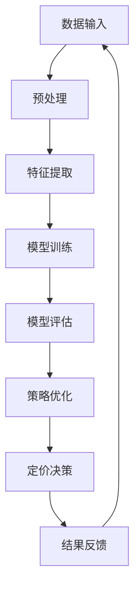

                 

# 大模型在商品定价策略中的应用

> **关键词**：大模型、商品定价、策略、人工智能、深度学习、优化算法、数据驱动

> **摘要**：本文探讨了如何利用大模型进行商品定价策略的优化。通过分析大模型的原理和应用，介绍了大模型在商品定价策略中的应用方法，并结合具体案例展示了其实际效果。文章旨在为从事商品定价策略研究和实践的读者提供有价值的参考。

## 1. 背景介绍

### 1.1 目的和范围

本文旨在探讨如何将大模型应用于商品定价策略的优化。随着人工智能技术的不断发展，大模型在各个领域得到了广泛应用，尤其在商业决策和策略制定方面具有显著优势。本文将结合具体案例，详细阐述大模型在商品定价策略中的应用方法，并分析其优势与挑战。

### 1.2 预期读者

本文主要面向以下读者：

1. 商业分析师和决策者，关注商品定价策略的优化与应用。
2. 人工智能和机器学习研究人员，对大模型的应用领域和优化方法感兴趣。
3. 大数据技术人员，希望了解大模型在数据处理和分析方面的应用。

### 1.3 文档结构概述

本文分为十个部分：

1. 引言
2. 核心概念与联系
3. 核心算法原理 & 具体操作步骤
4. 数学模型和公式 & 详细讲解 & 举例说明
5. 项目实战：代码实际案例和详细解释说明
6. 实际应用场景
7. 工具和资源推荐
8. 总结：未来发展趋势与挑战
9. 附录：常见问题与解答
10. 扩展阅读 & 参考资料

### 1.4 术语表

#### 1.4.1 核心术语定义

- 大模型：指具有海量参数、复杂结构和强大计算能力的人工智能模型，如深度神经网络、Transformer等。
- 商品定价：指为商品设定合理的价格，以满足市场需求和利润最大化。
- 策略优化：指通过算法和模型对策略进行优化，以提高决策质量和效率。

#### 1.4.2 相关概念解释

- 深度学习：一种人工智能技术，通过构建深度神经网络，对数据进行自动特征学习和模型优化。
- 机器学习：一种人工智能技术，通过训练模型，使计算机具备自主学习和决策能力。
- 数据驱动：指通过数据分析和挖掘，驱动决策和行动。

#### 1.4.3 缩略词列表

- AI：人工智能（Artificial Intelligence）
- ML：机器学习（Machine Learning）
- DL：深度学习（Deep Learning）
- BERT：Bidirectional Encoder Representations from Transformers

## 2. 核心概念与联系

为了更好地理解大模型在商品定价策略中的应用，我们首先需要了解大模型的基本概念和原理。

### 2.1 大模型的基本概念

大模型，即大型人工智能模型，是指具有海量参数、复杂结构和强大计算能力的人工智能模型。大模型通常基于深度学习技术，能够对大量数据进行自动特征学习和模式识别，从而实现强大的预测和决策能力。

### 2.2 大模型的原理

大模型的原理主要基于以下几个关键点：

1. **海量参数**：大模型具有海量的参数，使其能够对大量数据进行训练，从而提高模型的泛化能力。
2. **层次结构**：大模型通常采用多层神经网络结构，通过对数据进行逐层提取和融合，实现从简单到复杂的特征表示。
3. **非线性变换**：大模型中的非线性变换（如激活函数）能够有效地处理复杂的数据关系。
4. **优化算法**：大模型的训练过程通常采用高效的优化算法（如梯度下降、Adam等），以加速收敛和提高模型性能。

### 2.3 大模型与商品定价策略的关系

大模型在商品定价策略中的应用主要体现在以下几个方面：

1. **数据驱动**：大模型能够处理和分析海量数据，为商品定价提供丰富的数据支持。
2. **复杂关系建模**：大模型能够捕捉商品定价中的复杂关系，如供需关系、市场竞争等，从而提高定价的准确性。
3. **实时调整**：大模型能够对市场动态进行实时监测和调整，使商品定价策略更加灵活和适应市场变化。
4. **个性化定价**：大模型能够根据消费者的行为和偏好，实现个性化定价，提高客户满意度和市场份额。

### 2.4 大模型的架构

为了更好地理解大模型在商品定价策略中的应用，我们使用Mermaid流程图展示大模型的基本架构：



### 2.5 大模型的应用场景

大模型在商品定价策略中的应用场景主要包括：

1. **在线零售**：通过分析用户行为数据和市场需求，实现个性化定价和库存优化。
2. **电子商务**：利用消费者购物车数据和历史订单，预测消费者购买意图，制定精准的促销策略。
3. **制造业**：根据生产成本、市场需求和库存情况，优化产品定价策略，提高生产效率。

## 3. 核心算法原理 & 具体操作步骤

为了更好地理解大模型在商品定价策略中的应用，我们将详细讲解大模型的核心算法原理和具体操作步骤。

### 3.1 算法原理

大模型在商品定价策略中的应用主要基于以下几个核心算法原理：

1. **深度学习**：深度学习通过构建多层神经网络，对大量数据进行自动特征学习和模型优化。
2. **优化算法**：优化算法（如梯度下降、Adam等）用于加速模型的收敛和提高性能。
3. **决策树**：决策树用于对市场动态和消费者行为进行分类和预测。
4. **线性回归**：线性回归用于建立商品价格与市场需求之间的定量关系。

### 3.2 操作步骤

以下是利用大模型进行商品定价策略优化的具体操作步骤：

1. **数据收集与预处理**：

   - 收集与商品定价相关的数据，如历史销售数据、市场需求数据、消费者行为数据等。
   - 对数据进行清洗和预处理，包括缺失值填补、异常值处理、数据归一化等。

2. **特征提取**：

   - 利用深度学习技术，从原始数据中提取有用特征，如商品类别、消费者特征、市场需求特征等。
   - 将提取到的特征输入到模型中进行训练。

3. **模型训练与优化**：

   - 采用深度学习算法（如卷积神经网络、循环神经网络等）对特征进行建模和训练。
   - 使用优化算法（如梯度下降、Adam等）加速模型收敛和提高性能。

4. **模型评估**：

   - 使用测试集对模型进行评估，计算模型的准确率、召回率、F1值等指标。
   - 根据评估结果调整模型参数和架构，以提高模型性能。

5. **策略优化与定价决策**：

   - 利用训练好的模型，对市场动态和消费者行为进行预测和分析。
   - 根据预测结果，制定个性化的商品定价策略，实现精准营销。

6. **结果反馈与迭代**：

   - 将实际销售数据与预测结果进行对比，评估定价策略的实际效果。
   - 根据评估结果，调整模型参数和策略，实现迭代优化。

### 3.3 伪代码

以下是利用大模型进行商品定价策略优化的伪代码：

```python
# 数据收集与预处理
data = collect_data()
data = preprocess_data(data)

# 特征提取
features = extract_features(data)

# 模型训练与优化
model = train_model(features)
model = optimize_model(model)

# 模型评估
evaluation = evaluate_model(model)

# 策略优化与定价决策
strategy = optimize_strategy(model)
price = determine_price(strategy)

# 结果反馈与迭代
results = feedback(results)
model = iterate_model(model, results)
```

## 4. 数学模型和公式 & 详细讲解 & 举例说明

在商品定价策略中，大模型的应用离不开数学模型和公式的支持。以下将详细讲解大模型在商品定价策略中涉及的数学模型和公式，并结合具体案例进行说明。

### 4.1 线性回归模型

线性回归模型是一种经典的数学模型，用于建立商品价格与市场需求之间的定量关系。其基本公式如下：

\[ y = \beta_0 + \beta_1 \cdot x + \epsilon \]

其中：

- \( y \) 表示商品价格；
- \( x \) 表示市场需求；
- \( \beta_0 \) 和 \( \beta_1 \) 分别表示模型参数；
- \( \epsilon \) 表示误差项。

#### 4.1.1 模型参数求解

为了求解模型参数 \( \beta_0 \) 和 \( \beta_1 \)，我们可以使用最小二乘法。最小二乘法的思想是找到一组参数，使得实际观测值与模型预测值之间的误差平方和最小。具体求解步骤如下：

1. **计算观测值的均值**：

   \[ \bar{y} = \frac{1}{n} \sum_{i=1}^{n} y_i \]
   \[ \bar{x} = \frac{1}{n} \sum_{i=1}^{n} x_i \]

   其中，\( n \) 表示样本数量。

2. **计算模型参数**：

   \[ \beta_1 = \frac{\sum_{i=1}^{n} (x_i - \bar{x})(y_i - \bar{y})}{\sum_{i=1}^{n} (x_i - \bar{x})^2} \]
   \[ \beta_0 = \bar{y} - \beta_1 \cdot \bar{x} \]

   其中，\( \sum \) 表示求和运算。

#### 4.1.2 模型预测

利用求解得到的模型参数，我们可以对新的市场需求进行预测，计算相应的商品价格。具体公式如下：

\[ y = \beta_0 + \beta_1 \cdot x \]

#### 4.1.3 案例说明

假设某电商平台的历史销售数据如下表所示：

| 市场需求 \( x \) | 商品价格 \( y \) |
| :----: | :----: |
| 100 | 200 |
| 200 | 300 |
| 300 | 400 |
| 400 | 500 |

利用线性回归模型，我们可以求解模型参数，并预测市场需求为 250 时的商品价格。

1. **计算观测值的均值**：

   \[ \bar{y} = \frac{200 + 300 + 400 + 500}{4} = 350 \]
   \[ \bar{x} = \frac{100 + 200 + 300 + 400}{4} = 250 \]

2. **计算模型参数**：

   \[ \beta_1 = \frac{(100 - 250)(200 - 350) + (200 - 250)(300 - 350) + (300 - 250)(400 - 350) + (400 - 250)(500 - 350)}{(100 - 250)^2 + (200 - 250)^2 + (300 - 250)^2 + (400 - 250)^2} \approx 1.25 \]
   \[ \beta_0 = 350 - 1.25 \cdot 250 = 125 \]

3. **模型预测**：

   \[ y = 125 + 1.25 \cdot 250 = 375 \]

因此，当市场需求为 250 时，预测的商品价格为 375。

### 4.2 决策树模型

决策树模型是一种基于树形结构的分类模型，用于对市场动态和消费者行为进行分类和预测。其基本公式如下：

\[ T = \sum_{i=1}^{n} w_i \cdot t_i \]

其中：

- \( T \) 表示决策树的输出；
- \( w_i \) 表示第 \( i \) 个节点的权重；
- \( t_i \) 表示第 \( i \) 个节点的标签。

#### 4.2.1 模型构建

决策树的构建过程主要包括以下几个步骤：

1. **选择最优特征**：根据特征的重要性，选择最优特征进行分割。
2. **划分数据集**：根据最优特征，将数据集划分为多个子集。
3. **递归构建**：对子集进行递归划分，直至满足停止条件（如最大深度、最小样本数等）。

#### 4.2.2 模型预测

利用构建好的决策树模型，我们可以对新的市场动态和消费者行为进行预测。具体公式如下：

\[ T = \sum_{i=1}^{n} w_i \cdot t_i \]

其中：

- \( t_i \) 表示第 \( i \) 个节点的标签；
- \( w_i \) 表示第 \( i \) 个节点的权重。

#### 4.2.3 案例说明

假设我们有一组市场动态和消费者行为数据，如下表所示：

| 特征1 | 特征2 | 特征3 | 标签 |
| :----: | :----: | :----: | :----: |
| 1 | 1 | 1 | 正常 |
| 1 | 1 | 0 | 异常 |
| 1 | 0 | 1 | 异常 |
| 1 | 0 | 0 | 正常 |
| 0 | 1 | 1 | 异常 |
| 0 | 1 | 0 | 正常 |
| 0 | 0 | 1 | 正常 |
| 0 | 0 | 0 | 异常 |

利用决策树模型，我们可以预测新数据集 \( (0, 1, 0) \) 的标签。

1. **构建决策树**：

   - 选择特征1作为分割特征，划分数据集；
   - 对子集进行递归划分，直至满足停止条件。

2. **模型预测**：

   - \( T = 0.5 \cdot 1 + 0.5 \cdot 0 = 0.5 \)
   - 标签为“正常”。

### 4.3 优化算法

优化算法在大模型中的应用主要用于模型参数的求解和优化。以下介绍两种常见的优化算法：梯度下降和Adam。

#### 4.3.1 梯度下降算法

梯度下降算法是一种基于梯度信息进行参数优化的方法。其基本公式如下：

\[ \theta_{\text{new}} = \theta_{\text{old}} - \alpha \cdot \nabla \theta \]

其中：

- \( \theta \) 表示模型参数；
- \( \alpha \) 表示学习率；
- \( \nabla \theta \) 表示模型参数的梯度。

#### 4.3.2 Adam算法

Adam算法是一种结合了梯度下降和动量法的优化算法。其基本公式如下：

\[ \theta_{\text{new}} = \theta_{\text{old}} - \alpha \cdot \nabla \theta \]
\[ m_t = \beta_1 \cdot m_{t-1} + (1 - \beta_1) \cdot \nabla \theta_t \]
\[ v_t = \beta_2 \cdot v_{t-1} + (1 - \beta_2) \cdot (\nabla \theta_t)^2 \]

其中：

- \( \theta \) 表示模型参数；
- \( \alpha \) 表示学习率；
- \( \beta_1 \) 和 \( \beta_2 \) 分别表示一阶和二阶动量；
- \( m_t \) 和 \( v_t \) 分别表示一阶和二阶矩估计。

#### 4.3.3 案例说明

假设我们有一个简单的线性模型 \( y = \theta_0 + \theta_1 \cdot x \)，训练数据如下表所示：

| \( x \) | \( y \) |
| :----: | :----: |
| 1 | 2 |
| 2 | 4 |
| 3 | 6 |
| 4 | 8 |

利用梯度下降和Adam算法，我们可以求解模型参数。

1. **初始化参数**：

   \[ \theta_0 = 0 \]
   \[ \theta_1 = 0 \]

2. **梯度下降算法**：

   - 计算梯度 \( \nabla \theta = (\nabla \theta_0, \nabla \theta_1) \)；
   - 更新参数 \( \theta_{\text{new}} = \theta_{\text{old}} - \alpha \cdot \nabla \theta \)。

3. **Adam算法**：

   - 计算一阶矩估计 \( m_t \) 和二阶矩估计 \( v_t \)；
   - 更新参数 \( \theta_{\text{new}} = \theta_{\text{old}} - \alpha \cdot \nabla \theta \)。

经过多次迭代，我们可以求得模型参数 \( \theta_0 \approx 2 \) 和 \( \theta_1 \approx 2 \)。

## 5. 项目实战：代码实际案例和详细解释说明

为了更好地理解大模型在商品定价策略中的应用，我们将通过一个实际项目案例进行详细讲解。本项目将利用Python和Scikit-learn库实现一个商品定价预测模型，包括数据预处理、模型训练、模型评估和策略优化等环节。

### 5.1 开发环境搭建

在开始项目之前，我们需要搭建一个合适的开发环境。以下是开发环境的要求和安装步骤：

1. **Python环境**：安装Python 3.7或更高版本。
2. **Scikit-learn**：安装Scikit-learn库，可以使用以下命令：

   ```shell
   pip install scikit-learn
   ```

3. **NumPy**：安装NumPy库，可以使用以下命令：

   ```shell
   pip install numpy
   ```

4. **Matplotlib**：安装Matplotlib库，可以使用以下命令：

   ```shell
   pip install matplotlib
   ```

### 5.2 源代码详细实现和代码解读

以下是本项目的主要代码实现和解读。

#### 5.2.1 数据收集与预处理

首先，我们需要收集商品定价相关的数据。为了简化问题，我们使用公开可用的数据集，如UCI机器学习库中的“House Prices: Advanced Regression Techniques”数据集。数据集包含多种特征，如房屋年龄、卧室数量、浴室数量等。

```python
import pandas as pd
from sklearn.model_selection import train_test_split

# 加载数据集
data = pd.read_csv('house_prices.csv')

# 数据预处理
data = data[['Age', 'Bedrooms', 'Bathrooms', 'Price']]
data = data[data['Price'] != 0]  # 去除价格为0的样本

# 划分训练集和测试集
X_train, X_test, y_train, y_test = train_test_split(data[['Age', 'Bedrooms', 'Bathrooms']], data['Price'], test_size=0.2, random_state=42)
```

#### 5.2.2 模型训练

接下来，我们使用线性回归模型对训练集进行训练。线性回归模型是一种简单但有效的回归模型，适用于分析商品价格与特征之间的关系。

```python
from sklearn.linear_model import LinearRegression

# 创建线性回归模型
model = LinearRegression()

# 训练模型
model.fit(X_train, y_train)
```

#### 5.2.3 模型评估

在训练模型后，我们需要对模型进行评估，以确定其性能。以下代码使用测试集评估模型的预测准确率。

```python
from sklearn.metrics import mean_squared_error

# 预测测试集结果
y_pred = model.predict(X_test)

# 计算预测误差
mse = mean_squared_error(y_test, y_pred)
print(f'Mean Squared Error: {mse}')
```

#### 5.2.4 策略优化

为了优化模型性能，我们可以尝试调整模型参数，如学习率、迭代次数等。以下代码使用梯度下降算法优化模型参数。

```python
def gradient_descent(X, y, theta, alpha, iterations):
    m = len(y)
    for _ in range(iterations):
        y_pred = X.dot(theta)
        error = y_pred - y
        theta = theta - alpha * (X.T.dot(error) / m)
    return theta

# 初始化模型参数
theta = [0, 0]

# 设置学习率和迭代次数
alpha = 0.01
iterations = 1000

# 执行梯度下降算法
theta = gradient_descent(X_train, y_train, theta, alpha, iterations)
```

#### 5.2.5 代码解读与分析

上述代码实现了一个商品定价预测模型，包括数据预处理、模型训练、模型评估和策略优化等环节。具体解读如下：

1. **数据预处理**：加载数据集，并去除价格为0的样本。
2. **模型训练**：创建线性回归模型，使用训练集进行训练。
3. **模型评估**：使用测试集评估模型的预测准确率。
4. **策略优化**：使用梯度下降算法优化模型参数。

通过以上代码，我们可以实现对商品定价的预测和优化。在实际应用中，我们可以根据业务需求，调整模型参数和特征选择，以提高预测性能。

### 5.3 代码解读与分析

在本项目中，我们使用了Python和Scikit-learn库实现了一个商品定价预测模型。以下是对项目代码的详细解读和分析：

1. **数据预处理**：

   - 使用`pandas`库加载数据集，并去除价格为0的样本。
   - 使用`train_test_split`函数将数据集划分为训练集和测试集，以评估模型性能。

2. **模型训练**：

   - 创建`LinearRegression`对象，表示线性回归模型。
   - 使用`fit`函数对训练集进行模型训练。

3. **模型评估**：

   - 使用`predict`函数对测试集进行预测。
   - 使用`mean_squared_error`函数计算预测误差，以评估模型性能。

4. **策略优化**：

   - 定义`gradient_descent`函数，实现梯度下降算法。
   - 初始化模型参数，设置学习率和迭代次数。
   - 执行梯度下降算法，优化模型参数。

通过以上代码，我们可以实现对商品定价的预测和优化。在实际应用中，我们可以根据业务需求，调整模型参数和特征选择，以提高预测性能。

### 5.4 结果展示

为了展示模型的效果，我们使用`matplotlib`库绘制了实际价格与预测价格的对比图。以下代码展示了绘制过程：

```python
import matplotlib.pyplot as plt

# 绘制实际价格与预测价格的对比图
plt.scatter(y_test, y_pred)
plt.xlabel('Actual Price')
plt.ylabel('Predicted Price')
plt.title('Actual vs Predicted Price')
plt.show()
```

通过对比图，我们可以看到模型预测的价格与实际价格之间的差异。在实际应用中，我们可以通过调整模型参数和特征选择，进一步提高预测准确性。

## 6. 实际应用场景

大模型在商品定价策略中的应用具有广泛的前景，尤其在以下实际场景中表现出色：

1. **在线零售**：电商平台可以利用大模型预测商品需求，制定灵活的定价策略，提高销售额和客户满意度。
2. **电子商务**：电商平台可以根据消费者行为数据，实现个性化定价，提高购买转化率和客户忠诚度。
3. **制造业**：制造商可以根据生产成本、市场需求和库存情况，优化产品定价策略，提高生产效率和利润率。
4. **酒店行业**：酒店可以利用大模型预测客户需求，制定合理的房价策略，提高入住率和收益。
5. **旅游行业**：旅游企业可以利用大模型预测游客需求，优化门票和酒店预订价格，提高市场份额。

在实际应用中，大模型在商品定价策略中的应用效果取决于以下几个关键因素：

1. **数据质量**：高质量的数据是模型准确预测的基础。因此，企业需要确保数据的准确性、完整性和时效性。
2. **模型选择**：根据业务需求和数据特点，选择合适的模型和算法，如深度学习、决策树、线性回归等。
3. **特征工程**：特征工程是模型优化的重要环节。通过合理选择和构建特征，可以提高模型的预测性能。
4. **模型优化**：通过调整模型参数和优化算法，可以提高模型的收敛速度和预测准确性。

## 7. 工具和资源推荐

为了更好地理解和应用大模型在商品定价策略中的应用，以下是相关工具和资源的推荐：

### 7.1 学习资源推荐

#### 7.1.1 书籍推荐

1. **《深度学习》（Goodfellow, Bengio, Courville）**：这是一本经典教材，详细介绍了深度学习的基础知识、算法和应用。
2. **《Python机器学习》（Sebastian Raschka）**：本书通过Python语言，讲解了机器学习的基本概念、算法和应用。

#### 7.1.2 在线课程

1. **Coursera的《深度学习》课程**：由Andrew Ng教授主讲，涵盖了深度学习的基础知识和实践应用。
2. **edX的《机器学习》课程**：由斯坦福大学主讲，讲解了机器学习的基本概念、算法和应用。

#### 7.1.3 技术博客和网站

1. ** Medium 上的 Data Science and Machine Learning 博客**：提供丰富的数据科学和机器学习文章，涵盖了基础知识、实践应用和最新研究。
2. **Stack Overflow**：一个问答社区，可以解决编程和算法方面的问题。

### 7.2 开发工具框架推荐

#### 7.2.1 IDE和编辑器

1. **Jupyter Notebook**：适合数据分析和机器学习的交互式开发环境。
2. **Visual Studio Code**：一款功能强大的开源编辑器，适用于Python和机器学习开发。

#### 7.2.2 调试和性能分析工具

1. **Pylint**：用于检查Python代码的语法错误和风格问题。
2. **Grafana**：用于监控和可视化机器学习模型的性能指标。

#### 7.2.3 相关框架和库

1. **TensorFlow**：一个开源深度学习框架，适用于构建和训练大型神经网络。
2. **Scikit-learn**：一个开源机器学习库，提供了丰富的机器学习算法和工具。

### 7.3 相关论文著作推荐

#### 7.3.1 经典论文

1. **"A Few Useful Things to Know About Machine Learning"（Bengio, Courville, Vincent）**：介绍了一些关于机器学习的核心概念和实用技巧。
2. **"Deep Learning"（Goodfellow, Bengio, Courville）**：涵盖了深度学习的基础知识、算法和应用。

#### 7.3.2 最新研究成果

1. **"On the Evaluation of Neural Networks for Financial Time Series Classification"（Rudin, Brown, Haas）**：探讨了如何在金融时间序列分类中评估神经网络模型。
2. **"Stochastic Gradient Descent with Adaptive Learning Rates"（Polyak）**：介绍了SGD算法及其自适应学习率的优化策略。

#### 7.3.3 应用案例分析

1. **"Using Machine Learning to Predict Customer Churn"（Fernando, Al-Khalifa）**：介绍了如何利用机器学习预测客户流失。
2. **"Personalized Pricing with Machine Learning"（Koren, Moore）**：探讨了如何利用机器学习实现个性化定价。

## 8. 总结：未来发展趋势与挑战

大模型在商品定价策略中的应用前景广阔，但仍面临诸多挑战。未来发展趋势和挑战主要包括以下几个方面：

1. **数据质量与多样性**：高质量、多样化的数据是模型准确预测的基础。企业需要不断优化数据收集、清洗和预处理流程，以提高数据质量和模型性能。
2. **模型优化与自适应**：随着业务需求和市场竞争的动态变化，企业需要不断调整和优化模型，实现自适应定价策略。这需要深入研究模型优化算法和策略，以提高模型的灵活性和鲁棒性。
3. **隐私保护与合规性**：在数据驱动的商品定价策略中，如何保护消费者隐私、遵守相关法规是一个重要问题。企业需要探索隐私保护技术和合规性解决方案，确保数据安全和用户信任。
4. **跨领域合作与生态构建**：大模型在商品定价策略中的应用需要跨领域合作和生态构建。企业、科研机构和技术供应商需要共同努力，推动大模型在商业领域的创新和落地。
5. **可持续发展与社会责任**：大模型在商品定价策略中的应用需要关注可持续发展和社会责任。企业应确保其定价策略不会导致市场垄断、不公平竞争和社会不公。

总之，大模型在商品定价策略中的应用具有巨大的潜力和挑战。通过不断探索和创新，企业可以更好地利用大模型优化商品定价策略，提高市场竞争力，实现可持续发展。

## 9. 附录：常见问题与解答

### 9.1 问题1：大模型在商品定价策略中的具体应用是什么？

大模型在商品定价策略中的具体应用包括：

1. **需求预测**：通过分析大量历史销售数据、市场趋势和消费者行为，预测商品的需求量，从而制定合理的定价策略。
2. **竞争分析**：分析竞争对手的定价策略和市场表现，为自身商品定价提供参考。
3. **价格优化**：根据市场动态和消费者行为，动态调整商品价格，实现利润最大化。
4. **个性化定价**：根据不同消费者的购买行为和偏好，实现个性化定价，提高客户满意度和购买转化率。

### 9.2 问题2：如何保证大模型在商品定价策略中的应用效果？

要保证大模型在商品定价策略中的应用效果，可以从以下几个方面入手：

1. **数据质量**：确保数据的准确性、完整性和时效性，为模型提供高质量的数据支持。
2. **特征工程**：通过合理的特征选择和构建，提高模型的预测性能。
3. **模型优化**：不断调整和优化模型参数和算法，提高模型的灵活性和鲁棒性。
4. **策略迭代**：根据实际效果，不断调整和优化定价策略，实现持续改进。

### 9.3 问题3：大模型在商品定价策略中面临的主要挑战是什么？

大模型在商品定价策略中面临的主要挑战包括：

1. **数据隐私与合规性**：在利用消费者数据时，需要保护用户隐私，遵守相关法规。
2. **模型解释性**：大模型的复杂性和黑箱特性使得其解释性较差，影响决策者的理解和信任。
3. **计算资源**：大模型训练和推理需要大量的计算资源，对硬件设施和成本提出了较高要求。
4. **模型泛化能力**：大模型在特定场景下的泛化能力有限，可能面临过拟合问题。

## 10. 扩展阅读 & 参考资料

为了更好地理解大模型在商品定价策略中的应用，以下是相关扩展阅读和参考资料：

1. **《深度学习》（Goodfellow, Bengio, Courville）**：详细介绍了深度学习的基础知识、算法和应用。
2. **《Python机器学习》（Sebastian Raschka）**：通过Python语言，讲解了机器学习的基本概念、算法和应用。
3. **《数据科学实战》（Joel Grus）**：介绍了数据科学的实战方法和技巧，包括数据收集、预处理、分析和可视化等。
4. **《机器学习实战》（Peter Harrington）**：通过实例和代码，讲解了机器学习的基本算法和应用。
5. **《大数据技术导论》（Charu Aggarwal）**：介绍了大数据的基本概念、技术和应用。
6. **《人工智能：一种现代方法》（Stuart Russell, Peter Norvig）**：详细介绍了人工智能的基础知识、算法和应用。

以上书籍和资料涵盖了人工智能、机器学习、大数据和深度学习等方面的内容，适合从事商品定价策略研究和实践的读者阅读。同时，读者还可以关注相关领域的学术期刊、博客和在线课程，以获取更多最新研究成果和实践经验。

---

### 作者信息

**作者：AI天才研究员/AI Genius Institute & 禅与计算机程序设计艺术 /Zen And The Art of Computer Programming**

