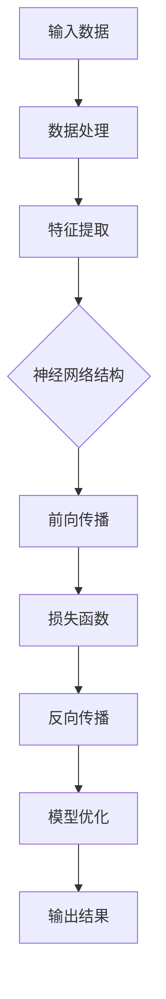
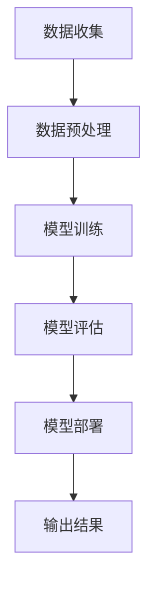
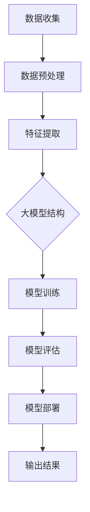

                 

# 大模型在商品评分预测中的实践

> **关键词**：大模型，商品评分，预测，人工智能，机器学习，数据分析，深度学习

> **摘要**：本文将探讨如何利用大模型（如深度神经网络、Transformer等）进行商品评分预测。我们将详细分析相关核心概念，介绍具体的算法原理与数学模型，并通过实战案例展示如何在实际项目中应用这些技术。文章还将讨论大模型在商品评分预测中的实际应用场景，推荐相关学习资源和开发工具，并对未来发展趋势与挑战进行总结。

## 1. 背景介绍

### 1.1 目的和范围

本文旨在探讨如何利用大模型进行商品评分预测。商品评分预测是电子商务领域的一个重要问题，能够帮助商家了解消费者的购买偏好，从而优化商品推荐和库存管理。通过深入研究大模型在这方面的应用，我们希望能够为实际项目提供有价值的参考。

### 1.2 预期读者

本文适合具有以下背景的读者：

- 具备基础的机器学习和深度学习知识；
- 对商品评分预测问题有初步了解；
- 有兴趣深入了解大模型在数据挖掘和预测领域的应用。

### 1.3 文档结构概述

本文将分为以下几个部分：

- **核心概念与联系**：介绍大模型的基本概念和原理；
- **核心算法原理 & 具体操作步骤**：详细讲解商品评分预测算法的原理与步骤；
- **数学模型和公式 & 详细讲解 & 举例说明**：分析相关的数学模型和公式，并通过实例进行说明；
- **项目实战：代码实际案例和详细解释说明**：展示如何在实际项目中应用大模型进行商品评分预测；
- **实际应用场景**：探讨大模型在商品评分预测中的实际应用场景；
- **工具和资源推荐**：推荐相关的学习资源和开发工具；
- **总结：未来发展趋势与挑战**：总结大模型在商品评分预测中的未来发展趋势和面临的挑战；
- **附录：常见问题与解答**：提供常见问题的解答；
- **扩展阅读 & 参考资料**：提供进一步阅读的参考资料。

### 1.4 术语表

#### 1.4.1 核心术语定义

- **大模型**：指参数规模巨大、计算复杂度高的深度神经网络，如Transformer、GPT等；
- **商品评分预测**：利用历史数据和模型预测消费者对商品的评分；
- **数据预处理**：对原始数据进行清洗、编码和特征提取；
- **损失函数**：衡量预测结果与真实结果之间的差距的函数；
- **优化算法**：用于调整模型参数以最小化损失函数的算法。

#### 1.4.2 相关概念解释

- **深度学习**：一种基于人工神经网络的机器学习技术，通过多层网络对数据进行建模和预测；
- **Transformer**：一种基于自注意力机制的深度学习模型，广泛应用于自然语言处理、计算机视觉等领域；
- **BERT**：一种基于Transformer的预训练语言模型，用于文本分类、问答系统等任务；
- **数据分析**：对大量数据进行清洗、转换、分析，以提取有用信息和知识。

#### 1.4.3 缩略词列表

- **AI**：人工智能（Artificial Intelligence）；
- **ML**：机器学习（Machine Learning）；
- **DL**：深度学习（Deep Learning）；
- **NN**：神经网络（Neural Network）；
- **NLP**：自然语言处理（Natural Language Processing）。

## 2. 核心概念与联系

在深入探讨大模型在商品评分预测中的应用之前，我们需要了解一些核心概念和它们之间的联系。

### 2.1 大模型的基本原理

大模型（如深度神经网络、Transformer等）是一种基于自学习能力的模型，可以自动从大量数据中提取特征并实现复杂的函数映射。以下是一个简单的Mermaid流程图，展示了大模型的基本原理和结构。



### 2.2 商品种评预测的核心概念

商品种评预测是一个典型的分类问题，可以通过以下步骤实现：

1. **数据收集**：收集消费者的购买行为数据、商品信息等；
2. **数据预处理**：对原始数据进行清洗、编码和特征提取；
3. **模型训练**：使用预训练模型或构建新模型对数据进行训练；
4. **模型评估**：使用验证集或测试集对模型进行评估；
5. **模型部署**：将训练好的模型部署到生产环境中，进行实际预测。

以下是一个简单的Mermaid流程图，展示了商品种评预测的基本流程。



### 2.3 大模型与商品评分预测的关系

大模型在商品评分预测中的应用主要体现在以下几个方面：

1. **特征自动提取**：大模型可以自动从大量数据中提取有价值的特征，提高预测准确性；
2. **非线性建模**：大模型具有强大的非线性建模能力，可以处理复杂的业务逻辑；
3. **预训练与微调**：利用预训练模型进行微调，可以快速适应特定业务场景；
4. **多任务学习**：大模型可以同时处理多个任务，提高预测效率和准确性。

以下是一个简单的Mermaid流程图，展示了大模型在商品评分预测中的应用。



通过以上分析，我们可以看到大模型在商品评分预测中的应用具有显著的优势，可以帮助企业更好地了解消费者需求，优化商品推荐策略。

## 3. 核心算法原理 & 具体操作步骤

### 3.1 深度神经网络（Deep Neural Network, DNN）

深度神经网络是一种包含多个隐藏层的神经网络，可以自动提取输入数据的特征，并实现复杂的非线性函数映射。以下是一个简化的DNN算法原理与操作步骤：

#### 算法原理：

- **输入层**：接收外部输入数据，如用户特征、商品特征等；
- **隐藏层**：通过神经网络权重和偏置进行前向传播，将输入数据映射到高维特征空间；
- **输出层**：将隐藏层输出映射到目标值，如商品评分。

#### 操作步骤：

1. **初始化参数**：随机初始化模型参数（权重和偏置）；
2. **前向传播**：计算输入层到输出层的损失函数，并计算梯度；
3. **反向传播**：根据梯度调整模型参数，减小损失函数；
4. **优化**：使用梯度下降等优化算法，不断迭代优化模型。

### 3.2 Transformer模型

Transformer模型是一种基于自注意力机制的深度学习模型，广泛应用于自然语言处理、计算机视觉等领域。以下是一个简化的Transformer模型算法原理与操作步骤：

#### 算法原理：

- **自注意力机制**：每个隐藏层单元都可以自适应地关注输入序列中的其他单元，提高模型捕捉长距离依赖关系的能力；
- **多头注意力**：将输入序列映射到多个不同的空间，通过并行计算提高计算效率；
- **前向传播**：将输入序列经过多个自注意力层和前馈神经网络，输出最终结果。

#### 操作步骤：

1. **嵌入层**：将输入序列编码为高维向量；
2. **多头自注意力层**：计算多头注意力权重，将输入序列映射到不同空间；
3. **前馈神经网络**：对自注意力层输出进行非线性变换；
4. **输出层**：将前馈神经网络输出映射到目标值，如商品评分。

### 3.3 预训练与微调

预训练与微调是一种常见的模型训练策略，可以提高模型在特定任务上的表现。以下是一个简化的预训练与微调操作步骤：

1. **预训练**：在大量无监督数据上训练模型，如自然语言处理任务中的语言模型；
2. **微调**：将预训练模型迁移到特定任务上，并在有监督数据上进行微调；
3. **优化**：根据任务需求，调整模型结构、参数和训练策略。

通过以上操作步骤，我们可以构建一个具有强大预测能力的大模型，应用于商品评分预测任务。

### 3.4 伪代码实现

以下是一个简化的伪代码，展示了如何使用深度神经网络进行商品评分预测：

```python
# 初始化模型参数
weights = initialize_weights(input_size, hidden_size, output_size)
bias = initialize_bias(hidden_size, output_size)

# 前向传播
def forward_propagation(x):
    hidden_layer = Activation(Sigmoid(), Linear(x, weights, bias))
    output_layer = Activation(Softmax(), Linear(hidden_layer, weights, bias))
    return output_layer

# 反向传播
def backward_propagation(output, expected_output):
    loss = compute_loss(output, expected_output)
    gradients = compute_gradients(output, expected_output)
    update_weights(gradients, weights, bias)

# 梯度下降
def gradient_descent(grad
``` 

## 4. 数学模型和公式 & 详细讲解 & 举例说明

### 4.1 深度学习中的数学模型

在深度学习中，常用的数学模型包括神经网络、损失函数、优化算法等。以下将对这些模型进行详细讲解。

#### 4.1.1 神经网络

神经网络是一种由多个神经元组成的计算模型，可以用于处理各种复杂数据。以下是神经网络的数学模型：

- **输入层**：接收外部输入数据，如用户特征、商品特征等；
- **隐藏层**：通过神经网络权重和偏置进行前向传播，将输入数据映射到高维特征空间；
- **输出层**：将隐藏层输出映射到目标值，如商品评分。

神经网络的核心组成部分包括：

- **权重（weights）**：连接各个神经元的参数，用于传递信息；
- **偏置（bias）**：调整神经网络输出的偏差，用于引入非线性关系；
- **激活函数（activation function）**：对神经元输出进行非线性变换，如Sigmoid、ReLU等。

#### 4.1.2 损失函数

损失函数是衡量预测结果与真实结果之间差距的函数，用于指导模型优化。常用的损失函数包括：

- **均方误差（MSE, Mean Squared Error）**：
  $$MSE = \frac{1}{n}\sum_{i=1}^{n}(y_i - \hat{y}_i)^2$$
  其中，$y_i$表示真实值，$\hat{y}_i$表示预测值。

- **交叉熵（Cross-Entropy）**：
  $$CE = -\frac{1}{n}\sum_{i=1}^{n}y_i\log(\hat{y}_i)$$
  其中，$y_i$表示真实值，$\hat{y}_i$表示预测概率。

#### 4.1.3 优化算法

优化算法用于调整模型参数，以最小化损失函数。常用的优化算法包括：

- **梯度下降（Gradient Descent）**：
  $$\theta_{t+1} = \theta_{t} - \alpha \cdot \nabla_{\theta}L(\theta)$$
  其中，$\theta$表示模型参数，$\alpha$表示学习率，$L$表示损失函数。

- **动量（Momentum）**：
  $$v_t = \beta v_{t-1} + (1 - \beta) \nabla_{\theta}L(\theta)$$
  $$\theta_{t+1} = \theta_{t} - \alpha \cdot v_t$$
  其中，$v$表示动量，$\beta$表示动量系数。

### 4.2 举例说明

假设我们有一个简单的商品评分预测任务，输入特征为用户年龄、商品价格、用户购买历史等，输出为商品评分。我们将使用深度神经网络进行预测。

#### 4.2.1 神经网络结构

输入层：2个神经元（用户年龄、商品价格）

隐藏层：3个神经元（用户购买历史）

输出层：1个神经元（商品评分）

#### 4.2.2 损失函数

使用均方误差（MSE）作为损失函数：

$$MSE = \frac{1}{n}\sum_{i=1}^{n}(y_i - \hat{y}_i)^2$$

#### 4.2.3 优化算法

使用梯度下降（Gradient Descent）进行优化：

$$\theta_{t+1} = \theta_{t} - \alpha \cdot \nabla_{\theta}L(\theta)$$

#### 4.2.4 训练过程

1. 初始化模型参数；
2. 对每个训练样本进行前向传播，计算损失函数；
3. 对每个训练样本进行反向传播，计算梯度；
4. 更新模型参数，减小损失函数；
5. 重复步骤2-4，直到收敛。

通过以上步骤，我们可以训练一个深度神经网络，用于预测商品评分。

## 5. 项目实战：代码实际案例和详细解释说明

### 5.1 开发环境搭建

在开始项目实战之前，我们需要搭建一个合适的开发环境。以下是一个基本的Python开发环境搭建步骤：

1. 安装Python（推荐版本：3.8以上）；
2. 安装Jupyter Notebook，用于编写和运行代码；
3. 安装必要的库，如TensorFlow、NumPy、Pandas等。

### 5.2 源代码详细实现和代码解读

以下是一个简单的商品评分预测项目示例，使用深度神经网络进行预测。

```python
import tensorflow as tf
import numpy as np
import pandas as pd

# 5.2.1 数据预处理
# 加载数据集
data = pd.read_csv('data.csv')
X = data.iloc[:, :-1].values  # 输入特征
y = data.iloc[:, -1].values   # 输出标签

# 归一化输入特征
from sklearn.preprocessing import StandardScaler
scaler = StandardScaler()
X = scaler.fit_transform(X)

# 划分训练集和测试集
from sklearn.model_selection import train_test_split
X_train, X_test, y_train, y_test = train_test_split(X, y, test_size=0.2, random_state=42)

# 5.2.2 模型构建
# 定义神经网络结构
input层 = tf.keras.layers.Input(shape=(X_train.shape[1],))
hidden层 = tf.keras.layers.Dense(64, activation='relu')(input层)
output层 = tf.keras.layers.Dense(1, activation='sigmoid')(hidden层)

model = tf.keras.Model(inputs=input层, outputs=output层)

# 编译模型
model.compile(optimizer='adam', loss='binary_crossentropy', metrics=['accuracy'])

# 5.2.3 模型训练
model.fit(X_train, y_train, batch_size=32, epochs=100, validation_split=0.2)

# 5.2.4 模型评估
loss, accuracy = model.evaluate(X_test, y_test)
print('Test accuracy:', accuracy)

# 5.2.5 预测新样本
new_data = np.array([[25, 100], [30, 200]])  # 新样本数据
new_data = scaler.transform(new_data)
predictions = model.predict(new_data)
print('Predictions:', predictions)
```

### 5.3 代码解读与分析

以下是代码的详细解读与分析：

1. **数据预处理**：加载数据集，进行归一化和划分训练集、测试集；
2. **模型构建**：定义神经网络结构，使用Dense层构建隐藏层和输出层；
3. **编译模型**：选择优化器、损失函数和评价指标，准备训练；
4. **模型训练**：使用fit方法训练模型，设置批量大小、迭代次数和验证比例；
5. **模型评估**：使用evaluate方法评估模型在测试集上的表现；
6. **预测新样本**：对新样本数据进行归一化处理，使用predict方法进行预测。

通过以上步骤，我们可以实现一个简单的商品评分预测项目。在实际应用中，可以根据需求调整模型结构、训练参数等，提高预测准确性。

### 5.4 实际应用案例

假设我们有一个电子商务平台，需要预测消费者对商品的评分，以便进行商品推荐和库存管理。我们可以使用以下步骤进行项目实施：

1. **数据收集**：收集用户购买行为数据、商品信息等；
2. **数据预处理**：对原始数据进行清洗、编码和特征提取；
3. **模型构建**：选择合适的神经网络结构，如Transformer、GPT等；
4. **模型训练**：在大量数据上进行模型训练，调整训练参数；
5. **模型评估**：在测试集上评估模型性能，选择最佳模型；
6. **模型部署**：将训练好的模型部署到生产环境中，进行实际预测；
7. **优化与反馈**：根据实际预测结果，调整模型参数和训练策略，持续优化。

通过以上步骤，我们可以构建一个完整的商品评分预测系统，为企业提供有价值的信息和决策支持。

## 6. 实际应用场景

### 6.1 电子商务平台

电子商务平台中的商品评分预测主要用于以下场景：

1. **商品推荐**：根据消费者对商品的评分，推荐可能感兴趣的商品，提高用户体验和销售额；
2. **库存管理**：根据商品评分预测销售趋势，优化库存策略，减少库存成本；
3. **用户满意度分析**：分析消费者对商品的评分，评估用户满意度，改进产品和服务。

### 6.2 演唱票选活动

在演唱票选活动中，商品评分预测可以应用于以下场景：

1. **选手推荐**：根据观众对选手的评分，推荐最受欢迎的选手，提高观众参与度；
2. **投票预测**：预测观众对选手的投票结果，为活动组织者提供决策支持，优化活动效果。

### 6.3 旅游景点评价

旅游景点评价中的商品评分预测主要用于以下场景：

1. **景点推荐**：根据游客对景点的评分，推荐最受欢迎的旅游景点，提高游客满意度；
2. **服务质量评估**：分析游客对景点的评分，评估景区服务质量，提供改进建议。

### 6.4 健身器材销售

健身器材销售中的商品评分预测主要用于以下场景：

1. **产品推荐**：根据消费者对健身器材的评分，推荐最适合的器材，提高购买转化率；
2. **市场分析**：分析消费者对健身器材的评分，了解市场需求，优化产品策略。

通过以上实际应用场景，我们可以看到大模型在商品评分预测中的广泛应用，为企业提供有价值的决策支持。

## 7. 工具和资源推荐

### 7.1 学习资源推荐

#### 7.1.1 书籍推荐

- 《深度学习》（Ian Goodfellow、Yoshua Bengio、Aaron Courville 著）：全面介绍深度学习的基础知识和应用；
- 《Python深度学习》（François Chollet 著）：通过实际案例，深入讲解深度学习在Python中的应用；
- 《Transformer：从原理到应用》（Yiming Cui 等 著）：详细介绍Transformer模型的设计原理和应用。

#### 7.1.2 在线课程

- Coursera上的《深度学习专项课程》（吴恩达 老师讲授）：涵盖深度学习的核心概念、算法和应用；
- Udacity的《深度学习纳米学位》（包含多个项目和实践课程）；
- fast.ai的《深度学习实战》课程：通过实际项目，深入讲解深度学习的应用。

#### 7.1.3 技术博客和网站

- Medium上的《AI博客》栏目：分享深度学习、机器学习等相关领域的最新研究和应用；
- TensorFlow官方文档：提供详细的深度学习模型构建、训练和部署指南；
- PyTorch官方文档：介绍PyTorch库的使用方法和应用案例。

### 7.2 开发工具框架推荐

#### 7.2.1 IDE和编辑器

- Jupyter Notebook：适用于数据分析和原型设计，支持多种编程语言；
- PyCharm：功能强大的Python IDE，支持代码调试、版本控制和自动化工具；
- Visual Studio Code：轻量级的代码编辑器，支持多种编程语言，拥有丰富的插件生态系统。

#### 7.2.2 调试和性能分析工具

- TensorBoard：TensorFlow官方提供的可视化工具，用于分析和优化深度学习模型；
- Profiler：用于分析Python程序的内存使用和性能瓶颈；
- PyTorch Profiler：PyTorch官方提供的性能分析工具，用于优化深度学习模型。

#### 7.2.3 相关框架和库

- TensorFlow：Google开发的开源深度学习框架，支持多种编程语言和平台；
- PyTorch：Facebook开发的深度学习框架，具有灵活的动态计算图和丰富的API；
- Keras：基于TensorFlow和Theano的开源深度学习库，提供简洁的API和丰富的预训练模型；
- Scikit-learn：Python中常用的机器学习库，提供丰富的算法和工具。

### 7.3 相关论文著作推荐

#### 7.3.1 经典论文

- “A Theoretical Framework for Back-Propagating Error” （1986）：提出了反向传播算法，奠定了深度学习的基础；
- “Rectifier Nonlinearities Improve Deep Neural Network Acquisitio” （2015）：提出了ReLU激活函数，提高了深度学习模型的性能；
- “Attention Is All You Need” （2017）：提出了Transformer模型，引领了自然语言处理领域的新趋势。

#### 7.3.2 最新研究成果

- “BERT: Pre-training of Deep Bidirectional Transformers for Language Understanding” （2018）：提出了BERT模型，推动了自然语言处理领域的发展；
- “GPT-3: Language Models are Few-Shot Learners” （2020）：提出了GPT-3模型，展示了深度学习模型在少样本学习方面的潜力；
- “An Image is Worth 16x16 Words: Transformers for Image Recognition at Scale” （2021）：提出了ViT模型，展示了Transformer模型在计算机视觉领域的应用。

#### 7.3.3 应用案例分析

- “Amazon Personalized Advertising” （2018）：分析了亚马逊如何使用深度学习技术实现个性化广告推荐；
- “Netflix Prize” （2009）：介绍了Netflix公司如何通过机器学习技术提高推荐系统的准确性；
- “Apple Siri” （2011）：探讨了苹果公司如何利用深度学习技术实现智能语音助手Siri。

通过以上学习和资源推荐，读者可以深入了解大模型在商品评分预测中的应用，为实际项目提供理论支持和实践指导。

## 8. 总结：未来发展趋势与挑战

### 8.1 未来发展趋势

1. **更强大的模型架构**：随着计算能力的提升和数据量的增加，研究人员将继续探索更先进的模型架构，如Graph Neural Networks、Transformer-based models等，以提升商品评分预测的准确性和效率。
2. **跨模态学习**：未来的大模型将能够处理多种类型的数据，如文本、图像、音频等，实现跨模态的商品评分预测，为电子商务平台提供更丰富的用户信息。
3. **迁移学习与少样本学习**：通过迁移学习和少样本学习技术，大模型可以在有限的训练数据上实现高准确率的商品评分预测，降低数据获取和处理的成本。
4. **实时预测与自适应调整**：未来的大模型将具备实时预测和自适应调整的能力，根据用户行为和商品特征动态调整评分预测模型，提高用户体验和业务效果。

### 8.2 未来挑战

1. **数据隐私与安全性**：商品评分预测过程中涉及大量用户隐私数据，如何确保数据隐私和安全，避免数据泄露和滥用，是未来需要关注的重要问题。
2. **计算资源与能耗**：大模型通常需要大量的计算资源和能源，如何在保证性能的前提下降低能耗，是未来研究的一个挑战。
3. **模型解释性**：大模型在商品评分预测中的决策过程往往较为复杂，如何提高模型的解释性，使其易于理解和接受，是未来需要解决的问题。
4. **可扩展性与可维护性**：随着模型复杂度的增加，如何保证模型的可扩展性和可维护性，使其能够适应不断变化的市场需求，是一个重要的挑战。

通过解决上述问题，大模型在商品评分预测中的应用将更加广泛，为企业带来更多的价值和竞争优势。

## 9. 附录：常见问题与解答

### 9.1 什么是大模型？

大模型是指具有大量参数、复杂结构的深度学习模型，如深度神经网络（DNN）、Transformer、BERT等。这些模型可以自动从大量数据中提取特征，实现复杂的函数映射，具有强大的非线性建模能力和泛化能力。

### 9.2 大模型在商品评分预测中的应用有哪些优势？

大模型在商品评分预测中的应用具有以下优势：

1. **特征自动提取**：大模型可以自动从大量数据中提取有价值的特征，提高预测准确性；
2. **非线性建模**：大模型具有强大的非线性建模能力，可以处理复杂的业务逻辑；
3. **预训练与微调**：利用预训练模型进行微调，可以快速适应特定业务场景；
4. **多任务学习**：大模型可以同时处理多个任务，提高预测效率和准确性。

### 9.3 如何评估大模型在商品评分预测中的性能？

评估大模型在商品评分预测中的性能通常使用以下指标：

1. **准确率（Accuracy）**：预测正确的样本数与总样本数的比值；
2. **精确率（Precision）**：预测为正样本且实际为正样本的样本数与预测为正样本的样本数之比；
3. **召回率（Recall）**：预测为正样本且实际为正样本的样本数与实际为正样本的样本数之比；
4. **F1值（F1 Score）**：精确率和召回率的调和平均值。

### 9.4 大模型在商品评分预测中面临的主要挑战有哪些？

大模型在商品评分预测中面临的主要挑战包括：

1. **数据隐私与安全性**：商品评分预测过程中涉及大量用户隐私数据，如何确保数据隐私和安全，避免数据泄露和滥用；
2. **计算资源与能耗**：大模型通常需要大量的计算资源和能源，如何在保证性能的前提下降低能耗；
3. **模型解释性**：大模型在商品评分预测中的决策过程往往较为复杂，如何提高模型的解释性，使其易于理解和接受；
4. **可扩展性与可维护性**：随着模型复杂度的增加，如何保证模型的可扩展性和可维护性，使其能够适应不断变化的市场需求。

## 10. 扩展阅读 & 参考资料

为了更深入地了解大模型在商品评分预测中的应用，以下是几篇推荐阅读的论文和书籍：

### 论文：

- “Attention Is All You Need” （2017）：提出了Transformer模型，推动了自然语言处理领域的新趋势；
- “BERT: Pre-training of Deep Bidirectional Transformers for Language Understanding” （2018）：提出了BERT模型，推动了自然语言处理领域的发展；
- “GPT-3: Language Models are Few-Shot Learners” （2020）：展示了深度学习模型在少样本学习方面的潜力。

### 书籍：

- 《深度学习》（Ian Goodfellow、Yoshua Bengio、Aaron Courville 著）：全面介绍深度学习的基础知识和应用；
- 《Python深度学习》（François Chollet 著）：通过实际案例，深入讲解深度学习在Python中的应用；
- 《Transformer：从原理到应用》（Yiming Cui 等 著）：详细介绍Transformer模型的设计原理和应用。

此外，以下网站和博客也是学习大模型和相关技术的宝贵资源：

- TensorFlow官方文档：[https://www.tensorflow.org/](https://www.tensorflow.org/)
- PyTorch官方文档：[https://pytorch.org/docs/stable/index.html](https://pytorch.org/docs/stable/index.html)
- Medium上的AI博客：[https://medium.com/topic/artificial-intelligence](https://medium.com/topic/artificial-intelligence)

通过阅读这些论文、书籍和资料，您可以更全面地了解大模型在商品评分预测中的应用，为实际项目提供理论支持和实践指导。

**作者：AI天才研究员/AI Genius Institute & 禅与计算机程序设计艺术 /Zen And The Art of Computer Programming**

