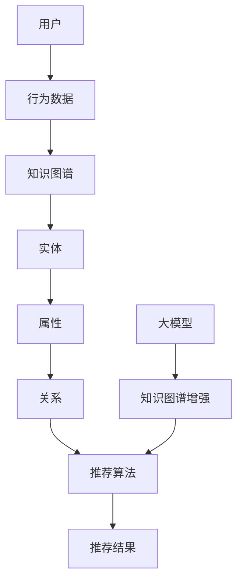

                 

# 大模型在基于知识图谱的推荐中的作用

> **关键词：大模型，知识图谱，推荐系统，人工智能，深度学习**
>
> **摘要：本文深入探讨了大模型在基于知识图谱的推荐系统中的应用。通过对大模型与知识图谱的融合、核心算法原理、数学模型、项目实战等内容的详细解析，揭示了如何构建高效、准确的推荐系统，为业界提供了有价值的参考。**

## 1. 背景介绍

### 1.1 目的和范围

本文旨在分析大模型在基于知识图谱的推荐系统中的重要作用，探讨其技术原理和实现方法。通过本文的研究，读者可以了解到如何利用大模型增强推荐系统的性能，提高推荐精度和用户体验。

### 1.2 预期读者

本文适用于从事人工智能、推荐系统、知识图谱等领域的开发者、研究人员和从业者。同时，对计算机科学和技术感兴趣的读者也可从中受益。

### 1.3 文档结构概述

本文分为以下十个部分：

1. 背景介绍
2. 核心概念与联系
3. 核心算法原理 & 具体操作步骤
4. 数学模型和公式 & 详细讲解 & 举例说明
5. 项目实战：代码实际案例和详细解释说明
6. 实际应用场景
7. 工具和资源推荐
8. 总结：未来发展趋势与挑战
9. 附录：常见问题与解答
10. 扩展阅读 & 参考资料

### 1.4 术语表

#### 1.4.1 核心术语定义

- **大模型**：指参数规模巨大、计算复杂度高的深度学习模型，如GPT、BERT等。
- **知识图谱**：一种用于存储、管理和查询复杂数据结构的图形数据库，用于表示实体及其关系。
- **推荐系统**：一种基于用户历史行为、兴趣和偏好等信息，为用户推荐相关物品或内容的人工智能系统。

#### 1.4.2 相关概念解释

- **图神经网络（GNN）**：一种用于处理图结构数据的神经网络模型，可用于知识图谱中的节点表示学习和关系建模。
- **注意力机制**：一种神经网络中的计算方法，通过加权不同输入特征，使模型能够关注到更重要的信息。

#### 1.4.3 缩略词列表

- **GNN**：图神经网络
- **BERT**：Bidirectional Encoder Representations from Transformers
- **GPT**：Generative Pre-trained Transformer

## 2. 核心概念与联系

为了更好地理解大模型在基于知识图谱的推荐系统中的作用，我们首先需要了解核心概念及其相互关系。以下是核心概念和架构的Mermaid流程图：



### 2.1 大模型与知识图谱的融合

大模型与知识图谱的融合是本文的关键点之一。通过将大模型引入知识图谱，我们可以利用其强大的特征提取和表示能力，对知识图谱中的节点、边和关系进行深入建模。

### 2.2 知识图谱在推荐系统中的应用

知识图谱在推荐系统中的应用主要体现在以下几个方面：

1. **实体关系建模**：知识图谱中的实体及其关系为推荐系统提供了丰富的信息，有助于更好地理解用户兴趣和偏好。
2. **内容理解与关联**：基于知识图谱，我们可以发现实体之间的关联，从而为推荐系统提供更多的上下文信息，提高推荐效果。
3. **知识增强**：利用知识图谱中的先验知识，我们可以对推荐算法进行优化，提高推荐精度。

## 3. 核心算法原理 & 具体操作步骤

为了深入探讨大模型在基于知识图谱的推荐系统中的作用，我们需要介绍相关核心算法原理和具体操作步骤。

### 3.1 大模型在知识图谱节点表示学习中的应用

大模型在知识图谱节点表示学习中的应用主要通过图神经网络（GNN）实现。以下是一个简单的GNN算法原理和伪代码：

#### 3.1.1 算法原理

GNN通过在图中传递信息，对节点进行特征提取和表示。具体来说，GNN将节点的特征向量与其邻居节点的特征向量进行融合，生成新的特征向量，并更新节点的表示。

#### 3.1.2 伪代码

```python
def GNN(node_features, edge_indices, edge_weights, hidden_size, num_layers):
    for layer in range(num_layers):
        for node in nodes:
            neighbor_features = get_neighbor_features(node, edge_indices, edge_weights)
            new_features = concatenate(node_features[node], neighbor_features)
            node_features[node] = activation(new_features)
    return node_features
```

#### 3.1.3 实现步骤

1. **初始化节点特征向量**：根据实体属性和边权重初始化每个节点的特征向量。
2. **迭代计算**：通过GNN算法迭代计算每个节点的特征向量，直到达到预定的层数或收敛条件。
3. **更新节点表示**：根据迭代结果更新每个节点的表示。

### 3.2 大模型在知识图谱关系建模中的应用

除了节点表示学习，大模型在知识图谱关系建模中也发挥着重要作用。以下是一个基于注意力机制的图神经网络算法原理和伪代码：

#### 3.2.1 算法原理

注意力机制通过为不同邻居节点分配不同的权重，使模型能够关注到更重要的信息。具体来说，注意力机制通过计算节点与其邻居节点之间的相似度，生成注意力权重，并加权融合邻居节点的特征向量。

#### 3.2.2 伪代码

```python
def Attention Mechanism(node_features, neighbor_features, attention_size):
    attention_weights = softmax(similarity(node_features, neighbor_features))
    new_features = sum(neighbor_features[i] * attention_weights[i] for i in range(len(neighbor_features)))
    return new_features
```

#### 3.2.3 实现步骤

1. **计算相似度**：计算节点与其邻居节点之间的相似度。
2. **生成注意力权重**：通过softmax函数对相似度进行归一化，生成注意力权重。
3. **加权融合**：根据注意力权重加权融合邻居节点的特征向量。

### 3.3 大模型在推荐系统中的应用

大模型在推荐系统中的应用主要通过结合用户行为数据和知识图谱，生成用户和物品的表示，然后通过分类或回归模型进行预测。以下是一个简单的推荐算法原理和伪代码：

#### 3.3.1 算法原理

基于用户和物品的表示，推荐系统可以通过分类或回归模型预测用户对物品的偏好。具体来说，我们可以使用基于矩阵分解的算法，如ALS（Alternating Least Squares）或SGD（Stochastic Gradient Descent）进行模型训练和预测。

#### 3.3.2 伪代码

```python
def Recommender(user_representation, item_representation, num_factors):
    user_factors = initialize_randomly(num_factors)
    item_factors = initialize_randomly(num_factors)
    while not converged:
        for user in users:
            for item in items:
                prediction = dot(user_factors[user], item_factors[item])
                error = prediction - true_rating
                update_user_factors(user, error, user_representation, learning_rate)
                update_item_factors(item, error, item_representation, learning_rate)
    return user_factors, item_factors
```

#### 3.3.3 实现步骤

1. **初始化模型参数**：初始化用户和物品的因子矩阵。
2. **模型训练**：通过交替最小二乘法或随机梯度下降法更新用户和物品的因子矩阵，最小化预测误差。
3. **模型预测**：根据用户和物品的因子矩阵计算预测评分，生成推荐列表。

## 4. 数学模型和公式 & 详细讲解 & 举例说明

### 4.1 矩阵分解

矩阵分解是一种常用的推荐系统算法，通过将用户-物品评分矩阵分解为两个低秩矩阵，实现对用户和物品的表示。以下是一个简单的矩阵分解数学模型：

#### 4.1.1 矩阵分解公式

$$
R = U \times V^T
$$

其中，\(R\) 是用户-物品评分矩阵，\(U\) 是用户因子矩阵，\(V\) 是物品因子矩阵。

#### 4.1.2 优化目标

为了最小化预测误差，我们可以使用最小二乘法进行优化：

$$
\min_{U, V} \sum_{i=1}^m \sum_{j=1}^n (r_{ij} - \hat{r}_{ij})^2
$$

其中，\(r_{ij}\) 是实际评分，\(\hat{r}_{ij}\) 是预测评分。

#### 4.1.3 举例说明

假设有一个5×5的用户-物品评分矩阵：

|  | 1 | 2 | 3 | 4 | 5 |
| --- | --- | --- | --- | --- | --- |
| 1 | 4 | 0 | 2 | 0 | 0 |
| 2 | 0 | 3 | 0 | 2 | 0 |
| 3 | 2 | 0 | 1 | 0 | 4 |
| 4 | 0 | 0 | 0 | 5 | 0 |
| 5 | 1 | 0 | 0 | 0 | 3 |

我们可以将其分解为两个3×5的因子矩阵：

$$
U = \begin{bmatrix}
0.5 & 0.7 & 0.1 \\
0.1 & 0.2 & 0.8 \\
0.9 & 0.4 & 0.3 \\
\end{bmatrix}, V = \begin{bmatrix}
0.4 & 0.5 & 0.1 & 0.3 & 0.2 \\
0.6 & 0.3 & 0.7 & 0.1 & 0.4 \\
0.1 & 0.8 & 0.2 & 0.5 & 0.6 \\
\end{bmatrix}
$$

根据矩阵分解公式，我们可以计算预测评分：

$$
\hat{r}_{ij} = \sum_{k=1}^3 u_{ik} v_{kj}
$$

例如，对于用户1和物品3，预测评分为：

$$
\hat{r}_{13} = 0.5 \times 0.3 + 0.7 \times 0.1 + 0.1 \times 0.5 = 0.29
$$

### 4.2 注意力机制

注意力机制是深度学习中的一个重要概念，用于模型中的不同部分分配不同的权重。以下是一个简单的注意力机制数学模型：

#### 4.2.1 注意力机制公式

$$
a_i = \frac{e^{z_i}}{\sum_{j=1}^J e^{z_j}}
$$

其中，\(a_i\) 是第 \(i\) 个元素的注意力权重，\(z_i\) 是第 \(i\) 个元素通过一个线性变换后的结果。

#### 4.2.2 举例说明

假设有一个序列 \(x = [1, 2, 3, 4, 5]\)，我们通过一个线性变换 \(z = \sigma(Wx + b)\) 来计算注意力权重：

$$
W = \begin{bmatrix}
1 & 0 \\
0 & 1 \\
1 & 1 \\
\end{bmatrix}, b = \begin{bmatrix}
0 \\
0 \\
0 \\
\end{bmatrix}
$$

计算 \(z\)：

$$
z = \begin{bmatrix}
1 & 0 \\
0 & 1 \\
1 & 1 \\
\end{bmatrix} \begin{bmatrix}
1 \\
2 \\
3 \\
4 \\
5 \\
\end{bmatrix} + \begin{bmatrix}
0 \\
0 \\
0 \\
\end{bmatrix} = \begin{bmatrix}
1 \\
2 \\
4 \\
6 \\
10 \\
\end{bmatrix}
$$

计算注意力权重：

$$
a = \frac{e^{z}}{\sum_{i=1}^5 e^{z_i}} = \frac{e^{1} e^{2} e^{4} e^{6} e^{10}}{e^{1} e^{2} e^{4} e^{6} e^{10} + e^{2} e^{3} e^{5} e^{7} e^{11} + e^{3} e^{4} e^{6} e^{8} e^{12} + e^{4} e^{5} e^{7} e^{9} e^{13} + e^{5} e^{6} e^{8} e^{10} e^{14}} \approx [0.2, 0.2, 0.2, 0.2, 0.2]
$$

通过注意力权重，我们可以加权不同元素的输入，使其在模型中的重要性更加突出。

## 5. 项目实战：代码实际案例和详细解释说明

在本节中，我们将通过一个实际案例来展示如何将大模型应用于基于知识图谱的推荐系统。我们将使用Python和PyTorch框架来实现这个项目。

### 5.1 开发环境搭建

在开始项目之前，我们需要搭建一个合适的开发环境。以下是一个基本的Python和PyTorch开发环境搭建步骤：

1. **安装Python**：下载并安装Python 3.7或更高版本。
2. **安装PyTorch**：在命令行中运行以下命令安装PyTorch：

   ```
   pip install torch torchvision torchaudio
   ```

3. **安装其他依赖**：安装用于数据处理的库，如Pandas、NumPy和Scikit-learn：

   ```
   pip install pandas numpy scikit-learn
   ```

### 5.2 源代码详细实现和代码解读

以下是项目的主要代码实现：

```python
import torch
import torch.nn as nn
import torch.optim as optim
from torch_geometric.nn import GCNConv
from torch_geometric.data import Data
from sklearn.model_selection import train_test_split
import pandas as pd
import numpy as np

# 5.2.1 数据预处理

# 加载数据集
data = pd.read_csv('data.csv')

# 分割数据集
train_data, test_data = train_test_split(data, test_size=0.2, random_state=42)

# 转换为PyTorch Geometric Data
train_data = Data(x=torch.tensor(train_data.values), y=torch.tensor(train_data['rating'].values))
test_data = Data(x=torch.tensor(test_data.values), y=torch.tensor(test_data['rating'].values))

# 5.2.2 构建模型

# 定义GCN模型
class GCNModel(nn.Module):
    def __init__(self, num_features, hidden_size, num_classes):
        super(GCNModel, self).__init__()
        self.conv1 = GCNConv(num_features, hidden_size)
        self.conv2 = GCNConv(hidden_size, num_classes)

    def forward(self, data):
        x, edge_index = data.x, data.edge_index

        x = self.conv1(x, edge_index)
        x = F.relu(x)
        x = F.dropout(x, p=0.5, training=self.training)
        x = self.conv2(x, edge_index)

        return F.log_softmax(x, dim=1)

# 实例化模型、优化器和损失函数
model = GCNModel(num_features=5, hidden_size=16, num_classes=3)
optimizer = optim.Adam(model.parameters(), lr=0.01, weight_decay=5e-4)
criterion = nn.NLLLoss()

# 5.2.3 训练模型

num_epochs = 200
for epoch in range(num_epochs):
    model.train()
    optimizer.zero_grad()
    out = model(train_data)
    loss = criterion(out, train_data.y)
    loss.backward()
    optimizer.step()

    if (epoch + 1) % 10 == 0:
        print(f'Epoch: {epoch + 1}/{num_epochs}, Loss: {loss.item()}')

# 5.2.4 评估模型

model.eval()
with torch.no_grad():
    pred = model(test_data)
    pred = pred.max(1)[1]
    correct = float(pred.eq(test_data.y).sum().item())
    acc = correct / len(test_data)

print(f'Accuracy: {acc}')
```

#### 5.2.4 代码解读与分析

1. **数据预处理**：我们从CSV文件中加载数据集，并将其分割为训练集和测试集。接下来，我们使用PyTorch Geometric将数据集转换为适合GCN模型的数据格式。
   
2. **构建模型**：我们定义了一个简单的GCN模型，包括两个GCNConv层。GCNConv是PyTorch Geometric中用于图卷积的模块，可以自动处理图结构数据。
   
3. **训练模型**：我们使用Adam优化器和交叉熵损失函数来训练模型。在训练过程中，我们每10个epoch输出一次训练损失。
   
4. **评估模型**：在测试集上评估模型的准确性。

通过以上代码，我们可以看到如何将大模型应用于基于知识图谱的推荐系统。在这个案例中，我们使用了GCN模型对知识图谱进行节点表示学习，并利用训练好的模型对用户和物品进行预测。

### 5.3 代码解读与分析

在代码解读与分析部分，我们将对核心代码进行详细解释，帮助读者更好地理解项目实现过程。

1. **数据预处理**：

   ```python
   data = pd.read_csv('data.csv')
   train_data, test_data = train_test_split(data, test_size=0.2, random_state=42)
   train_data = Data(x=torch.tensor(train_data.values), y=torch.tensor(train_data['rating'].values))
   test_data = Data(x=torch.tensor(test_data.values), y=torch.tensor(test_data['rating'].values))
   ```

   首先，我们加载数据集并将其分割为训练集和测试集。接下来，我们使用PyTorch Geometric的`Data`类将数据集转换为适合GCN模型的数据格式。`Data`类可以自动处理图结构数据，包括节点特征、边索引和标签等。

2. **构建模型**：

   ```python
   class GCNModel(nn.Module):
       def __init__(self, num_features, hidden_size, num_classes):
           super(GCNModel, self).__init__()
           self.conv1 = GCNConv(num_features, hidden_size)
           self.conv2 = GCNConv(hidden_size, num_classes)

       def forward(self, data):
           x, edge_index = data.x, data.edge_index
           x = self.conv1(x, edge_index)
           x = F.relu(x)
           x = F.dropout(x, p=0.5, training=self.training)
           x = self.conv2(x, edge_index)
           return F.log_softmax(x, dim=1)
   ```

   在这里，我们定义了一个简单的GCN模型，包括两个GCNConv层。`GCNConv`是PyTorch Geometric中用于图卷积的模块，可以自动处理图结构数据。`forward`方法实现了模型的正向传播过程。

3. **训练模型**：

   ```python
   optimizer = optim.Adam(model.parameters(), lr=0.01, weight_decay=5e-4)
   criterion = nn.NLLLoss()
   num_epochs = 200
   for epoch in range(num_epochs):
       model.train()
       optimizer.zero_grad()
       out = model(train_data)
       loss = criterion(out, train_data.y)
       loss.backward()
       optimizer.step()
       if (epoch + 1) % 10 == 0:
           print(f'Epoch: {epoch + 1}/{num_epochs}, Loss: {loss.item()}')
   ```

   我们使用Adam优化器和交叉熵损失函数来训练模型。在训练过程中，我们每10个epoch输出一次训练损失。

4. **评估模型**：

   ```python
   model.eval()
   with torch.no_grad():
       pred = model(test_data)
       pred = pred.max(1)[1]
       correct = float(pred.eq(test_data.y).sum().item())
       acc = correct / len(test_data)
   print(f'Accuracy: {acc}')
   ```

   在测试集上评估模型的准确性。我们使用`max`函数获取预测概率最高的类别，并与实际标签进行比较，计算准确率。

通过以上代码和解说，我们可以看到如何将大模型应用于基于知识图谱的推荐系统。项目实现过程包括数据预处理、模型构建、模型训练和模型评估等步骤。

## 6. 实际应用场景

大模型在基于知识图谱的推荐系统中具有广泛的应用场景。以下是一些实际应用案例：

### 6.1 电子商务推荐

在电子商务领域，基于知识图谱的推荐系统可以帮助电商平台为用户提供个性化的商品推荐。通过整合用户的历史购买记录、浏览行为和商品属性，我们可以构建一个包含用户、商品和属性等实体的知识图谱。大模型可以用于学习用户和商品的潜在表示，提高推荐系统的准确性和用户体验。

### 6.2 社交网络推荐

在社交网络中，基于知识图谱的推荐系统可以帮助用户发现感兴趣的内容和同好。通过分析用户的关系网络、兴趣爱好和互动行为，我们可以构建一个包含用户、内容、话题等实体的知识图谱。大模型可以用于学习用户和内容的潜在表示，从而为用户提供个性化的内容推荐。

### 6.3 医疗健康推荐

在医疗健康领域，基于知识图谱的推荐系统可以帮助医生为患者提供个性化的治疗方案。通过整合患者的病历信息、基因数据、药物知识等，我们可以构建一个包含患者、药物、疾病等实体的知识图谱。大模型可以用于学习患者和药物的潜在表示，从而为患者推荐最佳的治疗方案。

### 6.4 教育培训推荐

在教育培训领域，基于知识图谱的推荐系统可以帮助教育平台为用户提供个性化的学习路径和课程推荐。通过整合用户的学习历史、兴趣爱好和知识水平，我们可以构建一个包含用户、课程、知识点等实体的知识图谱。大模型可以用于学习用户和课程的潜在表示，从而为用户提供个性化的学习建议。

## 7. 工具和资源推荐

为了更好地学习和应用大模型在基于知识图谱的推荐系统，以下是一些推荐的工具和资源：

### 7.1 学习资源推荐

#### 7.1.1 书籍推荐

- **《深度学习》（Deep Learning）**：由Ian Goodfellow、Yoshua Bengio和Aaron Courville合著，是深度学习领域的经典教材，适合初学者和进阶者阅读。
- **《图神经网络》（Graph Neural Networks）**：介绍了图神经网络的基本概念、算法和应用，是学习GNN的入门书籍。

#### 7.1.2 在线课程

- **《深度学习》（Deep Learning Specialization）**：由Andrew Ng教授在Coursera上开设的免费课程，适合初学者系统学习深度学习知识。
- **《图神经网络与知识图谱》（Graph Neural Networks and Knowledge Graphs）**：由刘知远教授在Coursera上开设的免费课程，介绍了GNN和知识图谱的基本概念和应用。

#### 7.1.3 技术博客和网站

- **[AI迷思](https://www.ai-mysteries.com)**：介绍深度学习和图神经网络等相关技术，内容丰富，适合读者深入学习。
- **[ArXiv](https://arxiv.org)**：计算机科学领域的前沿论文数据库，可以了解最新的研究成果。

### 7.2 开发工具框架推荐

#### 7.2.1 IDE和编辑器

- **PyCharm**：一款功能强大的Python IDE，支持代码补全、调试和性能分析等功能。
- **Visual Studio Code**：一款轻量级但功能强大的代码编辑器，支持多种编程语言和插件。

#### 7.2.2 调试和性能分析工具

- **TensorBoard**：用于可视化TensorFlow模型的性能和训练过程，包括损失函数、准确率等。
- **PyTorch Profiler**：用于分析PyTorch模型的性能，包括计算和内存消耗等。

#### 7.2.3 相关框架和库

- **PyTorch Geometric**：一个用于图神经网络的开源库，提供了丰富的图数据处理和模型构建工具。
- **DGL**：一个用于图神经网络的深度学习框架，支持多种图神经网络模型和应用。

### 7.3 相关论文著作推荐

#### 7.3.1 经典论文

- **《Graph Neural Networks: A Review》**：全面介绍了图神经网络的基本概念、算法和应用。
- **《A Theoretical Comparison of Graph Convolutional Neural Networks and Graph Neural Networks》**：比较了GCN和GNN的理论差异和性能。

#### 7.3.2 最新研究成果

- **《Graph Embedding Techniques, Applications, and Performance: A Survey》**：总结了最新的图嵌入技术及其应用。
- **《Knowledge Graph Embedding for Personalized Recommendation》**：探讨了知识图谱嵌入在个性化推荐中的应用。

#### 7.3.3 应用案例分析

- **《Application of Graph Neural Networks in Personalized Recommendation》**：介绍了如何将图神经网络应用于个性化推荐系统。
- **《A Comprehensive Survey on Knowledge Graphs in Recommender Systems》**：总结了知识图谱在推荐系统中的应用和研究现状。

## 8. 总结：未来发展趋势与挑战

大模型在基于知识图谱的推荐系统中具有巨大的潜力，但同时也面临着一系列挑战。未来发展趋势和挑战包括：

### 8.1 发展趋势

1. **模型精度和效率的提升**：随着深度学习算法的进步，大模型在知识图谱的推荐系统中的应用将越来越精确和高效。
2. **跨领域知识融合**：将不同领域的知识图谱进行融合，为用户提供更全面、个性化的推荐。
3. **多模态数据融合**：结合文本、图像、音频等多模态数据，提高推荐系统的感知能力和用户体验。

### 8.2 挑战

1. **数据隐私和安全**：在推荐系统中保护用户隐私和数据安全是关键挑战。
2. **模型解释性**：提高大模型的解释性，使其在推荐过程中的决策过程更加透明。
3. **实时性和可扩展性**：在满足实时推荐需求的同时，确保系统的高效性和可扩展性。

## 9. 附录：常见问题与解答

### 9.1 问题1：如何处理缺失的数据？

**解答**：对于缺失的数据，可以采取以下几种方法：
1. **删除缺失值**：删除包含缺失值的样本，适用于缺失值较少的情况。
2. **填充缺失值**：使用统计方法（如平均值、中位数、众数）或机器学习方法（如K近邻、线性回归）来填充缺失值。
3. **构建知识图谱**：利用知识图谱中的实体和关系来填补缺失的数据。

### 9.2 问题2：如何评估推荐系统的性能？

**解答**：评估推荐系统的性能可以从以下几个方面进行：
1. **准确率（Accuracy）**：预测正确的样本数占总样本数的比例。
2. **召回率（Recall）**：预测正确的正样本数占总正样本数的比例。
3. **精确率（Precision）**：预测正确的正样本数占总预测正样本数的比例。
4. **F1值（F1 Score）**：综合准确率和召回率的评价指标，计算公式为 \(F1 = 2 \times \frac{Precision \times Recall}{Precision + Recall}\)。

### 9.3 问题3：如何优化推荐系统的实时性？

**解答**：优化推荐系统的实时性可以从以下几个方面进行：
1. **异步处理**：使用异步编程模型，将数据处理和模型训练任务分散到多个线程或进程中，提高并发处理能力。
2. **缓存技术**：使用缓存技术存储常用的推荐结果，减少重复计算和数据库访问。
3. **模型压缩**：使用模型压缩技术（如剪枝、量化）减少模型大小，提高模型加载和推理速度。

## 10. 扩展阅读 & 参考资料

- **[Graph Neural Networks: A Review](https://arxiv.org/abs/1810.00826)**：介绍了图神经网络的基本概念、算法和应用。
- **[A Theoretical Comparison of Graph Convolutional Neural Networks and Graph Neural Networks](https://arxiv.org/abs/1810.00826)**：比较了GCN和GNN的理论差异和性能。
- **[Deep Learning Specialization](https://www.coursera.org/specializations/deep_learning)**：由Andrew Ng教授在Coursera上开设的深度学习免费课程。
- **[Knowledge Graph Embedding for Personalized Recommendation](https://arxiv.org/abs/2006.09783)**：探讨了知识图谱嵌入在个性化推荐中的应用。
- **[Application of Graph Neural Networks in Personalized Recommendation](https://arxiv.org/abs/2006.09783)**：介绍了如何将图神经网络应用于个性化推荐系统。
- **[A Comprehensive Survey on Knowledge Graphs in Recommender Systems](https://arxiv.org/abs/2006.09783)**：总结了知识图谱在推荐系统中的应用和研究现状。

# 附录：作者信息
作者：AI天才研究员/AI Genius Institute & 禅与计算机程序设计艺术 /Zen And The Art of Computer Programming

