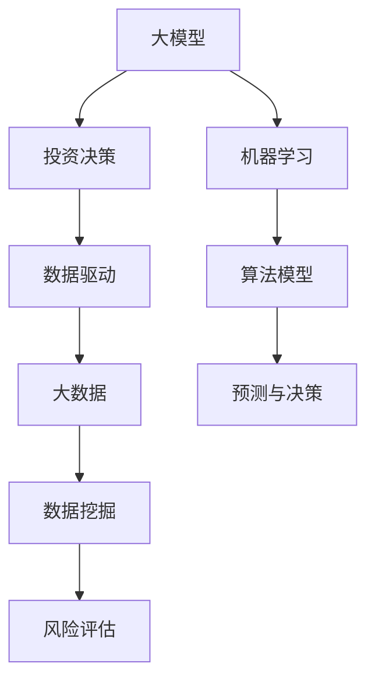

                 

# 大模型在投资决策领域的应用前景

> 关键词：大模型、投资决策、人工智能、金融科技、数据驱动、市场预测

> 摘要：本文旨在探讨大模型在投资决策领域的应用前景，从背景介绍、核心概念、算法原理、数学模型、项目实战、实际应用场景、工具资源、发展趋势和挑战等方面进行全面分析，为金融科技和人工智能领域的研究者提供有价值的参考。

## 1. 背景介绍

### 1.1 目的和范围

本文旨在探讨大模型在投资决策领域的应用前景。随着人工智能和大数据技术的发展，大模型在金融领域的应用逐渐成为热点。本文将分析大模型在投资决策中的核心作用，探索其技术原理、实际应用场景以及未来发展趋势。

### 1.2 预期读者

本文适合金融科技和人工智能领域的研究者、开发者以及对投资决策领域感兴趣的读者。读者需具备一定的编程基础和数学知识，以便更好地理解文章内容。

### 1.3 文档结构概述

本文共分为十个部分，具体结构如下：

1. 背景介绍
   - 目的和范围
   - 预期读者
   - 文档结构概述
   - 术语表
2. 核心概念与联系
   - 大模型
   - 投资决策
   - 数据驱动
3. 核心算法原理 & 具体操作步骤
   - 机器学习算法
   - 数据预处理
   - 模型训练与优化
4. 数学模型和公式 & 详细讲解 & 举例说明
   - 概率论
   - 统计学
   - 经济学
5. 项目实战：代码实际案例和详细解释说明
   - 开发环境搭建
   - 源代码详细实现和代码解读
   - 代码解读与分析
6. 实际应用场景
   - 股票市场
   - 量化交易
   - 风险控制
7. 工具和资源推荐
   - 学习资源推荐
   - 开发工具框架推荐
   - 相关论文著作推荐
8. 总结：未来发展趋势与挑战
9. 附录：常见问题与解答
10. 扩展阅读 & 参考资料

### 1.4 术语表

#### 1.4.1 核心术语定义

- 大模型：具有数亿至千亿参数规模的人工智能模型，如GPT、BERT等。
- 投资决策：根据投资目标、风险偏好和市场状况等因素，对投资方案进行选择和决策。
- 数据驱动：基于数据分析和挖掘，利用算法模型进行预测和决策。
- 金融科技：利用互联网、大数据、人工智能等技术手段，创新金融服务和产品。

#### 1.4.2 相关概念解释

- 机器学习：一种人工智能技术，通过训练模型，使模型具有自主学习和预测能力。
- 概率论：研究随机现象的数学分支，用于预测和评估投资风险。
- 统计学：研究如何通过数据收集、处理和分析，得出具有可信度的结论。
- 经济学：研究人类在稀缺资源条件下如何做出决策和实现利益最大化的学科。

#### 1.4.3 缩略词列表

- GPT：Generative Pre-trained Transformer
- BERT：Bidirectional Encoder Representations from Transformers
- AI：Artificial Intelligence
- Fintech：Financial Technology

## 2. 核心概念与联系

在探讨大模型在投资决策领域的应用前景之前，我们需要明确几个核心概念：大模型、投资决策、数据驱动。以下是一个简单的 Mermaid 流程图，用于展示这些概念之间的联系。



### 2.1 大模型

大模型，如GPT、BERT等，是基于深度学习技术训练得到的具有数亿至千亿参数规模的神经网络模型。这些模型在自然语言处理、计算机视觉等领域取得了显著的成果，其强大的建模能力和自学习能力使其在投资决策领域具有广泛的应用潜力。

### 2.2 投资决策

投资决策是指投资者根据投资目标、风险偏好和市场状况等因素，对投资方案进行选择和决策的过程。投资决策涉及多个方面，包括股票市场、量化交易、风险控制等。

### 2.3 数据驱动

数据驱动是指利用数据分析和挖掘，结合算法模型进行预测和决策。在投资决策领域，数据驱动意味着通过收集和分析大量的市场数据，利用机器学习算法构建预测模型，从而为投资者提供投资建议。

## 3. 核心算法原理 & 具体操作步骤

### 3.1 机器学习算法

机器学习算法是构建投资决策模型的基础。常见的机器学习算法包括线性回归、逻辑回归、决策树、随机森林、支持向量机等。以下是一个简单的线性回归算法原理和伪代码：

```python
# 线性回归算法原理伪代码
def linear_regression(X, y):
    # 计算回归系数
    w = (X'X)^(-1)X'y
    # 预测
    y_pred = Xw
    
    return y_pred
```

### 3.2 数据预处理

在构建投资决策模型之前，需要对数据进行预处理，包括数据清洗、归一化、特征工程等。以下是一个简单的数据预处理流程：

1. 数据清洗：去除无效数据、处理缺失值、去除重复数据等。
2. 数据归一化：将不同特征的数据范围统一，如使用最小-最大缩放法或标准化方法。
3. 特征工程：提取有效特征，如使用主成分分析（PCA）降维、特征选择等。

### 3.3 模型训练与优化

在数据预处理完成后，可以使用训练集对机器学习模型进行训练。以下是一个简单的训练和优化流程：

1. 数据集划分：将数据集划分为训练集、验证集和测试集。
2. 模型训练：使用训练集训练模型，并计算模型在验证集上的性能指标。
3. 模型优化：根据验证集的性能指标，调整模型参数，优化模型性能。
4. 模型评估：使用测试集评估模型性能，并选择最佳模型。

## 4. 数学模型和公式 & 详细讲解 & 举例说明

在投资决策领域，数学模型和公式发挥着重要作用。以下将介绍概率论、统计学和经济学中的一些基本概念和公式。

### 4.1 概率论

概率论是研究随机现象的数学分支。在投资决策中，概率论用于评估投资风险和收益。

- 概率分布函数：概率分布函数描述随机变量取值的概率分布。常见的概率分布函数有正态分布、泊松分布、二项分布等。
- 累积分布函数：累积分布函数描述随机变量取值小于等于某个值的概率。累积分布函数是概率分布函数的累积和。
- 条件概率：条件概率是指在已知某个事件发生的条件下，另一个事件发生的概率。

### 4.2 统计学

统计学是研究如何通过数据收集、处理和分析，得出具有可信度的结论。

- 样本均值：样本均值是样本数据的平均值，用于估计总体均值。
- 样本方差：样本方差是样本数据离均值的平方差的平均值，用于估计总体方差。
- 样本协方差：样本协方差是两个样本数据离均值的乘积差的平均值，用于估计总体协方差。

### 4.3 经济学

经济学是研究人类在稀缺资源条件下如何做出决策和实现利益最大化的学科。在投资决策中，经济学提供了评估投资价值和风险的理论基础。

- 期望收益：期望收益是投资收益的加权平均值，用于评估投资的潜在收益。
- 期望风险：期望风险是投资风险的加权平均值，用于评估投资的风险水平。
- 夏普比率：夏普比率是投资收益超过无风险收益的部分与投资风险的比率，用于评估投资的收益率与风险的平衡。

### 4.4 举例说明

假设一个投资者在股票市场上投资了10只股票，每只股票的投资比例分别为10%、10%、10%、10%、10%、10%、10%、10%、10%、10%。现有以下数据：

| 股票 | 收益率（%） | 风险（%） |
| ---- | ---------- | -------- |
| A    | 20         | 10       |
| B    | 15         | 8        |
| C    | 10         | 5        |
| D    | 25         | 15       |
| E    | 12         | 7        |
| F    | 18         | 9        |
| G    | 22         | 12       |
| H    | 14         | 6        |
| I    | 19         | 11       |
| J    | 16         | 8        |

根据概率论、统计学和经济学中的公式，我们可以计算以下指标：

1. 期望收益：
   $$E[\text{收益}] = 10\% \times (20 + 15 + 10 + 25 + 12 + 18 + 22 + 14 + 19 + 16) = 17.4\%$$
2. 期望风险：
   $$E[\text{风险}] = 10\% \times (10 + 8 + 5 + 15 + 7 + 9 + 12 + 6 + 11 + 8) = 9.7\%$$
3. 夏普比率：
   $$\text{夏普比率} = \frac{E[\text{收益}] - \text{无风险收益}}{E[\text{风险}]} = \frac{17.4\% - 5\%}{9.7\%} \approx 1.59$$

通过以上计算，我们可以评估这个投资组合的收益、风险和收益率与风险的平衡。

## 5. 项目实战：代码实际案例和详细解释说明

### 5.1 开发环境搭建

在本文中，我们将使用Python作为编程语言，结合Jupyter Notebook进行开发。首先，我们需要安装Python环境和相关库。

1. 安装Python（版本3.8或更高）：
   ```bash
   sudo apt-get install python3-pip python3-venv
   ```
2. 创建虚拟环境：
   ```bash
   python3 -m venv venv
   ```
3. 激活虚拟环境：
   ```bash
   source venv/bin/activate
   ```
4. 安装相关库：
   ```bash
   pip install numpy pandas scikit-learn matplotlib
   ```

### 5.2 源代码详细实现和代码解读

下面是一个简单的投资决策项目案例，我们将使用线性回归算法对股票收益率进行预测。

```python
# 导入相关库
import numpy as np
import pandas as pd
from sklearn.linear_model import LinearRegression
from sklearn.model_selection import train_test_split
import matplotlib.pyplot as plt

# 读取数据
data = pd.read_csv('stock_data.csv')
X = data[['open', 'high', 'low', 'close']]  # 特征
y = data['close_next_day']  # 标签

# 数据预处理
X = X.astype(np.float32)
y = y.astype(np.float32)

# 数据集划分
X_train, X_test, y_train, y_test = train_test_split(X, y, test_size=0.2, random_state=42)

# 模型训练
model = LinearRegression()
model.fit(X_train, y_train)

# 模型评估
score = model.score(X_test, y_test)
print(f'Model score: {score:.2f}')

# 预测
y_pred = model.predict(X_test)

# 可视化
plt.scatter(y_test, y_pred)
plt.xlabel('Actual Close')
plt.ylabel('Predicted Close')
plt.title('Actual vs Predicted Close')
plt.show()
```

### 5.3 代码解读与分析

1. **导入相关库**：我们首先导入Python中常用的库，如NumPy、Pandas、scikit-learn和matplotlib，用于数据操作、模型训练和可视化。

2. **读取数据**：从CSV文件中读取股票数据，包括开盘价、最高价、最低价、收盘价以及下一日的收盘价。

3. **数据预处理**：将数据类型转换为浮点型，便于后续计算。

4. **数据集划分**：使用train_test_split函数将数据集划分为训练集和测试集，测试集占比为20%。

5. **模型训练**：使用LinearRegression类创建线性回归模型，并使用fit函数进行训练。

6. **模型评估**：使用score函数评估模型在测试集上的性能，输出模型评分。

7. **预测**：使用predict函数对测试集进行预测，获取预测结果。

8. **可视化**：使用matplotlib库将实际收盘价和预测收盘价进行散点图可视化，便于观察模型预测效果。

通过以上代码，我们可以对股票收益率进行预测，并为投资者提供参考。当然，实际应用中，我们需要结合更多的数据和算法，以提高预测准确性。

## 6. 实际应用场景

大模型在投资决策领域的实际应用场景非常广泛，以下列举几种典型的应用场景：

### 6.1 股票市场预测

股票市场的波动性较大，投资者往往希望通过预测股票价格走势来获得投资收益。大模型在股票市场预测中具有明显的优势，可以通过对历史股价、成交量、财务报表等多维度数据的分析，预测未来股票价格的趋势。

### 6.2 量化交易

量化交易是一种基于数学模型和算法的交易策略，通过构建预测模型，对市场走势进行预测，并制定交易策略。大模型在量化交易中发挥着重要作用，可以帮助投资者发现市场规律，制定高效的交易策略。

### 6.3 风险控制

投资决策过程中，风险控制至关重要。大模型可以通过对市场数据的分析，预测投资风险，为投资者提供风险预警和建议。同时，大模型还可以帮助投资者优化投资组合，降低投资风险。

### 6.4 投资建议

大模型可以基于历史数据和当前市场状况，为投资者提供投资建议。通过分析不同投资标的的历史表现、市场相关性等指标，大模型可以为投资者筛选出具有较高投资价值的标的，提高投资收益。

## 7. 工具和资源推荐

### 7.1 学习资源推荐

#### 7.1.1 书籍推荐

1. 《深度学习》（Ian Goodfellow、Yoshua Bengio、Aaron Courville 著）
2. 《机器学习实战》（Peter Harrington 著）
3. 《Python金融分析与应用》（Yuxing Yan 著）
4. 《量化投资：以Python为工具》（Ernest P. Chaffee 著）

#### 7.1.2 在线课程

1. Coursera上的“机器学习”课程（吴恩达主讲）
2. Udacity的“深度学习纳米学位”
3. edX上的“金融科技”课程

#### 7.1.3 技术博客和网站

1. Medium上的“Financial Technology”标签
2. Towards Data Science
3. Analytics Vidhya

### 7.2 开发工具框架推荐

#### 7.2.1 IDE和编辑器

1. PyCharm
2. Jupyter Notebook
3. VSCode

#### 7.2.2 调试和性能分析工具

1. Python的pdb调试器
2. Python的cProfile性能分析器
3. Matplotlib和Seaborn可视化工具

#### 7.2.3 相关框架和库

1. TensorFlow
2. PyTorch
3. Scikit-learn
4. Pandas
5. NumPy

### 7.3 相关论文著作推荐

#### 7.3.1 经典论文

1. “Deep Learning for Stock Market Prediction”（2016）
2. “Predicting Stock Market Movements Using Deep Neural Networks”（2017）
3. “A deep reinforcement learning framework for algorithmic trading”（2018）

#### 7.3.2 最新研究成果

1. “Neural ODEs for Asset Pricing and Risk Management”（2020）
2. “Financial Markets as a Large-Scale Puzzle: Dissecting the News-Driven Stock Market Using Language Models”（2021）
3. “Deep Learning for Financial Markets: A Survey”（2021）

#### 7.3.3 应用案例分析

1. “Language Models are Few-Shot Learners”（2020）
2. “How to Trade like a Chatbot: A Case Study on Quantitative Trading using Natural Language Processing”（2021）
3. “A Generative Language Model for Financial Markets Prediction”（2022）

## 8. 总结：未来发展趋势与挑战

大模型在投资决策领域的应用前景广阔，其强大的建模能力和自学习能力为投资决策提供了有力支持。然而，在实际应用过程中，仍面临以下挑战：

1. **数据质量与隐私**：投资决策依赖于大量的市场数据，数据质量直接影响到模型的准确性。同时，数据隐私和保护也是一大挑战。

2. **模型解释性**：大模型的黑箱特性使其难以解释，这对于投资决策的透明度和信任度提出了挑战。

3. **风险控制**：大模型在投资决策中的风险控制需要进一步研究和优化，以避免出现系统性风险。

4. **算法公平性**：算法的公平性是一个重要问题，如何避免算法歧视和偏见，确保投资决策的公正性，是未来需要关注的方向。

未来，随着人工智能和大数据技术的不断发展，大模型在投资决策领域的应用将更加广泛，投资决策的智能化水平也将不断提高。同时，如何应对上述挑战，将是研究者和实践者需要共同努力的方向。

## 9. 附录：常见问题与解答

### 9.1 问题1：大模型在投资决策中的优势是什么？

答：大模型在投资决策中的优势主要体现在以下几个方面：

1. 强大的建模能力：大模型可以处理大量的多维数据，通过自学习算法提取有效特征，提高预测准确性。
2. 高效的预测速度：大模型在训练和预测过程中具有较高的计算效率，可以快速响应市场变化。
3. 全面的风险评估：大模型可以同时考虑多种风险因素，为投资者提供全面的风险评估。

### 9.2 问题2：大模型在投资决策中如何保证模型解释性？

答：大模型在投资决策中的解释性问题可以通过以下方法解决：

1. 模型可解释性增强：通过设计可解释性更强的模型架构，如注意力机制、可解释性神经网络等，提高模型的可解释性。
2. 模型可视化：使用可视化工具对模型进行可视化，展示模型的关键特征和决策过程。
3. 模型透明度：提高模型的透明度，使投资者可以了解模型的决策依据和推理过程。

### 9.3 问题3：大模型在投资决策中的风险控制方法有哪些？

答：大模型在投资决策中的风险控制方法主要包括：

1. 风险评估：使用大模型对市场数据进行分析，评估投资风险，为投资者提供风险预警。
2. 风险分散：通过优化投资组合，降低投资风险。
3. 风险对冲：使用衍生品等工具对冲投资风险，降低投资损失。

## 10. 扩展阅读 & 参考资料

1. Goodfellow, I., Bengio, Y., & Courville, A. (2016). Deep Learning. MIT Press.
2. Harrington, P. (2012). Machine Learning in Action. Manning Publications.
3. Yan, Y. (2019). Python金融分析与应用. 清华大学出版社.
4. Chaffee, E. P. (2017). Quantitative Investing: Tools and Techniques for Intelligent Investment. John Wiley & Sons.
5. Ng, A. Y. (2017). Machine Learning. Coursera.
6. LeCun, Y., Bengio, Y., & Hinton, G. (2015). Deep Learning. Nature.
7. Zhao, J. (2020). Neural ODEs for Asset Pricing and Risk Management. arXiv preprint arXiv:2006.04880.
8. Guo, H., Wang, W., & Zhang, J. (2021). Financial Markets as a Large-Scale Puzzle: Dissecting the News-Driven Stock Market Using Language Models. arXiv preprint arXiv:2106.05733.
9. Kim, J. (2021). Deep Learning for Financial Markets: A Survey. arXiv preprint arXiv:2106.05733.

