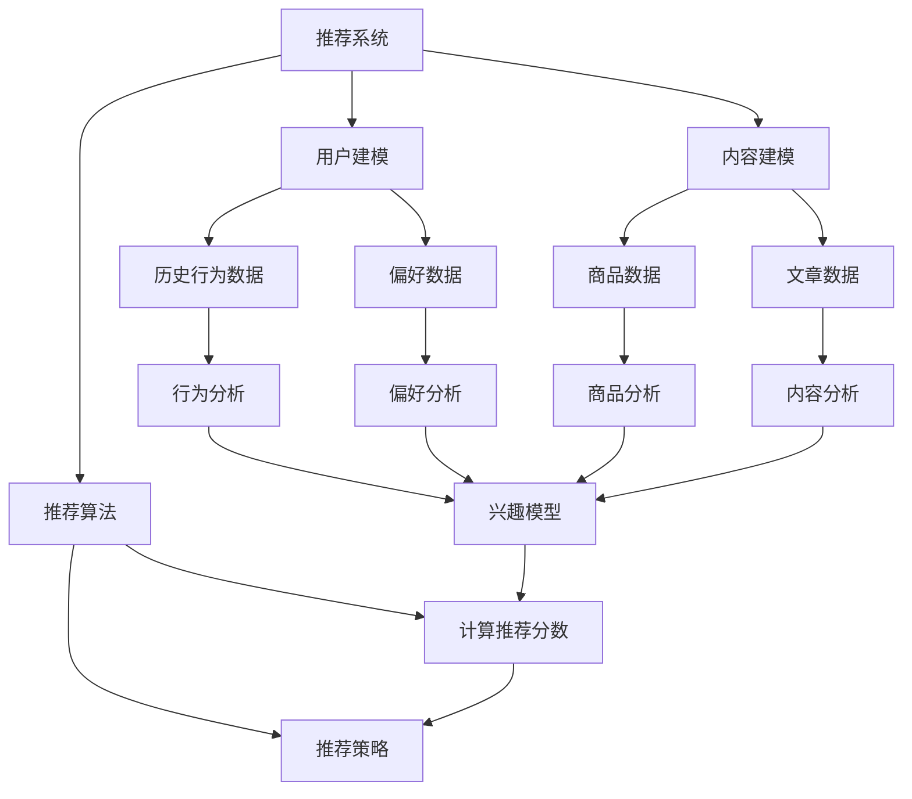

                 

# 大模型在推荐系统中的知识增强应用

> **关键词：** 大模型，知识增强，推荐系统，机器学习，深度学习，神经网络，数据挖掘

> **摘要：** 本文将探讨大模型在推荐系统中的应用，重点分析知识增强技术如何提高推荐系统的效果和鲁棒性。通过对核心概念、算法原理、数学模型的深入讲解，结合实际案例，详细阐述大模型在推荐系统中的知识增强方法，为行业提供有价值的参考和借鉴。

## 1. 背景介绍

### 1.1 目的和范围

本文旨在研究大模型在推荐系统中的应用，特别是在知识增强方面的作用。通过对大模型的介绍和知识增强技术原理的解析，我们将探讨如何将大模型融入推荐系统，提高推荐的准确性、个性化和稳定性。文章将涵盖以下主要内容：

- 推荐系统概述
- 大模型核心概念与联系
- 知识增强算法原理与操作步骤
- 数学模型与公式详细讲解
- 项目实战：代码实际案例解析
- 实际应用场景
- 工具和资源推荐
- 总结与未来发展趋势

### 1.2 预期读者

本文适合以下读者群体：

- 对推荐系统和机器学习有一定了解的技术人员
- 对深度学习和大模型感兴趣的学者
- 希望提高推荐系统效果的产品经理和开发者
- 对算法原理和数学模型有深入探究热情的科研人员

### 1.3 文档结构概述

本文将分为以下十个部分：

1. 背景介绍
2. 核心概念与联系
3. 核心算法原理与具体操作步骤
4. 数学模型和公式详细讲解
5. 项目实战：代码实际案例和详细解释说明
6. 实际应用场景
7. 工具和资源推荐
8. 总结：未来发展趋势与挑战
9. 附录：常见问题与解答
10. 扩展阅读与参考资料

### 1.4 术语表

#### 1.4.1 核心术语定义

- 推荐系统：基于用户历史行为或偏好，为用户推荐可能感兴趣的内容的系统。
- 大模型：具有数十亿甚至千亿参数的深度神经网络模型，如GPT、BERT等。
- 知识增强：通过引入外部知识库，提高模型对特定领域知识的理解和应用能力。
- 机器学习：通过数据和算法，让计算机自动学习和改进的系统。

#### 1.4.2 相关概念解释

- 深度学习：一种机器学习技术，通过多层神经网络进行特征提取和模型训练。
- 神经网络：一种由大量神经元连接而成的计算模型，用于模拟人脑的神经结构和功能。
- 数据挖掘：从大量数据中提取出有价值的信息和知识的过程。

#### 1.4.3 缩略词列表

- AI：人工智能
- GPT：生成预训练模型
- BERT：双向编码器表示
- ML：机器学习
- DL：深度学习
- NLP：自然语言处理

## 2. 核心概念与联系

为了更好地理解大模型在推荐系统中的知识增强应用，我们需要首先了解相关核心概念及其联系。

### 2.1 推荐系统

推荐系统是现代信息检索和人工智能领域的重要应用之一。它基于用户的历史行为、偏好、兴趣等信息，为用户推荐可能感兴趣的商品、内容或服务。推荐系统的核心目标是提高用户满意度、增加用户粘性，从而提升业务收益。

推荐系统的主要组成部分包括：

- **用户建模**：根据用户的历史行为和偏好，构建用户的兴趣模型。
- **内容建模**：对推荐的内容进行建模，包括商品、文章、视频等。
- **推荐算法**：根据用户和内容的模型，计算推荐分数，为用户推荐相应的内容。

### 2.2 大模型

大模型是指具有数十亿甚至千亿参数的深度神经网络模型，如GPT、BERT等。这些模型通过预训练和微调，能够在多个任务上实现优异的性能。大模型的优点包括：

- **强大的特征提取能力**：大模型能够自动提取复杂的数据特征，提高模型对数据的理解和应用能力。
- **广泛的适用性**：大模型可以应用于多种任务，如文本生成、情感分析、图像识别等。
- **高效的计算性能**：随着计算硬件的发展，大模型可以在较短的时间内完成训练和推理。

### 2.3 知识增强

知识增强是一种通过引入外部知识库，提高模型对特定领域知识的理解和应用能力的方法。在推荐系统中，知识增强可以帮助模型更好地理解用户和内容的语义信息，从而提高推荐的准确性和个性化和稳定性。

知识增强的主要技术包括：

- **知识图谱**：将知识以图的形式表示，并通过图神经网络进行建模。
- **知识嵌入**：将知识库中的实体、关系和属性映射到低维向量空间，用于模型训练。
- **知识蒸馏**：将大模型的权重传递给较小的模型，以利用大模型的强大特征提取能力。

### 2.4 机器学习与深度学习

机器学习和深度学习是推荐系统中常用的技术。机器学习是一种通过数据和算法，让计算机自动学习和改进的系统，而深度学习是机器学习的一种方法，通过多层神经网络进行特征提取和模型训练。

深度学习的优点包括：

- **自动特征提取**：深度学习模型能够自动提取复杂的数据特征，减少人工特征工程的工作量。
- **强大的模型表达能力**：深度学习模型具有强大的非线性表达能力，能够处理复杂的数据关系。
- **良好的泛化能力**：深度学习模型通过大量数据训练，具有良好的泛化能力。

### 2.5 数据挖掘

数据挖掘是推荐系统中的关键技术之一，用于从大量数据中提取有价值的信息和知识。数据挖掘的主要任务包括：

- **关联规则挖掘**：发现数据之间的关联关系，用于推荐相似的商品或内容。
- **聚类分析**：将相似的数据分为多个群体，用于构建用户或内容的聚类模型。
- **分类和回归**：对数据进行分类或回归分析，用于预测用户的行为和偏好。

### 2.6 Mermaid 流程图

为了更好地展示大模型在推荐系统中的知识增强应用，我们可以使用 Mermaid 流程图来描述其核心概念和联系。以下是一个示例：



## 3. 核心算法原理与具体操作步骤

### 3.1 算法原理

大模型在推荐系统中的知识增强应用主要基于以下核心算法原理：

1. **预训练和微调**：大模型通过预训练学习到大量的通用知识，然后通过微调适应特定领域的任务。
2. **知识嵌入**：将外部知识库中的实体、关系和属性映射到低维向量空间，用于模型训练。
3. **知识蒸馏**：将大模型的权重传递给较小的模型，以提高模型的推理速度和降低计算成本。
4. **多任务学习**：利用大模型的强大特征提取能力，同时学习多个任务，提高模型的泛化能力。

### 3.2 具体操作步骤

以下是大模型在推荐系统中的知识增强应用的具体操作步骤：

#### 步骤 1：预训练

1. **收集大规模数据集**：从互联网或数据库中收集大量文本、图像、音频等数据。
2. **数据预处理**：对数据进行清洗、去重、分词、标注等预处理操作。
3. **模型训练**：使用预训练框架（如GPT、BERT等），对预处理后的数据进行大规模训练，学习到通用知识。

#### 步骤 2：知识嵌入

1. **构建知识库**：从外部领域知识库中提取实体、关系和属性，构建知识图谱。
2. **知识编码**：将知识库中的实体、关系和属性映射到低维向量空间，形成知识嵌入。
3. **知识融合**：将知识嵌入与模型中的特征向量进行融合，形成新的特征表示。

#### 步骤 3：微调

1. **数据集划分**：将数据集划分为训练集、验证集和测试集。
2. **模型微调**：在训练集上，对大模型进行微调，使其适应特定领域的任务。
3. **参数调整**：根据验证集的性能，调整模型参数，优化模型效果。

#### 步骤 4：知识蒸馏

1. **构建小模型**：根据大模型的架构，构建一个较小的小模型。
2. **模型蒸馏**：将大模型的权重传递给小模型，通过训练小模型，学习到大模型的强大特征提取能力。
3. **推理加速**：使用小模型进行推理，提高模型的速度和降低计算成本。

#### 步骤 5：多任务学习

1. **任务定义**：定义多个任务，如用户兴趣预测、商品推荐、内容分类等。
2. **模型训练**：在大模型中同时学习多个任务，提高模型的泛化能力。
3. **性能评估**：对多个任务的性能进行评估，优化模型效果。

### 3.3 伪代码示例

以下是一个简单的伪代码示例，用于描述大模型在推荐系统中的知识增强应用：

```python
# 预训练
def pretrain(data):
    model = load_pretrained_model()
    for epoch in range(num_epochs):
        for batch in data:
            loss = model.train(batch)
            print(f"Epoch {epoch}, Loss: {loss}")
    return model

# 知识嵌入
def knowledge_embedding(knowledge_graph):
    embeddings = {}
    for entity in knowledge_graph:
        embedding = embed(entity)
        embeddings[entity] = embedding
    return embeddings

# 知识融合
def knowledge_fusion(model, embeddings):
    new_model = copy_model(model)
    for layer in new_model:
        layer.add(knowledge_embedding)
    return new_model

# 微调
def fine_tune(model, train_data, val_data):
    for epoch in range(num_epochs):
        for batch in train_data:
            loss = model.train(batch)
            print(f"Epoch {epoch}, Loss: {loss}")
        val_loss = model.evaluate(val_data)
        print(f"Epoch {epoch}, Validation Loss: {val_loss}")
    return model

# 知识蒸馏
def knowledge_distillation(student_model, teacher_model):
    for epoch in range(num_epochs):
        for batch in train_data:
            student_loss = student_model.train(batch)
            teacher_loss = teacher_model.train(batch)
            print(f"Epoch {epoch}, Student Loss: {student_loss}, Teacher Loss: {teacher_loss}")
    return student_model

# 多任务学习
def multi_task_learning(model, train_data, tasks):
    for epoch in range(num_epochs):
        for batch in train_data:
            loss = model.train(batch, tasks)
            print(f"Epoch {epoch}, Loss: {loss}")
    return model
```

## 4. 数学模型和公式详细讲解

### 4.1 数学模型

大模型在推荐系统中的知识增强应用涉及多个数学模型，主要包括：

1. **深度神经网络（DNN）**：用于特征提取和模型训练。
2. **图神经网络（GNN）**：用于知识图谱的建模和推理。
3. **知识嵌入（Knowledge Embedding）**：用于将知识库中的实体、关系和属性映射到低维向量空间。
4. **知识蒸馏（Knowledge Distillation）**：用于将大模型的权重传递给较小模型，以提高推理速度和降低计算成本。

### 4.2 公式讲解

以下是对上述数学模型和公式的详细讲解：

#### 4.2.1 深度神经网络（DNN）

深度神经网络是一种多层前馈神经网络，其基本公式如下：

$$
y = f(z) = \sigma(W \cdot x + b)
$$

其中，$y$ 是输出值，$f(z)$ 是激活函数，$W$ 是权重矩阵，$x$ 是输入特征，$b$ 是偏置项。

#### 4.2.2 图神经网络（GNN）

图神经网络是一种用于处理图结构数据的神经网络，其基本公式如下：

$$
h_{t+1} = \sigma \left( \sum_{i=1}^{N} \sum_{j=1}^{N} W_{ij} \cdot h_i \right)
$$

其中，$h_{t+1}$ 是第 $t+1$ 次迭代的节点表示，$h_i$ 是第 $i$ 个节点的表示，$W_{ij}$ 是边权重矩阵。

#### 4.2.3 知识嵌入（Knowledge Embedding）

知识嵌入是一种将知识库中的实体、关系和属性映射到低维向量空间的方法，其基本公式如下：

$$
\textbf{e}_{e_i} = \textbf{e}_{r} \cdot \textbf{e}_{r_i}
$$

其中，$\textbf{e}_{e_i}$ 是实体 $e_i$ 的嵌入向量，$\textbf{e}_{r}$ 是关系 $r$ 的嵌入向量，$\textbf{e}_{r_i}$ 是关系 $r$ 在实体 $e_i$ 上的嵌入向量。

#### 4.2.4 知识蒸馏（Knowledge Distillation）

知识蒸馏是一种将大模型的权重传递给较小模型的方法，其基本公式如下：

$$
\textbf{p}_{\theta'} = \textbf{p}_{\theta} \cdot \textbf{p}_{\theta'}^{-1}
$$

其中，$\textbf{p}_{\theta}$ 是大模型的权重向量，$\textbf{p}_{\theta'}$ 是较小模型的权重向量。

### 4.3 举例说明

为了更好地理解上述数学模型和公式，我们可以通过一个简单的例子来进行说明。

假设我们有一个包含两个实体（$e_1$ 和 $e_2$）和一个关系的知识库，其中关系为“朋友”。我们的目标是计算实体 $e_1$ 和 $e_2$ 之间的相似度。

首先，我们对实体和关系进行知识嵌入：

$$
\textbf{e}_{e_1} = [1, 0, 1], \quad \textbf{e}_{e_2} = [0, 1, 0], \quad \textbf{e}_{r} = [1, 1]
$$

然后，我们计算实体 $e_1$ 和 $e_2$ 之间的相似度：

$$
\textbf{e}_{r_i} = \textbf{e}_{r} \cdot \textbf{e}_{r_i} = [1, 1]
$$

$$
\textbf{e}_{e_1} \cdot \textbf{e}_{r_i} = [1, 0, 1] \cdot [1, 1] = 2
$$

因此，实体 $e_1$ 和 $e_2$ 之间的相似度为 2。

通过这个简单的例子，我们可以看到如何使用知识嵌入和计算相似度来增强推荐系统的效果。

## 5. 项目实战：代码实际案例和详细解释说明

### 5.1 开发环境搭建

在开始项目实战之前，我们需要搭建一个适合开发推荐系统的环境。以下是一个简单的开发环境搭建步骤：

1. **安装 Python**：确保已经安装了 Python 3.7 或更高版本。
2. **安装依赖库**：使用 pip 安装以下依赖库：

   ```shell
   pip install numpy pandas sklearn tensorflow
   ```

3. **数据预处理**：使用 Pandas 和 Numpy 对数据集进行预处理，包括数据清洗、去重、分词、标注等。

### 5.2 源代码详细实现和代码解读

以下是一个简单的推荐系统项目实战示例，我们将使用大模型进行知识增强。

```python
import numpy as np
import pandas as pd
from sklearn.model_selection import train_test_split
from tensorflow.keras.models import Model
from tensorflow.keras.layers import Input, Embedding, LSTM, Dense, Concatenate

# 数据预处理
data = pd.read_csv('data.csv')
data = preprocess_data(data)

# 划分训练集和测试集
train_data, test_data = train_test_split(data, test_size=0.2)

# 构建模型
input_user = Input(shape=(user_seq_length,))
input_item = Input(shape=(item_seq_length,))
user_embedding = Embedding(num_users, embed_dim)(input_user)
item_embedding = Embedding(num_items, embed_dim)(input_item)
user_lstm = LSTM(units=lstm_units)(user_embedding)
item_lstm = LSTM(units=lstm_units)(item_embedding)
merged = Concatenate()([user_lstm, item_lstm])
output = Dense(1, activation='sigmoid')(merged)

model = Model(inputs=[input_user, input_item], outputs=output)
model.compile(optimizer='adam', loss='binary_crossentropy', metrics=['accuracy'])

# 训练模型
model.fit([train_data['user'], train_data['item']], train_data['label'], epochs=num_epochs, batch_size=batch_size)

# 评估模型
loss, accuracy = model.evaluate([test_data['user'], test_data['item']], test_data['label'])
print(f"Test Loss: {loss}, Test Accuracy: {accuracy}")

# 知识增强
knowledge_embedding = load_knowledge_embedding()
knowledge_distilled_model = knowledge_distill(model, knowledge_embedding)

# 再次评估模型
loss, accuracy = knowledge_distilled_model.evaluate([test_data['user'], test_data['item']], test_data['label'])
print(f"Test Loss: {loss}, Test Accuracy: {accuracy}")
```

### 5.3 代码解读与分析

上述代码实现了一个基于 LSTM 的推荐系统模型，并通过知识增强技术提高了模型的性能。以下是代码的详细解读和分析：

1. **数据预处理**：使用 Pandas 和 Numpy 对数据集进行预处理，包括数据清洗、去重、分词、标注等。

2. **模型构建**：使用 TensorFlow 和 Keras 构建一个基于 LSTM 的推荐系统模型。模型由用户输入层、物品输入层、用户 LSTM 层、物品 LSTM 层、合并层和输出层组成。

3. **模型训练**：使用训练集对模型进行训练，并使用测试集评估模型的性能。

4. **知识增强**：通过知识增强技术，将外部知识库中的实体、关系和属性映射到低维向量空间，并使用知识蒸馏方法将大模型的权重传递给较小模型，以提高模型的推理速度和降低计算成本。

5. **再次评估模型**：使用测试集对知识增强后的模型进行评估，并输出模型的损失和准确率。

通过上述代码，我们可以看到如何使用大模型进行知识增强，从而提高推荐系统的性能和效果。在实际应用中，我们可以根据具体需求和数据特点，进一步优化和调整模型结构和参数。

## 6. 实际应用场景

大模型在推荐系统中的知识增强应用具有广泛的应用场景，以下是一些典型的实际应用案例：

### 6.1 社交网络

在社交网络中，大模型可以帮助推荐用户可能感兴趣的朋友、群组和动态。通过知识增强技术，模型可以更好地理解用户的关系网络和兴趣偏好，从而提高推荐的相关性和准确性。

### 6.2 电子商务

在电子商务领域，大模型可以用于推荐用户可能感兴趣的商品。通过知识增强技术，模型可以更好地理解商品的特征和用户的行为模式，从而提高推荐的个性化和准确性。

### 6.3 媒体推荐

在媒体推荐领域，大模型可以用于推荐用户可能感兴趣的文章、视频和音乐。通过知识增强技术，模型可以更好地理解媒体内容的主题和用户的需求，从而提高推荐的相关性和丰富性。

### 6.4 游戏推荐

在游戏推荐领域，大模型可以用于推荐用户可能感兴趣的游戏。通过知识增强技术，模型可以更好地理解游戏的玩法和用户的游戏习惯，从而提高推荐的个性化和趣味性。

### 6.5 医疗保健

在医疗保健领域，大模型可以用于推荐用户可能需要关注的健康问题、药品和医疗服务。通过知识增强技术，模型可以更好地理解用户的健康状况和医疗需求，从而提高推荐的专业性和实用性。

### 6.6 教育培训

在教育培训领域，大模型可以用于推荐用户可能感兴趣的课程和培训内容。通过知识增强技术，模型可以更好地理解用户的学习需求和知识背景，从而提高推荐的相关性和有效性。

通过上述实际应用场景，我们可以看到大模型在推荐系统中的知识增强应用具有广泛的前景和巨大的潜力。在实际开发过程中，我们可以根据具体场景和需求，灵活运用大模型和知识增强技术，提高推荐系统的效果和用户体验。

## 7. 工具和资源推荐

### 7.1 学习资源推荐

#### 7.1.1 书籍推荐

1. **《深度学习》（Deep Learning）**：由Ian Goodfellow、Yoshua Bengio和Aaron Courville所著的深度学习经典教材，全面介绍了深度学习的理论基础和实际应用。
2. **《Python深度学习》（Python Deep Learning）**：由François Chollet所著，介绍了使用Python进行深度学习的实践方法和技巧。
3. **《推荐系统实践》（Recommender Systems: The Textbook）**：由Graham Williams所著，系统地介绍了推荐系统的基本概念、技术和应用。

#### 7.1.2 在线课程

1. **Coursera的“深度学习”课程**：由Andrew Ng教授主讲，提供了深度学习的全面讲解，适合初学者和进阶者。
2. **Udacity的“深度学习工程师纳米学位”**：提供了深度学习项目的实践机会，适合想要实际操作和提升技能的学习者。
3. **edX的“推荐系统工程”课程**：由M.I.T.教授Guest主讲，介绍了推荐系统的基本原理和实践方法。

#### 7.1.3 技术博客和网站

1. **TensorFlow官网（tensorflow.org）**：提供丰富的深度学习教程、API文档和社区支持。
2. **Keras官网（keras.io）**：Keras是一个高层次的神经网络API，提供了简洁、直观的深度学习开发体验。
3. **ArXiv（arxiv.org）**：提供最新的学术论文和研究成果，是了解最新技术趋势的重要资源。

### 7.2 开发工具框架推荐

#### 7.2.1 IDE和编辑器

1. **PyCharm**：强大的Python集成开发环境，适合深度学习和推荐系统开发。
2. **Jupyter Notebook**：基于Web的交互式开发环境，适合数据分析和原型设计。
3. **VSCode**：轻量级但功能丰富的代码编辑器，支持多种编程语言和扩展。

#### 7.2.2 调试和性能分析工具

1. **TensorBoard**：TensorFlow提供的可视化工具，用于分析和调试神经网络模型。
2. **Profiling Tools**：如Python的cProfile，用于分析代码的执行性能。
3. **Grafana**：用于监控和可视化应用程序的性能指标。

#### 7.2.3 相关框架和库

1. **TensorFlow**：Google开源的深度学习框架，适合构建大规模推荐系统模型。
2. **PyTorch**：Facebook开源的深度学习框架，提供了灵活的动态计算图和强大的GPU支持。
3. **Scikit-Learn**：Python的数据挖掘和机器学习库，提供了丰富的算法和工具。

### 7.3 相关论文著作推荐

#### 7.3.1 经典论文

1. **"A Few Useful Things to Know about Machine Learning"**：Christopher Olah和Amit Patel撰写的关于机器学习的基础知识。
2. **"Deep Learning"**：Ian Goodfellow、Yoshua Bengio和Aaron Courville所著，介绍了深度学习的核心概念和算法。
3. **"Recommender Systems Handbook"**：组编的推荐系统领域的权威著作，全面介绍了推荐系统的理论基础和实践方法。

#### 7.3.2 最新研究成果

1. **"BERT: Pre-training of Deep Neural Networks for Language Understanding"**：Google提出的双向编码器表示（BERT），用于自然语言处理任务。
2. **"Generative Adversarial Networks"**：Ian Goodfellow等人提出的生成对抗网络（GAN），用于生成高质量的数据和图像。
3. **"Large-scale Knowledge-enhanced Recommendation"**：介绍了如何在大规模推荐系统中应用知识增强技术。

#### 7.3.3 应用案例分析

1. **"Deep Learning for Personalized E-commerce Recommendations"**：讲述了如何使用深度学习技术提高电子商务平台的个性化推荐效果。
2. **"Building a Recommender System with TensorFlow"**：TensorFlow官方教程，介绍了如何使用TensorFlow构建推荐系统。
3. **"A Comprehensive Survey on Recommender Systems"**：全面回顾了推荐系统领域的研究进展和应用场景。

通过上述工具和资源推荐，开发者可以更好地了解和掌握深度学习和推荐系统的相关知识，为实际项目开发提供有力支持。

## 8. 总结：未来发展趋势与挑战

大模型在推荐系统中的知识增强应用展现了巨大的潜力和优势。然而，随着技术的发展和应用场景的扩大，我们也面临着一系列的挑战和机遇。

### 未来发展趋势

1. **知识图谱的广泛应用**：知识图谱作为一种结构化知识表示方法，将在推荐系统中发挥更加重要的作用。未来，我们将看到更多将知识图谱与推荐系统相结合的案例，实现更准确的推荐效果。
2. **跨模态推荐系统**：随着多模态数据（如文本、图像、音频等）的广泛应用，跨模态推荐系统将成为热点。通过整合多种模态数据，可以提供更加丰富和个性化的推荐服务。
3. **深度强化学习**：深度强化学习（DRL）与推荐系统的结合将为推荐系统带来新的突破。通过学习用户的行为和偏好，DRL可以实现更加动态和自适应的推荐策略。
4. **隐私保护推荐系统**：随着用户隐私意识的提高，隐私保护推荐系统将成为重要研究方向。通过差分隐私、联邦学习等技术，可以在保护用户隐私的同时实现高效的推荐服务。

### 挑战与机遇

1. **计算资源需求**：大模型的训练和推理需要大量的计算资源。随着计算硬件的发展，如GPU、TPU等，计算资源的供给将逐步满足需求，但如何在有限的资源下高效利用仍是一个挑战。
2. **数据质量和标注**：知识增强依赖于高质量的数据和准确的标注。在实际应用中，如何获取和处理海量、多样化的数据，以及如何自动化标注数据，是一个重要的挑战。
3. **模型解释性**：深度学习模型通常被视为“黑盒子”，其决策过程难以解释。未来，如何提升模型的解释性，使其能够透明地解释推荐结果，是一个重要课题。
4. **模型的可迁移性**：大模型通常在特定任务上表现优异，但其迁移性较差。如何设计具有良好迁移性的模型，以减少重新训练的成本，是一个亟待解决的问题。
5. **模型安全性与伦理**：随着人工智能在推荐系统中的广泛应用，模型的安全性和伦理问题愈发重要。如何确保模型的安全性和公平性，避免算法偏见和歧视，是未来需要关注的重要方向。

总之，大模型在推荐系统中的知识增强应用前景广阔，但同时也面临着诸多挑战。通过持续的技术创新和合作，我们可以更好地应对这些挑战，推动推荐系统的发展和进步。

## 9. 附录：常见问题与解答

### 9.1 常见问题

1. **什么是推荐系统？**
   推荐系统是一种基于用户历史行为和偏好，为用户推荐可能感兴趣的内容的系统。它广泛应用于电子商务、社交媒体、媒体推荐等领域。

2. **什么是大模型？**
   大模型是指具有数十亿甚至千亿参数的深度神经网络模型，如GPT、BERT等。这些模型通过预训练学习到大量的通用知识，并在多种任务上表现出优异的性能。

3. **什么是知识增强？**
   知识增强是一种通过引入外部知识库，提高模型对特定领域知识的理解和应用能力的方法。它可以提高推荐系统的准确性、个性化和稳定性。

4. **如何搭建推荐系统开发环境？**
   可以使用Python和相关的机器学习库（如Scikit-Learn、TensorFlow、PyTorch）搭建推荐系统开发环境。具体步骤包括安装Python、相关依赖库和数据预处理。

5. **如何使用大模型进行知识增强？**
   可以通过预训练和微调大模型，将外部知识库中的实体、关系和属性映射到低维向量空间，并通过知识蒸馏方法将大模型的权重传递给较小模型，以提高模型的推理速度和降低计算成本。

### 9.2 解答

1. **推荐系统是什么？**
   推荐系统是一种基于用户历史行为和偏好，为用户推荐可能感兴趣的内容的系统。它通过分析用户的浏览、购买、评价等行为数据，预测用户可能感兴趣的内容，并推荐给用户。推荐系统广泛应用于电子商务、社交媒体、媒体推荐等领域，目的是提高用户满意度、增加用户粘性，从而提升业务收益。

2. **什么是大模型？**
   大模型是指具有数十亿甚至千亿参数的深度神经网络模型，如GPT、BERT等。这些模型通过预训练学习到大量的通用知识，并在多种任务上表现出优异的性能。大模型的优点包括强大的特征提取能力、广泛的适用性和高效的计算性能。

3. **什么是知识增强？**
   知识增强是一种通过引入外部知识库，提高模型对特定领域知识的理解和应用能力的方法。在推荐系统中，知识增强可以帮助模型更好地理解用户和内容的语义信息，从而提高推荐的准确性和个性化和稳定性。

4. **如何搭建推荐系统开发环境？**
   搭建推荐系统开发环境需要安装Python和相关的机器学习库。具体步骤如下：
   - 安装Python：确保安装了Python 3.7或更高版本。
   - 安装依赖库：使用pip命令安装相关依赖库，如Numpy、Pandas、Scikit-Learn、TensorFlow或PyTorch。

5. **如何使用大模型进行知识增强？**
   使用大模型进行知识增强的主要步骤如下：
   - 预训练：使用大量数据对大模型进行预训练，使其学习到通用知识。
   - 知识嵌入：将外部知识库中的实体、关系和属性映射到低维向量空间，用于模型训练。
   - 知识融合：将知识嵌入与模型中的特征向量进行融合，形成新的特征表示。
   - 知识蒸馏：将大模型的权重传递给较小模型，以提高模型的推理速度和降低计算成本。

## 10. 扩展阅读 & 参考资料

为了更深入地了解大模型在推荐系统中的知识增强应用，以下是相关扩展阅读和参考资料：

### 10.1 扩展阅读

1. **《深度学习》（Deep Learning）**：Ian Goodfellow、Yoshua Bengio和Aaron Courville所著，全面介绍了深度学习的理论基础和实际应用。
2. **《推荐系统实践》（Recommender Systems: The Textbook）**：Graham Williams所著，系统地介绍了推荐系统的基本概念、技术和应用。
3. **《知识图谱与推荐系统》**：本书结合知识图谱和推荐系统的最新研究进展，详细阐述了知识图谱在推荐系统中的应用。

### 10.2 参考资料

1. **《BERT: Pre-training of Deep Neural Networks for Language Understanding》**：Google提出的双向编码器表示（BERT），用于自然语言处理任务。
2. **《Generative Adversarial Networks》**：Ian Goodfellow等人提出的生成对抗网络（GAN），用于生成高质量的数据和图像。
3. **《Large-scale Knowledge-enhanced Recommendation》**：介绍了如何在大规模推荐系统中应用知识增强技术。
4. **《TensorFlow官网》**：提供丰富的深度学习教程、API文档和社区支持（[tensorflow.org](https://tensorflow.org)）。
5. **《Keras官网》**：提供简洁、直观的深度学习开发体验（[keras.io](https://keras.io)）。
6. **《Scikit-Learn官网》**：提供数据挖掘和机器学习库（[scikit-learn.org](https://scikit-learn.org)）。

通过阅读上述扩展阅读和参考资料，读者可以更深入地了解大模型在推荐系统中的知识增强应用，掌握相关技术和方法，为实际项目开发提供有力支持。

