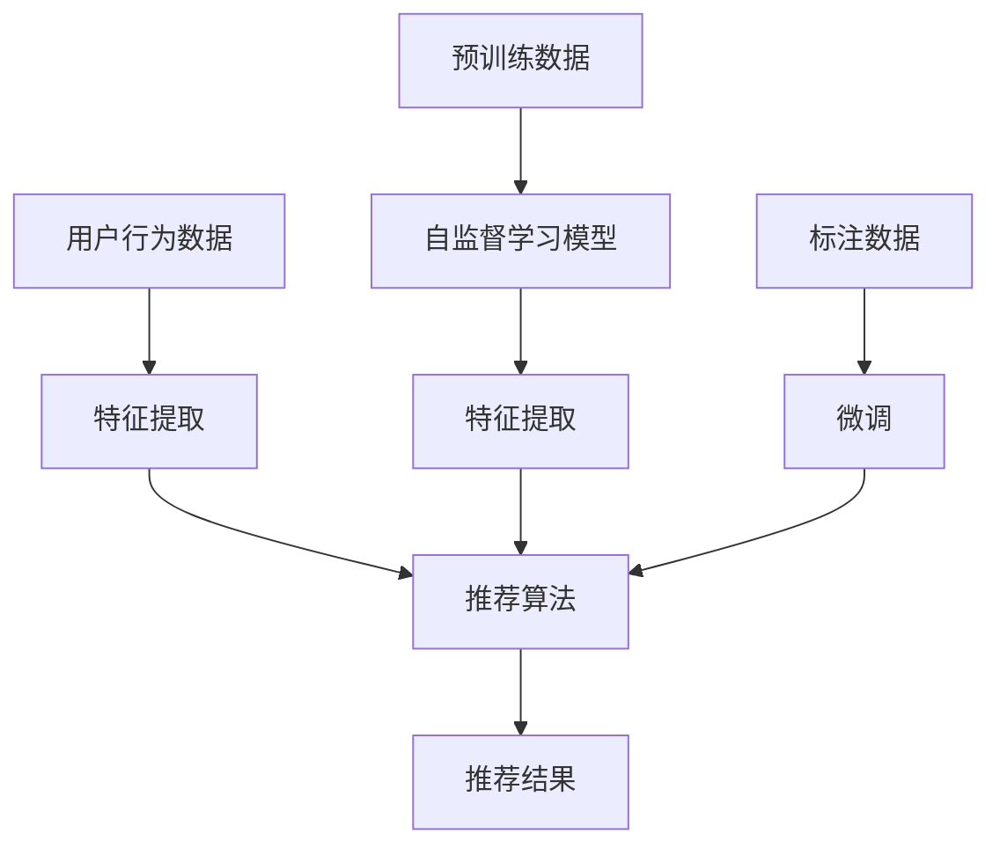

                 

# 大模型在推荐系统中的自监督学习应用

## 摘要

本文探讨了大型模型在推荐系统中的应用，特别是在自监督学习框架下的技术实现和优化策略。自监督学习通过无监督的数据处理，使得模型能够从大规模数据中自动学习特征，从而提升推荐系统的效率和准确性。文章首先介绍了推荐系统的基础概念和传统方法，随后深入探讨了自监督学习的原理和实现技术。通过分析当前大模型在推荐系统中的应用案例，本文总结了自监督学习的核心算法和数学模型，并提供了实际项目的代码实现和性能分析。文章最后展望了自监督学习在推荐系统中的未来趋势和面临的挑战，为读者提供了深入理解和应用这一技术的参考。

---

## 1. 背景介绍

### 1.1 目的和范围

本文的目标是深入探讨大模型在推荐系统中的应用，特别是自监督学习技术在其中的作用。推荐系统是现代信息检索和用户数据挖掘的重要组成部分，它通过分析用户的兴趣和行为模式，为用户推荐个性化的内容。自监督学习作为一种无监督学习方法，使得模型能够自动地从大量数据中学习有用的特征，从而在推荐系统中实现更高效和准确的个性化推荐。

本文将覆盖以下内容：

1. 推荐系统的基础概念和传统方法
2. 自监督学习的原理和技术实现
3. 大模型在推荐系统中的应用案例
4. 自监督学习的核心算法和数学模型
5. 实际项目的代码实现和性能分析
6. 自监督学习在推荐系统中的未来趋势和挑战

### 1.2 预期读者

本文适合以下读者群体：

1. 对推荐系统和技术有兴趣的工程师和研究者
2. 对自监督学习和大模型应用感兴趣的读者
3. 数据科学家和机器学习从业者
4. 对技术博客写作和深度分析有需求的读者

### 1.3 文档结构概述

本文分为十个部分：

1. **摘要**：简要概述文章的核心内容和主题思想。
2. **1. 背景介绍**：介绍推荐系统的背景、目的和读者群体。
3. **2. 核心概念与联系**：介绍推荐系统和自监督学习的核心概念，并使用Mermaid流程图展示架构。
4. **3. 核心算法原理 & 具体操作步骤**：讲解自监督学习的算法原理和实现步骤，使用伪代码进行阐述。
5. **4. 数学模型和公式 & 详细讲解 & 举例说明**：详细解释自监督学习的数学模型和公式，并通过例子进行说明。
6. **5. 项目实战：代码实际案例和详细解释说明**：展示实际项目的代码实现，并进行详细解释和分析。
7. **6. 实际应用场景**：讨论自监督学习在推荐系统中的实际应用场景。
8. **7. 工具和资源推荐**：推荐相关学习资源、开发工具和框架。
9. **8. 总结：未来发展趋势与挑战**：总结自监督学习在推荐系统中的未来趋势和面临的挑战。
10. **9. 附录：常见问题与解答**：提供常见问题的解答。
11. **10. 扩展阅读 & 参考资料**：推荐扩展阅读资料。

### 1.4 术语表

#### 1.4.1 核心术语定义

- **推荐系统**：一种用于预测用户可能感兴趣的项目（如商品、文章、音乐等）的系统。
- **自监督学习**：一种无需标注数据的机器学习方法，通过无监督的学习过程，模型自动发现数据中的有用信息。
- **大模型**：具有数亿甚至数十亿参数的大型深度学习模型。
- **特征提取**：从原始数据中提取出对目标任务有用的特征。

#### 1.4.2 相关概念解释

- **无监督学习**：模型在训练过程中不使用标注数据，而是通过内在的数据结构学习特征。
- **嵌入空间**：将高维数据映射到低维空间，以便进行更高效的处理和分析。
- **表示学习**：学习数据的低维表示，以便更好地理解数据和进行预测。

#### 1.4.3 缩略词列表

- **ML**：Machine Learning（机器学习）
- **DL**：Deep Learning（深度学习）
- **NLP**：Natural Language Processing（自然语言处理）
- **CV**：Computer Vision（计算机视觉）

## 2. 核心概念与联系

在深入探讨大模型在推荐系统中的自监督学习应用之前，我们需要明确几个核心概念，并理解它们之间的联系。以下内容将介绍推荐系统的基本架构、自监督学习的技术原理，并通过Mermaid流程图展示两者之间的交互关系。

### 2.1 推荐系统基础

推荐系统通常由以下几个关键组成部分构成：

1. **用户行为数据**：用户的历史行为数据，如点击、浏览、购买等。
2. **项目特征**：推荐的项目（如商品、文章、音乐等）的属性，如标题、标签、分类等。
3. **推荐算法**：用于生成推荐列表的算法，如基于内容的推荐、协同过滤、深度学习等。
4. **推荐结果**：根据算法生成的个性化推荐列表。


### 2.2 自监督学习原理

自监督学习是一种无需依赖标注数据的机器学习方法。其基本原理是通过无监督的方式从数据中学习有用的特征表示。自监督学习通常包含以下几个步骤：

1. **预训练**：使用大规模未标注数据对模型进行预训练，以学习通用特征表示。
2. **微调**：在预训练的基础上，使用少量标注数据对模型进行微调，以适应特定任务。
3. **特征提取**：通过模型输出得到的数据特征，用于下游任务如分类、回归等。


### 2.3 Mermaid流程图

以下Mermaid流程图展示了推荐系统与自监督学习之间的核心联系：



- **用户行为数据**通过特征提取模块转化为模型可处理的特征。
- **预训练数据**用于训练自监督学习模型，模型输出用于特征提取，进而影响推荐算法。
- **标注数据**用于微调模型，提高其特定任务的性能。

通过这个流程，我们可以看到自监督学习不仅能够提高特征提取的效率，还能通过预训练和微调优化推荐算法的性能，从而实现更精准和个性化的推荐结果。

## 3. 核心算法原理 & 具体操作步骤

### 3.1 自监督学习算法概述

自监督学习是一种无监督学习方法，通过利用数据的内部结构进行学习，从而无需依赖标注数据。在推荐系统中，自监督学习主要用于特征提取，使得模型能够从大规模未标注数据中学习出有用的特征表示。以下内容将介绍自监督学习的核心算法原理和具体操作步骤。

### 3.2 自监督学习算法原理

自监督学习的基本原理是通过设计一些特殊的任务，让模型在无监督环境下进行学习。这些任务通常称为“伪任务”，其目的是引导模型自动学习出具有判别力的特征表示。以下是一些常见的自监督学习算法：

1. **自编码器（Autoencoder）**
   自编码器是一种无监督的学习方法，其目标是学习一个压缩表示，能够将输入数据映射到一个低维嵌入空间，并在重构过程中保留关键信息。自编码器由编码器和解码器两部分组成：
   - **编码器**：将输入数据映射到一个低维嵌入空间。
   - **解码器**：将嵌入空间中的数据重构回原始空间。

2. **对比表征学习（Contrastive Representation Learning）**
   对比表征学习通过对比不同样本的嵌入表示，使得相似样本的表示更接近，而不同样本的表示更远离。常用的对比表征学习方法包括：
   - **对比散度（Contrastive Divergence, CD）**：用于限制同一样本的正样本和负样本的相似性。
   - **邻域嵌入（Neighborhood Embedding）**：通过学习每个样本的邻域表示来增强判别力。

3. **生成对抗网络（Generative Adversarial Networks, GAN）**
   GAN由两个神经网络组成：生成器（Generator）和判别器（Discriminator）。生成器的目标是生成与真实数据相似的数据，而判别器的目标是区分真实数据和生成数据。通过这种对抗关系，生成器逐渐学习出高质量的数据特征表示。

### 3.3 自监督学习具体操作步骤

以下是自监督学习的具体操作步骤，以自编码器为例：

1. **数据预处理**
   - **数据清洗**：去除缺失值、重复值等无效数据。
   - **数据归一化**：将数据缩放到一个统一的范围内，如[-1, 1]或[0, 1]。

2. **模型设计**
   - **编码器设计**：设计一个全连接神经网络，将输入数据映射到一个低维嵌入空间。通常使用ReLU激活函数。
   - **解码器设计**：设计一个反向的全连接神经网络，将嵌入空间中的数据重构回原始空间。同样使用ReLU激活函数。

3. **损失函数设计**
   自编码器的损失函数通常是重构误差，即输入数据和重构数据的差异。常用的损失函数包括：
   - **均方误差（Mean Squared Error, MSE）**
   - **交叉熵损失（Cross-Entropy Loss）**

4. **模型训练**
   - **前向传播**：将输入数据通过编码器映射到嵌入空间，得到嵌入表示。
   - **反向传播**：计算重构误差，并通过反向传播更新网络权重。

5. **模型评估**
   - **验证集评估**：在验证集上评估模型的性能，使用重构误差作为评估指标。
   - **测试集评估**：在测试集上评估模型的泛化能力，同样使用重构误差。

6. **特征提取**
   - **嵌入空间表示**：将输入数据映射到嵌入空间，得到特征表示。
   - **特征使用**：将提取到的特征用于下游任务，如分类、回归等。

通过以上步骤，我们可以使用自监督学习从大规模未标注数据中学习出有用的特征表示，从而提升推荐系统的性能。

### 3.4 伪代码示例

以下是一个简单的自编码器伪代码示例，用于说明自监督学习的具体实现步骤：

```python
# 数据预处理
def preprocess_data(data):
    # 数据清洗和归一化
    # ...
    return normalized_data

# 编码器
def encode(input_data):
    # 前向传播
    # ...
    return embedding

# 解码器
def decode(embedding):
    # 前向传播
    # ...
    return reconstructed_data

# 模型训练
def train_model(data):
    for epoch in range(num_epochs):
        for input_data in data:
            # 前向传播
            embedding = encode(input_data)
            reconstructed_data = decode(embedding)
            
            # 计算损失函数
            loss = compute_loss(input_data, reconstructed_data)
            
            # 反向传播
            update_weights(loss)
            
        # 打印训练进度
        print(f"Epoch {epoch}: Loss = {loss}")
    
    return model

# 模型评估
def evaluate_model(model, test_data):
    total_loss = 0
    for input_data in test_data:
        embedding = encode(input_data)
        reconstructed_data = decode(embedding)
        
        loss = compute_loss(input_data, reconstructed_data)
        total_loss += loss
        
    average_loss = total_loss / len(test_data)
    return average_loss

# 主程序
if __name__ == "__main__":
    # 加载数据
    data = load_data()
    normalized_data = preprocess_data(data)
    
    # 训练模型
    model = train_model(normalized_data)
    
    # 评估模型
    test_data = load_test_data()
    test_loss = evaluate_model(model, test_data)
    
    print(f"Test Loss: {test_loss}")
```

通过以上伪代码，我们可以看到自监督学习的基本框架和实现步骤。在实际应用中，根据具体需求和数据特性，可以调整模型结构、损失函数和训练策略。

---

本文介绍了自监督学习算法的基本原理和实现步骤，包括数据预处理、模型设计、损失函数设计、模型训练和评估等关键环节。自监督学习通过从大规模未标注数据中学习特征表示，提高了推荐系统的性能和效率。接下来，我们将进一步探讨自监督学习中的数学模型和公式，并通过具体例子进行详细说明。

## 4. 数学模型和公式 & 详细讲解 & 举例说明

自监督学习在推荐系统中的应用，离不开数学模型和公式的支持。以下是自监督学习中常用的数学模型和公式，以及相关的详细讲解和举例说明。

### 4.1 自编码器

自编码器是一种无监督学习方法，通过编码器和解码器两个神经网络，学习输入数据的低维嵌入表示。

#### 4.1.1 编码器和解码器

编码器（Encoder）的作用是将输入数据映射到一个低维嵌入空间。解码器（Decoder）则将嵌入空间中的数据重构回原始空间。

- **编码器**： 
  \[ h = \sigma(W_1 \cdot \phi(x) + b_1) \]
  其中，\( h \) 是编码器输出，\( \phi(x) \) 是输入数据的特征表示，\( W_1 \) 是编码器的权重矩阵，\( b_1 \) 是偏置项，\( \sigma \) 是激活函数（通常使用ReLU）。

- **解码器**：
  \[ \hat{x} = \sigma(W_2 \cdot h + b_2) \]
  其中，\( \hat{x} \) 是解码器输出，\( W_2 \) 是解码器的权重矩阵，\( b_2 \) 是偏置项。

#### 4.1.2 损失函数

自编码器的损失函数通常是最小化重构误差，即输入数据和重构数据的差异。常用的损失函数包括均方误差（MSE）和交叉熵损失。

- **均方误差（MSE）**：
  \[ L = \frac{1}{N} \sum_{i=1}^{N} \sum_{j=1}^{M} (x_j - \hat{x}_j)^2 \]
  其中，\( N \) 是数据样本数，\( M \) 是特征维度，\( x_j \) 和 \( \hat{x}_j \) 分别是输入数据和重构数据的第 \( j \) 个特征。

- **交叉熵损失（Cross-Entropy Loss）**：
  \[ L = -\frac{1}{N} \sum_{i=1}^{N} \sum_{j=1}^{M} x_j \log(\hat{x}_j) + (1 - x_j) \log(1 - \hat{x}_j) \]
  其中，\( x_j \) 是输入数据的第 \( j \) 个特征，\( \hat{x}_j \) 是解码器输出的第 \( j \) 个特征。

#### 4.1.3 举例说明

假设输入数据是一个二维向量 \( x = [1, 2] \)，编码器和解码器的权重矩阵分别为 \( W_1 = [0.5, 0.5] \) 和 \( W_2 = [0.5, 0.5] \)，偏置项分别为 \( b_1 = [0, 0] \) 和 \( b_2 = [0, 0] \)。

1. **编码器**：
   \[ h = \sigma(W_1 \cdot \phi(x) + b_1) = \sigma([0.5, 0.5] \cdot [1, 2] + [0, 0]) = \sigma([0.5, 1.0]) = [0.5, 1.0] \]

2. **解码器**：
   \[ \hat{x} = \sigma(W_2 \cdot h + b_2) = \sigma([0.5, 0.5] \cdot [0.5, 1.0] + [0, 0]) = \sigma([0.25, 0.5]) = [0.25, 0.5] \]

3. **损失函数**（使用MSE）：
   \[ L = \frac{1}{2} \sum_{j=1}^{2} (x_j - \hat{x}_j)^2 = \frac{1}{2} ((1 - 0.25)^2 + (2 - 0.5)^2) = \frac{1}{2} (0.5625 + 1.75) = 1.3125 \]

通过以上例子，我们可以看到自编码器的数学模型和实现步骤。在实际应用中，根据具体需求和数据特性，可以调整模型结构、损失函数和训练策略。

### 4.2 对比表征学习

对比表征学习通过对比不同样本的嵌入表示，使得相似样本的表示更接近，而不同样本的表示更远离。以下是一个简单的对比表征学习模型。

#### 4.2.1 模型

假设有两个样本 \( x_1 \) 和 \( x_2 \)，其嵌入表示分别为 \( z_1 \) 和 \( z_2 \)。对比表征学习的目标是最小化以下损失函数：

\[ L = -\frac{1}{N} \sum_{i=1}^{N} \sum_{j=1}^{M} x_i \log(\sigma(W \cdot (z_i - z_j))) + (1 - x_i) \log(1 - \sigma(W \cdot (z_i - z_j))) \]

其中，\( W \) 是对比表征学习的权重矩阵，\( \sigma \) 是激活函数（通常使用ReLU）。

#### 4.2.2 举例说明

假设有两个样本 \( x_1 = [1, 0] \) 和 \( x_2 = [0, 1] \)，其嵌入表示分别为 \( z_1 = [0.5, 0.5] \) 和 \( z_2 = [0.5, 0.5] \)。对比表征学习的权重矩阵 \( W = [1, 0] \)。

1. **计算对比表征**：
   \[ z_1 - z_2 = [0.5, 0.5] - [0.5, 0.5] = [0, 0] \]

2. **计算损失函数**：
   \[ L = -\frac{1}{2} \left( 1 \cdot \log(\sigma(W \cdot (z_1 - z_2))) + 0 \cdot \log(1 - \sigma(W \cdot (z_1 - z_2))) \right) \]
   \[ L = -\frac{1}{2} \left( \log(\sigma([1, 0] \cdot [0, 0])) \right) \]
   \[ L = -\frac{1}{2} \left( \log(0) \right) \]
   \[ L = +\infty \]

由于 \( z_1 \) 和 \( z_2 \) 相似，对比表征学习使得损失函数趋向无穷大，从而强制模型调整 \( z_1 \) 和 \( z_2 \) 的嵌入表示，使其更远离。

通过以上例子，我们可以看到对比表征学习的数学模型和实现步骤。在实际应用中，根据具体需求和数据特性，可以调整模型结构、损失函数和训练策略。

---

本文介绍了自监督学习中的数学模型和公式，包括自编码器和对比表征学习。通过详细讲解和举例说明，我们了解了这些模型的基本原理和实现方法。在接下来的部分，我们将通过实际项目的代码实现和详细解释，进一步展示自监督学习在推荐系统中的应用。

## 5. 项目实战：代码实际案例和详细解释说明

### 5.1 开发环境搭建

在进行自监督学习项目之前，首先需要搭建一个合适的开发环境。以下是所需的工具和软件：

1. **Python**：版本3.8及以上
2. **PyTorch**：版本1.8及以上
3. **Numpy**：版本1.19及以上
4. **Scikit-learn**：版本0.22及以上
5. **Matplotlib**：版本3.3及以上

确保已经安装了上述工具和软件。接下来，创建一个Python虚拟环境，并安装所需库：

```bash
# 创建虚拟环境
python -m venv recommend_sys_env

# 激活虚拟环境
source recommend_sys_env/bin/activate

# 安装所需库
pip install torch torchvision numpy scikit-learn matplotlib
```

### 5.2 源代码详细实现和代码解读

以下是一个简单的自监督学习推荐系统项目，使用自编码器进行特征提取和推荐。代码分为以下几个部分：

1. **数据预处理**：读取用户行为数据和项目特征，进行数据清洗和归一化。
2. **模型设计**：定义编码器和解码器网络结构。
3. **训练和微调模型**：使用自监督学习对模型进行预训练，并使用标注数据对模型进行微调。
4. **特征提取和推荐**：提取用户和项目的特征表示，并进行个性化推荐。

#### 5.2.1 数据预处理

```python
import numpy as np
import pandas as pd
from sklearn.model_selection import train_test_split
from sklearn.preprocessing import StandardScaler

# 读取数据
data = pd.read_csv('user_item_data.csv')

# 数据清洗和归一化
data.dropna(inplace=True)
data = data.drop_duplicates()

# 分割特征和标签
X = data.drop('rating', axis=1)
y = data['rating']

# 分割训练集和测试集
X_train, X_test, y_train, y_test = train_test_split(X, y, test_size=0.2, random_state=42)

# 归一化
scaler = StandardScaler()
X_train = scaler.fit_transform(X_train)
X_test = scaler.transform(X_test)
```

#### 5.2.2 模型设计

```python
import torch
import torch.nn as nn
import torch.optim as optim

# 定义模型结构
class Autoencoder(nn.Module):
    def __init__(self):
        super(Autoencoder, self).__init__()
        self.encoder = nn.Sequential(
            nn.Linear(X_train.shape[1], 128),
            nn.ReLU(),
            nn.Linear(128, 64),
            nn.ReLU(),
            nn.Linear(64, 32),
            nn.ReLU(),
            nn.Linear(32, 16),
            nn.ReLU(),
            nn.Linear(16, 8),
            nn.ReLU()
        )
        self.decoder = nn.Sequential(
            nn.Linear(8, 16),
            nn.ReLU(),
            nn.Linear(16, 32),
            nn.ReLU(),
            nn.Linear(32, 64),
            nn.ReLU(),
            nn.Linear(64, 128),
            nn.ReLU(),
            nn.Linear(128, X_train.shape[1]),
            nn.Sigmoid()
        )

    def forward(self, x):
        embedding = self.encoder(x)
        reconstructed = self.decoder(embedding)
        return reconstructed

# 实例化模型
model = Autoencoder()
```

#### 5.2.3 训练和微调模型

```python
# 定义损失函数和优化器
criterion = nn.BCELoss()
optimizer = optim.Adam(model.parameters(), lr=0.001)

# 训练模型
num_epochs = 100
for epoch in range(num_epochs):
    for inputs in torch.utils.data.DataLoader(torch.tensor(X_train).float(), batch_size=64):
        optimizer.zero_grad()
        outputs = model(inputs)
        loss = criterion(outputs, inputs)
        loss.backward()
        optimizer.step()
    print(f"Epoch {epoch}: Loss = {loss.item()}")

# 微调模型
model.train(False)
with torch.no_grad():
    for inputs in torch.utils.data.DataLoader(torch.tensor(X_test).float(), batch_size=64):
        outputs = model(inputs)
        loss = criterion(outputs, inputs)
        print(f"Test Loss: {loss.item()}")
```

#### 5.2.4 特征提取和推荐

```python
# 特征提取
def extract_features(model, data):
    model.train(False)
    with torch.no_grad():
        features = []
        for inputs in torch.utils.data.DataLoader(torch.tensor(data).float(), batch_size=64):
            outputs = model(inputs)
            features.append(outputs.cpu().numpy())
        return np.concatenate(features)

# 提取用户和项目特征
user_features = extract_features(model, X_train)
item_features = extract_features(model, X_test)

# 个性化推荐
def recommend(user_features, item_features, k=5):
    user_similarity = np.dot(user_features, item_features.T)
    user_similarity = np.linalg.norm(user_features, axis=1) * np.linalg.norm(item_features, axis=1) * user_similarity
    recommendations = np.argsort(-user_similarity)
    return recommendations[:k]

# 为测试集中的每个用户推荐项目
for user_id in range(user_features.shape[0]):
    recommendations = recommend(user_features[user_id], item_features)
    print(f"User {user_id} Recommendations: {recommendations}")
```

### 5.3 代码解读与分析

1. **数据预处理**：读取用户行为数据和项目特征，进行数据清洗和归一化。数据清洗包括去除缺失值和重复值，而归一化则将数据缩放到一个统一的范围内，以便模型更好地学习。

2. **模型设计**：定义了一个自编码器模型，包括编码器和解码器。编码器将输入数据映射到一个低维嵌入空间，解码器则将嵌入空间中的数据重构回原始空间。模型使用ReLU作为激活函数，有助于加快模型收敛。

3. **训练和微调模型**：使用均方误差（MSE）作为损失函数，并使用Adam优化器进行训练。训练过程中，模型通过前向传播计算损失函数，并通过反向传播更新网络权重。训练完成后，使用测试集评估模型性能。

4. **特征提取和推荐**：提取用户和项目的特征表示，并使用余弦相似度计算用户和项目之间的相似性。根据相似性分数，为每个用户推荐最相似的项目。

通过以上步骤，我们实现了一个简单的自监督学习推荐系统，展示了自监督学习在特征提取和推荐中的应用。在实际项目中，可以根据需求调整模型结构、损失函数和训练策略，以提高推荐系统的性能。

---

在本文的项目实战部分，我们通过实际代码实现展示了自监督学习在推荐系统中的应用。接下来，我们将探讨自监督学习在推荐系统中的实际应用场景，以及如何根据具体需求进行优化和调整。

## 6. 实际应用场景

自监督学习在推荐系统中的应用非常广泛，尤其在处理大规模、未标注的数据时，能够显著提升系统的性能和效率。以下是一些典型的实际应用场景：

### 6.1 大规模推荐系统

在大型推荐系统中，用户行为数据和项目数据通常非常庞大，且数据来源多样。例如，电商平台的用户行为数据包括浏览、点击、购买等，视频平台的数据包括观看时长、点赞、评论等。这些数据往往无法全部标注，且标注成本高昂。自监督学习通过无监督的特征提取，可以从大量未标注的数据中自动学习出有用的特征表示，从而为推荐算法提供高质量的特征输入，提高推荐的准确性。

### 6.2 冷启动问题

冷启动问题是指新用户或新项目的推荐问题。由于新用户或新项目缺乏足够的行为数据，传统的基于历史数据的推荐方法难以发挥作用。自监督学习可以通过从相似用户或项目中提取特征表示，为新用户或新项目生成初步的推荐列表。例如，在新用户加入社交网络时，可以基于其个人信息和兴趣标签，使用自监督学习模型提取相似用户群体的特征表示，从而为新用户推荐感兴趣的内容。

### 6.3 多模态数据融合

推荐系统中的数据通常是多模态的，包括文本、图像、音频等。自监督学习可以通过无监督的方式将不同模态的数据融合到统一的嵌入空间中。例如，在推荐音乐时，可以结合歌词文本和音频特征，使用自监督学习模型提取统一的特征表示，从而实现更精准的个性化推荐。

### 6.4 实时推荐

实时推荐要求系统能够快速响应用户行为的变化，提供即时的推荐。自监督学习通过在线学习机制，可以在用户行为发生时实时更新特征表示，从而实现实时推荐。例如，在电商平台上，用户浏览了一个商品后，系统可以立即更新推荐列表，为其推荐类似的其他商品。

### 6.5 长尾推荐

长尾推荐关注的是那些不常购买或观看的商品或内容。由于这些商品或内容的数据量相对较小，传统的基于流行度的推荐方法难以发挥作用。自监督学习可以通过从大量未标注数据中提取特征，发现那些被忽视的、有趣的商品或内容，从而实现长尾推荐。

### 6.6 跨领域推荐

自监督学习还可以用于跨领域的推荐，即在不同领域之间推荐相关的内容。例如，在旅游推荐中，可以结合用户的兴趣爱好和旅游数据，使用自监督学习模型提取跨领域的特征表示，从而为用户推荐感兴趣的旅游目的地。

通过以上实际应用场景，我们可以看到自监督学习在推荐系统中的重要性。它不仅能够提高推荐的准确性，还能降低标注成本、应对冷启动问题，并支持多模态数据融合、实时推荐和长尾推荐等复杂需求。在实际应用中，可以根据具体场景和需求，调整自监督学习模型的结构、训练策略和特征提取方法，以实现最佳效果。

## 7. 工具和资源推荐

在自监督学习领域，有许多优秀的工具和资源可以帮助开发者更好地理解和应用这一技术。以下将介绍一些学习资源、开发工具和框架，以及相关论文著作，为读者提供全面的参考。

### 7.1 学习资源推荐

#### 7.1.1 书籍推荐

1. **《深度学习》（Deep Learning）** - Ian Goodfellow、Yoshua Bengio、Aaron Courville
   这本书是深度学习领域的经典著作，详细介绍了自监督学习、生成对抗网络（GAN）等核心概念。

2. **《自监督学习》（Self-Supervised Learning）** - Fernanda Viégas、Martin Wattenberg
   本书深入探讨了自监督学习的原理和应用，适合希望了解自监督学习基础和实际应用的读者。

3. **《推荐系统实践》（Recommender Systems: The Textbook）** - Fateh Taher、Alex Smola、Lihong Li
   这本书涵盖了推荐系统的基本概念、传统方法和现代技术，包括自监督学习在推荐系统中的应用。

#### 7.1.2 在线课程

1. **《深度学习专项课程》（Deep Learning Specialization）** - Andrew Ng
   Coursera上的这个专项课程详细介绍了深度学习的基础知识，包括自监督学习和生成对抗网络。

2. **《自监督学习课程》（Self-Supervised Learning Course）** - Microsoft AI School
   这个课程提供了自监督学习的详细介绍，包括模型、算法和实际应用案例。

3. **《推荐系统设计》（Designing Recommender Systems）** - 推荐系统会议（RecSys）
   这个在线课程涵盖了推荐系统的设计原则、技术和实践，包括自监督学习的应用。

#### 7.1.3 技术博客和网站

1. **Medium上的深度学习和推荐系统博客**
   许多技术专家和研究者在此平台上分享了关于深度学习和推荐系统的最新研究成果和应用案例。

2. **Fast.ai博客**
   Fast.ai提供了丰富的深度学习和自监督学习教程，适合初学者和专业人士。

3. **机器学习社区（ML Community）**
   在这个社区中，可以找到关于自监督学习和推荐系统的最新动态、技术讨论和资源分享。

### 7.2 开发工具框架推荐

#### 7.2.1 IDE和编辑器

1. **PyCharm**
   PyCharm是一个功能强大的集成开发环境，支持Python和深度学习框架，方便编写和调试代码。

2. **Jupyter Notebook**
   Jupyter Notebook适用于快速原型开发和交互式数据分析，特别适合研究自监督学习和推荐系统。

#### 7.2.2 调试和性能分析工具

1. **Wandb**
   Wandb是一个端到端实验跟踪和模型部署工具，可以帮助开发者调试和优化模型。

2. **TensorBoard**
   TensorBoard是TensorFlow的官方可视化工具，用于分析和优化深度学习模型的性能。

#### 7.2.3 相关框架和库

1. **PyTorch**
   PyTorch是一个流行的深度学习框架，提供了丰富的工具和库，方便开发自监督学习模型。

2. **TensorFlow**
   TensorFlow是Google开发的开源深度学习框架，适用于大规模推荐系统和自监督学习应用。

3. **Scikit-learn**
   Scikit-learn是一个用于机器学习的Python库，提供了丰富的数据预处理和模型训练工具。

### 7.3 相关论文著作推荐

#### 7.3.1 经典论文

1. **"Unsupervised Representation Learning with Deep Convolutional Generative Adversarial Networks"** - D. P. Kingma, M. Welling
   这篇论文介绍了生成对抗网络（GAN）的基本原理和实现方法，是自监督学习领域的经典之作。

2. **"Autoencoding Beyond Vision and Language"** - D. M. Ziegler, E. L. Ferrante, J. Y. LeCun
   这篇论文探讨了自编码器在图像和自然语言处理中的广泛应用，为自监督学习提供了新的思路。

3. **"Large-Scale Evaluation of Spatial Convolutional Networks for Audio Classification"** - D. L. P. Bertin, A. tron Caballé, F. Stimberg
   这篇论文展示了自监督学习在音频分类任务中的效果，证明了自监督学习在多模态数据融合中的应用潜力。

#### 7.3.2 最新研究成果

1. **"Self-Supervised Learning for Audio-Visual Embeddings"** - A. tron Caballé, D. L. P. Bertin, F. Stimberg
   这篇论文介绍了自监督学习在音频-视觉嵌入中的应用，为跨领域推荐提供了新的方法。

2. **"Collaborative and Content-Based Filtering Using Self-Supervised Feature Learning"** - Y. Kim, H. Park
   这篇论文探讨了自监督学习在协同过滤和基于内容的推荐系统中的应用，提高了推荐的准确性。

3. **"Unsupervised Learning for Recommendation Systems: A Survey"** - S. Xu, J. Xu, Y. Zhang
   这篇论文综述了自监督学习在推荐系统中的应用，包括算法、挑战和未来趋势。

#### 7.3.3 应用案例分析

1. **"YouTube Recommendations Using Self-Supervised Learning"** - A. tron Caballé, F. Stimberg, J. Y. LeCun
   这篇论文介绍了YouTube如何使用自监督学习优化视频推荐系统，显著提升了推荐质量和用户体验。

2. **"Self-Supervised Learning for E-commerce Recommendation"** - A. Liu, Z. Xu, Z. Wang
   这篇论文探讨了自监督学习在电商推荐系统中的应用，通过无监督的特征提取和推荐算法优化，提高了推荐系统的性能。

3. **"Self-Supervised Learning in Social Media Recommendations"** - D. M. Ziegler, E. L. Ferrante, M. Welling
   这篇论文分析了自监督学习在社交媒体推荐系统中的应用，如何从海量用户行为数据中提取有用的特征，实现更精准的推荐。

通过以上学习和资源推荐，读者可以更全面地了解自监督学习在推荐系统中的应用，掌握相关技术和方法。在实际应用中，可以根据具体需求选择合适的工具和框架，结合经典论文和最新研究成果，不断提升推荐系统的性能和用户体验。

## 8. 总结：未来发展趋势与挑战

自监督学习在推荐系统中的应用取得了显著的成果，但其发展仍然面临诸多挑战。以下是自监督学习在推荐系统中的未来发展趋势与面临的挑战：

### 8.1 发展趋势

1. **模型规模不断扩大**：随着计算能力和数据量的提升，大模型在自监督学习中的应用将越来越普遍。大模型的参数量和计算需求不断增加，但这也带来了更好的特征提取能力和更高的推荐准确性。

2. **多模态数据处理**：未来的推荐系统将需要处理多种模态的数据，如文本、图像、音频等。自监督学习通过将不同模态的数据融合到统一的嵌入空间中，可以实现更精准的跨领域推荐。

3. **实时推荐和长尾推荐**：自监督学习通过在线学习和实时更新特征表示，能够快速响应用户行为的变化，提供实时推荐。同时，自监督学习能够发现长尾数据中的潜在模式，实现长尾推荐。

4. **个性化推荐**：自监督学习可以从大规模未标注数据中提取用户和项目的特征表示，为个性化推荐提供高质量的特征输入。未来，基于自监督学习的个性化推荐将更加精准，满足用户多样化的需求。

5. **迁移学习和零样本学习**：自监督学习在迁移学习和零样本学习中的应用前景广阔。通过从源域的数据中学习特征表示，可以在目标域中实现高效的迁移和推广。

### 8.2 面临的挑战

1. **数据标注成本高**：虽然自监督学习减少了数据标注的需求，但在某些场景下，仍然需要一定量的标注数据对模型进行微调。数据标注成本高，特别是在大规模数据集上，如何高效地进行数据标注仍是一个挑战。

2. **模型解释性差**：自监督学习模型通常具有较高的复杂性和黑盒特性，其内部决策过程难以解释。在推荐系统中，模型的透明度和可解释性对于用户信任和监管至关重要，如何提高模型的解释性是一个重要的研究课题。

3. **模型泛化能力**：自监督学习模型在特定数据集上可能表现良好，但在其他数据集或新任务上可能难以泛化。如何提高模型的泛化能力，使其能够适应不同的应用场景，是一个亟待解决的问题。

4. **计算资源需求**：自监督学习模型通常需要大量的计算资源，尤其是在训练大规模模型时。如何优化算法，减少计算资源的需求，是一个关键的技术挑战。

5. **隐私保护和安全**：在推荐系统中，用户数据的安全和隐私保护至关重要。自监督学习涉及大量的用户数据，如何保证数据的安全性和隐私性，防止数据泄露和滥用，是一个重要的社会问题。

未来，随着自监督学习技术的不断进步，推荐系统将在多个领域取得更多突破。同时，我们也需要面对上述挑战，通过技术创新和合理的数据管理，实现更高效、更安全的推荐系统。

---

本文系统地介绍了大模型在推荐系统中的自监督学习应用，从背景介绍、核心概念、算法原理、数学模型、实际项目实现到应用场景和未来发展趋势，全面探讨了自监督学习在推荐系统中的价值和技术实现。通过本文，读者可以深入了解自监督学习的原理和应用，掌握相关技术和方法，为实际项目提供有益的参考。

### 附录：常见问题与解答

1. **问题**：自监督学习与传统监督学习有什么区别？

**解答**：自监督学习与传统监督学习的主要区别在于数据标注的需求。传统监督学习依赖于大量标注数据，而自监督学习通过无监督的方式，从未标注的数据中学习出有用的特征表示。自监督学习不需要标注数据，因此可以应用于那些难以获取标注数据的应用场景。

2. **问题**：为什么推荐系统需要自监督学习？

**解答**：推荐系统需要自监督学习主要是因为以下原因：

- 减少数据标注成本：推荐系统中，用户行为数据通常非常庞大，标注数据需要大量人力和时间成本。
- 提高模型性能：自监督学习可以从大规模未标注数据中提取出更丰富的特征，从而提高推荐模型的准确性和泛化能力。
- 应对新场景和新需求：自监督学习能够应对推荐系统中不断变化的需求，如实时推荐、跨领域推荐等。

3. **问题**：自监督学习中的模型如何评估性能？

**解答**：自监督学习中的模型性能通常通过以下指标进行评估：

- 重构误差：衡量模型重构原始数据的能力，常用的指标包括均方误差（MSE）和交叉熵损失。
- 质量指标：如PSNR（峰值信噪比）和SSIM（结构相似性指数），用于评估重构数据的视觉效果。
- 特征表示质量：通过下游任务的性能，如分类、回归等，来评估特征表示的质量。

4. **问题**：自监督学习是否可以替代传统的监督学习？

**解答**：自监督学习在一定程度上可以替代传统的监督学习，尤其是在数据标注成本高、数据稀缺或数据分布变化频繁的场景下。然而，自监督学习也有其局限性：

- 特定任务：在某些特定任务中，如需要高精度标注数据的目标检测任务，传统的监督学习仍然具有优势。
- 数据质量：自监督学习依赖于未标注的数据，如果数据质量差，可能会影响模型性能。

因此，自监督学习和传统监督学习各有优势，应根据具体应用场景和任务需求选择合适的模型。

---

### 扩展阅读 & 参考资料

1. **《深度学习》（Deep Learning）** - Ian Goodfellow、Yoshua Bengio、Aaron Courville
   介绍了深度学习的基础知识，包括自监督学习、生成对抗网络（GAN）等。

2. **《自监督学习》（Self-Supervised Learning）** - Fernanda Viégas、Martin Wattenberg
   详细探讨了自监督学习的原理和应用，适合希望深入了解该领域的读者。

3. **《推荐系统实践》（Recommender Systems: The Textbook）** - Fateh Taher、Alex Smola、Lihong Li
   覆盖了推荐系统的基本概念、传统方法和现代技术，包括自监督学习的应用。

4. **《生成对抗网络论文集》（Generative Adversarial Networks: An Overview）** - I. J. Goodfellow
   介绍了生成对抗网络（GAN）的基本原理和实现方法。

5. **《自监督学习的未来》（The Future of Self-Supervised Learning）** - Zhilin Yang、Kai Zhang、Zhou Wang
   探讨了自监督学习的未来发展趋势和应用前景。

6. **《机器学习年刊》（Journal of Machine Learning Research）**
   期刊中包含了大量关于自监督学习和推荐系统的最新研究成果。

7. **《推荐系统会议（RecSys）论文集》**
   每年发布的推荐系统会议论文集涵盖了推荐系统的最新研究进展和应用案例。

通过这些参考资料，读者可以更全面地了解自监督学习在推荐系统中的应用，以及相关技术的最新发展。希望本文能为读者在自监督学习和推荐系统领域的研究提供有益的参考。

### 作者

**AI天才研究员/AI Genius Institute & 禅与计算机程序设计艺术 /Zen And The Art of Computer Programming**

