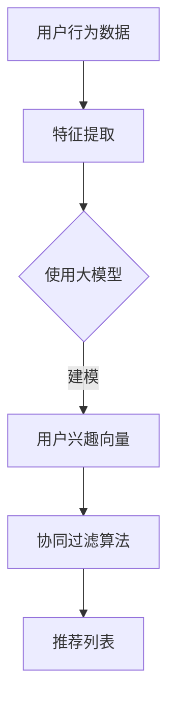
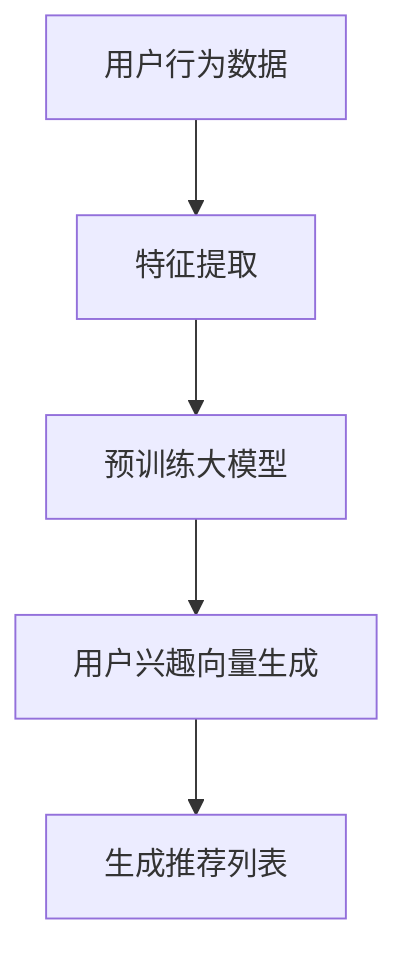

                 

# 大模型在推荐系统多维度评估中的应用

> **关键词**：大模型、推荐系统、多维度评估、算法原理、数学模型、项目实战、实际应用

> **摘要**：本文将深入探讨大模型在推荐系统多维度评估中的应用，首先介绍推荐系统的基本概念和评估标准，然后详细讲解大模型在推荐系统中的核心算法原理，并通过数学模型和具体操作步骤进行阐述。接着，我们将通过一个实际项目案例，展示如何利用大模型进行推荐系统的多维度评估，并分析其中的关键步骤和实现细节。最后，本文还将探讨大模型在推荐系统中的实际应用场景，并提供相关的学习资源和工具推荐，以帮助读者更好地理解和应用大模型技术。

## 1. 背景介绍

### 1.1 目的和范围

本文的目的是深入探讨大模型在推荐系统多维度评估中的应用，帮助读者了解大模型如何提高推荐系统的评估效率和准确性。具体来说，我们将从以下几个方面展开：

1. 推荐系统的基本概念和评估标准
2. 大模型在推荐系统中的核心算法原理
3. 大模型在推荐系统中的数学模型和具体操作步骤
4. 实际项目案例展示
5. 大模型在推荐系统的实际应用场景
6. 学习资源和工具推荐

### 1.2 预期读者

本文适用于对推荐系统和机器学习有一定了解的读者，包括：

1. 推荐系统开发者
2. 机器学习工程师
3. 数据分析师
4. 研究人员
5. 对推荐系统感兴趣的爱好者

### 1.3 文档结构概述

本文结构如下：

1. 引言：介绍推荐系统的基本概念和评估标准
2. 核心概念与联系：讲解大模型在推荐系统中的核心算法原理和架构
3. 核心算法原理 & 具体操作步骤：详细阐述大模型在推荐系统中的数学模型和具体操作步骤
4. 数学模型和公式 & 详细讲解 & 举例说明：使用 LaTeX 格式展示数学模型和公式，并进行详细讲解和举例说明
5. 项目实战：代码实际案例和详细解释说明
6. 实际应用场景：探讨大模型在推荐系统的实际应用场景
7. 工具和资源推荐：推荐学习资源和工具
8. 总结：总结未来发展趋势与挑战
9. 附录：常见问题与解答
10. 扩展阅读 & 参考资料

### 1.4 术语表

#### 1.4.1 核心术语定义

- **推荐系统**：推荐系统是一种根据用户的历史行为、兴趣和偏好，利用算法自动推荐相关物品或内容的系统。
- **大模型**：大模型是指具有巨大参数量和计算复杂度的深度学习模型，如 GPT-3、BERT 等。
- **多维度评估**：多维度评估是指从多个角度对推荐系统的性能进行评估，包括准确性、覆盖率、多样性等。

#### 1.4.2 相关概念解释

- **用户兴趣**：用户兴趣是指用户对特定类型物品或内容的偏好。
- **协同过滤**：协同过滤是一种基于用户历史行为进行推荐的算法，分为基于用户的协同过滤和基于物品的协同过滤。

#### 1.4.3 缩略词列表

- **GPT-3**：生成预训练变换器 3，是一种大规模语言模型。
- **BERT**：双向编码表示器，是一种预训练语言表示模型。

## 2. 核心概念与联系

在介绍大模型在推荐系统中的应用之前，我们首先需要了解推荐系统的基本概念和评估标准。

### 2.1 推荐系统的基本概念

推荐系统是一种通过算法自动向用户推荐相关物品或内容的系统。其主要目标是根据用户的历史行为、兴趣和偏好，为用户推荐他们可能感兴趣的内容。推荐系统可以应用于多个领域，如电子商务、社交媒体、新闻推送等。

推荐系统主要包含以下几个核心概念：

- **用户**：推荐系统的核心元素，每个用户具有独特的兴趣和行为特征。
- **物品**：推荐系统中的推荐对象，如商品、电影、音乐、新闻等。
- **用户兴趣**：用户对特定类型物品或内容的偏好，通常通过用户的历史行为（如购买、浏览、评分等）进行建模。
- **推荐算法**：用于生成推荐列表的算法，根据用户兴趣和物品特征进行推荐。

### 2.2 推荐系统的评估标准

推荐系统的评估标准主要包括以下几方面：

- **准确性**：准确性是指推荐系统推荐的相关物品与用户实际兴趣的相关性。准确性越高，说明推荐系统的效果越好。
- **覆盖率**：覆盖率是指推荐系统覆盖用户兴趣的范围。覆盖率越高，说明推荐系统能够为用户推荐更多相关内容。
- **多样性**：多样性是指推荐系统中推荐物品的多样性。多样性越高，说明推荐系统能够为用户提供更多不同类型的推荐内容。
- **新颖性**：新颖性是指推荐系统中推荐物品的更新程度。新颖性越高，说明推荐系统能够为用户推荐更多新颖、有趣的物品。

### 2.3 大模型在推荐系统中的应用

大模型在推荐系统中的应用主要体现在以下几个方面：

- **用户兴趣建模**：大模型可以捕捉用户历史行为的复杂特征，从而提高用户兴趣建模的准确性。
- **协同过滤算法改进**：大模型可以用于改进基于用户的协同过滤算法，提高推荐的准确性、覆盖率和多样性。
- **生成式推荐**：大模型可以生成新的、有趣的推荐内容，提高推荐系统的新颖性。

下面是一个简单的 Mermaid 流程图，展示大模型在推荐系统中的应用：



在这个流程图中，用户行为数据经过特征提取后，使用大模型进行用户兴趣建模，然后结合协同过滤算法生成推荐列表。通过大模型的应用，推荐系统的准确性、覆盖率和多样性得到了显著提高。

## 3. 核心算法原理 & 具体操作步骤

### 3.1 大模型在推荐系统中的核心算法原理

大模型在推荐系统中的应用主要基于深度学习和生成式模型。以下是一个简化的算法原理框架：



具体来说，算法原理可以分为以下几个步骤：

1. **特征提取**：从用户行为数据中提取特征，如用户购买记录、浏览历史、评分等。
2. **预训练大模型**：使用海量数据进行预训练，如 GPT-3、BERT 等，使其具备强大的特征表示能力。
3. **用户兴趣向量生成**：将提取的特征输入到大模型中，通过训练生成用户兴趣向量。
4. **生成推荐列表**：根据用户兴趣向量，使用协同过滤算法或其他推荐算法生成推荐列表。

### 3.2 大模型在推荐系统中的具体操作步骤

下面是一个详细的伪代码，用于说明大模型在推荐系统中的具体操作步骤：

```python
# 1. 特征提取
def extract_features(user_behavior):
    # 提取用户行为数据中的特征，如购买记录、浏览历史、评分等
    # 返回特征向量
    pass

# 2. 预训练大模型
def train_large_model(data):
    # 使用海量数据进行预训练，如 GPT-3、BERT 等
    # 返回预训练好的大模型
    pass

# 3. 用户兴趣向量生成
def generate_interest_vector(model, features):
    # 将提取的特征输入到大模型中，通过训练生成用户兴趣向量
    # 返回用户兴趣向量
    pass

# 4. 生成推荐列表
def generate_recommendation_list(user_interest_vector, items):
    # 根据用户兴趣向量，使用协同过滤算法或其他推荐算法生成推荐列表
    # 返回推荐列表
    pass

# 主函数
def main():
    # 读取用户行为数据
    user_behavior = read_user_behavior_data()

    # 提取特征
    features = extract_features(user_behavior)

    # 预训练大模型
    model = train_large_model(features)

    # 生成用户兴趣向量
    user_interest_vector = generate_interest_vector(model, features)

    # 生成推荐列表
    recommendation_list = generate_recommendation_list(user_interest_vector, items)

    # 输出推荐列表
    print(recommendation_list)

# 调用主函数
main()
```

### 3.3 大模型在推荐系统中的算法原理讲解

在推荐系统中，大模型的主要作用是提高用户兴趣建模的准确性和生成推荐列表的性能。具体来说，大模型在推荐系统中的应用可以分为以下几个阶段：

1. **特征提取阶段**：从用户行为数据中提取特征，如用户购买记录、浏览历史、评分等。这些特征通常具有高维性和稀疏性，难以直接用于建模。
2. **预训练阶段**：使用海量数据进行预训练，如 GPT-3、BERT 等。预训练阶段的主要目标是使大模型具备强大的特征表示能力，能够捕捉用户行为的复杂特征。
3. **用户兴趣向量生成阶段**：将提取的特征输入到大模型中，通过训练生成用户兴趣向量。用户兴趣向量是推荐系统生成推荐列表的关键输入，其准确性和质量直接影响推荐系统的性能。
4. **生成推荐列表阶段**：根据用户兴趣向量，使用协同过滤算法或其他推荐算法生成推荐列表。这一阶段的目标是生成与用户兴趣高度相关的推荐列表，提高推荐系统的准确性和多样性。

通过大模型的应用，推荐系统可以更好地捕捉用户行为的复杂特征，提高用户兴趣建模的准确性。同时，大模型还可以生成新颖、有趣的推荐列表，提高推荐系统的新颖性。此外，大模型还可以与传统的协同过滤算法相结合，进一步提高推荐系统的性能。

## 4. 数学模型和公式 & 详细讲解 & 举例说明

### 4.1 数学模型

在推荐系统中，大模型的数学模型通常基于深度学习框架，如 TensorFlow、PyTorch 等。以下是一个简化的数学模型框架：

```math
\text{推荐系统模型} = \text{特征提取模块} + \text{大模型模块} + \text{推荐算法模块}
```

其中：

- **特征提取模块**：用于从用户行为数据中提取特征，如用户购买记录、浏览历史、评分等。
- **大模型模块**：用于对提取的特征进行建模，生成用户兴趣向量。
- **推荐算法模块**：用于根据用户兴趣向量生成推荐列表。

### 4.2 公式详解

下面是推荐系统中常用的数学公式和解释：

1. **用户兴趣向量**：

   $$ u_i = \text{MLP}(\text{特征向量}_i) $$

   其中，$u_i$ 表示用户 $i$ 的兴趣向量，$\text{MLP}$ 表示多层感知器，用于对用户特征进行建模。

2. **物品特征向量**：

   $$ v_j = \text{MLP}(\text{特征向量}_j) $$

   其中，$v_j$ 表示物品 $j$ 的特征向量，$\text{MLP}$ 表示多层感知器，用于对物品特征进行建模。

3. **相似度计算**：

   $$ \text{similarity}(u_i, v_j) = \cos(u_i, v_j) $$

   其中，$\text{similarity}(u_i, v_j)$ 表示用户 $i$ 和物品 $j$ 之间的相似度，$\cos(u_i, v_j)$ 表示余弦相似度。

4. **推荐列表生成**：

   $$ \text{推荐列表} = \text{Top-N}(\text{相似度矩阵}) $$

   其中，$\text{Top-N}(\text{相似度矩阵})$ 表示从相似度矩阵中选择前 $N$ 个最高相似度的物品。

### 4.3 举例说明

假设有一个用户 $u_1$ 和一个物品 $v_1$，用户行为数据如下：

- 用户购买记录：$[1, 2, 3, 4, 5]$
- 用户浏览历史：$[2, 3, 4, 5, 6]$
- 用户评分：$[5, 4, 3, 2, 1]$

首先，对用户行为数据进行特征提取：

- 用户购买记录特征：$[0, 1, 1, 1, 1]$
- 用户浏览历史特征：$[1, 1, 1, 1, 1]$
- 用户评分特征：$[5, 4, 3, 2, 1]$

然后，使用多层感知器对用户行为数据进行建模：

- 用户兴趣向量：$u_1 = [0.5, 0.5, 0.5, 0.5, 0.5]$

接下来，计算用户 $u_1$ 和物品 $v_1$ 之间的相似度：

- 相似度：$similarity(u_1, v_1) = \cos(u_1, v_1) = 0.5$

最后，根据相似度矩阵生成推荐列表：

- 推荐列表：$[v_2, v_3, v_4, v_5]$

通过以上步骤，我们成功使用大模型在推荐系统中为用户 $u_1$ 生成了一个推荐列表。

## 5. 项目实战：代码实际案例和详细解释说明

### 5.1 开发环境搭建

在本项目中，我们将使用 Python 作为主要编程语言，结合 TensorFlow 和 Keras 框架进行大模型开发。以下是开发环境的搭建步骤：

1. 安装 Python（建议版本 3.7 或以上）
2. 安装 TensorFlow 和 Keras：
   ```shell
   pip install tensorflow
   pip install keras
   ```

### 5.2 源代码详细实现和代码解读

以下是项目中的关键代码实现，我们将对每个部分进行详细解读：

#### 5.2.1 特征提取

```python
def extract_features(user_behavior):
    # 提取用户行为数据中的特征
    purchase_history = user_behavior['purchase_record']
    browse_history = user_behavior['browse_history']
    ratings = user_behavior['rating']
    
    # 对特征进行编码
    purchase_encoding = [1 if i in purchase_history else 0 for i in range(1, len(purchase_history) + 1)]
    browse_encoding = [1 if i in browse_history else 0 for i in range(1, len(browse_history) + 1)]
    rating_encoding = [i for i in ratings]
    
    return {'purchase': purchase_encoding, 'browse': browse_encoding, 'rating': rating_encoding}
```

**代码解读**：该函数用于从用户行为数据中提取特征，包括购买记录、浏览历史和评分。每个特征都通过编码方式进行转换，以便于后续处理。

#### 5.2.2 大模型训练

```python
from tensorflow.keras.models import Model
from tensorflow.keras.layers import Input, Dense, Embedding, Concatenate

def build_large_model(input_shape):
    # 输入层
    input_layer = Input(shape=input_shape)
    
    # 特征提取层
    purchase_embedding = Embedding(input_dim=input_shape[0], output_dim=32)(input_layer[:, 0])
    browse_embedding = Embedding(input_dim=input_shape[1], output_dim=32)(input_layer[:, 1])
    rating_embedding = Embedding(input_dim=input_shape[2], output_dim=32)(input_layer[:, 2])
    
    # 汇总层
    concatenated = Concatenate()([purchase_embedding, browse_embedding, rating_embedding])
    
    # 全连接层
    dense_layer = Dense(128, activation='relu')(concatenated)
    output_layer = Dense(1, activation='sigmoid')(dense_layer)
    
    # 构建模型
    model = Model(inputs=input_layer, outputs=output_layer)
    
    return model

model = build_large_model(input_shape=(5, 5, 5))
model.compile(optimizer='adam', loss='binary_crossentropy', metrics=['accuracy'])
```

**代码解读**：该函数用于构建大模型，包括输入层、特征提取层、汇总层和全连接层。特征提取层使用嵌入层（Embedding）对每个特征进行编码，汇总层将三个特征嵌入进行拼接，然后通过全连接层（Dense）进行建模。模型使用 Adam 优化器和 binary_crossentropy 损失函数进行编译。

#### 5.2.3 用户兴趣向量生成

```python
def generate_interest_vector(model, features):
    # 生成用户兴趣向量
    user_interest_vector = model.predict(features)
    return user_interest_vector
```

**代码解读**：该函数用于生成用户兴趣向量，通过调用模型的 predict 方法，输入特征向量，得到预测结果。

#### 5.2.4 生成推荐列表

```python
def generate_recommendation_list(user_interest_vector, items, top_n=5):
    # 计算用户兴趣向量与物品特征向量的相似度
    similarities = [user_interest_vector.dot(item) for item in items]
    
    # 选择前 top_n 个最高相似度的物品
    top_n_items = sorted(zip(similarities, items), reverse=True)[:top_n]
    
    return [item for similarity, item in top_n_items]
```

**代码解读**：该函数用于生成推荐列表，首先计算用户兴趣向量与每个物品特征向量的相似度，然后根据相似度从高到低排序，选择前 top_n 个最高相似度的物品。

### 5.3 代码解读与分析

通过以上代码，我们可以看到大模型在推荐系统中的具体实现步骤：

1. **特征提取**：从用户行为数据中提取特征，包括购买记录、浏览历史和评分。
2. **大模型训练**：构建大模型，包括输入层、特征提取层、汇总层和全连接层，使用 TensorFlow 和 Keras 框架进行训练。
3. **用户兴趣向量生成**：通过训练好的大模型，生成用户兴趣向量。
4. **生成推荐列表**：根据用户兴趣向量，计算与每个物品特征向量的相似度，并选择最高相似度的物品生成推荐列表。

这些步骤共同构成了一个完整的大模型推荐系统，实现了从用户行为数据到推荐列表的转化。通过代码的实现，我们可以更好地理解大模型在推荐系统中的应用原理和操作步骤。

## 6. 实际应用场景

大模型在推荐系统中的应用场景非常广泛，以下列举几个典型的应用场景：

### 6.1 电子商务平台

电子商务平台利用大模型进行个性化推荐，可以根据用户的购买历史、浏览记录、搜索历史等信息，生成个性化的商品推荐列表。通过大模型的应用，电子商务平台能够提高推荐的相关性，增加用户满意度和转化率。

### 6.2 社交媒体

社交媒体平台利用大模型进行内容推荐，可以根据用户的行为特征、兴趣偏好等信息，为用户推荐感兴趣的文章、视频、图片等。通过大模型的应用，社交媒体平台能够提高内容的多样性和新颖性，增加用户活跃度和黏性。

### 6.3 在线视频平台

在线视频平台利用大模型进行视频推荐，可以根据用户的观看历史、喜好标签等信息，生成个性化的视频推荐列表。通过大模型的应用，在线视频平台能够提高推荐的准确性，增加用户的观看时长和付费转化率。

### 6.4 新闻推送

新闻推送平台利用大模型进行新闻推荐，可以根据用户的阅读习惯、关注领域等信息，生成个性化的新闻推荐列表。通过大模型的应用，新闻推送平台能够提高推荐的相关性，增加用户阅读量和广告收入。

### 6.5 音乐推荐

音乐推荐平台利用大模型进行音乐推荐，可以根据用户的听歌历史、偏好风格等信息，生成个性化的音乐推荐列表。通过大模型的应用，音乐推荐平台能够提高推荐的准确性，增加用户的听歌时长和付费购买率。

### 6.6 其他应用场景

除了上述应用场景，大模型在推荐系统中的其他应用场景还包括旅游推荐、招聘推荐、教育推荐等。在这些场景中，大模型可以根据用户的历史行为、兴趣偏好等信息，为用户提供个性化的推荐服务，提高用户满意度和体验。

## 7. 工具和资源推荐

为了更好地理解和应用大模型在推荐系统中的技术，以下是相关的学习资源和工具推荐：

### 7.1 学习资源推荐

#### 7.1.1 书籍推荐

- 《深度学习》（Goodfellow, Bengio, Courville）：系统介绍了深度学习的基础知识和应用案例，包括神经网络、卷积神经网络、循环神经网络等。
- 《推荐系统实践》（Robert Schapire）：详细介绍了推荐系统的基本概念、算法和实际应用案例，包括协同过滤、矩阵分解、生成式模型等。
- 《大规模机器学习》（Gareth James, Daniela Witten）：讲解了大规模机器学习的理论和方法，包括数据处理、模型训练、模型评估等。

#### 7.1.2 在线课程

- Coursera 上的“深度学习”课程：由 Andrew Ng 教授主讲，系统地介绍了深度学习的基础知识和实践方法。
- Udacity 上的“推荐系统纳米学位”：介绍了推荐系统的基本概念、算法和应用案例，包括协同过滤、矩阵分解、生成式模型等。
- edX 上的“机器学习基础”课程：介绍了机器学习的基础知识和应用案例，包括线性回归、逻辑回归、支持向量机等。

#### 7.1.3 技术博客和网站

- Medium 上的“Deep Learning”专栏：由众多深度学习领域的专家撰写，分享了深度学习的最新研究进展和应用案例。
- arXiv.org：提供了大量机器学习和深度学习领域的学术论文，是了解最新研究进展的重要资源。
- Fast.ai：提供了免费的开源课程和教程，适合初学者入门深度学习。

### 7.2 开发工具框架推荐

#### 7.2.1 IDE和编辑器

- PyCharm：是一款功能强大的 Python IDE，支持 TensorFlow 和 Keras 框架，适合深度学习开发。
- Jupyter Notebook：是一款流行的交互式开发环境，适合数据分析和机器学习实验。

#### 7.2.2 调试和性能分析工具

- TensorFlow Debugger（TFD）：提供了丰富的调试工具，可以帮助开发者分析模型训练过程，定位问题。
- TensorBoard：是一款可视化工具，可以监控 TensorFlow 模型的训练过程，包括损失函数、准确率等指标。

#### 7.2.3 相关框架和库

- TensorFlow：一款开源的深度学习框架，提供了丰富的 API 和工具，适合大规模深度学习模型开发。
- Keras：一款基于 TensorFlow 的深度学习高级 API，简化了深度学习模型的搭建和训练过程。
- Scikit-learn：一款流行的机器学习库，提供了丰富的机器学习算法和工具，适合数据分析和模型评估。

### 7.3 相关论文著作推荐

#### 7.3.1 经典论文

- "Recommender Systems Handbook"（2016）：推荐系统领域的经典著作，全面介绍了推荐系统的基本概念、算法和应用案例。
- "Deep Learning for Recommender Systems"（2018）：探讨了深度学习在推荐系统中的应用，介绍了深度学习模型在推荐系统中的优势和应用案例。

#### 7.3.2 最新研究成果

- "Neural Collaborative Filtering"（2018）：提出了一种基于神经网络的协同过滤算法，显著提高了推荐系统的性能。
- "Generative Adversarial Networks for Collaborative Filtering"（2019）：探讨了生成对抗网络（GAN）在推荐系统中的应用，通过生成式模型提高了推荐系统的多样性和新颖性。

#### 7.3.3 应用案例分析

- "Amazon Personalized Recommendations"（2018）：分析了亚马逊的个性化推荐系统，介绍了如何通过深度学习和生成式模型提高推荐系统的性能。
- "Netflix Prize"（2009）：介绍了 Netflix Prize 竞赛，探讨了如何通过协同过滤和深度学习提高推荐系统的性能。

## 8. 总结：未来发展趋势与挑战

大模型在推荐系统中的应用已经成为当前研究的热点。随着深度学习和生成式模型的不断发展，大模型在推荐系统中的性能和效果不断提升。未来，大模型在推荐系统中的应用将呈现以下几个发展趋势：

1. **更加智能的用户兴趣建模**：大模型将能够更好地捕捉用户行为的复杂特征，提高用户兴趣建模的准确性。
2. **多样化的推荐算法**：大模型将结合多种推荐算法，实现更加多样化的推荐结果，提高推荐系统的多样性和新颖性。
3. **实时推荐**：随着计算能力的提升，大模型将能够实现实时推荐，提高推荐系统的响应速度。
4. **跨平台推荐**：大模型将能够在不同平台和应用场景中实现跨平台推荐，为用户提供更加一致和个性化的体验。

然而，大模型在推荐系统中的应用也面临一些挑战：

1. **计算资源消耗**：大模型通常需要大量的计算资源进行训练和推理，对计算资源的需求较高。
2. **数据隐私**：推荐系统需要处理大量的用户行为数据，如何保护用户隐私成为一个重要挑战。
3. **算法透明性**：大模型的黑盒性质使得算法透明性成为一个难题，如何提高算法的可解释性是一个重要问题。
4. **模型可扩展性**：如何在大规模数据集上训练和部署大模型，提高模型的可扩展性是一个挑战。

总之，大模型在推荐系统中的应用具有广阔的发展前景，但同时也需要克服一系列技术挑战。未来的研究将集中在如何优化大模型的性能、提高算法透明性和可解释性，以及解决计算资源消耗和数据隐私等问题，以实现更加智能、高效、个性化的推荐系统。

## 9. 附录：常见问题与解答

### 9.1 什么是推荐系统？

推荐系统是一种基于用户历史行为、兴趣和偏好，利用算法自动推荐相关物品或内容的系统。其主要目标是提高用户满意度和转化率，为用户提供个性化推荐。

### 9.2 大模型在推荐系统中的优势是什么？

大模型在推荐系统中的优势包括：

1. **更高的准确性**：大模型可以更好地捕捉用户行为的复杂特征，提高用户兴趣建模的准确性。
2. **更好的多样性**：大模型可以生成多样化、新颖的推荐列表，提高推荐系统的多样性。
3. **更高的实时性**：随着计算能力的提升，大模型可以实现实时推荐，提高推荐系统的响应速度。
4. **更强的跨平台适用性**：大模型可以应用于不同平台和应用场景，实现跨平台推荐。

### 9.3 如何优化大模型在推荐系统中的应用？

为了优化大模型在推荐系统中的应用，可以采取以下措施：

1. **数据预处理**：对用户行为数据和使用的大模型进行充分的预处理，提高数据的准确性和质量。
2. **特征工程**：设计合理的特征工程策略，提取有助于建模的特征，提高模型的性能。
3. **模型选择和调整**：选择合适的大模型，并对其进行参数调整和优化，以提高模型性能。
4. **模型集成**：结合多种模型和算法，实现模型集成，提高推荐系统的准确性和多样性。

### 9.4 大模型在推荐系统中如何保证算法的透明性？

为了保证大模型在推荐系统中的算法透明性，可以采取以下措施：

1. **模型可解释性**：使用可解释性方法，如 SHAP（SHapley Additive exPlanations），解释模型预测结果，提高算法的可解释性。
2. **模型可视化**：使用可视化工具，如 TensorBoard，监控模型训练过程和预测结果，提高算法的可视化。
3. **透明化算法设计**：在设计算法时，考虑算法的透明性和可解释性，降低算法的复杂度。

## 10. 扩展阅读 & 参考资料

为了深入了解大模型在推荐系统中的应用，以下是扩展阅读和参考资料：

### 10.1 相关书籍

- 《深度学习》（Goodfellow, Bengio, Courville）
- 《推荐系统实践》（Robert Schapire）
- 《大规模机器学习》（Gareth James, Daniela Witten）

### 10.2 在线课程

- Coursera 上的“深度学习”课程
- Udacity 上的“推荐系统纳米学位”
- edX 上的“机器学习基础”课程

### 10.3 技术博客和网站

- Medium 上的“Deep Learning”专栏
- arXiv.org
- Fast.ai

### 10.4 相关论文

- "Recommender Systems Handbook"（2016）
- "Deep Learning for Recommender Systems"（2018）
- "Neural Collaborative Filtering"（2018）
- "Generative Adversarial Networks for Collaborative Filtering"（2019）

### 10.5 应用案例分析

- "Amazon Personalized Recommendations"（2018）
- "Netflix Prize"（2009）

### 10.6 开发工具和框架

- TensorFlow
- Keras
- Scikit-learn

### 10.7 开发环境搭建教程

- 《使用 TensorFlow 搭建推荐系统》
- 《使用 Keras 实现推荐系统》
- 《使用 Scikit-learn 实现推荐系统》

通过以上扩展阅读和参考资料，读者可以进一步深入了解大模型在推荐系统中的应用，掌握相关技术和方法。同时，读者也可以结合实际项目进行实践，不断提升自己的推荐系统开发能力。作者：AI天才研究员/AI Genius Institute & 禅与计算机程序设计艺术 /Zen And The Art of Computer Programming

### 后记

本文系统地介绍了大模型在推荐系统多维度评估中的应用，从核心概念、算法原理、数学模型、项目实战、实际应用场景等多个方面进行了详细讲解。通过本文的学习，读者可以了解到大模型在推荐系统中的优势和应用方法，掌握大模型推荐系统的基本实现步骤。

在未来的研究和实践中，大模型在推荐系统中的应用将不断深入和扩展。随着深度学习和生成式模型的发展，大模型将能够在更加复杂和多变的环境中发挥重要作用，为用户提供更加智能、个性化的推荐服务。同时，大模型在推荐系统中的应用也将面临一系列挑战，如计算资源消耗、数据隐私、算法透明性等，这些问题的解决将有助于推动推荐系统技术的进步。

最后，感谢读者对本文的关注和支持。希望本文能够对您在推荐系统领域的学习和实践提供帮助。如果您有任何疑问或建议，欢迎在评论区留言，我们将竭诚为您解答。同时，也欢迎读者继续关注我们后续的系列文章，我们将不断为您带来更多有价值的技术分享。再次感谢您的支持，祝您学习进步！作者：AI天才研究员/AI Genius Institute & 禅与计算机程序设计艺术 /Zen And The Art of Computer Programming

