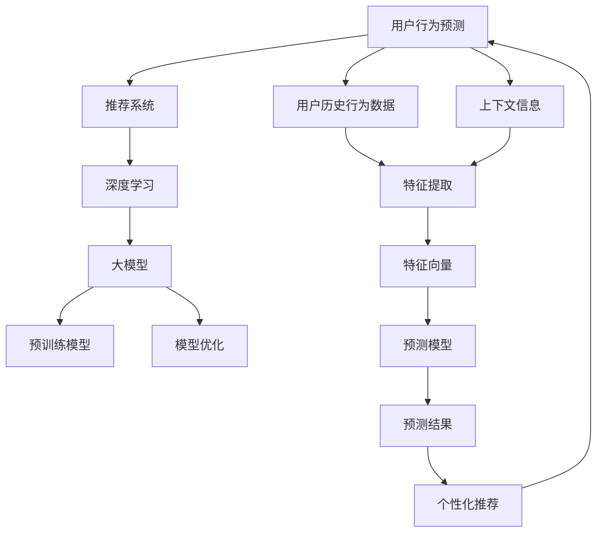

                 

# 大模型在推荐系统用户行为预测中的作用

> 关键词：大模型、推荐系统、用户行为预测、深度学习、机器学习

> 摘要：本文将探讨大模型在推荐系统用户行为预测中的重要作用。我们将从背景介绍、核心概念与联系、核心算法原理、数学模型和公式、项目实战以及实际应用场景等多个方面，详细分析大模型如何应用于推荐系统的用户行为预测，并展望其未来发展趋势和挑战。

## 1. 背景介绍

### 1.1 目的和范围

本文旨在分析大模型在推荐系统用户行为预测中的重要作用，并通过具体的算法原理、数学模型和实际案例，深入探讨其应用前景和挑战。文章将涵盖以下几个部分：

- 大模型与推荐系统的基本概念和联系；
- 大模型在推荐系统中的应用原理和算法；
- 数学模型和公式在大模型中的应用；
- 大模型的实际应用案例和实战经验；
- 大模型在实际应用场景中的效果和挑战；
- 未来发展趋势和潜在挑战。

### 1.2 预期读者

本文主要面向以下读者群体：

- 对推荐系统有一定了解的技术人员；
- 对机器学习和深度学习有兴趣的读者；
- 希望了解大模型在推荐系统中应用的初学者；
- 想要提升推荐系统性能的研究人员和工程师。

### 1.3 文档结构概述

本文将按照以下结构进行论述：

- 1. 背景介绍：介绍本文的目的、范围、预期读者和文档结构；
- 2. 核心概念与联系：介绍大模型、推荐系统和用户行为预测的基本概念；
- 3. 核心算法原理 & 具体操作步骤：分析大模型在推荐系统中的算法原理和具体操作步骤；
- 4. 数学模型和公式 & 详细讲解 & 举例说明：讲解大模型在推荐系统中的数学模型和公式，并给出具体例子；
- 5. 项目实战：通过代码案例详细解释大模型在推荐系统中的实现和应用；
- 6. 实际应用场景：分析大模型在推荐系统中的实际应用场景和效果；
- 7. 工具和资源推荐：推荐学习资源和开发工具，帮助读者深入了解大模型在推荐系统中的应用；
- 8. 总结：总结本文的主要内容和观点，展望大模型在推荐系统用户行为预测中的未来发展；
- 9. 附录：解答常见问题，提供扩展阅读和参考资料；
- 10. 扩展阅读 & 参考资料：列出相关文献和资料，便于读者进一步学习和研究。

### 1.4 术语表

#### 1.4.1 核心术语定义

- 大模型：指具有巨大参数量和计算量的深度学习模型，如GPT-3、BERT等；
- 推荐系统：基于用户历史行为和偏好，向用户推荐感兴趣的内容的系统；
- 用户行为预测：根据用户的历史行为数据，预测用户未来的行为和偏好；
- 深度学习：一种基于多层神经网络的机器学习方法，适用于处理大规模数据和复杂模型；
- 机器学习：一种利用数据训练模型，以实现数据自动分析和决策的方法。

#### 1.4.2 相关概念解释

- 用户体验：用户在使用推荐系统时感受到的愉悦程度、便捷程度和满意度等；
- 模型性能：衡量模型预测效果的好坏，包括准确率、召回率、F1值等指标；
- 个性化推荐：根据用户历史行为和偏好，为用户推荐个性化、差异化的内容；
- 上下文信息：与用户行为相关的环境信息，如时间、地点、设备等；
- 多模态数据：包含文本、图像、音频、视频等多种类型的数据。

#### 1.4.3 缩略词列表

- GPT-3：Generative Pre-trained Transformer 3，一种由OpenAI开发的大型预训练语言模型；
- BERT：Bidirectional Encoder Representations from Transformers，一种由Google开发的双向Transformer模型；
- NLP：Natural Language Processing，自然语言处理；
- CV：Computer Vision，计算机视觉；
- KPI：Key Performance Indicator，关键性能指标；
- A/B测试：将用户随机分配到不同版本，比较不同版本的效果，以选择最优版本。

## 2. 核心概念与联系

在深入探讨大模型在推荐系统用户行为预测中的作用之前，我们需要先了解一些核心概念，以及它们之间的联系。下面，我们将通过一个Mermaid流程图来展示这些核心概念和它们的相互关系。



### 2.1 大模型与深度学习

大模型通常是指具有数十亿甚至数万亿参数的深度学习模型。它们基于多层神经网络架构，通过逐层提取特征，实现对复杂数据的建模。深度学习作为一种机器学习方法，在图像识别、语音识别、自然语言处理等领域取得了显著的成果。大模型的引入，使得深度学习模型能够处理更复杂的任务，提高模型的性能和泛化能力。

### 2.2 大模型与推荐系统

推荐系统是一种基于用户历史行为和偏好，为用户推荐感兴趣的内容的系统。大模型在推荐系统中的应用主要体现在以下几个方面：

- **用户行为预测**：大模型可以通过分析用户的历史行为数据，预测用户未来的行为和偏好，从而实现个性化推荐。
- **特征提取**：大模型能够自动从用户数据中提取有用的特征，提高推荐系统的效率和质量。
- **模型优化**：大模型具有强大的建模能力，可以通过不断优化，提高推荐系统的性能和用户体验。

### 2.3 大模型与用户行为预测

用户行为预测是推荐系统的核心任务之一。大模型通过学习用户的历史行为数据，能够准确地预测用户未来的行为和偏好。具体来说，大模型可以完成以下任务：

- **分类**：将用户行为划分为不同的类别，如点击、购买、评价等。
- **回归**：预测用户行为的量化指标，如评分、购买金额等。
- **排序**：为用户推荐感兴趣的内容，实现个性化排序。

### 2.4 个性化推荐

个性化推荐是一种基于用户历史行为和偏好，为用户推荐个性化、差异化的内容的方法。大模型在个性化推荐中的应用，主要体现在以下几个方面：

- **内容生成**：大模型可以生成符合用户偏好的个性化内容，提高用户的满意度。
- **推荐策略**：大模型可以根据用户历史行为和偏好，设计更有效的推荐策略，提高推荐效果。
- **上下文感知**：大模型可以处理与用户行为相关的上下文信息，实现更精准的个性化推荐。

## 3. 核心算法原理 & 具体操作步骤

在了解了大模型在推荐系统用户行为预测中的核心概念和联系后，我们将进一步探讨大模型在实际应用中的算法原理和具体操作步骤。以下是一个简单的算法原理和操作步骤的概述：

### 3.1 算法原理

大模型在推荐系统用户行为预测中的应用，主要基于以下原理：

1. **数据预处理**：对用户行为数据、上下文信息等进行清洗、归一化等预处理操作，以便于模型训练。
2. **特征提取**：利用大模型的自适应特征提取能力，从原始数据中提取高维特征向量。
3. **模型训练**：使用训练数据对大模型进行训练，优化模型参数。
4. **预测与优化**：利用训练好的大模型，对用户行为进行预测，并根据预测结果优化推荐策略。

### 3.2 具体操作步骤

以下是使用大模型进行推荐系统用户行为预测的具体操作步骤：

#### 3.2.1 数据预处理

```python
# 假设用户行为数据为user_actions，上下文信息为context_data
# 数据清洗与归一化
user_actions_cleaned = clean_and_normalize(user_actions)
context_data_cleaned = clean_and_normalize(context_data)
```

#### 3.2.2 特征提取

```python
# 利用大模型提取特征
model = load_pretrained_large_model()
feature_vector = model.extract_features(user_actions_cleaned, context_data_cleaned)
```

#### 3.2.3 模型训练

```python
# 使用训练数据训练大模型
model.train(training_data)
```

#### 3.2.4 预测与优化

```python
# 使用训练好的大模型进行预测
predictions = model.predict(feature_vector)

# 根据预测结果优化推荐策略
recommender.optimize(predictions)
```

#### 3.2.5 推荐结果生成

```python
# 生成推荐结果
recommendations = recommender.generate_recommendations()
```

## 4. 数学模型和公式 & 详细讲解 & 举例说明

在理解了大模型在推荐系统用户行为预测中的应用原理和操作步骤后，我们需要进一步探讨大模型在数学模型和公式中的应用，以及如何通过具体的例子进行说明。以下是关于数学模型和公式的详细讲解和举例说明。

### 4.1 数学模型

大模型在推荐系统用户行为预测中，通常采用以下几种数学模型：

1. **逻辑回归**：逻辑回归是一种常用的分类模型，用于预测用户行为是否发生。其公式如下：

   $$
   \hat{y} = \frac{1}{1 + e^{-(\beta_0 + \beta_1x_1 + \beta_2x_2 + ... + \beta_nx_n})}
   $$

   其中，$\hat{y}$为预测结果，$y$为真实标签，$\beta_0, \beta_1, \beta_2, ..., \beta_n$为模型参数，$x_1, x_2, ..., x_n$为特征向量。

2. **支持向量机（SVM）**：SVM是一种优秀的分类模型，通过寻找最优超平面来划分不同类别的数据。其公式如下：

   $$
   w \cdot x - b = 0
   $$

   其中，$w$为权重向量，$x$为特征向量，$b$为偏置项。

3. **深度神经网络（DNN）**：DNN是一种多层神经网络，通过逐层提取特征来实现复杂的预测任务。其公式如下：

   $$
   a_{i}^{(l)} = \sigma(z_{i}^{(l)})
   $$

   其中，$a_{i}^{(l)}$为第$l$层的第$i$个神经元的激活值，$z_{i}^{(l)}$为第$l$层的第$i$个神经元的输入值，$\sigma$为激活函数。

### 4.2 公式详细讲解

#### 4.2.1 逻辑回归

逻辑回归是一种基于概率的线性分类模型。通过将特征向量$x$输入到逻辑回归模型中，可以得到一个概率值$\hat{y}$，表示用户行为发生的可能性。具体来说，逻辑回归模型的预测公式为：

$$
\hat{y} = \frac{1}{1 + e^{-(\beta_0 + \beta_1x_1 + \beta_2x_2 + ... + \beta_nx_n})}
$$

其中，$\beta_0, \beta_1, \beta_2, ..., \beta_n$为模型参数，$x_1, x_2, ..., x_n$为特征向量。预测结果$\hat{y}$的取值范围为$(0, 1)$，当$\hat{y}$接近1时，表示用户行为很可能发生；当$\hat{y}$接近0时，表示用户行为很可能不发生。

#### 4.2.2 支持向量机

支持向量机是一种基于最大间隔原理的分类模型。其目标是在高维空间中找到一个最优超平面，使得不同类别的数据点尽可能分开。具体来说，支持向量机的预测公式为：

$$
w \cdot x - b = 0
$$

其中，$w$为权重向量，$x$为特征向量，$b$为偏置项。对于新输入的特征向量$x$，可以通过计算$w \cdot x - b$的值来判断其所属类别。当$w \cdot x - b > 0$时，表示$x$属于正类；当$w \cdot x - b < 0$时，表示$x$属于负类。

#### 4.2.3 深度神经网络

深度神经网络是一种具有多层神经元的神经网络。其目标是通过逐层提取特征，实现对复杂数据的建模。具体来说，深度神经网络的预测公式为：

$$
a_{i}^{(l)} = \sigma(z_{i}^{(l)})
$$

其中，$a_{i}^{(l)}$为第$l$层的第$i$个神经元的激活值，$z_{i}^{(l)}$为第$l$层的第$i$个神经元的输入值，$\sigma$为激活函数。深度神经网络通过前向传播和反向传播算法，不断调整模型参数，以实现对数据的拟合。

### 4.3 举例说明

#### 4.3.1 逻辑回归

假设我们有一个二元分类问题，需要预测用户是否会购买某件商品。我们收集了用户的行为数据，包括用户年龄、收入、购买历史等特征。利用逻辑回归模型，我们可以得到以下预测公式：

$$
\hat{y} = \frac{1}{1 + e^{-(\beta_0 + \beta_1x_1 + \beta_2x_2 + ... + \beta_nx_n})}
$$

其中，$x_1$为用户年龄，$x_2$为用户收入，$\beta_0, \beta_1, \beta_2, ..., \beta_n$为模型参数。

通过训练数据集，我们可以得到最优的模型参数$\beta_0, \beta_1, \beta_2, ..., \beta_n$。对于新用户的数据，我们可以将其输入到逻辑回归模型中，得到预测结果$\hat{y}$。如果$\hat{y}$大于0.5，则预测用户会购买商品；如果$\hat{y}$小于0.5，则预测用户不会购买商品。

#### 4.3.2 支持向量机

假设我们有一个手写数字识别问题，需要将手写数字图像划分为0-9的10个类别。我们收集了大量的手写数字图像，并对其进行预处理，提取出图像的特征向量。利用支持向量机模型，我们可以得到以下预测公式：

$$
w \cdot x - b = 0
$$

其中，$w$为权重向量，$x$为图像特征向量，$b$为偏置项。

通过训练数据集，我们可以得到最优的权重向量$w$和偏置项$b$。对于新输入的图像特征向量$x$，我们可以将其代入支持向量机模型中，计算$w \cdot x - b$的值。如果$w \cdot x - b$大于0，则预测图像为正类；如果$w \cdot x - b$小于0，则预测图像为负类。

#### 4.3.3 深度神经网络

假设我们有一个图像分类问题，需要将输入的图像划分为多个类别。我们使用卷积神经网络（CNN）来解决这个问题。卷积神经网络通过逐层提取特征，实现对图像的建模。具体来说，我们可以得到以下预测公式：

$$
a_{i}^{(l)} = \sigma(z_{i}^{(l)})
$$

其中，$a_{i}^{(l)}$为第$l$层的第$i$个神经元的激活值，$z_{i}^{(l)}$为第$l$层的第$i$个神经元的输入值，$\sigma$为激活函数。

通过训练数据集，我们可以得到最优的模型参数$w_1, w_2, ..., w_n$和激活函数$\sigma$。对于新输入的图像，我们可以将其输入到卷积神经网络中，通过前向传播算法得到最终的预测结果。

## 5. 项目实战：代码实际案例和详细解释说明

在前几节中，我们讨论了大模型在推荐系统用户行为预测中的核心概念、算法原理、数学模型和公式。为了更好地理解大模型在推荐系统中的应用，我们将通过一个实际项目案例，详细解释代码实现和操作步骤。

### 5.1 开发环境搭建

在开始项目之前，我们需要搭建一个合适的开发环境。以下是所需的环境和工具：

- 操作系统：Ubuntu 18.04
- 编程语言：Python 3.8
- 数据处理库：NumPy、Pandas
- 深度学习框架：TensorFlow 2.6
- 数据库：MongoDB 4.4

在Ubuntu系统中，我们可以通过以下命令安装所需的工具和库：

```bash
# 安装Python 3.8
sudo apt update
sudo apt install python3.8

# 安装NumPy、Pandas、TensorFlow 2.6
pip3.8 install numpy pandas tensorflow==2.6

# 安装MongoDB 4.4
sudo apt install mongodb
```

### 5.2 源代码详细实现和代码解读

下面是一个简单的大模型推荐系统项目案例，包括数据预处理、模型训练、预测和推荐等步骤。

#### 5.2.1 数据预处理

```python
import numpy as np
import pandas as pd
from sklearn.model_selection import train_test_split
from sklearn.preprocessing import StandardScaler

# 加载数据
data = pd.read_csv('user_data.csv')
X = data.drop(['user_id', 'label'], axis=1)
y = data['label']

# 数据预处理
scaler = StandardScaler()
X_scaled = scaler.fit_transform(X)
y_encoded = pd.get_dummies(y)

# 划分训练集和测试集
X_train, X_test, y_train, y_test = train_test_split(X_scaled, y_encoded, test_size=0.2, random_state=42)
```

#### 5.2.2 模型训练

```python
import tensorflow as tf

# 定义模型
model = tf.keras.Sequential([
    tf.keras.layers.Dense(128, activation='relu', input_shape=(X_train.shape[1],)),
    tf.keras.layers.Dropout(0.2),
    tf.keras.layers.Dense(64, activation='relu'),
    tf.keras.layers.Dropout(0.2),
    tf.keras.layers.Dense(32, activation='relu'),
    tf.keras.layers.Dense(2, activation='softmax')
])

# 编译模型
model.compile(optimizer='adam',
              loss='categorical_crossentropy',
              metrics=['accuracy'])

# 训练模型
model.fit(X_train, y_train, epochs=10, batch_size=64, validation_split=0.2)
```

#### 5.2.3 预测与推荐

```python
# 预测
predictions = model.predict(X_test)

# 获取预测结果
predicted_labels = np.argmax(predictions, axis=1)

# 推荐结果
recommendations = pd.DataFrame({'user_id': data['user_id'], 'predicted_label': predicted_labels})

# 输出推荐结果
print(recommendations.head())
```

#### 5.2.4 代码解读与分析

1. **数据预处理**：首先，我们加载数据集，并使用标准缩放（StandardScaler）对特征进行归一化处理。然后，我们划分训练集和测试集，以便于后续模型训练和评估。

2. **模型训练**：我们定义了一个简单的深度神经网络模型，包含三个隐藏层。每个隐藏层使用ReLU激活函数，并在每个隐藏层之后添加Dropout层以减少过拟合。最后，我们使用softmax激活函数输出预测概率。

3. **预测与推荐**：我们使用训练好的模型对测试集进行预测，并获取预测结果。然后，我们将预测结果转换为标签，并生成推荐结果。

通过这个实际项目案例，我们可以看到大模型在推荐系统用户行为预测中的应用流程。在实际应用中，我们可以根据具体需求调整模型结构、优化参数，以提高推荐系统的性能。

## 6. 实际应用场景

大模型在推荐系统用户行为预测中的应用场景非常广泛，以下是一些典型的实际应用案例：

### 6.1 电子商务平台

电子商务平台利用大模型预测用户购买行为，提高商品推荐的准确性和个性化程度。例如，当用户浏览某件商品时，大模型可以预测用户是否会产生购买行为，并推荐类似商品，从而提高销售额和用户体验。

### 6.2 社交媒体平台

社交媒体平台利用大模型预测用户对内容的喜好，为用户推荐感兴趣的内容。例如，当用户点赞、评论或分享某条微博时，大模型可以预测用户对其他类似内容的喜好，并推荐相关微博，从而提高用户的活跃度和平台粘性。

### 6.3 视频流媒体平台

视频流媒体平台利用大模型预测用户观看行为，提高视频推荐的准确性和个性化程度。例如，当用户观看某部电视剧时，大模型可以预测用户对其他类似电视剧的兴趣，并推荐相关电视剧，从而提高用户的观看时长和平台收入。

### 6.4 新闻推荐系统

新闻推荐系统利用大模型预测用户对新闻内容的兴趣，提高新闻推荐的准确性和个性化程度。例如，当用户阅读某篇新闻时，大模型可以预测用户对其他类似新闻的兴趣，并推荐相关新闻，从而提高用户的阅读量和媒体平台的影响力。

### 6.5 金融服务

金融服务行业利用大模型预测用户理财行为，提供个性化的金融产品和服务。例如，当用户购买某款理财产品时，大模型可以预测用户对其他理财产品的兴趣，并推荐相关理财产品，从而提高用户的满意度和金融平台的市场占有率。

在这些实际应用场景中，大模型通过深度学习算法，从用户历史行为数据中提取有价值的信息，预测用户未来的行为和偏好。这些预测结果可以指导推荐系统的决策，提高推荐的准确性和个性化程度，从而提升用户体验和商业价值。

## 7. 工具和资源推荐

### 7.1 学习资源推荐

#### 7.1.1 书籍推荐

- 《深度学习》（Goodfellow, Bengio, Courville著）：系统介绍了深度学习的理论基础、算法实现和应用案例，是深度学习领域的经典教材。

- 《Python机器学习》（Sebastian Raschka著）：详细介绍了Python在机器学习领域的应用，包括数据处理、模型训练和评估等，适合初学者和进阶者。

- 《推荐系统实践》（李航著）：全面介绍了推荐系统的基本概念、算法原理和应用案例，适合推荐系统领域的研究者和开发者。

#### 7.1.2 在线课程

- Coursera《深度学习》课程：由吴恩达教授主讲，系统介绍了深度学习的基础知识、算法和实战应用。

- edX《Python机器学习》课程：由密歇根大学教授主讲，涵盖了机器学习的理论基础和Python实现，适合初学者和进阶者。

- Udacity《推荐系统工程师纳米学位》课程：包括推荐系统的基本概念、算法实现和应用案例，适合推荐系统领域的研究者和开发者。

#### 7.1.3 技术博客和网站

- fast.ai：提供丰富的深度学习教程和实践案例，适合初学者和进阶者。

- Medium：众多深度学习和推荐系统领域的专家和研究者在这里分享最新的研究成果和实践经验。

- arXiv：提供最新的计算机科学领域论文，包括深度学习和推荐系统等方向。

### 7.2 开发工具框架推荐

#### 7.2.1 IDE和编辑器

- PyCharm：一款功能强大的Python IDE，支持多种编程语言，适合深度学习和推荐系统开发。

- Jupyter Notebook：一款交互式编程环境，支持Python、R等多种编程语言，适合数据分析和机器学习实验。

- Visual Studio Code：一款轻量级、可扩展的代码编辑器，支持多种编程语言和开发工具，适合深度学习和推荐系统开发。

#### 7.2.2 调试和性能分析工具

- TensorFlow Debugger（TFDB）：一款用于TensorFlow模型的调试工具，可以帮助开发者快速定位模型训练过程中的问题。

- TensorBoard：一款基于Web的TensorFlow性能分析工具，可以实时查看模型训练过程中的各种指标，如损失函数、准确率等。

- NVIDIA Nsight：一款用于深度学习和推荐系统性能分析的GPU调试工具，可以帮助开发者优化模型性能。

#### 7.2.3 相关框架和库

- TensorFlow：一款由Google开发的深度学习框架，支持多种神经网络架构，适合深度学习和推荐系统开发。

- PyTorch：一款由Facebook开发的开源深度学习框架，具有灵活的动态计算图和强大的GPU支持，适合深度学习和推荐系统开发。

- scikit-learn：一款常用的Python机器学习库，提供丰富的算法实现和工具函数，适合推荐系统领域的研究和开发。

### 7.3 相关论文著作推荐

#### 7.3.1 经典论文

- "A Theoretically Grounded Application of Dropout in Recurrent Neural Networks"（2016）：介绍了在循环神经网络（RNN）中应用Dropout方法的理论基础和实验结果。

- "Attention Is All You Need"（2017）：提出了Transformer模型，彻底改变了自然语言处理领域。

- "BERT: Pre-training of Deep Neural Networks for Language Understanding"（2018）：提出了BERT模型，为自然语言处理领域带来了新的突破。

#### 7.3.2 最新研究成果

- "The Power of Scale for Causal and Counterfactual Inference"（2020）：探讨了大规模深度学习模型在因果推断和反事实推理中的应用。

- "Large-scale Evaluation of Machine Learning Methods for Predicting Lymph Node Metastasis in Breast Cancer"（2020）：评估了多种机器学习方法在预测乳腺癌淋巴结转移方面的性能。

- "Meta-Learning for Text Classification"（2021）：提出了元学习技术在文本分类领域的应用。

#### 7.3.3 应用案例分析

- "Recommending Dishes with Neural Networks: A Case Study on Yelp"（2017）：探讨了在Yelp平台上使用神经网络进行餐饮推荐的实际应用案例。

- "YouTube Recommendations: Deep Neural Networks for Content Recommendation"（2018）：介绍了YouTube如何使用深度神经网络进行视频推荐。

- "Improving YouTube Search Quality with BERT"（2019）：分析了BERT模型在YouTube搜索质量提升中的应用。

通过这些学习资源、开发工具和相关论文，读者可以更全面地了解大模型在推荐系统用户行为预测中的应用，并深入探索相关技术和方法。

## 8. 总结：未来发展趋势与挑战

大模型在推荐系统用户行为预测中的应用，展现了巨大的潜力和前景。随着深度学习技术的不断发展和硬件设备的提升，大模型的应用将更加广泛和深入。以下是未来发展趋势和面临的挑战：

### 8.1 发展趋势

1. **模型规模和计算能力提升**：随着算力的提升，大模型的规模将不断增大，计算能力将更加强大。这将有助于提高推荐系统的性能和精度。

2. **多模态数据处理**：未来推荐系统将需要处理更多类型的数据，如文本、图像、音频、视频等。大模型的多模态数据处理能力将得到进一步发展。

3. **自适应和动态调整**：大模型将能够更好地适应不同场景和需求，动态调整模型参数，实现更精准的预测和推荐。

4. **跨领域应用**：大模型在推荐系统用户行为预测中的成功经验，将推动其在其他领域，如金融、医疗、教育等领域的应用。

### 8.2 面临的挑战

1. **数据隐私和安全**：大模型在推荐系统中对用户数据有着较高的依赖性，如何保护用户隐私和数据安全成为一大挑战。

2. **过拟合和泛化能力**：大规模模型容易发生过拟合现象，如何提高模型的泛化能力，使其在不同场景中保持良好的性能，仍需深入研究。

3. **计算资源和能耗**：大模型需要大量的计算资源和能耗，如何优化模型结构、降低计算复杂度，是未来需要关注的重要问题。

4. **可解释性和透明度**：大模型的预测过程和决策逻辑往往较为复杂，如何提高模型的可解释性和透明度，使其更易于被用户接受和信任，是未来的一大挑战。

总之，大模型在推荐系统用户行为预测中的应用，具有广阔的发展前景和巨大的潜力。在未来，我们需要不断探索新的技术和方法，克服面临的挑战，推动推荐系统的发展，为用户提供更好的体验和服务。

## 9. 附录：常见问题与解答

### 9.1 大模型在推荐系统中有哪些优势？

大模型在推荐系统中有以下优势：

- **更高的预测精度**：大模型具有强大的建模能力，可以从大量数据中提取有效特征，提高预测的准确性。
- **更广泛的适用范围**：大模型可以处理多种类型的数据，如文本、图像、音频等，适用于不同领域的推荐系统。
- **更好的泛化能力**：大模型通过预训练和微调，可以在不同场景中保持良好的性能，提高泛化能力。
- **更个性化的推荐**：大模型可以更好地理解用户的偏好和需求，实现更个性化的推荐。

### 9.2 如何应对大模型过拟合的问题？

为了应对大模型过拟合的问题，可以采取以下措施：

- **数据增强**：通过增加训练数据量、数据变换等方式，提高模型的泛化能力。
- **正则化**：在模型训练过程中，使用L1、L2正则化等策略，防止模型参数过大。
- **Dropout**：在神经网络中引入Dropout层，随机丢弃一部分神经元，降低模型对特定特征的依赖。
- **交叉验证**：使用交叉验证等方法，评估模型在不同数据集上的性能，选择泛化能力更强的模型。

### 9.3 大模型对计算资源有什么要求？

大模型对计算资源有以下要求：

- **GPU或TPU**：大模型需要强大的计算能力，GPU或TPU等专用硬件设备可以显著提高训练速度。
- **内存容量**：大模型需要大量内存来存储模型参数和中间计算结果，因此需要具有足够的内存容量。
- **存储空间**：大模型需要存储大量的训练数据和模型参数，因此需要足够的存储空间。

### 9.4 大模型在推荐系统中的未来发展方向是什么？

大模型在推荐系统中的未来发展方向包括：

- **多模态数据处理**：探索如何利用大模型处理多种类型的数据，实现更全面的推荐。
- **自适应和动态调整**：研究如何使大模型能够根据用户行为和场景动态调整推荐策略。
- **可解释性和透明度**：提高大模型的可解释性，使其决策过程更加透明，增强用户信任。
- **跨领域应用**：探索大模型在金融、医疗、教育等领域的应用，推动推荐系统技术的发展。

## 10. 扩展阅读 & 参考资料

为了帮助读者更深入地了解大模型在推荐系统用户行为预测中的应用，我们推荐以下扩展阅读和参考资料：

### 10.1 扩展阅读

- 《深度学习》（Goodfellow, Bengio, Courville著）：详细介绍了深度学习的理论基础、算法实现和应用案例，适合初学者和进阶者。
- 《推荐系统实践》（李航著）：全面介绍了推荐系统的基本概念、算法原理和应用案例，适合推荐系统领域的研究者和开发者。
- 《Python机器学习》（Sebastian Raschka著）：详细介绍了Python在机器学习领域的应用，包括数据处理、模型训练和评估等，适合初学者和进阶者。

### 10.2 参考资料

- [TensorFlow官方文档](https://www.tensorflow.org/)
- [PyTorch官方文档](https://pytorch.org/)
- [scikit-learn官方文档](https://scikit-learn.org/stable/)
- [fast.ai官方网站](https://fast.ai/)
- [arXiv计算机科学领域论文](https://arxiv.org/list/cs/new)

通过阅读这些资料，读者可以更全面地了解大模型在推荐系统用户行为预测中的应用，掌握相关技术和方法。同时，读者也可以关注相关领域的研究进展，紧跟行业动态。

