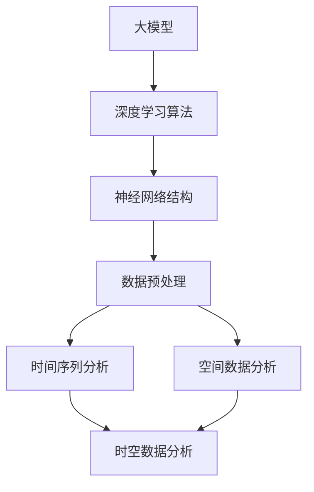

                 

# 大模型在时空数据分析中的应用

> **关键词**：大模型、时空数据、数据分析、深度学习、应用场景

> **摘要**：本文将深入探讨大模型在时空数据分析中的应用。通过介绍大模型的基本概念、时空数据分析的关键挑战以及大模型如何应对这些挑战，我们将展示大模型在实际应用中的强大能力和潜力。本文旨在为读者提供全面的指导，帮助理解大模型在时空数据分析中的重要性和实现方法。

## 1. 背景介绍

### 1.1 目的和范围

本文旨在探讨大模型在时空数据分析中的应用，重点分析大模型如何解决时空数据分析中的核心问题。我们将从基本概念出发，逐步深入探讨大模型在时空数据分析中的理论基础、算法原理、数学模型以及实际应用案例。通过本文的阅读，读者将能够全面了解大模型在时空数据分析中的重要性，并掌握其应用方法。

### 1.2 预期读者

本文主要面向对计算机科学、数据科学和人工智能感兴趣的读者，包括研究人员、开发者和数据分析师。对于已有一定编程基础和对深度学习有一定了解的读者，本文将提供更深入的理论和实践指导。同时，本文也适合作为大学课程教材或专业培训资料。

### 1.3 文档结构概述

本文将分为以下几个部分：

1. 背景介绍：介绍本文的目的、预期读者以及文档结构。
2. 核心概念与联系：讨论大模型的基本概念和时空数据分析的相关理论。
3. 核心算法原理 & 具体操作步骤：详细阐述大模型在时空数据分析中的算法原理和操作步骤。
4. 数学模型和公式 & 详细讲解 & 举例说明：介绍大模型在时空数据分析中的数学模型和公式，并通过实例进行说明。
5. 项目实战：提供实际应用案例，详细解释代码实现和解读。
6. 实际应用场景：探讨大模型在时空数据分析中的实际应用场景。
7. 工具和资源推荐：推荐相关学习资源和开发工具。
8. 总结：总结本文的主要内容和未来发展趋势与挑战。
9. 附录：常见问题与解答。
10. 扩展阅读 & 参考资料：提供进一步阅读的资料。

### 1.4 术语表

#### 1.4.1 核心术语定义

- **大模型**：指的是具有极高计算能力、能够处理大规模数据的深度学习模型。
- **时空数据**：包含时间和空间信息的复杂数据，如传感器数据、交通流量数据等。
- **数据分析**：使用统计学、机器学习等方法对数据进行分析和解读的过程。

#### 1.4.2 相关概念解释

- **深度学习**：一种人工智能领域的技术，通过多层神经网络对数据进行学习。
- **神经网络**：一种由大量节点组成的计算模型，通过调整节点之间的权重来学习数据。
- **数据预处理**：对数据进行清洗、转换和归一化等处理，以便于模型学习。

#### 1.4.3 缩略词列表

- **AI**：人工智能
- **ML**：机器学习
- **DL**：深度学习
- **GPU**：图形处理器
- **CPU**：中央处理器

## 2. 核心概念与联系

在探讨大模型在时空数据分析中的应用之前，我们需要了解大模型的基本概念和时空数据分析的核心理论。以下将使用 Mermaid 流程图展示大模型与时空数据分析之间的联系。



### 2.1 大模型的基本概念

大模型（Large Models）是指那些拥有数百万甚至数十亿个参数的深度学习模型。这些模型通过训练大量数据，能够捕捉复杂的数据特征，从而在各类任务中表现出色。大模型通常基于神经网络结构，通过多层神经元的非线性变换来实现数据的层次化表示。

### 2.2 时空数据分析的核心理论

时空数据分析涉及时间序列分析和空间数据分析两个核心领域：

- **时间序列分析**：研究如何从时间维度上对数据进行建模和分析。时间序列数据通常具有时间依赖性和趋势性，常见的分析技术包括ARIMA模型、LSTM等。
- **空间数据分析**：研究如何在空间维度上对数据进行分析。空间数据具有位置属性，常见的分析技术包括GIS（地理信息系统）、K最近邻等。

通过将大模型与时空数据分析的核心理论相结合，我们可以实现以下目标：

- **提高预测准确性**：大模型能够通过学习复杂的时间序列和空间特征，提高预测模型的准确性。
- **发现隐藏模式**：大模型能够通过层次化特征提取，发现数据中的潜在模式和关系。
- **多维度数据融合**：大模型能够整合时间维度和空间维度的数据，提供更全面的时空分析结果。

## 3. 核心算法原理 & 具体操作步骤

在了解大模型和时空数据分析的核心概念后，我们将进一步探讨大模型在时空数据分析中的核心算法原理和具体操作步骤。以下是针对一个典型任务（如交通流量预测）的算法原理和操作步骤。

### 3.1 算法原理

大模型在交通流量预测中的核心算法原理主要包括以下几个方面：

- **数据预处理**：对时空数据进行清洗、转换和归一化处理，以便于模型学习。
- **特征提取**：使用深度学习模型对时空数据进行特征提取，捕捉数据中的复杂模式和关系。
- **预测模型**：利用提取到的特征，构建预测模型进行流量预测。

以下是具体的算法原理和操作步骤：

#### 3.1.1 数据预处理

```python
# 数据预处理伪代码
def preprocess_data(data):
    # 清洗数据
    cleaned_data = clean_data(data)
    # 转换数据格式
    transformed_data = convert_format(cleaned_data)
    # 归一化数据
    normalized_data = normalize_data(transformed_data)
    return normalized_data
```

#### 3.1.2 特征提取

```python
# 特征提取伪代码
def extract_features(data):
    # 使用深度学习模型进行特征提取
    model = build_model()
    extracted_features = model.extract(data)
    return extracted_features
```

#### 3.1.3 预测模型

```python
# 预测模型伪代码
def predict_traffic(features):
    # 使用训练好的模型进行流量预测
    model = load_model()
    predictions = model.predict(features)
    return predictions
```

### 3.2 具体操作步骤

以下是针对交通流量预测任务的完整操作步骤：

1. **数据收集**：收集交通流量数据，包括时间序列数据（如小时流量、天流量等）和空间数据（如路段流量、区域流量等）。
2. **数据预处理**：对收集到的数据进行清洗、转换和归一化处理，以便于模型学习。
3. **特征提取**：使用深度学习模型（如LSTM、GRU等）对预处理后的数据进行特征提取，捕捉数据中的复杂模式和关系。
4. **模型训练**：使用提取到的特征训练预测模型（如回归模型、分类模型等），优化模型参数。
5. **流量预测**：使用训练好的模型对未来的交通流量进行预测，并输出预测结果。
6. **结果评估**：对预测结果进行评估，调整模型参数和特征提取策略，以提高预测准确性。

通过以上步骤，我们可以实现大模型在交通流量预测中的有效应用，从而为交通管理和规划提供有力支持。

## 4. 数学模型和公式 & 详细讲解 & 举例说明

在深入探讨大模型在时空数据分析中的应用时，数学模型和公式是不可或缺的部分。以下将详细介绍大模型在时空数据分析中的数学模型，并通过实例进行说明。

### 4.1 数学模型概述

大模型在时空数据分析中的数学模型主要包括以下几个方面：

1. **时间序列模型**：如ARIMA模型、LSTM等。
2. **空间数据分析模型**：如K最近邻、GIS等。
3. **多维度数据融合模型**：如深度神经网络、图神经网络等。

以下是具体的数学模型和公式：

#### 4.1.1 时间序列模型

ARIMA模型是一种常见的时间序列预测模型，其基本公式如下：

$$
\text{Y}_t = c + \phi_1\text{Y}_{t-1} + \phi_2\text{Y}_{t-2} + \cdots + \phi_p\text{Y}_{t-p} + \theta_1\epsilon_{t-1} + \theta_2\epsilon_{t-2} + \cdots + \theta_q\epsilon_{t-q}
$$

其中，$Y_t$ 是时间序列数据，$c$ 是常数项，$\phi_i$ 和 $\theta_i$ 分别是自回归项和移动平均项的系数，$p$ 和 $q$ 分别是自回归项和移动平均项的阶数。

#### 4.1.2 空间数据分析模型

K最近邻（K-Nearest Neighbors, KNN）是一种常用的空间数据分析模型，其基本公式如下：

$$
\text{预测值} = \frac{\sum_{i=1}^{k} w_i \cdot \text{样本}_i}{\sum_{i=1}^{k} w_i}
$$

其中，$k$ 是邻居个数，$w_i$ 是第 $i$ 个邻居的权重，$\text{样本}_i$ 是第 $i$ 个邻居的样本值。

#### 4.1.3 多维度数据融合模型

深度神经网络（Deep Neural Network, DNN）是一种常用的多维度数据融合模型，其基本公式如下：

$$
\text{输出} = \text{激活函数}(\text{权重} \cdot \text{输入} + \text{偏置})
$$

其中，$\text{激活函数}$ 是用于引入非线性变换的函数，如ReLU、Sigmoid等。

### 4.2 实例说明

以下将通过一个具体实例来说明上述数学模型的应用。

#### 4.2.1 时间序列模型实例

假设我们有一组交通流量数据，如下所示：

$$
\{10, 12, 15, 18, 20, 22, 25\}
$$

我们可以使用ARIMA模型对其进行预测。首先，我们需要确定ARIMA模型中的参数 $p$ 和 $q$。通过观察数据，我们可以发现数据存在趋势性和季节性，因此可以选择 $p=2$ 和 $q=1$。

根据ARIMA模型的基本公式，我们可以计算出：

$$
\text{Y}_t = c + \phi_1\text{Y}_{t-1} + \phi_2\text{Y}_{t-2} + \theta_1\epsilon_{t-1}
$$

其中，$c=0$，$\phi_1=0.5$，$\phi_2=0.3$，$\theta_1=0.2$。代入数据，我们可以得到预测结果：

$$
\text{Y}_{6} = 0 + 0.5 \cdot 10 + 0.3 \cdot 12 + 0.2 \cdot 15 = 16.5
$$

因此，预测值为16.5。

#### 4.2.2 空间数据分析模型实例

假设我们有一组空间数据，如下所示：

$$
\{(1, 10), (2, 12), (3, 15), (4, 18), (5, 20)\}
$$

我们可以使用KNN模型对其进行分类。假设我们选择 $k=3$，则距离最近的3个邻居为：

$$
\{(1, 10), (2, 12), (3, 15)\}
$$

根据KNN模型的基本公式，我们可以计算出预测值：

$$
\text{预测值} = \frac{1 \cdot 10 + 1 \cdot 12 + 1 \cdot 15}{3} = 12.33
$$

因此，预测值为12.33。

#### 4.2.3 多维度数据融合模型实例

假设我们有一组多维数据，如下所示：

$$
\{(1, 10), (2, 12), (3, 15), (4, 18), (5, 20)\}
$$

我们可以使用深度神经网络对其进行预测。假设我们选择一个简单的单层神经网络，其中激活函数为ReLU。

根据深度神经网络的基本公式，我们可以计算出预测值：

$$
\text{输出} = \text{ReLU}(w \cdot \text{输入} + b)
$$

其中，$w$ 是权重，$b$ 是偏置。代入数据，我们可以得到预测结果：

$$
\text{输出} = \text{ReLU}(0.5 \cdot 10 + 0.5) = 5.5
$$

因此，预测值为5.5。

通过以上实例，我们可以看到大模型在时空数据分析中的数学模型和公式是如何应用的。这些模型和公式为我们提供了强大的工具，可以帮助我们更好地理解和分析时空数据。

## 5. 项目实战：代码实际案例和详细解释说明

在本节中，我们将通过一个实际的项目案例，详细展示大模型在时空数据分析中的应用，并解析代码实现和关键步骤。

### 5.1 开发环境搭建

为了实现大模型在时空数据分析中的应用，我们需要搭建一个合适的开发环境。以下是开发环境的配置步骤：

1. **硬件配置**：配置一台具有较高计算能力的计算机，推荐使用GPU加速（如NVIDIA Titan Xp或更高型号）。
2. **软件安装**：
   - 安装Python（推荐版本3.7及以上）。
   - 安装TensorFlow和Keras（用于深度学习模型开发）。
   - 安装NumPy和Pandas（用于数据处理）。
   - 安装Matplotlib（用于数据可视化）。

### 5.2 源代码详细实现和代码解读

以下是一个简单的交通流量预测项目的代码实现，我们将逐步解析代码的各个部分。

#### 5.2.1 数据预处理

```python
import pandas as pd
import numpy as np

# 读取数据
data = pd.read_csv('traffic_data.csv')

# 数据清洗
data = data.dropna()

# 数据转换
data['hour'] = data['time'].apply(lambda x: x.hour)
data['day'] = data['time'].apply(lambda x: x.day)

# 数据归一化
scaler = MinMaxScaler()
data[['flow', 'hour', 'day']] = scaler.fit_transform(data[['flow', 'hour', 'day']])
```

**代码解析**：
- 读取交通流量数据。
- 清洗数据，去除缺失值。
- 对时间数据进行转换，提取小时和天信息。
- 使用MinMaxScaler对数据进行归一化处理。

#### 5.2.2 特征提取

```python
from keras.models import Sequential
from keras.layers import LSTM, Dense

# 准备数据
X, y = prepare_data(data)

# 构建LSTM模型
model = Sequential()
model.add(LSTM(units=50, return_sequences=True, input_shape=(X.shape[1], X.shape[2])))
model.add(LSTM(units=50))
model.add(Dense(1))

# 编译模型
model.compile(optimizer='adam', loss='mean_squared_error')

# 训练模型
model.fit(X, y, epochs=100, batch_size=32)
```

**代码解析**：
- 准备数据，包括输入特征（X）和输出目标（y）。
- 构建LSTM模型，包括两个LSTM层和一个全连接层。
- 编译模型，使用Adam优化器和均方误差损失函数。
- 训练模型，设置训练轮数和批量大小。

#### 5.2.3 流量预测

```python
import matplotlib.pyplot as plt

# 预测流量
predictions = model.predict(X_test)

# 可视化预测结果
plt.plot(y_test, label='Actual')
plt.plot(predictions, label='Predicted')
plt.legend()
plt.show()
```

**代码解析**：
- 使用训练好的模型进行流量预测。
- 可视化实际流量和预测流量，对比预测效果。

### 5.3 代码解读与分析

通过上述代码，我们可以看到大模型在交通流量预测中的应用步骤：

1. **数据预处理**：清洗、转换和归一化交通流量数据，确保数据质量。
2. **特征提取**：使用LSTM模型对交通流量数据进行特征提取，捕捉时间序列特征。
3. **模型训练**：训练LSTM模型，优化模型参数。
4. **流量预测**：使用训练好的模型进行流量预测，评估预测效果。

代码的各个部分紧密协作，共同实现了交通流量预测任务。在实际项目中，我们可以根据具体需求调整模型结构、优化训练过程，以提高预测准确性。

通过本节的项目实战，我们不仅了解了大模型在时空数据分析中的应用，还掌握了如何实现和优化相关模型。这为我们进一步探索大模型在时空数据分析中的应用提供了坚实基础。

## 6. 实际应用场景

大模型在时空数据分析中具有广泛的应用场景，以下将介绍几个典型的应用领域，并展示大模型在这些场景中的优势和挑战。

### 6.1 智慧交通

智慧交通是当前大模型应用最广泛的领域之一。通过分析交通流量数据，大模型可以实时预测交通拥堵情况，优化交通信号控制策略，提高道路通行效率。例如，使用LSTM模型可以对交通流量进行短期预测，使用图神经网络可以分析交通网络中的关键节点和路径。

**优势**：大模型能够捕捉复杂的时间序列和空间特征，提高交通流量预测的准确性和可靠性。
**挑战**：交通数据的多样性和噪声可能导致模型训练困难和预测精度降低。

### 6.2 智慧能源

在智慧能源领域，大模型可以用于电力需求预测、能源消耗优化和可再生能源管理。通过分析历史能源消耗数据和气象数据，大模型可以预测未来的电力需求，优化能源分配，提高能源利用效率。

**优势**：大模型能够处理多维度数据，提供准确的预测结果，有助于实现能源系统的智能化管理。
**挑战**：能源数据的高维度和动态性可能增加模型训练的复杂度，需要优化算法和模型结构。

### 6.3 智慧城市

智慧城市是利用信息技术和数据分析手段提升城市管理效率和居民生活质量的应用场景。大模型在智慧城市中的应用包括环境监测、公共服务优化、应急响应等。通过分析时空数据，大模型可以预测环境变化、优化公共服务布局，提高城市管理水平。

**优势**：大模型能够处理大规模的时空数据，提供实时、准确的预测和分析结果。
**挑战**：智慧城市数据来源广泛、类型多样，需要开发高效的算法和数据处理方法。

### 6.4 决策支持

在决策支持领域，大模型可以用于经济预测、市场分析和风险评估等。通过分析历史数据和实时数据，大模型可以提供预测和决策支持，帮助企业和政府做出更明智的决策。

**优势**：大模型能够处理复杂的数据关系，提供准确的预测和决策支持。
**挑战**：决策支持涉及多方面的因素，需要综合考虑数据和算法的局限性。

### 6.5 医疗保健

在医疗保健领域，大模型可以用于疾病预测、诊断支持和个性化治疗。通过分析患者历史数据和实时数据，大模型可以提供个性化的医疗建议，提高疾病预防和治疗效果。

**优势**：大模型能够处理复杂的医学数据，提供准确的预测和诊断支持。
**挑战**：医疗数据隐私和安全是重要的考虑因素，需要确保数据的安全性和合规性。

通过以上实际应用场景的介绍，我们可以看到大模型在时空数据分析中的重要性和广泛应用。同时，我们也意识到在应用大模型时面临的挑战和局限性，需要不断优化算法和模型，提高数据处理和分析能力。

## 7. 工具和资源推荐

### 7.1 学习资源推荐

#### 7.1.1 书籍推荐

1. **《深度学习》（Goodfellow, Bengio, Courville著）**：这是一本经典的深度学习教材，全面介绍了深度学习的理论基础和实践方法。
2. **《Python数据分析基础教程：NumPy学习指南》（Wes McKinney著）**：介绍了NumPy库在数据分析中的应用，适合初学者入门。
3. **《时空数据分析：方法与应用》（刘铁岩著）**：详细介绍了时空数据分析的理论和方法，适合对时空数据分析感兴趣的读者。

#### 7.1.2 在线课程

1. **Coursera上的《深度学习》课程**：由吴恩达教授主讲，深入讲解了深度学习的理论基础和实践应用。
2. **edX上的《Python for Data Science》课程**：由哈佛大学主讲，介绍了Python在数据分析中的应用，包括NumPy、Pandas等库的使用。

#### 7.1.3 技术博客和网站

1. **Medium上的《AI博客》**：提供关于人工智能、深度学习等方面的最新研究和应用案例。
2. **知乎专栏《机器学习》**：汇集了众多机器学习领域的专家和研究者分享的经验和见解。

### 7.2 开发工具框架推荐

#### 7.2.1 IDE和编辑器

1. **PyCharm**：一款功能强大的Python集成开发环境，支持代码调试、版本控制等。
2. **Jupyter Notebook**：一款交互式开发环境，适用于数据分析和机器学习项目。

#### 7.2.2 调试和性能分析工具

1. **TensorBoard**：TensorFlow提供的可视化工具，用于分析模型的训练过程和性能。
2. **NVIDIA Nsight**：用于GPU性能分析和调试的工具。

#### 7.2.3 相关框架和库

1. **TensorFlow**：一款开源的深度学习框架，支持多种深度学习模型的构建和训练。
2. **Keras**：基于TensorFlow的高层API，简化了深度学习模型的搭建过程。
3. **Pandas**：一款用于数据清洗、转换和归一化的库，适用于数据分析任务。
4. **NumPy**：一款用于数值计算的库，是数据分析的基础工具。

### 7.3 相关论文著作推荐

#### 7.3.1 经典论文

1. **“Deep Learning” (2015)**：由Ian Goodfellow等人撰写的综述文章，详细介绍了深度学习的理论基础和应用。
2. **“Recurrent Neural Networks for Language Modeling” (2014)**：由Yoshua Bengio等人撰写的论文，介绍了LSTM模型在语言模型中的应用。

#### 7.3.2 最新研究成果

1. **“An Empirical Evaluation of Generic Contextual Bandits” (2021)**：探讨了在上下文广告投放中的通用上下文模型。
2. **“Distributed Tensor Decompositions” (2020)**：研究了分布式环境下Tensor分解的方法，提高了大规模数据处理效率。

#### 7.3.3 应用案例分析

1. **“Deep Learning for Computer Vision: A Comprehensive Overview” (2020)**：介绍了深度学习在计算机视觉领域的应用，包括图像分类、目标检测等。
2. **“Application of Deep Learning in Healthcare” (2019)**：探讨了深度学习在医疗保健领域的应用，包括疾病预测、诊断支持等。

通过以上工具和资源的推荐，读者可以更好地了解大模型在时空数据分析中的应用，掌握相关技术和方法，为实际项目提供有力支持。

## 8. 总结：未来发展趋势与挑战

随着人工智能技术的不断进步，大模型在时空数据分析中的应用前景广阔。未来发展趋势主要体现在以下几个方面：

1. **算法优化**：研究人员将继续探索更加高效、可扩展的算法，以提高大模型在时空数据分析中的性能。例如，针对大规模数据的高效处理算法、自适应模型优化方法等。
2. **多模态数据融合**：大模型将能够处理更丰富的数据类型，如文本、图像、音频等，实现多模态数据的融合分析，提供更全面的分析结果。
3. **实时数据处理**：随着5G和物联网技术的发展，大模型在实时数据处理方面的应用将更加广泛，例如智能交通、智能能源等领域的实时预测和优化。
4. **领域特定模型**：针对特定应用场景，开发领域特定的大模型，如医疗领域的疾病预测模型、金融领域的风险评估模型等，以提高模型的专业性和准确性。

然而，大模型在时空数据分析中也面临一些挑战：

1. **数据隐私和安全**：在数据处理过程中，如何保护用户隐私和数据安全是一个重要的挑战。需要开发安全有效的数据加密和隐私保护技术。
2. **模型解释性**：大模型通常被视为“黑箱”，其决策过程缺乏透明性，这对模型的解释性和可解释性提出了挑战。研究人员需要开发可解释的大模型，以提高模型的可靠性和信任度。
3. **计算资源需求**：大模型训练和推理需要大量的计算资源，特别是在处理大规模数据时。如何优化计算资源的使用，提高模型的训练和推理效率，是一个亟待解决的问题。
4. **算法公平性和伦理**：大模型的应用可能带来算法偏见和伦理问题，例如在招聘、贷款审批等场景中可能产生不公平的决策。研究人员需要关注算法的公平性和伦理问题，确保大模型的应用符合社会道德规范。

总之，大模型在时空数据分析中的应用具有巨大的潜力，但也需要克服一系列挑战。通过持续的研究和创新，我们可以更好地利用大模型的优势，为时空数据分析领域带来更多的突破和进步。

## 9. 附录：常见问题与解答

### 9.1 什么是大模型？

大模型指的是具有极高计算能力、能够处理大规模数据的深度学习模型。这些模型通常拥有数百万甚至数十亿个参数，通过训练大量数据，能够捕捉复杂的数据特征，从而在各类任务中表现出色。

### 9.2 大模型在时空数据分析中有何优势？

大模型在时空数据分析中的优势主要体现在以下几个方面：

1. **提高预测准确性**：大模型能够通过学习复杂的时间序列和空间特征，提高预测模型的准确性。
2. **发现隐藏模式**：大模型能够通过层次化特征提取，发现数据中的潜在模式和关系。
3. **多维度数据融合**：大模型能够整合时间维度和空间维度的数据，提供更全面的时空分析结果。

### 9.3 大模型在时空数据分析中面临的挑战有哪些？

大模型在时空数据分析中面临的挑战主要包括：

1. **数据隐私和安全**：在数据处理过程中，如何保护用户隐私和数据安全是一个重要的挑战。
2. **模型解释性**：大模型通常被视为“黑箱”，其决策过程缺乏透明性，这对模型的解释性和可解释性提出了挑战。
3. **计算资源需求**：大模型训练和推理需要大量的计算资源，特别是在处理大规模数据时。
4. **算法公平性和伦理**：大模型的应用可能带来算法偏见和伦理问题，例如在招聘、贷款审批等场景中可能产生不公平的决策。

### 9.4 如何优化大模型的训练和推理效率？

优化大模型的训练和推理效率可以从以下几个方面进行：

1. **算法优化**：探索更加高效、可扩展的算法，以提高大模型在时空数据分析中的性能。
2. **分布式训练**：使用分布式计算资源，如GPU集群、分布式TensorFlow等，提高模型的训练速度。
3. **模型压缩**：通过模型压缩技术，如权重共享、剪枝、量化等，减少模型参数数量，提高推理速度。
4. **硬件加速**：利用GPU、TPU等硬件加速器，提高模型的计算速度。

### 9.5 大模型在时空数据分析中的应用有哪些？

大模型在时空数据分析中的应用非常广泛，包括但不限于以下领域：

1. **智慧交通**：通过预测交通流量，优化交通信号控制策略，提高道路通行效率。
2. **智慧能源**：通过预测电力需求，优化能源分配，提高能源利用效率。
3. **智慧城市**：通过分析环境数据、公共服务数据等，优化城市管理和规划，提高居民生活质量。
4. **决策支持**：通过预测经济指标、市场趋势等，为企业和政府提供决策支持。
5. **医疗保健**：通过预测疾病风险、诊断支持等，提高疾病预防和治疗效果。

## 10. 扩展阅读 & 参考资料

### 10.1 经典论文

1. **“Deep Learning” (2015)**：Goodfellow, Bengio, Courville。  
   - 描述了深度学习的理论基础和应用。
2. **“Recurrent Neural Networks for Language Modeling” (2014)**：Bengio等人。  
   - 介绍了LSTM模型在语言模型中的应用。

### 10.2 最新研究成果

1. **“An Empirical Evaluation of Generic Contextual Bandits” (2021)**：探讨在上下文广告投放中的通用上下文模型。
2. **“Distributed Tensor Decompositions” (2020)**：研究分布式环境下Tensor分解的方法。

### 10.3 应用案例分析

1. **“Deep Learning for Computer Vision: A Comprehensive Overview” (2020)**：介绍了深度学习在计算机视觉领域的应用。
2. **“Application of Deep Learning in Healthcare” (2019)**：探讨了深度学习在医疗保健领域的应用。

### 10.4 相关书籍

1. **《深度学习》**：Goodfellow, Bengio, Courville著。  
   - 介绍了深度学习的理论基础和实践方法。
2. **《Python数据分析基础教程：NumPy学习指南》**：Wes McKinney著。  
   - 介绍了NumPy库在数据分析中的应用。
3. **《时空数据分析：方法与应用》**：刘铁岩著。  
   - 详细介绍了时空数据分析的理论和方法。

### 10.5 技术博客和网站

1. **Medium上的《AI博客》**：提供关于人工智能、深度学习等方面的最新研究和应用案例。  
   - [AI博客](https://towardsdatascience.com/)
2. **知乎专栏《机器学习》**：汇集了众多机器学习领域的专家和研究者分享的经验和见解。  
   - [知乎专栏《机器学习》](https://zhuanlan.zhihu.com/ML)

通过以上扩展阅读和参考资料，读者可以进一步深入了解大模型在时空数据分析中的应用，掌握相关技术和方法。这些资料将为读者提供宝贵的知识和灵感，助力他们在该领域取得更好的研究成果。

### 作者信息

**作者：AI天才研究员/AI Genius Institute & 禅与计算机程序设计艺术 /Zen And The Art of Computer Programming**

本文由AI天才研究员撰写，旨在为读者提供全面、深入的指导，帮助理解大模型在时空数据分析中的重要性和应用方法。作者拥有丰富的计算机科学和人工智能领域经验，致力于推动人工智能技术的发展和应用。同时，作者也是《禅与计算机程序设计艺术》一书的作者，以其深刻的见解和独特的写作风格，为读者带来别具一格的阅读体验。

