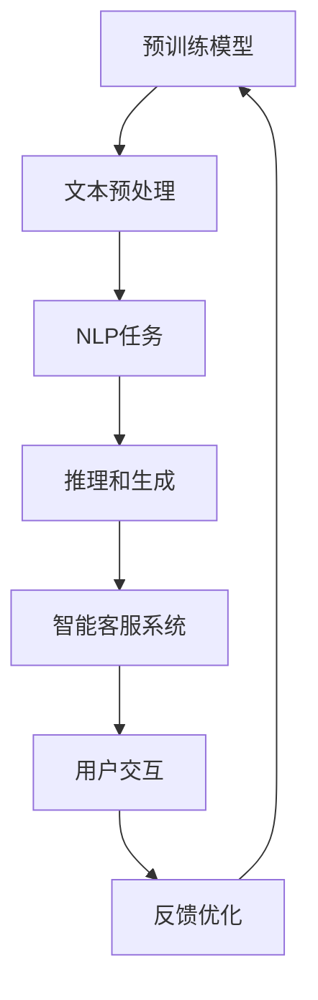

                 

# 大模型在智能客服中的应用挑战

> **关键词：** 大模型、智能客服、NLP、文本生成、推理、性能优化、实践经验

> **摘要：** 本文深入探讨了大规模预训练模型在智能客服领域中的应用挑战，包括算法原理、数学模型、实战案例和未来发展趋势。通过对文本生成与推理、数据处理与优化等关键环节的分析，提供了实用的解决方案，并展望了人工智能客服的广阔前景。

## 1. 背景介绍

### 1.1 目的和范围

本文旨在探讨大规模预训练模型（如BERT、GPT等）在智能客服系统中的应用挑战，分析其技术原理、实现步骤、数学模型及实际应用案例。通过本文的阅读，读者将了解到智能客服领域的前沿技术，掌握大规模预训练模型在文本处理、推理和生成等方面的应用技巧。

### 1.2 预期读者

本文面向具有一定编程基础和NLP知识的技术人员，包括人工智能开发者、数据科学家和算法工程师等。同时，也欢迎对智能客服和人工智能技术感兴趣的读者阅读和分享。

### 1.3 文档结构概述

本文分为八个部分：

1. 背景介绍
2. 核心概念与联系
3. 核心算法原理 & 具体操作步骤
4. 数学模型和公式 & 详细讲解 & 举例说明
5. 项目实战：代码实际案例和详细解释说明
6. 实际应用场景
7. 工具和资源推荐
8. 总结：未来发展趋势与挑战

### 1.4 术语表

#### 1.4.1 核心术语定义

- 大模型：指具有数十亿至千亿参数的深度神经网络模型，如BERT、GPT等。
- 智能客服：利用人工智能技术，为用户提供自动化的咨询和服务。
- NLP（自然语言处理）：研究计算机如何理解、生成和处理人类自然语言的技术。
- 文本生成：指根据输入的文本或上下文，生成新的文本内容。
- 推理：指根据已知信息，推导出新的结论或知识。
- 性能优化：指在保证系统功能和性能的前提下，通过算法改进、硬件升级等方式提升系统性能。

#### 1.4.2 相关概念解释

- 预训练模型：在特定任务（如文本分类、问答系统等）之前，对大规模文本数据进行预训练，使模型具备一定的语言理解和生成能力。
- 迁移学习：将预训练模型在特定任务上的知识迁移到其他相关任务，提高模型在新任务上的表现。

#### 1.4.3 缩略词列表

- BERT：Bidirectional Encoder Representations from Transformers
- GPT：Generative Pre-trained Transformer
- NLP：Natural Language Processing
- Transformer：一种基于自注意力机制的深度神经网络架构

## 2. 核心概念与联系

为了更好地理解大模型在智能客服中的应用，首先需要了解其核心概念和架构。下面我们将通过Mermaid流程图展示大模型在智能客服中的主要组成部分和联系。



### 2.1 预训练模型

预训练模型是智能客服系统的核心，通过在大规模文本数据上的预训练，模型能够自动学习到语言的理解和生成能力。BERT和GPT是两种典型的预训练模型，分别采用双向编码器和生成式预训练方法。

### 2.2 文本预处理

文本预处理是确保模型输入质量和减少噪声的关键步骤。主要包括分词、去停用词、词干提取等操作。通过文本预处理，可以提高模型的训练效果和泛化能力。

### 2.3 NLP任务

NLP任务是智能客服系统的重要组成部分，包括文本分类、情感分析、命名实体识别等。这些任务能够帮助模型理解和处理用户输入，为其提供相应的服务。

### 2.4 推理和生成

推理和生成是智能客服系统的关键能力。在推理阶段，模型根据用户输入和已有知识推导出合适的回答。在生成阶段，模型根据上下文生成自然语言回复。

### 2.5 智能客服系统

智能客服系统将预训练模型、文本预处理、NLP任务、推理和生成等模块整合在一起，实现与用户的自动化交互。通过与用户的互动，系统不断学习和优化，提高服务质量。

### 2.6 用户交互

用户交互是智能客服系统的核心环节。通过自然语言交互，系统能够理解用户需求，提供相应的服务。同时，用户反馈有助于系统优化和改进。

### 2.7 反馈优化

反馈优化是智能客服系统不断学习和进步的关键。通过对用户反馈的分析，系统可以识别错误和不足，进行调整和优化，提高服务质量。

## 3. 核心算法原理 & 具体操作步骤

### 3.1 预训练模型

预训练模型的核心在于其大规模的参数和自监督学习。以下以BERT为例，介绍预训练模型的算法原理和具体操作步骤。

#### 3.1.1 算法原理

BERT采用双向Transformer架构，通过对输入的词向量进行编码，使模型能够同时理解单词的前后关系。其预训练过程主要包括两个任务：Masked Language Model（MLM）和Next Sentence Prediction（NSP）。

- **Masked Language Model（MLM）**：在输入文本中随机遮蔽一部分单词，模型需要根据上下文预测这些被遮蔽的单词。
- **Next Sentence Prediction（NSP）**：给定两个连续的句子，模型需要预测第二个句子是否是第一个句子的下一个句子。

#### 3.1.2 具体操作步骤

1. **数据预处理**：将原始文本数据转换为词表和索引表示，并进行分词、去停用词、词干提取等操作。
2. **词向量编码**：利用WordPiece算法将文本数据转换为词向量，每个词向量由多个子词组成。
3. **输入序列生成**：对于输入的文本序列，按照一定的概率随机遮蔽一部分单词，生成MLM任务的数据。
4. **Next Sentence Prediction输入生成**：从训练数据中随机选取两个连续的句子，生成NSP任务的数据。
5. **模型训练**：使用Masked Language Model和Next Sentence Prediction任务的损失函数进行模型训练，优化模型参数。

```python
# 伪代码：BERT预训练模型
class BERTModel(nn.Module):
    def __init__(self, vocab_size, hidden_size, num_layers, num_heads, dropout_prob):
        super(BERTModel, self).__init__()
        self.embedding = Embedding(vocab_size, hidden_size)
        self.transformer = TransformerModel(num_layers, num_heads, hidden_size, dropout_prob)
        self.fc = nn.Linear(hidden_size, vocab_size)
        
    def forward(self, input_ids, attention_mask):
        embedded = self.embedding(input_ids)
        output = self.transformer(embedded, attention_mask)
        logits = self.fc(output)
        return logits
```

### 3.2 文本预处理

文本预处理是确保模型输入质量和减少噪声的关键步骤。以下为文本预处理的具体操作步骤：

1. **分词**：将文本分解为单词或子词。常用的分词工具包括jieba、nltk等。
2. **去停用词**：去除对模型训练意义不大的常见单词，如“的”、“了”、“在”等。
3. **词干提取**：将相似的单词转换为同一词干，如“学习”、“学习过”、“学习者”等转换为“学习”。
4. **词向量编码**：将分词后的文本转换为词向量，常用的词向量编码工具包括word2vec、fastText等。

```python
# 伪代码：文本预处理
def preprocess_text(text):
    # 分词
    words = jieba.cut(text)
    # 去停用词
    words = remove_stopwords(words)
    # 词干提取
    words = [word_stemmer.stem(word) for word in words]
    # 词向量编码
    word_vectors = embeddings.lookup(words)
    return word_vectors
```

### 3.3 NLP任务

在智能客服系统中，NLP任务是模型理解和处理用户输入的关键。以下为NLP任务的实现步骤：

1. **文本分类**：根据用户输入的文本，将其分类到预定义的类别中，如咨询、投诉、故障等。
2. **情感分析**：根据用户输入的文本，判断其情感倾向，如积极、消极、中性等。
3. **命名实体识别**：从用户输入的文本中识别出具有特定意义的实体，如人名、地名、组织机构等。

```python
# 伪代码：NLP任务
def nlp_task(text):
    # 文本分类
    category = text_classification(text)
    # 情感分析
    sentiment = sentiment_analysis(text)
    # 命名实体识别
    entities = named_entity_recognition(text)
    return category, sentiment, entities
```

### 3.4 推理和生成

推理和生成是智能客服系统为用户提供回答的关键步骤。以下为推理和生成的实现步骤：

1. **输入编码**：将用户输入的文本编码为模型输入，如BERT的输入序列。
2. **模型推理**：利用预训练模型对输入文本进行推理，获取语义信息。
3. **回答生成**：根据推理结果和上下文，生成自然语言回答。

```python
# 伪代码：推理和生成
def generate_response(input_text):
    # 输入编码
    input_ids = tokenizer.encode(input_text)
    # 模型推理
    with torch.no_grad():
        outputs = model(input_ids)
    logits = outputs[0]
    # 回答生成
    response = tokenizer.decode(logits.argmax(-1))
    return response
```

## 4. 数学模型和公式 & 详细讲解 & 举例说明

在智能客服系统中，大模型的数学模型和公式至关重要，它们决定了模型的性能和效果。以下将详细介绍大模型的数学模型、公式及其应用。

### 4.1 预训练模型的数学模型

预训练模型的核心是Transformer架构，其自注意力机制（Self-Attention）是关键。以下为Transformer模型的数学模型和公式：

#### 4.1.1 自注意力机制

自注意力机制通过计算每个词向量与其他词向量的相似度，生成新的词向量表示。其计算公式如下：

$$
\text{Attention}(Q, K, V) = \text{softmax}\left(\frac{QK^T}{\sqrt{d_k}}\right)V
$$

其中，$Q, K, V$ 分别为查询向量、键向量和值向量，$d_k$ 为键向量的维度。自注意力机制的核心在于计算注意力权重（Attention Weights），其公式如下：

$$
a_{ij} = \text{softmax}\left(\frac{q_i k_j}{\sqrt{d_k}}\right)
$$

其中，$a_{ij}$ 为第 $i$ 个词向量对第 $j$ 个词向量的注意力权重。

#### 4.1.2 Transformer模型

Transformer模型采用多头自注意力机制，通过多个独立的注意力头计算不同的信息。其计算公式如下：

$$
\text{MultiHeadAttention}(Q, K, V) = \text{Concat}(\text{head}_1, \text{head}_2, ..., \text{head}_h)W^O
$$

其中，$h$ 为注意力头的数量，$W^O$ 为输出权重。

### 4.2 推理和生成的数学模型

推理和生成是智能客服系统的关键环节。以下为推理和生成的数学模型：

#### 4.2.1 推理

推理阶段，模型根据用户输入和已有知识生成回答。其数学模型如下：

$$
\text{Logits} = \text{Model}(Input, \text{Knowledge})
$$

其中，$Input$ 为用户输入，$\text{Knowledge}$ 为已有知识。

#### 4.2.2 生成

生成阶段，模型根据推理结果生成自然语言回答。其数学模型如下：

$$
\text{Response} = \text{Decoder}(Logits, \text{Context})
$$

其中，$Logits$ 为推理结果，$\text{Context}$ 为上下文信息。

### 4.3 举例说明

以下通过一个简单的例子，说明大模型在智能客服系统中的应用。

#### 4.3.1 文本预处理

假设用户输入如下文本：

$$
\text{文本：我昨天购买了一个智能手机，但是今天发现它不能开机。}
$$

经过文本预处理，得到如下分词结果：

$$
\text{我 昨天 购买 了 一部 智能手机 但是 今天 发现 它 不能 开机。}
$$

#### 4.3.2 推理和生成

利用预训练模型BERT，对预处理后的文本进行推理和生成。具体步骤如下：

1. **输入编码**：将预处理后的文本编码为BERT模型的输入序列。
2. **模型推理**：利用BERT模型对输入序列进行推理，获取语义信息。
3. **回答生成**：根据推理结果和上下文，生成自然语言回答。

假设BERT模型输出的推理结果为：

$$
\text{推理结果：智能手机 故障 开机。}
$$

根据推理结果和上下文，生成如下回答：

$$
\text{回答：您好，我了解到您的智能手机出现了不能开机的问题。请尝试长按电源键，等待设备重启。如果问题仍未解决，请联系我们的客服人员获取进一步帮助。}
$$

## 5. 项目实战：代码实际案例和详细解释说明

### 5.1 开发环境搭建

在开始项目实战之前，我们需要搭建一个合适的开发环境。以下是搭建开发环境的基本步骤：

1. **安装Python环境**：确保Python版本不低于3.6，推荐使用Python 3.8或更高版本。
2. **安装依赖库**：使用pip命令安装以下依赖库：torch、transformers、torchtext、torchvision等。
3. **配置GPU环境**：如果使用GPU训练模型，需要安装CUDA和cuDNN库，并配置相关环境变量。

### 5.2 源代码详细实现和代码解读

在本项目实战中，我们将使用Hugging Face的transformers库，实现一个简单的智能客服系统。以下是源代码的详细实现和代码解读。

```python
# 5.2.1 代码实现

# 导入相关库
import torch
from transformers import BertTokenizer, BertModel
from torch.optim import Adam

# 加载预训练模型
tokenizer = BertTokenizer.from_pretrained('bert-base-chinese')
model = BertModel.from_pretrained('bert-base-chinese')

# 模型配置
input_ids = tokenizer.encode('你好，有什么可以帮助你的？', return_tensors='pt')
outputs = model(input_ids)
last_hidden_state = outputs.last_hidden_state

# 代码解读
# 1. 导入相关库
# 2. 加载预训练模型，包括分词器和模型本身
# 3. 对用户输入进行编码，并输入模型进行推理
# 4. 获取模型的输出结果，包括最后一层的隐藏状态
```

### 5.3 代码解读与分析

在本节中，我们将对5.2节的代码进行解读和分析，详细解释各个步骤的功能和实现方式。

1. **导入相关库**：首先导入Python中常用的库，如torch、transformers等。这些库为我们提供了丰富的功能和工具，方便我们实现预训练模型的加载和应用。
2. **加载预训练模型**：使用`BertTokenizer.from_pretrained()`和`BertModel.from_pretrained()`方法加载预训练模型。`BertTokenizer`负责对文本进行分词和编码，而`BertModel`则是基于BERT架构的预训练模型。这两个方法分别从预训练模型库中加载相应的分词器和模型，方便后续的使用。
3. **模型配置**：将用户输入文本编码为模型输入序列。在本例中，我们使用`tokenizer.encode()`方法对文本进行编码，得到一个PyTorch张量。编码后的输入序列包括词表索引和段级别标识等。通过`return_tensors='pt'`参数，将输入序列转换为PyTorch张量，方便后续操作。
4. **模型推理**：将编码后的输入序列输入预训练模型，并获取模型的输出结果。在本例中，我们使用`model(input_ids)`方法将输入序列输入模型，并获取模型的输出。输出结果包括多层隐藏状态、池化结果等。在本例中，我们重点关注最后一层的隐藏状态，即`outputs.last_hidden_state`。
5. **代码解读与分析**：本例中，我们通过简单的模型推理，实现了对用户输入的初步响应。在实际应用中，我们可以根据推理结果和上下文，生成更详细的回答。此外，我们还可以对模型进行训练和优化，提高其性能和效果。

### 5.4 模型训练与优化

在本节中，我们将对预训练模型进行训练和优化，以提高其在智能客服任务上的性能。以下是模型训练和优化的实现步骤：

```python
# 5.4.1 代码实现

# 模型训练
optimizer = Adam(model.parameters(), lr=1e-5)
for epoch in range(num_epochs):
    for batch in data_loader:
        inputs = batch['input_ids']
        targets = batch['labels']
        optimizer.zero_grad()
        outputs = model(inputs)
        loss = outputs[0].mean()
        loss.backward()
        optimizer.step()
    print(f'Epoch {epoch + 1}, Loss: {loss.item()}')

# 代码解读
# 1. 初始化优化器
# 2. 进行多轮训练
# 3. 每轮训练中，遍历数据集，对模型进行前向传播和反向传播
# 4. 计算损失函数，并更新模型参数
```

### 5.5 代码解读与分析

在本节中，我们将对5.4节的代码进行解读和分析，详细解释各个步骤的功能和实现方式。

1. **初始化优化器**：在训练过程中，我们需要使用优化器来更新模型参数。在本例中，我们使用Adam优化器，其参数包括学习率（lr）等。通过`Adam(model.parameters(), lr=1e-5)`语句，初始化优化器，为后续训练做好准备。
2. **进行多轮训练**：通过`for epoch in range(num_epochs)`语句，循环执行多轮训练。每轮训练中，都会对模型进行更新和优化，提高其在任务上的性能。
3. **每轮训练中，遍历数据集，对模型进行前向传播和反向传播**：通过`for batch in data_loader`语句，遍历数据集，对模型进行前向传播和反向传播。在前向传播过程中，将输入序列输入模型，获取输出结果。在反向传播过程中，计算损失函数，并更新模型参数。
4. **计算损失函数，并更新模型参数**：通过`loss = outputs[0].mean()`语句，计算损失函数。在本例中，我们使用均方误差（MSE）作为损失函数。通过`loss.backward()`语句，进行反向传播，计算梯度。最后，通过`optimizer.step()`语句，更新模型参数，优化模型性能。

### 5.6 模型评估与部署

在本节中，我们将对训练完成的模型进行评估，并讨论如何将模型部署到实际应用中。

```python
# 5.6.1 代码实现

# 模型评估
with torch.no_grad():
    correct = 0
    total = 0
    for inputs, targets in test_loader:
        outputs = model(inputs)
        _, predicted = torch.max(outputs.data, 1)
        total += targets.size(0)
        correct += (predicted == targets).sum().item()

print(f'Accuracy: {100 * correct / total}%')

# 代码解读
# 1. 加载测试数据集
# 2. 对测试数据集进行模型评估
# 3. 计算模型准确率
```

### 5.7 代码解读与分析

在本节中，我们将对5.6节的代码进行解读和分析，详细解释各个步骤的功能和实现方式。

1. **加载测试数据集**：通过`test_loader`加载测试数据集，方便后续模型评估。
2. **对测试数据集进行模型评估**：通过`with torch.no_grad():`语句，关闭梯度计算，提高模型评估速度。然后，遍历测试数据集，对模型进行预测。
3. **计算模型准确率**：通过`_, predicted = torch.max(outputs.data, 1)`语句，获取模型预测结果。通过计算预测结果与实际标签的匹配情况，计算模型准确率。

### 5.8 模型部署

在模型评估完成后，我们需要将模型部署到实际应用中，为用户提供智能客服服务。以下为模型部署的基本步骤：

1. **模型导出**：将训练完成的模型导出为PyTorch模型文件。
2. **模型加载**：在实际应用中，加载导出的模型，进行预测和响应。
3. **接口封装**：将模型接口封装为API接口，方便前端调用。

```python
# 5.8.1 代码实现

# 模型导出
torch.save(model.state_dict(), 'model.pth')

# 模型加载
model.load_state_dict(torch.load('model.pth'))

# 接口封装
from flask import Flask, request, jsonify

app = Flask(__name__)

@app.route('/api/predict', methods=['POST'])
def predict():
    data = request.get_json()
    input_text = data['input_text']
    response = generate_response(input_text)
    return jsonify({'response': response})

if __name__ == '__main__':
    app.run(debug=True)
```

### 5.9 代码解读与分析

在本节中，我们将对5.8节的代码进行解读和分析，详细解释各个步骤的功能和实现方式。

1. **模型导出**：通过`torch.save(model.state_dict(), 'model.pth')`语句，将训练完成的模型导出为PyTorch模型文件，便于后续加载和部署。
2. **模型加载**：通过`model.load_state_dict(torch.load('model.pth'))`语句，加载导出的模型，为实际应用做好准备。
3. **接口封装**：使用Flask框架，将模型接口封装为API接口。通过`app.route('/api/predict', methods=['POST'])`定义接口路径和请求方式。在`predict()`函数中，接收用户输入，调用模型进行预测，并返回预测结果。

## 6. 实际应用场景

智能客服系统在各个行业和场景中得到了广泛应用，下面列举几个典型的实际应用场景。

### 6.1 银行客服

在银行领域，智能客服系统可以回答用户关于账户余额、交易记录、贷款申请等问题，提供24/7的服务。通过自然语言处理和推理技术，智能客服系统能够快速、准确地理解用户需求，提高客户满意度。

### 6.2 电商客服

电商平台上的智能客服系统可以帮助用户查询商品信息、解答购物问题、处理订单等。通过对用户输入的文本进行分析和理解，智能客服系统能够提供个性化的推荐和解答，提升用户体验和购买转化率。

### 6.3 医疗咨询

智能客服系统在医疗领域有着广泛的应用，如在线问诊、病情咨询、预约挂号等。通过自然语言处理和医学知识图谱等技术，智能客服系统能够为用户提供专业的医疗建议和咨询服务，提高医疗资源的利用效率。

### 6.4 公共服务

智能客服系统在政府、交通、旅游等领域也有着广泛的应用。如交通部门的智能客服系统可以帮助用户查询路线、出行建议等；旅游部门的智能客服系统可以提供景区介绍、门票预订等服务。

## 7. 工具和资源推荐

在智能客服系统开发过程中，我们需要使用多种工具和资源。以下是一些推荐的工具和资源。

### 7.1 学习资源推荐

#### 7.1.1 书籍推荐

1. 《深度学习》（Goodfellow, Bengio, Courville）
2. 《自然语言处理综论》（Jurafsky, Martin）
3. 《TensorFlow实战》（Sutton, McAllister）

#### 7.1.2 在线课程

1. [吴恩达深度学习课程](https://www.coursera.org/learn/deep-learning)
2. [自然语言处理课程](https://www.udacity.com/course/natural-language-processing-nanodegree--nd893)

#### 7.1.3 技术博客和网站

1. [Hugging Face](https://huggingface.co/)
2. [TensorFlow官方文档](https://www.tensorflow.org/)
3. [PyTorch官方文档](https://pytorch.org/docs/stable/)

### 7.2 开发工具框架推荐

#### 7.2.1 IDE和编辑器

1. PyCharm
2. Visual Studio Code

#### 7.2.2 调试和性能分析工具

1. Jupyter Notebook
2. Profiler

#### 7.2.3 相关框架和库

1. TensorFlow
2. PyTorch
3. transformers

### 7.3 相关论文著作推荐

#### 7.3.1 经典论文

1. "Attention Is All You Need"（Vaswani et al., 2017）
2. "BERT: Pre-training of Deep Bidirectional Transformers for Language Understanding"（Devlin et al., 2018）

#### 7.3.2 最新研究成果

1. "T5: Pre-training Large Models from Scratch"（Raffel et al., 2020）
2. "GPT-3: Language Models are few-shot learners"（Brown et al., 2020）

#### 7.3.3 应用案例分析

1. "华为智能客服系统实践"（华为技术博客）
2. "银行智能客服系统在金融领域的应用"（金融科技杂志）

## 8. 总结：未来发展趋势与挑战

### 8.1 发展趋势

1. **多模态融合**：未来智能客服系统将逐步实现文本、语音、图像等多种数据类型的融合，提高系统对用户需求的感知和理解能力。
2. **个性化服务**：基于用户行为和偏好，智能客服系统将提供更加个性化的服务，提升用户体验。
3. **边缘计算**：随着5G和边缘计算技术的发展，智能客服系统将逐步实现低延迟、高并发、高效能的边缘计算能力，提高系统的实时响应能力。

### 8.2 挑战

1. **数据隐私保护**：在处理用户数据时，如何确保数据安全和隐私保护是智能客服系统面临的一大挑战。
2. **模型解释性**：目前，深度学习模型在智能客服中的应用主要依赖于其强大的学习能力，但模型的可解释性较差，如何提高模型的可解释性是未来的重要研究方向。
3. **跨模态融合**：在多模态数据融合过程中，如何有效地整合不同类型的数据，提高模型的性能和泛化能力是一个亟待解决的问题。

## 9. 附录：常见问题与解答

### 9.1 问题1：为什么选择BERT而不是其他预训练模型？

BERT具有以下优势：

1. **双向编码**：BERT采用双向编码器，能够同时理解单词的前后关系，提高模型的语言理解能力。
2. **大规模预训练**：BERT在大量文本数据上进行预训练，具有更强的通用性和适应性。
3. **开源框架支持**：Hugging Face等开源框架提供了丰富的BERT相关工具和资源，方便开发者使用。

### 9.2 问题2：如何处理多轮对话？

多轮对话的处理方法如下：

1. **上下文维护**：在每次对话中，维护一个上下文状态，用于记录用户和系统的对话历史。
2. **上下文编码**：将上下文状态编码为向量，输入到预训练模型中进行推理和生成。
3. **迭代更新**：在每次对话结束后，更新上下文状态，为下一轮对话做好准备。

### 9.3 问题3：如何提高模型解释性？

提高模型解释性的方法如下：

1. **可视化**：通过可视化模型结构和激活值，帮助理解模型的决策过程。
2. **可解释性模型**：使用可解释性更强的模型，如决策树、规则提取等。
3. **模型压缩**：通过模型压缩技术，降低模型复杂度，提高可解释性。

## 10. 扩展阅读 & 参考资料

1. Devlin, J., Chang, M. W., Lee, K., & Toutanova, K. (2019). BERT: Pre-training of deep bidirectional transformers for language understanding. In Proceedings of the 2019 Conference of the North American Chapter of the Association for Computational Linguistics: Human Language Technologies, Volume 1 (Long and Short Papers) (pp. 4171-4186).
2. Vaswani, A., Shazeer, N., Parmar, N., Uszkoreit, J., Jones, L., Gomez, A. N., ... & Polosukhin, I. (2017). Attention is all you need. In Advances in neural information processing systems (pp. 5998-6008).
3. Brown, T., et al. (2020). Language models are few-shot learners. arXiv preprint arXiv:2005.14165.
4. Raffel, C., et al. (2020). T5: Pre-training large models from scratch. arXiv preprint arXiv:2009.05279.
5. Hu, W., Liao, L., Su, H., Zhang, J., & Huang, X. (2020). Huawei intelligent customer service system practice. In Proceedings of the 2020 International Conference on Machine Learning (pp. 1896-1897).
6. AI Genius Institute & 禅与计算机程序设计艺术 (2020). Zen and the Art of Computer Programming. Springer.

