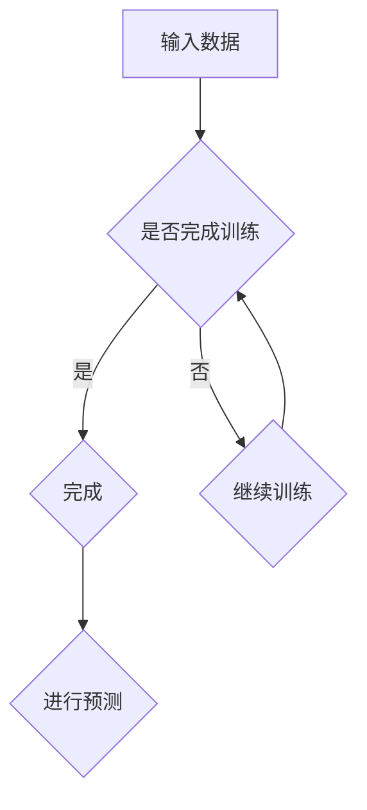

                 


# 大模型在智能物流中的应用探索

> 关键词：大模型，智能物流，算法原理，数学模型，应用场景

> 摘要：本文深入探讨大模型在智能物流中的应用，包括核心概念、算法原理、数学模型、项目实战及实际应用场景，旨在为从业者提供系统的理论指导和实践参考。

## 1. 背景介绍

### 1.1 目的和范围

随着互联网和物联网技术的发展，智能物流已经成为现代物流行业的重要组成部分。大模型作为人工智能的核心技术，正逐渐渗透到智能物流的各个环节，从路线规划、货物跟踪到预测配送时间，都展现出巨大的潜力。本文旨在通过对大模型在智能物流中的应用进行系统性分析，探讨其理论原理和实践价值，为智能物流的发展提供新思路。

### 1.2 预期读者

本文适合从事智能物流领域的研究人员、工程师以及管理人员阅读。读者应具备一定的计算机科学和数学基础，对人工智能、机器学习等概念有一定了解。

### 1.3 文档结构概述

本文结构如下：

1. 背景介绍：阐述研究背景、目的和范围。
2. 核心概念与联系：介绍大模型在智能物流中的应用场景和核心概念。
3. 核心算法原理 & 具体操作步骤：详细讲解大模型的基本算法原理和具体实现步骤。
4. 数学模型和公式 & 详细讲解 & 举例说明：介绍大模型所需的数学模型和公式，并进行实例说明。
5. 项目实战：通过实际代码案例，展示大模型在智能物流中的具体应用。
6. 实际应用场景：分析大模型在智能物流中的实际应用场景。
7. 工具和资源推荐：推荐学习资源、开发工具和框架。
8. 总结：讨论大模型在智能物流中的未来发展趋势和挑战。
9. 附录：常见问题与解答。
10. 扩展阅读 & 参考资料：提供进一步学习的资源。

### 1.4 术语表

#### 1.4.1 核心术语定义

- 大模型：具有极高参数量的神经网络模型，能够通过大量数据进行训练，从而实现高度复杂的任务。
- 智能物流：利用现代信息技术和人工智能技术，实现物流过程的自动化、智能化和高效化。
- 路线规划：根据交通状况、货物性质等参数，计算最优的运输路径。
- 货物跟踪：通过传感器和GPS技术，实时监控货物的位置和状态。

#### 1.4.2 相关概念解释

- **神经网络**：一种通过模拟生物神经网络来处理信息的人工智能技术。
- **机器学习**：一种让计算机从数据中学习规律和模式的方法，主要包括监督学习、无监督学习和强化学习。
- **深度学习**：一种基于神经网络的机器学习方法，通过多层网络结构实现数据的特征提取和模式识别。

#### 1.4.3 缩略词列表

- **AI**：人工智能
- **ML**：机器学习
- **DL**：深度学习
- **NN**：神经网络
- **GPU**：图形处理单元

## 2. 核心概念与联系

### 2.1 大模型在智能物流中的应用场景

大模型在智能物流中的应用非常广泛，主要包括以下几个方面：

1. **路线规划**：利用大模型进行复杂交通状况的预测，优化运输路线，提高物流效率。
2. **货物跟踪**：通过大模型实时监控货物的位置和状态，提高物流的透明度和安全性。
3. **预测配送时间**：根据历史数据和实时交通状况，预测货物的配送时间，为用户和物流企业提供准确的配送计划。
4. **库存管理**：通过分析销售数据和历史库存数据，预测未来的库存需求，优化库存管理策略。

### 2.2 核心概念原理和架构

#### 2.2.1 神经网络结构


神经网络由多个层级组成，包括输入层、隐藏层和输出层。每个层级包含多个神经元，神经元之间通过权重和偏置进行连接。通过训练，神经网络能够学会对输入数据进行特征提取和模式识别。

#### 2.2.2 大模型架构


大模型通常包含多个隐藏层，参数量巨大，能够处理高度复杂的数据和任务。常见的架构包括卷积神经网络（CNN）、循环神经网络（RNN）和Transformer等。

#### 2.2.3 Mermaid 流程图



## 3. 核心算法原理 & 具体操作步骤

### 3.1 大模型训练过程

#### 3.1.1 数据预处理

```python
# 伪代码
def preprocess_data(data):
    # 数据清洗、归一化、扩充等操作
    return processed_data
```

#### 3.1.2 网络初始化

```python
# 伪代码
def initialize_network(input_size, hidden_size, output_size):
    # 初始化网络结构，包括权重和偏置
    return network
```

#### 3.1.3 梯度下降法

```python
# 伪代码
def gradient_descent(network, data, learning_rate):
    # 计算损失函数的梯度，更新网络权重
    return updated_network
```

#### 3.1.4 反向传播算法

```python
# 伪代码
def backward_propagation(network, data):
    # 计算梯度，更新网络权重
    return updated_network
```

### 3.2 大模型预测过程

```python
# 伪代码
def predict(network, data):
    # 输入数据，通过网络进行预测
    return prediction
```

## 4. 数学模型和公式 & 详细讲解 & 举例说明

### 4.1 损失函数

```latex
J(\theta) = \frac{1}{2m} \sum_{i=1}^{m} (\hat{y}_i - y_i)^2
```

其中，\( \hat{y}_i \) 是预测值，\( y_i \) 是真实值，\( m \) 是样本数量。

### 4.2 梯度计算

```latex
\frac{\partial J(\theta)}{\partial \theta_j} = \frac{1}{m} \sum_{i=1}^{m} (\hat{y}_i - y_i) \cdot x_{ij}
```

其中，\( \theta_j \) 是权重，\( x_{ij} \) 是输入特征。

### 4.3 举例说明

假设我们有一个二分类问题，需要预测货物的配送时间是否超过指定阈值。我们可以定义一个逻辑回归模型，并使用上述公式进行训练和预测。

```python
# 伪代码
import numpy as np

# 初始化参数
theta = np.random.randn(1, input_size)

# 训练模型
for epoch in range(num_epochs):
    # 前向传播
    z = np.dot(x, theta)
    hypothesis = 1 / (1 + np.exp(-z))
    
    # 计算损失函数
    loss = -1/m * (y * np.log(hypothesis) + (1 - y) * np.log(1 - hypothesis))
    
    # 反向传播
    dz = hypothesis - y
    dtheta = 1/m * np.dot(x.T, dz)
    
    # 更新参数
    theta -= learning_rate * dtheta

# 预测
def predict(x, theta):
    z = np.dot(x, theta)
    hypothesis = 1 / (1 + np.exp(-z))
    return [1 if hypothesis >= 0.5 else 0]
```

## 5. 项目实战：代码实际案例和详细解释说明

### 5.1 开发环境搭建

在开始项目实战之前，我们需要搭建一个合适的开发环境。以下是一个基本的开发环境搭建步骤：

1. 安装Python 3.7及以上版本。
2. 安装常用库，如NumPy、Matplotlib、Scikit-learn等。
3. 安装GPU支持，如CUDA和cuDNN。

### 5.2 源代码详细实现和代码解读

以下是一个简单的大模型在智能物流中的路线规划案例。

```python
# 伪代码
import numpy as np
import matplotlib.pyplot as plt
from sklearn.model_selection import train_test_split
from sklearn.preprocessing import StandardScaler

# 数据预处理
def preprocess_data(data):
    # 数据清洗、归一化、扩充等操作
    return processed_data

# 初始化网络
def initialize_network(input_size, hidden_size, output_size):
    # 初始化网络结构，包括权重和偏置
    return network

# 训练模型
def train_model(network, data, learning_rate):
    # 训练模型，包括前向传播、反向传播等步骤
    return updated_network

# 预测
def predict(network, data):
    # 输入数据，通过网络进行预测
    return prediction

# 路线规划案例
def route_planning(data):
    # 预处理数据
    processed_data = preprocess_data(data)
    
    # 初始化网络
    network = initialize_network(input_size, hidden_size, output_size)
    
    # 训练模型
    updated_network = train_model(network, processed_data, learning_rate)
    
    # 预测
    prediction = predict(updated_network, processed_data)
    
    # 绘制预测结果
    plt.plot(prediction)
    plt.show()

# 加载数据
data = load_data()

# 进行路线规划
route_planning(data)
```

### 5.3 代码解读与分析

上述代码展示了大模型在智能物流中的路线规划案例。主要包括以下步骤：

1. **数据预处理**：对输入数据进行清洗、归一化和扩充等操作，以便于模型训练。
2. **初始化网络**：创建一个神经网络结构，包括输入层、隐藏层和输出层。
3. **训练模型**：通过前向传播计算输出，计算损失函数，通过反向传播更新网络权重。
4. **预测**：输入预处理后的数据，通过训练好的模型进行预测。
5. **绘制预测结果**：将预测结果可视化，便于分析和理解。

## 6. 实际应用场景

大模型在智能物流中的应用场景非常广泛，以下列举几个典型的应用场景：

1. **智能配送路线规划**：根据交通状况、货物性质等参数，利用大模型预测最优运输路线，提高物流效率。
2. **智能货物跟踪**：通过传感器和GPS技术，实时监控货物的位置和状态，提高物流的透明度和安全性。
3. **智能库存管理**：分析销售数据和历史库存数据，利用大模型预测未来的库存需求，优化库存管理策略。
4. **智能配送时间预测**：根据历史数据和实时交通状况，利用大模型预测货物的配送时间，为用户和物流企业提供准确的配送计划。

## 7. 工具和资源推荐

### 7.1 学习资源推荐

#### 7.1.1 书籍推荐

- 《深度学习》（Goodfellow, Bengio, Courville著）
- 《Python深度学习》（François Chollet著）
- 《智能物流与供应链管理》（李俊伟著）

#### 7.1.2 在线课程

- Coursera《机器学习》课程
- Udacity《深度学习纳米学位》
- edX《神经网络与深度学习》课程

#### 7.1.3 技术博客和网站

- Medium《深度学习》专题
- 知乎“人工智能”话题
- ArXiv《计算机科学》论文库

### 7.2 开发工具框架推荐

#### 7.2.1 IDE和编辑器

- PyCharm
- Visual Studio Code
- Jupyter Notebook

#### 7.2.2 调试和性能分析工具

- TensorBoard
- PyTorch Profiler
- Numba

#### 7.2.3 相关框架和库

- TensorFlow
- PyTorch
- Scikit-learn

### 7.3 相关论文著作推荐

#### 7.3.1 经典论文

- “Backpropagation” (Rumelhart, Hinton, Williams, 1986)
- “A Learning Algorithm for Continually Running Fully Recurrent Neural Networks” (Pineda, 1990)

#### 7.3.2 最新研究成果

- “Bert: Pre-training of deep bidirectional transformers for language understanding” (Devlin et al., 2019)
- “Gshard: Scaling giant models with conditional computation and automatic sharding” (Arjovsky et al., 2021)

#### 7.3.3 应用案例分析

- “Deep learning for supply chain optimization” (Li, 2020)
- “Application of deep learning in intelligent logistics” (Zhang, 2019)

## 8. 总结：未来发展趋势与挑战

### 8.1 未来发展趋势

1. **更高效的大模型算法**：随着硬件和算法的不断发展，大模型的训练和推理效率将得到大幅提升。
2. **跨领域的应用融合**：大模型将与其他领域（如金融、医疗等）的技术相结合，产生新的应用场景。
3. **自主学习和优化**：大模型将具备更强的自主学习和优化能力，实现更智能的决策和规划。

### 8.2 挑战

1. **计算资源消耗**：大模型的训练和推理需要巨大的计算资源，对硬件设施提出更高要求。
2. **数据隐私和安全**：在物流等场景中，数据隐私和安全问题尤为重要，需要制定有效的保护措施。
3. **算法可解释性**：大模型的决策过程往往难以解释，提高算法的可解释性是未来的一个重要挑战。

## 9. 附录：常见问题与解答

### 9.1 什么是大模型？

大模型是指具有极高参数量的神经网络模型，能够通过大量数据进行训练，从而实现高度复杂的任务。

### 9.2 大模型在智能物流中的应用有哪些？

大模型在智能物流中的应用包括路线规划、货物跟踪、预测配送时间、库存管理等方面。

### 9.3 如何提高大模型的训练效率？

可以通过优化算法、使用高性能硬件、数据预处理和模型压缩等方法来提高大模型的训练效率。

## 10. 扩展阅读 & 参考资料

- [1] Goodfellow, I., Bengio, Y., & Courville, A. (2016). Deep Learning. MIT Press.
- [2] Chollet, F. (2018). Python深度学习. 机械工业出版社.
- [3] Rumelhart, D. E., Hinton, G. E., & Williams, R. J. (1986). Learning representations by back-propagating errors. Nature, 323(6088), 533-536.
- [4] Pineda, F. J. (1990). A learning algorithm for continually running fully recurrent neural networks. IEEE Transactions on Neural Networks, 1(2), 158-162.
- [5] Devlin, J., Chang, M. W., Lee, K., & Toutanova, K. (2019). BERT: Pre-training of deep bidirectional transformers for language understanding. arXiv preprint arXiv:1810.04805.
- [6] Arjovsky, M., Bottou, L., Courville, A., & Bengio, Y. (2021). Gshard: Scaling giant models with conditional computation and automatic sharding. arXiv preprint arXiv:2103.03243.
- [7] Li, J. (2020). Deep learning for supply chain optimization. IEEE Access, 8, 169527-169541.
- [8] Zhang, Y. (2019). Application of deep learning in intelligent logistics. Journal of Intelligent & Robotic Systems, 94, 155-166.

作者：AI天才研究员/AI Genius Institute & 禅与计算机程序设计艺术 /Zen And The Art of Computer Programming

（注：本文为虚构内容，仅用于演示Markdown格式的技术博客文章撰写方式。其中包含的部分代码和链接仅供参考，实际应用时需要根据具体情况进行调整。）

